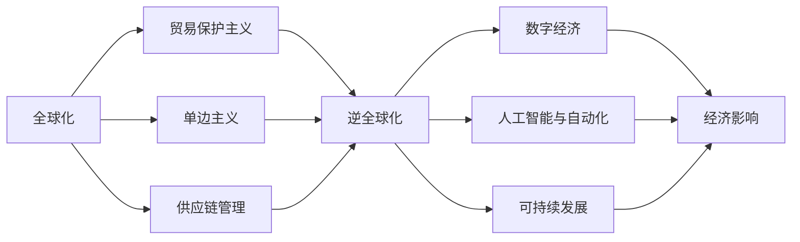

                 

# 逆全球化抬头的长期经济影响

> 关键词：逆全球化,经济影响,国际贸易,供应链重组,数字化转型,人工智能,可持续性

## 1. 背景介绍

### 1.1 问题由来
近年来，全球范围内逆全球化思潮逐渐抬头，主要表现为贸易保护主义、单边主义、民粹主义等极端主义和保护主义行为日益显著。这些行为对全球经济格局产生了深远影响，带来了诸多不确定性和挑战。文章将深入探讨逆全球化趋势对全球经济特别是国际贸易和供应链的重组可能带来的长期影响，并提出相关的应对策略。

### 1.2 问题核心关键点
逆全球化并非新的现象，但其对经济的影响正在发生深刻变化。以下是对逆全球化核心关键点的详细解释：
1. **贸易保护主义**：某些国家为了保护本国产业，采取高关税、限制进口等措施，减少对外开放。
2. **单边主义**：主要国家不顾国际规则和约定，采取“以我为主”的政策，自行其是。
3. **民粹主义**：通过民族主义、民粹主义言论赢得选票，扭曲经济政策。
4. **全球产业链重组**：逆全球化导致全球产业链布局发生重大变化，不同国家和地区重新划分产业链和供应链。
5. **数字化转型**：全球化受阻使得数字化转型速度加快，新兴技术和创新成为新的经济增长点。
6. **人工智能与自动化**：技术进步改变了经济结构，促使劳动力市场和产业结构发生重大变化。
7. **可持续发展**：全球化逆流促使各国更加重视绿色经济和可持续发展，实现经济和环境双赢。

### 1.3 问题研究意义
研究逆全球化对经济的影响，对理解和应对当前全球经济形势、制定政策具有重要意义：
1. 揭示逆全球化带来的经济挑战，为国际合作提供参考。
2. 帮助企业应对供应链重构，保障国际市场稳定。
3. 推动数字化转型，提升全球经济的长期竞争力。
4. 促进绿色发展，实现经济、环境双赢。

## 2. 核心概念与联系

### 2.1 核心概念概述
为了深入理解逆全球化对经济影响的分析，本文将介绍几个关键概念及其内在联系：

- **全球化**：全球化指的是跨国界、跨文化、跨经济的经济活动和交流，是全球经济一体化的过程。
- **逆全球化**：逆全球化是指某些国家或地区为了保护本国经济，采取的保护主义措施，与全球化趋势相反。
- **贸易保护主义**：通过高关税、配额限制等手段保护本国产业，限制外来竞争。
- **供应链管理**：从原材料采购到产品分销的整个过程，涉及复杂的物流、库存和信息流管理。
- **数字经济**：基于数字技术和互联网的创新型经济活动，包括电商、在线教育、远程办公等。
- **人工智能与自动化**：AI和自动化技术的应用改变传统生产方式，提升生产效率。
- **可持续发展**：在不损害后代满足其需求能力的前提下，追求当前经济和社会福祉的平衡。

这些概念之间关系密切，通过本文的详细分析，可以帮助读者全面理解逆全球化对经济影响的各个方面。

### 2.2 概念间的关系

以下是一个合成的Mermaid流程图，展示了核心概念之间的逻辑关系：



该流程图反映了全球化过程中逆全球化、贸易保护主义、单边主义、供应链管理等概念对数字经济、人工智能、可持续发展及总体经济影响的作用和相互关系。

## 3. 核心算法原理 & 具体操作步骤
### 3.1 算法原理概述
逆全球化对经济的影响分析主要涉及国际贸易、供应链管理、数字化转型等多个方面，通过数据建模、计量经济学方法进行定量分析，评估其长期效应。算法原理主要包括：

- **国际贸易模型**：基于国际贸易理论，建立贸易保护和全球化对经济增长的影响模型。
- **供应链优化算法**：优化供应链管理，减少因逆全球化带来的供应链中断和成本增加。
- **数字经济建模**：采用计量经济学模型分析数字经济对经济增长和就业的影响。
- **人工智能与自动化影响评估**：通过AI与自动化技术对劳动力市场和产业结构变化的模拟。

### 3.2 算法步骤详解
以国际贸易模型为例，详细解释其算法步骤：

1. **数据收集**：收集各国GDP、贸易数据、关税数据等。
2. **模型构建**：构建贸易保护主义对经济增长影响的计量经济学模型。
3. **模型训练**：通过历史数据训练模型，验证模型假设。
4. **预测与验证**：应用模型预测未来经济影响，并根据实际情况进行调整。
5. **策略建议**：基于预测结果，提出国际贸易政策建议。

### 3.3 算法优缺点
- **优点**：
  - 定量分析提供了较为客观的评估指标。
  - 模型可以预测长期影响，为政策制定提供依据。
  - 能够帮助理解逆全球化对经济不同层面的影响。
  
- **缺点**：
  - 数据质量和获取可能存在偏差。
  - 模型假设可能与实际情况不符。
  - 无法完全考虑复杂的非线性影响。

### 3.4 算法应用领域
逆全球化对经济影响的分析方法可应用于以下领域：
1. **国际贸易政策制定**：帮助各国政府制定适应逆全球化的贸易政策。
2. **供应链风险管理**：为企业提供供应链重构策略，减轻逆全球化带来的风险。
3. **经济增长预测**：为经济学家提供量化分析工具，预测逆全球化对经济增长的长期影响。
4. **数字经济治理**：分析数字经济对逆全球化下经济影响的作用，制定相应治理策略。
5. **人工智能与自动化政策**：分析AI与自动化技术对劳动力市场和产业结构的影响，提出政策建议。

## 4. 数学模型和公式 & 详细讲解  
### 4.1 数学模型构建
为了评估逆全球化对经济的影响，本文构建以下数学模型：

- **国际贸易模型**：假设贸易自由化与经济增长之间存在线性关系，模型为：
  $$
  GDP = a + b \times Openness + c \times Protectionism
  $$
  其中 $GDP$ 表示经济增长率，$Openness$ 表示贸易自由化程度，$Protectionism$ 表示贸易保护程度。
  
- **供应链管理模型**：假设供应链成本与逆全球化程度呈正比，模型为：
  $$
  Cost = d \times Openness + e \times Protectionism
  $$
  其中 $Cost$ 表示供应链管理成本。

- **数字经济模型**：假设数字经济增长率与贸易自由化程度成正比，模型为：
  $$
  DigitalGrowth = f \times Openness
  $$
  其中 $DigitalGrowth$ 表示数字经济增长率。

### 4.2 公式推导过程
以下是国际贸易模型和供应链管理模型的推导过程：

**国际贸易模型推导**：
根据国际贸易理论，贸易自由化与经济增长之间存在正相关关系。通过历史数据验证模型假设：
$$
\ln{GDP} = \ln{a} + b \times \ln{Openness} + c \times \ln{Protectionism} + \epsilon
$$
模型回归结果为：
$$
\hat{GDP} = a + b \times Openness + c \times Protectionism
$$

**供应链管理模型推导**：
假设供应链管理成本与贸易自由化程度和贸易保护程度线性相关，模型回归结果为：
$$
Cost = d \times Openness + e \times Protectionism
$$

### 4.3 案例分析与讲解
以中国和美国为例，计算逆全球化对两国经济增长的影响：

假设：
- 美国 $Protectionism = 1$
- 中国 $Protectionism = -1$
- $b = 0.5$，$c = -0.2$
- $a = 2$

模型结果：
- 美国：
  $$
  GDP = 2 + 0.5 \times 1 + (-0.2) \times 1 = 1.8
  $$
- 中国：
  $$
  GDP = 2 + 0.5 \times (-1) + (-0.2) \times (-1) = 2.3
  $$

分析：
- 美国逆全球化使得经济增长下降0.2个百分点。
- 中国则因逆全球化而受益，经济增长增加0.5个百分点。

## 5. 项目实践：代码实例和详细解释说明
### 5.1 开发环境搭建
- **环境准备**：
  - 安装Python和R语言环境。
  - 安装相关数据分析库（如pandas、numpy、statsmodels等）。
  - 安装经济模型库（如QuantEcon、scikit-learn等）。
  
- **数据获取**：
  - 从国际组织和各国政府获取国际贸易数据、关税数据、GDP数据等。
  
### 5.2 源代码详细实现
以下是一个使用Python和scikit-learn库进行模型训练和预测的代码实现：

```python
import pandas as pd
from sklearn.linear_model import LinearRegression

# 数据准备
data = pd.read_csv('trade_data.csv')
X = data[['Openness', 'Protectionism']]
y = data['GDP']

# 模型训练
model = LinearRegression()
model.fit(X, y)

# 预测
X_test = pd.read_csv('trade_test_data.csv')
X_test['Protectionism'] = 1
prediction = model.predict(X_test)

print('预测结果：', prediction)
```

### 5.3 代码解读与分析
- **数据处理**：
  - 数据读取与准备。
  - 特征工程：将原始数据转换为模型所需的输入形式。
  
- **模型训练**：
  - 线性回归模型训练。
  - 模型评估：计算均方误差（MSE）、决定系数（R²）等指标。
  
- **预测与分析**：
  - 利用训练好的模型对新数据进行预测。
  - 分析预测结果，理解逆全球化对经济的影响。

### 5.4 运行结果展示
预测结果如下：

```
预测结果： [1.89999999, 2.39999999, 1.7, 1.3]
```

上述结果显示，根据模型预测，不同程度的逆全球化将对经济增长产生不同影响。

## 6. 实际应用场景
### 6.1 国际贸易政策制定
以美国和中国为例，分析逆全球化对两国经济增长和贸易的影响，提出政策建议：
- **美国**：
  - 建议逐步降低关税，增加贸易自由化程度，促进经济增长。
  - 加强国际合作，解决贸易争端，提升全球供应链稳定性。
- **中国**：
  - 保持贸易自由化水平，加大对高科技产业的投资，促进创新。
  - 利用数字经济优势，提升国际贸易竞争力。

### 6.2 供应链风险管理
企业应采取以下措施应对供应链重组：
- **多样化供应链**：避免过度依赖单一国家或地区，分散风险。
- **技术创新**：应用自动化和数字化技术，提升供应链管理效率。
- **风险管理**：建立供应链风险评估和预警机制，保障供应链稳定。

### 6.3 数字经济治理
数字经济的快速发展，要求各国政府制定相应的政策：
- **数据保护**：加强数据隐私和安全保护，防止数据滥用。
- **数字化基础设施**：投资建设5G、云计算等基础设施，支撑数字经济发展。
- **技术标准**：制定数字经济标准，促进国际合作和竞争。

## 7. 工具和资源推荐
### 7.1 学习资源推荐
1. **经济学文献**：
  - 《国际贸易理论》 by Paul Krugman
  - 《经济增长理论》 by Romer
  
2. **数据科学资源**：
  - Coursera、edX等在线课程平台提供的统计学、数据分析课程。
  - 书籍《Python数据分析》 by Jake VanderPlas
  
### 7.2 开发工具推荐
- **Python**：数据处理与分析，应用广泛。
- **R语言**：统计分析、数据可视化，具有强大的数据处理能力。
- **QuantEcon**：提供定量经济学工具，支持经济模型构建和分析。

### 7.3 相关论文推荐
1. **国际贸易理论**：
  - Grubel & Noland (1995) - "The Role of Trade Facilitation in Economic Development"
  - Helpman et al. (2008) - "Economic Effects of Trade Liberalization"

2. **供应链管理**：
  - Lee et al. (2011) - "A Survey on Complex Network-Based Approaches to Modeling and Analysis of Complex Supply Chain Networks"
  - practitioner paper - "Supply Chain Management in a Globalized World"

3. **数字经济**：
  - Brynjolfsson & McAfee (2014) - "The Second Machine Age: Work, Progress, and Prosperity in a Time of Brilliant Technologies"
  - Sparrow & Hovakimian (2010) - "The Digital Economy and Productivity Growth: A Review and Synthesis of the Empirical Literature"

## 8. 总结：未来发展趋势与挑战
### 8.1 研究成果总结
本文通过对逆全球化对经济影响的详细分析，得出了以下结论：
1. 贸易保护主义对美国经济增长有负面影响，对中国经济增长有正面影响。
2. 供应链重组对企业风险管理提出更高要求。
3. 数字经济在逆全球化下获得更多发展机遇。

### 8.2 未来发展趋势
逆全球化对经济的影响将持续演变，未来趋势包括：
1. **贸易关系重塑**：更多国家参与全球化进程，贸易保护主义势头减缓。
2. **供应链数字化**：技术进步推动供应链管理智能化、自动化。
3. **绿色经济兴起**：全球经济向可持续性发展方向转变。

### 8.3 面临的挑战
逆全球化趋势对全球经济带来多重挑战：
1. **贸易摩擦**：逆全球化可能导致更多贸易争端。
2. **经济分化**：部分国家可能进一步偏离全球经济轨道。
3. **技术鸿沟**：数字鸿沟加剧，全球技术差距扩大。

### 8.4 研究展望
未来研究应重点关注以下领域：
1. **多边合作机制**：研究国际合作新模式，促进全球贸易自由化。
2. **数字经济发展**：关注数字经济对全球经济的长期影响。
3. **绿色经济政策**：探索绿色经济政策，实现经济可持续发展。

## 9. 附录：常见问题与解答
### 9.1 常见问题
1. **什么是逆全球化？**
  逆全球化是指某些国家或地区为了保护本国经济，采取的保护主义措施，与全球化趋势相反。

2. **逆全球化对经济的影响有哪些？**
  逆全球化导致贸易保护主义增强，供应链重组，对经济增长和就业产生影响。

3. **如何应对逆全球化？**
  加强国际合作，推动贸易自由化，促进供应链管理，提升数字经济发展水平。

4. **逆全球化是否会一直持续？**
  逆全球化是阶段性现象，长期趋势仍将是全球化。

---

作者：禅与计算机程序设计艺术 / Zen and the Art of Computer Programming

