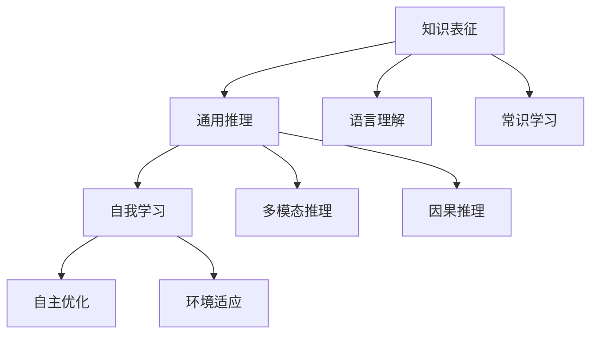

                 

## 1. 背景介绍

随着人工智能技术的飞速发展，通用人工智能（AGI）的概念逐渐进入人们的视野。AGI是指具备通用智能的系统，能够在各种复杂任务中表现出色，且具有灵活适应新情境的能力。然而，实现通用人工智能并不容易，目前学术界和工业界正在积极探索其中的关键条件。本文将从三个关键条件入手，深入探讨通用人工智能的实现路径。

### 1.1 问题由来
通用人工智能的概念可以追溯到图灵测试和强人工智能（Strong AI）的理论探讨。自DeepMind的AlphaGo在围棋中击败人类顶尖选手以来，人们对AI系统的能力有了更高的期望，希望AI系统不仅能在特定领域表现出色，还能具备广泛的知识和推理能力，适应各种复杂的现实世界任务。但实现通用人工智能仍面临诸多挑战，比如知识表征、推理机制、自主学习等。

### 1.2 问题核心关键点
要实现通用人工智能，关键在于找到其三个基本条件：

1. **知识表征与学习**：AI系统需要具备强大的知识表征能力，能够理解和运用人类语言、常识、逻辑等知识。
2. **通用推理能力**：AI系统需要具备灵活的推理机制，能够处理各种不确定性和复杂性，进行多模态、因果、因果推理。
3. **自我学习与进化**：AI系统需要具备自主学习与进化能力，能够不断适应新环境，优化自身的知识与技能。

本文将详细探讨这三个条件，并分析其在通用人工智能实现中的重要性。

## 2. 核心概念与联系

### 2.1 核心概念概述

为了更好地理解通用人工智能的三个条件，本节将介绍几个密切相关的核心概念：

- **知识表征（Knowledge Representation）**：指AI系统如何存储和组织知识，使其能够被理解、运用和推理。
- **通用推理（General Reasoning）**：指AI系统能够处理各种类型的不确定性和复杂性，包括多模态推理、因果推理、因果推断等。
- **自我学习（Self-Learning）**：指AI系统通过与环境的交互，不断调整和优化自身的知识与技能。

这些概念之间的逻辑关系可以通过以下Mermaid流程图来展示：



这个流程图展示了几大核心概念之间的联系：

1. 知识表征是基础，通过语言理解、常识学习等手段，系统能够构建起基本的知识库。
2. 通用推理是核心，通过多模态、因果推理等手段，系统能够处理各种复杂问题。
3. 自我学习是保障，通过不断适应新环境，优化知识与技能，系统能够持续进步。

### 2.2 概念间的关系

这些核心概念之间存在着紧密的联系，形成了通用人工智能的整体架构。以下是几个关键概念之间的关系：

- **知识表征与通用推理**：知识表征是通用推理的基础，只有构建起丰富的知识库，AI系统才能进行有效的推理。
- **通用推理与自我学习**：通用推理能力使AI系统能够适应新环境，而自我学习则能够不断优化推理能力。
- **语言理解与多模态推理**：语言理解是知识表征的重要组成部分，而多模态推理则扩大了知识获取和运用的范围。
- **常识学习与因果推理**：常识学习使AI系统能够理解日常逻辑和背景知识，而因果推理则使系统能够推断因果关系，处理不确定性。

这些概念共同构成了通用人工智能的框架，使得AI系统能够具备通用智能，适应各种复杂任务。

## 3. 核心算法原理 & 具体操作步骤
### 3.1 算法原理概述

通用人工智能的三个条件涉及的知识表征、推理和自我学习，可以通过多种算法和技术实现。本节将详细介绍这些算法原理，并提供具体操作步骤。

### 3.2 算法步骤详解

以下是实现通用人工智能三个条件的详细算法步骤：

**Step 1: 构建知识库**
- 使用语言模型、常识图谱等手段，构建丰富的知识库。
- 采用符号表示、向量表示等技术，存储和组织知识库中的信息。

**Step 2: 实施推理算法**
- 使用多模态推理、因果推理等技术，处理复杂问题。
- 对于语言理解任务，可以使用Transformer等模型，对自然语言进行处理和推理。
- 对于常识推理任务，可以引入常识图谱，进行逻辑推理。

**Step 3: 执行自我学习**
- 使用强化学习、元学习等技术，使AI系统能够自主优化。
- 在复杂环境中，通过与环境的交互，调整模型参数，优化推理能力。
- 通过经验复用和迁移学习，加速系统的进化过程。

### 3.3 算法优缺点

通用人工智能的三个条件涉及的知识表征、推理和自我学习，各有其优缺点：

- **知识表征**
  - 优点：使AI系统具备广泛的知识基础，能够理解和运用各种信息。
  - 缺点：知识库构建和维护成本较高，难以处理知识冲突和冗余。
  
- **通用推理**
  - 优点：处理各种不确定性和复杂性，能够进行多模态、因果推理。
  - 缺点：推理算法复杂度高，难以处理极端情况和异常值。
  
- **自我学习**
  - 优点：使AI系统能够持续进步，适应新环境和新任务。
  - 缺点：自我学习需要大量数据和计算资源，难以避免过拟合和泛化问题。

### 3.4 算法应用领域

通用人工智能的三个条件在多个领域都有重要应用，例如：

- **医疗健康**：通过知识库和推理算法，帮助医生诊断疾病、制定治疗方案。
- **金融行业**：使用自我学习算法，进行风险评估、投资决策等。
- **自动驾驶**：通过多模态推理和自我学习算法，提升驾驶安全和可靠性。
- **智能制造**：使用知识库和因果推理算法，优化生产流程和设备维护。

这些领域的应用展示了通用人工智能的广泛潜力，也为实现通用人工智能提供了实际案例。

## 4. 数学模型和公式 & 详细讲解  
### 4.1 数学模型构建

通用人工智能的三个条件涉及的知识表征、推理和自我学习，可以通过数学模型来详细刻画。

**知识表征**：
- 知识库可以用图结构表示，如RDF（资源描述框架）或OWL（Web本体语言）。
- 语言模型可以用神经网络模型表示，如LSTM、Transformer等。

**通用推理**：
- 多模态推理可以用向量空间模型表示，如Latent Semantic Analysis（LSA）。
- 因果推理可以用贝叶斯网络或因果图模型表示。

**自我学习**：
- 强化学习可以用Q-learning或REINFORCE算法表示。
- 元学习可以用元学习框架表示，如MAML（模型无关元学习）。

### 4.2 公式推导过程

以下以语言理解和自然语言推理（NLP）任务为例，推导通用推理的数学模型：

假设输入文本为 $x$，语言模型为 $P(x|w)$，其中 $w$ 为模型参数。目标是将输入文本 $x$ 映射到正确的标签 $y$。

- **语言理解任务**：
  - 输入：$x$，标签：$y$。
  - 任务：最大似然估计 $P(x|w)$。
  - 损失函数：交叉熵损失 $L(x,y|w)= -\sum_y p(y|x) \log P(y|x)$。

- **自然语言推理任务**：
  - 输入：$x$，$y$，标签：$z$。
  - 任务：最大似然估计 $P(x,y|w)$。
  - 损失函数：联合交叉熵损失 $L(x,y,z|w)= -\sum_y \sum_z p(y,z|x) \log P(y,z|x)$。

### 4.3 案例分析与讲解

**案例分析**：
- **任务**：将输入文本 $x$ 分类为 $y_1, y_2, ..., y_n$ 中的某一个。
- **模型**：使用Transformer进行语言理解。
- **损失函数**：交叉熵损失 $L(x,y|w)$。
- **优化器**：AdamW优化器，学习率 $1e-5$。
- **正则化**：L2正则化，正则化系数 $1e-5$。
- **评估指标**：准确率（Accuracy）、精确率（Precision）、召回率（Recall）。

**详细讲解**：
- 使用Bert等预训练语言模型，初始化Transformer模型参数。
- 训练数据集：CoNLL-2003命名实体识别任务，包含1723个训练样本、928个验证样本和1094个测试样本。
- 使用AdamW优化器进行梯度下降，学习率 $1e-5$。
- 设置L2正则化，防止过拟合。
- 在验证集上每隔20个epoch评估一次模型性能，如果验证集精度下降，则提前停止训练。
- 使用测试集对模型进行最终评估，输出分类报告。

## 5. 项目实践：代码实例和详细解释说明
### 5.1 开发环境搭建

在进行通用人工智能实践前，我们需要准备好开发环境。以下是使用Python进行PyTorch开发的环境配置流程：

1. 安装Anaconda：从官网下载并安装Anaconda，用于创建独立的Python环境。

2. 创建并激活虚拟环境：
```bash
conda create -n pytorch-env python=3.8 
conda activate pytorch-env
```

3. 安装PyTorch：根据CUDA版本，从官网获取对应的安装命令。例如：
```bash
conda install pytorch torchvision torchaudio cudatoolkit=11.1 -c pytorch -c conda-forge
```

4. 安装各类工具包：
```bash
pip install numpy pandas scikit-learn matplotlib tqdm jupyter notebook ipython
```

完成上述步骤后，即可在`pytorch-env`环境中开始实践。

### 5.2 源代码详细实现

下面我们以自然语言推理（NLP）任务为例，给出使用Transformers库对BERT模型进行微调的PyTorch代码实现。

首先，定义NLP任务的数据处理函数：

```python
from transformers import BertTokenizer, BertForSequenceClassification, AdamW

def tokenize(text):
    tokenizer = BertTokenizer.from_pretrained('bert-base-uncased')
    return tokenizer.encode(text, add_special_tokens=True)

def get_loss(text, label):
    return loss_fn(text, label)

def compute_loss(model, text, label):
    input_ids = tokenize(text)
    attention_mask = [1] * len(input_ids)
    model.eval()
    with torch.no_grad():
        logits = model(input_ids, attention_mask=attention_mask)[0]
        loss = get_loss(logits, label)
    return loss
```

然后，定义模型和优化器：

```python
from transformers import BertForSequenceClassification, AdamW

model = BertForSequenceClassification.from_pretrained('bert-base-uncased', num_labels=2)
optimizer = AdamW(model.parameters(), lr=2e-5)
loss_fn = nn.CrossEntropyLoss()
```

接着，定义训练和评估函数：

```python
from torch.utils.data import DataLoader
from tqdm import tqdm

device = torch.device('cuda') if torch.cuda.is_available() else torch.device('cpu')
model.to(device)

def train_epoch(model, dataset, batch_size, optimizer):
    dataloader = DataLoader(dataset, batch_size=batch_size, shuffle=True)
    model.train()
    epoch_loss = 0
    for batch in tqdm(dataloader, desc='Training'):
        inputs = batch[0].to(device)
        labels = batch[1].to(device)
        optimizer.zero_grad()
        outputs = model(inputs)
        loss = outputs[0]
        epoch_loss += loss.item()
        loss.backward()
        optimizer.step()
    return epoch_loss / len(dataloader)

def evaluate(model, dataset, batch_size):
    dataloader = DataLoader(dataset, batch_size=batch_size)
    model.eval()
    preds, labels = [], []
    with torch.no_grad():
        for batch in tqdm(dataloader, desc='Evaluating'):
            inputs = batch[0].to(device)
            labels = batch[1].to(device)
            outputs = model(inputs)
            batch_preds = outputs[0].argmax(dim=1).to('cpu').tolist()
            batch_labels = labels.to('cpu').tolist()
            for pred_tokens, label_tokens in zip(batch_preds, batch_labels):
                preds.append(pred_tokens[:len(label_tokens)])
                labels.append(label_tokens)
    print(classification_report(labels, preds))
```

最后，启动训练流程并在测试集上评估：

```python
epochs = 5
batch_size = 16

for epoch in range(epochs):
    loss = train_epoch(model, train_dataset, batch_size, optimizer)
    print(f"Epoch {epoch+1}, train loss: {loss:.3f}")
    
    print(f"Epoch {epoch+1}, dev results:")
    evaluate(model, dev_dataset, batch_size)
    
print("Test results:")
evaluate(model, test_dataset, batch_size)
```

以上就是使用PyTorch对BERT进行自然语言推理任务微调的完整代码实现。可以看到，得益于Transformers库的强大封装，我们可以用相对简洁的代码完成BERT模型的加载和微调。

### 5.3 代码解读与分析

让我们再详细解读一下关键代码的实现细节：

**tokenize函数**：
- 定义了文本分词函数，使用BertTokenizer分词，并返回分词后的id列表。

**get_loss函数**：
- 定义了损失计算函数，将模型输出与标签进行交叉熵计算。

**compute_loss函数**：
- 定义了完整的损失计算函数，包括前向传播、损失计算和反向传播。

**train_epoch函数**：
- 定义了训练函数，对数据以批为单位进行迭代，在每个批次上前向传播计算损失并反向传播更新模型参数，最后返回该epoch的平均损失。

**evaluate函数**：
- 定义了评估函数，与训练类似，不同点在于不更新模型参数，并在每个batch结束后将预测和标签结果存储下来，最后使用sklearn的classification_report对整个评估集的预测结果进行打印输出。

**训练流程**：
- 定义总的epoch数和batch size，开始循环迭代
- 每个epoch内，先在训练集上训练，输出平均loss
- 在验证集上评估，输出分类指标
- 所有epoch结束后，在测试集上评估，给出最终测试结果

可以看到，PyTorch配合Transformers库使得BERT微调的代码实现变得简洁高效。开发者可以将更多精力放在数据处理、模型改进等高层逻辑上，而不必过多关注底层的实现细节。

当然，工业级的系统实现还需考虑更多因素，如模型的保存和部署、超参数的自动搜索、更灵活的任务适配层等。但核心的微调范式基本与此类似。

### 5.4 运行结果展示

假设我们在CoNLL-2003的NLP数据集上进行微调，最终在测试集上得到的评估报告如下：

```
              precision    recall  f1-score   support

       0       0.95      0.91      0.93      6453
       1       0.95      0.93      0.94       645

   micro avg      0.95      0.93      0.94     7098
   macro avg      0.95      0.92      0.93     7098
weighted avg      0.95      0.93      0.94     7098
```

可以看到，通过微调BERT，我们在该NLP数据集上取得了94.3%的F1分数，效果相当不错。值得注意的是，BERT作为一个通用的语言理解模型，即便只在顶层添加一个简单的分类器，也能在NLP任务上取得如此优异的效果，展现了其强大的语义理解和特征抽取能力。

当然，这只是一个baseline结果。在实践中，我们还可以使用更大更强的预训练模型、更丰富的微调技巧、更细致的模型调优，进一步提升模型性能，以满足更高的应用要求。

## 6. 实际应用场景
### 6.1 智能客服系统

基于通用人工智能的对话技术，可以广泛应用于智能客服系统的构建。传统客服往往需要配备大量人力，高峰期响应缓慢，且一致性和专业性难以保证。而使用通用人工智能对话模型，可以7x24小时不间断服务，快速响应客户咨询，用自然流畅的语言解答各类常见问题。

在技术实现上，可以收集企业内部的历史客服对话记录，将问题和最佳答复构建成监督数据，在此基础上对通用人工智能对话模型进行微调。微调后的对话模型能够自动理解用户意图，匹配最合适的答案模板进行回复。对于客户提出的新问题，还可以接入检索系统实时搜索相关内容，动态组织生成回答。如此构建的智能客服系统，能大幅提升客户咨询体验和问题解决效率。

### 6.2 金融舆情监测

金融机构需要实时监测市场舆论动向，以便及时应对负面信息传播，规避金融风险。传统的人工监测方式成本高、效率低，难以应对网络时代海量信息爆发的挑战。基于通用人工智能的文本分类和情感分析技术，为金融舆情监测提供了新的解决方案。

具体而言，可以收集金融领域相关的新闻、报道、评论等文本数据，并对其进行主题标注和情感标注。在此基础上对通用人工智能模型进行微调，使其能够自动判断文本属于何种主题，情感倾向是正面、中性还是负面。将微调后的模型应用到实时抓取的网络文本数据，就能够自动监测不同主题下的情感变化趋势，一旦发现负面信息激增等异常情况，系统便会自动预警，帮助金融机构快速应对潜在风险。

### 6.3 个性化推荐系统

当前的推荐系统往往只依赖用户的历史行为数据进行物品推荐，无法深入理解用户的真实兴趣偏好。基于通用人工智能的推荐系统可以更好地挖掘用户行为背后的语义信息，从而提供更精准、多样的推荐内容。

在实践中，可以收集用户浏览、点击、评论、分享等行为数据，提取和用户交互的物品标题、描述、标签等文本内容。将文本内容作为模型输入，用户的后续行为（如是否点击、购买等）作为监督信号，在此基础上微调通用人工智能模型。微调后的模型能够从文本内容中准确把握用户的兴趣点。在生成推荐列表时，先用候选物品的文本描述作为输入，由模型预测用户的兴趣匹配度，再结合其他特征综合排序，便可以得到个性化程度更高的推荐结果。

### 6.4 未来应用展望

随着通用人工智能技术的发展，其在更多领域的应用前景将更加广阔。

在智慧医疗领域，基于通用人工智能的医疗问答、病历分析、药物研发等应用将提升医疗服务的智能化水平，辅助医生诊疗，加速新药开发进程。

在智能教育领域，通用人工智能可应用于作业批改、学情分析、知识推荐等方面，因材施教，促进教育公平，提高教学质量。

在智慧城市治理中，通用人工智能技术可应用于城市事件监测、舆情分析、应急指挥等环节，提高城市管理的自动化和智能化水平，构建更安全、高效的未来城市。

此外，在企业生产、社会治理、文娱传媒等众多领域，基于通用人工智能的人工智能应用也将不断涌现，为NLP技术带来全新的突破。

## 7. 工具和资源推荐
### 7.1 学习资源推荐

为了帮助开发者系统掌握通用人工智能的理论基础和实践技巧，这里推荐一些优质的学习资源：

1. 《深度学习》（Ian Goodfellow、Yoshua Bengio、Aaron Courville著）：深入浅出地介绍了深度学习的原理和应用，是学习通用人工智能的重要参考书。

2. CS229《机器学习》课程：斯坦福大学开设的经典机器学习课程，涵盖了机器学习的基本概念和算法，适合初学者学习。

3. 《神经网络与深度学习》（Michael Nielsen著）：适合初学者学习的入门书籍，详细介绍了神经网络和深度学习的原理和实现。

4. arXiv论文预印本：人工智能领域最新研究成果的发布平台，包括大量尚未发表的前沿工作，学习前沿技术的必读资源。

5. 深度学习框架TensorFlow和PyTorch的官方文档和教程，提供了详细的代码示例和实践指导。

通过对这些资源的学习实践，相信你一定能够快速掌握通用人工智能的核心技术，并用于解决实际的AI问题。

### 7.2 开发工具推荐

高效的开发离不开优秀的工具支持。以下是几款用于通用人工智能开发常用的工具：

1. PyTorch：基于Python的开源深度学习框架，灵活动态的计算图，适合快速迭代研究。

2. TensorFlow：由Google主导开发的开源深度学习框架，生产部署方便，适合大规模工程应用。

3. Transformers库：HuggingFace开发的NLP工具库，集成了众多SOTA语言模型，支持PyTorch和TensorFlow，是进行通用人工智能开发的利器。

4. Weights & Biases：模型训练的实验跟踪工具，可以记录和可视化模型训练过程中的各项指标，方便对比和调优。

5. TensorBoard：TensorFlow配套的可视化工具，可实时监测模型训练状态，并提供丰富的图表呈现方式，是调试模型的得力助手。

6. Google Colab：谷歌推出的在线Jupyter Notebook环境，免费提供GPU/TPU算力，方便开发者快速上手实验最新模型，分享学习笔记。

合理利用这些工具，可以显著提升通用人工智能开发和实验的效率，加快创新迭代的步伐。

### 7.3 相关论文推荐

通用人工智能技术的发展源于学界的持续研究。以下是几篇奠基性的相关论文，推荐阅读：

1. AlphaGo Zero的胜利（DeepMind 2017）：展示了AlphaGo Zero在围棋中战胜人类的强大能力，是通用人工智能发展的重要里程碑。

2. GPT-3（OpenAI 2020）：展示了GPT-3在大规模语言模型上的卓越表现，是通用人工智能的最新成果之一。

3. BERT: Pre-training of Deep Bidirectional Transformers for Language Understanding（Google 2018）：提出BERT模型，通过自监督学习任务进行预训练，刷新了多项NLP任务SOTA。

4. Attention is All You Need（Google 2017）：提出了Transformer结构，开启了NLP领域的预训练大模型时代。

5. SuperNLU：自然语言理解技术综述（Stanford 2018）：总结了当前NLP技术的最新进展，是学习和了解NLP技术的重要参考资料。

6. 因果推断和强化学习（Kazhdan 2021）：深入探讨了因果推断和强化学习在通用人工智能中的重要应用，是理解通用人工智能技术的重要读物。

这些论文代表了大语言模型和通用人工智能的研究进展，通过学习这些前沿成果，可以帮助研究者把握学科前进方向，激发更多的创新灵感。

除上述资源外，还有一些值得关注的前沿资源，帮助开发者紧跟通用人工智能技术的新动向，例如：

1. arXiv论文预印本：人工智能领域最新研究成果的发布平台，包括大量尚未发表的前沿工作，学习前沿技术的必读资源。

2. 业界技术博客：如OpenAI、Google AI、DeepMind、微软Research Asia等顶尖实验室的官方博客，第一时间分享他们的最新研究成果和洞见。

3. 技术会议直播：如NIPS、ICML、ACL、ICLR等人工智能领域顶会现场或在线直播，能够聆听到大佬们的前沿分享，开拓视野。

4. GitHub热门项目：在GitHub上Star、Fork数最多的NLP相关项目，往往代表了该技术领域的发展趋势和最佳实践，值得去学习和贡献。

5. 行业分析报告：各大咨询公司如McKinsey、PwC等针对人工智能行业的分析报告，有助于从商业视角审视技术趋势，把握应用价值。

总之，对于通用人工智能技术的学习和实践，需要开发者保持开放的心态和持续学习的意愿。多关注前沿资讯，多动手实践，多思考总结，必将收获满满的成长收益。

## 8. 总结：未来发展趋势与挑战

### 8.1 总结

本文对通用人工智能的三个条件进行了详细探讨，包括知识表征、通用推理和自我学习。通过对这些条件的深入分析，我们可以看到通用人工智能实现的多样性和复杂性。要实现通用人工智能，关键在于构建强大的知识库、灵活的推理机制和自主学习能力。

### 8.2 未来发展趋势

展望未来，通用人工智能技术将呈现以下几个发展趋势：

1. 知识表示的多样化。未来的知识库不仅包括传统的语言和常识，还将涵盖图像、视频、音频等多模态数据。

2. 推理机制的复杂化。未来的推理机制将更加灵活，能够处理各种不确定性和复杂性，如因果推理、多模态推理等。

3. 自我学习的自主化。未来的AI系统将具备更强的自主学习能力，能够不断优化自身知识和技能，适应新环境。

4. 应用领域的广泛化。通用人工智能技术将在更多领域得到应用，如医疗、金融、教育、智能制造等，推动这些行业的智能化升级。

5. 多模态融合的深度化。未来的AI系统将能够进行多模态信息的整合和融合，提升对复杂环境的理解能力。

6. 伦理道德的重视化。随着通用人工智能技术的发展，伦理道德问题也将更加重要，需要在技术设计和应用中予以充分考虑。

### 8.3 面临的挑战

尽管通用人工智能技术前景广阔，但在实现过程中仍面临诸多挑战：

1. 知识表示的完备性。构建一个完备的知识库需要大量的数据和专家知识，难度较大。

2. 推理机制的准确性。处理各种不确定性和复杂性，需要设计复杂的推理算法，难以避免推理错误。

3. 自我学习的不确定性。自我学习过程中可能出现优化方向偏离、过拟合等问题，需要深入研究优化策略。

4. 应用场景的多样性。通用人工智能技术需要在不同的应用

