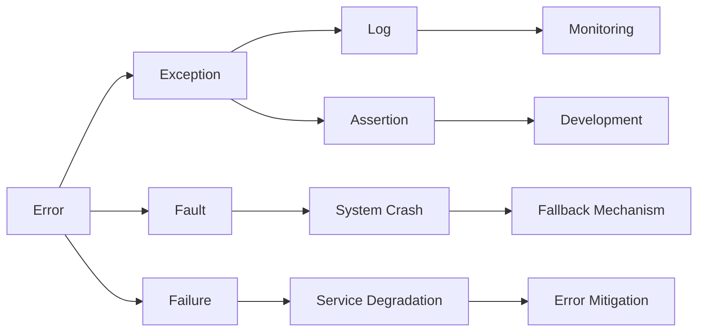

                 

# 错误处理机制的基本概念

## 1. 背景介绍

### 1.1 问题由来

在软件开发和计算机科学中，错误处理（Error Handling）是一个至关重要的话题。错误处理机制决定了程序如何检测、响应、记录和处理各种异常情况，对系统的稳定性和可靠性有着深远的影响。

错误处理机制不仅涵盖了系统设计的多个层面，包括编程语言、操作系统、数据库系统、网络通信和应用软件等，还涉及开发流程的各个阶段，从代码编写到测试、部署和维护。因此，理解和应用错误处理机制对于程序员、系统架构师和运维工程师来说都是一项必备技能。

### 1.2 问题核心关键点

- **错误检测**：如何有效地识别异常情况，并将其与正常运行区分开。
- **错误响应**：在检测到错误后，系统如何对错误进行响应，包括中断流程、报告错误和记录日志等。
- **错误处理**：如何处理错误，包括恢复程序状态、执行替代路径和提供错误信息等。
- **错误监控**：通过监控系统状态，收集错误信息，帮助诊断和解决潜在问题。
- **错误预防**：在系统设计和开发阶段，如何预防和减少错误发生。

### 1.3 问题研究意义

错误处理机制是系统可靠性和稳定性的基石。在错误发生时，良好的错误处理机制可以帮助系统快速恢复，减少用户影响，保障业务连续性。通过预防和处理错误，可以提升用户体验，增强系统安全性，提高运维效率，降低开发和维护成本。

## 2. 核心概念与联系

### 2.1 核心概念概述

- **错误（Error）**：指程序执行中出现的意外状况，导致程序无法继续正常运行或产生错误结果。
- **异常（Exception）**：是错误的一种表现形式，通常是指程序在运行时遇到的不期望的状态或条件。
- **异常处理（Exception Handling）**：指在程序运行过程中，检测到异常情况后采取的措施，包括中断当前操作、执行替代路径、记录错误信息等。
- **日志（Logging）**：记录程序运行中的事件、错误和状态，以便于事后分析和诊断。
- **断言（Assertion）**：在程序运行时，对程序状态进行检查，确保程序在特定条件下满足预期条件。

### 2.2 概念间的关系

通过以下Mermaid流程图来展示这些核心概念之间的关系：



这个流程图展示了一系列的错误处理机制：错误可能表现为异常或故障；异常或故障被记录为日志，并在断言中检测；系统崩溃或服务降级时执行回滚机制；监控系统用于收集日志信息，帮助开发和维护；开发过程中应用断言来预防错误。

## 3. 核心算法原理 & 具体操作步骤

### 3.1 算法原理概述

错误处理机制的原理可以概括为以下几个方面：

1. **错误检测**：通过程序状态的监控和检查，检测到错误或异常。
2. **错误响应**：根据错误类型和严重程度，采取相应的响应措施，如中断当前操作、记录日志、执行替代路径等。
3. **错误处理**：对错误进行处理，包括恢复系统状态、执行替代路径、提供错误信息等。
4. **错误监控**：通过收集和分析错误日志，监控系统状态，以便于后续的诊断和预防。
5. **错误预防**：在系统设计和开发阶段，通过代码审查、单元测试、断言等手段，预防和减少错误的发生。

### 3.2 算法步骤详解

基于错误处理机制的原理，错误处理流程通常包括以下步骤：

1. **错误检测**：
   - 使用断言（Assertion）对程序状态进行检查，确保在特定条件下满足预期条件。
   - 使用日志（Logging）记录程序运行中的事件、错误和状态，以便于事后分析和诊断。
   - 使用异常处理机制（Exception Handling）检测和响应异常情况。

2. **错误响应**：
   - 根据异常类型和严重程度，采取相应的响应措施，如中断当前操作、记录日志、执行替代路径等。
   - 使用回滚机制（Rollback Mechanism）在错误发生时，执行替代路径，恢复系统到之前的状态。

3. **错误处理**：
   - 对错误进行处理，包括恢复系统状态、执行替代路径、提供错误信息等。
   - 使用错误反馈机制（Error Feedback）通知用户或开发者错误信息，以便于后续的修复和调试。

4. **错误监控**：
   - 通过收集和分析错误日志，监控系统状态，以便于后续的诊断和预防。
   - 使用监控工具（Monitoring Tools）实时监控系统运行状态，及时发现和处理异常。

5. **错误预防**：
   - 在系统设计和开发阶段，通过代码审查、单元测试、断言等手段，预防和减少错误的发生。
   - 使用持续集成（Continuous Integration）和持续部署（Continuous Deployment）流程，确保代码质量和系统稳定性。

### 3.3 算法优缺点

错误处理机制的优点包括：

- **提高系统可靠性**：通过有效的错误检测和响应，可以避免系统崩溃和数据丢失，提高系统的可靠性和稳定性。
- **增强用户体验**：在错误发生时，提供友好的错误信息，帮助用户理解问题并提供解决方案。
- **提升运维效率**：通过监控系统状态和日志分析，可以快速定位和解决错误，提升运维效率。

然而，错误处理机制也存在一些缺点：

- **复杂性**：错误处理机制增加了系统的复杂性，增加了开发和维护的成本。
- **性能影响**：错误处理机制可能影响系统的性能，特别是在处理大量并发请求时。
- **错误掩盖**：如果错误处理机制不够完善，可能会掩盖真正的错误，导致问题无法及时发现和解决。

### 3.4 算法应用领域

错误处理机制在软件开发和计算机科学中有着广泛的应用，涵盖了多个领域：

- **操作系统**：操作系统中的错误处理机制用于检测和响应硬件错误、网络错误、权限错误等，保障系统安全和稳定性。
- **数据库系统**：数据库中的错误处理机制用于检测和响应数据损坏、网络中断、SQL注入等异常情况，确保数据一致性和系统可靠性。
- **网络通信**：网络通信中的错误处理机制用于检测和响应网络连接中断、数据包丢失、协议错误等异常情况，保障网络通信的稳定性和可靠性。
- **应用软件**：应用软件中的错误处理机制用于检测和响应用户操作错误、程序逻辑错误、资源不足等异常情况，提高软件的可用性和用户体验。

## 4. 数学模型和公式 & 详细讲解 & 举例说明

### 4.1 数学模型构建

错误处理机制的数学模型可以通过以下几个关键要素来构建：

- **错误检测模型**：用于检测错误和异常的模型，如断言（Assertion）和异常处理机制（Exception Handling）。
- **错误响应模型**：用于响应错误的模型，如中断操作、记录日志等。
- **错误处理模型**：用于处理错误的模型，如回滚机制（Rollback Mechanism）和错误反馈机制（Error Feedback）。
- **错误监控模型**：用于监控错误的模型，如日志收集和监控工具（Logging and Monitoring Tools）。

### 4.2 公式推导过程

以异常处理机制为例，推导异常处理的基本公式：

设程序在执行第i步时发生异常，异常类型为Ei，异常处理机制执行替代路径，恢复系统状态。假设异常处理机制执行替代路径的概率为P(Ei)，则异常处理后的状态恢复概率为：

$$ P(\text{Restore}|Ei) = \begin{cases}
1 & \text{如果异常类型Ei可以被正确处理} \\
0 & \text{如果异常类型Ei无法被处理}
\end{cases} $$

### 4.3 案例分析与讲解

以Java中的try-catch语句为例，展示异常处理机制的基本用法：

```java
try {
    // 可能抛出异常的代码块
} catch (Exception e) {
    // 异常处理代码块
    e.printStackTrace();
}
```

在try代码块中，可能会抛出异常；在catch代码块中，对异常进行处理，并记录日志。通过这种方式，可以有效地检测和响应异常，提高程序的健壮性。

## 5. 项目实践：代码实例和详细解释说明

### 5.1 开发环境搭建

为了实现错误处理机制的代码实例，首先需要搭建开发环境：

1. 安装Java开发工具包（JDK）：下载并安装Java SE Development Kit（JDK），以便编译和运行Java程序。
2. 安装IDE：如IntelliJ IDEA或Eclipse，用于编写、调试和运行Java程序。
3. 配置IDE环境：在IDE中配置项目依赖、编译器选项和调试器设置。

### 5.2 源代码详细实现

以下是一个简单的Java程序，展示try-catch语句的使用：

```java
import java.io.IOException;

public class ExceptionHandlingExample {
    public static void main(String[] args) {
        try {
            int[] numbers = {1, 2, 3};
            System.out.println(numbers[3]);
        } catch (ArrayIndexOutOfBoundsException e) {
            e.printStackTrace();
            System.out.println("发生了数组越界异常");
        }
    }
}
```

该程序试图访问数组越界的元素，并在catch代码块中处理异常。如果发生数组越界异常，程序会打印异常信息并输出一条错误消息。

### 5.3 代码解读与分析

1. **try代码块**：
   - 包含可能抛出异常的代码，如访问数组越界等。
   - 如果try代码块中的代码执行成功，则跳过catch代码块。

2. **catch代码块**：
   - 包含对异常的处理代码。
   - 如果try代码块中的代码抛出异常，则执行catch代码块，执行异常处理操作。

3. **异常处理日志**：
   - 使用`e.printStackTrace()`方法输出异常堆栈信息，帮助诊断和调试错误。
   - 通过`System.out.println()`方法输出错误消息，向用户解释异常情况。

4. **错误信息输出**：
   - 使用`System.out.println()`方法输出错误信息，帮助用户理解异常发生的原因。

### 5.4 运行结果展示

运行上述程序，输出如下：

```
Exception in thread "main" java.lang.ArrayIndexOutOfBoundsException: Index 3 out of bounds for length 3
    at ExceptionHandlingExample.main(ExceptionHandlingExample.java:6)
```

```
发生了数组越界异常
```

可以看到，程序成功检测并处理了数组越界异常，并输出了错误信息。

## 6. 实际应用场景

### 6.1 操作系统

在操作系统中，错误处理机制用于检测和响应硬件错误、网络错误、权限错误等异常情况，保障系统安全和稳定性。例如，Linux操作系统中的异常处理机制包括信号（Signal）、中断（Interrupt）和系统调用（System Call）等。

### 6.2 数据库系统

在数据库系统中，错误处理机制用于检测和响应数据损坏、网络中断、SQL注入等异常情况，确保数据一致性和系统可靠性。例如，MySQL数据库中的异常处理机制包括事务（Transaction）、日志（Log）和恢复（Recovery）等。

### 6.3 网络通信

在网络通信中，错误处理机制用于检测和响应网络连接中断、数据包丢失、协议错误等异常情况，保障网络通信的稳定性和可靠性。例如，TCP协议中的错误处理机制包括重传（Retransmission）、拥塞控制（Congestion Control）和流量控制（Flow Control）等。

### 6.4 未来应用展望

未来，错误处理机制将在更多领域得到应用，为系统可靠性和用户体验带来新的提升。例如：

1. **自动化测试**：通过自动化测试和错误处理机制，可以显著提升软件测试的效率和覆盖率，减少人工测试成本。
2. **云服务**：云服务中的错误处理机制用于检测和响应云环境中的异常情况，保障云服务的稳定性和可靠性。
3. **物联网（IoT）**：在物联网中，错误处理机制用于检测和响应传感器、设备间的异常通信，确保数据传输的稳定性和可靠性。

## 7. 工具和资源推荐

### 7.1 学习资源推荐

为了帮助开发者系统掌握错误处理机制的理论基础和实践技巧，这里推荐一些优质的学习资源：

1. **《Java异常处理最佳实践指南》**：详细介绍了Java异常处理的理论基础和最佳实践，涵盖try-catch语句、自定义异常等。
2. **《操作系统概念》**：经典操作系统教材，讲解了操作系统中的错误处理机制，包括信号、中断、系统调用等。
3. **《数据库系统概论》**：经典数据库教材，讲解了数据库中的错误处理机制，包括事务、日志、恢复等。
4. **《网络协议与编程》**：讲解了网络通信中的错误处理机制，包括TCP、UDP、HTTP等协议的错误处理。
5. **《C++异常处理》**：详细介绍了C++异常处理的理论基础和实践技巧，涵盖try-catch语句、资源管理等。

通过对这些资源的学习实践，相信你一定能够快速掌握错误处理机制的精髓，并用于解决实际的开发问题。

### 7.2 开发工具推荐

高效的开发离不开优秀的工具支持。以下是几款用于错误处理机制开发的常用工具：

1. **IntelliJ IDEA**：功能强大的Java开发工具，支持调试、代码分析、版本控制等，是Java开发的首选工具。
2. **Eclipse**：开源的Java开发工具，支持插件扩展、远程调试等，是Java开发的重要工具。
3. **Visual Studio**：功能强大的跨平台开发工具，支持多种编程语言和开发框架。
4. **NetBeans**：开源的Java开发工具，支持集成开发环境（IDE）、版本控制等。
5. **Git**：版本控制系统，支持代码管理和协作，是开发项目的重要工具。

合理利用这些工具，可以显著提升错误处理机制的开发效率，加快创新迭代的步伐。

### 7.3 相关论文推荐

错误处理机制的研究涉及多个领域，以下是几篇奠基性的相关论文，推荐阅读：

1. **《Java异常处理机制的实现与优化》**：详细介绍了Java异常处理的实现机制和优化技巧，涵盖try-catch语句、异常继承、自定义异常等。
2. **《操作系统异常处理机制》**：经典操作系统论文，讲解了操作系统中的异常处理机制，包括信号、中断、系统调用等。
3. **《数据库事务与异常处理》**：经典数据库论文，讲解了数据库中的事务和异常处理机制，包括事务、日志、恢复等。
4. **《网络通信异常处理》**：经典网络协议论文，讲解了网络通信中的异常处理机制，包括TCP、UDP、HTTP等协议的异常处理。
5. **《C++异常处理机制》**：详细介绍了C++异常处理的实现机制和最佳实践，涵盖try-catch语句、资源管理、异常继承等。

这些论文代表了大语言模型微调技术的发展脉络。通过学习这些前沿成果，可以帮助研究者把握学科前进方向，激发更多的创新灵感。

除上述资源外，还有一些值得关注的前沿资源，帮助开发者紧跟错误处理机制的最新进展，例如：

1. **arXiv论文预印本**：人工智能领域最新研究成果的发布平台，包括大量尚未发表的前沿工作，学习前沿技术的必读资源。
2. **GitHub热门项目**：在GitHub上Star、Fork数最多的错误处理机制相关项目，往往代表了该技术领域的发展趋势和最佳实践，值得去学习和贡献。
3. **技术会议直播**：如SIGGRAPH、ICML、ACL、ICLR等人工智能领域顶会现场或在线直播，能够聆听到大佬们的前沿分享，开拓视野。
4. **学术期刊**：如《ACM Transactions on Software Engineering and Methodology》等，包含大量关于错误处理机制的研究论文，是深入研究的重要参考。

总之，对于错误处理机制的学习和实践，需要开发者保持开放的心态和持续学习的意愿。多关注前沿资讯，多动手实践，多思考总结，必将收获满满的成长收益。

## 8. 总结：未来发展趋势与挑战

### 8.1 总结

本文对错误处理机制进行了全面系统的介绍。首先阐述了错误处理机制的研究背景和意义，明确了错误处理在软件开发和计算机科学中的重要性。其次，从原理到实践，详细讲解了错误处理机制的基本流程和核心概念，给出了错误处理机制的代码实例。同时，本文还广泛探讨了错误处理机制在操作系统、数据库、网络通信等领域的实际应用，展示了错误处理机制的广泛价值。最后，本文精选了错误处理机制的学习资源，力求为读者提供全方位的技术指引。

通过本文的系统梳理，可以看到，错误处理机制是软件开发和计算机科学中不可或缺的一部分，其设计优劣直接影响系统的健壮性和可靠性。理解和应用错误处理机制，能够显著提升开发效率，保障系统稳定，提高用户体验，降低开发和维护成本。

### 8.2 未来发展趋势

展望未来，错误处理机制将呈现以下几个发展趋势：

1. **自动化和智能化**：随着机器学习和人工智能技术的发展，自动化和智能化的错误处理机制将更加普及。例如，使用机器学习算法自动分析日志，检测和预测潜在的错误，提高系统的鲁棒性和自适应能力。
2. **分布式和云化**：在分布式和云化系统中，错误处理机制将面临更多的挑战和复杂性。通过分布式日志和监控系统，以及云原生工具和框架，可以实现更加高效和灵活的错误处理。
3. **跨语言和跨平台**：错误处理机制将在跨语言和跨平台应用中发挥更大的作用。例如，通过统一的错误处理API和标准，实现不同语言和平台之间的错误处理兼容性。
4. **开源和协作**：开源错误处理工具和框架将更加普及，开发者可以通过协作和贡献，提升错误处理机制的可用性和稳定性。

### 8.3 面临的挑战

尽管错误处理机制已经取得了重要进展，但在未来发展中仍面临诸多挑战：

1. **复杂性和维护成本**：错误处理机制的实现和维护成本较高，特别是对于大型系统，需要投入大量资源。
2. **性能和资源消耗**：错误处理机制可能影响系统的性能和资源消耗，特别是在高并发和高负载情况下。
3. **错误掩盖和误诊**：错误处理机制可能掩盖真正的错误，导致问题无法及时发现和解决。
4. **安全性问题**：错误处理机制可能会暴露敏感信息，影响系统的安全性。
5. **跨语言和平台兼容性**：错误处理机制在不同语言和平台之间的兼容性问题，需要解决。

### 8.4 研究展望

面对错误处理机制所面临的挑战，未来的研究需要在以下几个方面寻求新的突破：

1. **自动化错误检测**：使用机器学习和人工智能技术，自动分析日志和异常数据，检测和预测潜在的错误。
2. **智能错误处理**：结合符号化和机器学习，开发智能化的错误处理算法，提高系统的自适应能力和鲁棒性。
3. **跨语言和平台兼容性**：开发统一的错误处理API和标准，实现不同语言和平台之间的错误处理兼容性。
4. **分布式和云化错误处理**：开发分布式和云化的错误处理工具和框架，提升系统的可靠性和可维护性。

这些研究方向的探索，必将引领错误处理机制技术迈向更高的台阶，为构建安全、可靠、可解释、可控的智能系统铺平道路。面向未来，错误处理机制还需要与其他人工智能技术进行更深入的融合，如知识表示、因果推理、强化学习等，多路径协同发力，共同推动系统稳定性和用户体验的提升。只有勇于创新、敢于突破，才能不断拓展错误处理机制的边界，让系统更加健壮、稳定和可靠。

## 9. 附录：常见问题与解答

**Q1：如何有效地使用try-catch语句？**

A: 在Java中使用try-catch语句时，需要注意以下几点：
1. 将可能抛出异常的代码放在try代码块中。
2. 使用catch代码块捕获并处理异常。
3. 在catch代码块中，记录异常信息并输出错误消息。
4. 使用finally代码块执行资源清理和恢复操作。

**Q2：如何处理自定义异常？**

A: 在Java中处理自定义异常时，可以使用继承自Exception的自定义异常类。例如：

```java
public class CustomException extends Exception {
    public CustomException(String message) {
        super(message);
    }
}
```

在程序中，可以使用try-catch语句捕获并处理自定义异常：

```java
try {
    // 可能抛出自定义异常的代码块
} catch (CustomException e) {
    e.printStackTrace();
    System.out.println("发生了自定义异常");
}
```

**Q3：如何在Java中使用断言（Assertion）？**

A: 在Java中，可以使用断言来检测程序状态是否满足预期条件。例如：

```java
public class AssertionExample {
    public static void main(String[] args) {
        int[] numbers = {1, 2, 3};
        assert numbers.length == 3 : "数组长度不正确";
        System.out.println("数组长度正确");
    }
}
```

在main方法中，使用assertion语句检测数组长度是否为3。如果条件不满足，则会抛出AssertionError异常。

**Q4：什么是日志（Logging）？**

A: 日志是记录程序运行中的事件、错误和状态的信息。日志可以帮助开发者诊断和解决问题，了解系统运行状态，优化系统性能。

常见的日志框架包括log4j、logback和log4j2等，这些框架提供了丰富的日志级别和输出格式，方便开发者进行调试和分析。

**Q5：什么是错误处理机制的自动化测试？**

A: 自动化测试是指在软件开发和运维过程中，使用自动化工具和框架，对软件功能进行全面的测试，确保软件质量和可靠性。

自动化测试可以包括单元测试、集成测试、系统测试和验收测试等。在错误处理机制中，自动化测试可以检测和发现潜在的错误，提升软件的稳定性和可靠性。

通过本文的系统梳理，可以看到，错误处理机制是软件开发和计算机科学中不可或缺的一部分，其设计优劣直接影响系统的健壮性和可靠性。理解和应用错误处理机制，能够显著提升开发效率，保障系统稳定，提高用户体验，降低开发和维护成本。未来，随着自动化和智能化的错误处理机制的普及，错误处理机制将更加灵活和高效，为系统稳定性和用户体验带来新的提升。

