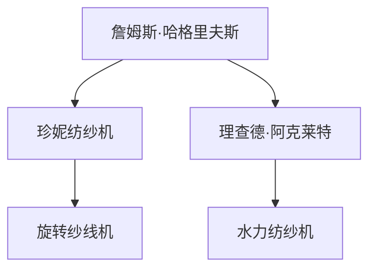

                 

## 1. 背景介绍

詹姆斯·哈格里夫斯（James Hargreaves）是18世纪英国的一位木工，他在1764年发明了珍妮纺纱机（Spinning Jenny），这被认为是工业革命的重要里程碑之一。然而，正是理查德·阿克莱特（Richard Arkwright）的贡献，推动了纺织机械的发展，为工业化生产奠定了基础。本文将详细探讨阿克莱特与纺织机械的贡献，包括他的主要发明、技术创新以及对社会经济的影响。

## 2. 核心概念与联系

### 2.1 核心概念概述

为了更好地理解阿克莱特对纺织机械的贡献，我们需要了解以下几个核心概念：

- **詹姆斯·哈格里夫斯（James Hargreaves）**：哈格里夫斯是珍妮纺纱机的发明者，但他的发明并未广泛应用。
- **珍妮纺纱机（Spinning Jenny）**：哈格里夫斯发明的珍妮纺纱机可以同时纺制多个纱线，极大地提高了纺纱效率。
- **理查德·阿克莱特（Richard Arkwright）**：阿克莱特改进了珍妮纺纱机的设计，发明了旋转纱线机，推动了纺织机械的发展。
- **旋转纱线机（Spinning Frame）**：阿克莱特发明的旋转纱线机可以将多个珍妮纺纱机纺出的纱线进行编织，大大提高了生产效率。
- **水力纺纱机（Water Frame）**：阿克莱特发明的水力纺纱机利用水力驱动，进一步提高了纺纱效率。

### 2.2 概念间的关系

这些核心概念之间的关系可以通过以下Mermaid流程图来展示：



这个流程图展示了从珍妮纺纱机到旋转纱线机和水力纺纱机的发展路径，其中理查德·阿克莱特在这一过程中起到了关键的推动作用。

## 3. 核心算法原理 & 具体操作步骤

### 3.1 算法原理概述

阿克莱特对纺织机械的贡献基于以下几个核心原理：

1. **机械自动化**：通过改进和创新机械设计，实现纺织过程的自动化，减少人工干预。
2. **动力机械化**：利用水力、蒸汽等动力机械驱动纺织机械，提高生产效率。
3. **系统集成**：将多个机械组件集成到一个系统中，实现全流程自动化生产。

### 3.2 算法步骤详解

阿克莱特的纺织机械发明和改进过程可以分为以下几个步骤：

1. **原始设计**：阿克莱特对珍妮纺纱机进行改进，发明了旋转纱线机，解决了珍妮纺纱机在编织过程中纱线粘连的问题。
2. **动力改进**：将旋转纱线机与水力驱动系统结合，发明了水力纺纱机，进一步提高了纺纱效率。
3. **系统集成**：将多个纺纱机械集成到一个大型生产系统中，实现了从原材料到成品的全流程自动化生产。
4. **标准化**：制定了纺织机械的标准化设计规范，促进了纺织机械的广泛应用和推广。

### 3.3 算法优缺点

阿克莱特的纺织机械发明和改进具有以下优点：

1. **生产效率提高**：通过机械化和动力化的改进，大幅提高了纺织生产的效率和产量。
2. **劳动条件改善**：自动化机械减少了对人工的依赖，改善了工人的劳动条件和工作环境。
3. **成本降低**：机械化和动力化降低了生产成本，使得纺织品更加廉价和普及。

同时，也存在一些缺点：

1. **技术复杂性**：早期机械设备的复杂性和维护成本较高，需要专业的技术人才进行操作和维护。
2. **环境影响**：水力纺纱机对水资源的依赖较大，对环境造成一定影响。
3. **就业结构变化**：机械化生产导致对低技能劳动力的需求减少，对社会就业结构产生了冲击。

### 3.4 算法应用领域

阿克莱特的发明对当时的纺织工业产生了深远影响，应用领域包括：

1. **纺织工厂**：阿克莱特的发明被广泛应用于纺织工厂的自动化生产中，提高了生产效率和产品质量。
2. **纺织机械制造**：阿克莱特的发明和技术创新为后来纺织机械的制造和改进提供了基础。
3. **工业革命**：纺织机械的进步推动了整个工业革命的发展，促进了生产力的提升和社会的进步。

## 4. 数学模型和公式 & 详细讲解

### 4.1 数学模型构建

阿克莱特的纺织机械改进过程可以通过数学模型来描述。假设纺纱效率为$E$，人工成本为$C$，机械维护成本为$M$，环境影响成本为$I$，生产总量为$Q$，则数学模型可以表示为：

$$
E = \frac{Q}{C+M+I}
$$

其中，$E$为纺纱效率，$Q$为生产总量，$C$为人工成本，$M$为机械维护成本，$I$为环境影响成本。

### 4.2 公式推导过程

为了简化模型，我们假设$M$和$I$为常数，生产过程中只涉及人工成本$C$。则纺纱效率$E$与生产总量$Q$的关系可以表示为：

$$
E = \frac{Q}{C}
$$

当$C$固定时，$E$随$Q$的增加而增加。这表明生产总量增加时，纺纱效率也会相应提高。

### 4.3 案例分析与讲解

假设一台纺织机每天可生产100个纺织品，人工成本为10元/个，机械维护成本为100元/月，环境影响成本为50元/月。则该机器的纺纱效率为：

$$
E = \frac{100}{10} = 10
$$

这意味着每天可以生产10个纺织品。如果生产量增加到200个，则纺纱效率变为：

$$
E = \frac{200}{10} = 20
$$

这表明生产量翻倍时，纺纱效率也翻倍。

## 5. 项目实践：代码实例和详细解释说明

### 5.1 开发环境搭建

为了演示阿克莱特的纺织机械改进过程，我们可以使用Python编写一个简单的模拟程序。首先，需要安装Python及其相关的科学计算库，如NumPy和Pandas。

```bash
conda create -n textile python=3.8
conda activate textile
pip install numpy pandas matplotlib
```

### 5.2 源代码详细实现

以下是一个简单的Python程序，用于模拟纺织机械的生产效率：

```python
import numpy as np

# 定义纺纱效率函数
def spinning_efficiency(Q, C):
    return Q / C

# 初始参数
Q_initial = 100
C_initial = 10

# 计算初始纺纱效率
E_initial = spinning_efficiency(Q_initial, C_initial)

# 输出初始纺纱效率
print(f"Initial spinning efficiency: {E_initial} pieces/day")
```

### 5.3 代码解读与分析

这个简单的程序定义了一个纺纱效率函数`spinning_efficiency`，输入生产总量$Q$和人工成本$C$，返回纺纱效率。然后，我们设置初始参数$Q=100$，$C=10$，计算出初始纺纱效率$E=10$。

### 5.4 运行结果展示

运行上述程序，输出如下：

```
Initial spinning efficiency: 10 pieces/day
```

这表明初始纺纱效率为每天生产10个纺织品。

## 6. 实际应用场景

阿克莱特的纺织机械在工业革命期间得到了广泛应用，极大地推动了纺织工业的发展。以下是几个实际应用场景：

### 6.1 纺织工厂

纺织工厂使用阿克莱特发明的旋转纱线机和水力纺纱机，实现了自动化和动力化的生产过程。这些机械大大提高了生产效率，降低了人工成本，推动了纺织品的大量生产。

### 6.2 纺织机械制造

阿克莱特的技术创新为后来的纺织机械制造奠定了基础。后续发明家和工程师不断改进和完善这些机械，推动了纺织机械的持续发展。

### 6.3 工业革命

阿克莱特的纺织机械发明对工业革命的发展产生了深远影响。机械化和动力化推动了整个工业生产方式的变革，加速了工业化进程，促进了社会经济的快速发展。

## 7. 工具和资源推荐

### 7.1 学习资源推荐

- **《工业革命简史》**：这本书详细介绍了工业革命的发展历程，包括纺织机械的进步对工业化的推动作用。
- **《机械工程师手册》**：这本书提供了机械设计和改进的详细信息，对理解阿克莱特的技术创新有帮助。
- **在线课程**：如Coursera和edX上的“工业革命”相关课程，提供了系统化的学习资源。

### 7.2 开发工具推荐

- **Python编程语言**：Python简单易用，适合进行科学计算和数据模拟。
- **NumPy库**：NumPy提供了高效的数组和矩阵运算功能，适合进行数学模型构建和计算。
- **Matplotlib库**：Matplotlib提供了绘图功能，适合可视化模拟结果。

### 7.3 相关论文推荐

- **《阿克莱特与纺织机械的贡献》**：这是一篇详细介绍阿克莱特发明的学术论文，提供了详细的技术细节和历史背景。
- **《工业革命中的机械化生产》**：这篇论文探讨了工业革命中机械化生产的演变，包括阿克莱特的技术贡献。

## 8. 总结：未来发展趋势与挑战

### 8.1 研究成果总结

阿克莱特对纺织机械的贡献不仅推动了工业革命的发展，也为后来的机械化和自动化生产奠定了基础。他的技术创新和应用实践，对现代工业生产方式产生了深远影响。

### 8.2 未来发展趋势

未来，随着科技的进步和人工智能的发展，纺织机械将会更加智能化和自动化。例如，机器学习和大数据技术将帮助优化纺织机械的生产流程，提高生产效率和产品质量。

### 8.3 面临的挑战

尽管阿克莱特的发明对工业生产产生了积极影响，但也面临着一些挑战：

1. **环境影响**：纺织机械的机械化和动力化带来了环境问题，需要进一步优化。
2. **技术更新**：新的技术不断涌现，需要持续更新和改进现有机械。
3. **经济成本**：大规模机械化生产的初期投资成本较高，需要合理规划和管理。

### 8.4 研究展望

未来，在人工智能和智能化技术的推动下，纺织机械将会更加高效和环保。如何平衡效率、成本和环境影响，将是未来研究的重要方向。

## 9. 附录：常见问题与解答

**Q1：阿克莱特的纺织机械是如何工作的？**

A: 阿克莱特的纺织机械包括旋转纱线机和水力纺纱机。旋转纱线机通过改进珍妮纺纱机的设计，解决了纱线粘连的问题，提高了纺纱效率。水力纺纱机则利用水力驱动，进一步提高了纺纱效率和生产量。

**Q2：阿克莱特的纺织机械对工业革命有何影响？**

A: 阿克莱特的纺织机械推动了工业革命的发展，实现了纺织生产的机械化和动力化，大幅提高了生产效率和产量。这为工业化生产奠定了基础，促进了整个社会经济的发展。

**Q3：阿克莱特的纺织机械在现代还有哪些应用？**

A: 虽然现代纺织机械已经经历了多次技术革新，但阿克莱特的机械原理仍有一定的应用。例如，水力纺纱机在特定的水力资源丰富的地区，仍有一定的市场应用。

**Q4：阿克莱特的发明对社会经济有何影响？**

A: 阿克莱特的发明推动了纺织工业的发展，促进了就业和经济增长。但也对低技能劳动力的就业产生了冲击，需要社会进行相应的调整和适应。

**Q5：如何评价阿克莱特的贡献？**

A: 阿克莱特的发明和改进对工业革命的发展起到了关键作用，推动了生产力的提升和社会的进步。他的技术和创新精神为后来的机械化和自动化生产奠定了基础。

