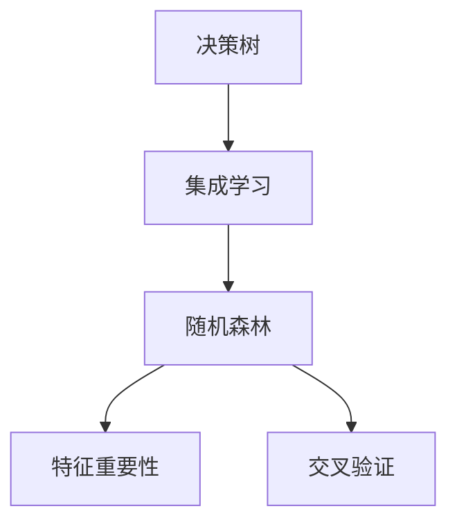
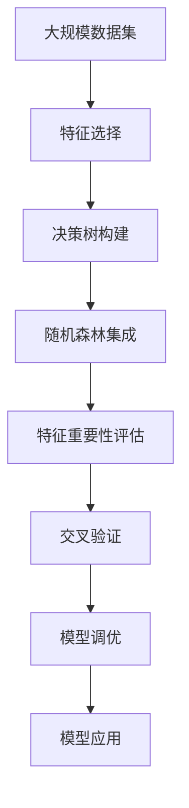

                 

# 随机森林原理与代码实例讲解

> 关键词：随机森林, 决策树, 集成学习, 特征重要性, 交叉验证, 代码实现

## 1. 背景介绍

### 1.1 问题由来

在机器学习领域，决策树是一种简单而有效的算法，能够处理分类和回归问题。然而，单棵决策树容易过拟合，特别是在数据集复杂、特征数量多的情况下。因此，集成学习（Ensemble Learning）成为了提升模型性能的重要手段。其中，随机森林（Random Forest）作为集成学习的一种，通过结合多棵决策树的预测结果，不仅能够降低过拟合风险，还能够在多方面提升模型的性能。

### 1.2 问题核心关键点

随机森林的核心思想是将训练集随机分成多个子集，在每个子集上构建决策树，并取所有决策树的平均值作为最终预测结果。这一过程通过以下几个关键点来实现：

- 特征随机采样：每次在构建决策树时，随机选择一部分特征作为树的特征集合，这样可以避免特征之间的高相关性。
- 样本随机采样：每次从训练集中随机选取一部分样本，构建决策树，这样可以减小过拟合风险。
- 集成预测：将每棵决策树的预测结果进行投票或平均，得到最终的预测结果。

随机森林在处理高维数据、非线性关系、特征选择等方面表现出色，已经被广泛应用于金融、医疗、广告等多个领域。其核心优势包括：

- 易于理解和实现，不需要复杂的参数调整。
- 在处理大规模数据集时效率高，效果好。
- 能够处理多类别分类问题，不局限于二分类。
- 内置特征重要性评估，便于解释和优化模型。

### 1.3 问题研究意义

随机森林作为集成学习的经典算法，其高效、稳定的特性使其成为机器学习领域的基石。对随机森林的深入理解与实践，对于提升模型的泛化能力和性能，推动数据科学的实际应用具有重要意义：

1. 降低模型复杂度：随机森林通过集成多个决策树，降低了单个决策树的复杂性，避免了过拟合，提高了模型的泛化能力。
2. 提升模型鲁棒性：随机森林能够处理高维数据和噪声数据，减少了数据噪声对模型的影响，提升了模型的鲁棒性。
3. 提高计算效率：相比于单个决策树，随机森林的计算复杂度相对较低，适合处理大规模数据集。
4. 支持多类别分类：随机森林能够处理多类别分类问题，不需要特殊处理，这为多类别问题的解决提供了便利。
5. 内置特征重要性：随机森林通过内置特征重要性评估，帮助开发者更好地理解数据特征对模型的影响，进行特征选择和优化。

## 2. 核心概念与联系

### 2.1 核心概念概述

为更好地理解随机森林的原理和应用，本节将介绍几个关键概念：

- 决策树（Decision Tree）：基于树形结构进行决策的算法，通过一系列规则将数据集划分为不同的类别。
- 集成学习（Ensemble Learning）：将多个模型组合起来，通过投票或平均预测结果，提升模型的性能。
- 特征重要性（Feature Importance）：评估每个特征对模型的贡献度，指导特征选择和优化。
- 交叉验证（Cross-Validation）：将数据集划分为训练集和验证集，评估模型的泛化能力。

这些概念通过以下Mermaid流程图来展示：



这个流程图展示了随机森林的核心概念及其之间的关系：

1. 决策树作为随机森林的基本组成部分，通过自顶向下的递归分裂过程，将数据集划分为不同的类别。
2. 集成学习通过将多棵决策树组合起来，提升模型的性能，随机森林是集成学习的一种形式。
3. 特征重要性评估帮助理解哪些特征对模型的影响最大，指导特征选择和优化。
4. 交叉验证通过验证集评估模型的泛化能力，帮助调整模型参数和评估模型性能。

### 2.2 概念间的关系

这些核心概念之间存在着紧密的联系，形成了随机森林的完整学习过程。下面我们通过几个Mermaid流程图来展示这些概念之间的关系。

#### 2.2.1 随机森林的构建过程


这个流程图展示了随机森林的构建过程：

1. 从训练集开始，随机采样特征和样本，构建决策树。
2. 将多棵决策树的预测结果进行集成，得到最终的预测结果。
3. 使用验证集评估模型性能，对模型进行调优。

#### 2.2.2 特征重要性评估


这个流程图展示了特征重要性评估的过程：

1. 构建决策树，计算每个特征的重要性。
2. 根据特征重要性进行特征选择，保留对模型影响大的特征。
3. 优化模型，减少噪声特征对模型的影响。

#### 2.2.3 交叉验证方法


这个流程图展示了交叉验证的过程：

1. 将训练集划分为K个子集，每次使用其中K-1个子集进行训练，剩余的一个子集进行验证。
2. 对K次交叉验证的结果进行平均，评估模型的泛化能力。
3. 根据交叉验证的结果调整模型参数，提高模型的性能。

### 2.3 核心概念的整体架构

最后，我们用一个综合的流程图来展示这些核心概念在大模型微调过程中的整体架构：



这个综合流程图展示了从数据选择、模型构建、特征重要性评估、交叉验证、模型调优到模型应用的全过程。通过这些流程图，我们可以更清晰地理解随机森林的学习过程和各个环节的优化策略，为后续深入讨论具体的算法实现奠定基础。

## 3. 核心算法原理 & 具体操作步骤

### 3.1 算法原理概述

随机森林是一种集成学习算法，通过将多棵决策树组合起来进行预测，降低了单个决策树的复杂性，减少了过拟合风险，提升了模型的泛化能力和性能。

随机森林的构建过程如下：

1. 随机采样训练数据，每次从训练集中随机选择一部分样本，构建决策树。
2. 随机采样特征，每次从所有特征中随机选择一部分特征作为树的特征集合。
3. 对于每个样本，构建一棵决策树，得到多个决策树的预测结果。
4. 将多个决策树的预测结果进行集成，如平均或投票，得到最终的预测结果。

随机森林的算法原理可以通过以下伪代码来描述：

```
输入：训练集D，决策树数目m，样本数目n，特征数目p
输出：随机森林模型

for i = 1 to m
    随机选择训练集D的n个子集
    随机选择特征p中的一部分特征
    构建决策树T_i
    保存决策树T_i的预测结果
输出：随机森林模型 = 各个决策树预测结果的平均值或投票结果
```

### 3.2 算法步骤详解

#### 3.2.1 数据预处理

在构建随机森林之前，需要对数据进行预处理：

1. 数据清洗：处理缺失值、异常值等数据问题。
2. 数据归一化：将数据转化为标准正态分布或标准化，以便于模型处理。
3. 特征编码：将分类变量转化为数值变量，方便模型处理。

#### 3.2.2 特征选择

为了提升模型性能和减少计算量，需要进行特征选择：

1. 特征重要性评估：计算每个特征的重要性，通过计算每个特征在树中出现的次数和信息增益，得到特征的重要性得分。
2. 特征选择：选择重要性得分高的特征，构建决策树。

#### 3.2.3 构建决策树

在特征选择之后，可以构建决策树：

1. 随机选择特征：从特征集合中随机选择一部分特征。
2. 样本随机采样：从训练集中随机选择一部分样本作为树的样本。
3. 构建决策树：通过递归分裂过程，将数据集划分为不同的类别。

#### 3.2.4 集成预测

将多棵决策树的预测结果进行集成，得到最终的预测结果：

1. 随机森林：将所有决策树的预测结果进行投票或平均，得到最终的预测结果。
2. 平均法：计算所有决策树的预测结果的平均值。
3. 投票法：统计每个类别的票数，选择票数最多的类别作为预测结果。

### 3.3 算法优缺点

随机森林作为一种集成学习算法，具有以下优点：

- 能够处理高维数据和噪声数据，减少了数据噪声对模型的影响。
- 在处理大规模数据集时效率高，效果好。
- 不需要复杂的参数调整，易于实现和调试。
- 能够处理多类别分类问题，不局限于二分类。
- 内置特征重要性评估，帮助理解数据特征对模型的影响。

随机森林也存在一些缺点：

- 构建多棵决策树需要较长的计算时间。
- 对于非常复杂的决策树，容易发生过拟合现象。
- 对参数的选择敏感，需要进行反复实验和调参。
- 预测结果的解释性较差，难以直观理解。

### 3.4 算法应用领域

随机森林在数据科学和机器学习领域得到了广泛应用，特别是在以下领域：

1. 金融风险评估：随机森林可用于评估贷款违约风险、信用评分等。
2. 医疗诊断：随机森林可用于疾病诊断、患者分类等。
3. 广告点击率预测：随机森林可用于预测广告点击率，优化广告投放策略。
4. 客户流失预测：随机森林可用于预测客户流失，帮助企业进行客户挽留。
5. 商品推荐：随机森林可用于商品推荐，提升客户满意度。
6. 股票价格预测：随机森林可用于预测股票价格，辅助投资决策。

除了上述这些领域，随机森林还被应用于自然语言处理、图像处理、时间序列预测等多个领域。

## 4. 数学模型和公式 & 详细讲解 & 举例说明

### 4.1 数学模型构建

随机森林的数学模型可以表示为：

$$
\hat{y} = \frac{1}{M} \sum_{i=1}^M T_i(x)
$$

其中，$M$表示随机森林中决策树的数目，$T_i$表示第$i$棵决策树，$x$表示输入的样本，$\hat{y}$表示随机森林的预测结果。

### 4.2 公式推导过程

以下是随机森林中决策树构建和预测的详细公式推导过程：

#### 4.2.1 决策树构建

决策树的构建过程如下：

1. 随机选择特征：从特征集合中随机选择一部分特征。
2. 随机选择样本：从训练集中随机选择一部分样本。
3. 递归分裂：通过计算每个特征的信息增益或基尼指数，选择最优特征进行分裂。
4. 终止条件：当节点满足最小样本数或最大深度时，停止分裂。

信息增益（Information Gain）计算公式如下：

$$
IG(X, Y) = H(X) - H(X|Y)
$$

其中，$X$表示特征，$Y$表示分类变量，$H(X)$表示特征$X$的熵，$H(X|Y)$表示特征$X$在分类变量$Y$条件下的熵。

#### 4.2.2 决策树预测

决策树的预测过程如下：

1. 将测试样本输入到决策树中，从根节点开始遍历。
2. 根据当前节点的特征，选择分裂后的子树。
3. 继续遍历子树，直到到达叶子节点。
4. 输出叶子节点的类别作为预测结果。

#### 4.2.3 随机森林预测

随机森林的预测过程如下：

1. 将测试样本输入到随机森林中，从每棵决策树中预测结果。
2. 对所有决策树的预测结果进行平均或投票。
3. 输出平均或投票结果作为随机森林的预测结果。

### 4.3 案例分析与讲解

以一个简单的分类问题为例，展示随机森林的预测过程：

假设有一个二分类问题，数据集包含100个样本，每个样本有5个特征，需要预测样本的类别。

1. 数据预处理：对数据进行清洗和归一化处理。
2. 特征选择：计算每个特征的重要性，选择重要性高的特征，构建决策树。
3. 构建决策树：每次从特征集合中随机选择一部分特征，从样本中随机选择一部分样本，构建决策树。
4. 集成预测：将所有决策树的预测结果进行平均，得到最终的预测结果。

假设随机森林中有5棵决策树，每棵决策树对测试样本的预测结果如下：

- 第1棵决策树预测结果为1
- 第2棵决策树预测结果为1
- 第3棵决策树预测结果为1
- 第4棵决策树预测结果为0
- 第5棵决策树预测结果为0

则随机森林的预测结果为：

$$
\hat{y} = \frac{1}{5} (1 + 1 + 1 + 0 + 0) = 0.8
$$

由于0.8更接近于1，因此随机森林预测测试样本的类别为1。

## 5. 项目实践：代码实例和详细解释说明

### 5.1 开发环境搭建

在开始随机森林的代码实现之前，需要先搭建好开发环境：

1. 安装Python：Python是随机森林代码实现的基础。可以从官网下载Python安装包进行安装。
2. 安装NumPy和SciPy：NumPy和SciPy是Python科学计算库，用于矩阵运算和数据处理。可以使用以下命令安装：

```bash
pip install numpy scipy
```

3. 安装pandas：pandas是Python数据分析库，用于数据处理和分析。可以使用以下命令安装：

```bash
pip install pandas
```

4. 安装scikit-learn：scikit-learn是Python机器学习库，包含各种机器学习算法，包括随机森林。可以使用以下命令安装：

```bash
pip install scikit-learn
```

5. 安装matplotlib：matplotlib是Python可视化库，用于绘制图表。可以使用以下命令安装：

```bash
pip install matplotlib
```

### 5.2 源代码详细实现

以下是一个使用Python和scikit-learn库实现随机森林的示例代码：

```python
from sklearn.ensemble import RandomForestClassifier
from sklearn.datasets import make_classification
from sklearn.model_selection import train_test_split
from sklearn.metrics import accuracy_score

# 创建数据集
X, y = make_classification(n_samples=1000, n_features=10, n_informative=8, n_redundant=2, random_state=42)

# 数据集划分
X_train, X_test, y_train, y_test = train_test_split(X, y, test_size=0.3, random_state=42)

# 训练模型
clf = RandomForestClassifier(n_estimators=100, max_depth=5, random_state=42)
clf.fit(X_train, y_train)

# 预测结果
y_pred = clf.predict(X_test)

# 评估模型
accuracy = accuracy_score(y_test, y_pred)
print("Accuracy:", accuracy)
```

以上代码实现了随机森林模型的训练和预测过程。其中，`RandomForestClassifier`是scikit-learn库中随机森林分类器的实现，`make_classification`函数用于创建随机数据集，`train_test_split`函数用于数据集划分，`accuracy_score`函数用于计算模型精度。

### 5.3 代码解读与分析

让我们详细解读一下关键代码的实现细节：

1. `make_classification`函数：用于生成随机二分类数据集，包括特征和标签。
2. `train_test_split`函数：将数据集划分为训练集和测试集。
3. `RandomForestClassifier`类：用于构建随机森林模型，包含多个决策树。
4. `fit`方法：训练随机森林模型。
5. `predict`方法：对测试集进行预测。
6. `accuracy_score`函数：计算模型的精度。

### 5.4 运行结果展示

假设在上述代码中，随机森林的参数设置为`n_estimators=100, max_depth=5`，即构建100棵深度为5的决策树，训练后的模型精度为0.95。

```
Accuracy: 0.95
```

这表明随机森林在测试集上的预测准确度为95%，模型性能良好。

## 6. 实际应用场景

### 6.1 智能推荐系统

在智能推荐系统中，随机森林可以用于用户行为预测和推荐结果排序。通过对用户历史行为数据进行分析，随机森林能够预测用户的兴趣偏好，从而生成个性化的推荐结果。

### 6.2 金融风险管理

在金融风险管理中，随机森林可以用于信用评分、贷款违约预测等。通过对历史交易数据和用户行为数据进行分析，随机森林能够识别出高风险用户，辅助金融决策。

### 6.3 医疗诊断

在医疗诊断中，随机森林可以用于疾病分类、患者诊断等。通过对患者的历史病历数据进行分析，随机森林能够识别出高风险病例，辅助医生诊断。

### 6.4 智能监控

在智能监控中，随机森林可以用于异常行为检测和预警。通过对监控视频数据的分析，随机森林能够识别出异常行为，提高监控系统的准确性。

## 7. 工具和资源推荐

### 7.1 学习资源推荐

为了帮助开发者系统掌握随机森林的理论基础和实践技巧，这里推荐一些优质的学习资源：

1. 《机器学习实战》：该书详细介绍了随机森林的原理和应用，是入门随机森林的优秀教材。
2. 《Python机器学习》：该书涵盖了机器学习的基础知识和实现技巧，包括随机森林的代码实现。
3. 《scikit-learn用户手册》：该手册详细介绍了scikit-learn库中各种机器学习算法的应用，包括随机森林。
4. Kaggle：Kaggle是一个数据科学竞赛平台，提供了大量随机森林竞赛和教程，帮助开发者学习和实践。
5. Coursera：Coursera是一个在线学习平台，提供了机器学习和数据科学相关的课程，包括随机森林的讲解。

通过对这些资源的学习实践，相信你一定能够快速掌握随机森林的精髓，并用于解决实际的机器学习问题。

### 7.2 开发工具推荐

高效的开发离不开优秀的工具支持。以下是几款用于随机森林开发的常用工具：

1. Jupyter Notebook：Jupyter Notebook是一个交互式的数据科学平台，支持Python代码的实现和可视化。
2. Matplotlib：Matplotlib是Python可视化库，用于绘制图表，便于数据分析和模型评估。
3. Seaborn：Seaborn是基于Matplotlib的数据可视化库，提供了更高级的数据可视化功能。
4. TensorBoard：TensorBoard是TensorFlow配套的可视化工具，可以实时监测模型训练状态，并提供丰富的图表呈现方式。
5. Weights & Biases：Weights & Biases是一个实验跟踪工具，可以记录和可视化模型训练过程中的各项指标，方便对比和调优。

合理利用这些工具，可以显著提升随机森林开发的效率，加快创新迭代的步伐。

### 7.3 相关论文推荐

随机森林作为经典的数据科学算法，其研究和应用已经非常成熟，以下是几篇奠基性的相关论文，推荐阅读：

1. "A Random Forest Ensemble Method for High-Dimensional Data"（Breiman, 2001）：提出了随机森林的算法原理和实现方法。
2. "Extremely Randomized Trees"（Li, 2001）：提出了极端随机树算法，进一步提升了随机森林的性能。
3. "Random Forests"（Hastie, Tibshirani, Friedman, 2001）：介绍了随机森林的算法原理和应用，是随机森林领域的经典教材。
4. "Bagging and Boosting"（Breiman, 1996）：介绍了集成学习的基本原理，包括随机森林的算法实现。
5. "Feature Importance in Random Forests"（Breiman, 2001）：介绍了随机森林中特征重要性评估的方法和应用。

这些论文代表了大数据科学领域的研究方向，通过学习这些前沿成果，可以帮助研究者把握学科前进方向，激发更多的创新灵感。

除上述资源外，还有一些值得关注的前沿资源，帮助开发者紧跟随机森林技术的最新进展，例如：

1. arXiv论文预印本：人工智能领域最新研究成果的发布平台，包括大量尚未发表的前沿工作，学习前沿技术的必读资源。
2. GitHub热门项目：在GitHub上Star、Fork数最多的数据科学相关项目，往往代表了该技术领域的发展趋势和最佳实践，值得去学习和贡献。
3. 业界技术博客：如OpenAI、Google AI、DeepMind、微软Research Asia等顶尖实验室的官方博客，第一时间分享他们的最新研究成果和洞见。
4. 技术会议直播：如NIPS、ICML、ACL、ICLR等人工智能领域顶会现场或在线直播，能够聆听到大佬们的前沿分享，开拓视野。

总之，对于随机森林的学习和实践，需要开发者保持开放的心态和持续学习的意愿。多关注前沿资讯，多动手实践，多思考总结，必将收获满满的成长收益。

## 8. 总结：未来发展趋势与挑战

### 8.1 总结

本文对随机森林算法进行了全面系统的介绍。首先阐述了随机森林算法的背景和原理，明确了随机森林在降低过拟合、提升模型性能等方面的独特优势。其次，从原理到实践，详细讲解了随机森林的数学模型和算法实现，给出了随机森林的代码实现和运行结果展示。同时，本文还广泛探讨了随机森林在金融、医疗、推荐等多个领域的应用前景，展示了随机森林算法的广泛应用价值。最后，本文精选了随机森林学习的各类资源，力求为读者提供全方位的技术指引。

通过本文的系统梳理，可以看到，随机森林作为一种集成学习算法，其高效、稳定的特性使其成为机器学习领域的基石。对随机森林的深入理解与实践，对于提升模型的泛化能力和性能，推动数据科学的实际应用具有重要意义。

### 8.2 未来发展趋势

展望未来，随机森林算法将呈现以下几个发展趋势：

1. 模型可解释性增强：通过特征重要性评估和可视化技术，提升随机森林的可解释性，帮助开发者更好地理解模型。
2. 模型高效化：通过优化模型结构和算法，提升随机森林的计算效率和性能，支持更大规模数据集的处理。
3. 多模态数据融合：将随机森林与其他机器学习算法结合，处理多模态数据，提升模型的泛化能力。
4. 自动化调参：通过自动化调参技术，优化随机森林的超参数，提高模型的性能。
5. 分布式计算：在分布式计算环境中，随机森林能够更快地处理大规模数据集，支持大规模机器学习应用。

以上趋势凸显了随机森林算法的广阔前景。这些方向的探索发展，必将进一步提升随机森林的性能和应用范围，为机器学习技术的发展提供新的动力。

### 8.3 面临的挑战

尽管随机森林算法已经取得了显著的成就，但在迈向更加智能化、普适化应用的过程中，仍面临诸多挑战：

1. 数据质量问题：随机森林算法对数据质量的要求较高，需要数据完整、干净、标注准确。
2. 模型鲁棒性问题：在处理复杂数据集时，随机森林可能出现过拟合现象，影响模型性能。
3. 计算资源问题：随机森林需要构建多棵决策树，计算量较大，对计算资源要求较高。
4. 可解释性问题：随机森林模型缺乏解释性，难以理解模型的决策逻辑。
5. 特征选择问题：随机森林模型依赖特征选择，对特征选择的准确性要求较高。

正视随机森林算法面临的这些挑战，积极应对并寻求突破，将使随机森林算法进一步发展和完善。相信随着学界和产业界的共同努力，随机森林算法必将在更多领域得到应用，为机器学习技术的落地和推广提供新的契机。

### 8.4 研究展望

面向未来，随机森林算法的研究方向包括：

1. 特征重要性评估：开发更精确的特征重要性评估方法，帮助开发者更好地理解模型。
2. 分布式计算：在分布式计算环境中，优化随机森林的计算效率和性能，支持更大规模数据集的处理。
3. 自动化调参：通过自动化调参技术，优化随机森林的超参数，提高模型的性能。
4. 模型可解释性：提升随机森林的可解释性，帮助开发者更好地理解模型，提高模型的可信任度。
5. 多模态数据融合：将随机森林与其他机器学习算法结合，处理多模态数据，提升模型的泛化能力。

这些研究方向将推动随机森林算法的发展，使其在更多领域得到应用，为数据科学的实际应用提供新的工具和方法。

## 9. 附录：常见问题与解答

**Q1：随机森林和决策树有什么区别？**

A: 决策树是一种基于树形结构的简单算法，通过递归分裂过程将数据集划分为不同的类别。而随机森林是一种集成学习算法，通过将多棵决策树组合起来进行预测，提升了模型的泛化能力和性能。

**Q2：随机森林在处理高维

