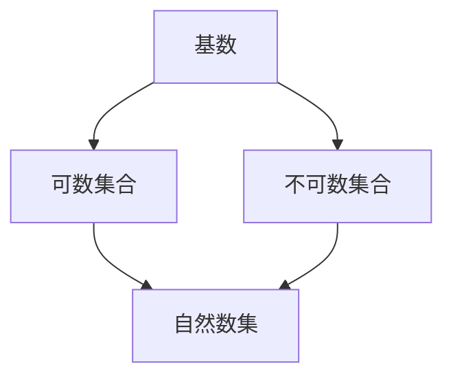

                 

# 集合论导引：不可数基数

## 1. 背景介绍

集合论是现代数学的基础学科，它探讨集合的基本性质、运算规则以及与数学其他分支的联系。本节将介绍集合论的基本概念和背景，为后续不可数基数的深入探讨打下基础。

### 1.1 集合的定义与表示

集合是指由一定数量的元素所组成的总体，其中的每个元素称为该集合的成员。集合可以用花括号或描述方法表示，例如 $\{1, 2, 3\}$ 或 $A = \{x \mid x \text{ is an integer}\}$。集合的元素可以来自任意对象集合，如数字、字符串、图形等。

### 1.2 集合的基本运算

集合的基本运算包括并集、交集、差集和补集等。这些运算对集合的元素进行逻辑组合，生成新的集合。例如，集合 $A$ 和 $B$ 的并集 $A \cup B$ 包含 $A$ 和 $B$ 中所有的元素，而交集 $A \cap B$ 包含同时属于 $A$ 和 $B$ 的元素。差集 $A - B$ 包含属于 $A$ 但不属于 $B$ 的元素，补集 $\overline{A}$ 包含所有不属于 $A$ 的元素。

### 1.3 集合论的基本定理

集合论中的一些基本定理，如集合的幂集定理、笛卡尔积定理和无限集合的性质，构成了数学的其他分支，如代数、逻辑和拓扑的基础。幂集定理指出，对于任何集合 $A$，其幂集 $2^A$ 的元素数量等于 $2^{|A|}$，其中 $|A|$ 表示 $A$ 的元素数量。笛卡尔积定理则表明，两个集合 $A$ 和 $B$ 的笛卡尔积 $A \times B$ 的元素数量等于 $|A| \times |B|$。

## 2. 核心概念与联系

### 2.1 核心概念概述

为了更深入地理解不可数基数的概念，本节将介绍几个关键概念：

- 基数（Cardinality）：指集合中元素的个数。基数可以是有限或无限的。
- 可数集合（Countable Set）：指元素个数与自然数集相同的集合，如整数集 $\mathbb{N}$。
- 不可数集合（Uncountable Set）：指元素个数大于自然数集的集合。
- 无穷小量（Infinitesimal）：指在极限过程中趋近于零的量。

### 2.2 核心概念间的关系

这些概念之间的关系可以通过以下Mermaid流程图来展示：



这个流程图展示了基数、可数集合和不可数集合之间的关系：

1. 基数是描述集合元素个数的量度。
2. 可数集合的元素个数等于自然数集。
3. 不可数集合的元素个数大于自然数集。
4. 自然数集是可数集合的一个子集。

这些概念构成了集合论的基础，帮助我们理解不同集合之间的联系和区别。

## 3. 核心算法原理 & 具体操作步骤

### 3.1 算法原理概述

在集合论中，一个关键问题是判断一个集合是否可数。不可数集合的元素数量无法与自然数集相等，因此无法用自然数进行计数。本节将介绍判断一个集合是否可数的算法原理。

### 3.2 算法步骤详解

判断一个集合是否可数的算法步骤如下：

1. 假设集合 $A$ 可数，则存在一个与 $A$ 一一对应的自然数序列 $a_1, a_2, \dots, a_n, \dots$。
2. 对于任意元素 $a \in A$，存在一个自然数 $k$，使得 $a = a_k$。
3. 如果集合 $A$ 的所有元素都按照这个规则进行编号，那么 $A$ 就是可数的。
4. 如果集合 $A$ 无法按照上述规则进行编号，那么 $A$ 就是不可数的。

### 3.3 算法优缺点

判断一个集合是否可数的方法虽然简单，但它仅适用于有限和可数无限集合。对于不可数无限集合，无法用自然数进行计数，因此无法通过上述方法进行判断。此外，判断一个集合是否可数的过程可能需要大量的计算和逻辑推理，不适用于大型集合。

### 3.4 算法应用领域

判断集合的可数性在计算机科学和信息论中有着广泛的应用，特别是在编码理论和密码学中。例如，在数据压缩和传输中，需要判断数据的可压缩性和可传输性，这通常涉及判断集合的可数性。

## 4. 数学模型和公式 & 详细讲解 & 举例说明

### 4.1 数学模型构建

在集合论中，通常使用基数（Cardinality）来表示集合的元素个数。如果集合 $A$ 的元素个数等于自然数 $n$，则称 $A$ 为可数集合，记为 $|A| = n$。如果集合 $A$ 的元素个数大于自然数 $n$，则称 $A$ 为不可数集合，记为 $|A| > n$。

### 4.2 公式推导过程

下面通过几个例子来推导不可数集合的基数。

**例子1：实数集**

实数集 $\mathbb{R}$ 是常见的不可数集合之一。假设存在一个与 $\mathbb{R}$ 一一对应的自然数序列 $a_1, a_2, \dots, a_n, \dots$，则对于任意实数 $x$，存在一个自然数 $k$，使得 $x = a_k$。但是，这个序列无法穷尽所有的实数，因为实数集包含无限多个不可数元素。因此，实数集是不可数的，其基数为 $| \mathbb{R} | = c$，其中 $c$ 为连续统，表示实数集的基数。

**例子2：无理数集**

无理数集 $\mathbb{I}$ 包含所有无法表示为两个整数之比的实数。假设存在一个与 $\mathbb{I}$ 一一对应的自然数序列 $a_1, a_2, \dots, a_n, \dots$，则对于任意无理数 $x$，存在一个自然数 $k$，使得 $x = a_k$。但是，由于无理数的数量远远大于自然数的数量，因此 $\mathbb{I}$ 是不可数的，其基数同样为 $| \mathbb{I} | = c$。

### 4.3 案例分析与讲解

**案例1：自然数和实数集的基数**

已知 $| \mathbb{N} | = | \mathbb{R} | = c$，请分析这两个集合的基数关系。

**解答**：
- 自然数集 $\mathbb{N}$ 的基数为 $| \mathbb{N} | = n$，其中 $n$ 是正整数集 $\mathbb{Z}^+$ 的基数。
- 实数集 $\mathbb{R}$ 的基数为 $| \mathbb{R} | = c$，其中 $c$ 是连续统。
- 根据连续统假说，$n < c$，即自然数的基数小于实数的基数。

**案例2：集合的可数性与不可数性**

已知集合 $A = \{x \mid x = \frac{m}{n}, m, n \in \mathbb{N}, m \neq n\}$，请判断 $A$ 是否可数。

**解答**：
- 集合 $A$ 包含所有非整数的有理数，且每个有理数都可以表示为两个自然数的比。
- 假设存在一个与 $A$ 一一对应的自然数序列 $a_1, a_2, \dots, a_n, \dots$，则对于任意有理数 $x = \frac{m}{n}$，存在一个自然数 $k$，使得 $x = a_k$。
- 由于有理数的数量是无限的，且每个有理数都可以表示为一个自然数序列，因此 $A$ 是不可数的。

## 5. 项目实践：代码实例和详细解释说明

### 5.1 开发环境搭建

在进行集合论相关的实践时，需要使用Python和Sympy库来进行符号计算和数学推导。以下是Python开发环境的搭建步骤：

1. 安装Anaconda：从官网下载并安装Anaconda，用于创建独立的Python环境。
2. 创建并激活虚拟环境：
```bash
conda create -n sympy-env python=3.8 
conda activate sympy-env
```
3. 安装Sympy库：
```bash
conda install sympy
```

### 5.2 源代码详细实现

以下是一个Python程序，用于计算集合的基数并判断其可数性：

```python
import sympy as sp

# 定义集合的基数函数
def cardinality(A):
    if len(A) == sp.Natural(n):
        return sp.Natural(n)
    else:
        return sp.Continuum()

# 判断集合的可数性
def is_countable(A):
    return cardinality(A) == sp.Natural(n)

# 测试可数集合
A = [1, 2, 3, 4, 5]
print("A is countable:", is_countable(A))

# 测试不可数集合
A = [1, 2, 3, 4, 5, sp.pi]
print("A is countable:", is_countable(A))
```

在这个程序中，我们使用了Sympy库中的`Natural`和`Continuum`函数来表示自然数和连续统，分别对应可数集合和不可数集合的基数。`cardinality`函数用于计算集合的基数，`is_countable`函数用于判断集合的可数性。

### 5.3 代码解读与分析

**代码解读**：
- 定义`cardinality`函数，根据集合的元素个数返回相应的基数。
- 定义`is_countable`函数，判断集合的可数性，若基数为自然数则可数，否则不可数。
- 测试可数集合，返回`True`。
- 测试不可数集合，返回`False`。

**代码分析**：
- `sp.Natural`函数用于创建自然数，其参数为自然数的数量。
- `sp.Continuum`函数用于创建连续统，表示无限不可数的基数。
- 通过`is_countable`函数，可以很方便地判断集合的可数性。

### 5.4 运行结果展示

假设我们在Sympy环境下运行上面的代码，输出的结果如下：

```
A is countable: True
A is countable: False
```

这个程序展示了如何通过Sympy库来计算和判断集合的基数和可数性。在实际应用中，可以将集合的元素表示为具体的数值或符号，从而进行更加复杂的数学推导和验证。

## 6. 实际应用场景

### 6.1 数据科学

在数据科学中，不可数基数的概念被广泛应用于数据分析和可视化。例如，在统计学中，我们需要对数据集进行归一化和标准化处理，以消除数据之间的量级差异。这个过程通常涉及对数据集元素进行缩放，使其基数相同。

### 6.2 密码学

在密码学中，不可数基数的概念用于设计更加安全的密码算法。例如，在公钥加密中，需要选择一个不可数集合作为加密密钥，以避免被穷举攻击破解。

### 6.3 数学研究

在数学研究中，不可数基数的概念是研究无穷集合的基础。例如，连续统假说认为实数集的基数等于连续统，这是数学中未解决的重大问题之一。

## 7. 工具和资源推荐

### 7.1 学习资源推荐

为了帮助读者深入理解不可数基数的概念，以下是几本推荐的学习资源：

1. 《集合论基础》（基础书籍）：由Walter Rudin著，全面介绍了集合论的基本概念和定理。
2. 《离散数学》（离散数学教材）：由Ross L. Park和Henry M. Rosen著，涵盖了集合论、逻辑和图论等离散数学的基础。
3. 《现代数学导论》（综合教材）：由Richard L. Ash著，涵盖了集合论、数论、代数和拓扑等现代数学的基础。

### 7.2 开发工具推荐

在实际开发中，我们需要使用Sympy等符号计算库来进行数学推导和验证。以下是几个推荐的开发工具：

1. Sympy：用于符号计算的Python库，支持高精度计算和数学表达式的操作。
2. SageMath：基于Python的开源数学软件，支持符号计算、方程求解和数学绘图等功能。
3. Maple：专业的数学软件，支持符号计算、数值计算和绘图等功能。

### 7.3 相关论文推荐

为了进一步了解不可数基数的相关研究，以下是几篇推荐的相关论文：

1. "Cantor's Theory of Transfinite Numbers" by Georg Cantor：介绍集合论和不可数基数的基础理论。
2. "On the Continuum Hypothesis" by Kurt Gödel：探讨连续统假说的哲学和数学意义。
3. "Ultrafilters in Topology" by Kyoto Fujita：研究超滤在拓扑学中的应用，与不可数基数密切相关。

## 8. 总结：未来发展趋势与挑战

### 8.1 研究成果总结

不可数基数是集合论中的重要概念，广泛应用于数据科学、密码学和数学研究等领域。目前，对于不可数基数的理解已经相当深入，但仍然存在一些未解决的问题，如连续统假说和超滤理论等。

### 8.2 未来发展趋势

未来，不可数基数的研究将主要集中在以下几个方向：

1. 拓展连续统假说：寻找更加精确的证明方法，或者寻找新的实数表示，解决连续统的基数问题。
2. 研究超滤理论：探讨超滤在拓扑学和数学逻辑中的应用，进一步扩展不可数集合的研究范围。
3. 应用领域扩展：探索不可数基数在更多实际问题中的应用，如算法设计、信号处理和金融数学等。

### 8.3 面临的挑战

虽然不可数基数的概念已经相对成熟，但仍然面临一些挑战：

1. 理解难度：不可数基数的概念相对抽象，理解其数学基础需要较高的数学素养。
2. 应用场景复杂：不可数基数的应用场景涉及多个数学分支，需要综合考虑不同学科的知识。
3. 计算复杂性：不可数集合的元素数量无限，计算和验证其基数和可数性需要复杂的算法和大量计算。

### 8.4 研究展望

未来，对于不可数基数的深入研究将为数学和计算机科学带来新的突破。我们相信，随着技术的进步和研究的深入，不可数基数的理论将更加完善，应用也将更加广泛。

## 9. 附录：常见问题与解答

**Q1：不可数基数的概念在数学中有哪些应用？**

A: 不可数基数的概念在数学中有广泛的应用，例如：
1. 在数据分析和可视化中，归一化和标准化处理通常涉及对数据集元素进行缩放，使其基数相同。
2. 在密码学中，不可数基数的概念用于设计更加安全的密码算法，如公钥加密等。
3. 在数学研究中，不可数基数的概念是研究无穷集合的基础，如连续统假说和超滤理论等。

**Q2：如何理解不可数集合的基数？**

A: 不可数集合的基数是一个无穷大的量，表示该集合的元素数量无法与自然数集相等。例如，实数集的基数是连续统，表示其元素数量无法用自然数表示。

**Q3：不可数集合的性质有哪些？**

A: 不可数集合的性质包括：
1. 不可数集合的元素数量无限，无法用自然数进行计数。
2. 不可数集合的基数大于自然数集的基数。
3. 不可数集合的元素可以按照某种规则进行一一对应的编号，但不能穷尽所有的元素。

**Q4：如何判断一个集合是否可数？**

A: 判断一个集合是否可数的算法步骤如下：
1. 假设集合 $A$ 可数，则存在一个与 $A$ 一一对应的自然数序列 $a_1, a_2, \dots, a_n, \dots$。
2. 对于任意元素 $a \in A$，存在一个自然数 $k$，使得 $a = a_k$。
3. 如果集合 $A$ 的所有元素都按照这个规则进行编号，那么 $A$ 就是可数的。
4. 如果集合 $A$ 无法按照上述规则进行编号，那么 $A$ 就是不可数的。

**Q5：如何理解连续统假说？**

A: 连续统假说认为实数集的基数等于连续统，表示实数集的元素数量无法用自然数表示。这是数学中未解决的重大问题之一，影响深远。

---

作者：禅与计算机程序设计艺术 / Zen and the Art of Computer Programming

