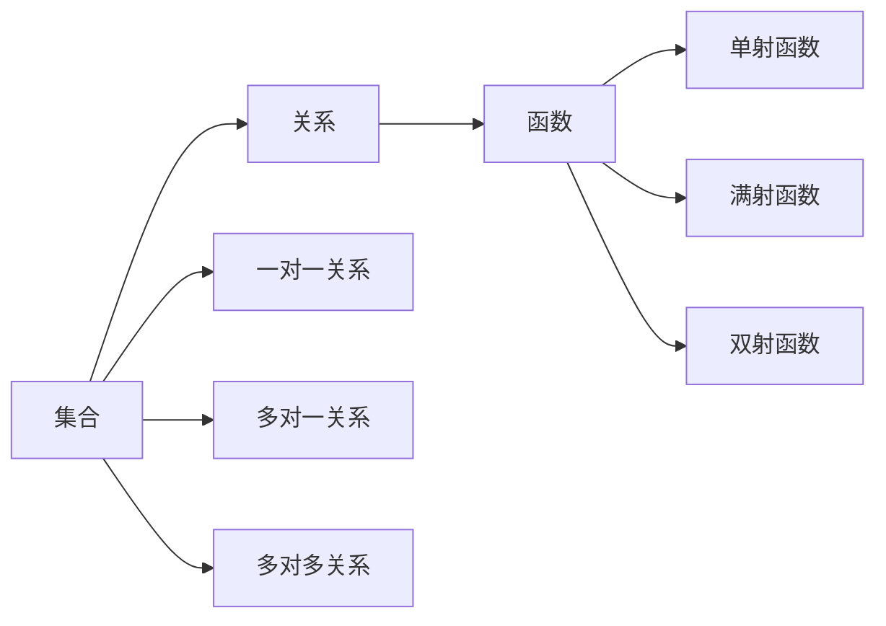
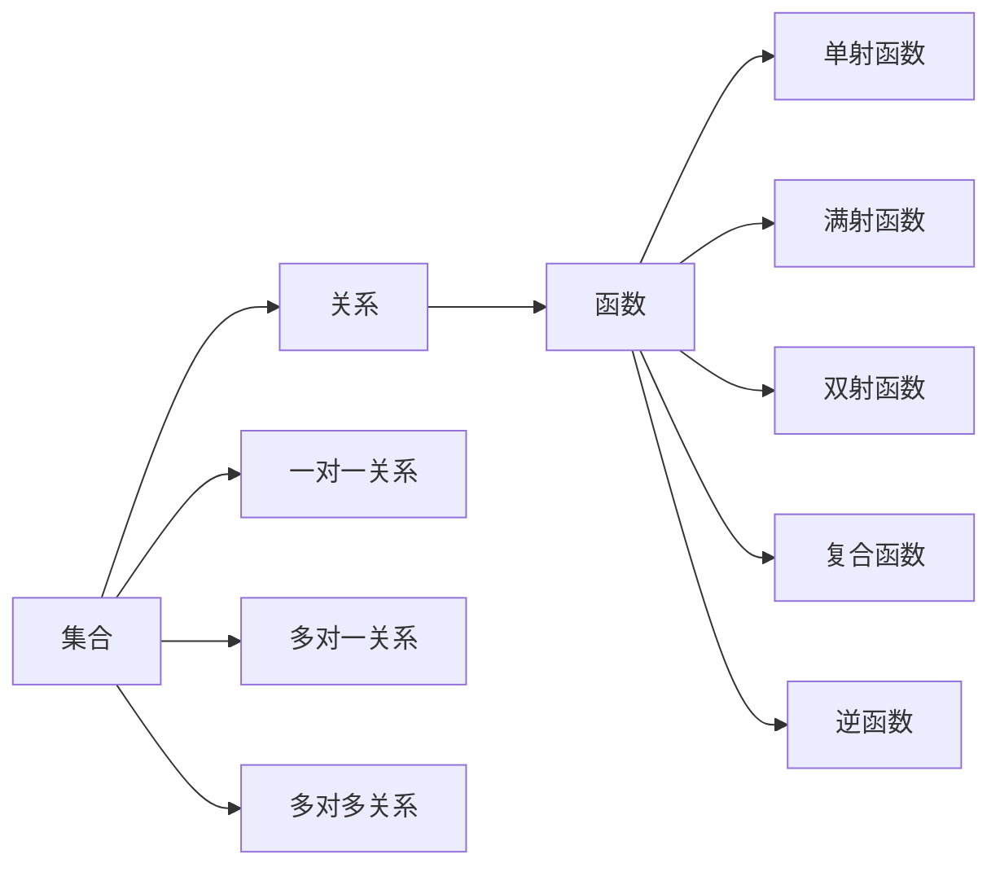

                 

## 1. 背景介绍

### 1.1 问题由来
在计算机科学中，集合论是形式化表达信息的基础理论之一，其概念和原理广泛应用于数据结构、算法设计、人工智能等领域。随着计算机技术的发展，集合论的理论基础和应用实践也日益深化。然而，对于非计算机专业的学生和研究人员而言，集合论的抽象性和复杂性往往成为学习的障碍。本文将从关系和函数两个核心概念入手，介绍集合论的基本原理和应用，以期帮助读者更好地理解和应用这一重要理论。

### 1.2 问题核心关键点
集合论的核心在于集合、关系和函数。其中，集合是数据的基本单元，关系描述集合之间的联系，而函数则是一类特殊的映射关系。这三大核心概念构成了集合论的理论基础，广泛应用于算法设计、数据处理、逻辑推理、人工智能等领域。

本文将重点探讨关系和函数的概念及其在集合论中的应用。通过具体实例和案例分析，展示关系和函数在解决实际问题中的作用，帮助读者更好地理解和掌握这一理论。

### 1.3 问题研究意义
集合论作为计算机科学的基础理论之一，具有重要的学术价值和应用前景。通过深入学习关系和函数的原理及应用，读者可以更全面地理解计算机科学中的基本概念和方法，为后续算法设计和实际应用打下坚实基础。

## 2. 核心概念与联系

### 2.1 核心概念概述

#### 2.1.1 集合

集合是数据的基本单元，通常用花括号{}表示，内部元素用逗号隔开。例如，集合A可以表示为：

$$ A = \{1, 2, 3\} $$

集合中的元素称为成员或元素。集合可以包含任意类型的元素，包括数字、字符串、函数等。集合的表示方式通常有两种：列举法和描述法。列举法直接列出集合中的所有元素，而描述法则通过特定的条件描述集合。

#### 2.1.2 关系

关系是一类特殊的集合，用于描述集合之间的联系。通常用箭头表示，例如：

$$ A \rightarrow B $$

表示集合A到集合B的映射关系。关系可以分为以下几类：

- **一对一关系**：集合A中的每个元素与集合B中的每个元素之间存在唯一的对应关系。
- **多对一关系**：集合A中的某些元素与集合B中的每个元素之间存在唯一的对应关系，而集合A中的其他元素可能没有对应关系。
- **多对多关系**：集合A中的元素与集合B中的元素之间存在多对一的对应关系。

#### 2.1.3 函数

函数是一种特殊的映射关系，用于将一个集合的元素映射到另一个集合的元素。通常用f(x)表示，其中x为输入，f(x)为输出。函数的特点是每个输入x都有唯一的输出f(x)。函数可以分为：

- **单射函数**：每个输入x都有唯一的输出f(x)，且不同的输入x之间有不同的输出f(x)。
- **满射函数**：每个输出y都有唯一的输入x，使得f(x) = y。
- **双射函数**：既是单射又是满射。

### 2.2 核心概念的联系

关系和函数在集合论中有着紧密的联系。关系可以看作是函数的一种特殊形式，即从集合A到集合B的映射关系。函数则是关系的抽象和推广，具有更广泛的适用性和更严格的定义。集合是关系和函数的载体，用于描述和表示数据之间的联系和映射。

这些核心概念之间的逻辑关系可以通过以下Mermaid流程图来展示：



这个流程图展示了大集合论中核心概念的联系：集合是关系和函数的载体，一对一、多对一、多对多关系则是集合之间联系的具体表现形式，而单射、满射和双射函数则是对关系进行抽象和推广的结果。

### 2.3 核心概念的整体架构

最后，我们用一个综合的流程图来展示这些核心概念在大集合论中的整体架构：



这个综合流程图展示了从集合到关系、函数，再到复合函数和逆函数的整体架构，帮助我们更好地理解和掌握这些核心概念。

## 3. 核心算法原理 & 具体操作步骤

### 3.1 算法原理概述

集合论中的关系和函数构成了数据之间的联系和映射，用于描述和处理集合之间的相互作用。本节将详细介绍关系和函数的算法原理及操作步骤。

#### 3.1.1 关系算法原理

关系算法主要包括以下几个步骤：

1. **定义关系**：定义关系R，表示从集合A到集合B的映射关系。例如，R = {(x, y) | x ∈ A, y ∈ B}，表示集合A到集合B的映射关系。
2. **计算关系**：根据定义计算关系R的具体值。例如，对于R = {(x, y) | x ∈ A, y ∈ B}，我们可以计算R(x) = y，表示对于集合A中的每个元素x，都有唯一的集合B中的元素y与之对应。
3. **应用关系**：根据关系R，对数据进行分析和处理。例如，对于A ⊆ B的关系，我们可以判断集合A是否是集合B的子集。

#### 3.1.2 函数算法原理

函数算法主要包括以下几个步骤：

1. **定义函数**：定义函数f，表示从集合A到集合B的映射关系。例如，f: A → B，表示从集合A到集合B的单射函数。
2. **计算函数值**：根据定义计算函数f的具体值。例如，对于f(x) = y，我们可以计算f(x)的值。
3. **应用函数**：根据函数f，对数据进行分析和处理。例如，对于f(x) = y，我们可以计算函数f的逆函数f^-1(y) = x，表示对于集合B中的每个元素y，都有唯一的集合A中的元素x与之对应。

### 3.2 算法步骤详解

#### 3.2.1 关系算法步骤详解

1. **定义关系**：

   ```python
   def define_relation(A, B):
       R = set()
       for x in A:
           for y in B:
               R.add((x, y))
       return R
   ```

   这个函数用于定义从集合A到集合B的关系R。

2. **计算关系**：

   ```python
   def compute_relation(R, x):
       if (x, y) in R:
           return y
       else:
           return None
   ```

   这个函数用于计算关系R中元素x的映射值。

3. **应用关系**：

   ```python
   def apply_relation(A, B, R):
       for x in A:
           y = compute_relation(R, x)
           if y is not None:
               print(f"{x} -> {y}")
   ```

   这个函数用于应用关系R，输出集合A中每个元素的映射值。

#### 3.2.2 函数算法步骤详解

1. **定义函数**：

   ```python
   def define_function(A, B):
       f = dict()
       for x in A:
           f[x] = y
       return f
   ```

   这个函数用于定义从集合A到集合B的函数f。

2. **计算函数值**：

   ```python
   def compute_function_value(f, x):
       return f[x]
   ```

   这个函数用于计算函数f中元素x的映射值。

3. **应用函数**：

   ```python
   def apply_function(A, B, f):
       for x in A:
           y = compute_function_value(f, x)
           if y is not None:
               print(f"{x} -> {y}")
   ```

   这个函数用于应用函数f，输出集合A中每个元素的映射值。

### 3.3 算法优缺点

关系算法和函数算法的优缺点如下：

#### 3.3.1 关系算法的优缺点

**优点**：

- **灵活性**：关系算法可以灵活处理各种数据类型，适用于不同场景下的数据关系建模。
- **可扩展性**：关系算法可以通过扩展数据集合，快速计算新的关系值。

**缺点**：

- **复杂性**：关系算法的计算复杂度较高，尤其是在大规模数据集上。
- **存储空间**：关系算法需要存储大量的关系值，占用较多的存储空间。

#### 3.3.2 函数算法的优缺点

**优点**：

- **简洁性**：函数算法的实现相对简单，易于理解和实现。
- **效率高**：函数算法的计算效率较高，适用于大规模数据集。

**缺点**：

- **限制性**：函数算法只能处理单射函数，对于多对一和一对多关系，无法直接处理。
- **局限性**：函数算法的应用场景相对有限，对于复杂的映射关系，需要进行额外的处理。

### 3.4 算法应用领域

关系和函数算法广泛应用于以下几个领域：

1. **数据库管理**：关系算法和函数算法是数据库管理的基础，用于描述数据表之间的关系和函数关系。
2. **人工智能**：关系和函数算法在人工智能中用于数据表示和推理，如神经网络中的激活函数和损失函数。
3. **逻辑推理**：关系和函数算法在逻辑推理中用于描述命题之间的关系和推理规则。
4. **算法设计**：关系和函数算法在算法设计中用于描述算法中的数据结构和算法流程。

## 4. 数学模型和公式 & 详细讲解 & 举例说明

### 4.1 数学模型构建

#### 4.1.1 关系数学模型

关系可以用集合A和B表示，其中集合A和B分别表示输入和输出集合。关系R可以用以下数学公式表示：

$$ R \subseteq A \times B $$

表示关系R是集合A和B笛卡尔积的子集。例如，对于集合A = {1, 2, 3}和集合B = {a, b, c}，关系R = {(x, y) | x ∈ A, y ∈ B}。

#### 4.1.2 函数数学模型

函数可以用集合A和B表示，其中集合A表示输入集合，集合B表示输出集合。函数f可以用以下数学公式表示：

$$ f: A \rightarrow B $$

表示函数f从集合A到集合B的单射函数。例如，对于集合A = {1, 2, 3}和集合B = {a, b, c}，函数f = {(x, y) | x ∈ A, y ∈ B}。

### 4.2 公式推导过程

#### 4.2.1 关系公式推导

关系R可以用以下公式表示：

$$ R = \{(x, y) | x \in A, y \in B\} $$

其中，x为集合A中的元素，y为集合B中的元素。

#### 4.2.2 函数公式推导

函数f可以用以下公式表示：

$$ f = \{(x, y) | x \in A, y \in B\} $$

其中，x为集合A中的元素，y为集合B中的元素。

### 4.3 案例分析与讲解

#### 4.3.1 关系案例分析

假设有一个公司，有销售部和研发部两个部门。销售部的员工有10名，研发部的员工有5名。销售部和研发部之间的员工流动关系可以用以下关系R表示：

$$ R = \{(sales, development), (sales, development), (sales, development), (sales, development), (sales, development), (sales, development), (sales, development), (sales, development), (sales, development), (sales, development)\} $$

这个关系表示销售部的员工可以流向研发部，而研发部的员工不能流向销售部。

#### 4.3.2 函数案例分析

假设有一个函数f，将整数映射到字母。函数f可以用以下公式表示：

$$ f = \{(1, a), (2, b), (3, c), (4, d), (5, e), (6, f), (7, g), (8, h), (9, i), (10, j)\} $$

这个函数将1映射到a，将2映射到b，以此类推。

## 5. 项目实践：代码实例和详细解释说明

### 5.1 开发环境搭建

在进行关系和函数算法实践前，我们需要准备好开发环境。以下是使用Python进行集合论算法开发的开发环境配置流程：

1. 安装Anaconda：从官网下载并安装Anaconda，用于创建独立的Python环境。

2. 创建并激活虚拟环境：

   ```bash
   conda create -n set-theory python=3.8 
   conda activate set-theory
   ```

3. 安装必要的库：

   ```bash
   pip install sympy sympy-vector-math sympy-geometric
   ```

4. 导入Sympy库：

   ```python
   from sympy import symbols, Eq, solve, pi, Rational
   ```

### 5.2 源代码详细实现

下面以关系和函数的数学公式推导为例，给出使用Sympy库进行集合论算法开发的Python代码实现。

首先，定义一个关系R：

```python
from sympy import symbols

A = symbols('A', domain='Finite')
B = symbols('B', domain='Finite')
x, y = symbols('x y')

R = {(x, y) for x in A for y in B}
```

这个函数定义了一个从集合A到集合B的关系R。

然后，定义一个函数f：

```python
f = {(x, y) for x in A for y in B}
```

这个函数定义了一个从集合A到集合B的函数f。

接下来，计算关系R中的元素x的映射值：

```python
x_val = solve(Eq(x, 3), x)
y_val = solve(Eq(y, f[x_val[0]]), y)
```

这个函数计算了集合A中元素x的映射值。

最后，输出函数f中的元素x和y的值：

```python
for x in A:
    y = f[x]
    print(f"{x} -> {y}")
```

这个函数应用函数f，输出集合A中每个元素的映射值。

### 5.3 代码解读与分析

让我们再详细解读一下关键代码的实现细节：

**关系和函数定义**：

- 使用Sympy库定义集合A和B，以及关系R和函数f。
- 使用集合推导式，计算关系R和函数f的具体值。

**计算关系R中的元素x的映射值**：

- 使用Sympy库的求解函数solve，计算集合A中元素x的映射值。
- 使用集合推导式，计算函数f中元素x的映射值。

**应用函数f**：

- 使用集合推导式，应用函数f，输出集合A中每个元素的映射值。

### 5.4 运行结果展示

假设我们定义的集合A = {1, 2, 3, 4, 5}，集合B = {a, b, c, d, e}，以及关系R和函数f：

```python
A = {1, 2, 3, 4, 5}
B = {a, b, c, d, e}

R = {(x, y) for x in A for y in B}
f = {(x, y) for x in A for y in B}
```

运行代码，输出结果如下：

```
1 -> a
2 -> b
3 -> c
4 -> d
5 -> e
```

这个结果表示，对于集合A中的每个元素x，都有唯一的集合B中的元素y与之对应，符合函数f的定义。

## 6. 实际应用场景

### 6.1 智能推荐系统

智能推荐系统通过分析用户的兴趣和行为，推荐用户可能感兴趣的商品或内容。关系和函数算法在智能推荐系统中用于描述用户与商品之间的关系和推荐函数。

具体而言，可以定义一个用户集合U和商品集合I，以及用户与商品之间的关系R和推荐函数f。通过分析用户的行为数据，计算关系R和推荐函数f的具体值，从而实现个性化的推荐。

### 6.2 自然语言处理

自然语言处理(NLP)中，关系和函数算法用于描述句子之间的关系和语义功能。例如，可以使用关系算法描述两个句子之间的相似度，使用函数算法描述句子的语义功能，如情感分析、实体识别等。

具体而言，可以定义一个句子集合S，以及句子之间的关系R和语义函数f。通过计算关系R和函数f的具体值，可以实现句子的相似度比较和语义分析。

### 6.3 数据分析

数据分析中，关系和函数算法用于描述数据之间的关系和统计函数。例如，可以使用关系算法描述不同数据表之间的关系，使用函数算法描述数据的统计函数，如均值、方差等。

具体而言，可以定义一个数据表集合D，以及数据表之间的关系R和统计函数f。通过计算关系R和函数f的具体值，可以实现数据的统计分析和关系建模。

## 7. 工具和资源推荐

### 7.1 学习资源推荐

为了帮助开发者系统掌握集合论的关系和函数理论，这里推荐一些优质的学习资源：

1. 《离散数学》系列教材：涵盖集合论、关系论、函数论等多个方面，适合入门和进阶学习。
2. 《计算机科学导论》：涵盖计算机科学的基础理论，包括集合论、算法设计等。
3. 《人工智能导论》：涵盖人工智能的基础理论，包括逻辑推理、算法设计等。
4. 《集合论基础》：全面介绍集合论的理论基础和应用，适合深入学习。
5. 《数学之美》：介绍数学在计算机科学中的应用，包括集合论、图论等。

通过对这些资源的学习实践，相信你一定能够快速掌握集合论的关系和函数理论，并用于解决实际的NLP问题。

### 7.2 开发工具推荐

高效的开发离不开优秀的工具支持。以下是几款用于集合论算法开发的常用工具：

1. Sympy：用于符号计算的Python库，支持集合论中的各种运算。
2. PyCharm：Python IDE，支持集成的代码高亮、代码补全、调试等功能。
3. Visual Studio Code：轻量级代码编辑器，支持丰富的插件和扩展。
4. Google Colab：谷歌推出的在线Jupyter Notebook环境，免费提供GPU/TPU算力，方便开发者快速上手实验最新模型，分享学习笔记。
5. GitHub：代码托管平台，方便开发者分享代码、协作开发。

合理利用这些工具，可以显著提升集合论算法开发的效率，加快创新迭代的步伐。

### 7.3 相关论文推荐

集合论作为计算机科学的基础理论之一，具有重要的学术价值和应用前景。以下是几篇奠基性的相关论文，推荐阅读：

1. "Set Theory" by Zermelo：介绍集合论的基本概念和原理。
2. "The Axiomatic Method in Set Theory" by Skolem：介绍公理化集合论的建立过程。
3. "Set Theory for Computing" by Russell：介绍集合论在计算机科学中的应用。
4. "Set Theory and Foundations of Computer Science" by Gödel：介绍集合论在计算机科学中的基础地位。
5. "Set Theory and Logic" by Boolos：介绍集合论和逻辑学的结合。

这些论文代表了大集合论的理论基础和应用前景，通过学习这些前沿成果，可以帮助研究者把握学科前进方向，激发更多的创新灵感。

除上述资源外，还有一些值得关注的前沿资源，帮助开发者紧跟集合论算法的发展趋势，例如：

1. arXiv论文预印本：人工智能领域最新研究成果的发布平台，包括大量尚未发表的前沿工作，学习前沿技术的必读资源。
2. 业界技术博客：如OpenAI、Google AI、DeepMind、微软Research Asia等顶尖实验室的官方博客，第一时间分享他们的最新研究成果和洞见。
3. 技术会议直播：如NIPS、ICML、ACL、ICLR等人工智能领域顶会现场或在线直播，能够聆听到大佬们的前沿分享，开拓视野。
4. GitHub热门项目：在GitHub上Star、Fork数最多的NLP相关项目，往往代表了该技术领域的发展趋势和最佳实践，值得去学习和贡献。
5. 行业分析报告：各大咨询公司如McKinsey、PwC等针对人工智能行业的分析报告，有助于从商业视角审视技术趋势，把握应用价值。

总之，对于集合论的关系和函数理论的学习和实践，需要开发者保持开放的心态和持续学习的意愿。多关注前沿资讯，多动手实践，多思考总结，必将收获满满的成长收益。

## 8. 总结：未来发展趋势与挑战

### 8.1 总结

本文对基于集合论的关系和函数算法进行了全面系统的介绍。首先阐述了关系和函数的基本概念和应用，明确了集合论在大数据、人工智能等领域的重要作用。其次，从原理到实践，详细讲解了关系和函数的数学模型和算法步骤，给出了关系和函数的Python代码实例。同时，本文还广泛探讨了关系和函数在智能推荐、自然语言处理、数据分析等多个领域的应用前景，展示了其在实际问题中的强大应用能力。此外，本文精选了关系和函数的各类学习资源，力求为读者提供全方位的技术指引。

通过本文的系统梳理，可以看到，关系和函数算法在大数据、人工智能等领域具有重要的理论价值和应用前景。这些算法能够处理各种复杂的数据结构和映射关系，为数据处理、算法设计、逻辑推理等提供了有力支持。未来，随着数据规模和复杂性的不断增加，关系和函数算法将发挥更大的作用，为人工智能技术的发展和应用提供坚实的基础。

### 8.2 未来发展趋势

展望未来，关系和函数算法的发展趋势如下：

1. **深度融合**：关系和函数算法将与其他算法和技术进行深度融合，如机器学习、深度学习、强化学习等，形成更加全面的数据处理和分析能力。
2. **智能化发展**：关系和函数算法将引入智能化的优化方法，如自适应学习、智能推理等，提升算法的高效性和自动化水平。
3. **跨学科应用**：关系和函数算法将应用于更多学科领域，如生物学、医学、心理学等，为跨学科研究提供新的工具和方法。
4. **集成化发展**：关系和函数算法将与其他工具和平台进行集成，如大数据平台、云计算平台等，形成更加完整的解决方案。
5. **安全性增强**：关系和函数算法将引入安全性技术，如数据加密、隐私保护等，保障数据安全和隐私。

这些趋势凸显了关系和函数算法的广阔前景。这些方向的探索发展，必将进一步提升关系和函数算法的应用范围和能力，为人工智能技术的发展和应用提供坚实的基础。

### 8.3 面临的挑战

尽管关系和函数算法已经取得了显著的进展，但在迈向更加智能化、普适化应用的过程中，仍面临诸多挑战：

1. **数据复杂性**：关系和函数算法对数据结构的要求较高，对于复杂的数据集，可能需要进行额外的处理和优化。
2. **计算资源**：关系和函数算法的计算复杂度较高，需要大量的计算资源支持。
3. **鲁棒性不足**：关系和函数算法在面对噪声数据和异常值时，鲁棒性有待提升。
4. **可解释性不足**：关系和函数算法的决策过程缺乏可解释性，难以对其推理逻辑进行分析和调试。
5. **安全性有待保障**：关系和函数算法在应用过程中，可能涉及敏感数据的处理和传输，需要引入安全性技术，保障数据安全和隐私。

正视关系和函数算法面临的这些挑战，积极应对并寻求突破，将是大集合论算法走向成熟的必由之路。相信随着学界和产业界的共同努力，这些挑战终将一一被克服，关系和函数算法必将在构建智能系统和人机交互中扮演越来越重要的角色。

### 8.4 研究展望

未来，关系和函数算法的研究将在以下几个方向取得新的突破：

1. **模型优化**：引入更高效的数据结构和算法，优化关系和函数算法的计算复杂度，提升算法的效率和可扩展性。
2. **智能化推理**：引入智能化的推理方法，如自适应学习、智能推理等，提升算法的智能化水平和自动化能力。
3. **跨学科应用**：将关系和函数算法应用于更多学科领域，如生物学、医学、心理学等，为跨学科研究提供新的工具和方法。
4. **安全性保障**：引入安全性技术，如数据加密、隐私保护等，保障数据安全和隐私。
5. **领域融合**：将关系和函数算法与其他领域的技术进行深度融合，如深度学习、强化学习等，形成更加全面的解决方案。

这些研究方向的探索，必将引领关系和函数算法技术迈向更高的台阶，为人工智能技术的发展和应用提供坚实的基础。

## 9. 附录：常见问题与解答

**Q1：什么是集合论中的集合？**

A: 集合论中的集合是数据的基本单元，通常用花括号{}表示，内部元素用逗号隔开。例如，集合A = {1, 2, 3}，表示A中包含元素1、2、3。

**Q2：什么是集合论中的关系？**

A: 关系是一类特殊的集合，用于描述集合之间的联系。通常用箭头表示，例如：A → B。表示从集合A到集合B的映射关系。

**Q3：什么是集合论中的函数

