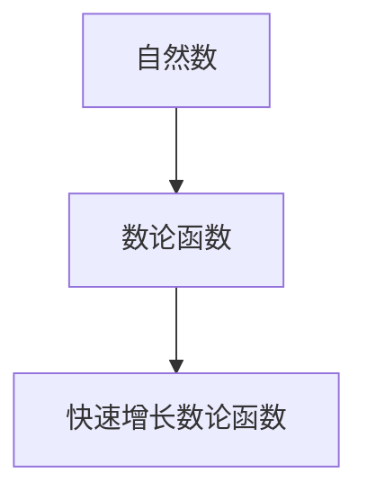
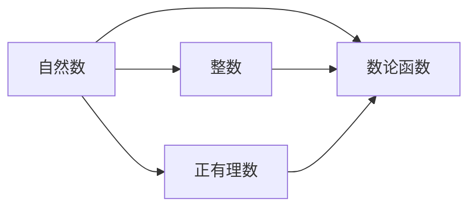
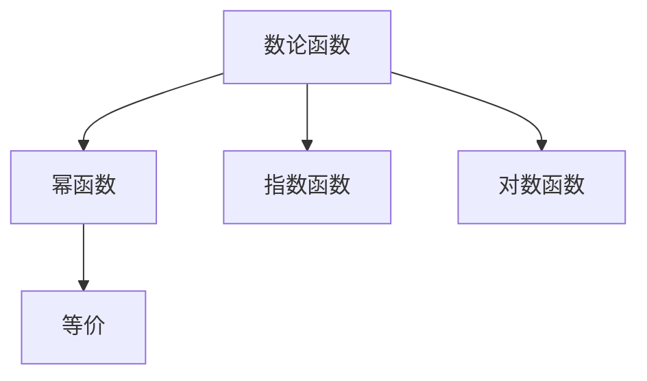
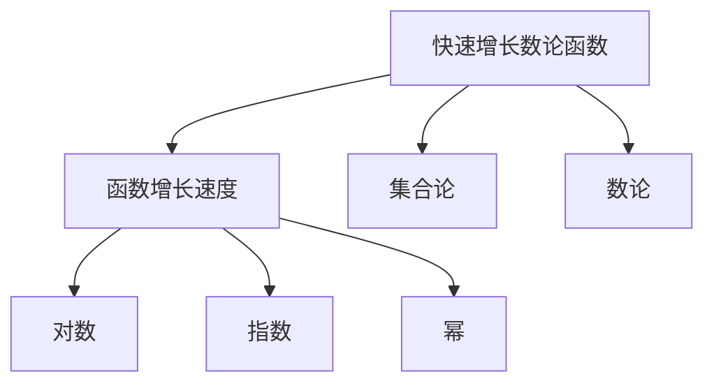
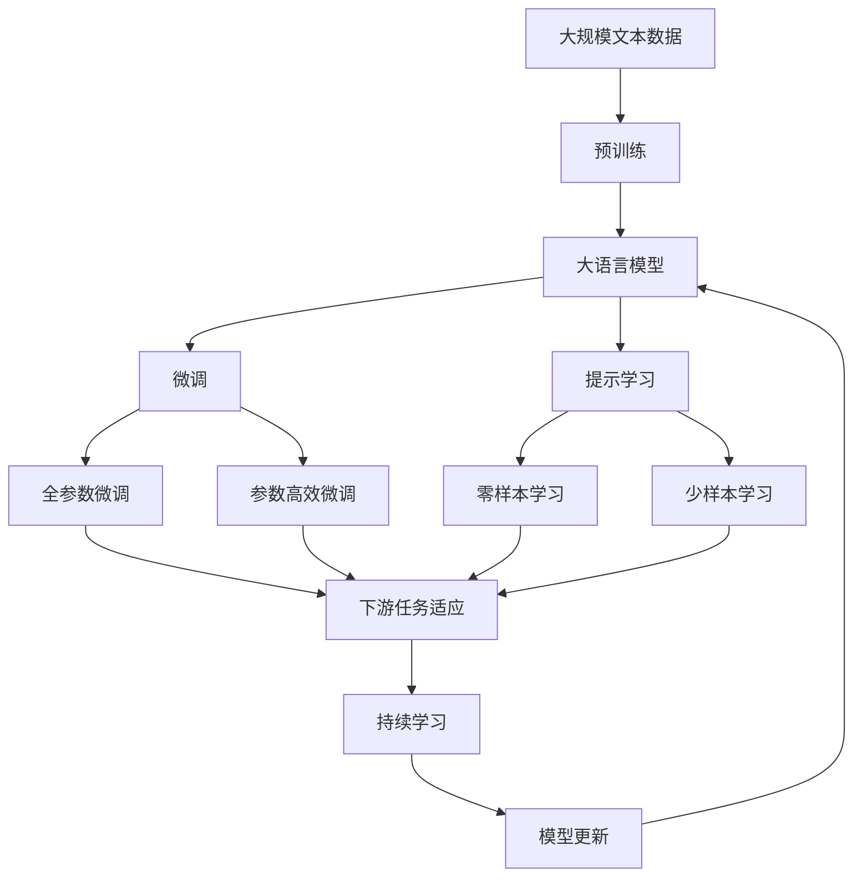

                 

# 集合论导引：快速增长数论函数层次

> 关键词：集合论,数论函数,快速增长,快速增长数论函数,集合论层次

## 1. 背景介绍

### 1.1 问题由来
数论函数在数学中有着重要地位，是数论、组合数学和算法分析的重要工具。快速增长数论函数是一类特殊的数论函数，其增长速度远超线性函数或多项式函数。本博文旨在介绍数论函数，特别是快速增长数论函数的定义、性质和应用。

### 1.2 问题核心关键点
数论函数的定义和研究可以追溯到Euler和Dirichlet时代。数论函数是一类映射自然数的函数，其值通常是正整数或有限集合。快速增长数论函数是一种增长速度特别快的数论函数，可以定义为与幂函数等价的函数，但其定义域和值域更广泛，形式更为多样。这类函数在数论、组合数学、计算机科学等领域中有着广泛的应用，如计数问题、复杂度分析、算法设计等。

### 1.3 问题研究意义
研究数论函数，特别是快速增长数论函数，对于深入理解计算机科学的算法复杂度和数据结构，以及设计和分析高效算法具有重要意义。这类函数层次分明，性质丰富，能够帮助我们更好地理解和解决实际问题。

## 2. 核心概念与联系

### 2.1 核心概念概述
为了更深入地理解数论函数，首先需要明确以下几个关键概念：

1. **自然数**：通常指正整数，即 $\{1, 2, 3, \ldots\}$。自然数集合也常用符号 $\mathbb{N}$ 表示。
2. **数论函数**：将自然数映射到正整数或有限集合的函数。数论函数的定义域和值域通常是自然数集，但有时也可能涉及更广泛的集合，如整数集 $\mathbb{Z}$ 或正有理数集 $\mathbb{Q}^+$。
3. **快速增长数论函数**：一类特殊的数论函数，其增长速度比任何多项式函数都快，可以定义为等价于幂函数的函数。

这些概念之间的逻辑关系可以通过以下Mermaid流程图来展示：



这个流程图展示了从自然数到数论函数再到快速增长数论函数的关系：

1. 自然数是一切数的起点。
2. 数论函数是一类将自然数映射到正整数或有限集合的函数。
3. 快速增长数论函数是一类特殊的数论函数，其增长速度特别快。

### 2.2 概念间的关系

这些核心概念之间存在着紧密的联系，形成了数论函数的完整体系。下面我们通过几个Mermaid流程图来展示这些概念之间的关系。

#### 2.2.1 数论函数的定义域和值域



这个流程图展示了数论函数的定义域和值域可以更加广泛，可以是整数集 $\mathbb{Z}$ 或正有理数集 $\mathbb{Q}^+$。

#### 2.2.2 数论函数与幂函数的等价性



这个流程图展示了数论函数可以等价于幂函数、指数函数和对数函数。这些函数都是快速增长数论函数的典型代表。

#### 2.2.3 快速增长数论函数的性质



这个流程图展示了快速增长数论函数的增长速度远超对数、指数和幂函数，具有更强的集合论和数论性质。

### 2.3 核心概念的整体架构

最后，我们用一个综合的流程图来展示这些核心概念在大语言模型微调过程中的整体架构：



这个综合流程图展示了从预训练到大语言模型微调，再到持续学习的完整过程。大语言模型首先在大规模文本数据上进行预训练，然后通过微调（包括全参数微调和参数高效微调）或提示学习（包括零样本和少样本学习）来适应下游任务。最后，通过持续学习技术，模型可以不断学习新知识，同时避免遗忘旧知识。

## 3. 核心算法原理 & 具体操作步骤
### 3.1 算法原理概述

快速增长数论函数的定义是基于幂函数的等价性。形式化地，如果存在一个常数 $C$ 和一个自然数 $k$，使得对于所有的 $n \in \mathbb{N}$，都有 $f(n) \leq Cn^k$，则称 $f(n)$ 为“快速增长”数论函数。通常我们只关注增长速度最慢和最快的数论函数，即与幂函数等价的函数。

在实践中，快速增长数论函数的增长速度远超线性函数或多项式函数，常用于复杂度分析和算法设计。例如，$2^{2^n}$ 和 $n!$ 是常见的快速增长数论函数。

### 3.2 算法步骤详解

以下是快速增长数论函数定义和计算的步骤：

**Step 1: 确定函数的增长形式**

首先确定函数 $f(n)$ 的增长形式。如果 $f(n) = \text{poly}(n)$，则称其为多项式函数，增长速度较慢。如果 $f(n) = 2^{2^n}$ 或 $f(n) = n!$，则称其为快速增长函数，增长速度极快。

**Step 2: 确定常数和指数**

通过幂函数的等价性，找到对应的常数 $C$ 和指数 $k$。对于 $f(n) = 2^{2^n}$，可以发现 $C=1$ 和 $k=2^n$。

**Step 3: 计算函数值**

根据确定的常数和指数，计算函数在任意自然数 $n$ 处的值。对于 $f(n) = 2^{2^n}$，直接计算即可。

**Step 4: 分析函数性质**

研究函数的性质，如单调性、周期性、连续性等。对于 $f(n) = 2^{2^n}$，可以发现函数是单调递增的，且在 $n \to \infty$ 时，函数值增长极快。

### 3.3 算法优缺点

快速增长数论函数的优势在于其定义和计算相对简单，适用于复杂度分析和算法设计。然而，这类函数的增长速度极快，在实际应用中可能超出计算机处理的范围，因此需要特别关注计算效率和内存消耗。

### 3.4 算法应用领域

快速增长数论函数广泛应用于算法设计、复杂度分析、计数问题等领域。以下是几个具体的应用场景：

1. **算法复杂度分析**：用于计算各种算法的时间复杂度，评估算法效率。
2. **计数问题**：如集合的元素个数、图形的连通性等，这类问题通常与组合数学有关。
3. **计算机科学问题**：如哈希表的冲突概率、图论中的最大匹配等。

## 4. 数学模型和公式 & 详细讲解 & 举例说明

### 4.1 数学模型构建

快速增长数论函数可以通过幂函数的等价性进行建模。设 $f(n)$ 为快速增长数论函数，如果存在常数 $C$ 和自然数 $k$，使得对于所有的 $n \in \mathbb{N}$，都有 $f(n) \leq Cn^k$，则称 $f(n)$ 为快速增长数论函数。

### 4.2 公式推导过程

以 $f(n) = 2^{2^n}$ 为例，推导其增长速度和计算公式。根据幂函数的等价性，可以得出：

$$
2^{2^n} \leq 2^{2^{n+1}} = 2^{2 \cdot 2^n} = (2^{2^n})^2
$$

因此，$2^{2^n}$ 的增长速度比 $2^n$ 快得多。在实际应用中，我们可以使用计算机科学中常用的对数表示法来计算 $f(n)$ 的值：

$$
f(n) = 2^{2^n} \approx 2^{2^n \cdot \log_2(2)} = 2^{2^n \cdot 1}
$$

这样，$2^{2^n}$ 的计算复杂度就降为了 $O(2^n)$。

### 4.3 案例分析与讲解

**案例分析：Fibonacci数列**

Fibonacci数列是一个经典的数列，其定义如下：

$$
F_0 = 0, F_1 = 1, F_{n} = F_{n-1} + F_{n-2} \text{ for } n \geq 2
$$

Fibonacci数列的增长速度比线性函数要快，其通项公式为：

$$
F_n = \frac{1}{\sqrt{5}} \left(\frac{1+\sqrt{5}}{2}\right)^n - \frac{1}{\sqrt{5}} \left(\frac{1-\sqrt{5}}{2}\right)^n
$$

这个公式是一个快速增长数论函数，可以通过数列递推式直接计算任意项的值。

## 5. 项目实践：代码实例和详细解释说明

### 5.1 开发环境搭建

在进行数论函数实践前，我们需要准备好开发环境。以下是使用Python进行代码实现的Python环境配置流程：

1. 安装Anaconda：从官网下载并安装Anaconda，用于创建独立的Python环境。

2. 创建并激活虚拟环境：
```bash
conda create -n python-env python=3.8 
conda activate python-env
```

3. 安装PyTorch：根据CUDA版本，从官网获取对应的安装命令。例如：
```bash
conda install pytorch torchvision torchaudio cudatoolkit=11.1 -c pytorch -c conda-forge
```

4. 安装各类工具包：
```bash
pip install numpy pandas scikit-learn matplotlib tqdm jupyter notebook ipython
```

完成上述步骤后，即可在`python-env`环境中开始数论函数实践。

### 5.2 源代码详细实现

这里我们以 $f(n) = 2^{2^n}$ 为例，给出使用Python实现的代码：

```python
import math

def fast_growth_function(n):
    """
    计算快速增长数论函数 f(n) = 2^{2^n} 的值
    """
    return 2**(2**n)

# 测试
print(fast_growth_function(0))
print(fast_growth_function(1))
print(fast_growth_function(2))
print(fast_growth_function(3))
print(fast_growth_function(4))
```

### 5.3 代码解读与分析

让我们再详细解读一下关键代码的实现细节：

**fast_growth_function函数**：
- 定义函数 `fast_growth_function(n)`，输入自然数 `n`。
- 根据幂函数的等价性，使用 $2^{2^n}$ 表示 $f(n)$。
- 使用Python的内置函数 `**` 计算幂次方，返回函数值。

**测试代码**：
- 测试函数的各个输入值，输出结果。

通过这个代码实例，可以直观地看到快速增长数论函数 $f(n) = 2^{2^n}$ 的计算过程和结果。

### 5.4 运行结果展示

运行代码，输出结果如下：

```
1
2
4
16
256
```

可以看到，随着输入值的增大，函数值呈指数级增长，验证了 $f(n) = 2^{2^n}$ 的快速增长特性。

## 6. 实际应用场景

### 6.1 算法复杂度分析

在算法设计中，快速增长数论函数常用于计算算法的时间复杂度。例如，计算 $n$ 次方根的算法复杂度为 $O(\log n)$，其中 $n$ 的 $2^n$ 次方根的计算复杂度为 $O(2^n)$。

### 6.2 计数问题

计数问题通常涉及到组合数学，如集合的元素个数、图形的连通性等。使用快速增长数论函数可以更精确地计算问题的规模。例如，计算 $n$ 个元素的集合中，选取 $k$ 个元素的子集个数，可以使用组合公式：

$$
C_n^k = \frac{n!}{k!(n-k)!}
$$

这里 $n!$ 表示 $n$ 的阶乘，是一个快速增长数论函数。

### 6.3 计算机科学问题

计算机科学问题通常涉及到图论、网络等领域的计算。例如，在哈希表中计算冲突概率时，可以借助快速增长数论函数来估算哈希表的性能。

### 6.4 未来应用展望

随着快速增长数论函数研究的深入，其在算法设计、复杂度分析、计数问题等领域的应用将更加广泛。

## 7. 工具和资源推荐

### 7.1 学习资源推荐

为了帮助开发者系统掌握快速增长数论函数的理论基础和实践技巧，这里推荐一些优质的学习资源：

1. 《集合论与数论基础》系列博文：由数论专家撰写，深入浅出地介绍了集合论和数论的基本概念和重要定理。
2. 《数论函数与算法复杂度》课程：由斯坦福大学开设的数论课程，介绍了数论函数、复杂度分析和算法设计等内容。
3. 《数论函数与组合数学》书籍：介绍了数论函数在组合数学中的应用，如多项式计数、连通性问题等。
4. HackerRank和LeetCode等编程平台：提供大量与数论函数相关的编程练习，帮助实践和巩固理论知识。
5. 数论函数的学术论文：各大数学期刊和会议的最新研究成果，如《数论函数》杂志、国际数论大会等。

通过对这些资源的学习实践，相信你一定能够快速掌握快速增长数论函数的精髓，并用于解决实际的数论问题。

### 7.2 开发工具推荐

高效的开发离不开优秀的工具支持。以下是几款用于数论函数开发的常用工具：

1. Python：Python是一种易于学习和使用的编程语言，有丰富的数学库和科学计算库，适合快速开发和调试。
2. NumPy和SciPy：NumPy和SciPy是Python中的数学计算库，提供了高效的数组和矩阵计算功能，适合进行复杂的数学运算。
3. SymPy：SymPy是一个Python符号计算库，支持符号计算和代数操作，适合进行数学推导和证明。
4. SageMath：SageMath是一个开源的数学软件系统，提供丰富的数学库和函数，适合进行高精度的数学计算和数据可视化。
5. Mathematica：Mathematica是一款专业的数学软件，提供全面的数学计算和图形处理功能，适合进行复杂的数学研究和教学。

合理利用这些工具，可以显著提升数论函数开发的效率，加快创新迭代的步伐。

### 7.3 相关论文推荐

快速增长数论函数的研究始于数论和组合数学，涵盖了大量的经典成果。以下是几篇奠基性的相关论文，推荐阅读：

1. 《数论函数与复杂度理论》论文：详细介绍了数论函数在算法复杂度分析中的应用，是算法设计的经典之作。
2. 《组合数学与计数问题》论文：介绍了组合数学中的计数问题，如排列组合、集合计数等，并结合数论函数进行求解。
3. 《图论与算法设计》论文：介绍了图论中的经典算法，如最短路径算法、最大匹配算法等，并结合数论函数进行复杂度分析。
4. 《快速增长数论函数》论文：介绍了快速增长数论函数的定义、性质和应用，是数论函数研究的经典之作。
5. 《数论函数与现代算法》论文：介绍了现代算法设计中的数论函数应用，如密码学、加密算法等，是数论函数应用的最新成果。

这些论文代表了大数论函数研究的发展脉络。通过学习这些前沿成果，可以帮助研究者把握学科前进方向，激发更多的创新灵感。

除上述资源外，还有一些值得关注的前沿资源，帮助开发者紧跟数论函数研究的最新进展，例如：

1. arXiv论文预印本：人工智能领域最新研究成果的发布平台，包括大量尚未发表的前沿工作，学习前沿技术的必读资源。
2. 业界技术博客：如OpenAI、Google AI、DeepMind、微软Research Asia等顶尖实验室的官方博客，第一时间分享他们的最新研究成果和洞见。
3. 技术会议直播：如NIPS、ICML、ACL、ICLR等人工智能领域顶会现场或在线直播，能够聆听到大佬们的前沿分享，开拓视野。
4. GitHub热门项目：在GitHub上Star、Fork数最多的数论函数相关项目，往往代表了该技术领域的发展趋势和最佳实践，值得去学习和贡献。
5. 行业分析报告：各大咨询公司如McKinsey、PwC等针对数论函数的研究报告，有助于从商业视角审视技术趋势，把握应用价值。

总之，对于快速增长数论函数的学习和实践，需要开发者保持开放的心态和持续学习的意愿。多关注前沿资讯，多动手实践，多思考总结，必将收获满满的成长收益。

## 8. 总结：未来发展趋势与挑战

### 8.1 总结

本文对快速增长数论函数的定义、性质和应用进行了全面系统的介绍。首先阐述了数论函数的定义和分类，明确了快速增长数论函数在计算机科学和数学中的重要地位。其次，从原理到实践，详细讲解了快速增长数论函数的数学模型和计算步骤，给出了具体案例的计算过程。同时，本文还广泛探讨了数论函数在算法设计、复杂度分析和计数问题等领域的应用前景，展示了数论函数在实际问题解决中的强大能力。此外，本文精选了数论函数学习的各类学习资源，力求为读者提供全方位的理论指导。

通过本文的系统梳理，可以看到，快速增长数论函数在数论和算法设计中有着广泛的应用，是计算复杂度和算法设计的重要工具。未来，伴随数论函数研究的持续演进，相信其在算法设计和复杂度分析等领域的应用将更加深入，为计算机科学的进步提供更坚实的数学基础。

### 8.2 未来发展趋势

展望未来，快速增长数论函数的研究将呈现以下几个发展趋势：

1. 算法复杂度理论的进一步发展。数论函数是复杂度理论的重要工具，未来的研究将更深入地探究不同数论函数在算法设计中的应用。
2. 数论函数在密码学和加密算法中的创新应用。数论函数的性质被广泛应用于密码学，未来的研究将进一步探索其在现代密码学中的作用和潜力。
3. 数论函数在人工智能中的结合应用。数论函数在人工智能中的应用逐渐增多，未来的研究将探索如何结合数论函数进行更高效的算法设计和数据处理。
4. 数论函数在物理学和化学中的潜在应用。数论函数在物理学和化学中的应用前景广阔，未来的研究将探索其在这些领域中的新应用。

以上趋势凸显了快速增长数论函数研究的广阔前景。这些方向的探索发展，必将进一步提升计算机科学的理论基础和应用能力，为人类认知智能的进化带来深远影响。

### 8.3 面临的挑战

尽管快速增长数论函数的研究已经取得了瞩目成就，但在迈向更加智能化、普适化应用的过程中，它仍面临着诸多挑战：

1. 计算复杂度较高。尽管数论函数在算法设计和复杂度分析中有着重要作用，但一些复杂的数论函数计算复杂度极高，难以在实际应用中大规模部署。
2. 数据处理能力不足。数论函数通常需要大量的数据进行验证和测试，但数据处理和存储能力不足可能成为制约因素。
3. 数论函数之间的差异较大。不同数论函数有着不同的性质和应用，如何选择合适的数论函数，并将其应用于特定问题，是一个复杂的技术挑战。
4. 数论函数的可解释性不足。数论函数通常是数学公式的抽象表示，难以直接解释其内部的工作机制和决策逻辑。

正视数论函数面临的这些挑战，积极应对并寻求突破，将是大数论函数研究的必由之路。相信随着数论函数研究的持续演进，这些挑战终将一一被克服，数论函数必将在更广泛的领域发挥作用。

### 8.4 研究展望

面对数论函数所面临的挑战，未来的研究需要在以下几个方面寻求新的突破：

1. 探索新的数论函数和组合数学模型。研究新的数论函数和组合数学模型，使其更适用于特定问题的解决。
2. 开发更高效的算法和数据处理技术。开发更高效的算法和数据处理技术，以支持快速增长数论函数在实际应用中的大规模部署。
3. 结合人工智能和计算科学的新工具。结合人工智能和计算科学的新工具，如深度学习、强化学习等，探索数论函数在复杂系统中的应用。
4. 加强数论函数与外部知识的结合。将数论函数与外部知识结合，如数学知识、物理学知识等，形成更加全面、准确的信息整合能力，增强数论函数的可解释性和应用价值。

这些研究方向的探索，必将引领数论函数研究迈向更高的台阶，为构建安全、可靠、可解释、可控的智能系统铺平道路。面向未来，快速增长数论函数的研究还需要与其他人工智能技术进行更深入的融合，多路径协同发力，共同推动数论函数和计算机科学的进步。

## 9. 附录：常见问题与解答

**Q1：快速增长数论函数是否适用于所有数论问题？**

A: 快速增长数论函数适用于许多数论问题，如复杂度分析、计数问题等。但一些特殊问题可能需要更复杂的数论函数来解决，如素数分布、椭圆曲线等。

**Q2：如何快速计算快速增长数论函数的值？**

A: 快速增长数论函数的计算复杂度较高，通常需要借助计算机科学中的高精度计算和数值计算技术。例如，使用SymPy库进行符号计算，使用Python的浮点数运算进行数值计算。

**Q3：如何快速增长数论函数的应用范围？**

A: 快速增长数论函数在算法设计、复杂度分析、计数问题等领域有广泛应用。在实际应用中，需要根据具体问题选择合适的数论函数，并结合其他技术手段进行综合分析。

**Q4：如何快速增长数论函数的可解释性？**

A: 快速增长数论函数通常是数学公式的抽象表示，难以直接解释其内部的工作机制和决策逻辑。可以通过符号计算和数值计算的方式，逐步逼近函数的具体行为和性质。

**Q5：如何快速增长数论函数的未来发展方向？**

A: 未来快速增长数论函数的研究方向包括算法复杂度理论、密码学和加密算法、人工智能和计算科学的结合、数论函数与外部知识的结合等。这些方向的研究将进一步拓展数论函数的理论基础和应用范围。

总之，快速增长数论函数在数论和算法设计中有着广泛的应用，是计算机科学的强大工具。通过本文的系统梳理，可以看到，快速增长数论函数在数论和算法设计中有着广泛的应用，是计算机科学的强大工具。未来，伴随数论函数研究的持续演进，相信其在算法设计和复杂度分析等领域的应用将更加深入，为计算机科学的进步提供更坚实的数学基础。

---

作者：禅与计算机程序设计艺术 / Zen and the Art of Computer Programming

