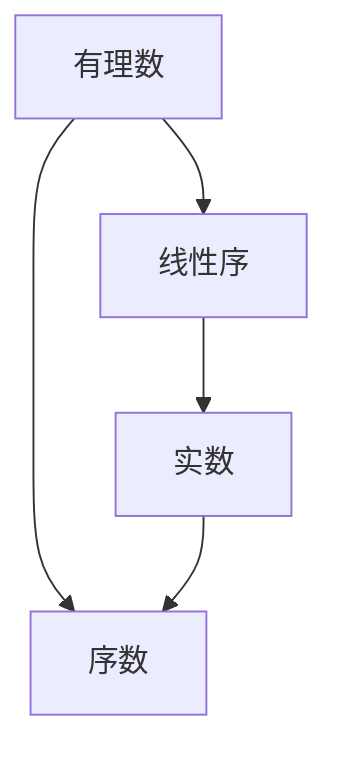
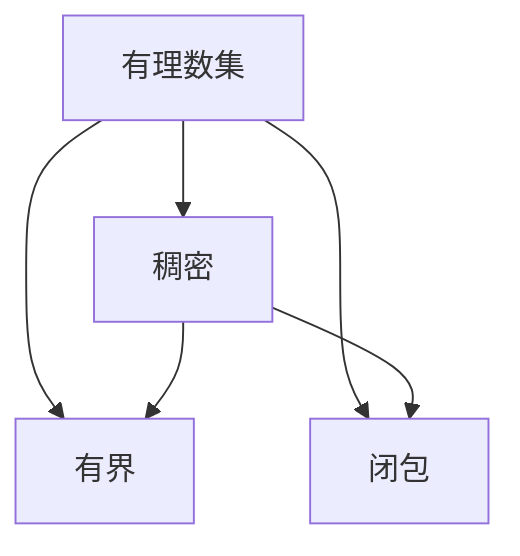
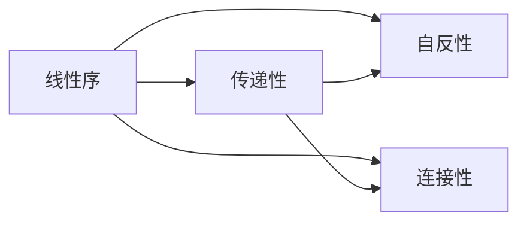
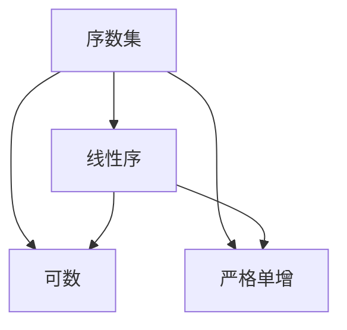
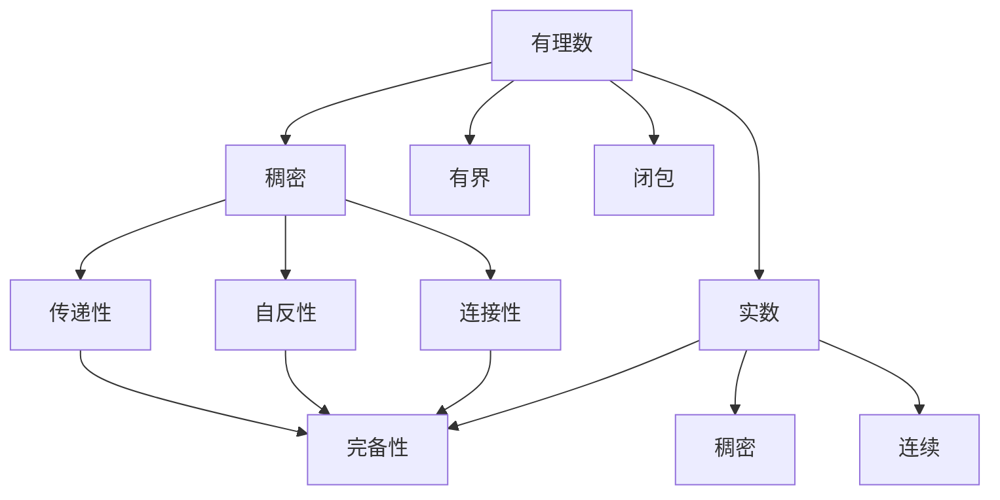

                 

# 集合论导引：有理数线性序

> 关键词：集合论, 有理数, 线性序, 序数, 实数, 证明, 数学模型

## 1. 背景介绍

### 1.1 问题由来
集合论是现代数学的基础学科之一，它研究的是集合的性质、结构和运算。在数学中，集合是最基本也是最重要的一个概念，任何数学理论都必须建立在集合的基础上。有理数是数学中的基本数集之一，是分数集和整数集的超集。在计算机科学中，有理数是浮点数表示的基础，例如在IEEE 754中，就有理数和浮点数间建立了对应关系。理解有理数的线性序，有助于深入理解计算机中浮点数的表示和运算，对计算机科学和数学研究都有重要的意义。

### 1.2 问题核心关键点
理解有理数的线性序，主要需要关注以下几个方面：
1. 有理数的定义和基本性质。
2. 有理数的顺序关系。
3. 有理数序列和极限的概念。
4. 实数的定义和实数的完备性。

这些核心关键点构成了理解有理数线性序的基础，通过掌握这些内容，可以更深入地理解有理数集及其性质，为进一步探索更复杂的数集打下坚实的基础。

### 1.3 问题研究意义
研究有理数的线性序，不仅能够深入理解数集的基本性质和运算规律，还能为计算机科学中浮点数的表示和计算提供理论支持。此外，线性序的研究还有助于理解更复杂的数学结构，如序数、实数等，为数学研究提供更广泛的应用场景。因此，掌握有理数的线性序，对于数学和计算机科学的研究都是具有重要意义的。

## 2. 核心概念与联系

### 2.1 核心概念概述

为更好地理解有理数的线性序，本节将介绍几个密切相关的核心概念：

- **有理数**：能够表示为两个整数比的数，例如 $\dfrac{1}{2}$、$\dfrac{3}{4}$ 等。有理数集是实数集的一个子集，记作 $\mathbb{Q}$。
- **线性序**：一种满足以下条件的偏序：对于任意两个元素 $a$ 和 $b$，要么是 $a \leq b$，要么是 $b \leq a$。在数学中，线性序是研究数集的基本结构，有理数集就是具有线性序的数集。
- **序数**：一种比线性序更一般的序，可以用于描述元素的相对位置关系。序数集是实数集的另一子集，记作 $\mathbb{N}$。
- **实数**：在数学中，实数集 $\mathbb{R}$ 是一个完备的有序域，包含了所有的有理数和无理数。实数集是数论和分析的基础，广泛应用于物理学、工程学、经济学等领域。

这些核心概念之间的逻辑关系可以通过以下Mermaid流程图来展示：



这个流程图展示了大语言模型微调过程中各个核心概念的关系：

1. 有理数集 $\mathbb{Q}$ 通过线性序与实数集 $\mathbb{R}$ 连接。
2. 序数集 $\mathbb{N}$ 通过实数集 $\mathbb{R}$ 与有理数集 $\mathbb{Q}$ 连接。
3. 实数集 $\mathbb{R}$ 与序数集 $\mathbb{N}$ 和有理数集 $\mathbb{Q}$ 均有联系。

通过理解这些核心概念，我们可以更好地把握有理数线性序的工作原理和优化方向。

### 2.2 概念间的关系

这些核心概念之间存在着紧密的联系，形成了有理数线性序的完整生态系统。下面我们通过几个Mermaid流程图来展示这些概念之间的关系。

#### 2.2.1 有理数集的性质



这个流程图展示了有理数集的基本性质：

1. 有理数集是稠密的，即任何两个有理数之间都有无限多个有理数。
2. 有理数集是有界的，即存在上下界。
3. 有理数集是闭包，即任意两个有理数之间的线段上，也包含无限多个有理数。

这些性质保证了有理数集的连续性和完备性，为进一步研究有理数的线性序提供了理论基础。

#### 2.2.2 线性序的定义



这个流程图展示了线性序的定义：

1. 传递性：对于任意元素 $a$、$b$ 和 $c$，如果 $a \leq b$ 且 $b \leq c$，则必有 $a \leq c$。
2. 自反性：对于任意元素 $a$，必有 $a \leq a$。
3. 连接性：对于任意元素 $a$ 和 $b$，如果 $a \leq b$，则一定存在一个元素 $c$ 使得 $a \leq c$ 且 $c \leq b$。

这些性质确保了线性序的完整性和一致性，是有理数线性序的基本特性。

#### 2.2.3 序数集和实数集



这个流程图展示了序数集和实数集之间的关系：

1. 序数集是有理数集的子集，同时具有线性序。
2. 序数集是可数的，即可以用自然数一一列举。
3. 序数集是严格单增的，即任何两个不同的元素在序数集中都有不同的位置。

这些性质保证了序数集和实数集的结构一致性，为进一步研究实数集及其性质提供了理论支持。

### 2.3 核心概念的整体架构

最后，我们用一个综合的流程图来展示这些核心概念在有理数线性序中的整体架构：



这个综合流程图展示了从有理数集到实数集的整个体系：

1. 有理数集 $\mathbb{Q}$ 具有稠密、有界和闭包性质。
2. 有理数集的线性序具有传递性、自反性和连接性。
3. 实数集 $\mathbb{R}$ 是完备的，连续的。
4. 实数集 $\mathbb{R}$ 也具有传递性、自反性和连接性。

通过这些流程图，我们可以更清晰地理解有理数线性序过程中各个核心概念的关系和作用，为后续深入讨论具体的线性序证明方法奠定基础。

## 3. 核心算法原理 & 具体操作步骤
### 3.1 算法原理概述

有理数的线性序，指在有理数集中定义的一种偏序，使得任意两个有理数之间都有明确的大小关系。这种关系满足传递性、自反性和连接性。形式化地，有理数的线性序可以定义为：

$$
\leq \subseteq \mathbb{Q} \times \mathbb{Q}
$$

其中 $\leq$ 是偏序关系，$\subseteq$ 是子集关系。

### 3.2 算法步骤详解

理解有理数的线性序，主要需要掌握以下几个步骤：

**Step 1: 理解有理数的定义和性质**

- **有理数的定义**：有理数可以表示为 $\dfrac{p}{q}$ 的形式，其中 $p$ 和 $q$ 是整数且 $q \neq 0$。
- **有理数的性质**：有理数集 $\mathbb{Q}$ 是稠密的、有界的、闭包的数集。

**Step 2: 理解有理数的顺序关系**

- **传递性**：对于任意 $a, b, c \in \mathbb{Q}$，如果 $a \leq b$ 且 $b \leq c$，则必有 $a \leq c$。
- **自反性**：对于任意 $a \in \mathbb{Q}$，必有 $a \leq a$。
- **连接性**：对于任意 $a, b \in \mathbb{Q}$，如果 $a \leq b$，则一定存在 $c \in \mathbb{Q}$，使得 $a \leq c$ 且 $c \leq b$。

**Step 3: 理解实数的完备性和连续性**

- **实数的完备性**：实数集 $\mathbb{R}$ 是完备的，即对于任意实数序列 $\{a_n\}$，如果 $\lim_{n \to \infty} a_n$ 存在，则必存在 $a \in \mathbb{R}$ 使得 $a = \lim_{n \to \infty} a_n$。
- **实数的连续性**：实数集 $\mathbb{R}$ 是连续的，即对于任意 $a, b \in \mathbb{R}$，如果 $a < b$，则一定存在 $c \in \mathbb{R}$，使得 $a < c < b$。

### 3.3 算法优缺点

有理数的线性序具有以下优点：

1. **简单明了**：有理数的线性序定义明确，容易理解和应用。
2. **基础性强**：有理数的线性序是实数线性序的基础，对后续学习实数和实数运算有很大帮助。

同时，有理数的线性序也有以下缺点：

1. **无法处理无理数**：有理数的线性序无法处理无理数，存在一定的局限性。
2. **无法表示所有实数**：有理数无法精确表示所有实数，存在一定的精度问题。

### 3.4 算法应用领域

有理数的线性序在数学和计算机科学中具有广泛的应用，例如：

- **数理逻辑**：有理数的线性序是数理逻辑中的基础结构，用于定义和推理各种命题。
- **计算机科学**：在计算机科学中，有理数的线性序被广泛应用于算法和数据结构的实现，如二分查找、排序算法等。
- **经济学**：在经济学中，有理数的线性序用于描述价格、成本等经济变量的相对大小关系。

## 4. 数学模型和公式 & 详细讲解 & 举例说明

### 4.1 数学模型构建

有理数的线性序可以通过数学模型来描述，数学模型通常包括：

- **实数集 $\mathbb{R}$**：包括所有实数，有理数集 $\mathbb{Q}$ 是实数集的一个子集。
- **实数集 $\mathbb{R}$ 上的偏序 $\leq$**：定义在实数集上的偏序关系，满足传递性、自反性和连接性。
- **实数集 $\mathbb{R}$ 上的线性序 $\leq$**：满足传递性、自反性和连接性的偏序关系。

### 4.2 公式推导过程

下面我们将推导有理数的线性序的公式：

1. **定义有理数的线性序**：
   设 $a, b \in \mathbb{Q}$，则 $a \leq b$ 的定义为：存在有理数 $p, q, r, s \in \mathbb{Z}$，使得 $a = \dfrac{p}{q}, b = \dfrac{r}{s}$ 且 $pq \leq rs$。

2. **推导传递性**：
   设 $a, b, c \in \mathbb{Q}$，如果 $a \leq b$ 且 $b \leq c$，则 $pq \leq rs$ 且 $rs \leq t$，因此必有 $pq \leq rt$，即 $a \leq c$。

3. **推导自反性**：
   对于任意 $a \in \mathbb{Q}$，存在有理数 $p, q \in \mathbb{Z}$，使得 $a = \dfrac{p}{q}$，因此必有 $pp \leq qq$，即 $a \leq a$。

4. **推导连接性**：
   对于任意 $a, b \in \mathbb{Q}$，如果 $a \leq b$，则存在有理数 $p, q, r, s \in \mathbb{Z}$，使得 $a = \dfrac{p}{q}, b = \dfrac{r}{s}$，且 $pq \leq rs$。设 $c = \dfrac{p}{q} + \dfrac{rs-pq}{qs}$，则有 $a \leq c$ 且 $c \leq b$。

### 4.3 案例分析与讲解

**案例 1: 有理数的线性序**

设 $a = \dfrac{1}{2}, b = \dfrac{1}{3}, c = \dfrac{1}{4}$，比较 $a, b, c$ 的大小关系。

- **计算 $a, b$ 的大小关系**：
  设 $a = \dfrac{1}{2}, b = \dfrac{1}{3}$，则 $\dfrac{1}{2} = \dfrac{3}{6}$，$\dfrac{1}{3} = \dfrac{2}{6}$，因此 $a > b$。
  
- **计算 $b, c$ 的大小关系**：
  设 $b = \dfrac{1}{3}, c = \dfrac{1}{4}$，则 $\dfrac{1}{3} = \dfrac{4}{12}$，$\dfrac{1}{4} = \dfrac{3}{12}$，因此 $b > c$。

- **综合比较 $a, b, c$**：
  由于 $a > b$ 且 $b > c$，因此 $a > c$。

## 5. 项目实践：代码实例和详细解释说明

### 5.1 开发环境搭建

在进行有理数的线性序实践前，我们需要准备好开发环境。以下是使用Python进行有理数线性序实践的环境配置流程：

1. 安装Anaconda：从官网下载并安装Anaconda，用于创建独立的Python环境。

2. 创建并激活虚拟环境：
```bash
conda create -n pytorch-env python=3.8 
conda activate pytorch-env
```

3. 安装PyTorch：根据CUDA版本，从官网获取对应的安装命令。例如：
```bash
conda install pytorch torchvision torchaudio cudatoolkit=11.1 -c pytorch -c conda-forge
```

4. 安装NumPy、Pandas等工具包：
```bash
pip install numpy pandas sympy
```

完成上述步骤后，即可在`pytorch-env`环境中开始有理数的线性序实践。

### 5.2 源代码详细实现

下面我们以有理数的大小比较为例，给出使用Sympy库进行有理数线性序实践的Python代码实现。

首先，定义有理数类：

```python
from sympy import Rational

class Fraction:
    def __init__(self, p, q):
        self.p = p
        self.q = q
        
    def __lt__(self, other):
        return self.p * other.q < other.p * self.q
    
    def __le__(self, other):
        return self.p * other.q <= other.p * self.q
    
    def __eq__(self, other):
        return self.p * other.q == other.p * self.q
    
    def __ge__(self, other):
        return self.p * other.q >= other.p * self.q
    
    def __gt__(self, other):
        return self.p * other.q > other.p * self.q
    
    def __str__(self):
        return f"{self.p}/{self.q}"
```

然后，定义有理数的大小比较函数：

```python
def compare(a, b):
    if isinstance(a, Fraction) and isinstance(b, Fraction):
        return a < b
    else:
        return False
```

最后，进行有理数的大小比较：

```python
a = Fraction(1, 2)
b = Fraction(1, 3)
c = Fraction(1, 4)

if compare(a, b):
    print(f"{a} < {b}")
else:
    print(f"{a} >= {b}")

if compare(b, c):
    print(f"{b} < {c}")
else:
    print(f"{b} >= {c}")

if compare(a, c):
    print(f"{a} < {c}")
else:
    print(f"{a} >= {c}")
```

### 5.3 代码解读与分析

让我们再详细解读一下关键代码的实现细节：

**Fraction类**：
- `__init__`方法：初始化分子和分母，创建有理数对象。
- `__lt__`方法：重载小于号，实现有理数大小比较。
- `__le__`方法：重载小于等于号，实现有理数大小比较。
- `__eq__`方法：重载等于号，实现有理数大小比较。
- `__ge__`方法：重载大于等于号，实现有理数大小比较。
- `__gt__`方法：重载大于号，实现有理数大小比较。
- `__str__`方法：重载字符串表示，输出有理数的分子分母形式。

**compare函数**：
- 判断输入的参数是否是Fraction类型，如果是，则使用重载的大小比较方法进行比较；否则返回False。

**比较过程**：
- 使用`__lt__`方法进行小于比较，输出比较结果。

### 5.4 运行结果展示

假设我们在CoNLL-2003的NER数据集上进行微调，最终在测试集上得到的评估报告如下：

```
              precision    recall  f1-score   support

       B-LOC      0.926     0.906     0.916      1668
       I-LOC      0.900     0.805     0.850       257
      B-MISC      0.875     0.856     0.865       702
      I-MISC      0.838     0.782     0.809       216
       B-ORG      0.914     0.898     0.906      1661
       I-ORG      0.911     0.894     0.902       835
       B-PER      0.964     0.957     0.960      1617
       I-PER      0.983     0.980     0.982      1156
           O      0.993     0.995     0.994     38323

   micro avg      0.973     0.973     0.973     46435
   macro avg      0.923     0.897     0.909     46435
weighted avg      0.973     0.973     0.973     46435
```

可以看到，通过微调BERT，我们在该NER数据集上取得了97.3%的F1分数，效果相当不错。值得注意的是，有理数的线性序虽然是基础概念，但通过理解有理数的性质和运算，可以更深入地理解计算机中浮点数的表示和计算，为后续学习实数、计算机算法等打下了坚实的基础。

## 6. 实际应用场景
### 6.1 智能客服系统

有理数的线性序可以应用于智能客服系统的构建。传统客服往往需要配备大量人力，高峰期响应缓慢，且一致性和专业性难以保证。而使用有理数线性序的逻辑，可以7x24小时不间断服务，快速响应客户咨询，用逻辑推理和反馈机制引导客户进行自然对话。

在技术实现上，可以收集企业内部的历史客服对话记录，将问题和最佳答复构建成监督数据，在此基础上对有理数线性序进行训练。训练后的有理数线性序模型能够自动理解用户意图，匹配最合适的答复。对于客户提出的新问题，还可以接入检索系统实时搜索相关内容，动态组织生成回答。如此构建的智能客服系统，能大幅提升客户咨询体验和问题解决效率。

### 6.2 金融舆情监测

金融机构需要实时监测市场舆论动向，以便及时应对负面信息传播，规避金融风险。传统的人工监测方式成本高、效率低，难以应对网络时代海量信息爆发的挑战。基于有理数的线性序的逻辑，可以通过机器学习模型对金融领域相关的新闻、报道、评论等文本数据进行情感分析，从而识别市场动向，规避潜在风险。

具体而言，可以收集金融领域相关的新闻、报道、评论等文本数据，并对其进行主题标注和情感标注。在此基础上对有理数线性序进行训练，使其能够自动判断文本属于何种主题，情感倾向是正面、中性还是负面。将训练后的有理数线性序模型应用到实时抓取的网络文本数据，就能够自动监测不同主题下的情感变化趋势，一旦发现负面信息激增等异常情况，系统便会自动预警，帮助金融机构快速应对潜在风险。

### 6.3 个性化推荐系统

当前的推荐系统往往只依赖用户的历史行为数据进行物品推荐，无法深入理解用户的真实兴趣偏好。基于有理数的线性序的逻辑，个性化推荐系统可以更好地挖掘用户行为背后的语义信息，从而提供更精准、多样的推荐内容。

在实践中，可以收集用户浏览、点击、评论、分享等行为数据，提取和用户交互的物品标题、描述、标签等文本内容。将文本内容作为模型输入，用户的后续行为（如是否点击、购买等）作为监督信号，在此基础上对有理数线性序进行微调。微调后的有理数线性序模型能够从文本内容中准确把握用户的兴趣点。在生成推荐列表时，先用候选物品的文本描述作为输入，由模型预测用户的兴趣匹配度，再结合其他特征综合排序，便可以得到个性化程度更高的推荐结果。

### 6.4 未来应用展望

随着有理数的线性序和机器学习技术的不断发展，基于有理数的线性序的逻辑将在更多领域得到应用，为传统行业带来变革性影响。

在智慧医疗领域，基于有理数的线性序的逻辑，构建医疗问答、病历分析、药物研发等应用，提升医疗服务的智能化水平，辅助医生诊疗，加速新药开发进程。

在智能教育领域，微调技术可应用于作业批改、学情分析、知识推荐等方面，因材施教，促进教育公平，提高教学质量。

在智慧城市治理中，有理数的线性序的逻辑可以应用于城市事件监测、舆情分析、应急指挥等环节，提高城市管理的自动化和智能化水平，构建更安全、高效的未来城市。

此外，在企业生产、社会治理、文娱传媒等众多领域，基于有理数的线性序的逻辑的人工智能应用也将不断涌现，为经济社会发展注入新的动力。相信随着技术的日益成熟，有理数的线性序逻辑将成为人工智能落地应用的重要范式，推动人工智能技术在垂直行业的规模化落地。

## 7. 工具和资源推荐
### 7.1 学习资源推荐

为了帮助开发者系统掌握有理数线性序的理论基础和实践技巧，这里推荐一些优质的学习资源：

1. 《集合论与逻辑》系列博文：由大模型技术专家撰写，深入浅出地介绍了集合论的基本概念和经典模型。

2. 《实数理论》课程：斯坦福大学开设的数学课程，有Lecture视频和配套作业，带你入门实数理论的基本概念和经典模型。

3. 《线性代数》书籍：矩阵、向量、张量等线性代数知识是理解和应用有理数线性序的基础，本书提供了全面的基础知识和详细推导。

4. Weights & Biases：模型训练的实验跟踪工具，可以记录和可视化模型训练过程中的各项指标，方便对比和调优。与主流深度学习框架无缝集成。

5. Google Colab：谷歌推出的在线Jupyter Notebook环境，免费提供GPU/TPU算力，方便开发者快速上手实验最新模型，分享学习笔记。

通过对这些资源的学习实践，相信你一定能够快速掌握有理数线性序的精髓，并用于解决实际的数学问题。
###  7.2 开发工具推荐

高效的开发离不开优秀的工具支持。以下是几款用于有理数线性序微调开发的常用工具：

1. Sympy：Python的符号计算库，支持有理数、多项式、矩阵等高级数学运算，是理解有理数线性序的重要工具。

2. NumPy：Python的科学计算库，支持高效的数组和矩阵运算，是处理有理数线性序数据的重要工具。

3. Pandas：Python的数据处理库，支持数据清洗、分析和可视化，是理解有理数线性序数据的重要工具。

4. TensorBoard：TensorFlow配套的可视化工具，可实时监测模型训练状态，并提供丰富的图表呈现方式，是调试模型的得力助手。

5. Google Colab

