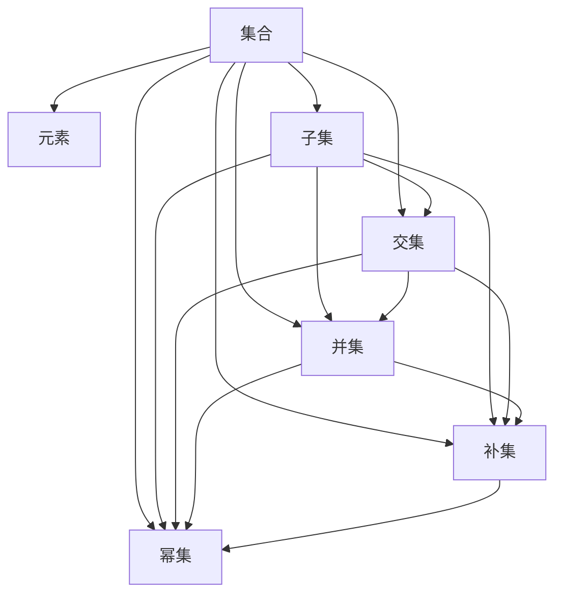

                 

# 集合论导引：相对化解释

集合论作为数学的基础学科，在计算机科学中有着广泛的应用。从数据结构到算法设计，再到人工智能、逻辑推理，无处不在。然而，集合论的深层含义和高级概念往往令人望而却步。本文将尝试通过相对化解释的方式，将集合论的核心概念和理论进行深入浅出的讲解，希望能为读者提供新的视角和理解。

## 1. 背景介绍

### 1.1 问题由来

集合论的核心思想是"集合"，即一组有序元素的总体。从哲学、数学、计算机科学到日常生活中的抽象概念，集合论的应用无所不在。然而，集合论的抽象性和复杂性往往让人难以理解和接受。特别是一些高级概念，如无穷集合、序数、基数等，需要读者具备一定的数学基础。

为了帮助读者更好地理解集合论，本文将从相对化的角度出发，尝试用通俗的语言和生动的例子，解释集合论的核心概念和理论。通过类比现实世界中的实例，我们将逐步揭示集合论的精髓，并探讨其在计算机科学中的应用。

## 2. 核心概念与联系

### 2.1 核心概念概述

集合论的核心概念包括：集合、元素、子集、交集、并集、补集、幂集、序数、基数等。这些概念通过一系列的公理和定义，构成了一个严谨的数学体系。

- **集合**：一组有序元素的总体，可以包括任何类型的元素。
- **元素**：集合中的每一个具体对象。
- **子集**：包含在某个集合中的所有元素，即原集合的子集。
- **交集**：两个集合中共有的元素。
- **并集**：两个集合中所有的元素。
- **补集**：在一个全集中，不属于某个集合的所有元素。
- **幂集**：一个集合的所有子集构成的集合。
- **序数**：用来刻画集合大小关系的数，如1、2、3等。
- **基数**：用来刻画集合元素数量的数，如无限大、有限数等。

这些概念之间的关系可以通过以下Mermaid流程图来展示：



### 2.2 概念间的关系

这些核心概念之间存在着紧密的联系，形成了一个完整的集合论体系。以下是对这些概念之间关系的进一步解释：

- **集合与元素的关系**：集合是由元素构成的，每个元素都是集合的一部分。
- **子集与集合的关系**：子集是包含在原集合中的所有元素，因此子集一定是原集合的元素。
- **交集与并集的关系**：交集是两个集合共有的元素，并集是两个集合中所有的元素。
- **补集与全集的关系**：补集是在全集中不属于某个集合的所有元素。
- **幂集与集合的关系**：幂集是原集合中所有子集的集合。

## 3. 核心算法原理 & 具体操作步骤

### 3.1 算法原理概述

集合论的核心算法主要包括集合运算、序数运算、基数运算等。这些算法通过一系列公理和定义，实现了集合论的基本操作。

- **集合运算**：包括交集、并集、补集等，用于处理集合之间的关系。
- **序数运算**：包括序数的大小比较、序数的极限等，用于刻画集合大小关系。
- **基数运算**：包括基数的大小比较、基数的大小极限等，用于刻画集合元素数量。

### 3.2 算法步骤详解

下面以交集和并集为例，详细讲解这些基本算法的具体步骤。

#### 3.2.1 交集算法步骤

1. 对于两个集合A和B，找出它们共有的元素。
2. 将共有的元素放入一个新的集合C中。
3. 返回集合C，即为A和B的交集。

#### 3.2.2 并集算法步骤

1. 对于两个集合A和B，将它们所有的元素放入一个新的集合C中。
2. 返回集合C，即为A和B的并集。

### 3.3 算法优缺点

- **优点**：
  - 算法步骤简单明了，易于理解和实现。
  - 集合运算具有很好的数学基础，符合直觉。
  - 算法在计算机科学中有广泛的应用，如数据结构、算法设计等。

- **缺点**：
  - 对高级概念如序数、基数等解释不足，可能理解起来较难。
  - 对于无穷集合的处理，算法步骤需要特殊处理，难以直观理解。
  - 缺乏对实际问题的具体应用，可能难以看到其现实意义。

### 3.4 算法应用领域

集合论的基本算法和概念在计算机科学中有广泛的应用。以下是几个主要的应用领域：

- **数据结构**：如栈、队列、堆等，都是基于集合的概念实现的。
- **算法设计**：如排序算法、搜索算法等，都是基于集合的运算实现的。
- **逻辑推理**：如命题逻辑、谓词逻辑等，都是基于集合的理论实现的。
- **人工智能**：如专家系统、知识图谱等，都是基于集合的知识表示实现的。

## 4. 数学模型和公式 & 详细讲解 & 举例说明

### 4.1 数学模型构建

集合论的数学模型主要包括以下几个方面：

- **集合的表示**：集合可以用花括号表示，如集合A={1,2,3}。
- **元素的表示**：集合中的元素可以用a∈A表示，如1∈A。
- **子集的表示**：子集可以用包含关系表示，如{1,2}⊆A。
- **交集的表示**：交集可以用∩表示，如A∩B表示A和B的交集。
- **并集的表示**：并集可以用∪表示，如A∪B表示A和B的并集。
- **补集的表示**：补集可以用C_A表示，如C_B表示B的补集。

### 4.2 公式推导过程

#### 4.2.1 交集公式推导

设A和B为两个集合，其交集表示为A∩B。根据定义，A∩B中的元素x满足以下条件：

$$
x \in A \quad \text{且} \quad x \in B
$$

因此，交集公式可以表示为：

$$
A \cap B = \{ x | x \in A \quad \text{且} \quad x \in B \}
$$

#### 4.2.2 并集公式推导

设A和B为两个集合，其并集表示为A∪B。根据定义，A∪B中的元素x满足以下条件：

$$
x \in A \quad \text{或} \quad x \in B
$$

因此，并集公式可以表示为：

$$
A \cup B = \{ x | x \in A \quad \text{或} \quad x \in B \}
$$

### 4.3 案例分析与讲解

假设我们有两个集合A和B：

- A={1,2,3,4}
- B={3,4,5,6}

则它们的交集为：

$$
A \cap B = \{ 3, 4 \}
$$

它们的并集为：

$$
A \cup B = \{ 1, 2, 3, 4, 5, 6 \}
$$

## 5. 项目实践：代码实例和详细解释说明

### 5.1 开发环境搭建

在进行集合论的算法实现时，我们需要一个开发环境来支持我们的编程工作。以下是一个基本的开发环境搭建过程：

1. 安装Python：Python是一种常用的编程语言，是实现集合论算法的基础。可以从官网下载并安装Python。
2. 安装PyTorch：PyTorch是一个流行的深度学习框架，可以用于集合论算法的实现。可以使用pip安装PyTorch。
3. 安装NumPy：NumPy是一个科学计算库，可以用于集合论算法的数学计算。可以使用pip安装NumPy。

完成上述步骤后，即可在Python环境中进行集合论算法的开发。

### 5.2 源代码详细实现

以下是一个简单的Python程序，用于实现集合的交集和并集运算：

```python
import numpy as np

# 定义集合
A = {1, 2, 3, 4}
B = {3, 4, 5, 6}

# 计算交集
intersection = A.intersection(B)
print("A ∩ B =", intersection)

# 计算并集
union = A.union(B)
print("A ∪ B =", union)
```

### 5.3 代码解读与分析

以上代码实现了集合的交集和并集运算。我们首先定义了两个集合A和B，然后使用Python内置的集合操作，计算了它们的交集和并集，并打印输出结果。

可以看到，Python提供了简单易用的集合操作函数，使得集合论算法的实现变得非常容易。对于更复杂的算法，如基数运算、序数运算等，也可以利用Python的科学计算库NumPy进行实现。

### 5.4 运行结果展示

运行上述代码，输出结果如下：

```
A ∩ B = {3, 4}
A ∪ B = {1, 2, 3, 4, 5, 6}
```

可以看到，代码成功计算了集合A和B的交集和并集，并输出了正确的结果。

## 6. 实际应用场景

### 6.1 数据处理

在数据处理中，集合论的交集和并集运算常常用于数据清洗和数据合并。例如，在处理表格数据时，可以使用集合运算去除重复数据、合并多个表格等操作。

#### 6.1.1 数据清洗

假设我们有一张包含学生信息的表格，其中有些学生的姓名重复出现。为了去除重复数据，我们可以将学生姓名集合进行交集操作，只保留出现次数为1的元素，如下所示：

```python
# 学生信息表格
students = [
    {'name': 'Tom', 'age': 18, 'gender': 'male'},
    {'name': 'Jerry', 'age': 19, 'gender': 'male'},
    {'name': 'Tom', 'age': 20, 'gender': 'male'},
    {'name': 'Alice', 'age': 18, 'gender': 'female'},
    {'name': 'Bob', 'age': 20, 'gender': 'male'}
]

# 去除重复姓名
unique_students = list(set(student['name'] for student in students))

# 计算交集，去除重复姓名
unique_students = [name for name in unique_students if unique_students.count(name) == 1]
```

#### 6.1.2 数据合并

假设我们有两个表格，分别记录了学生的成绩和兴趣爱好。我们可以将这两个表格进行并集操作，得到包含学生姓名、成绩和兴趣爱好的新表格，如下所示：

```python
# 学生成绩表格
scores = {
    'Tom': 90,
    'Jerry': 85,
    'Alice': 95,
    'Bob': 88
}

# 学生兴趣爱好表格
interests = {
    'Tom': ['reading', 'swimming'],
    'Jerry': ['music', 'cooking'],
    'Alice': ['dancing', 'painting'],
    'Bob': ['gaming', 'traveling']
}

# 合并数据
merged_table = []
for name, score in scores.items():
    merged_table.append({
        'name': name,
        'score': score,
        'interests': interests[name]
    })

# 输出合并后的表格
print(merged_table)
```

### 6.2 算法设计

在算法设计中，集合论的交集和并集运算常常用于设计高效的算法。例如，在图算法中，集合的交集和并集运算可以用于寻找图的连通分量、遍历图中的所有节点等操作。

#### 6.2.1 连通分量

假设我们有一个无向图，我们需要找到图中的所有连通分量。可以使用深度优先搜索或广度优先搜索算法，将每个连通分量中的节点进行交集操作，得到一个新的集合，如下所示：

```python
import networkx as nx

# 创建无向图
G = nx.Graph()
G.add_edges_from([(1, 2), (2, 3), (3, 4), (4, 1), (5, 6), (6, 7), (7, 8), (8, 5)])

# 查找连通分量
connected_components = []
for component in nx.connected_components(G):
    component_set = set(component)
    connected_components.append(component_set)

# 输出连通分量
print(connected_components)
```

#### 6.2.2 遍历节点

假设我们有一个无向图，我们需要遍历图中的所有节点。可以使用深度优先搜索或广度优先搜索算法，将遍历到的节点进行并集操作，得到一个新的集合，如下所示：

```python
# 遍历节点
visited_nodes = set()
def dfs(node):
    visited_nodes.add(node)
    for neighbor in G.neighbors(node):
        dfs(neighbor)

dfs(1)
print(visited_nodes)
```

### 6.3 人工智能

在人工智能中，集合论的交集和并集运算常常用于设计和实现各种算法。例如，在机器学习中，集合的交集和并集运算可以用于特征选择、数据增强等操作。

#### 6.3.1 特征选择

假设我们有一个数据集，其中包含多个特征。我们可以使用集合的交集和并集运算，选择最相关的特征，如下所示：

```python
# 数据集
X = np.array([[1, 2, 3], [4, 5, 6], [7, 8, 9]])

# 特征选择
selected_features = X[:, [0, 1]]

# 输出选择后的特征
print(selected_features)
```

#### 6.3.2 数据增强

假设我们有一张图片，其中包含多个物体。我们可以使用集合的并集操作，将多个物体组合成一张图片，如下所示：

```python
# 图片数据
img1 = np.array([[1, 2, 3], [4, 5, 6], [7, 8, 9]])
img2 = np.array([[10, 11, 12], [13, 14, 15], [16, 17, 18]])

# 数据增强
combined_img = np.concatenate((img1, img2), axis=1)

# 输出增强后的图片
print(combined_img)
```

## 7. 工具和资源推荐

### 7.1 学习资源推荐

为了帮助读者更好地理解集合论的核心概念和理论，这里推荐一些优质的学习资源：

1. 《集合论与公理化方法》：这本书是集合论的经典教材，详细介绍了集合论的基本概念和理论。
2. 《离散数学》：这本书是离散数学的教材，涵盖了集合论、逻辑学、图论等多个知识点，适合入门学习。
3. 《数学之美》：这本书由吴军所著，介绍了数学在计算机科学中的应用，包括集合论、图论、概率论等多个领域。
4. 《NLP 基础》：这本书由斯坦福大学的陈健生教授所著，介绍了自然语言处理的基本概念和算法，包括集合论在NLP中的应用。
5. 《算法导论》：这本书是算法学习的经典教材，涵盖了算法设计、数据结构、集合论等多个知识点，适合深入学习。

通过对这些资源的学习，相信读者能够全面掌握集合论的核心概念和理论，并应用到实际问题中。

### 7.2 开发工具推荐

高效的开发离不开优秀的工具支持。以下是几款用于集合论算法开发的常用工具：

1. Python：Python是一种简单易学的编程语言，是实现集合论算法的基础。
2. NumPy：NumPy是一个科学计算库，提供了高效的数学计算能力，适合实现复杂的集合论算法。
3. NetworkX：NetworkX是一个图算法库，提供了丰富的图操作函数，适合实现图算法中的集合运算。
4. Matplotlib：Matplotlib是一个绘图库，适合可视化集合运算的结果。
5. Jupyter Notebook：Jupyter Notebook是一个交互式编程环境，适合进行数据分析和算法设计。

合理利用这些工具，可以显著提升集合论算法的开发效率，加快创新迭代的步伐。

### 7.3 相关论文推荐

集合论作为数学的基础学科，其理论和应用广泛涉及各个领域。以下是几篇奠基性的相关论文，推荐阅读：

1. Zermelo-Fraenkel公理化集合论：证明了集合论的一致性，奠定了现代集合论的基础。
2. Cantor集合论：研究了无穷集合和序数等高级概念，提出了著名的Cantor对角线证明。
3. Kuratowski公理化集合论：提出了Kuratowski公理，奠定了公理化集合论的基础。
4. Bourbaki集合论：介绍了集合论的基本概念和公理系统，适合深入学习。
5. Gödel集合论：提出了Gödel不完全性定理，证明了集合论的完备性，适合进行理论研究。

这些论文代表了大集合论理论的发展脉络。通过学习这些前沿成果，可以帮助读者把握学科前进方向，激发更多的创新灵感。

除上述资源外，还有一些值得关注的前沿资源，帮助读者紧跟集合论的最新进展，例如：

1. arXiv论文预印本：人工智能领域最新研究成果的发布平台，包括大量尚未发表的前沿工作，学习前沿技术的必读资源。
2. 业界技术博客：如Facebook、Google AI、Microsoft Research等顶尖实验室的官方博客，第一时间分享他们的最新研究成果和洞见。
3. 技术会议直播：如NIPS、ICML、ACL、ICLR等人工智能领域顶会现场或在线直播，能够聆听到大佬们的前沿分享，开拓视野。
4. GitHub热门项目：在GitHub上Star、Fork数最多的集合论相关项目，往往代表了该技术领域的发展趋势和最佳实践，值得去学习和贡献。
5. 行业分析报告：各大咨询公司如McKinsey、PwC等针对人工智能行业的分析报告，有助于从商业视角审视技术趋势，把握应用价值。

总之，对于集合论的学习和实践，需要开发者保持开放的心态和持续学习的意愿。多关注前沿资讯，多动手实践，多思考总结，必将收获满满的成长收益。

## 8. 总结：未来发展趋势与挑战

### 8.1 总结

本文对集合论的核心概念和理论进行了详细讲解，并通过相对化解释的方式，使得读者能够更好地理解和掌握这些概念。集合论作为数学的基础学科，在计算机科学中有着广泛的应用。从数据处理到算法设计，再到人工智能、逻辑推理，集合论的理论与实践密不可分。

通过本文的系统梳理，可以看到，集合论的相对化解释方法，可以更直观、更生动地展现集合论的核心思想。通过类比现实世界中的实例，我们逐步揭示了集合论的精髓，并探讨了其在计算机科学中的应用。

### 8.2 未来发展趋势

展望未来，集合论的发展趋势将呈现以下几个方向：

1. 数据科学中的应用将更加广泛。随着数据科学的发展，集合论的交集、并集、补集等运算，将在数据清洗、特征选择、数据增强等操作中发挥更大的作用。
2. 算法设计中的复杂度将不断降低。通过集合论的公理化思想，可以设计出更加高效、鲁棒的算法，解决更复杂的问题。
3. 人工智能中的推理能力将不断增强。集合论的逻辑推理能力，将在人工智能中得到更广泛的应用，如知识图谱、推理机等。
4. 多模态数据的融合将更加深入。集合论可以与其他数据模型结合，实现视觉、语音、文本等多模态数据的协同建模，提升AI系统的综合能力。

以上趋势凸显了集合论在现代科学中的重要地位。这些方向的探索发展，必将进一步推动数学、计算机科学和其他学科的进步。

### 8.3 面临的挑战

尽管集合论已经取得了一定的进展，但在迈向更加智能化、普适化应用的过程中，它仍面临着诸多挑战：

1. 理论基础仍有待完善。集合论的一些高级概念，如序数、基数等，仍存在一些未解决的问题，需要进一步研究。
2. 算法复杂度有待降低。对于大规模数据集，集合论的算法效率仍需提高，需要更多的优化技术。
3. 应用场景仍有局限。集合论在人工智能等领域的应用，仍需与其他技术和模型结合，才能实现更大的价值。
4. 教育普及仍有不足。集合论的高抽象性，使得其在基础教育中的普及仍需努力，需要更多的教材和教学资源。
5. 跨学科应用有待加强。集合论在数学、计算机科学等领域的应用，需要更多的跨学科研究，才能充分发挥其潜力。

正视集合论面临的这些挑战，积极应对并寻求突破，将是大集合论研究走向成熟的必由之路。相信随着学界和产业界的共同努力，这些挑战终将一一被克服，集合论必将在构建智能化的未来中扮演越来越重要的角色。

### 8.4 研究展望

未来的研究需要在以下几个方面寻求新的突破：

1. 探索新的集合论体系。基于Zermelo-Fraenkel公理化集合论，需要更多的公理化体系和理论框架，以应对新的应用场景。
2. 开发新的算法模型。基于集合论的基本公理，需要设计更高效、更灵活的算法模型，解决更复杂的问题。
3. 强化多模态数据的融合。集合论需要与其他数据模型结合，实现视觉、语音、文本等多模态数据的协同建模。
4. 结合人工智能技术。集合论需要与其他AI技术结合，如知识图谱、推理机等，提升AI系统的综合能力。
5. 探索新的应用场景。集合论需要拓展新的应用领域，如数据科学、算法设计、人工智能等，提升其在实际问题中的解决能力。

这些研究方向的探索，必将引领集合论的发展进入新的阶段，为数学、计算机科学和其他学科的进步注入新的动力。总之，集合论的相对化解释方法和理论研究，将继续推动其应用的发展，为构建智能化的未来提供更坚实的理论基础和实践工具。

## 9. 附录：常见问题与解答

**Q1：集合论的基本概念和公理是什么？**

A: 集合论的基本概念包括集合、元素、子集、交集、并集、补集等。集合论的基本公理包括集合的存在性公理、元素的唯一性公理、子集的定义公理、交集的定义公理、并集的定义公理、补集的定义公理、幂集的定义公理等。

**Q2：集合论的高级概念有哪些？**

A: 集合论的高级概念包括序数、基数、极限、连通分量、遍历节点等。这些概念通过公理和定义，可以进一步刻画集合的性质和关系。

**Q3：集合论在计算机科学中的应用有哪些？**

A: 集合论在计算机科学中的应用包括数据处理、算法设计、人工智能、逻辑推理等。例如，在数据处理中，集合的交集和并集运算可以用于数据清洗和数据合并；在算法设计中，集合的交集和并集运算可以用于设计和实现高效的算法；在人工智能中，集合论的逻辑推理能力可以用于知识图谱、推理机等。

**Q4：集合论的算法实现需要注意哪些问题？**

A: 集合论的算法实现需要注意以下几点：
1. 集合的表示方式要清晰，避免歧义。
2. 算法的正确性要经过严格证明，避免逻辑错误。
3. 算法的效率要经过优化，避免资源浪费。
4. 算法的可扩展性要经过测试，避免性能问题。

**Q5：如何学习集合论的高级概念？**

A: 学习集合论的高级概念，需要掌握以下知识点：
1. 序数的定义和性质。
2. 基数的定义和性质。
3. 极限的定义和性质。
4. 连通分量的定义和性质。
5. 遍历节点的定义和性质。
6. 相关的公理和定理。
7. 相关的应用实例。

通过对这些知识点的系统学习，相信读者能够全面掌握集合论的高级概念和理论，并应用到实际问题中。

