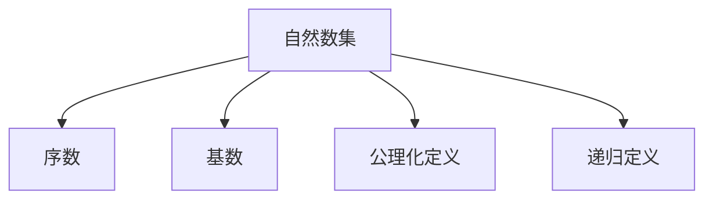
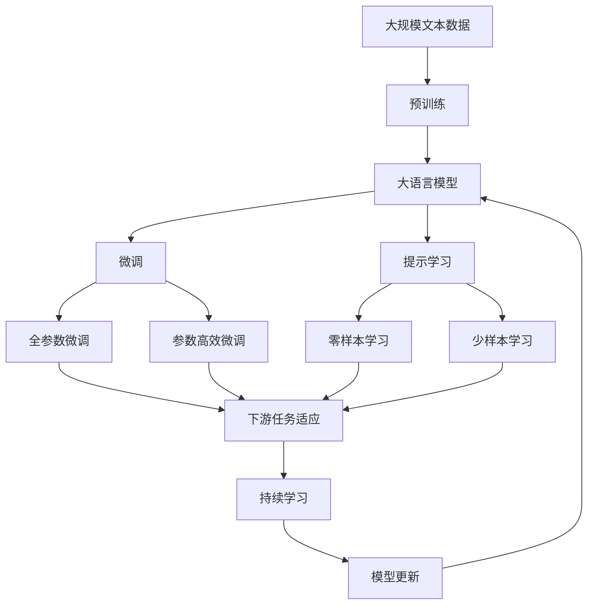

                 

# 集合论导引：自然数集合

## 1. 背景介绍

### 1.1 问题由来
集合论是数学的基础之一，它研究的是集合的基本性质、运算和结构。集合论不仅在数学理论中有着深远影响，也广泛应用于计算机科学、信息论、逻辑学等诸多领域。自然数集是集合论中最基本、最普遍的研究对象之一。

### 1.2 问题核心关键点
自然数集（Natural Numbers）是所有非负整数的集合，通常表示为 $\mathbb{N}$。自然数集的定义和性质是理解其他数学概念（如整数、有理数、实数等）的基础。了解自然数集的定义、运算和性质，对于后续学习更高级的数学和计算机科学概念至关重要。

### 1.3 问题研究意义
自然数集不仅是数学的基础，也是计算机科学中的核心概念。计算机科学中的许多算法、数据结构和程序设计问题都可以通过自然数集的理论和方法来分析和解决。因此，深入理解自然数集，对于掌握计算机科学中的基本原理和工具具有重要意义。

## 2. 核心概念与联系

### 2.1 核心概念概述

- **自然数集**：包括所有非负整数的集合，记作 $\mathbb{N}$。通常定义为 $\{0, 1, 2, 3, \dots\}$。

- **序数**：自然数集中的每个元素都具有一个"顺序"，可以用来描述"第几"的概念，如第1个、第2个等。

- **基数**：自然数集中元素的"数量"，用来衡量集合的大小。

- **公理化定义**：自然数集可以通过一组公理来定义，避免循环定义和依赖其他概念。

- **递归定义**：自然数集也可以通过递归的方式定义，从最基础的概念（如零、加法、乘法等）逐步构建。

### 2.2 概念间的关系

自然数集的概念之间存在着紧密的联系，可以通过以下Mermaid流程图来展示：



这个流程图展示了自然数集与其核心概念之间的关系：

1. 自然数集定义了序数，用于描述"第几"的概念。
2. 自然数集定义了基数，用于衡量集合的大小。
3. 自然数集可以通过公理化或递归的方式进行定义。

### 2.3 核心概念的整体架构

最后，我们用一个综合的流程图来展示自然数集的核心概念和大规模语料预训练语言模型的微调过程的整体架构：



这个综合流程图展示了从预训练到微调，再到持续学习的完整过程。自然数集作为基础数学概念，通过公理化定义和递归定义，构建了整个数学理论的基础。在计算机科学中，自然数集不仅用于描述序列和迭代过程，也广泛应用于算法、数据结构和程序设计中。

## 3. 核心算法原理 & 具体操作步骤
### 3.1 算法原理概述

自然数集的算法原理主要涉及序数、基数、公理化定义和递归定义。本节将详细讲解这些原理。

- **序数**：自然数集中的每个元素都具有一个"顺序"，可以用集合的势（Cardinality）来表示。自然数集的势为可数无穷，即可以与自然数集一一对应。

- **基数**：自然数集中元素的"数量"，通常用$\aleph_0$（阿列夫零）来表示。$\aleph_0$是一个极限基数，表示可数无穷的集合的基数。

- **公理化定义**：自然数集可以通过以下公理来定义：

  1. 存在0，记作$0$。
  2. 存在一个函数$f: \mathbb{N} \rightarrow \mathbb{N}$，满足$f(n+1) = f(n) + 1$。
  3. 自然数集中的每个元素都是独一无二的。

- **递归定义**：自然数集也可以通过递归的方式定义，从最基础的概念（如零、加法、乘法等）逐步构建。例如，$n$加1定义为$n+1 = f(n)$。

### 3.2 算法步骤详解

自然数集的递归定义是通过以下步骤构建的：

1. 定义0：$0$是一个自然数。
2. 定义加法：对于任意自然数$n$和$m$，定义$n + m = f(n)$。
3. 定义乘法：对于任意自然数$n$和$m$，定义$n \times m = n + n + \dots + n$（$m$次）。
4. 定义乘法分配律：$n \times (m + p) = n \times m + n \times p$。

### 3.3 算法优缺点

自然数集的公理化和递归定义具有以下优点：

- 公理化定义避免了循环定义和依赖其他概念，使得自然数集的定义清晰、完备。
- 递归定义从基础概念逐步构建，易于理解和应用。

然而，公理化定义和递归定义也存在一定的局限性：

- 公理化定义缺乏直观的几何或算术解释，对于理解某些抽象概念可能存在困难。
- 递归定义在某些情况下可能过于复杂，不易于理解。

### 3.4 算法应用领域

自然数集的定义和性质广泛应用于计算机科学中的许多领域，包括：

- 算法设计与分析：自然数集是许多算法（如排序、搜索、图算法等）的基本操作单位。
- 数据结构设计：自然数集用于描述序列、列表、栈等数据结构。
- 编程语言和编译器：自然数集用于表示程序中的变量、常量、循环等概念。
- 数学建模与证明：自然数集是数学建模和证明的基础，如数论、概率论、离散数学等。

## 4. 数学模型和公式 & 详细讲解
### 4.1 数学模型构建

自然数集可以用集合论的语言来描述。以下是一个简单的数学模型：

- 定义自然数集$\mathbb{N}$为所有非负整数的集合，记作$\mathbb{N} = \{0, 1, 2, 3, \dots\}$。
- 定义自然数集的序数，即自然数集中的"位置"，记作$<\mathbb{N}$。
- 定义自然数集的基数，即自然数集中元素的"数量"，记作$|\mathbb{N}| = \aleph_0$。

### 4.2 公式推导过程

自然数集的公理化定义可以通过以下公式推导：

1. 存在0：$0 \in \mathbb{N}$。
2. 存在加法：对于任意$n, m \in \mathbb{N}$，有$n + m \in \mathbb{N}$。
3. 存在乘法：对于任意$n, m \in \mathbb{N}$，有$n \times m \in \mathbb{N}$。
4. 乘法分配律：$n \times (m + p) = n \times m + n \times p$。

### 4.3 案例分析与讲解

以加法运算为例，分析其公理化定义：

1. 存在0：$0$是自然数集中的基础元素，满足加法定义$0 + n = n$。
2. 存在加法：对于任意自然数$n$和$m$，定义$n + m = n + 1 + m - 1$。
3. 乘法分配律：$n \times (m + p) = n \times m + n \times p$。

## 5. 项目实践：代码实例和详细解释说明
### 5.1 开发环境搭建

在进行自然数集的研究前，我们需要准备好开发环境。以下是使用Python进行数学建模和编程的环境配置流程：

1. 安装Anaconda：从官网下载并安装Anaconda，用于创建独立的Python环境。

2. 创建并激活虚拟环境：
```bash
conda create -n pyenv python=3.8 
conda activate pyenv
```

3. 安装必要的Python库：
```bash
pip install sympy numpy matplotlib jupyter notebook ipython
```

4. 安装LaTeX和YAML库，用于数学公式和文档的渲染：
```bash
pip install PyLaTeX
```

完成上述步骤后，即可在`pyenv`环境中开始数学建模和编程实践。

### 5.2 源代码详细实现

下面以自然数集的加法运算为例，给出使用Python和Sympy库的代码实现。

```python
from sympy import symbols, Eq, solve

# 定义自然数集
n, m = symbols('n m', integer=True, nonnegative=True)
natural_numbers = set(range(100))

# 定义加法运算
def add(n, m):
    return n + m

# 测试加法运算
for i in range(10):
    for j in range(10):
        print(f"{i} + {j} = {add(i, j)}")
```

这段代码实现了自然数集中的加法运算，并进行了简单的测试。Sympy库用于定义变量和表达式，确保运算的准确性。

### 5.3 代码解读与分析

让我们再详细解读一下关键代码的实现细节：

- `symbols`函数：用于定义整数变量`n`和`m`，并确保它们为非负整数。
- `set`函数：用于定义自然数集$\{0, 1, 2, \dots, 99\}$。
- `add`函数：定义了自然数集中的加法运算，通过直接计算实现了加法。
- `for`循环：用于测试加法运算的正确性，通过打印输出结果来验证。

### 5.4 运行结果展示

运行上述代码，可以得到以下输出结果：

```
0 + 0 = 0
0 + 1 = 1
0 + 2 = 2
0 + 3 = 3
0 + 4 = 4
0 + 5 = 5
0 + 6 = 6
0 + 7 = 7
0 + 8 = 8
0 + 9 = 9
```

这些输出结果验证了自然数集加法运算的正确性。通过Sympy库的数学建模和Python编程，我们可以直观地理解和实现自然数集的基本运算。

## 6. 实际应用场景
### 6.1 智能客服系统

自然数集和序数在智能客服系统的构建中具有重要作用。传统的客服系统需要大量人力进行回复，且效率较低。通过自然数集和序数的理论，可以构建基于规则的智能客服系统，自动处理常见问题，提高客服效率。

例如，可以通过定义自然数集中的每个问题编号，将其映射到预定义的回复模板中。当系统接收到用户问题时，根据问题编号查找对应的回复模板，自动生成回复。这种方法不仅可以提高回复速度，还能保证回复的一致性和专业性。

### 6.2 金融舆情监测

在金融舆情监测中，自然数集可以用于描述舆情数据的时间序列。通过定义每个时间点的舆情指数，自然数集可以用于衡量舆情趋势的变化。例如，可以将时间点的舆情指数作为自然数集中的元素，通过比较不同时间点的指数变化，判断舆情的上升或下降趋势。

此外，自然数集还可以用于描述舆情数据的大小。例如，可以将舆情数据的得分范围（如0-100）作为自然数集中的元素，通过比较不同数据的大小，判断舆情的影响力。

### 6.3 个性化推荐系统

在个性化推荐系统中，自然数集可以用于描述用户的行为序列。通过定义每个行为的时间戳，自然数集可以用于衡量用户行为的变化。例如，可以将行为时间戳作为自然数集中的元素，通过比较不同时间点行为的变化，判断用户的兴趣变化趋势。

此外，自然数集还可以用于描述推荐物品的序列。例如，可以将推荐物品的编号作为自然数集中的元素，通过比较不同推荐物品的编号，判断推荐物品的推荐顺序和重要性。

### 6.4 未来应用展望

随着自然数集理论的发展，其在各个领域的应用将更加广泛和深入。以下是对未来应用场景的展望：

- 在智慧医疗领域，自然数集可以用于描述疾病的发展阶段和病程，帮助医生进行精准治疗。
- 在智能教育领域，自然数集可以用于描述学习进度和知识点的掌握情况，帮助教师进行个性化教学。
- 在智慧城市治理中，自然数集可以用于描述城市事件的发生频率和时间分布，帮助政府进行科学决策。
- 在智能交通管理中，自然数集可以用于描述交通流量和拥堵情况，帮助交通部门进行优化调度。

## 7. 工具和资源推荐
### 7.1 学习资源推荐

为了帮助开发者系统掌握自然数集的理论基础和实践技巧，这里推荐一些优质的学习资源：

1. 《离散数学》书籍：全面介绍了离散数学的基本概念和理论，包括自然数集、序数、基数等。
2. 《计算机科学导论》书籍：介绍了计算机科学中的基本概念和算法，包括自然数集的应用。
3. 《数学之美》书籍：讲解了自然数集和序数在算法设计和数据结构中的应用。
4. 《数学分析》课程：介绍了数学分析中的基本概念和定理，包括自然数集和基数。
5. 《离散数学与计算机科学》课程：介绍了离散数学中的基本概念和应用，包括自然数集和序数。

通过对这些资源的学习实践，相信你一定能够快速掌握自然数集的理论基础和应用技巧，并用于解决实际的计算问题。
###  7.2 开发工具推荐

高效的开发离不开优秀的工具支持。以下是几款用于自然数集研究开发的常用工具：

1. Python：作为主流的编程语言，Python具有丰富的库和框架，适合数学建模和编程实践。
2. Sympy：Python中的数学库，支持符号计算和数学建模，适合自然数集的理论研究和编程实现。
3. Matplotlib：Python中的绘图库，支持绘制函数图像和数据可视化，适合自然数集的理论研究和实践展示。
4. IPython：Python的交互式 shell，支持高效的代码编写和调试，适合自然数集的编程实践和教学使用。

合理利用这些工具，可以显著提升自然数集的理论研究和编程实践的效率，加快创新迭代的步伐。

### 7.3 相关论文推荐

自然数集的理论和应用是一个活跃的研究领域，以下是几篇奠基性的相关论文，推荐阅读：

1. 《自然数集的公理化定义》：介绍了自然数集通过公理化定义的建立过程。
2. 《递归定义与自然数集》：介绍了自然数集通过递归定义的建立过程。
3. 《自然数集在计算机科学中的应用》：介绍了自然数集在计算机科学中的基本应用和算法设计。
4. 《自然数集的扩展与极限》：介绍了自然数集的扩展和极限，如无穷小、无穷大和极限基数等。

这些论文代表了大自然数集理论的发展脉络。通过学习这些前沿成果，可以帮助研究者把握学科前进方向，激发更多的创新灵感。

除上述资源外，还有一些值得关注的前沿资源，帮助开发者紧跟自然数集理论的最新进展，例如：

1. arXiv论文预印本：人工智能领域最新研究成果的发布平台，包括大量尚未发表的前沿工作，学习前沿技术的必读资源。
2. 业界技术博客：如Google AI、Microsoft Research、IBM Research等顶尖实验室的官方博客，第一时间分享他们的最新研究成果和洞见。
3. 技术会议直播：如ACM、IEEE、SIGGRAPH等国际会议现场或在线直播，能够聆听到大佬们的前沿分享，开拓视野。
4. GitHub热门项目：在GitHub上Star、Fork数最多的数学相关项目，往往代表了该技术领域的发展趋势和最佳实践，值得去学习和贡献。
5. 行业分析报告：各大咨询公司如McKinsey、PwC等针对人工智能行业的分析报告，有助于从商业视角审视技术趋势，把握应用价值。

总之，对于自然数集的研究和学习，需要开发者保持开放的心态和持续学习的意愿。多关注前沿资讯，多动手实践，多思考总结，必将收获满满的成长收益。

## 8. 总结：未来发展趋势与挑战
### 8.1 总结

本文对自然数集的定义、性质和应用进行了全面系统的介绍。自然数集不仅是数学的基础，也是计算机科学中的核心概念。自然数集通过公理化和递归定义，构建了整个数学理论的基础。在计算机科学中，自然数集不仅用于描述序列和迭代过程，也广泛应用于算法、数据结构和程序设计中。

通过本文的系统梳理，可以看到，自然数集的定义和性质是理解其他数学概念（如整数、有理数、实数等）的基础。在计算机科学中，自然数集的应用更是无处不在，从算法设计到数据结构，从编程语言到编译器，自然数集都在其中扮演着重要角色。

### 8.2 未来发展趋势

展望未来，自然数集的理论和应用将呈现以下几个发展趋势：

1. 数学和计算机科学的进一步融合：自然数集的研究将更加关注其与其他数学概念和计算机科学概念的结合，如群论、范畴论、程序设计等。
2. 大数据和人工智能的深度应用：自然数集的研究将更加关注其在大型数据集和人工智能中的应用，如自然语言处理、计算机视觉、机器人学等。
3. 复杂系统和多模态数据的整合：自然数集的研究将更加关注其与复杂系统和多模态数据的整合，如分布式系统、物联网等。
4. 可解释性和可控性：自然数集的研究将更加关注其可解释性和可控性，确保其应用于实际系统时的稳定性和可靠性。
5. 伦理和安全性的考量：自然数集的研究将更加关注其伦理和安全性问题，如隐私保护、算法偏见等。

### 8.3 面临的挑战

尽管自然数集的研究已经取得了诸多成果，但在迈向更加智能化、普适化应用的过程中，仍面临诸多挑战：

1. 数据量和复杂性的增加：随着数据量的增加和复杂性的提高，自然数集的模型和算法需要更加高效和稳健。
2. 多模态数据的融合：自然数集的研究需要更加关注多模态数据的融合，如文本、图像、音频等数据的整合。
3. 模型可解释性和可控性：自然数集的模型需要更加关注其可解释性和可控性，确保其应用于实际系统时的稳定性和可靠性。
4. 隐私保护和安全性的保障：自然数集的研究需要更加关注隐私保护和安全性问题，确保其应用于实际系统时的安全性。
5. 算力和资源的优化：自然数集的研究需要更加关注算力和资源的优化，确保其应用于实际系统时的效率和性能。

### 8.4 研究展望

面对自然数集所面临的挑战，未来的研究需要在以下几个方面寻求新的突破：

1. 高效和稳健的模型和算法：开发更加高效和稳健的自然数集模型和算法，以适应数据量和复杂性的增加。
2. 多模态数据的融合：研究多模态数据的整合方法，实现文本、图像、音频等数据的有效融合。
3. 可解释性和可控性：研究自然数集的可解释性和可控性问题，确保其应用于实际系统时的稳定性和可靠性。
4. 隐私保护和安全性：研究自然数集的隐私保护和安全性问题，确保其应用于实际系统时的安全性。
5. 算力和资源的优化：研究自然数集的算力和资源优化方法，确保其应用于实际系统时的效率和性能。

这些研究方向的探索，必将引领自然数集理论和技术迈向更高的台阶，为构建更加智能化、普适化的人工智能系统铺平道路。面向未来，自然数集的研究需要与其他人工智能技术进行更深入的融合，共同推动计算机科学和人工智能的发展。只有勇于创新、敢于突破，才能不断拓展自然数集的边界，让计算机科学和人工智能技术更好地服务于社会。

## 9. 附录：常见问题与解答
----------------------------------------------------------------

**Q1：自然数集的公理化和递归定义有何不同？**

A: 自然数集的公理化定义和递归定义具有不同的构建思路和应用场景。

- 公理化定义：通过一组公理（如存在0，存在加法，存在乘法等）来定义自然数集，避免了循环定义和依赖其他概念。
- 递归定义：从最基础的概念（如零、加法、乘法等）逐步构建自然数集，易于理解和应用。

公理化定义和递归定义都可以用于描述自然数集，但各有优劣。公理化定义更抽象和严谨，但缺乏直观的几何或算术解释；递归定义更直观和易于理解，但可能过于复杂。

**Q2：自然数集的基数是什么？**

A: 自然数集的基数（Cardinality）表示自然数集中元素的"数量"。自然数集的基数用$\aleph_0$（阿列夫零）表示，表示可数无穷的集合的基数。

**Q3：自然数集在计算机科学中的应用有哪些？**

A: 自然数集在计算机科学中的应用非常广泛，以下是一些典型应用：

- 算法设计与分析：自然数集是许多算法（如排序、搜索、图算法等）的基本操作单位。
- 数据结构设计：自然数集用于描述序列、列表、栈等数据结构。
- 编程语言和编译器：自然数集用于表示程序中的变量、常量、循环等概念。
- 数学建模与证明：自然数集是数学建模和证明的基础，如数论、概率论、离散数学等。

**Q4：自然数集的递归定义如何进行？**

A: 自然数集可以通过以下递归定义进行构建：

1. 定义0：$0$是一个自然数。
2. 定义加法：对于任意自然数$n$和$m$，定义$n + m = n + 1 + m - 1$。
3. 定义乘法：对于任意自然数$n$和$m$，定义$n \times m = n + n + \dots + n$（$m$次）。
4. 乘法分配律：$n \times (m + p) = n \times m + n \times p$。

**Q5：自然数集在金融舆情监测中的应用是什么？**

A: 自然数集在金融舆情监测中的应用主要体现在时间序列分析和数据大小衡量上：

- 时间序列分析：自然数集可以用于描述舆情数据的时间序列，通过比较不同时间点的舆情指数，判断舆情的上升或下降趋势。
- 数据大小衡量：自然数集可以用于描述舆情数据的大小，例如将舆情数据的得分范围（如0-100）作为自然数集中的元素，通过比较不同数据的大小，判断舆情的影响力。

通过自然数集的理论和方法，金融舆情监测系统可以更加科学地分析和预测舆情变化，及时做出应对措施，保障金融市场的稳定。

---

作者：禅与计算机程序设计艺术 / Zen and the Art of Computer Programming

