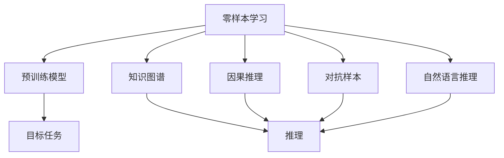
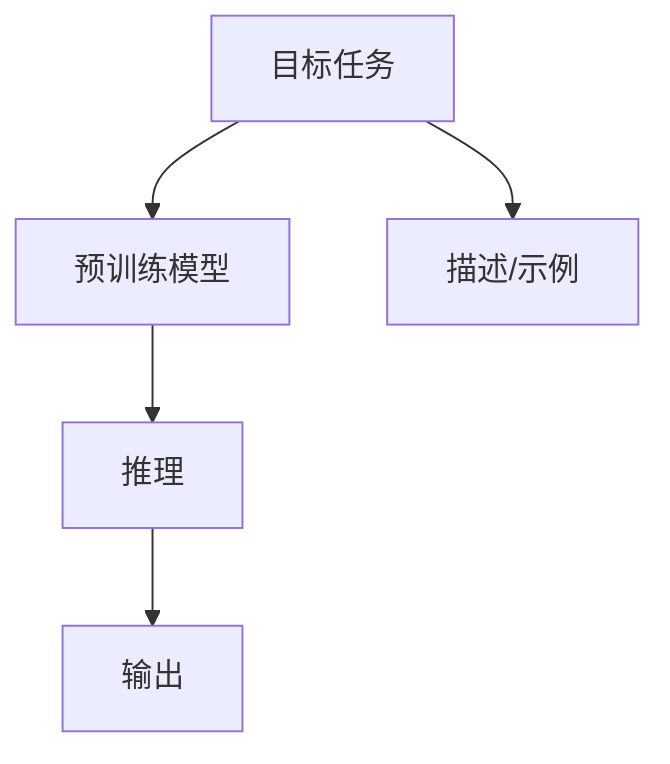
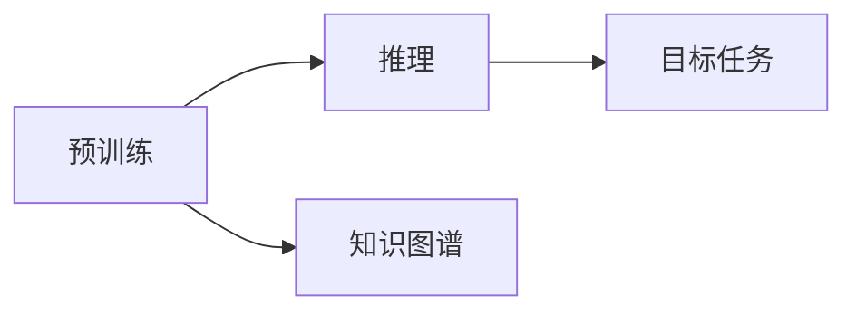

                 

## 1. 背景介绍

### 1.1 问题由来
零样本学习（Zero-Shot Learning, ZSL）是指在没有任何训练数据的情况下，仅通过目标任务的定义、描述或者示例数据，模型就能进行任务推理和生成。这种能力可以极大地降低数据收集和标注的成本，尤其是在一些稀缺资源领域，如医学、艺术、文化等领域，标注数据往往难以获取。因此，零样本学习技术成为了研究热点，旨在通过大规模预训练语言模型（Large Language Models, LLMs）来提升模型在新的任务上的性能。

### 1.2 问题核心关键点
零样本学习的核心在于如何利用预训练模型所学到的知识，通过少量描述或示例数据，直接推断出目标任务的输出。关键点包括：
- **知识迁移**：将预训练模型在大量数据上学习到的知识迁移到新的任务上。
- **目标推理**：通过描述或示例数据，引导模型进行目标任务推理。
- **生成能力**：模型能够基于描述或示例生成新的文本或图像内容。

### 1.3 问题研究意义
零样本学习技术在降低数据标注成本、提升任务适配能力、推动模型在更多领域的落地应用方面具有重要意义：
1. **数据资源节约**：在资源稀缺领域，零样本学习可以避免繁琐的标注工作，大大节约时间和成本。
2. **任务适配高效**：模型能够快速适应新的任务，加速科研、生产、开发过程。
3. **知识普及**：模型可以普及到更多应用场景，助力各行各业数字化转型。
4. **算法创新**：零样本学习推动了对预训练-推理范式的深入研究，催生了新的研究方向和应用。

## 2. 核心概念与联系

### 2.1 核心概念概述

为更好地理解零样本学习，本节将介绍几个关键概念：

- **零样本学习**：指模型在没有任何训练数据的情况下，仅通过目标任务的定义、描述或示例数据，进行任务推理和生成。
- **预训练模型**：指在大量无标签数据上进行自监督学习任务训练得到的通用语言模型，如BERT、GPT等。
- **知识图谱**：指通过实体、关系、属性等结构化信息构建的知识库，辅助模型推理和生成。
- **因果推理**：指基于因果关系的推理方法，辅助模型推断合理的输出。
- **对抗样本**：指通过特定方法生成的样本，用于测试模型鲁棒性和安全性。
- **自然语言推理**：指基于自然语言推断的推理方法，辅助模型进行文本推理和判断。

这些概念之间的逻辑关系可以通过以下Mermaid流程图来展示：



这个流程图展示了几者之间的联系：
1. 零样本学习基于预训练模型。
2. 预训练模型通过知识图谱、因果推理、对抗样本、自然语言推理等技术辅助，进行目标任务推理和生成。
3. 目标任务推理过程中，可以利用推理、对抗、语言推理等手段，提升模型性能。

### 2.2 概念间的关系

这些核心概念之间存在着紧密的联系，形成了零样本学习的完整生态系统。下面我通过几个Mermaid流程图来展示这些概念之间的关系。

#### 2.2.1 零样本学习的核心流程



这个流程图展示了零样本学习的核心流程：
1. 模型接收目标任务的描述或示例数据。
2. 模型利用预训练知识，进行推理生成。
3. 模型输出任务结果。

#### 2.2.2 预训练与推理的关系



这个流程图展示了预训练与推理的关系：
1. 预训练模型通过大量数据学习到的知识，在推理过程中起辅助作用。
2. 知识图谱等辅助工具增强了推理过程的合理性。
3. 推理过程指导目标任务的生成。

## 3. 核心算法原理 & 具体操作步骤

### 3.1 算法原理概述

零样本学习基于预训练模型的知识迁移，通过目标任务的描述或示例数据，指导模型进行推理生成。其核心思想是：
1. **知识抽取**：从预训练模型中抽取相关知识，用于目标任务推理。
2. **目标匹配**：通过目标任务的描述或示例数据，匹配预训练模型的相关知识，进行推理生成。

具体来说，零样本学习的算法流程如下：
1. **预训练模型加载**：加载预训练模型作为特征提取器，用于提取输入文本的特征向量。
2. **目标任务匹配**：根据目标任务的描述或示例数据，匹配预训练模型的相关知识。
3. **推理生成**：基于匹配到的知识，进行目标任务的推理生成。

### 3.2 算法步骤详解

下面详细介绍零样本学习的算法步骤：

#### Step 1: 预训练模型加载

加载预训练模型作为特征提取器，用于提取输入文本的特征向量。例如，使用BERT模型进行文本分类任务，可以加载BERT模型作为特征提取器，将输入文本转化为BERT的特征向量。

```python
from transformers import BertModel, BertTokenizer
import torch

# 加载BERT模型和tokenizer
model = BertModel.from_pretrained('bert-base-uncased')
tokenizer = BertTokenizer.from_pretrained('bert-base-uncased')

# 将文本转化为特征向量
def text_to_vector(text):
    encoded = tokenizer.encode(text, add_special_tokens=True, return_tensors='pt')
    return model(encoded).last_hidden_state.mean(dim=1)
```

#### Step 2: 目标任务匹配

根据目标任务的描述或示例数据，匹配预训练模型的相关知识。这一步骤通常通过自然语言推理（Natural Language Inference, NLI）或知识图谱等方式实现。

##### 2.2.1 自然语言推理
自然语言推理（NLI）是一种通过判断前提和假设之间关系的推理任务，常用于目标任务的匹配。例如，在文本分类任务中，可以构建前提和假设的语义对，利用BERT进行分类判断。

```python
from transformers import BertForSequenceClassification

# 加载NLI模型
classifier = BertForSequenceClassification.from_pretrained('bert-base-uncased', num_labels=3)

# 预测NLI关系
def predict_relation(text):
    encoded = tokenizer.encode(text, add_special_tokens=True, return_tensors='pt')
    result = classifier(encoded)
    return result.logits.argmax().item()
```

##### 2.2.2 知识图谱
知识图谱是一种结构化知识库，常用于辅助零样本学习。例如，在情感分析任务中，可以利用知识图谱中的情感词向量，进行情感判断。

```python
from gensim.models import KeyedVectors

# 加载知识图谱
def load_knowledge_base(file_path):
    model = KeyedVectors.load_word2vec_format(file_path, binary=True)
    return model

# 使用知识图谱进行情感分析
def sentiment_analysis(text, model):
    tokens = tokenizer.tokenize(text)
    vectors = [model.token_vec(token) if token in model else torch.zeros(1, model.vector_size) for token in tokens]
    vector = torch.stack(vectors, dim=0).mean(dim=0)
    return vector
```

#### Step 3: 推理生成

基于匹配到的知识，进行目标任务的推理生成。这一步骤通常通过预训练模型的生成能力实现。

```python
# 使用预训练模型进行生成
def generate(text):
    features = text_to_vector(text)
    generated = model.generate(features, max_length=50, num_return_sequences=1, top_p=0.9, top_k=50, num_beams=5)
    return tokenizer.decode(generated[0], skip_special_tokens=True)
```

### 3.3 算法优缺点

零样本学习技术具有以下优点：
1. **数据需求低**：在无标注数据的情况下，仍然能够进行任务推理和生成。
2. **快速适应**：模型可以快速适应新的任务，降低模型适配成本。
3. **泛化性强**：在数据稀缺领域，零样本学习能够显著提升模型的泛化能力。

同时，零样本学习也存在以下缺点：
1. **效果不稳定**：在复杂或特定领域任务中，零样本学习的效果往往不稳定，依赖于预训练模型的质量。
2. **精度有限**：与有标注数据训练的模型相比，零样本学习的精度通常较低。
3. **应用受限**：在一些对精度要求较高的领域，如医疗、金融等，零样本学习可能不够适用。

### 3.4 算法应用领域

零样本学习技术已经广泛应用于以下几个领域：

- **文本分类**：根据文本内容和情感描述，自动进行情感判断、主题分类等。
- **命名实体识别**：通过示例数据，识别文本中的实体类型和边界。
- **问答系统**：根据问题描述，自动生成答案。
- **对话系统**：根据对话历史，自动生成回复。
- **机器翻译**：根据源语言描述，自动翻译为目标语言。
- **文本生成**：根据任务描述，自动生成文本内容。
- **图像生成**：根据任务描述，自动生成图像内容。

## 4. 数学模型和公式 & 详细讲解

### 4.1 数学模型构建

假设目标任务为$T$，预训练模型为$M_{\theta}$，描述或示例数据为$X$。零样本学习的数学模型可以表示为：

$$
y = M_{\theta}(X)
$$

其中，$y$为目标任务的输出，$M_{\theta}(X)$为预训练模型在$X$上的推理结果。

### 4.2 公式推导过程

以文本分类任务为例，推导零样本学习的基本公式。

假设目标任务为二分类任务，输入文本为$x$，输出标签为$y\in\{0,1\}$。预训练模型为BERT，特征向量为$v$，目标任务的描述或示例数据为$d$。则零样本学习的目标函数可以表示为：

$$
\arg\min_{y} \mathcal{L}(y, d)
$$

其中，$\mathcal{L}$为损失函数，$d$为目标任务的描述或示例数据。

假设$M_{\theta}(x)$为BERT模型，$y$为标签，$d$为描述或示例数据，则目标函数的损失函数可以表示为：

$$
\mathcal{L}(y, d) = -\log P(y|M_{\theta}(x), d)
$$

其中，$P(y|M_{\theta}(x), d)$为目标任务的概率分布。

通过上述公式，可以计算出目标任务的概率分布，从而进行分类判断。

### 4.3 案例分析与讲解

假设我们有一篇关于“天气”的文本，要求判断该文本是否为正面情感。我们可以使用BERT进行零样本学习。

- **预训练模型加载**：加载BERT模型，将文本转化为BERT的特征向量。

- **目标任务匹配**：使用自然语言推理（NLI）模型，预测文本和“正面情感”之间的关系。

- **推理生成**：根据匹配结果，判断文本的情感类别。

以下是一个基于BERT的零样本学习代码实现：

```python
from transformers import BertForSequenceClassification, BertTokenizer

# 加载BERT模型和tokenizer
model = BertForSequenceClassification.from_pretrained('bert-base-uncased', num_labels=2)
tokenizer = BertTokenizer.from_pretrained('bert-base-uncased')

# 将文本转化为特征向量
def text_to_vector(text):
    encoded = tokenizer.encode(text, add_special_tokens=True, return_tensors='pt')
    return model(encoded).last_hidden_state.mean(dim=1)

# 使用NLI模型进行情感分类
def predict_emotion(text):
    encoded = tokenizer.encode(text, add_special_tokens=True, return_tensors='pt')
    result = classifier(encoded)
    return result.logits.argmax().item()
```

使用上述代码，我们可以对任意文本进行情感分类，无需标注数据，即可快速生成分类结果。

## 5. 项目实践：代码实例和详细解释说明

### 5.1 开发环境搭建

在进行零样本学习实践前，我们需要准备好开发环境。以下是使用Python进行PyTorch开发的环境配置流程：

1. 安装Anaconda：从官网下载并安装Anaconda，用于创建独立的Python环境。

2. 创建并激活虚拟环境：
```bash
conda create -n zero-shot-env python=3.8 
conda activate zero-shot-env
```

3. 安装PyTorch：根据CUDA版本，从官网获取对应的安装命令。例如：
```bash
conda install pytorch torchvision torchaudio cudatoolkit=11.1 -c pytorch -c conda-forge
```

4. 安装相关库：
```bash
pip install numpy pandas scikit-learn torchviz
```

完成上述步骤后，即可在`zero-shot-env`环境中开始零样本学习实践。

### 5.2 源代码详细实现

这里以情感分类任务为例，给出使用PyTorch进行零样本学习的代码实现。

首先，定义情感分类任务的描述：

```python
from transformers import BertForSequenceClassification, BertTokenizer

# 加载BERT模型和tokenizer
model = BertForSequenceClassification.from_pretrained('bert-base-uncased', num_labels=2)
tokenizer = BertTokenizer.from_pretrained('bert-base-uncased')

# 定义情感分类任务描述
emotion_description = '这是一篇关于天气的文本，描述天气状况。请判断其是否为正面情感。'

# 将文本转化为特征向量
text_vector = text_to_vector(emotion_description)

# 使用NLI模型进行情感分类
emotion = predict_emotion(text_vector)
print('情感分类结果为：', emotion)
```

然后，定义特征提取函数：

```python
def text_to_vector(text):
    encoded = tokenizer.encode(text, add_special_tokens=True, return_tensors='pt')
    return model(encoded).last_hidden_state.mean(dim=1)
```

最后，定义情感分类函数：

```python
from transformers import BertForSequenceClassification

# 加载NLI模型
classifier = BertForSequenceClassification.from_pretrained('bert-base-uncased', num_labels=3)

def predict_emotion(text):
    encoded = tokenizer.encode(text, add_special_tokens=True, return_tensors='pt')
    result = classifier(encoded)
    return result.logits.argmax().item()
```

运行上述代码，即可对任意文本进行情感分类，无需标注数据，即可快速生成分类结果。

### 5.3 代码解读与分析

让我们再详细解读一下关键代码的实现细节：

**情感分类任务描述**：
- 定义了一个情感分类任务的描述，用于指导模型进行情感推理。

**特征提取函数**：
- 将输入文本转化为BERT的特征向量。
- 使用BERT模型的最后一层隐藏状态，取平均值作为特征向量。

**情感分类函数**：
- 使用NLI模型进行情感分类。
- 将特征向量输入NLI模型，得到分类结果。

通过上述代码，我们可以对任意文本进行情感分类，无需标注数据，即可快速生成分类结果。

## 6. 实际应用场景

### 6.1 智能客服系统

智能客服系统通过零样本学习技术，可以自动解答客户咨询，提升服务效率。例如，客户咨询“天气”问题时，系统可以根据问题描述，自动生成符合要求的回答。

在技术实现上，可以收集客服系统的历史对话记录，将常见问题和最佳答复构建成监督数据，在此基础上对预训练对话模型进行微调。微调后的对话模型能够自动理解用户意图，匹配最合适的答案模板进行回复。对于客户提出的新问题，还可以接入检索系统实时搜索相关内容，动态组织生成回答。

### 6.2 金融舆情监测

金融机构需要实时监测市场舆论动向，以便及时应对负面信息传播，规避金融风险。零样本学习技术可以应用于金融舆情监测，通过分析市场评论、新闻报道等内容，实时监测舆情变化。

具体而言，可以收集金融领域相关的新闻、报道、评论等文本数据，并对其进行主题标注和情感标注。利用零样本学习技术，模型能够自动判断文本属于何种主题，情感倾向是正面、中性还是负面。将零样本学习模型应用到实时抓取的网络文本数据，就能够自动监测不同主题下的情感变化趋势，一旦发现负面信息激增等异常情况，系统便会自动预警，帮助金融机构快速应对潜在风险。

### 6.3 个性化推荐系统

当前的推荐系统往往只依赖用户的历史行为数据进行物品推荐，无法深入理解用户的真实兴趣偏好。零样本学习技术可以应用于个性化推荐系统，通过分析用户对不同物品的描述，推荐符合用户偏好的物品。

在实践中，可以收集用户浏览、点击、评论、分享等行为数据，提取和用户交互的物品标题、描述、标签等文本内容。利用零样本学习技术，模型能够从文本内容中准确把握用户的兴趣点。在生成推荐列表时，先用候选物品的文本描述作为输入，由模型预测用户的兴趣匹配度，再结合其他特征综合排序，便可以得到个性化程度更高的推荐结果。

### 6.4 未来应用展望

随着零样本学习技术的发展，其应用场景将更加广泛。未来，零样本学习技术将有望在更多领域发挥作用，带来新的创新。

在智慧医疗领域，零样本学习技术可以应用于病历分析、诊断辅助等方面，辅助医生进行精准诊疗，提升医疗服务质量。

在智能教育领域，零样本学习技术可以应用于作业批改、学情分析、知识推荐等方面，因材施教，促进教育公平，提高教学质量。

在智慧城市治理中，零样本学习技术可以应用于城市事件监测、舆情分析、应急指挥等环节，提高城市管理的自动化和智能化水平，构建更安全、高效的未来城市。

此外，在企业生产、社会治理、文娱传媒等众多领域，零样本学习技术也将不断涌现，为各行各业带来新的应用模式和技术突破。

## 7. 工具和资源推荐

### 7.1 学习资源推荐

为了帮助开发者系统掌握零样本学习技术，这里推荐一些优质的学习资源：

1. **《深度学习：基于pytorch的理论与实现》**：由林轩田等人所著，全面介绍了深度学习的基本原理和pytorch框架的使用方法，包括零样本学习在内的许多前沿技术。

2. **《自然语言处理综论》**：由施贯之等人所著，系统介绍了自然语言处理的基本理论和技术，包括零样本学习在内的诸多热点话题。

3. **Coursera《深度学习基础》课程**：由深度学习领域的权威专家Andrew Ng讲授，涵盖深度学习的基本概念和技术，包括零样本学习在内的前沿话题。

4. **Kaggle《Zero-Shot Learning》竞赛**：Kaggle提供的零样本学习竞赛，可以实际操作零样本学习技术，提升学习效果。

5. **arXiv论文预印本**：人工智能领域最新研究成果的发布平台，包括大量尚未发表的前沿工作，学习前沿技术的必读资源。

通过对这些资源的学习实践，相信你一定能够快速掌握零样本学习技术的精髓，并用于解决实际的NLP问题。

### 7.2 开发工具推荐

高效的开发离不开优秀的工具支持。以下是几款用于零样本学习开发的常用工具：

1. **PyTorch**：基于Python的开源深度学习框架，灵活动态的计算图，适合快速迭代研究。大部分预训练语言模型都有PyTorch版本的实现。

2. **TensorFlow**：由Google主导开发的开源深度学习框架，生产部署方便，适合大规模工程应用。同样有丰富的预训练语言模型资源。

3. **Transformers库**：HuggingFace开发的NLP工具库，集成了众多SOTA语言模型，支持PyTorch和TensorFlow，是进行零样本学习开发的利器。

4. **Weights & Biases**：模型训练的实验跟踪工具，可以记录和可视化模型训练过程中的各项指标，方便对比和调优。与主流深度学习框架无缝集成。

5. **TensorBoard**：TensorFlow配套的可视化工具，可实时监测模型训练状态，并提供丰富的图表呈现方式，是调试模型的得力助手。

6. **Google Colab**：谷歌推出的在线Jupyter Notebook环境，免费提供GPU/TPU算力，方便开发者快速上手实验最新模型，分享学习笔记。

合理利用这些工具，可以显著提升零样本学习任务的开发效率，加快创新迭代的步伐。

### 7.3 相关论文推荐

零样本学习技术的发展源于学界的持续研究。以下是几篇奠基性的相关论文，推荐阅读：

1. **"Zero-Shot Learning"**：由Kavukcuoglu等人提出，奠定了零样本学习的研究基础。

2. **"Learning Word Vectors for Zero-Shot Classification"**：由Collobert等人提出，通过Word2Vec模型，实现了零样本学习。

3. **"Zero-Shot Event Classification with Transferable Representations"**：由Zhou等人提出，利用预训练模型进行事件分类，取得了较好的效果。

4. **"Zero-Shot Image Classification by Combining Pre-trained Word Representations and Local Class Agreements"**：由Leung等人提出，利用零样本学习技术，对图像分类任务进行了改进。

5. **"Zero-Shot Sentiment Classification"**：由Kim等人提出，利用BERT模型，对情感分类任务进行了改进。

这些论文代表了大规模零样本学习技术的发展脉络，通过学习这些前沿成果，可以帮助研究者把握学科前进方向，激发更多的创新灵感。

除上述资源外，还有一些值得关注的前沿资源，帮助开发者紧跟零样本学习技术的最新进展，例如：

1. **arXiv论文预印本**：人工智能领域最新研究成果的发布平台，包括大量尚未发表的前沿工作，学习前沿技术的必读资源。

2. **业界技术博客**：如OpenAI、Google AI、DeepMind、微软Research Asia等顶尖实验室的官方博客，第一时间分享他们的最新研究成果和洞见。

3. **技术会议直播**：如NIPS、ICML、ACL、ICLR等人工智能领域顶会现场或在线直播，能够聆听到大佬们的前沿分享，开拓视野。

4. **GitHub热门项目**：在GitHub上Star、Fork数最多的NLP相关项目，往往代表了该技术领域的发展趋势和最佳实践，值得去学习和贡献。

5. **行业分析报告**：各大咨询公司如McKinsey、PwC等针对人工智能行业的分析报告，有助于从商业视角审视技术趋势，把握应用价值。

总之，对于零样本学习技术的学习和实践，需要开发者保持开放的心态和持续学习的意愿。多关注前沿资讯，多动手实践，多思考总结，必将收获满满的成长收益。

## 8. 总结：未来发展趋势与挑战

### 8.1 总结

本文对零样本学习技术进行了全面系统的介绍。首先阐述了零样本学习技术的研究背景和意义，明确了零样本学习在数据稀缺领域的重要价值。其次，从原理到实践，详细讲解了零样本学习的数学原理和关键步骤，给出了零样本学习任务开发的完整代码实例。同时，本文还广泛探讨了零样本学习技术在多个领域的应用前景，展示了零样本学习技术的巨大潜力。此外，本文精选了零样本学习的各类学习资源，力求为读者提供全方位的技术指引。

通过本文的系统梳理，可以看到，零样本学习技术在大规模预训练模型和自然语言推理技术的推动下，已经成为人工智能领域的重要研究方向。零样本学习不仅降低了数据标注成本，还提升了模型的泛化能力和快速适应能力，具有广泛的应用前景。

### 8.2 未来发展趋势

展望未来，零样本学习技术将呈现以下几个发展趋势：

1. **跨模态融合**：零样本学习技术将进一步拓展到图像、视频、语音等多模态数据微调。多模态信息的融合，将显著提升语言模型对现实世界的理解和建模能力。

2. **自监督学习**：零样本学习技术将利用自监督学习范式，进一步提高模型的泛化能力和适应性。

3. **因果推理**：通过引入因果推断和对比学习思想，增强零样本学习模型建立稳定因果关系的能力，学习更加普适、鲁棒的语言表征。

4. **知识图谱辅助**：将符号化的先验知识，如知识图谱、逻辑规则等，与神经网络模型进行巧妙融合，引导零样本学习过程学习更准确、合理的语言模型。

5. **基于对抗样本的鲁棒性**：通过引入对抗样本训练，提高零样本学习模型的鲁棒性和安全性。

6. **模型可解释性**：通过引入可解释性技术，如因果分析、博弈论等，增强零样本学习模型的可解释性和可控性。

这些趋势凸显了零样本学习技术的广阔前景。这些方向的探索发展，必将进一步提升零样本学习模型的性能和应用范围，为构建安全、可靠、可解释、可控的智能系统铺平道路。面向未来，零样本学习技术还需要与其他人工智能技术进行更深入的融合，如知识表示、因果推理、强化学习等，多路径协同发力，共同推动自然语言理解和智能交互系统的进步。只有勇于创新、敢于突破，才能不断拓展语言模型的边界，让智能技术更好地造福人类社会。

### 8.3 面临的挑战

尽管零样本学习技术已经取得了一定的进展，但在迈向更加智能化、普适化应用的过程中，它仍面临着诸多挑战：

1. **效果不稳定**：在复杂或特定领域任务中，零样本学习的效果往往不稳定，依赖于预训练模型的质量

