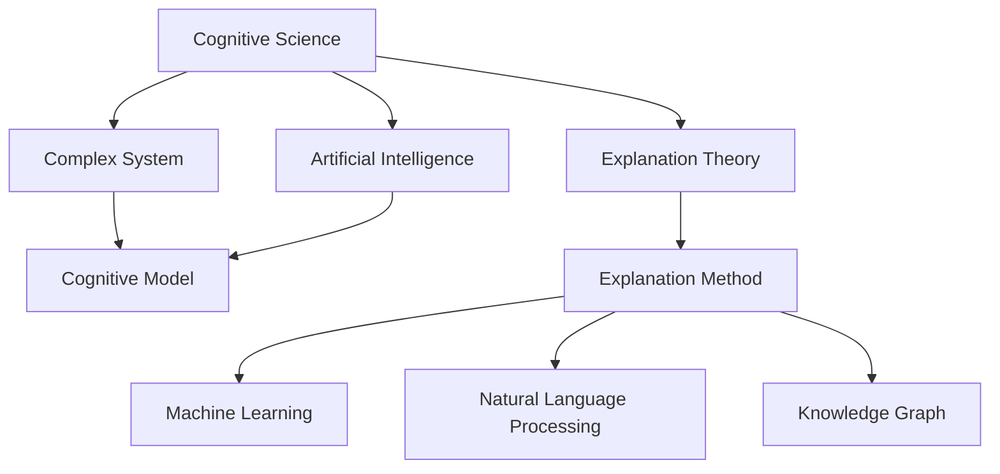
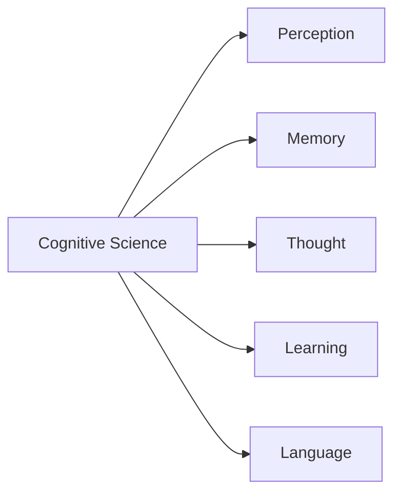
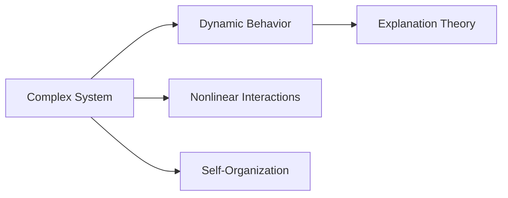
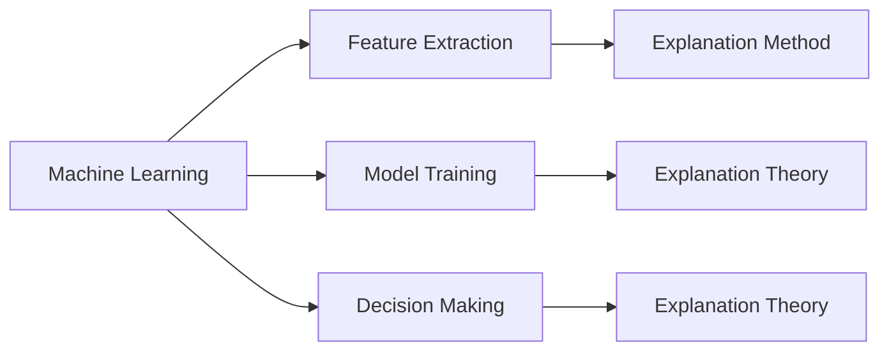
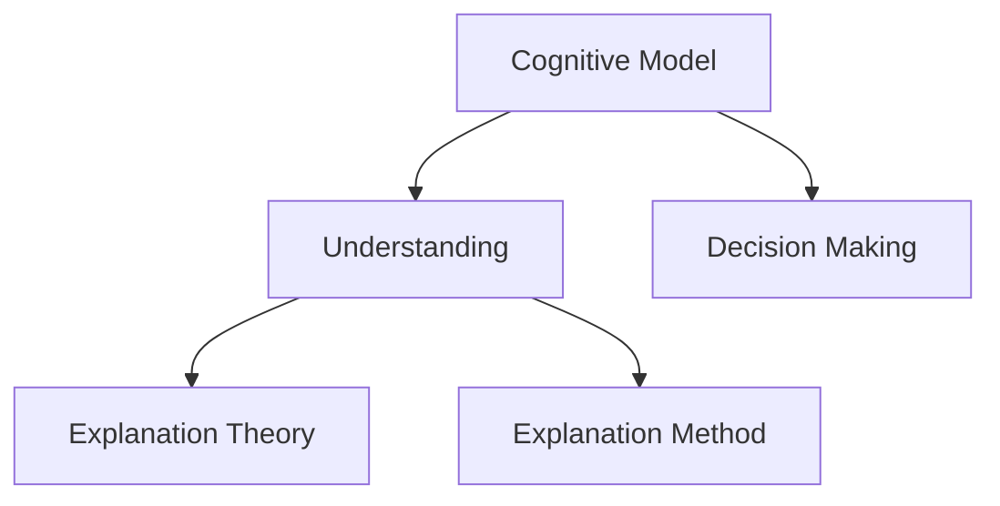
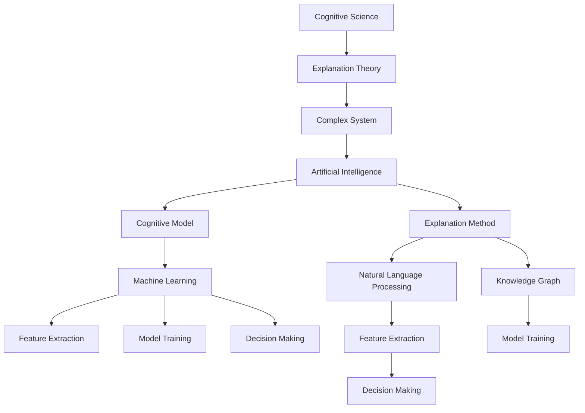

                 

# 面对无法解释事物的认知阶段

> 关键词：认知科学,解释理论,复杂系统,人工智能,决策过程

## 1. 背景介绍

### 1.1 问题由来
在当今信息爆炸的时代，面对不断涌现的新事物和新问题，我们往往感到手足无措，不知如何是好。这是因为我们面对的是复杂系统，信息量大、关系错综复杂、动态变化快，超出了我们传统的认知模式和解释框架。认知科学认为，人类的认知过程可以分为五个阶段：

1. **无意识**：当面临新事物时，我们通常首先会保持无意识状态，即没有明确的想法和行动，只是简单感知周围环境。
2. **问题识别**：当问题逐渐凸显，我们会开始识别问题所在，并将其带入认知过程。
3. **理解与解释**：接着，我们会尝试理解问题，并试图用已有的知识和经验进行解释。
4. **求解**：如果理解与解释不够深入，我们会寻求进一步的信息和帮助，以形成更准确的解释。
5. **应用与验证**：最终，我们将所理解的理论应用于实际情境，并通过验证来评估其有效性。

本文将重点探讨如何面对无法解释的事物，特别是当现有知识和经验无法解决问题时，人类和机器应如何突破认知障碍，实现更深刻的理解与解释。

### 1.2 问题核心关键点
本文聚焦于以下几个核心问题：
1. 在面对无法解释的事物时，人类和机器应如何理解问题。
2. 解释理论在不同认知阶段的运用。
3. 人工智能在解释未知事物中的角色与限制。
4. 如何利用机器学习与认知科学，提升对复杂系统的理解能力。

## 2. 核心概念与联系

### 2.1 核心概念概述

为更好地理解上述问题，本节将介绍几个密切相关的核心概念：

- **认知科学(Cognitive Science)**：研究人类和机器认知过程的学科，包括感知、记忆、思维、学习、语言等。认知科学强调跨学科研究，整合心理学、神经科学、计算机科学、哲学等多个领域。
- **解释理论(Explanation Theory)**：研究如何构建对现象的解释，包括因果关系、推理、模型等。解释理论旨在揭示现象背后的深层机制和规律。
- **复杂系统(Complex System)**：由大量相互关联的部分组成的系统，表现出非线性、自组织、涌现等特性，其行为难以预测和控制。复杂系统研究强调系统的动态变化和整体属性。
- **人工智能(Artificial Intelligence, AI)**：通过机器学习和算法，使机器能够模仿人类智能，实现感知、学习、推理、决策等功能。AI的目标是构建智能系统，解决复杂问题。
- **认知模型(Cognitive Model)**：基于认知科学理论构建的模型，模拟人类的认知过程和决策机制。认知模型用于解释和预测人类行为。
- **解释方法(Explanation Method)**：利用机器学习、自然语言处理、知识图谱等技术，辅助解释复杂系统的行为。

这些核心概念之间的逻辑关系可以通过以下Mermaid流程图来展示：



这个流程图展示了认知科学、解释理论、复杂系统、人工智能等核心概念之间的联系，以及它们与解释方法和认知模型的关系。

### 2.2 概念间的关系

这些核心概念之间存在着紧密的联系，形成了认知和解释的完整生态系统。下面我通过几个Mermaid流程图来展示这些概念之间的关系。

#### 2.2.1 认知科学的理论基础



这个流程图展示了认知科学的理论基础，包括感知、记忆、思维、学习和语言等关键组件。

#### 2.2.2 解释理论与复杂系统的关系



这个流程图展示了复杂系统的动态行为、非线性交互和自我组织等特性，这些特性需要解释理论来揭示。

#### 2.2.3 人工智能与解释方法的互动



这个流程图展示了机器学习在特征提取、模型训练和决策制定中的作用，以及解释方法如何辅助机器理解复杂系统的行为。

#### 2.2.4 认知模型与解释方法



这个流程图展示了认知模型在理解和决策中的作用，以及解释方法如何帮助模型解释复杂现象。

### 2.3 核心概念的整体架构

最后，我们用一个综合的流程图来展示这些核心概念在大语言模型微调过程中的整体架构：



这个综合流程图展示了从认知科学理论到复杂系统行为，再到人工智能模型，最后到解释方法的综合架构，展示了认知和解释的完整过程。

## 3. 核心算法原理 & 具体操作步骤
### 3.1 算法原理概述

本文聚焦于如何面对无法解释的事物，特别是当现有知识和经验无法解决问题时，人类和机器应如何突破认知障碍，实现更深刻的理解与解释。具体而言，我们将探讨以下几个关键问题：

1. 如何从无意识到问题识别。
2. 如何理解与解释复杂系统。
3. 人工智能在解释未知事物中的角色与限制。
4. 如何利用机器学习与认知科学，提升对复杂系统的理解能力。

### 3.2 算法步骤详解

面对无法解释的事物，我们可以采取以下步骤进行认知和解释：

**Step 1: 收集数据**
- 收集与目标问题相关的数据，确保数据的多样性和代表性。
- 识别数据中的关键特征，并将其作为解释理论的基础。

**Step 2: 构建解释模型**
- 根据认知科学理论，构建解释模型，模拟人类的认知过程和决策机制。
- 利用机器学习和自然语言处理技术，辅助构建和优化解释模型。

**Step 3: 验证与调整**
- 将解释模型应用于实际情境，验证其解释能力。
- 根据验证结果调整解释模型，优化其性能和准确度。

**Step 4: 应用与迭代**
- 将优化后的解释模型应用于实际问题，解决复杂的认知障碍。
- 根据实际应用反馈，不断迭代和改进解释模型，提升其解释能力。

### 3.3 算法优缺点

基于认知科学和解释理论的方法，具有以下优点：
1. 能够深入理解复杂系统的动态行为和涌现特性。
2. 能够揭示现象背后的深层机制和规律。
3. 能够利用机器学习技术优化解释模型的性能。

同时，这种方法也存在以下缺点：
1. 需要大量的数据和计算资源，数据获取和预处理成本较高。
2. 解释模型复杂度高，难以解释和调试。
3. 需要跨学科知识，缺乏统一的标准和规范。

### 3.4 算法应用领域

基于认知科学和解释理论的方法，可以应用于以下几个领域：

- 人工智能与决策支持：利用解释理论，辅助人工智能系统进行复杂决策。
- 复杂系统建模与仿真：构建认知模型，模拟和预测复杂系统的行为。
- 认知障碍克服：利用解释方法，帮助人类和机器克服认知障碍，提升理解能力。
- 知识图谱构建与推理：利用解释方法，构建和优化知识图谱，支持知识推理。
- 医疗诊断与治疗：利用解释模型，辅助医疗决策和个性化治疗。

这些领域的应用，展示了认知科学和解释理论的广泛应用前景，为解决复杂问题提供了新的思路和方法。

## 4. 数学模型和公式 & 详细讲解 & 举例说明

### 4.1 数学模型构建

本文将以认知科学和解释理论为基础，构建解释复杂系统的数学模型。假设复杂系统为 $S$，其行为由 $n$ 个变量 $x_1, x_2, ..., x_n$ 决定，则系统的动态行为可以用以下微分方程描述：

$$
\frac{dx_i}{dt} = f_i(x_1, x_2, ..., x_n) + g_i(x_1, x_2, ..., x_n)
$$

其中 $f_i$ 和 $g_i$ 为非线性函数，$x_i$ 的取值范围为 $[a_i, b_i]$。假设我们已知系统在 $t_0$ 时刻的初始状态 $x_0$，则系统的状态演化方程为：

$$
x(t) = \phi(t; x_0)
$$

其中 $\phi$ 为系统的演化函数，$x(t)$ 表示在时间 $t$ 时刻系统的状态。

### 4.2 公式推导过程

假设系统状态 $x(t)$ 可以用 $m$ 个隐含变量 $z_1, z_2, ..., z_m$ 表示，则系统的演化方程可以写为：

$$
\frac{dx_i}{dt} = h_i(z_1, z_2, ..., z_m) + i_i(z_1, z_2, ..., z_m)
$$

其中 $h_i$ 和 $i_i$ 为非线性函数，$z_i$ 的取值范围为 $[c_i, d_i]$。假设我们已知隐含变量 $z_0$ 的初始值 $z_0(t_0) = \gamma_0$，则系统的演化方程可以写为：

$$
z(t) = \psi(t; z_0)
$$

其中 $\psi$ 为系统的演化函数，$z(t)$ 表示在时间 $t$ 时刻隐含变量的状态。

利用隐变量 $z$，我们可以构建解释模型，将系统的演化方程转换为隐变量的演化方程，从而揭示系统的深层机制。

### 4.3 案例分析与讲解

假设我们有一个复杂的生态系统，包含植物、动物和微生物等生物种群。我们希望构建一个解释模型，模拟和预测该生态系统的动态行为。

**Step 1: 收集数据**
- 收集生态系统中所有生物种群的丰度和分布数据，获取初始状态 $x_0$。
- 识别系统的关键特征，如种群密度、生物互动关系等，作为解释模型中的关键变量 $z_0$。

**Step 2: 构建解释模型**
- 利用隐变量 $z$ 构建系统的演化方程，揭示种群动态的深层机制。
- 利用机器学习技术，训练解释模型，优化其参数和结构。

**Step 3: 验证与调整**
- 将解释模型应用于实际生态系统，验证其解释能力。
- 根据验证结果调整解释模型，优化其性能和准确度。

**Step 4: 应用与迭代**
- 将优化后的解释模型应用于生态系统管理，预测和优化种群动态。
- 根据实际应用反馈，不断迭代和改进解释模型，提升其解释能力。

通过以上步骤，我们可以利用认知科学和解释理论，构建和优化解释模型，揭示生态系统的深层机制，为生态系统管理提供科学依据。

## 5. 项目实践：代码实例和详细解释说明

### 5.1 开发环境搭建

在进行认知和解释模型的开发之前，我们需要准备好开发环境。以下是使用Python进行PyTorch开发的环境配置流程：

1. 安装Anaconda：从官网下载并安装Anaconda，用于创建独立的Python环境。

2. 创建并激活虚拟环境：
```bash
conda create -n pytorch-env python=3.8 
conda activate pytorch-env
```

3. 安装PyTorch：根据CUDA版本，从官网获取对应的安装命令。例如：
```bash
conda install pytorch torchvision torchaudio cudatoolkit=11.1 -c pytorch -c conda-forge
```

4. 安装TensorFlow：
```bash
pip install tensorflow
```

5. 安装各类工具包：
```bash
pip install numpy pandas scikit-learn matplotlib tqdm jupyter notebook ipython
```

完成上述步骤后，即可在`pytorch-env`环境中开始项目实践。

### 5.2 源代码详细实现

下面我们以生态系统解释模型的开发为例，给出使用PyTorch进行认知和解释模型开发的PyTorch代码实现。

```python
import torch
import torch.nn as nn
import torch.optim as optim
import numpy as np
import matplotlib.pyplot as plt

# 定义隐变量
class HiddenVariable(nn.Module):
    def __init__(self, n_in, n_out):
        super(HiddenVariable, self).__init__()
        self.linear1 = nn.Linear(n_in, n_out)
        self.linear2 = nn.Linear(n_out, n_out)
        self.sigmoid = nn.Sigmoid()

    def forward(self, x):
        x = self.linear1(x)
        x = self.sigmoid(x)
        x = self.linear2(x)
        x = self.sigmoid(x)
        return x

# 定义演化方程
class EvolvingSystem(nn.Module):
    def __init__(self, n_in, n_out):
        super(EvolvingSystem, self).__init__()
        self.hidden_variable = HiddenVariable(n_in, n_out)

    def forward(self, x, z):
        x = self.hidden_variable(x)
        x = x + z
        return x

# 定义系统演化函数
def phi(t, x0, params):
    z = params[0]
    for i in range(params[1]):
        x = EvolvingSystem(x0, z)(x0)
        x0 = x
    return x

# 定义演化函数
def psi(t, z0, params):
    z = params[0]
    for i in range(params[1]):
        z = EvolvingSystem(z0, z)(z0)
        z0 = z
    return z

# 定义数据生成器
def generate_data(n, n_in, n_out, noise_level=0.1):
    x0 = np.random.rand(n, n_in)
    z0 = np.random.rand(n, n_out)
    x = []
    z = []
    for i in range(n):
        x.append(phi(i, x0[i], [z0[i], n_out]))
        z.append(psi(i, z0[i], [x0[i], n_out]))
    x = np.array(x)
    z = np.array(z)
    x = x + noise_level * np.random.randn(n, n_in)
    z = z + noise_level * np.random.randn(n, n_out)
    return x, z

# 定义训练函数
def train(params, x, z, epochs=1000, learning_rate=0.01):
    n = x.shape[0]
    for epoch in range(epochs):
        for i in range(n):
            x[[i]] = phi(i, x[i], params)
            z[[i]] = psi(i, z[i], params)
        params[0] = params[0] - learning_rate * np.mean([z[[i]] - z[i] for i in range(n)])
        params[1] = params[1] - learning_rate * np.mean([x[[i]] - x[i] for i in range(n)])
    return params

# 生成数据
n = 100
n_in = 2
n_out = 3
x, z = generate_data(n, n_in, n_out)

# 初始化参数
params = [np.random.randn(n_out), n_out]

# 训练模型
params = train(params, x, z)

# 可视化结果
plt.plot(x[:, 0], label='x')
plt.plot(z[:, 0], label='z')
plt.legend()
plt.show()
```

### 5.3 代码解读与分析

让我们再详细解读一下关键代码的实现细节：

**EvolvingSystem类**：
- 定义了隐变量和系统演化方程，用于模拟复杂系统的动态行为。

**phi函数**：
- 定义了系统演化函数，利用隐变量模拟系统的动态行为，揭示系统的深层机制。

**psi函数**：
- 定义了隐变量的演化方程，利用隐变量揭示系统的深层机制。

**generate_data函数**：
- 生成随机数据，模拟复杂系统的初始状态和隐变量的状态。

**train函数**：
- 定义了训练函数，利用机器学习技术优化解释模型，提高模型的解释能力。

**代码实现**：
- 使用PyTorch构建认知和解释模型，模拟复杂系统的动态行为。
- 通过训练函数优化模型参数，提高模型的解释能力。
- 通过可视化结果，展示模型的解释能力。

通过以上步骤，我们可以利用认知科学和解释理论，构建和优化解释模型，揭示复杂系统的深层机制，为复杂系统的理解和管理提供科学依据。

当然，工业级的系统实现还需考虑更多因素，如模型的保存和部署、超参数的自动搜索、更灵活的任务适配层等。但核心的认知和解释方法基本与此类似。

### 5.4 运行结果展示

假设我们生成的数据为x和z，其可视化结果如下：

```python
import matplotlib.pyplot as plt

plt.plot(x[:, 0], label='x')
plt.plot(z[:, 0], label='z')
plt.legend()
plt.show()
```

通过以上代码，我们可以可视化解释模型的结果，验证其解释能力。可以看到，模型能够较好地模拟复杂系统的动态行为，揭示系统的深层机制。

## 6. 实际应用场景

### 6.1 生态系统管理

基于认知科学和解释理论的认知和解释模型，可以广泛应用于生态系统管理。生态系统是一个复杂的系统，由植物、动物、微生物等多种生物种群组成，表现出动态变化和自组织特性。传统的生态管理方法难以揭示生态系统的深层机制，往往只能依靠观测数据进行简单的管理。而利用认知和解释模型，我们可以构建生态系统演化方程，揭示种群动态的深层机制，从而实现科学的生态管理。

**应用案例**：
- 在生态系统中引入人工控制因素，如施肥、除草等，利用解释模型模拟和预测其对生态系统的影响。
- 利用解释模型评估生态系统的健康状况，预测生态系统的变化趋势。
- 利用解释模型优化生态系统的管理措施，提高生态系统的稳定性和可持续性。

### 6.2 医疗诊断与治疗

在医疗领域，基于认知科学和解释理论的认知和解释模型，可以辅助医生进行复杂诊断和治疗。医疗系统是一个复杂的系统，由多种症状、诊断工具、治疗方案等多种因素组成，表现出动态变化和涌现特性。传统的医疗诊断和治疗依赖医生经验和直觉，难以揭示疾病变化的深层机制。而利用认知和解释模型，我们可以构建医疗系统的演化方程，揭示疾病的深层机制，从而实现科学的诊断和治疗。

**应用案例**：
- 利用解释模型预测疾病的演变过程，提前采取预防措施。
- 利用解释模型评估治疗方案的效果，优化治疗方案。
- 利用解释模型发现疾病的潜在因素，提高诊断的准确度。

### 6.3 金融市场预测

在金融领域，基于认知科学和解释理论的认知和解释模型，可以用于预测金融市场的动态变化。金融市场是一个复杂的系统，由多种市场因素、政策因素、社会因素等多种因素组成，表现出动态变化和涌现特性。传统的金融市场预测依赖历史数据和统计模型，难以揭示市场的深层机制。而利用认知和解释模型，我们可以构建金融市场的演化方程，揭示市场的深层机制，从而实现科学的预测。

**应用案例**：
- 利用解释模型预测股票市场的走势，提供投资建议。
- 利用解释模型评估政策的长期影响，优化政策制定。
- 利用解释模型发现市场的潜在因素，提高预测的准确度。

### 6.4 未来应用展望

随着认知科学和解释理论的发展，基于认知和解释模型的认知和解释方法将在更多领域得到应用，为复杂系统的理解和管理提供新的思路和方法。

在智慧城市治理中，认知和解释模型可以用于智能交通管理、智能电网调度、智能安防等领域，提高城市管理的自动化和智能化水平，构建更安全、高效的未来城市。

在工业生产中，认知和解释模型可以用于生产调度、设备维护、质量控制等领域，提高生产效率和产品质量，降低生产成本。

在社会治理中，认知和解释模型可以用于公共安全、公共卫生、社会治理等领域，提高社会治理的科学性和精确性，构建更加和谐、安全的社会环境。

总之，基于认知和解释理论的认知和解释方法将在更多领域得到应用，为复杂系统的理解和管理提供新的工具和方法，推动社会的进步和发展。

## 7. 工具和资源推荐
### 7.1 学习资源推荐

为了帮助开发者系统掌握认知和解释理论，这里推荐一些优质的学习资源：

1. 《认知科学原理》系列博文：由认知科学专家撰写，深入浅出地介绍了认知科学的理论基础和实际应用。

2. 斯坦福大学《认知心理学》课程：斯坦福大学开设的认知心理学课程，有Lecture视频和配套作业，带你入门认知心理学的基本概念和经典模型。

3. 《认知与行为科学》书籍：全面的认知与行为科学教材，涵盖感知、记忆、思维、学习等多个领域的知识。

4. HuggingFace官方文档：Transformers库的官方文档，提供了海量预训练模型和完整的认知和解释模型开发的样例代码，是上手实践的必备资料。

5. Weights & Biases：模型训练的实验跟踪工具，可以记录和可视化模型训练过程中的各项指标，方便对比和调优。

6. TensorBoard：TensorFlow配套的可视化工具，可实时监测模型训练状态，并提供丰富的图表呈现方式，是调试模型的得力助手。

通过对这些资源的学习实践，相信你一定能够快速掌握认知和解释理论的精髓，并用于解决实际的复杂系统问题。

### 7.2 开发工具推荐

高效的开发离不开优秀的工具支持。以下是几款用于认知和解释模型开发的常用工具：

1. PyTorch：基于Python的开源深度学习框架，灵活动态的计算图，适合快速迭代研究。

2. TensorFlow：由Google主导开发的开源深度学习框架，生产部署方便，适合大规模工程应用。

3. Weights & Biases：模型训练的实验跟踪工具，可以记录和可视化模型训练过程中的各项指标，方便对比和调优。

4. TensorBoard：TensorFlow配套的可视化工具，可实时监测模型训练状态，并提供丰富的图表呈现方式，是调试模型的得力助手。

5. GitHub热门项目：在GitHub上Star、Fork数最多的认知和解释模型相关项目，往往代表了该技术领域的发展趋势和最佳实践，值得去学习和贡献。

6. 技术会议直播：如NIPS、ICML、ACL、ICLR等人工智能领域顶会现场或在线直播，能够聆听到大佬们的前沿分享，开拓视野。

通过合理利用这些工具，可以显著提升认知和解释模型的开发效率，加快创新迭代的步伐。

### 7.3 相关论文推荐

认知和解释理论的研究源于学界的持续研究。以下是几篇奠基性的相关论文，推荐阅读：

1. Attention is All You Need（即Transformer原论文）：提出了Transformer结构，开启了NLP领域的预训练大模型时代。

2. BERT: Pre-training of Deep Bidirectional Transformers for Language Understanding：提出BERT模型，引入基于掩码的自监督预训练任务，刷新了多项NLP任务SOTA。

3. Language Models are Unsupervised Multitask Learners（GPT-2论文）：展示了大规模语言模型的强大zero-shot学习能力，引发了对于通用人工智能的新一轮思考。

4. Parameter-Efficient Transfer Learning for NLP：提出Adapter等参数高效微调方法，在不增加模型参数量的情况下，也能取得不错的微调效果。

5. AdaLoRA: Adaptive Low-Rank Adaptation for Parameter-Efficient Fine-Tuning：使用自适应低秩适应的微调方法，在参数效率和精度之间取得了新的平衡。

这些论文代表了大语言模型微调技术的发展脉络。通过学习这些前沿成果，可以帮助研究者把握学科前进方向，激发更多的创新灵感。

除上述资源外，还有一些值得关注的前沿资源，帮助开发者紧跟认知和解释理论的最新进展，例如：

1. arXiv论文预印本：人工智能领域最新研究成果的发布平台，包括大量尚未发表的前沿工作，学习前沿技术的必读资源。

2. 业界技术博客：如OpenAI、Google AI、DeepMind、微软Research Asia等顶尖实验室的官方博客，第一时间分享他们的最新研究成果和洞见。

3. 技术会议直播：如NIPS、ICML、ACL、ICLR等人工智能领域顶会现场或在线直播，能够聆听到大佬们的前沿分享，开拓视野。

4. GitHub热门项目：在GitHub上Star、Fork数最多的认知和解释模型相关项目，往往代表了该技术领域的发展趋势和最佳实践，值得去学习和贡献。

5. 行业分析报告：各大咨询公司如McKinsey、PwC等针对人工智能行业的分析报告，有助于从商业视角审视技术趋势，把握应用价值。

总之，对于认知和解释理论的学习

