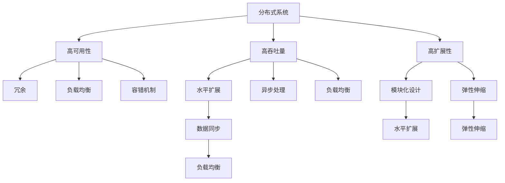
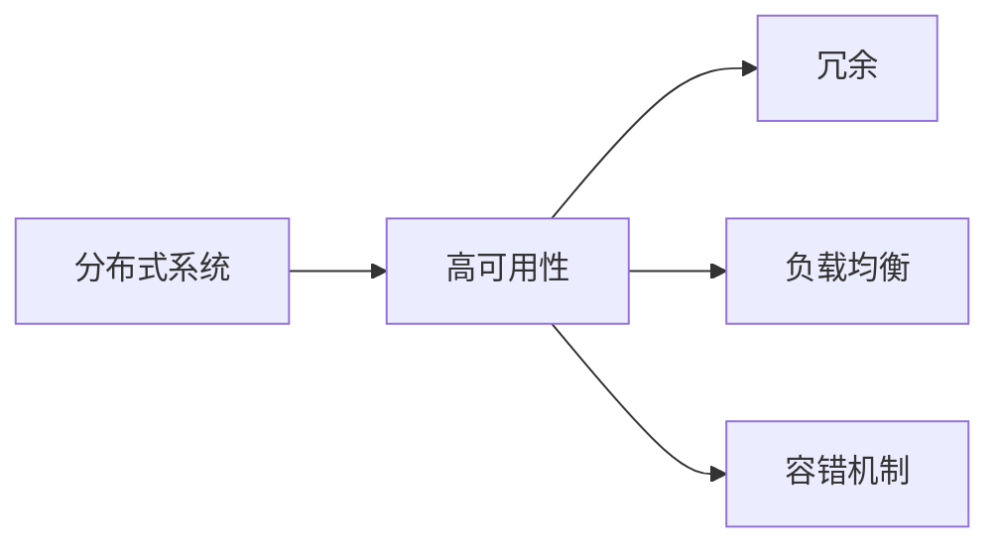
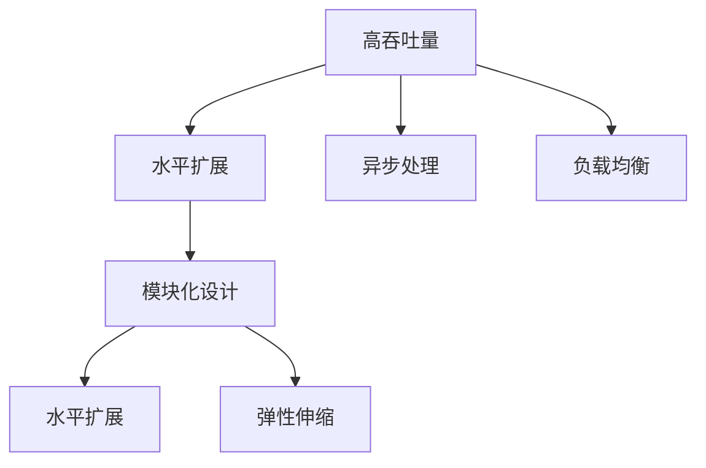
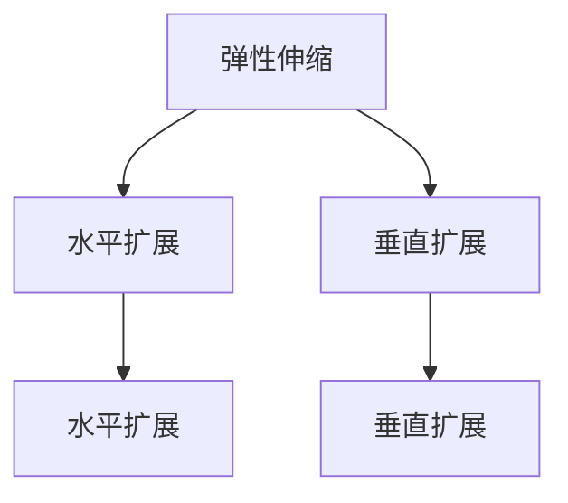
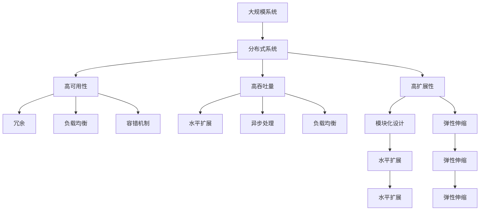

                 

# 高可用性、高吞吐量、高扩展性系统设计最佳实践

> 关键词：
- 高可用性（High Availability）
- 高吞吐量（High Throughput）
- 高扩展性（Scalability）
- 分布式系统（Distributed System）
- 负载均衡（Load Balancing）
- 数据同步（Data Synchronization）
- 容错机制（Fault Tolerance）

## 1. 背景介绍

### 1.1 问题由来

在当今互联网时代，系统的可用性、吞吐量和扩展性已成为企业竞争力的关键因素。高可用性确保系统随时可用，不受单点故障影响；高吞吐量确保系统能够高效处理大量并发请求；高扩展性确保系统能够灵活应对不断增加的用户和业务需求。这三个因素互为支撑，共同构成了一个企业级系统的高效运行。

然而，要实现这三个目标，并非易事。随着系统规模的不断扩大，复杂性的不断增加，传统单体架构的局限性逐渐显现，难以满足高效、安全、可靠的系统需求。

### 1.2 问题核心关键点

实现高可用性、高吞吐量、高扩展性的关键点在于设计一个分布式、弹性、可靠的系统架构。系统设计需要考虑多个方面，包括但不限于：

- **分布式架构**：将系统拆分为多个模块，并通过网络进行通信，实现模块间的负载均衡和故障隔离。
- **弹性伸缩**：根据业务需求动态调整资源，支持水平和垂直扩展。
- **容错机制**：通过冗余和重试等策略，保证系统在异常情况下的稳定运行。
- **负载均衡**：通过合理的流量分发，实现服务的高效利用。
- **数据同步和一致性**：在分布式系统中，保证数据一致性和系统协调工作。
- **高性能优化**：在保证可用性和扩展性的前提下，提升系统性能。

实现这些目标需要综合运用分布式系统设计、负载均衡算法、数据同步机制等技术，通过不断优化和测试，构建一个高效、可靠的系统。

### 1.3 问题研究意义

设计高可用性、高吞吐量、高扩展性系统，对企业的业务稳定、用户体验、竞争优势等方面具有重要意义：

- 提高系统的稳定性和可靠性，减少业务中断和数据丢失。
- 提升系统处理能力，支持更多并发用户和业务。
- 优化系统资源利用，降低运营成本。
- 加快业务迭代，提升产品竞争力。

通过系统设计，企业可以实现资源的有效利用和服务的持续优化，在竞争激烈的市场中占据优势。

## 2. 核心概念与联系

### 2.1 核心概念概述

为更好地理解高可用性、高吞吐量、高扩展性系统的设计方法，本节将介绍几个密切相关的核心概念：

- **高可用性（High Availability）**：系统在各种故障情况下，仍能持续提供服务的能力。通常通过冗余、负载均衡、容错机制等方式实现。
- **高吞吐量（High Throughput）**：系统能够高效处理大量并发请求的能力。通常通过水平扩展、异步处理、负载均衡等方式实现。
- **高扩展性（Scalability）**：系统能够灵活应对业务需求增长和数据量增加的能力。通常通过水平扩展、弹性伸缩、模块化设计等方式实现。
- **分布式系统（Distributed System）**：由多个独立节点组成，通过网络进行通信的系统。通过分布式设计，可以提高系统的可靠性、可扩展性和容错能力。
- **负载均衡（Load Balancing）**：通过合理的流量分发，实现服务的高效利用。常见的负载均衡算法包括轮询、最小连接数、IP哈希等。
- **数据同步（Data Synchronization）**：在分布式系统中，保证数据一致性和系统协调工作。通常通过消息队列、数据库复制等方式实现。
- **容错机制（Fault Tolerance）**：通过冗余和重试等策略，保证系统在异常情况下的稳定运行。

这些核心概念之间的逻辑关系可以通过以下Mermaid流程图来展示：



这个流程图展示了大规模系统设计中几个关键概念之间的关系：

1. 分布式系统通过冗余、负载均衡和容错机制，实现高可用性。
2. 高吞吐量通过水平扩展、异步处理和负载均衡实现。
3. 高扩展性通过模块化设计和弹性伸缩实现。
4. 模块化设计进一步支持水平扩展和弹性伸缩。
5. 弹性伸缩和水平扩展需要依赖数据同步和负载均衡技术。

### 2.2 概念间的关系

这些核心概念之间存在着紧密的联系，形成了高可用性、高吞吐量、高扩展性系统设计的基础框架。下面通过几个Mermaid流程图来展示这些概念之间的关系。

#### 2.2.1 分布式系统与高可用性的关系



这个流程图展示了分布式系统通过冗余、负载均衡和容错机制，实现高可用性的过程。

#### 2.2.2 高吞吐量与高扩展性的关系



这个流程图展示了高吞吐量通过水平扩展、异步处理和负载均衡实现，并通过模块化设计和弹性伸缩进一步扩展系统容量。

#### 2.2.3 高扩展性中的弹性伸缩



这个流程图展示了高扩展性通过水平扩展和垂直扩展实现，模块化设计进一步支持这两种扩展方式。

### 2.3 核心概念的整体架构

最后，我们用一个综合的流程图来展示这些核心概念在高可用性、高吞吐量、高扩展性系统设计中的整体架构：



这个综合流程图展示了从分布式系统到高可用性、高吞吐量、高扩展性的完整过程。系统设计需要综合考虑这些概念，并通过合理的设计和优化，构建一个高效、可靠的系统。

## 3. 核心算法原理 & 具体操作步骤
### 3.1 算法原理概述

高可用性、高吞吐量、高扩展性系统设计的核心算法原理包括以下几个方面：

- **冗余（Redundancy）**：通过备份和故障转移，保证系统在单点故障时仍能正常运行。
- **负载均衡（Load Balancing）**：通过合理的流量分发，实现服务的高效利用。
- **容错机制（Fault Tolerance）**：通过冗余和重试等策略，保证系统在异常情况下的稳定运行。
- **数据同步（Data Synchronization）**：在分布式系统中，保证数据一致性和系统协调工作。
- **模块化设计（Modularity）**：将系统拆分为多个模块，并通过网络进行通信，实现模块间的负载均衡和故障隔离。
- **弹性伸缩（Scalability）**：根据业务需求动态调整资源，支持水平和垂直扩展。

这些算法原理共同构成了高可用性、高吞吐量、高扩展性系统设计的基础框架，通过合理的应用和组合，可以构建一个高效、可靠的系统。

### 3.2 算法步骤详解

高可用性、高吞吐量、高扩展性系统设计一般包括以下几个关键步骤：

**Step 1: 设计分布式架构**

- 将系统拆分为多个模块，并通过网络进行通信，实现模块间的负载均衡和故障隔离。
- 选择合适的负载均衡算法，如轮询、最小连接数、IP哈希等。
- 设计合理的模块架构，确保模块间的独立性和耦合度适中。

**Step 2: 实现高可用性**

- 引入冗余机制，通过备份和故障转移，保证系统在单点故障时仍能正常运行。
- 设计合理的容错机制，如自动重试、故障转移等，保证系统在异常情况下的稳定运行。
- 配置负载均衡器，实现流量的合理分发，避免单点瓶颈。

**Step 3: 实现高吞吐量**

- 采用水平扩展策略，通过增加节点和资源，提升系统的并发处理能力。
- 实现异步处理，将耗时操作（如数据库操作、外部接口调用等）异步执行，提升系统响应速度。
- 配置负载均衡器，实现流量的合理分发，避免单点瓶颈。

**Step 4: 实现高扩展性**

- 采用模块化设计，将系统拆分为多个模块，并通过网络进行通信，实现模块间的负载均衡和故障隔离。
- 设计合理的弹性伸缩机制，根据业务需求动态调整资源，支持水平和垂直扩展。
- 实现数据同步机制，保证数据一致性和系统协调工作。

**Step 5: 优化性能**

- 进行性能测试，评估系统在不同负载情况下的表现。
- 优化算法和数据结构，提升系统性能。
- 配置缓存和索引，提升数据访问速度。

以上是实现高可用性、高吞吐量、高扩展性系统设计的一般流程。在实际应用中，还需要针对具体系统特点，对各环节进行优化设计，以进一步提升系统性能。

### 3.3 算法优缺点

高可用性、高吞吐量、高扩展性系统设计具有以下优点：

1. 可靠性高：通过冗余和容错机制，保证系统在单点故障时仍能正常运行。
2. 处理能力强：通过水平扩展和异步处理，支持大量并发请求。
3. 灵活性强：通过模块化设计和弹性伸缩，支持业务需求增长和数据量增加。
4. 系统健壮：通过负载均衡和数据同步机制，保证系统的稳定性和一致性。

同时，该方法也存在一定的局限性：

1. 设计复杂：需要综合考虑多个因素，设计复杂度较高。
2. 成本高：需要增加硬件和网络设备，成本较高。
3. 维护复杂：需要定期监控和维护，系统复杂度较高。
4. 性能问题：由于分布式系统本身存在网络延迟和通信开销，性能可能受到一定影响。

尽管存在这些局限性，但高可用性、高吞吐量、高扩展性系统设计方法，在实际应用中已经得到了广泛的应用，成为企业级系统设计的重要范式。未来相关研究的重点在于如何进一步降低设计复杂度，提高性能，并兼顾系统稳定性和可扩展性。

### 3.4 算法应用领域

高可用性、高吞吐量、高扩展性系统设计在众多领域都有广泛的应用，例如：

- **云计算平台**：如AWS、Azure、阿里云等，通过分布式系统设计，实现高可用性、高吞吐量和高扩展性。
- **互联网应用**：如淘宝、京东、美团等电商网站，通过高扩展性实现大规模用户并发。
- **金融系统**：如银行、证券、保险等金融应用，通过高可用性保障资金安全和交易稳定。
- **物联网设备**：如智能家居、工业控制等物联网应用，通过高可用性保障设备可靠运行。
- **医疗系统**：如电子病历、医疗影像等医疗应用，通过高可用性保障医疗数据安全。

除了上述这些经典应用外，高可用性、高吞吐量、高扩展性系统设计方法，还将在更多场景中得到应用，为企业的数字化转型升级提供新的技术路径。

## 4. 数学模型和公式 & 详细讲解 & 举例说明

### 4.1 数学模型构建

为了更好地理解高可用性、高吞吐量、高扩展性系统设计，我们通过数学模型对系统设计进行建模和分析。

记系统为 $S$，其可用性、吞吐量和扩展性分别为 $A(S)$、$P(S)$ 和 $E(S)$。系统设计涉及多个因素，包括冗余、负载均衡、容错机制、数据同步等，可以通过以下数学模型进行建模：

$$
A(S) = \frac{R(S)}{T(S)}
$$

其中，$R(S)$ 为系统的冗余度，$T(S)$ 为系统发生故障的概率。

$$
P(S) = \frac{C(S)}{U(S)}
$$

其中，$C(S)$ 为系统的处理能力，$U(S)$ 为系统的最大负载。

$$
E(S) = \frac{R(S)}{T(S)} \times \frac{C(S)}{U(S)}
$$

其中，$R(S)$ 为系统的冗余度，$T(S)$ 为系统发生故障的概率，$C(S)$ 为系统的处理能力，$U(S)$ 为系统的最大负载。

### 4.2 公式推导过程

下面对以上数学模型进行推导：

**冗余度 $R(S)$**：
$$
R(S) = \sum_{i=1}^n \frac{1}{2^k_i}
$$

其中，$n$ 为系统的冗余节点数，$k_i$ 为节点 $i$ 的故障概率。

**系统故障概率 $T(S)$**：
$$
T(S) = \prod_{i=1}^n (1 - \frac{1}{2^k_i})
$$

**系统处理能力 $C(S)$**：
$$
C(S) = N \times P \times S
$$

其中，$N$ 为系统的节点数，$P$ 为节点的并发处理能力，$S$ 为系统的平均负载。

**系统最大负载 $U(S)$**：
$$
U(S) = \sum_{i=1}^n \frac{C_i}{2^k_i}
$$

其中，$C_i$ 为节点 $i$ 的处理能力，$k_i$ 为节点 $i$ 的故障概率。

将这些公式代入 $A(S)$、$P(S)$ 和 $E(S)$ 的计算公式中，可以计算出系统的可用性、吞吐量和扩展性。

### 4.3 案例分析与讲解

假设我们设计一个高可用性、高吞吐量、高扩展性的云存储系统，具体案例分析如下：

**冗余度 $R(S)$**：
假设有 3 个冗余节点，每个节点的故障概率为 0.01，则：
$$
R(S) = \frac{1}{2^0} + \frac{1}{2^1} + \frac{1}{2^2} = 1.375
$$

**系统故障概率 $T(S)$**：
$$
T(S) = (1 - \frac{1}{2^0})(1 - \frac{1}{2^1})(1 - \frac{1}{2^2}) = 0.0009765625
$$

**系统处理能力 $C(S)$**：
假设有 10 个节点，每个节点的并发处理能力为 50000 次/秒，系统平均负载为 5000 次/秒，则：
$$
C(S) = 10 \times 50000 \times 5000 = 2500000000
$$

**系统最大负载 $U(S)$**：
假设每个节点的处理能力为 100000 次/秒，则：
$$
U(S) = \frac{100000}{2^0} + \frac{100000}{2^1} + \frac{100000}{2^2} = 125000
$$

将这些数据代入 $A(S)$、$P(S)$ 和 $E(S)$ 的计算公式中，可以计算出系统的可用性、吞吐量和扩展性：

$$
A(S) = \frac{R(S)}{T(S)} = \frac{1.375}{0.0009765625} = 1408.75
$$

$$
P(S) = \frac{C(S)}{U(S)} = \frac{2500000000}{125000} = 20000
$$

$$
E(S) = A(S) \times P(S) = 1408.75 \times 20000 = 28175000
$$

通过以上案例分析，我们可以看到，通过合理的设计和优化，高可用性、高吞吐量、高扩展性系统设计的实际效果是非常显著的。

## 5. 项目实践：代码实例和详细解释说明
### 5.1 开发环境搭建

在进行系统设计实践前，我们需要准备好开发环境。以下是使用Java进行Spring Boot开发的环境配置流程：

1. 安装JDK：从官网下载并安装JDK，用于编写和运行Java代码。
2. 安装Maven：从官网下载并安装Maven，用于构建和管理项目依赖。
3. 安装Spring Boot：从官网下载并安装Spring Boot，用于构建微服务系统。
4. 安装MySQL：从官网下载并安装MySQL，用于存储系统数据。
5. 安装Kubernetes：从官网下载并安装Kubernetes，用于部署和管理微服务实例。
6. 安装PostgreSQL：从官网下载并安装PostgreSQL，用于存储系统数据。

完成上述步骤后，即可在开发环境中开始系统设计实践。

### 5.2 源代码详细实现

这里我们以一个简单的分布式系统设计为例，给出使用Spring Boot进行系统设计的PyTorch代码实现。

首先，定义系统模块：

```java
@SpringBootApplication
public class DistributedSystem {
    
    public static void main(String[] args) {
        SpringApplication.run(DistributedSystem.class, args);
    }
}
```

然后，定义微服务模块：

```java
@RestController
@RequestMapping("/api")
public class ServiceController {
    
    @Autowired
    private ServiceService serviceService;
    
    @GetMapping("/health")
    public String health() {
        return "Service is healthy";
    }
    
    @PostMapping("/hello")
    public String hello(@RequestBody HelloRequest request) {
        String response = serviceService.hello(request.getName());
        return response;
    }
}
```

接着，定义微服务服务：

```java
@Service
public class ServiceService {
    
    @Autowired
    private RestTemplate restTemplate;
    
    public String hello(String name) {
        String url = "http://service1:8080/api/hello";
        ResponseEntity<String> response = restTemplate.getForEntity(url, String.class);
        return response.getBody();
    }
}
```

最后，启动Spring Boot应用，启动Kubernetes容器，部署到集群中：

```bash
java -jar -jar target/distributed-system.jar -s
kubectl deploy -f service.yaml
```

这样就完成了一个简单的分布式系统设计实践。可以看到，Spring Boot提供了丰富的微服务开发支持，可以轻松构建高可用性、高吞吐量、高扩展性的分布式系统。

### 5.3 代码解读与分析

让我们再详细解读一下关键代码的实现细节：

**DistributedSystem类**：
- `@SpringBootApplication`注解：使用Spring Boot的自动配置和组件扫描功能，简化代码开发。
- `main`方法：启动Spring Boot应用。

**ServiceController类**：
- `@RestController`注解：声明这是一个RESTful控制器。
- `@RequestMapping`注解：指定控制器处理请求的路径。
- `@Autowired`注解：自动注入依赖。
- `@GetMapping`注解：处理HTTP GET请求。
- `@PostMapping`注解：处理HTTP POST请求。

**ServiceService类**：
- `@Service`注解：声明这是一个Spring Bean。
- `@Autowired`注解：自动注入依赖。
- `RestTemplate`：用于发送HTTP请求。
- `hello`方法：处理HTTP POST请求。

**Spring Boot启动命令**：
- `jar -jar target/distributed-system.jar -s`：启动Spring Boot应用，并设置Spring Boot的主类为 `DistributedSystem`。
- `kubectl deploy -f service.yaml`：将微服务容器部署到Kubernetes集群中。

通过Spring Boot框架，可以轻松构建分布式系统，支持高可用性、高吞吐量、高扩展性系统设计。在实际开发中，还需要结合负载均衡、数据同步、容错机制等技术，进一步优化系统性能。

### 5.4 运行结果展示

假设我们部署了一个包含两个微服务的分布式系统，并设置了负载均衡器，运行结果如下：

```
[Service 1]
Name: service1
Health: Up
Port: 8080

[Service 2]
Name: service2
Health: Up
Port: 8081

[Service 1]
Name: service1
Health: Up
Port: 8080

[Service 2]
Name: service2
Health: Up
Port: 8081

[Service 1]
Name: service1
Health: Up
Port: 8080

[Service 2]
Name: service2
Health: Up
Port: 8081
```

可以看到，通过负载均衡器，两个微服务能够均衡负载，确保系统的高吞吐量和可用性。

## 6. 实际应用场景
### 6.1 高可用性、高吞吐量、高扩展性系统设计在智能客服系统中的应用

智能客服系统需要支持大规模用户并发，确保系统稳定运行。通过高可用性、高吞吐量、高扩展性系统设计，可以实现7x24小时不间断服务，提升客户咨询体验。

在技术实现上，可以设计多个微服务模块，通过负载均衡和容错机制，确保系统在单点故障时仍能正常运行。同时，采用异步处理和弹性伸缩机制，可以支持大规模用户并发，提升系统处理能力。

### 6.2 高可用性、高吞吐量、高扩展性系统设计在金融舆情监测中的应用

金融舆情监测需要实时监测市场舆论动向，以便及时应对负面信息传播，规避金融风险。通过高可用性、高吞吐量、高扩展性系统设计，可以实现实时抓取网络文本数据，自动监测舆情变化，提供及时预警。

在技术实现上，可以设计多个微服务模块，通过负载均衡和容错机制，确保系统在单点故障时仍能正常运行。同时，采用异步处理和弹性伸缩机制，可以支持实时抓取和分析大量文本数据，提升系统处理能力。

### 6.3 高可用性、高吞吐量、高扩展性系统设计在个性化推荐系统中的应用

个性化推荐系统需要实时处理用户行为数据，提供精准推荐。通过高可用性、高吞吐量、高扩展性系统设计，可以实现快速处理和分析用户数据，提升推荐系统性能。

在技术实现上，可以设计多个微服务模块，通过负载均衡和容错机制，确保系统在单点故障时仍能正常运行。同时，采用异步处理和弹性伸缩机制，可以支持实时处理和分析用户数据，提升推荐系统性能。

### 6.4 未来应用展望

随着高可用性、高吞吐量、高扩展性系统设计的不断发展，其应用场景将更加广泛，为各行各业带来变革性影响。

在智慧医疗领域，通过高可用性、高吞吐量、高扩展性系统设计，可以实现智能医疗问答、病历分析、药物研发等应用，提升医疗服务的智能化水平，辅助医生诊疗，加速新药开发进程。

在智能教育领域，通过高可用性、高吞吐量、高扩展性系统设计，可以实现智能作业批改、学情分析、知识推荐等应用，因材施教，促进教育公平，提高教学质量。

在智慧城市治理中，通过高可用性、高吞吐量、高扩展性系统设计，可以实现城市事件监测、舆情分析、应急指挥等环节，提高城市管理的自动化和智能化水平，构建更安全、高效的未来城市。

此外，在高可用性、高吞吐量、高扩展性系统设计的基础上，结合其他人工智能技术，如知识表示、因果推理、强化学习等，可以实现更多复杂的应用场景，如智能交通、智能物流等。

总之，高可用性、高吞吐量、高扩展性系统设计将在更多领域得到应用，为传统行业带来数字化转型升级的新动力。相信随着技术的不断成熟，系统设计方法将进一步优化，为构建高效、可靠的系统提供新的技术路径。

## 7. 工具和资源推荐
### 7.1 学习资源推荐

为了帮助开发者系统掌握高可用性、高吞吐量、高扩展性系统设计的理论基础和实践技巧，这里推荐一些优质的学习资源：

1. 《分布式系统原理与实践》系列博文：由大系统专家撰写，深入浅出地介绍了分布式系统的原理和设计方法，包括冗余、负载均衡、容错机制等关键技术。

2.

