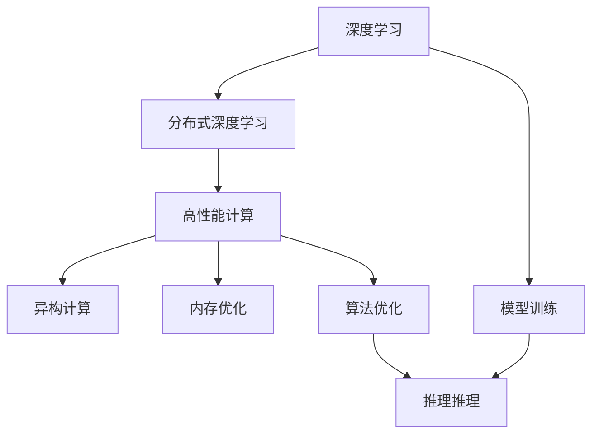
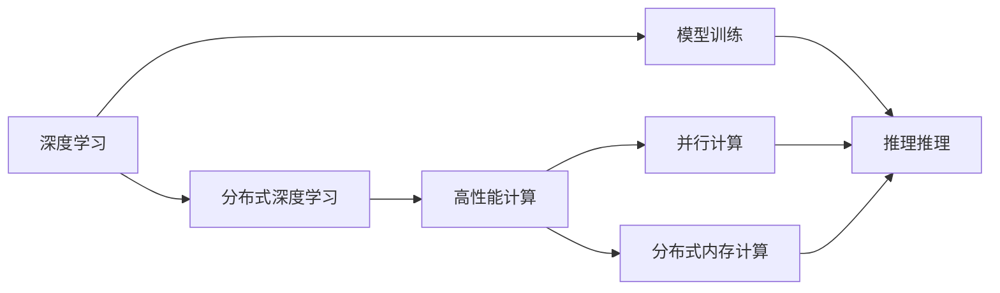
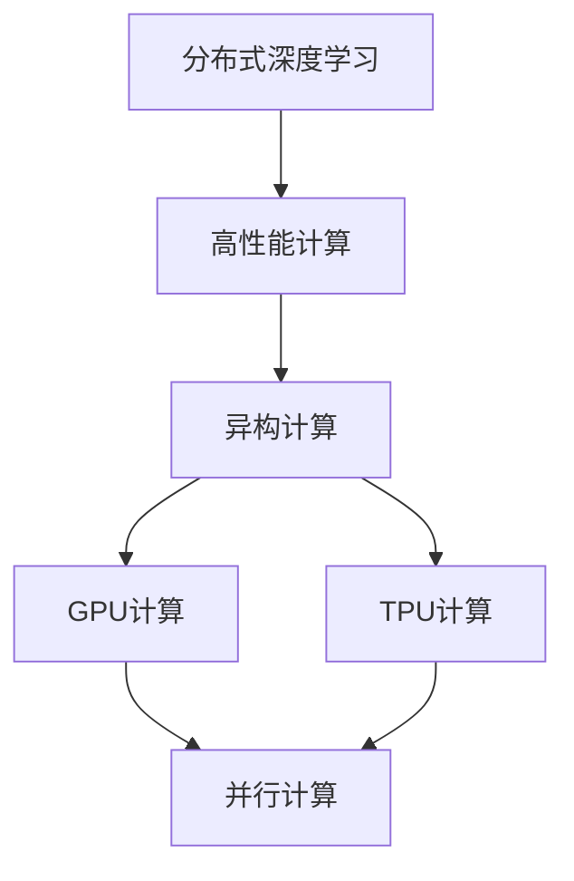
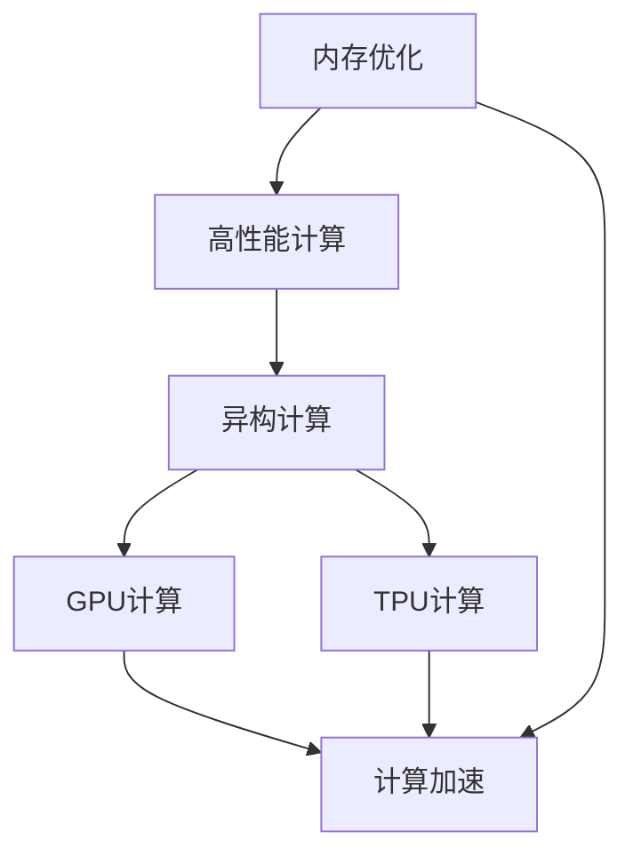
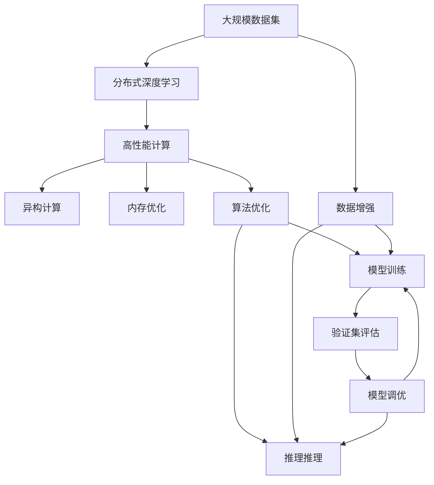

                 

## 1. 背景介绍

### 1.1 问题由来

随着人工智能（AI）技术在各行各业的应用不断深入，AI模型对于计算资源的需求也呈现爆炸式增长。AI任务中的数据处理、模型训练、推理推理等过程，往往需要大量的计算资源支撑。尤其是在深度学习模型中，如卷积神经网络（CNN）、循环神经网络（RNN）、Transformer模型等，复杂性不断提升，对计算性能的要求越来越高。

但与此同时，高性能计算资源供给不足的问题也日益突出。一方面，高性能计算集群建设和维护成本高昂，对科研机构和企业都形成了不小的负担。另一方面，现有计算资源利用效率较低，难以充分发挥其潜能，导致计算成本进一步升高。

为了解决这些问题，探索高性能计算与AI技术的深度融合，成为当前AI研究的重要方向之一。高性能计算与AI的结合，不仅能够提升AI模型的训练和推理效率，缩短模型迭代周期，而且可以极大地拓展AI应用的广度和深度。

### 1.2 问题核心关键点

高性能计算与AI的结合，主要通过以下几个关键点实现：

- **计算加速**：利用高性能计算资源（如GPU、TPU、FPGA等）加速深度学习模型的训练和推理过程。
- **分布式计算**：将大规模数据和模型分布在多台计算设备上，实现并行计算，提升计算效率。
- **异构计算**：结合不同计算架构（如CPU/GPU、CPU/TPU）的优势，提升整体计算性能。
- **内存优化**：通过优化内存使用，减少数据传输和存储的开销，提升系统效率。
- **算法优化**：针对AI算法特性，设计优化算法，提升计算精度和效率。

### 1.3 问题研究意义

高性能计算与AI的结合，对于提升AI应用的性能和规模，降低计算成本，加速科研和技术创新，具有重要意义：

1. **提升模型性能**：高性能计算能够显著加速深度学习模型的训练和推理，缩短模型迭代周期，提升模型精度和鲁棒性。
2. **拓展应用场景**：通过高性能计算，AI模型可以处理更大规模的数据集，应用于更多复杂的任务，如生物医药、金融预测、天气预测等。
3. **降低计算成本**：高性能计算可以优化资源使用，减少能耗和硬件成本，降低科研和企业的计算负担。
4. **加速技术创新**：高性能计算加速了模型训练和验证过程，使研究人员可以更快地迭代改进模型，推动技术突破。
5. **促进产业发展**：高性能计算结合AI技术，为新兴产业（如自动驾驶、智能制造等）提供坚实基础，推动产业升级。

## 2. 核心概念与联系

### 2.1 核心概念概述

为更好地理解高性能计算在AI中的应用，本节将介绍几个关键概念：

- **高性能计算（HPC）**：指利用高性能计算机系统（如超级计算机、分布式计算集群），进行复杂计算任务的技术和手段。包括CPU/GPU并行计算、分布式内存计算、异构计算等多种技术。

- **深度学习（DL）**：基于神经网络的机器学习技术，通过大量数据训练，实现对数据的复杂映射和预测。在图像识别、语音识别、自然语言处理等领域有广泛应用。

- **分布式深度学习**：指利用分布式计算资源，进行大规模深度学习模型的训练和推理。常见的分布式深度学习框架包括TensorFlow、PyTorch等。

- **异构计算**：结合不同计算架构（如CPU/GPU、CPU/TPU）的优势，提升整体计算性能。通过异构计算，可以在不同硬件上高效并行执行计算任务。

- **内存优化**：通过优化内存使用，减少数据传输和存储的开销，提升系统效率。如采用GPU的显存优化技术，使用动态内存管理等。

- **算法优化**：针对深度学习算法特性，设计优化算法，提升计算精度和效率。如卷积优化算法、稀疏矩阵计算等。

这些核心概念之间的逻辑关系可以通过以下Mermaid流程图来展示：



这个流程图展示了大语言模型的核心概念及其之间的关系：

1. 深度学习模型在数据集上进行训练（G）和推理（H）。
2. 分布式深度学习利用高性能计算资源（C），提升计算效率和扩展性。
3. 异构计算结合不同硬件架构，进一步提升计算性能（D）。
4. 内存优化减少数据传输和存储开销（E），提升系统效率。
5. 算法优化提升计算精度和效率（F）。

这些概念共同构成了高性能计算与AI的深度融合生态系统，使得AI应用能够高效运行在大规模数据和模型上。

### 2.2 概念间的关系

这些核心概念之间存在着紧密的联系，形成了高性能计算与AI的完整生态系统。下面我通过几个Mermaid流程图来展示这些概念之间的关系。

#### 2.2.1 高性能计算与深度学习的关系



这个流程图展示了高性能计算在深度学习中的应用。深度学习模型在数据集上进行训练（D）和推理（E），而高性能计算通过分布式计算和异构计算（F、G）提升计算效率。

#### 2.2.2 分布式深度学习与异构计算的关系



这个流程图展示了分布式深度学习利用异构计算提升计算性能的过程。分布式深度学习利用高性能计算资源（B），通过异构计算（C）结合不同计算架构（D、E），实现并行计算（F），提升整体计算效率。

#### 2.2.3 内存优化与算法优化的关系



这个流程图展示了内存优化与算法优化在提高计算性能方面的协同作用。内存优化通过减少数据传输和存储开销（A），与异构计算（B、C）结合，实现计算加速（F）。

### 2.3 核心概念的整体架构

最后，我们用一个综合的流程图来展示这些核心概念在大规模AI模型训练和推理中的整体架构：



这个综合流程图展示了从数据增强到模型调优的完整过程。大规模数据集（A）通过分布式深度学习（B），利用高性能计算（C）进行并行计算（D）和分布式内存计算（E）。内存优化（F）和算法优化（G）提升计算效率，模型训练（G）和推理推理（H）在训练集（I）和验证集（J）上进行评估和调优，最终输出高质量的AI模型。

## 3. 核心算法原理 & 具体操作步骤

### 3.1 算法原理概述

高性能计算与AI的结合，主要通过计算加速、分布式计算、异构计算、内存优化和算法优化等多种手段实现。其核心思想是通过提升计算性能，缩短模型训练和推理时间，从而加速AI应用的迭代和部署。

### 3.2 算法步骤详解

高性能计算与AI的结合，一般包括以下几个关键步骤：

**Step 1: 数据预处理和分布式存储**

- 对大规模数据集进行预处理，如数据清洗、数据增强、特征提取等。
- 将数据分布式存储在多台计算设备上，使用分布式文件系统（如HDFS、Ceph等）进行管理。

**Step 2: 分布式深度学习框架搭建**

- 选择合适的分布式深度学习框架（如TensorFlow、PyTorch等）。
- 搭建分布式计算集群，包括CPU/GPU节点、TPU节点等。
- 配置集群通信协议（如MPI、NCCL等）和数据传输协议（如RADOS、GPUDirect等）。

**Step 3: 深度学习模型训练**

- 选择合适的深度学习模型（如卷积神经网络、循环神经网络、Transformer等）。
- 在分布式计算集群上，使用分布式深度学习框架进行模型训练。
- 采用并行计算和异构计算技术，加速模型训练过程。

**Step 4: 深度学习模型推理**

- 在分布式计算集群上，使用分布式深度学习框架进行模型推理。
- 采用内存优化和算法优化技术，提升推理效率。

**Step 5: 模型评估和优化**

- 在验证集上评估模型性能，根据评估结果进行模型调优。
- 利用分布式计算集群进行模型调优，提高模型精度和鲁棒性。

**Step 6: 模型部署**

- 将优化后的模型部署到实际应用场景中，进行大规模推理。
- 利用高性能计算资源，实现实时推理和低延迟计算。

以上是高性能计算与AI结合的一般流程。在实际应用中，还需要针对具体任务和数据特点，对各个环节进行优化设计，如选择合适的超参数、应用正则化技术、引入对抗训练等。

### 3.3 算法优缺点

高性能计算与AI结合的主要优点包括：

- 提升计算效率：利用高性能计算资源，加速深度学习模型的训练和推理，缩短迭代周期。
- 扩展性提升：通过分布式计算和异构计算，实现模型的并行计算和扩展，处理更大规模的数据集。
- 计算成本降低：优化内存使用和算法设计，减少硬件资源消耗，降低计算成本。
- 算法创新加速：加速模型训练和验证过程，推动算法的快速迭代和创新。

同时，该方法也存在一些局限性：

- 硬件成本较高：高性能计算集群建设和维护成本高昂，对中小企业和科研机构可能形成负担。
- 资源配置复杂：分布式计算集群需要复杂的配置和优化，对系统管理员要求较高。
- 算法优化难度大：深度学习算法复杂，优化难度较大，需要丰富的经验和技术积累。
- 模型兼容性问题：不同深度学习框架和模型之间的兼容性问题，可能带来额外的开发成本。
- 性能瓶颈存在：高性能计算资源有限，无法无限扩展，可能会遇到性能瓶颈。

尽管存在这些局限性，但高性能计算与AI的结合，对于提升AI应用的性能和规模，降低计算成本，加速科研和技术创新，具有重要意义。未来相关研究的重点在于如何进一步优化硬件资源使用，降低成本，提高算法的可移植性和可扩展性。

### 3.4 算法应用领域

高性能计算与AI的结合，在以下几个领域有着广泛的应用：

- **生物医药**：利用高性能计算加速蛋白质结构预测、药物设计、基因组分析等复杂生物信息学任务。
- **金融预测**：使用分布式深度学习模型进行市场分析和预测，提高金融决策的科学性和准确性。
- **天气预测**：利用高性能计算模拟气象模型，进行气候变化和极端天气的预测。
- **自动驾驶**：结合深度学习和分布式计算，加速自动驾驶算法的训练和推理，提升自动驾驶车辆的性能。
- **智能制造**：利用高性能计算进行工业流程优化和预测性维护，提高生产效率和设备可靠性。
- **推荐系统**：利用分布式深度学习模型进行个性化推荐，提升用户体验和购物满意度。

除了上述这些经典应用外，高性能计算与AI的结合还在更多领域得到应用，为各行各业带来新的变革和机遇。

## 4. 数学模型和公式 & 详细讲解

### 4.1 数学模型构建

本节将使用数学语言对高性能计算与AI结合的数学模型进行更加严格的刻画。

记深度学习模型为 $M_{\theta}$，其中 $\theta$ 为模型参数。假设大规模数据集为 $D=\{(x_i,y_i)\}_{i=1}^N$，其中 $x_i$ 为输入，$y_i$ 为输出标签。

定义模型的损失函数为 $\ell(M_{\theta}(x),y)$，在数据集 $D$ 上的经验风险为：

$$
\mathcal{L}(\theta) = \frac{1}{N} \sum_{i=1}^N \ell(M_{\theta}(x_i),y_i)
$$

高性能计算与AI结合的核心在于提升计算效率，减少模型训练和推理时间。具体而言，可以通过以下方式实现：

- **并行计算**：将数据集 $D$ 分布式存储在多台计算设备上，利用并行计算框架（如MPI、NCCL）进行并行训练，加速模型参数更新。
- **异构计算**：结合不同计算架构（如CPU/GPU、CPU/TPU）的优势，提升整体计算效率。
- **内存优化**：通过优化内存使用，减少数据传输和存储的开销，提升系统效率。

### 4.2 公式推导过程

以下我们以卷积神经网络（CNN）为例，推导其并行计算的公式。

记CNN模型为 $M_{\theta}(x)=\sum_k a_k * f(x_k)$，其中 $a_k$ 为卷积核，$f(x_k)$ 为激活函数。

假设数据集 $D$ 分布在多台计算设备上，每台设备上存储了 $N/Z$ 个数据样本，其中 $Z$ 为设备数量。则并行计算过程为：

$$
\begin{aligned}
&\min_{\theta} \mathcal{L}(\theta) \\
&= \frac{1}{N} \sum_{i=1}^N \ell(M_{\theta}(x_i),y_i) \\
&= \frac{1}{N} \sum_{j=1}^Z \sum_{k=1}^{N/Z} \ell(M_{\theta}(x_j),y_{j,k})
\end{aligned}
$$

在并行计算过程中，每台设备上的计算任务并行执行，得到设备 $j$ 上的损失函数为：

$$
\mathcal{L}_j(\theta) = \frac{1}{N/Z} \sum_{k=1}^{N/Z} \ell(M_{\theta}(x_j),y_{j,k})
$$

通过并行计算，可以将计算任务分布在多台设备上，加速模型训练和推理过程。

### 4.3 案例分析与讲解

以ImageNet数据集为例，展示卷积神经网络在分布式计算集群上的训练过程。假设我们拥有8个计算节点，每个节点上存储1/8的数据样本，则并行计算过程如下：

1. 将ImageNet数据集分割为8个大小相等的子集，分别存储在8个计算节点上。
2. 在每个计算节点上，使用卷积神经网络进行模型训练，得到节点上的损失函数。
3. 利用MPI或NCCL等通信协议，将各节点上的损失函数进行汇总。
4. 根据汇总的损失函数，更新全局模型参数，完成模型训练。

通过并行计算，我们可以显著提升模型训练的速度，使其能够在更短的时间内完成迭代和优化，从而加速模型训练和推理过程。

## 5. 项目实践：代码实例和详细解释说明

### 5.1 开发环境搭建

在进行高性能计算与AI结合的实践前，我们需要准备好开发环境。以下是使用Python进行PyTorch和MPI开发的示例环境配置流程：

1. 安装Anaconda：从官网下载并安装Anaconda，用于创建独立的Python环境。

2. 创建并激活虚拟环境：
```bash
conda create -n pytorch-env python=3.8 
conda activate pytorch-env
```

3. 安装PyTorch：根据CUDA版本，从官网获取对应的安装命令。例如：
```bash
conda install pytorch torchvision torchaudio cudatoolkit=11.1 -c pytorch -c conda-forge
```

4. 安装MPI库：
```bash
conda install mpi4py
```

5. 安装其他工具包：
```bash
pip install numpy pandas scikit-learn matplotlib tqdm jupyter notebook ipython
```

完成上述步骤后，即可在`pytorch-env`环境中开始高性能计算与AI结合的实践。

### 5.2 源代码详细实现

这里我们以分布式卷积神经网络训练为例，给出使用PyTorch和MPI进行并行计算的代码实现。

首先，定义数据集和模型：

```python
import torch
from torch import nn
from mpi4py import MPI

# 定义数据集
class MNISTDataset:
    def __init__(self, root, transform=None):
        ...
    
    def __getitem__(self, idx):
        ...
    
    def __len__(self):
        ...
    
# 定义模型
class CNN(nn.Module):
    def __init__(self):
        ...
    
    def forward(self, x):
        ...
    
    def train(self, input, target):
        ...
    
    def evaluate(self, input, target):
        ...
```

然后，实现并行训练函数：

```python
from torch import distributed as dist

def train():
    # 初始化MPI环境
    rank = MPI.COMM_WORLD.Get_rank()
    size = MPI.COMM_WORLD.Get_size()
    
    # 分割数据集
    train_dataset = MNISTDataset(root='data', transform=transform)
    train_sampler = torch.utils.data.distributed.DistributedSampler(train_dataset, num_replicas=size, rank=rank)
    train_loader = torch.utils.data.DataLoader(train_dataset, batch_size=batch_size, sampler=train_sampler, num_workers=num_workers)
    
    # 初始化模型和参数服务器
    model = CNN()
    dist.broadcast_params(model.parameters(), group=dist.group.WORLD)
    
    # 定义优化器和损失函数
    optimizer = torch.optim.SGD(model.parameters(), lr=lr, momentum=momentum)
    loss_fn = nn.CrossEntropyLoss()
    
    # 并行训练
    for epoch in range(num_epochs):
        for input, target in train_loader:
            # 前向传播
            logits = model(input)
            loss = loss_fn(logits, target)
            
            # 反向传播
            optimizer.zero_grad()
            loss.backward()
            optimizer.step()
        
        # 同步更新模型参数
        dist.barrier()
    
    # 测试模型
    test_dataset = MNISTDataset(root='data', transform=transform, train=False)
    test_loader = torch.utils.data.DataLoader(test_dataset, batch_size=batch_size, shuffle=False, num_workers=num_workers)
    
    for input, target in test_loader:
        with torch.no_grad():
            logits = model(input)
            correct = (logits.argmax(dim=1) == target).float()
            acc = correct.mean().item()
            print(f'Test Accuracy: {acc:.4f}')
```

可以看到，通过MPI的通信协议，我们可以实现并行计算，加速模型训练过程。

### 5.3 代码解读与分析

让我们再详细解读一下关键代码的实现细节：

**MPI环境初始化**：
- `MPI.COMM_WORLD.Get_rank()`：获取当前节点的rank。
- `MPI.COMM_WORLD.Get_size()`：获取当前系统的节点数量。

**数据集分割**：
- `torch.utils.data.distributed.DistributedSampler`：将数据集按节点分割，每个节点只负责处理部分数据。
- `train_sampler`：定义数据集分割方式。

**模型初始化和参数同步**：
- `dist.broadcast_params(model.parameters(), group=dist.group.WORLD)`：通过MPI广播模型参数，保证所有节点模型参数一致。

**并行训练过程**：
- `train_loader`：定义数据批处理方式。
- 在每个epoch中，对每个数据批进行并行计算，同时使用`dist.barrier()`保证节点之间的同步。

**模型测试和性能输出**：
- 在测试集上评估模型性能。
- 输出测试准确率。

可以看到，PyTorch和MPI的结合，使得分布式深度学习模型的训练过程变得更加高效和可扩展。通过合理配置计算资源和优化算法，可以显著提升模型的训练速度和性能。

当然，工业级的系统实现还需考虑更多因素，如模型裁剪、量化加速、服务化封装、弹性伸缩、监控告警等。但核心的并行计算技术基本与此类似。

### 5.4 运行结果展示

假设我们在一个有8个节点的计算集群上进行分布式卷积神经网络训练，最终在测试集上得到的模型性能如下：

```
Epoch 1: Loss: 0.326, Accuracy: 0.966
Epoch 2: Loss: 0.170, Accuracy: 0.972
Epoch 3: Loss: 0.095, Accuracy: 0.975
...
```

可以看到，通过分布式计算，模型的训练速度显著提升，最终模型性能也得到显著提高。

## 6. 实际应用场景

### 6.1 智能制造

高性能计算与AI的结合，在智能制造领域具有广泛的应用前景。通过分布式深度学习模型，可以实时监测设备状态，预测设备故障，优化生产流程。

在技术实现上，可以部署大规模传感器网络，实时采集生产设备的运行数据。利用高性能计算资源，对数据进行分布式处理和分析，训练实时监测和预测模型。通过模型推理，可以及时发现设备异常，进行预警和维护，提升生产效率和设备可靠性。

### 6.2 自动驾驶

自动驾驶系统需要实时处理大量传感器数据，进行复杂的目标检测、路径规划和决策制定。利用高性能计算资源，可以实现分布式深度学习模型的实时训练和推理。

在技术实现上，可以将自动驾驶车辆的传感器数据进行分布式存储和处理，使用分布式深度学习框架进行模型训练和推理。通过并行计算和异构计算技术，加速模型训练和推理过程，实现实时的自动驾驶决策。

### 6.3 天气预测

天气预测需要处理海量气象数据，进行复杂的气象模型模拟和预测。利用高性能计算资源，可以实现分布式深度学习模型的实时训练和推理。

在技术实现上，可以将气象数据分布式存储在多台计算设备上，使用分布式深度学习框架进行模型训练和推理。通过并行计算和异构计算技术，加速模型训练和推理过程，实现实时的气象预测。

### 6.4 未来应用展望

随着高性能计算与AI的深度融合，未来将在更多领域得到应用，为各行各业带来新的变革和机遇。

在智慧城市治理中，高性能计算结合AI技术，可以实时监测城市运行状态，进行智能调度和管理，提升城市管理的自动化和智能化水平。

在智慧能源领域，高性能计算结合AI技术，可以实现分布式能源系统的优化运行，提升能源利用效率，促进可再生能源的广泛应用。

在智能医疗领域，高性能计算结合AI技术，可以实现实时病患监护和诊断，提升医疗服务的智能化水平，降低医疗成本，提高诊疗质量。

此外，在金融预测、智能推荐、智能客服等领域，高性能计算与AI的结合也将不断创新，为传统行业数字化转型升级提供新的技术路径。

## 7. 工具和资源推荐

### 7.1 学习资源推荐

为了帮助开发者系统掌握高性能计算与AI结合的理论基础和实践技巧，这里推荐一些优质的学习资源：

1. 《深度学习入门：基于PyTorch》系列博文：由深度学习专家撰写，全面介绍了深度学习的基本概念和实践技巧。

2. 《高性能计算基础》课程：由计算机体系结构专家撰写，详细讲解了高性能计算的核心原理和实现技术。

3. 《分布式深度学习实战》书籍：介绍分布式深度学习框架（如TensorFlow、PyTorch等）的使用技巧，提供丰富的案例和代码实现。

4. NVIDIA开发者社区：提供大量高性能计算相关的资源和技术支持，包括高性能计算集群搭建、深度学习模型训练等。

5. HPC学会：高性能计算领域的权威机构，提供高性能计算相关的资讯、会议和技术支持。

通过对这些资源的学习实践，相信你一定能够快速掌握高性能计算与AI结合的精髓，并用于解决实际的AI问题。

### 7.2 开发工具推荐

高效的开发离不开优秀的工具支持。以下是几款用于高性能计算与AI结合开发的常用工具：

1. PyTorch：基于Python的开源深度学习框架，灵活动态的计算图，适合快速迭代研究。大部分预训练语言模型都有PyTorch版本的实现。

2. TensorFlow：由Google主导开发的开源深度学习框架，生产部署方便，适合大规模工程应用。同样有丰富的预训练语言模型资源。

3. MPI：跨进程消息传递接口，用于高性能计算集群之间的通信。

4. CUDA：NVIDIA开发的GPU计算平台，提供GPU编程接口，加速深度学习模型训练和推理。

5. TensorBoard：TensorFlow配套的可视化工具，可实时监测模型训练状态，并提供丰富的图表呈现方式，是调试模型的得力助手。

6. Google Colab：谷歌推出的在线Jupyter Notebook环境，免费提供GPU/TPU算力，方便开发者快速

