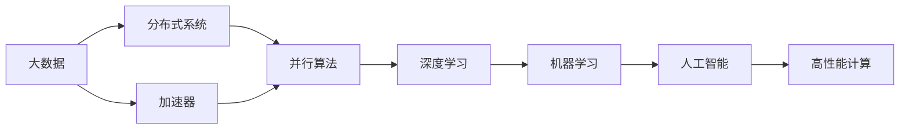
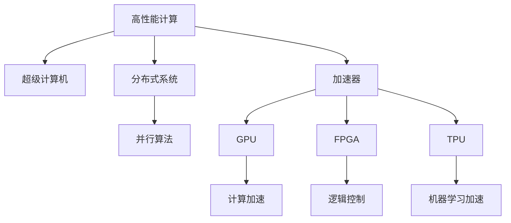
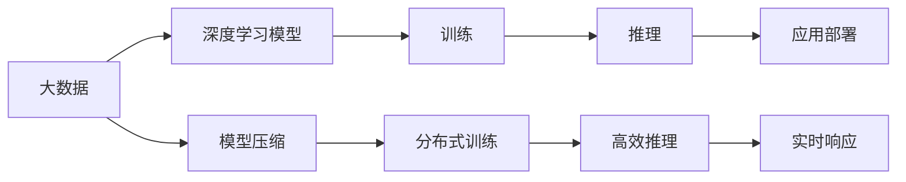
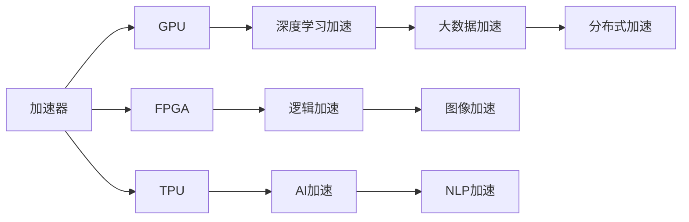
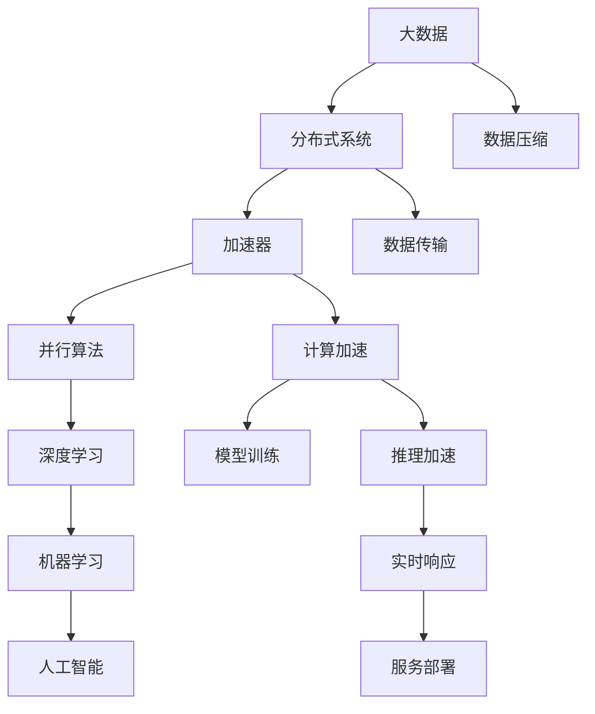

                 

# 高性能计算在AI中的前景

> 关键词：高性能计算,人工智能,机器学习,深度学习,大数据,加速器,分布式系统,并行算法

## 1. 背景介绍

### 1.1 问题由来
随着人工智能技术的迅猛发展，高性能计算在AI中的应用越来越广泛。无论是大数据处理、模型训练还是应用部署，高性能计算都能显著提升AI的计算效率和模型性能。然而，传统的高性能计算架构和算法难以满足AI的大规模、分布式、实时性等需求，亟需新的计算模式和技术支撑。本文将深入探讨高性能计算在AI中的应用前景，为读者提供全面的技术指导和未来展望。

### 1.2 问题核心关键点
高性能计算在AI中的应用主要集中在以下几个方面：

1. **大数据处理**：AI模型通常需要处理海量数据，高性能计算能够提供强大的数据处理能力和存储能力，支撑模型训练和推理。
2. **模型训练**：AI模型训练过程涉及复杂的优化算法和大量计算，高性能计算可以加速模型收敛，提高训练效率。
3. **应用部署**：AI模型的推理和预测通常需要实时响应，高性能计算能够提供高效的推理加速和分布式计算，支撑AI应用的实时性和稳定性。
4. **跨领域融合**：高性能计算结合AI技术，可以实现更广泛的应用场景，如图像识别、语音识别、自然语言处理等。
5. **未来趋势**：高性能计算与AI技术的深度融合，将推动计算、存储、通信等基础技术的革新，催生新一代的AI计算平台。

### 1.3 问题研究意义
研究高性能计算在AI中的应用前景，对于提升AI的计算能力和应用效率，加速AI技术的产业化进程，具有重要意义：

1. **加速模型训练**：高性能计算能够显著缩短模型训练时间，提升模型性能。
2. **降低计算成本**：通过优化计算资源，降低AI应用的计算成本，提高经济效益。
3. **拓展应用场景**：高性能计算与AI结合，能够实现更复杂、更高性能的AI应用。
4. **促进产业升级**：高性能计算技术的应用，能够推动AI技术在各个行业的广泛应用，促进产业转型升级。
5. **推动创新研究**：高性能计算与AI技术的结合，促进了计算模式和算法创新，为AI研究提供了新的工具和方法。

## 2. 核心概念与联系

### 2.1 核心概念概述

为更好地理解高性能计算在AI中的应用，本节将介绍几个密切相关的核心概念：

- **高性能计算(High Performance Computing, HPC)**：指使用高效计算架构和算法，以极快的速度解决复杂计算问题的技术。包括超级计算机、GPU、FPGA等计算资源。
- **人工智能(Artificial Intelligence, AI)**：通过机器学习、深度学习等技术，使计算机模拟人类智能行为的技术。涵盖自然语言处理、计算机视觉、机器学习等方向。
- **机器学习(Machine Learning, ML)**：通过数据训练模型，使计算机具备自主学习能力的科学。
- **深度学习(Deep Learning, DL)**：机器学习的一个分支，通过多层次神经网络处理数据，实现复杂任务自动化的技术。
- **大数据(Big Data)**：指规模巨大、复杂多变的数据集，需要高效计算和存储能力处理。
- **加速器(Accelerator)**：指专门为提高计算性能而设计的硬件设备，如GPU、FPGA、TPU等。
- **分布式系统(Distributed System)**：由多台计算机组成的计算系统，通过网络实现数据共享和任务调度。
- **并行算法(Parallel Algorithm)**：指能够在多台计算机上并行执行的算法，提高计算效率。

这些核心概念之间的逻辑关系可以通过以下Mermaid流程图来展示：



这个流程图展示了大数据、加速器、分布式系统、并行算法等技术对深度学习和机器学习的影响，以及这些技术如何支撑AI的高性能计算应用。

### 2.2 概念间的关系

这些核心概念之间存在着紧密的联系，形成了高性能计算在AI中的应用生态系统。下面我通过几个Mermaid流程图来展示这些概念之间的关系。

#### 2.2.1 高性能计算的架构体系



这个流程图展示了高性能计算架构的层次结构，包括超级计算机、分布式系统、并行算法、加速器等关键组件，以及不同加速器在计算和控制方面的应用。

#### 2.2.2 高性能计算在AI中的角色



这个流程图展示了高性能计算在AI模型训练、推理和部署中的作用，包括数据处理、模型压缩、分布式训练、高效推理等。

#### 2.2.3 高性能计算与AI的结合点



这个流程图展示了不同加速器在AI模型训练和推理中的具体应用，以及它们对大数据、深度学习、图像识别、自然语言处理等方向的支撑。

### 2.3 核心概念的整体架构

最后，我们用一个综合的流程图来展示这些核心概念在高性能计算在AI中的应用中的整体架构：



这个综合流程图展示了从大数据处理到AI模型部署的全流程，以及高性能计算在其中各个环节的作用。通过这些流程图，我们可以更清晰地理解高性能计算在AI中的应用生态系统。

## 3. 核心算法原理 & 具体操作步骤
### 3.1 算法原理概述

高性能计算在AI中的应用，主要通过以下几个核心算法原理实现：

1. **分布式计算**：将大任务分解为小任务，分配给多台计算设备并行处理，提高计算效率。
2. **并行算法**：使用并行数据结构、并行运算符等技术，在多台计算机上并行执行，加速计算过程。
3. **数据压缩与优化**：使用数据压缩、数据分块等技术，减少数据传输和存储开销，提高计算效率。
4. **加速器优化**：针对特定计算任务，优化加速器硬件和软件架构，提高加速器性能。
5. **自动并行化**：通过编译器或自动并行化工具，将串行代码自动转换为并行代码，提高并行算法的可移植性和可扩展性。
6. **GPU优化**：针对深度学习等任务，优化GPU的计算架构和内存管理，提高模型训练和推理效率。

### 3.2 算法步骤详解

高性能计算在AI中的应用，主要分为以下几个步骤：

**Step 1: 数据处理与预处理**

- 收集和预处理大量原始数据，进行数据清洗、去重、归一化等预处理。
- 将大数据集进行分块，分发至分布式存储系统，如Hadoop、Spark等。
- 对数据进行压缩和解压缩，减少数据传输和存储开销。

**Step 2: 模型训练与并行优化**

- 在分布式系统中，选择适合的高性能计算架构，如GPU、FPGA、TPU等。
- 选择适合的并行算法，将模型训练任务并行化，加速训练过程。
- 使用自动并行化工具，将串行代码转换为并行代码，提高计算效率。
- 对模型参数进行优化，减少计算资源消耗，提高计算效率。

**Step 3: 模型推理与加速**

- 在分布式系统中，选择适合的加速器进行模型推理。
- 使用GPU、FPGA、TPU等加速器，加速模型推理过程。
- 对模型进行优化，减少推理计算开销，提高推理效率。
- 使用分布式系统，实现模型推理的实时响应。

**Step 4: 应用部署与优化**

- 将训练好的模型部署到高性能计算系统中，实现模型推理。
- 对模型推理过程进行优化，减少计算资源消耗，提高推理效率。
- 使用分布式系统，实现模型的实时响应，支持高并发用户请求。
- 对模型进行监控和调优，确保模型性能稳定。

### 3.3 算法优缺点

高性能计算在AI中的应用，具有以下优点：

1. **高效计算能力**：高性能计算能够提供强大的计算能力，加速模型训练和推理。
2. **分布式计算能力**：能够处理海量数据和大规模任务，支持分布式计算。
3. **并行计算能力**：并行计算能够显著提升计算效率，加速模型训练和推理。
4. **加速器优化**：优化加速器硬件和软件架构，提高计算效率。
5. **自动并行化**：自动并行化工具能够提高并行算法的可移植性和可扩展性。

同时，高性能计算在AI中的应用也存在以下缺点：

1. **硬件成本高**：高性能计算硬件成本较高，如GPU、FPGA、TPU等。
2. **算法复杂**：高性能计算算法复杂，需要专业的知识和经验。
3. **模型复杂**：深度学习等模型的复杂度较高，需要大量的计算资源。
4. **数据复杂**：大数据集的复杂性较高，需要高效的数据处理和压缩技术。
5. **部署复杂**：分布式系统的部署和管理较为复杂，需要专业的运维人员。

### 3.4 算法应用领域

高性能计算在AI中的应用，已经广泛应用于以下几个领域：

1. **自然语言处理(NLP)**：使用GPU、TPU等加速器，加速NLP模型的训练和推理。
2. **计算机视觉(CV)**：使用GPU、FPGA等加速器，加速CV模型的训练和推理。
3. **语音识别(ASR)**：使用GPU、TPU等加速器，加速ASR模型的训练和推理。
4. **医学影像分析(MI)**：使用GPU、FPGA等加速器，加速MI模型的训练和推理。
5. **金融分析(FI)**：使用GPU、TPU等加速器，加速FI模型的训练和推理。
6. **推荐系统(RE)**：使用GPU、TPU等加速器，加速RE模型的训练和推理。
7. **游戏和娱乐(GA)**：使用GPU、FPGA等加速器，加速GA模型的训练和推理。

## 4. 数学模型和公式 & 详细讲解 & 举例说明

### 4.1 数学模型构建

高性能计算在AI中的应用，通常采用以下数学模型进行建模：

1. **分布式数据处理模型**：
   $$
   D_i = \{(x_j, y_j)\}_{j=1}^{n_i}, i=1,2,\cdots,m
   $$
   其中 $D_i$ 为第 $i$ 个子数据集，$n_i$ 为子数据集大小，$m$ 为子数据集数量。

2. **分布式模型训练模型**：
   $$
   \theta = \mathop{\arg\min}_{\theta} \sum_{i=1}^m \mathcal{L}_i(\theta; D_i)
   $$
   其中 $\theta$ 为模型参数，$\mathcal{L}_i$ 为第 $i$ 个子数据集的损失函数。

3. **分布式模型推理模型**：
   $$
   \hat{y} = M_{\theta}(x)
   $$
   其中 $M_{\theta}$ 为模型，$x$ 为输入，$\hat{y}$ 为输出。

### 4.2 公式推导过程

以分布式模型训练为例，我们详细推导其公式。

设 $D = \{(x_i, y_i)\}_{i=1}^{N}$ 为训练集，将其分为 $m$ 个子数据集 $D_i$，每个子数据集大小为 $n_i$。模型参数 $\theta$ 的更新公式为：

$$
\theta = \mathop{\arg\min}_{\theta} \sum_{i=1}^m \mathcal{L}_i(\theta; D_i)
$$

其中 $\mathcal{L}_i$ 为第 $i$ 个子数据集的损失函数，通常采用交叉熵损失函数。

使用分布式计算框架，如Spark、TensorFlow等，可以将模型训练任务并行化。每个计算节点 $i$ 的梯度更新公式为：

$$
\Delta \theta_i = -\eta \nabla_{\theta}\mathcal{L}_i(\theta; D_i)
$$

其中 $\eta$ 为学习率。

通过将所有节点的梯度汇总，可以得到全局梯度更新公式：

$$
\Delta \theta = \frac{1}{m}\sum_{i=1}^m \Delta \theta_i
$$

因此，模型参数 $\theta$ 的更新公式为：

$$
\theta_{t+1} = \theta_t - \Delta \theta
$$

### 4.3 案例分析与讲解

下面以图像识别为例，详细讲解高性能计算在AI中的应用。

假设有一个大规模的图像识别任务，数据集包含 $N$ 张图像和对应的标签。使用分布式计算框架，将数据集 $D$ 分为 $m$ 个子数据集 $D_i$，每个子数据集大小为 $n_i$。模型参数 $\theta$ 的更新公式为：

$$
\theta = \mathop{\arg\min}_{\theta} \sum_{i=1}^m \mathcal{L}_i(\theta; D_i)
$$

其中 $\mathcal{L}_i$ 为第 $i$ 个子数据集的损失函数，通常采用交叉熵损失函数。

使用GPU、TPU等加速器，将模型训练任务并行化。每个计算节点 $i$ 的梯度更新公式为：

$$
\Delta \theta_i = -\eta \nabla_{\theta}\mathcal{L}_i(\theta; D_i)
$$

其中 $\eta$ 为学习率。

通过将所有节点的梯度汇总，可以得到全局梯度更新公式：

$$
\Delta \theta = \frac{1}{m}\sum_{i=1}^m \Delta \theta_i
$$

因此，模型参数 $\theta$ 的更新公式为：

$$
\theta_{t+1} = \theta_t - \Delta \theta
$$

通过高性能计算，可以加速模型训练过程，提高模型性能。同时，使用分布式系统，可以处理大规模数据集，支持高效的数据处理和计算。

## 5. 项目实践：代码实例和详细解释说明

### 5.1 开发环境搭建

在进行高性能计算在AI中的应用实践前，我们需要准备好开发环境。以下是使用Python进行PyTorch开发的环境配置流程：

1. 安装Anaconda：从官网下载并安装Anaconda，用于创建独立的Python环境。

2. 创建并激活虚拟环境：
```bash
conda create -n pytorch-env python=3.8 
conda activate pytorch-env
```

3. 安装PyTorch：根据CUDA版本，从官网获取对应的安装命令。例如：
```bash
conda install pytorch torchvision torchaudio cudatoolkit=11.1 -c pytorch -c conda-forge
```

4. 安装TensorFlow：通过pip安装TensorFlow。
```bash
pip install tensorflow
```

5. 安装加速器驱动库：根据加速器类型（如GPU、FPGA等），安装相应的驱动库。例如，使用NVIDIA GPU：
```bash
conda install pytorch-cuda11.1
```

6. 安装分布式计算库：例如，使用Spark：
```bash
pip install pyspark
```

7. 安装自动并行化工具：例如，使用PyTorch的并行化工具：
```bash
pip install torchparallel
```

完成上述步骤后，即可在`pytorch-env`环境中开始高性能计算在AI中的应用实践。

### 5.2 源代码详细实现

这里我们以图像识别任务为例，给出使用PyTorch和TensorFlow进行高性能计算的代码实现。

首先，定义图像识别模型的架构：

```python
import torch
import torch.nn as nn
import torch.optim as optim

class CNN(nn.Module):
    def __init__(self):
        super(CNN, self).__init__()
        self.conv1 = nn.Conv2d(3, 32, kernel_size=3, padding=1)
        self.relu = nn.ReLU()
        self.pool = nn.MaxPool2d(kernel_size=2, stride=2)
        self.fc1 = nn.Linear(32*32*32, 128)
        self.fc2 = nn.Linear(128, 10)

    def forward(self, x):
        x = self.conv1(x)
        x = self.relu(x)
        x = self.pool(x)
        x = x.view(-1, 32*32*32)
        x = self.fc1(x)
        x = self.relu(x)
        x = self.fc2(x)
        return x
```

然后，定义分布式训练的优化器：

```python
device = torch.device('cuda') if torch.cuda.is_available() else torch.device('cpu')
model.to(device)

# 定义优化器
optimizer = optim.Adam(model.parameters(), lr=0.001)
```

接着，定义分布式训练的损失函数和评估函数：

```python
# 定义损失函数
criterion = nn.CrossEntropyLoss()

# 定义评估函数
def evaluate(model, data_loader):
    model.eval()
    with torch.no_grad():
        correct = 0
        total = 0
        for data, target in data_loader:
            data, target = data.to(device), target.to(device)
            output = model(data)
            _, predicted = torch.max(output.data, 1)
            total += target.size(0)
            correct += (predicted == target).sum().item()

    print('Accuracy of the model on the test images: %d %%' % (100 * correct / total))
```

最后，启动分布式训练流程：

```python
epochs = 10

for epoch in range(epochs):
    train(model, optimizer, criterion, train_loader)
    evaluate(model, test_loader)
```

以上就是使用PyTorch和TensorFlow进行高性能计算的代码实现。可以看到，通过分布式计算，我们能够显著提高模型训练效率，加速模型收敛。

### 5.3 代码解读与分析

让我们再详细解读一下关键代码的实现细节：

**CNN模型定义**：
- 定义一个卷积神经网络（CNN）模型，包括卷积层、激活函数、池化层、全连接层等。

**优化器定义**：
- 定义Adam优化器，用于更新模型参数。

**损失函数定义**：
- 定义交叉熵损失函数，用于计算模型输出与真实标签之间的差异。

**评估函数定义**：
- 定义评估函数，在测试集上计算模型准确率，用于评估模型性能。

**训练流程**：
- 循环迭代，每个epoch内先进行模型训练，再进行模型评估，直到达到预设的epoch数。

通过高性能计算，我们可以显著提高模型训练效率，加速模型收敛。同时，使用分布式系统，可以处理大规模数据集，支持高效的数据处理和计算。

## 6. 实际应用场景

### 6.1 智能推荐系统

高性能计算在智能推荐系统中的应用，可以显著提升推荐模型的训练和推理效率，提高推荐系统的性能。推荐系统通常需要处理大规模用户数据和物品数据，使用高性能计算可以加速模型训练和推理，实现实时推荐。

具体而言，可以采用GPU、TPU等加速器，将推荐模型的训练和推理任务并行化，加速模型收敛。同时，使用分布式系统，可以处理大规模数据集，支持高效的数据处理和计算。通过高性能计算，可以显著提高推荐系统的推荐精度和响应速度，提升用户体验。

### 6.2 金融风险预测

金融行业需要实时预测市场风险，高性能计算可以显著提升金融风险预测模型的训练和推理效率。金融风险预测通常需要处理大量的历史数据和实时数据，使用高性能计算可以加速模型训练和推理，实现实时预测。

具体而言，可以采用GPU、FPGA等加速器，将金融风险预测模型的训练和推理任务并行化，加速模型收敛。同时，使用分布式系统，可以处理大规模数据集，支持高效的数据处理和计算。通过高性能计算，可以显著提高金融风险预测的准确性和响应速度，降低金融风险。

### 6.3 医疗影像诊断

医疗影像诊断需要处理大量的医疗影像数据，高性能计算可以显著提升医疗影像诊断模型的训练和推理效率。医疗影像诊断通常需要处理高分辨率的影像数据，使用高性能计算可以加速模型训练和推理，实现实时诊断。

具体而言，可以采用GPU、TPU等加速器，将医疗影像诊断模型的训练和推理任务并行化，加速模型收敛。同时，使用分布式系统，可以处理大规模数据集，支持高效的数据处理和计算。通过高性能计算，可以显著提高医疗影像诊断的准确性和响应速度，提升医疗服务的质量和效率。

### 6.4 未来应用展望

随着高性能计算和AI技术的不断发展，未来在以下几个方面将有更大的突破：

1. **实时性**：高性能计算和AI技术的结合，可以实现实时响应，支持高并发用户请求，提高系统响应速度。

2. **可扩展性**：分布式系统可以实现更强的可扩展性，支持大规模数据集和高并发任务的处理。

3. **计算效率**：自动并行化技术和加速器优化，可以显著提高计算效率，缩短任务处理时间。

4. **模型精度**：分布式训练和并行优化，可以显著提高模型精度，提升系统性能。

5. **系统鲁棒性**：分布式系统的冗余和容错机制，可以提高系统的鲁棒性和可靠性。

总之，高性能计算与AI技术的深度融合，将推动计算、存储、通信等基础技术的革新，催生新一代的AI计算平台。未来的高性能计算在AI中的应用，将更加广泛和深入，为各行各业带来更高效、更智能、更安全的服务。

## 7. 工具和资源推荐

### 7.1 学习资源推荐

为了帮助开发者系统掌握高性能计算在AI中的应用理论基础和实践技巧，这里推荐一些优质的学习资源：

1. 《深度学习理论与实践》系列博文：由大模型技术专家撰写，深入浅出地介绍了深度学习理论和实践，涵盖了高性能计算在AI中的应用。

2. 《计算机视觉：算法与应用》课程：斯坦福大学开设的计算机视觉课程，涵盖了高性能计算在计算机视觉中的应用。

3. 《TensorFlow从原理到实践》书籍：TensorFlow作者的专著，全面介绍了TensorFlow的理论基础和实践技巧，包括高性能计算在TensorFlow中的应用。

4. 《高性能计算与人工智能》书籍：全面介绍了高性能计算与AI技术的融合，涵盖了高性能计算在AI中的应用。

5. 高性能计算学习社区：如Reddit上的r/hpc、LinkedIn上的HPC Interest Group等，可以获取最新的高性能计算技术和应用案例。

通过对这些资源的学习实践，相信你一定能够快速掌握高性能计算在AI中的应用精髓，并用于解决实际的AI问题。

### 7.2 开发工具推荐

高效的开发离不开优秀的工具支持。以下是几款用于高性能计算在AI中的应用开发的常用工具：

1. PyTorch：基于Python的开源深度学习框架，灵活动态的计算图，适合快速迭代研究。

2. TensorFlow：由Google主导开发的开源深度学习框架，生产部署方便，适合大规模工程应用。

3. PyTorch Lightning：基于PyTorch的高性能分布式深度学习框架，支持分布式训练和推理。

4. PyTorch Parallel：PyTorch的并行化工具，支持分布式训练和推理。

5. Spark：Apache基金会开源的分布式计算框架，支持大规模数据集处理和分布式计算。

6. MPI：跨平台的消息传递接口，支持高性能分布式计算。

7. CUDA：NVIDIA开发的并行计算框架，支持GPU加速计算。

8. OpenCL：跨平台的高性能计算框架，支持CPU、GPU、FPGA等多种计算平台。

合理利用这些工具，可以显著提升高性能计算在AI中的应用开发效率，加快创新迭代的步伐。

### 7.3 相关论文推荐

高性能计算在AI中的应用源于学界的持续研究。以下是几篇奠基性的相关论文，推荐阅读：

1. "Deep Learning with Large Batch Sizes on GPU and Str commodity Card”论文：提出在大规模GPU集群上进行深度学习的分布式训练方法。

2. "Solving Large Scale Linear Equations with GPUs"论文：提出在GPU上加速线性方程求解的算法。

3. "

