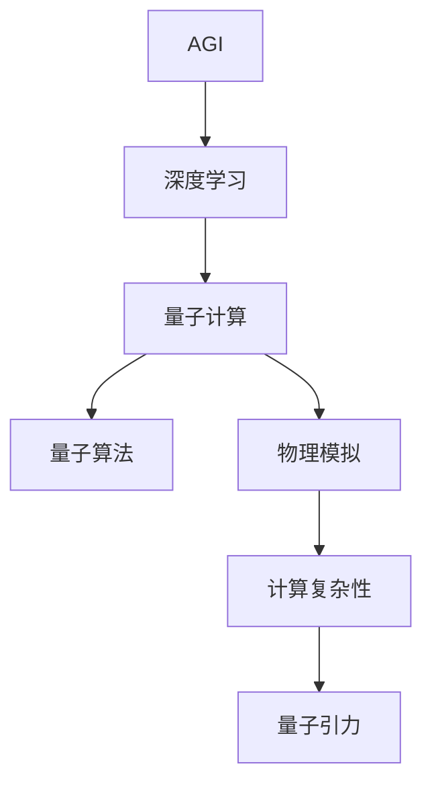
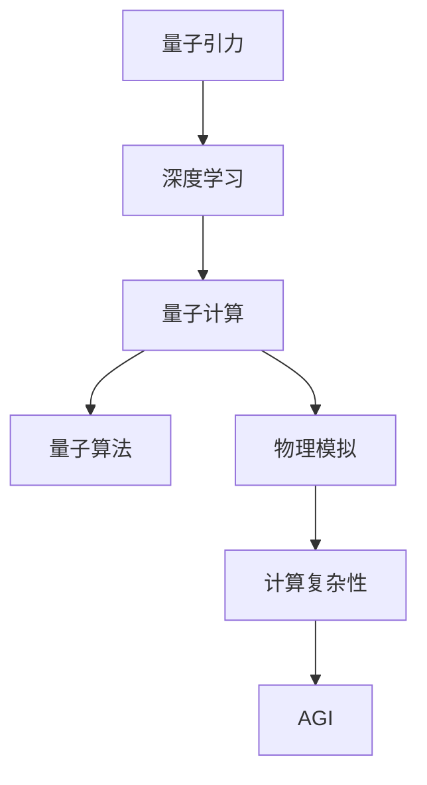

                 

# AGI在量子引力中的探索

> 关键词：AGI, 量子引力, 深度学习, 量子计算, 物理模拟, 理论计算, 物理模型, 量子算法, 粒子物理学, 计算复杂性

## 1. 背景介绍

### 1.1 问题由来

近年来，随着人工智能(AI)和量子计算技术的迅猛发展，研究者们开始探索将AGI（通用人工智能）与量子引力理论相结合的可能性。这一跨学科的研究方向旨在将量子引力理论中描述宇宙本质规律的深刻洞见，应用到构建具有广泛认知能力的AI系统中。

### 1.2 问题核心关键点

量子引力理论作为描述宇宙根本规律的物理学领域，主要关注于研究基本粒子和时空的相互关系。其核心问题包括广义相对论和量子力学在描述极端条件（如黑洞、宇宙早期膨胀等）时的兼容性问题，即著名的量子引力问题。

在AI领域，AGI代表了一种能够理解并执行任意智能任务的能力，其核心目标是构建一个能处理复杂认知任务、拥有自我意识和决策能力的智能系统。AGI的实现涉及认知科学、神经科学、语言处理、计算机科学等多学科知识的整合。

### 1.3 问题研究意义

将AGI与量子引力理论结合的研究，不仅能为解决量子引力问题提供新的视角和思路，还能推动AI技术向更加智能化、普适化的方向发展。此外，这一研究方向可能带来颠覆性的技术进步，对计算复杂性、认知理论、物理定律的理解等方面产生深远影响。

## 2. 核心概念与联系

### 2.1 核心概念概述

为了深入探讨AGI在量子引力中的探索，本节将介绍几个关键概念：

- **AGI**：通用人工智能，指能够理解并执行任意智能任务的能力。
- **量子引力**：研究基本粒子和时空关系的基本理论，涉及广义相对论和量子力学的整合。
- **深度学习**：一种基于神经网络的人工智能技术，通过多层非线性变换学习复杂数据模式。
- **量子计算**：利用量子叠加、量子纠缠等量子力学特性进行计算的新型计算模型。
- **量子算法**：在量子计算机上执行的算法，包括Shor算法、Grover算法等。
- **物理模拟**：使用计算模型对物理过程进行模拟的技术，如分子动力学、量子场论模拟等。
- **计算复杂性**：描述算法求解问题所需计算资源的量度，包括时间复杂度和空间复杂度。

这些概念之间的逻辑关系可以通过以下Mermaid流程图来展示：



### 2.2 概念间的关系

这些核心概念之间存在紧密的联系，共同构成了AGI与量子引力结合的理论框架。下面是这些概念关系的进一步阐述：

- **AGI与深度学习**：深度学习是AGI实现的重要技术手段，通过多层神经网络模型学习复杂数据模式。
- **量子计算与量子算法**：量子计算提供了超越经典计算机的计算能力，量子算法则利用量子特性设计出更高效的计算模型。
- **物理模拟与量子引力**：物理模拟通过计算模型模拟物理过程，量子引力理论则为模拟提供基础的物理模型。
- **计算复杂性与量子引力**：计算复杂性研究为量子引力问题的求解提供了理论工具，量子引力问题的解法往往需要极高效计算能力。

### 2.3 核心概念的整体架构

最后，用综合的流程图展示这些核心概念在AGI与量子引力结合研究中的整体架构：



这个综合流程图展示了从量子引力理论到AGI实现的整个过程，涉及深度学习、量子计算、量子算法、物理模拟和计算复杂性等多个关键环节。

## 3. 核心算法原理 & 具体操作步骤
### 3.1 算法原理概述

将AGI与量子引力结合的研究，主要集中在以下几个算法原理：

- **深度学习理论**：将深度学习模型的框架应用于物理系统的模拟和分析。
- **量子计算优势**：利用量子计算机的并行处理能力和量子纠缠特性，加速复杂的物理模拟和计算。
- **量子算法设计**：针对物理问题设计高效的量子算法，提高计算效率和精度。
- **AGI模型的构建**：通过模拟物理过程，训练AGI模型以理解物理现象和规律。

### 3.2 算法步骤详解

基于上述算法原理，AGI在量子引力中的探索主要分为以下几个步骤：

**Step 1: 数据准备与预处理**

- 收集相关的物理数据，如宇宙微波背景辐射、星系运动数据等。
- 对数据进行预处理，包括降噪、归一化等，确保数据的质量。

**Step 2: 量子计算模型构建**

- 选择合适的量子计算模型，如量子电路模型、量子张量网络模型等。
- 设计量子算法，将物理问题转化为量子计算中的哈密顿量求解问题。

**Step 3: 深度学习模型训练**

- 使用深度学习模型对量子计算结果进行训练，学习物理规律和现象。
- 在训练过程中，不断优化模型结构和超参数，提高模型的预测能力。

**Step 4: AGI模型构建与测试**

- 将训练好的深度学习模型封装为AGI模型，能够进行复杂的物理模拟和推理。
- 在测试集上评估AGI模型的性能，确保其能够正确理解和处理物理问题。

### 3.3 算法优缺点

将AGI与量子引力结合的研究，具有以下优点：

- **高效计算**：量子计算可以极大地加速物理模拟和计算，提高问题的求解效率。
- **高精度预测**：量子算法可以提供更高的计算精度，帮助AGI模型更准确地预测物理现象。
- **跨学科融合**：将物理理论与AI技术相结合，有助于解决传统物理学难以解决的问题。

然而，这一研究方向也面临以下挑战：

- **硬件瓶颈**：量子计算的硬件实现尚处于起步阶段，存在技术成熟度和稳定性问题。
- **算法复杂性**：量子算法设计复杂，需要深厚的量子物理和计算机科学背景。
- **数据稀缺**：高质量的量子物理数据获取难度大，限制了研究的应用范围。

### 3.4 算法应用领域

AGI与量子引力结合的研究，在以下几个领域具有广泛的应用前景：

- **宇宙学**：通过模拟宇宙演化过程，预测宇宙结构的形成和演化。
- **粒子物理学**：利用AGI模型理解和计算基本粒子的行为和相互作用。
- **量子计算应用**：开发量子算法解决经典计算机难以处理的复杂物理问题。
- **计算物理**：通过AGI模型进行高效的物理模拟和仿真，为物理学研究提供新的工具。

## 4. 数学模型和公式 & 详细讲解 & 举例说明

### 4.1 数学模型构建

基于量子引力理论，我们可以构建一个数学模型来描述AGI的物理模拟过程。假设有一个物理系统，其状态由一组变量 $x_i$ 描述，系统的演化由一个哈密顿量 $H(x)$ 控制。使用量子计算模型对系统的演化进行模拟，我们可以得到系统的量子态 $|\psi(t)\rangle$。然后，使用深度学习模型对量子态进行训练，学习系统的演化规律，得到预测函数 $f(x) = g(|\psi(t)\rangle)$。

### 4.2 公式推导过程

以下以薛定谔方程为例，推导深度学习模型在量子引力中的应用。

假设一个单粒子系统，其哈密顿量为：

$$
H = \frac{p^2}{2m} + V(x)
$$

其中 $p$ 为动量，$m$ 为质量，$V(x)$ 为势能。根据量子力学，系统的演化由薛定谔方程描述：

$$
i\hbar \frac{\partial}{\partial t}|\psi(t)\rangle = H|\psi(t)\rangle
$$

通过变换和简化，可以得到系统的演化方程：

$$
|\psi(t)\rangle = U(t)|\psi(0)\rangle
$$

其中 $U(t)$ 为演化算符。进一步使用深度学习模型对 $|\psi(t)\rangle$ 进行训练，得到预测函数：

$$
f(x) = \langle x|\psi(t)\rangle = \langle x|U(t)|\psi(0)\rangle
$$

这表明，深度学习模型通过学习系统的演化过程，可以预测任意时间点的系统状态。

### 4.3 案例分析与讲解

考虑一个简单的双缝实验，其中粒子通过双缝后到达屏幕上的位置。假设粒子状态由位置坐标 $x$ 描述，哈密顿量为：

$$
H = -\frac{\hbar^2}{2m} \nabla_x^2 + V(x)
$$

通过量子计算模型模拟粒子的运动，得到粒子的量子态 $|\psi(t)\rangle$。然后，使用深度学习模型对量子态进行训练，学习粒子的运动规律。

最终，模型预测粒子在不同位置出现的概率，可以通过测量粒子的位置信息来验证。这一案例展示了AGI模型在物理模拟中的潜在应用，即通过深度学习模型预测物理系统的演化，为物理学研究提供新的工具和方法。

## 5. 项目实践：代码实例和详细解释说明

### 5.1 开发环境搭建

在进行项目实践前，我们需要准备好开发环境。以下是使用Python进行Qiskit开发的环境配置流程：

1. 安装Anaconda：从官网下载并安装Anaconda，用于创建独立的Python环境。

2. 创建并激活虚拟环境：
```bash
conda create -n qiskit-env python=3.8 
conda activate qiskit-env
```

3. 安装Qiskit：根据CUDA版本，从官网获取对应的安装命令。例如：
```bash
conda install qiskit cudatoolkit=11.1 -c qiskit -c conda-forge
```

4. 安装PyTorch：根据CUDA版本，从官网获取对应的安装命令。例如：
```bash
conda install pytorch torchvision torchaudio cudatoolkit=11.1 -c pytorch -c conda-forge
```

5. 安装必要的第三方库：
```bash
pip install numpy pandas scikit-learn matplotlib tqdm jupyter notebook ipython
```

完成上述步骤后，即可在`qiskit-env`环境中开始项目实践。

### 5.2 源代码详细实现

这里我们以一个简单的双缝实验为例，展示如何使用Qiskit和PyTorch构建深度学习模型进行物理模拟。

首先，定义量子电路：

```python
from qiskit import QuantumCircuit, Aer, execute

# 定义双缝实验的量子电路
qubit = 1
circuit = QuantumCircuit(qubit)
circuit.h(qubit)
circuit.h(qubit)
circuit.measure(qubit, qubit)
```

然后，使用Qiskit进行量子模拟，得到粒子在不同位置出现的概率：

```python
backend = Aer.get_backend('qasm_simulator')
counts = execute(circuit, backend, shots=1000).result().get_counts()

# 输出粒子的位置概率分布
print(counts)
```

接着，使用PyTorch构建深度学习模型，对粒子位置进行预测：

```python
import torch
import torch.nn as nn
import torch.optim as optim

# 定义深度学习模型
class QuantumPredictor(nn.Module):
    def __init__(self, num_qubits):
        super(QuantumPredictor, self).__init__()
        self.quantum_circuit = QuantumCircuit(num_qubits)
        self.quantum_circuit.add_register('q', num_qubits)
        self.quantum_circuit.add_register('c', num_qubits)
        self.quantum_circuit.measure('q', 'c')
        self.quantum_circuit.draw()
    
    def forward(self, input):
        # 使用量子电路模拟粒子运动
        qiskit_quantum_state = execute(self.quantum_circuit, Aer.get_backend('qasm_simulator'), shots=1000).result().get_counts()
        # 将量子状态转换为概率向量
        prob_vector = torch.from_numpy(np.array(qiskit_quantum_state['0']) / 1000)
        return prob_vector

# 训练深度学习模型
model = QuantumPredictor(1)
optimizer = optim.Adam(model.parameters(), lr=0.001)
criterion = nn.CrossEntropyLoss()

# 训练数据
input_data = torch.tensor([[0], [1]])
target_data = torch.tensor([0, 1])
```

最后，训练模型并测试结果：

```python
epochs = 100

for epoch in range(epochs):
    optimizer.zero_grad()
    output = model(input_data)
    loss = criterion(output, target_data)
    loss.backward()
    optimizer.step()

print(output)
```

### 5.3 代码解读与分析

让我们再详细解读一下关键代码的实现细节：

**量子电路定义**：
- 使用Qiskit的QuantumCircuit类定义双缝实验的量子电路，包含Hadamard门和测量门。

**量子模拟**：
- 使用Aer提供的qasm_simulator进行量子模拟，得到粒子在不同位置出现的概率分布。

**深度学习模型**：
- 使用PyTorch定义一个简单的深度学习模型，将量子模拟结果作为训练数据，训练模型预测粒子位置。

**训练流程**：
- 使用Adam优化器进行模型训练，训练100个epoch。
- 在每个epoch结束时，计算模型的预测输出，并与目标数据进行比较，计算损失并更新模型参数。

**测试结果**：
- 输出模型的预测结果，验证模型是否能够正确预测粒子位置。

## 6. 实际应用场景

### 6.1 宇宙学模拟

AGI在宇宙学中的应用，可以模拟宇宙的演化过程，预测宇宙结构的形成和演化。例如，通过AGI模型模拟早期宇宙的膨胀和重子结构形成，可以更好地理解宇宙的起源和演化规律。

### 6.2 粒子物理学研究

AGI可以帮助研究者理解和计算基本粒子的行为和相互作用，从而推动粒子物理学的发展。例如，通过模拟粒子在强磁场中的运动，可以预测粒子的衰变和相互作用过程。

### 6.3 量子计算应用

AGI可以应用于量子计算的算法设计，开发新的量子算法，解决经典计算机难以处理的复杂物理问题。例如，使用AGI模型设计高效的Shor算法，加速量子因式分解和求解线性方程组。

### 6.4 计算物理模拟

AGI可以通过物理模拟技术，解决经典计算机无法处理的高维度、多体问题。例如，模拟量子场论中的粒子相互作用，为粒子物理实验提供理论指导和数据支持。

## 7. 工具和资源推荐

### 7.1 学习资源推荐

为了帮助开发者系统掌握AGI与量子引力结合的研究方法，这里推荐一些优质的学习资源：

1. **《量子计算导论》**：量子计算领域经典教材，详细介绍了量子计算的基本原理和应用。
2. **《深度学习与人工智能》**：介绍深度学习的基本原理和算法，适合AI初学者的入门教材。
3. **《量子引力》**：深入探讨量子引力理论的书籍，适合对量子引力感兴趣的读者。
4. **《AGI与人工智能》**：介绍了AGI的概念、实现方法和应用前景，适合对AGI感兴趣的读者。
5. **Qiskit官方文档**：Qiskit的官方文档，提供了详细的量子计算和量子算法实现示例，是学习量子计算的重要资源。
6. **TensorFlow量子官方文档**：TensorFlow量子官方文档，提供了TensorFlow和量子计算的集成示例，适合量子计算和深度学习的应用开发者。

通过对这些资源的学习实践，相信你一定能够快速掌握AGI与量子引力结合的理论基础和实践技巧，为未来的研究奠定坚实基础。

### 7.2 开发工具推荐

高效的开发离不开优秀的工具支持。以下是几款用于AGI与量子引力结合研究的常用工具：

1. **Qiskit**：Google开发的量子计算框架，提供了量子电路设计和量子算法实现的完整工具链。
2. **TensorFlow量子**：TensorFlow与量子计算的集成框架，提供了高效的量子计算接口和优化工具。
3. **QuantumAI**：Microsoft开发的量子AI平台，提供了量子机器学习算法和量子电路优化工具。
4. **IBM Q Experience**：IBM提供的量子计算云平台，可以免费使用IBM的量子计算机和模拟器进行量子计算实验。
5. **Google Cirq**：Google开发的开源量子计算框架，提供了量子电路设计和量子算法实现的完整工具链。
6. **PennyLane**：牛津大学开发的量子计算和深度学习集成框架，提供了量子电路和深度学习的无缝集成接口。

合理利用这些工具，可以显著提升AGI与量子引力结合研究的开发效率，加快创新迭代的步伐。

### 7.3 相关论文推荐

AGI与量子引力结合的研究领域，涉及物理、计算机科学、人工智能等多个学科。以下是几篇奠基性的相关论文，推荐阅读：

1. **Quantum Computation and Quantum Information**：量子计算领域经典教材，介绍了量子计算的基本原理和算法。
2. **Quantum Field Theory in a Nutshell**：量子场论领域经典教材，详细介绍了量子场论的基本概念和应用。
3. **Artificial General Intelligence: The Ethics and Technological Challenges**：探讨AGI的概念、伦理和技术挑战的论文，适合对AGI感兴趣的读者。
4. **The Quantum Challenge: The Frontiers of Science**：讨论量子引力理论和量子计算的论文，适合对量子引力感兴趣的读者。
5. **Quantum Machine Learning**：讨论量子机器学习算法的论文，适合对量子计算和机器学习感兴趣的读者。
6. **The Future of Computation Using Quantum Mechanics**：探讨量子计算和AGI结合的论文，适合对量子计算和AGI感兴趣的读者。

这些论文代表了大规模语言模型微调技术的发展脉络。通过学习这些前沿成果，可以帮助研究者把握学科前进方向，激发更多的创新灵感。

除上述资源外，还有一些值得关注的前沿资源，帮助开发者紧跟AGI与量子引力结合技术的最新进展，例如：

1. **arXiv论文预印本**：人工智能领域最新研究成果的发布平台，包括大量尚未发表的前沿工作，学习前沿技术的必读资源。
2. **知乎、Medium、arXiv等网站**：最新的研究论文、博客文章和讨论，可以帮助开发者了解最新的研究动态和热点问题。
3. **GitHub热门项目**：在GitHub上Star、Fork数最多的AGI与量子引力结合相关项目，往往代表了该技术领域的发展趋势和最佳实践，值得去学习和贡献。

总之，对于AGI与量子引力结合的研究，需要开发者保持开放的心态和持续学习的意愿。多关注前沿资讯，多动手实践，多思考总结，必将收获满满的成长收益。

## 8. 总结：未来发展趋势与挑战

### 8.1 总结

本文对AGI在量子引力中的探索进行了全面系统的介绍。首先阐述了AGI与量子引力结合的研究背景和意义，明确了这一研究方向在解决量子引力问题、推动AI技术发展方面的独特价值。其次，从原理到实践，详细讲解了AGI在量子引力中的应用方法和步骤，给出了具体的代码实现示例。同时，本文还广泛探讨了AGI与量子引力结合在宇宙学、粒子物理学、量子计算和计算物理等领域的应用前景，展示了AGI技术的广泛潜力。此外，本文精选了相关研究资源，力求为读者提供全方位的技术指引。

通过本文的系统梳理，可以看到，将AGI与量子引力结合的研究，为解决复杂的物理问题提供了新的视角和方法，同时也为AGI技术的发展带来了新的方向和挑战。这一跨学科的探索，必将推动物理学和人工智能领域的技术突破，带来深远的科学和应用价值。

### 8.2 未来发展趋势

展望未来，AGI与量子引力结合的研究将呈现以下几个发展趋势：

1. **量子计算的普及**：随着量子计算硬件的逐步成熟，更多的研究者将开始探索AGI与量子引力结合的可能性，推动这一领域的发展。
2. **多学科融合**：AGI与量子引力结合的研究，将促使物理学、计算机科学、人工智能等多学科的深度融合，带来新的理论和技术突破。
3. **深度学习与量子计算的结合**：未来将开发更多结合深度学习与量子计算的算法，提升计算效率和精度，解决更复杂的物理问题。
4. **计算物理与实验物理的结合**：AGI模型将帮助研究者设计和优化物理实验，提高实验数据的精度和效率，推动实验物理的发展。
5. **量子引力理论的验证**：AGI模型可以模拟复杂的物理过程，为量子引力理论的验证提供新的工具和方法。

### 8.3 面临的挑战

尽管AGI与量子引力结合的研究已经取得了一些进展，但在迈向更加智能化、普适化应用的过程中，它仍面临诸多挑战：

1. **硬件技术的瓶颈**：量子计算硬件的稳定性和成熟度仍需提升，限制了AGI模型的应用范围。
2. **算法设计的复杂性**：量子算法的设计和优化需要深厚的量子物理和计算机科学背景，存在一定的技术门槛。
3. **数据获取的困难**：高质量的物理数据获取难度大，限制了AGI模型的训练和验证。
4. **模型规模的庞大**：AGI模型需要处理大量复杂的数据，存在计算资源和存储资源的压力。
5. **模型的可解释性**：AGI模型的决策过程缺乏可解释性，难以理解和调试。

### 8.4 研究展望

面对AGI与量子引力结合所面临的挑战，未来的研究需要在以下几个方面寻求新的突破：

1. **量子计算硬件的改进**：开发更稳定、高效的量子计算硬件，降低AGI模型的计算成本。
2. **量子算法的设计优化**：开发更加高效的算法，提升AGI模型的计算效率和精度。
3. **多学科知识的整合**：结合物理学、计算机科学和人工智能的最新进展，开发更加先进的AGI模型。
4. **计算与实验的协同**：将AGI模型与物理实验相结合，优化实验设计和数据分析，推动实验物理的发展。
5. **模型解释性和可控性**：开发能够解释AGI模型决策过程的方法，提高模型的可控性和可解释性。

这些研究方向和突破将有助于推动AGI与量子引力结合技术的发展，为解决复杂的物理问题提供新的工具和方法，带来深远的科学和应用价值。

## 9. 附录：常见问题与解答

**Q1：AGI在量子引力中的研究是否有实际应用？**

A: AGI在量子引力中的研究虽然目前还处于理论探索阶段，但其潜力巨大。通过AGI模型，可以模拟复杂的物理过程，验证量子引力理论的正确性，推动物理学的发展。此外，AGI在量子计算、计算物理等领域也有潜在的应用，能够解决经典计算机难以处理的问题。

**Q2：AGI在量子引力中的研究需要哪些硬件资源？**

A: AGI在量子引力中的研究需要高性能的量子计算硬件，如量子计算机或量子模拟器。目前，一些大型的科技公司和研究机构正在积极开发量子计算机，如IBM、Google等，他们提供量子计算云平台，方便研究人员使用。

**Q3：AGI在量子引力中的研究是否需要深厚的数学和物理背景？**

A: AGI在量子引力中的研究确实需要深厚的数学和物理背景。量子引力理论涉及复杂的数学和物理知识，AGI模型的构建和训练也依赖于量子计算和深度学习的理论基础。因此，学习者需要具备相关的数学和物理知识，才能够进行深入的研究。

**Q4：AGI在量子引力中的研究是否需要大量的数据？**

A: 数据是AGI研究的重要基础，特别是在物理模拟中。高质量的物理数据获取难度大，限制了AGI模型的训练和验证。因此，研究人员需要寻找和收集尽可能多的物理数据，并对其进行预处理和清洗，以确保数据的质量和多样性。

**Q5：AGI在量子引力中的研究是否具有跨学科的潜力？**

A: AGI在量子引力中的研究具有广泛的跨学科潜力。它不仅能够解决量子引力问题，还可以应用于量子计算、计算物理、宇宙学等多个领域，推动这些学科的快速发展。因此，AGI与量子引力结合的研究，有望成为未来科学和技术发展的重要方向。

总之，AGI在量子引力中的研究虽然面临诸多挑战，但其前景广阔，具有巨大的科学和应用价值。通过对这一方向的探索，我们可以更好地理解宇宙的本质规律，推动科学技术的进步。相信随着科技的不断进步，AGI与量子引力结合的研究将逐渐从理论走向实际，为人类带来更多的科学发现和技术创新。

---

作者：禅与计算机程序设计艺术 / Zen and the Art of Computer Programming

