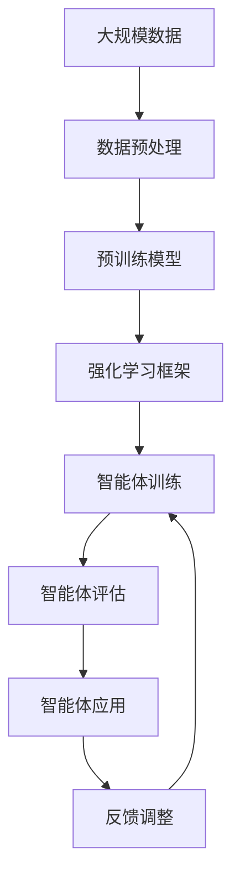

                 

## 1. 背景介绍

### 1.1 问题由来

在人工智能(AI)的发展历程中，智能体(Agent)是一类重要的组成部分。智能体可以被定义为一个能够感知环境、自主决策并执行行动的实体。智能体在自主机器人、游戏AI、自动驾驶、金融交易等领域中扮演着越来越重要的角色，成为了推动人工智能技术发展的核心驱动力之一。

近年来，深度学习和大规模数据驱动的AI技术飞速发展，智能体在认知行为、社会交互、策略决策等复杂任务上取得了显著的进展。然而，智能体的设计和开发仍然面临诸多挑战，如如何处理不确定性、不完备信息、复杂交互等。智能体设计的关键在于如何构建一个能够自主学习、高效决策并适应环境的系统。

### 1.2 问题核心关键点

智能体设计的核心在于构建一个能够自主学习、高效决策并适应环境的系统。当前，主流智能体设计范式包括强化学习、模仿学习、迁移学习等。其中，强化学习是最具代表性的一种范式，通过奖励机制驱动智能体在复杂环境中进行自主学习和优化。

强化学习的三要素为：状态(state)、动作(action)和奖励(reward)。智能体在每个时间步通过感知当前状态，选择并执行一个动作，根据环境反馈获得奖励。智能体通过不断尝试和学习，逐步优化策略，提升决策能力。

强化学习的目标是在策略优化过程中，最大化期望累计奖励。即，通过一系列的策略迭代，使得智能体在长期内获得最大的总奖励。常见的强化学习算法包括Q-learning、SARSA、Deep Q-learning等。

### 1.3 问题研究意义

研究智能体设计的意义在于，它为构建具有自主学习能力、高效决策能力和适应能力的AI系统提供了重要方法。智能体在复杂环境中的应用，能够大幅提升系统效率、安全性和可靠性，推动相关行业向智能化、自动化方向发展。

智能体在自主机器人领域的应用，能够减少人工干预，提升物流、制造等领域的自动化水平。在自动驾驶领域，智能体能够自主感知和决策，保证行车安全和效率。在金融交易中，智能体可以通过学习市场行为和策略，进行智能决策，提升投资收益。

智能体技术的发展，不仅能够带来经济效益，还能够提升社会管理效率，如在公共安全、灾害预测、医疗健康等领域提供更多智能化解决方案，助力社会治理和公共服务水平提升。

## 2. 核心概念与联系

### 2.1 核心概念概述

为了更好地理解智能体的设计和优化，本节将介绍几个密切相关的核心概念：

- **智能体(Agent)**：能够感知环境、自主决策并执行行动的实体。智能体可以是物理实体，也可以是一个虚拟实体，如AI聊天机器人、自动驾驶汽车等。

- **状态(State)**：智能体在某一时刻的感知信息集合。状态可以包括位置、速度、角度等环境信息，以及决策历史、奖励历史等内部状态。

- **动作(Action)**：智能体在当前状态下可以选择的执行操作。动作可以是连续的动作，也可以是离散的动作，如前进、左转、右转等。

- **奖励(Reward)**：智能体在执行某个动作后获得的反馈值。奖励可以是正面的、负面的或中性的，用于评估智能体行为的好坏。

- **策略(Policy)**：智能体在每个状态下选择动作的规则或算法。策略可以是一个确定的策略，也可以是一个随机策略，如Q-learning中使用的策略。

- **强化学习(Reinforcement Learning, RL)**：通过奖励机制驱动智能体在复杂环境中进行自主学习和优化。智能体通过不断尝试和学习，逐步优化策略，提升决策能力。

- **转移概率(Transition Probability)**：描述从当前状态到下一个状态的概率分布。转移概率可以是一个确定的值，也可以是一个概率分布函数。

- **贝尔曼方程(Bellman Equation)**：用于描述智能体在每个状态下期望累计奖励的动态方程。贝尔曼方程是强化学习的核心数学工具。

这些核心概念之间的逻辑关系可以通过以下Mermaid流程图来展示：

```mermaid
graph TB
    A[智能体] --> B[状态(State)]
    A --> C[动作(Action)]
    A --> D[奖励(Reward)]
    A --> E[策略(Policy)]
    B --> F[转移概率(Transition Probability)]
    E --> F
    F --> G[贝尔曼方程(Bellman Equation)]
```

这个流程图展示了这个智能体设计框架中的关键组件及其之间的关系：

1. 智能体感知当前状态，根据策略选择动作。
2. 根据动作执行后，环境给出奖励。
3. 根据转移概率更新下一个状态。
4. 智能体通过贝尔曼方程计算期望累计奖励。
5. 重复上述过程，直到学习收敛。

### 2.2 概念间的关系

这些核心概念之间存在着紧密的联系，形成了智能体学习的完整生态系统。下面我通过几个Mermaid流程图来展示这些概念之间的关系。

#### 2.2.1 智能体学习的基本流程

```mermaid
graph LR
    A[智能体] --> B[状态(State)]
    A --> C[动作(Action)]
    B --> D[转移概率(Transition Probability)]
    C --> E[奖励(Reward)]
    A --> F[策略(Policy)]
    A --> G[贝尔曼方程(Bellman Equation)]
    F --> H[策略更新]
    H --> A
```

这个流程图展示了智能体学习的基本流程：

1. 智能体感知当前状态，根据策略选择动作。
2. 根据动作执行后，环境给出奖励。
3. 根据转移概率更新下一个状态。
4. 通过贝尔曼方程计算期望累计奖励。
5. 根据计算出的奖励，更新策略。
6. 重复上述过程，直到策略收敛。

#### 2.2.2 强化学习的数学模型

```mermaid
graph LR
    A[智能体] --> B[状态(State)]
    A --> C[动作(Action)]
    B --> D[转移概率(Transition Probability)]
    C --> E[奖励(Reward)]
    A --> F[策略(Policy)]
    F --> G[贝尔曼方程(Bellman Equation)]
```

这个流程图展示了强化学习的数学模型：

1. 智能体在状态集合中选择动作。
2. 执行动作后，环境给出奖励。
3. 根据转移概率更新下一个状态。
4. 通过贝尔曼方程计算期望累计奖励。
5. 根据期望累计奖励，更新策略。

#### 2.2.3 强化学习与决策树

```mermaid
graph LR
    A[智能体] --> B[状态(State)]
    A --> C[动作(Action)]
    B --> D[转移概率(Transition Probability)]
    C --> E[奖励(Reward)]
    A --> F[策略(Policy)]
    F --> G[决策树]
    G --> H[策略优化]
```

这个流程图展示了强化学习与决策树的关系：

1. 智能体在状态集合中选择动作。
2. 执行动作后，环境给出奖励。
3. 根据转移概率更新下一个状态。
4. 通过贝尔曼方程计算期望累计奖励。
5. 根据期望累计奖励，更新决策树。
6. 通过决策树进行策略优化。

### 2.3 核心概念的整体架构

最后，我们用一个综合的流程图来展示这些核心概念在大规模智能体学习过程中的整体架构：



这个综合流程图展示了从数据预处理到智能体应用的完整过程。智能体在预训练模型的基础上，通过强化学习框架进行训练，并根据评估结果进行调整，不断优化性能。最终，智能体在实际应用中，通过反馈机制进行动态调整，保持最优决策能力。通过这些流程图，我们可以更清晰地理解智能体学习过程中各个组件的关系和作用，为后续深入讨论具体的学习方法和技术奠定基础。

## 3. 核心算法原理 & 具体操作步骤
### 3.1 算法原理概述

强化学习算法通过奖励机制驱动智能体在复杂环境中进行自主学习和优化。其核心思想是：智能体通过感知环境、执行动作并接收奖励，逐步学习最优的策略，最大化期望累计奖励。

强化学习的三要素为状态(state)、动作(action)和奖励(reward)。智能体在每个时间步通过感知当前状态，选择并执行一个动作，根据环境反馈获得奖励。智能体通过不断尝试和学习，逐步优化策略，提升决策能力。

常见的强化学习算法包括Q-learning、SARSA、Deep Q-learning等。这些算法的主要区别在于如何更新Q值或策略，以及如何处理连续动作和状态空间。

### 3.2 算法步骤详解

强化学习的核心在于策略优化。以下我将详细介绍Q-learning算法的基本步骤：

1. **初始化**：设置智能体的初始状态$s_0$，初始策略$\pi$，设置学习率$\alpha$和折扣因子$\gamma$。

2. **状态感知与动作选择**：智能体在状态$s_t$下，根据当前策略$\pi$选择动作$a_t$。

3. **环境响应与奖励获取**：环境根据动作$a_t$响应，并将智能体转移到下一个状态$s_{t+1}$。智能体根据动作$a_t$获得奖励$r_{t+1}$。

4. **策略更新**：根据贝尔曼方程更新Q值或策略。Q-learning中，Q值更新公式为：
   $$
   Q(s_t,a_t) = Q(s_t,a_t) + \alpha[r_{t+1} + \gamma\max_{a_{t+1}}Q(s_{t+1},a_{t+1}) - Q(s_t,a_t)]
   $$
   其中$\alpha$为学习率，$\gamma$为折扣因子。

5. **迭代执行**：重复步骤2-4，直到策略收敛或达到预设迭代次数。

6. **策略评估**：通过评估策略在测试集上的表现，判断智能体的性能。

### 3.3 算法优缺点

强化学习的优点在于其能够处理复杂的环境，通过自主学习和适应性强的策略优化，提升智能体的决策能力。此外，强化学习算法通常具有较好的可扩展性和鲁棒性，适用于各种类型的决策问题。

然而，强化学习的缺点也不容忽视：

1. **样本效率低**：强化学习需要大量数据进行训练，且容易陷入局部最优。因此，在大规模、高维度问题上，强化学习的训练成本较高。

2. **策略收敛慢**：强化学习算法中，策略更新通常采用梯度下降等优化方法，存在收敛速度慢、收敛不稳定的问题。

3. **探索与利用的平衡**：在智能体学习过程中，如何平衡探索新动作和利用已学到的最优动作是一个重要挑战。常用的方法包括$\epsilon$-贪心策略、Softmax策略等。

4. **环境建模困难**：强化学习依赖环境的准确建模，当环境动态变化时，模型的适应性差。

5. **复杂性高**：强化学习算法复杂，需要深入理解状态空间、动作空间、奖励机制等关键要素。

### 3.4 算法应用领域

强化学习在多个领域中得到了广泛应用，包括但不限于：

- **自主机器人**：在自动导航、避障、路径规划等方面，强化学习帮助机器人学习最优行为策略，提升自主决策能力。
- **自动驾驶**：在车辆控制、路线规划、交通信号识别等方面，强化学习帮助车辆学习复杂的决策规则，提升驾驶安全性。
- **游戏AI**：在棋类游戏、射击游戏、策略游戏等方面，强化学习帮助游戏AI学习复杂的策略，提升游戏水平。
- **金融交易**：在股票交易、期货交易、量化交易等方面，强化学习帮助算法交易系统学习市场行为，进行智能决策。
- **推荐系统**：在推荐算法中，强化学习可以帮助系统学习用户行为，提供个性化推荐。
- **医疗健康**：在医疗诊断、治疗方案优化、健康管理等方面，强化学习帮助医疗系统学习最优策略，提升治疗效果。

此外，强化学习还被应用于智能制造、智慧城市、物流管理、社交网络等众多领域，推动了各行业的智能化发展。

## 4. 数学模型和公式 & 详细讲解 & 举例说明

### 4.1 数学模型构建

强化学习的核心数学模型是贝尔曼方程(Bellman Equation)，用于描述智能体在每个状态下期望累计奖励的动态方程。贝尔曼方程的形式如下：

$$
V(s) = \max_a [r(s,a) + \gamma V(s')]
$$

其中，$V(s)$为状态$s$的期望累计奖励，$r(s,a)$为在状态$s$下执行动作$a$的即时奖励，$s'$为执行动作$a$后的下一个状态，$\gamma$为折扣因子。

对于Q-learning算法，其核心Q值更新公式如下：

$$
Q(s_t,a_t) = Q(s_t,a_t) + \alpha[r_{t+1} + \gamma\max_{a_{t+1}}Q(s_{t+1},a_{t+1}) - Q(s_t,a_t)]
$$

其中，$\alpha$为学习率，$Q(s_t,a_t)$为在状态$s_t$下执行动作$a_t$的Q值，$r_{t+1}$为在下一个状态$s_{t+1}$下的即时奖励，$\gamma$为折扣因子。

### 4.2 公式推导过程

以下我将以Q-learning算法为例，推导其核心公式。

在Q-learning算法中，智能体的策略是通过Q值函数来表达的。Q值函数$Q(s,a)$表示在状态$s$下执行动作$a$的期望累计奖励。

对于Q-learning算法，其Q值更新公式为：

$$
Q(s_t,a_t) = Q(s_t,a_t) + \alpha[r_{t+1} + \gamma\max_{a_{t+1}}Q(s_{t+1},a_{t+1}) - Q(s_t,a_t)]
$$

将公式展开，得：

$$
Q(s_t,a_t) = Q(s_t,a_t) + \alpha r_{t+1} + \alpha \gamma\max_{a_{t+1}}Q(s_{t+1},a_{t+1})
$$

进一步化简，得：

$$
Q(s_t,a_t) = \alpha r_{t+1} + \alpha \gamma\max_{a_{t+1}}Q(s_{t+1},a_{t+1})
$$

上式中，$\alpha r_{t+1}$表示当前状态下执行动作的即时奖励，$\alpha \gamma\max_{a_{t+1}}Q(s_{t+1},a_{t+1})$表示下一个状态下的期望累计奖励。

通过递归展开贝尔曼方程，可以得到Q值函数的递推公式：

$$
Q(s) = \max_a [r + \gamma Q(s')]
$$

其中，$r$为即时奖励，$s'$为下一个状态。

通过上述推导，我们可以理解Q-learning算法的基本原理，即通过即时奖励和期望累计奖励的递推，更新Q值函数，实现智能体的自主学习。

### 4.3 案例分析与讲解

以自动驾驶为例，智能体通过传感器感知环境状态，选择并执行驾驶动作，如加速、刹车、转向等。每个动作执行后，环境给出奖励或惩罚，智能体根据奖励调整策略，逐步学习最优的驾驶行为。

在自动驾驶中，智能体需要处理复杂的环境动态，如车辆、行人、交通信号等。智能体通过强化学习算法，学习如何在不同情况下选择最优动作，以确保行车安全和效率。

例如，在交叉路口，智能体需要根据红绿灯信号、行人和其他车辆的位置，选择最优的加速和转向策略。通过强化学习算法，智能体能够逐步学习到最优的驾驶行为，避免交通事故，提高行驶效率。

## 5. 项目实践：代码实例和详细解释说明

### 5.1 开发环境搭建

在进行强化学习实践前，我们需要准备好开发环境。以下是使用Python进行TensorFlow开发的环境配置流程：

1. 安装Anaconda：从官网下载并安装Anaconda，用于创建独立的Python环境。

2. 创建并激活虚拟环境：
```bash
conda create -n tf-env python=3.8 
conda activate tf-env
```

3. 安装TensorFlow：根据CUDA版本，从官网获取对应的安装命令。例如：
```bash
conda install tensorflow-gpu==2.6 -c tf -c conda-forge
```

4. 安装其他必要的库：
```bash
pip install gym pandas numpy scikit-learn matplotlib tqdm jupyter notebook ipython
```

完成上述步骤后，即可在`tf-env`环境中开始强化学习实践。

### 5.2 源代码详细实现

这里我们以简单的Q-learning算法为例，对强化学习进行代码实现。

```python
import tensorflow as tf
import gym
import numpy as np

# 定义Q-learning函数
def q_learning(env, num_episodes=1000, alpha=0.1, gamma=0.9, epsilon=0.1):
    q_values = tf.Variable(tf.zeros([env.observation_space.n, env.action_space.n]), dtype=tf.float32)

    for episode in range(num_episodes):
        state = env.reset()
        done = False

        while not done:
            # 探索-利用平衡
            if np.random.rand() < epsilon:
                action = env.action_space.sample()
            else:
                action = np.argmax(q_values.numpy()[state])

            next_state, reward, done, _ = env.step(action)
            q_values.assign_add(alpha * (reward + gamma * np.max(q_values.numpy()[next_state]) - q_values[state][action]))

            state = next_state

    return q_values

# 定义环境
env = gym.make('CartPole-v0')

# 执行Q-learning算法
q_values = q_learning(env)

# 测试模型
state = env.reset()
done = False
while not done:
    action = np.argmax(q_values.numpy()[state])
    next_state, reward, done, _ = env.step(action)
    state = next_state
```

### 5.3 代码解读与分析

让我们再详细解读一下关键代码的实现细节：

**Q-learning函数**：
- `q_learning`函数接受环境、训练轮次、学习率、折扣因子和探索概率作为输入。
- `q_values`为Q值表，初始化为全0数组。
- 在每个训练轮次中，智能体从环境开始，通过探索-利用平衡选择动作。
- 执行动作后，更新Q值表，直到训练轮次结束。

**环境定义**：
- 使用`gym.make`方法创建了一个简单的CartPole-v0环境，用于测试Q-learning算法。
- CartPole-v0环境是一个经典的控制问题，智能体需要控制一个在绳索上的小车，使其在摆动后重新平衡。

**Q-learning算法测试**：
- 通过`q_learning`函数训练得到的Q值表。
- 在测试状态下，通过Q值表选择最优动作，不断更新状态和奖励，直到环境结束。

**测试结果展示**：
- 测试结果会显示智能体是否成功控制小车平衡，并通过可视化展示每步的动作和奖励。

可以看到，通过简单的Q-learning算法，我们能够对强化学习的基本原理进行实验验证，并验证模型在实际环境中的表现。

当然，工业级的系统实现还需考虑更多因素，如模型的保存和部署、超参数的自动搜索、更灵活的探索策略等。但核心的强化学习算法基本与此类似。

## 6. 实际应用场景

### 6.1 智能机器人

在智能机器人领域，强化学习算法帮助机器人学习自主导航、避障、路径规划等复杂任务。通过与环境交互，机器人能够逐步学习到最优的行为策略，提升自主决策能力。

例如，智能清洁机器人可以通过强化学习算法，学习最优的清扫路径，避免碰撞和重叠清扫。智能机器人也可以通过学习，识别并避开障碍物，确保行进路径的安全。

### 6.2 自动驾驶

在自动驾驶领域，强化学习算法帮助智能体学习复杂的驾驶策略，进行自主决策和控制。

智能车通过与环境交互，学习最优的加速、转向和刹车策略，提升行车安全性和效率。例如，在交叉路口，智能车可以通过强化学习算法，学习如何根据红绿灯信号、行人和其他车辆的位置，选择最优的加速和转向策略。

### 6.3 游戏AI

在游戏AI领域，强化学习算法帮助游戏AI学习复杂的策略，提升游戏水平。

例如，在AlphaGo中，强化学习算法帮助AlphaGo学习下围棋的策略，通过与环境交互，逐步学习最优的下棋路径和布局策略，最终战胜人类围棋高手。

### 6.4 金融交易

在金融交易中，强化学习算法帮助算法交易系统学习市场行为和策略，进行智能决策。

智能交易系统可以通过强化学习算法，学习市场趋势和交易规则，进行智能买卖操作，提升投资收益。例如，在股票交易中，智能交易系统可以通过强化学习算法，学习市场数据的变化规律，制定最优的交易策略。

### 6.5 推荐系统

在推荐系统中，强化学习算法帮助推荐系统学习用户行为，提供个性化推荐。

智能推荐系统可以通过强化学习算法，学习用户偏好和行为，提供个性化的商品推荐。例如，在电商平台上，智能推荐系统可以通过强化学习算法，学习用户的浏览和购买行为，推荐用户可能感兴趣的商品。

### 6.6 医疗健康

在医疗健康领域，强化学习算法帮助医疗系统学习最优的诊断和治疗策略，提升治疗效果。

智能医疗系统可以通过强化学习算法，学习病人的病情和治疗方案，提供个性化的诊疗建议。例如，在癌症治疗中，智能医疗系统可以通过强化学习算法，学习不同病人的病情和治疗效果，制定最优的治疗方案。

## 7. 工具和资源推荐

### 7.1 学习资源推荐

为了帮助开发者系统掌握强化学习的设计和优化，这里推荐一些优质的学习资源：

1. 《深度学习》系列书籍：由深度学习大师Ian Goodfellow等人撰写，系统介绍了深度学习的基本概念和算法，包括强化学习等前沿主题。

2. 《强化学习》课程：斯坦福大学开设的强化学习课程，涵盖强化学习的基本概念、算法和应用，提供Lecture视频和配套作业，适合初学者入门。

3. 《Deep Reinforcement Learning》书籍：DeepMind的研究员Shakir Mohamed等人合著，详细介绍了深度强化学习的理论基础和实践方法。

4. 《Reinforcement Learning: An Introduction》书籍：由Richard S. Sutton和Andrew G. Barto合著，是强化学习领域的经典教材，涵盖了强化学习的理论和应用。

5. OpenAI博客：OpenAI的官方博客，定期发布最新的强化学习研究进展，提供丰富的技术细节和应用案例。

通过对这些资源的学习实践，相信你一定能够快速掌握强化学习的精髓，并用于解决实际的决策问题。

### 7.2 开发工具推荐

高效的开发离不开优秀的工具支持。以下是几款用于强化学习开发的常用工具：

1. TensorFlow：由Google主导开发的开源深度学习框架，生产部署方便，适合大规模工程应用。

2. PyTorch：基于Python的开源深度学习框架，灵活动态的计算图，适合快速迭代研究。

3. OpenAI Gym：用于模拟环境，支持多种环境构建，方便进行强化学习算法测试。

4. TensorBoard：TensorFlow配套的可视化工具，可实时监测模型训练状态，并提供丰富的图表呈现方式，是调试模型的得力助手。

5. Weights & Biases：模型训练的实验跟踪工具，可以记录和可视化模型训练过程中的各项指标，方便对比和调优。

6. Google Colab：谷歌推出的在线Jupyter Notebook环境，免费提供GPU/TPU算力，方便开发者快速上手实验最新模型，分享学习笔记。

合理利用这些工具，可以显著提升强化学习任务的开发效率，加快创新迭代的步伐。

### 7.3 相关论文推荐

强化学习在多个领域中得到了广泛应用，相关的研究也日益增多。以下是几篇奠基性的相关论文，推荐阅读：

1. Deep Reinforcement Learning（DeepMind）：提出深度强化学习框架，将深度学习技术引入强化学习，提升了智能体的决策能力。

2. Q-Learning for Autonomous Vehicle Navigation（UCLA）：通过强化学习算法，提升自动驾驶汽车的导航能力和安全性能。

3. AlphaGo（DeepMind）：通过强化学习算法，实现围棋人工智能系统的突破，展示了大规模、高复杂度问题的解决潜力。

4. DeepMind's AlphaStar（DeepMind）：通过强化学习算法，在星际争霸游戏中实现AI战胜人类选手，推动游戏AI领域的发展。

5. Safety-Critical Reinforcement Learning（Oxford University）：探讨强化学习在安全关键应用中的技术挑战，提供安全性和鲁棒性的保障方案。

这些论文代表了大规模强化学习的研究方向，推动了该领域的不断发展和突破。

除上述资源外，还有一些值得关注的前沿资源，帮助开发者紧跟强化学习技术的最新进展，例如：

1. arXiv论文预印本：人工智能领域最新研究成果的发布平台，包括大量尚未发表的前沿工作，学习前沿技术的必读资源。

2. 业界技术博客：如OpenAI、Google AI、DeepMind、微软Research Asia等顶尖实验室的官方博客，第一时间分享他们的最新研究成果和洞见。

3. 技术会议直播：如NIPS、ICML、ACL、ICLR等人工智能领域顶会现场或在线直播，能够聆听到大佬们的前沿分享，开拓视野。

4. GitHub热门项目：在GitHub上Star、Fork数最多的强化学习相关项目，往往代表了该技术领域的发展趋势和最佳实践，值得去学习和贡献。

5. 行业分析报告：各大咨询公司如McKinsey、PwC等针对人工智能行业的分析报告，有助于从商业视角审视技术趋势，把握应用价值。

总之，对于强化学习的设计和优化，需要开发者保持开放的心态和持续学习的意愿。多

