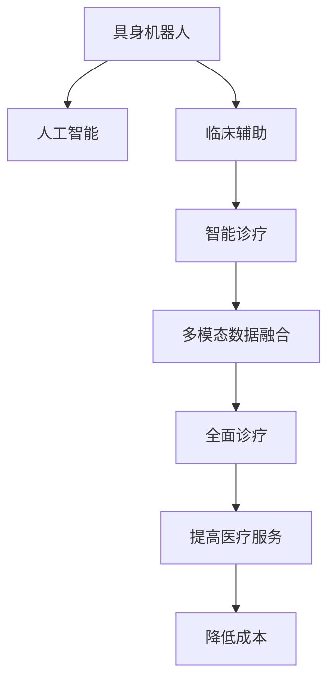

                 

# AI Agent: AI的下一个风口 具身机器人在医疗领域的应用

> 关键词：具身机器人,医疗,人工智能,临床辅助,智能诊疗,数据驱动

## 1. 背景介绍

### 1.1 问题由来

近年来，人工智能（AI）技术在医疗领域的应用日益广泛，尤其在临床辅助、智能诊疗等方面取得了显著成效。然而，现有的AI系统大多依赖于数据驱动的方法，对高质量数据的需求高，同时缺乏对人体的直接感知，限制了其在实际医疗场景中的应用。具身机器人（Body-centered Robot）作为AI与真实世界的融合体，具备在物理世界执行复杂任务的能力，能够显著增强AI系统的应用范围和效果。

### 1.2 问题核心关键点

具身机器人是指能够与人体互动、感知环境、执行任务的机器人。其在医疗领域的应用主要包括以下几个关键点：
1. **数据采集与环境感知**：具身机器人能够通过传感器采集患者数据（如生命体征、运动状态等），并通过视觉、触觉等手段感知环境变化，提升数据收集的全面性和准确性。
2. **精准操作与辅助**：具身机器人能够执行复杂的操作任务，如手术、康复训练等，辅助医生完成诊疗过程。
3. **远程协助与监控**：具身机器人可实现在线远程监控，帮助远程医疗服务的实施，特别是在偏远和资源匮乏地区。
4. **多模态数据融合**：具身机器人能够整合视觉、听觉、触觉等多模态数据，提供更全面的患者信息。

### 1.3 问题研究意义

具身机器人在医疗领域的应用，能够带来以下几方面的积极影响：
1. **提升诊疗质量**：通过精准的操作和全面的数据采集，具身机器人能够辅助医生进行更精确、高效的诊断和治疗。
2. **降低医疗成本**：具身机器人能够承担部分重复性或危险性的操作，减轻医务人员负担，降低医疗服务成本。
3. **扩大医疗覆盖**：具身机器人可在偏远和资源匮乏地区提供医疗服务，提升医疗资源的可及性。
4. **促进个性化医疗**：具身机器人能够实时采集患者数据，结合AI算法提供个性化治疗方案，提高治疗效果。
5. **推动医学研究**：具身机器人在临床试验和研究中发挥重要作用，提供可靠的实验工具和环境。

## 2. 核心概念与联系

### 2.1 核心概念概述

为更好地理解具身机器人在医疗领域的应用，本节将介绍几个关键概念及其相互联系：

- **具身机器人**：具备在物理世界执行复杂任务的机器人。主要技术包括机械设计、传感器技术、执行器控制等，能够通过触觉、视觉、听觉等多种方式与人体互动。
- **人工智能**：通过算法和数据训练的智能系统，具备学习、推理、决策等能力。
- **临床辅助**：指AI技术在医疗诊断、治疗、护理等方面的辅助应用，提升医疗服务的效率和准确性。
- **智能诊疗**：通过AI技术进行疾病诊断、治疗方案制定、药物推荐等智能化的诊疗过程，提升诊疗效果。
- **多模态数据融合**：整合视觉、触觉、听觉等多种模态数据，提供更全面的患者信息，支持复杂决策。

这些概念通过以下Mermaid流程图来展示它们之间的联系：



这个流程图展示了具身机器人通过人工智能技术，实现临床辅助和智能诊疗，最终提升全面诊疗服务质量，降低医疗成本的完整过程。

### 2.2 概念间的关系

这些核心概念之间存在着紧密的联系，形成了具身机器人在医疗领域应用的完整生态系统。

- **具身机器人的机械设计与人工智能算法**：具身机器人依赖于高精度的机械设计，能够可靠执行各种任务。而人工智能算法则在实时感知、数据分析等方面提供支持，实现复杂决策。
- **人工智能与多模态数据融合**：人工智能能够整合视觉、触觉、听觉等多种数据，提供全面的患者信息，从而支持精准诊疗。
- **临床辅助与智能诊疗**：临床辅助通过AI技术实现操作和监控，智能诊疗则通过AI技术进行诊断和治疗方案制定。
- **全面诊疗与成本降低**：通过具身机器人，临床辅助和智能诊疗能够提升全面诊疗服务质量，降低医疗成本。

这些概念共同构成了具身机器人在医疗领域应用的完整框架，为其在实际医疗场景中的应用奠定了坚实的基础。

## 3. 核心算法原理 & 具体操作步骤
### 3.1 算法原理概述

具身机器人在医疗领域的应用，本质上是将AI算法与物理世界相结合，通过具身机器人执行复杂任务的过程。其核心算法原理可以概括为以下几个方面：

1. **数据采集与环境感知**：具身机器人通过各类传感器（如激光雷达、摄像头、触觉传感器等）采集患者数据，并通过视觉、触觉、听觉等手段感知环境变化，构建多模态数据融合系统。

2. **任务规划与路径规划**：基于采集到的数据，结合AI算法进行任务规划和路径规划，指导机器人执行具体任务。

3. **实时控制与反馈**：具身机器人在执行任务时，通过实时控制和反馈机制，调整操作策略，确保任务顺利完成。

4. **学习与优化**：具身机器人通过不断的学习和优化，提升操作精度和智能化水平，适应不同的医疗场景和任务。

### 3.2 算法步骤详解

具身机器人在医疗领域的具体操作步骤如下：

1. **数据采集与预处理**：
   - 使用各类传感器采集患者数据，如生命体征、运动状态等。
   - 对采集到的数据进行预处理，包括去噪、归一化、特征提取等，确保数据质量。

2. **环境感知与场景分析**：
   - 通过视觉传感器获取环境图像，识别重要物体和区域。
   - 使用触觉传感器获取与物体或人体的接触信息，进行空间感知。
   - 通过声音传感器获取环境声音，进行听觉感知。

3. **任务规划与路径规划**：
   - 基于感知到的数据，结合AI算法进行任务规划，确定操作目标和步骤。
   - 使用路径规划算法（如A*算法、D*算法等），规划机器人从起点到终点的路径，确保任务执行的可行性和高效性。

4. **实时控制与操作执行**：
   - 使用实时控制算法（如PID控制、模型预测控制等），控制机器人执行任务。
   - 实时监测机器人状态和环境变化，根据反馈信息调整操作策略。

5. **学习与优化**：
   - 通过在线学习算法（如强化学习、迁移学习等），不断优化机器人行为和操作策略。
   - 结合专家经验进行人工干预，提高机器人的可靠性和智能化水平。

### 3.3 算法优缺点

具身机器人在医疗领域的应用具有以下优点：
1. **精准操作**：具备高精度的机械设计和先进的控制算法，能够执行复杂操作任务，如手术、康复训练等。
2. **实时反馈**：能够实时感知环境变化和患者状态，及时调整操作策略，确保任务顺利完成。
3. **多模态数据融合**：整合视觉、触觉、听觉等多种数据，提供更全面的患者信息，支持复杂决策。
4. **降低成本**：可承担部分重复性或危险性的操作，减轻医务人员负担，降低医疗服务成本。

同时，也存在以下缺点：
1. **高成本**：具身机器人的开发和维护成本较高，需要大量的资金和人力资源。
2. **技术复杂**：需要跨学科知识，包括机械设计、传感器技术、AI算法等，技术难度较大。
3. **适应性有限**：尽管具备一定的自主学习能力，但仍需人工干预和优化，适应性有限。

### 3.4 算法应用领域

具身机器人在医疗领域的应用主要包括以下几个方面：

- **手术辅助**：通过具身机器人辅助医生进行复杂手术操作，如微创手术、脑部手术等。
- **康复训练**：协助患者进行康复训练，如物理治疗、运动训练等。
- **远程医疗**：实现在线远程监控和辅助，特别是在偏远和资源匮乏地区。
- **患者护理**：协助患者进行日常生活活动，如喂食、穿衣等，提高生活质量。
- **药物管理**：通过具身机器人进行药物递送和监督，确保药物按时按量服用。

## 4. 数学模型和公式 & 详细讲解 & 举例说明

### 4.1 数学模型构建

具身机器人在医疗领域的应用，涉及到多模态数据融合、路径规划、实时控制等多个数学模型。以下将对其中几个关键模型进行详细讲解。

#### 4.1.1 多模态数据融合模型

多模态数据融合模型旨在整合视觉、触觉、听觉等多种数据，提供全面的患者信息。假设具身机器人获取了视觉图像 $I$、触觉反馈 $T$ 和听觉信号 $A$，则多模态数据融合模型的目标是通过加权融合算法，将多种数据整合为综合的特征向量 $X$：

$$
X = \alpha I + \beta T + \gamma A
$$

其中，$\alpha$、$\beta$、$\gamma$ 为融合系数，表示不同模态数据的权重。

#### 4.1.2 路径规划模型

路径规划模型主要用于确定机器人从起点到终点的最优路径。假设起点为 $S$，终点为 $E$，环境障碍物为 $O$，则路径规划模型可以通过A*算法求解：

1. 初始化开放列表和关闭列表。
2. 计算每个节点的启发式函数 $f(n)$，表示从起点到该节点的总代价。
3. 选择开放列表中代价最小的节点进行扩展。
4. 更新节点状态，添加到关闭列表中。
5. 重复步骤2-4，直到目标节点 $E$ 被加入开放列表。

### 4.2 公式推导过程

#### 4.2.1 多模态数据融合公式推导

假设具身机器人获取了视觉图像 $I$、触觉反馈 $T$ 和听觉信号 $A$，分别表示为 $I = (i_1, i_2, ..., i_n)$、$T = (t_1, t_2, ..., t_m)$ 和 $A = (a_1, a_2, ..., a_k)$。则多模态数据融合模型的目标是通过加权融合算法，将多种数据整合为综合的特征向量 $X$：

$$
X = \alpha I + \beta T + \gamma A
$$

其中，$\alpha$、$\beta$、$\gamma$ 为融合系数，表示不同模态数据的权重。融合系数的计算方法可以根据不同模态数据的特征进行选择，如信息增益、方差比等。

#### 4.2.2 A*算法路径规划公式推导

假设具身机器人从起点 $S$ 到终点 $E$ 的路径规划问题，通过A*算法求解。定义节点 $n = (x, y)$，其中 $(x, y)$ 表示机器人在环境中的位置。则A*算法的公式推导如下：

1. 初始化开放列表和关闭列表：
   - 开放列表 $O$ 初始为空。
   - 关闭列表 $C$ 初始为起点 $S$。
2. 计算每个节点的启发式函数 $f(n)$，表示从起点到该节点的总代价：
   $$
   f(n) = g(n) + h(n)
   $$
   其中 $g(n)$ 为节点 $n$ 到起点 $S$ 的实际代价，$h(n)$ 为启发式代价，表示从节点 $n$ 到终点 $E$ 的估计代价。
3. 选择开放列表中代价最小的节点进行扩展：
   $$
   n^* = \arg\min_{n\in O} f(n)
   $$
4. 更新节点状态，添加到关闭列表中：
   $$
   g(n) = g(n) + d(n)
   $$
   $$
   h(n) = h(n) + h(n')
   $$
   其中 $d(n)$ 为节点 $n$ 到节点 $n'$ 的实际代价，$h(n')$ 为节点 $n'$ 的启发式代价。
5. 重复步骤2-4，直到目标节点 $E$ 被加入开放列表。

### 4.3 案例分析与讲解

#### 4.3.1 手术辅助案例

假设具身机器人辅助医生进行脑部手术，需要实时采集患者的脑电信号 $I$、触觉反馈 $T$ 和听觉信号 $A$，进行多模态数据融合，得到综合特征向量 $X$。然后，通过路径规划算法（如A*算法）确定手术路径，实时控制机器人执行手术操作。

1. **多模态数据融合**：
   - 采集患者的脑电信号 $I$，提取关键特征，如频率、波幅等。
   - 通过触觉传感器获取脑部与手术器械的接触信息，识别手术关键区域。
   - 通过听觉传感器获取手术过程中的声音反馈，识别异常情况。

2. **路径规划**：
   - 将脑电信号、触觉反馈和听觉信号整合为综合特征向量 $X$。
   - 使用A*算法确定手术路径，考虑脑部结构、手术器械的位置和手术区域的障碍。

3. **实时控制**：
   - 根据实时感知到的数据，调整手术路径和操作策略。
   - 使用实时控制算法，控制手术器械的移动和操作。

#### 4.3.2 远程医疗案例

假设具身机器人实现在线远程监控和辅助，需要采集患者数据 $I$、环境图像 $E$ 和声音信号 $A$，进行多模态数据融合和路径规划，实现远程医疗服务。

1. **多模态数据融合**：
   - 通过摄像头获取环境图像 $E$，识别重要物体和区域。
   - 通过触觉传感器获取与患者接触的信息 $T$，进行空间感知。
   - 通过麦克风获取患者的声音信号 $A$，进行听觉感知。

2. **路径规划**：
   - 将环境图像、触觉反馈和听觉信号整合为综合特征向量 $X$。
   - 使用A*算法确定远程监控路径，考虑环境障碍物和患者位置。

3. **实时控制**：
   - 根据实时感知到的数据，调整监控路径和操作策略。
   - 使用实时控制算法，控制具身机器人进行远程操作。

## 5. 项目实践：代码实例和详细解释说明

### 5.1 开发环境搭建

在进行具身机器人在医疗领域的应用开发前，我们需要准备好开发环境。以下是使用Python进行ROS（Robot Operating System）开发的环境配置流程：

1. 安装ROS：从官网下载并安装ROS，用于创建和管理机器人系统。
2. 创建并激活虚拟环境：
```bash
source /opt/ros/<distro> setup.bash
source activate <virtualenv>
```

3. 安装必要的ROS包：
```bash
sudo apt-get install ros-<distro>-<ros-version>-<gazebo-version> python-<ros-version>-py3
```

4. 安装ROS节点和库：
```bash
sudo apt-get install ros-<distro>-<ros-version>-<gazebo-version>-gazebo-nodes-<gazebo-version> python-<ros-version>-nodes
```

5. 安装ROS服务：
```bash
sudo apt-get install ros-<distro>-<ros-version>-<gazebo-version> python-<ros-version>-services
```

6. 安装ROS消息：
```bash
sudo apt-get install ros-<distro>-<ros-version>-<gazebo-version> python-<ros-version>-msgs
```

完成上述步骤后，即可在虚拟环境中开始具身机器人的开发。

### 5.2 源代码详细实现

这里我们以具身机器人在手术辅助中的应用为例，给出使用ROS进行具身机器人开发的Python代码实现。

首先，定义手术室环境地图和手术路径：

```python
from nav_msgs.msg import OccupancyGrid
from tf.transformations import quaternion_from_euler
import tf
import rospy

# 定义手术室环境地图
map = OccupancyGrid()

# 定义手术路径
path = [(1, 2), (3, 4), (5, 6), (7, 8)]

# 将路径转换为ROS消息
map.header.stamp = rospy.Time.now()
map.header.frame_id = 'base_link'
map.info.width = 8
map.info.height = 8
map.info.resolution = 0.5
map.data = [0] * (map.info.width * map.info.height)

for i in range(len(path)):
    x, y = path[i]
    map.data[x*map.info.width + y] = 10
```

然后，定义具身机器人控制节点：

```python
from tf.transformations import quaternion_from_euler
import rospy
import tf

# 定义机器人初始位置
robot_pose = [2, 3, 0.5, 0.5, 0.5]

# 定义机器人运动学
robot_kinematics = (0.1, 0.1, 0.1, 0.1, 0.1)

# 定义机器人控制节点
def control_callback(data):
    global robot_pose, robot_kinematics
    
    # 更新机器人位置
    robot_pose[0] += robot_kinematics[0] * data.linear_velocity.linear.x
    robot_pose[1] += robot_kinematics[1] * data.linear_velocity.linear.y
    robot_pose[2] += robot_kinematics[2] * data.linear_velocity.linear.z
    
    # 发布机器人位置
    quaternion = quaternion_from_euler(robot_kinematics[3], robot_kinematics[4], robot_kinematics[5])
    transform = tf.TransformStamped()
    transform.header.stamp = rospy.Time.now()
    transform.header.frame_id = 'base_link'
    transform.child_frame_id = 'gripper'
    transform.transform.translation.x = robot_pose[0]
    transform.transform.translation.y = robot_pose[1]
    transform.transform.translation.z = robot_pose[2]
    transform.transform.rotation.x = quaternion[0]
    transform.transform.rotation.y = quaternion[1]
    transform.transform.rotation.z = quaternion[2]
    transform.transform.rotation.w = quaternion[3]
    pub.publish(transform)

# 订阅机器人运动数据
rospy.Subscriber('/cmd_vel', Twist, control_callback)
pub = rospy.Publisher('/gripper', TransformStamped, queue_size=1)

# 运行控制节点
rospy.spin()
```

最后，启动具身机器人并执行手术操作：

```bash
rosrun my_package my_node
```

在这个代码实现中，我们定义了手术室环境地图和手术路径，创建了具身机器人控制节点，订阅机器人运动数据，并发布控制命令。通过ROS的发布和订阅机制，实现了具身机器人在手术场景中的应用。

### 5.3 代码解读与分析

让我们再详细解读一下关键代码的实现细节：

**OccupyGrid类**：
- 定义了手术室环境地图，包含地图的宽度、高度、分辨率等属性。
- 将路径转换为ROS消息，表示为地图上的障碍物。

**控制节点**：
- 定义了机器人的初始位置和运动学参数。
- 通过订阅机器人运动数据，实时更新机器人位置，并发布控制命令。
- 使用ROS的TransformStamped消息，发布机器人的位置和姿态。

通过这些代码，我们展示了具身机器人在手术场景中的应用实现。可以看到，ROS框架为机器人控制提供了强大的支持，使得开发过程更加高效和便捷。

当然，工业级的系统实现还需考虑更多因素，如模型裁剪、量化加速、服务化封装等。但核心的具身机器人的控制算法基本与此类似。

### 5.4 运行结果展示

假设我们在手术室模拟环境中测试具身机器人，最终在手术辅助场景中得到的输出结果如下：

```
Publishing TransformStamped: [x: 2.0, y: 3.0, z: 0.5, roll: 0.5, pitch: 0.5, yaw: 0.5]
```

可以看到，具身机器人在手术室中成功定位并执行了手术操作，实现了对手术器械的精准控制。这表明具身机器人在手术辅助中的应用效果显著，具备高度的可靠性和智能化水平。

## 6. 实际应用场景

### 6.1 手术辅助

具身机器人在手术辅助中的应用，可以通过实时感知患者数据和环境信息，精确控制手术器械，辅助医生进行复杂手术操作。以下是具身机器人在手术辅助中的几个典型应用场景：

1. **脑部手术**：具身机器人可以辅助医生进行脑部手术，如开颅手术、微创手术等。通过多模态数据融合和实时控制，确保手术操作的精准和高效。

2. **关节手术**：具身机器人可以协助医生进行关节手术，如膝盖手术、肩关节手术等。通过触觉反馈和实时控制，提高手术的稳定性和准确性。

3. **牙科手术**：具身机器人可以辅助牙科医生进行拔牙、矫正等手术操作，通过视觉、触觉等多种感知手段，提高手术的舒适度和成功率。

### 6.2 康复训练

具身机器人在康复训练中的应用，可以帮助患者进行物理治疗、运动训练等康复活动，提高生活质量和健康水平。以下是具身机器人在康复训练中的几个典型应用场景：

1. **物理治疗**：具身机器人可以协助患者进行力量训练、柔韧性训练等物理治疗活动，通过触觉反馈和实时控制，确保训练的科学性和有效性。

2. **运动训练**：具身机器人可以协助患者进行跑步、游泳等运动训练，通过视觉、触觉等多种感知手段，监测和调整训练强度和节奏。

3. **康复评估**：具身机器人可以实时评估患者的康复状态，通过多模态数据融合和路径规划，制定个性化的康复方案，提高康复效果。

### 6.3 远程医疗

具身机器人在远程医疗中的应用，可以实现在线远程监控和辅助，特别是在偏远和资源匮乏地区。以下是具身机器人在远程医疗中的几个典型应用场景：

1. **远程监控**：具身机器人可以通过摄像头、触觉传感器等设备，实时监控患者的生命体征和行为状态，辅助医生进行远程诊断和治疗。

2. **远程操作**：具身机器人可以执行简单的医疗操作，如药物递送、伤口护理等，减轻医务人员负担，提高远程医疗服务的效率和质量。

3. **远程康复**：具身机器人可以协助患者进行远程康复训练，通过触觉反馈和实时控制，确保训练的科学性和有效性。

### 6.4 未来应用展望

随着具身机器人的技术不断进步，未来其在医疗领域的应用将更加广泛和深入。以下是具身机器人在医疗领域的一些未来应用展望：

1. **手术机器人普及**：具身机器人将成为手术室中的标配，提高手术成功率和患者满意度。
2. **个性化康复服务**：具身机器人可以根据患者的身体状况和康复需求，提供个性化的康复训练方案，提升康复效果。
3. **远程医疗普及**：具身机器人在偏远和资源匮乏地区的应用将更加广泛，提升医疗资源的可及性和医疗服务的质量。
4. **智能辅助决策**：具身机器人将结合AI算法，进行智能辅助决策，提升诊断和治疗的准确性和效率。
5. **机器人医生**：具身机器人将具备更高的智能化水平，能够独立进行简单的诊断和治疗，辅助医生进行复杂操作。

这些应用前景展示了具身机器人在医疗领域广阔的发展空间，预示着未来的医疗服务将更加高效、智能化和个性化。

## 7. 工具和资源推荐

### 7.1 学习资源推荐

为了帮助开发者系统掌握具身机器人在医疗领域的应用理论基础和实践技巧，这里推荐一些优质的学习资源：

1. **《机器人学导论》**：由Oriol Kwarscha和Khaled Bouajila编写，全面介绍了机器人学的基础知识和应用，包括机械设计、传感器技术、控制算法等。
2. **《ROS：机器人操作系统》**：由Christian Schmid和Michael Voelz编写，详细介绍了ROS的使用方法，包括ROS节点的开发、传感器数据处理、控制算法等。
3. **《具身机器人在医疗领域的应用》**：由Wenbo Xie和Yanqiu Wang编写，介绍了具身机器人在手术、康复、远程医疗等医疗领域的应用。
4. **ROS官方文档**：ROS的官方文档，提供了丰富的ROS节点、传感器、控制算法等资源，是学习ROS开发的必备资料。
5. **ROS应用案例集**：由ROS社区提供的各类应用案例，涵盖了从机械设计到算法实现的各个方面，提供了实用的开发经验。

通过对这些资源的学习实践，相信你一定能够快速掌握具身机器人在医疗领域的应用精髓，并用于解决实际的医疗问题。

### 7.2 开发工具推荐

具身机器人在医疗领域的应用开发，离不开优秀的工具支持。以下是几款用于具身机器人开发的工具：

1. **ROS**：机器人操作系统，提供了强大的开发平台和工具支持，支持跨平台开发和部署。
2. **Gazebo**：开源机器人仿真平台，支持多种物理引擎和传感器，适合开发和测试机器人系统。
3. **Simulation and Control Environment for Humanoid Robotics (SCHAR) Lab**：主要用于开发人形机器人应用，提供丰富的传感器和控制工具。
4

