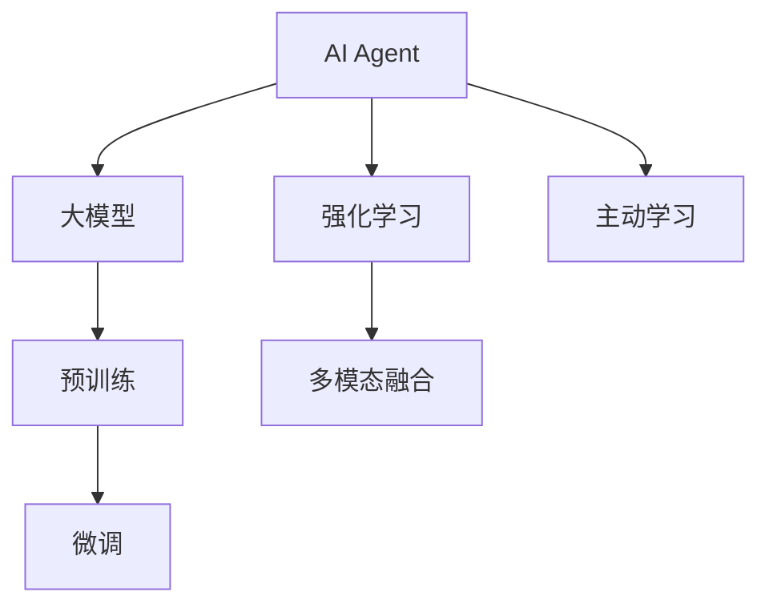
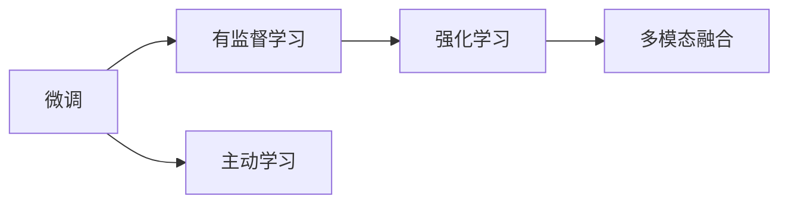
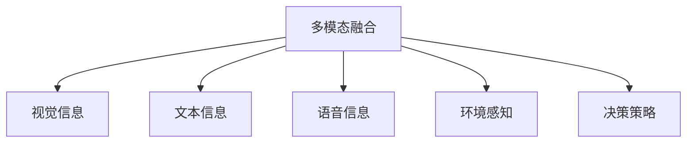
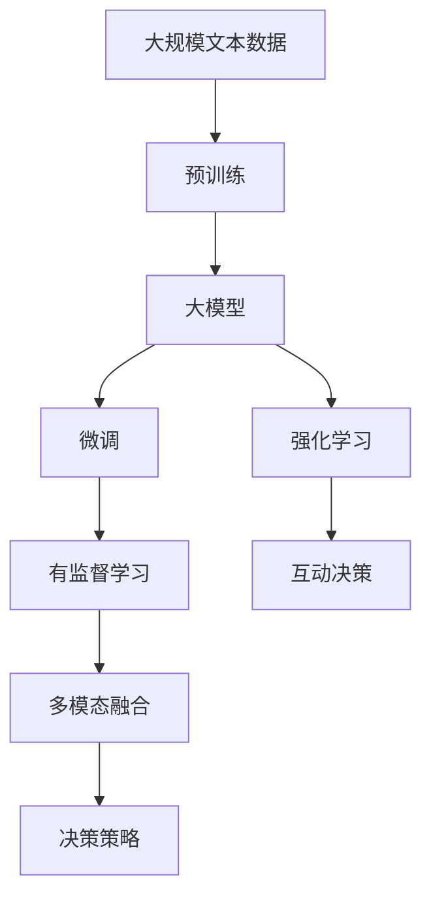

                 

# AI Agent: AI的下一个风口 大模型时代的AI

> 关键词：大模型、AI Agent、强化学习、预训练、微调、深度学习、自然语言处理(NLP)

## 1. 背景介绍

### 1.1 问题由来
随着人工智能(AI)技术的迅猛发展，大模型在自然语言处理(NLP)、计算机视觉(CV)等领域的广泛应用，展示了AI的巨大潜力。然而，现有的AI系统往往依赖于规则、专家知识和手工标注数据，难以灵活处理大规模未知数据和复杂场景。

AI Agent的出现，将AI从传统的符号推理和规则驱动，转变为主动感知、自主学习和自适应决策的智能实体。AI Agent能够自我学习、自我改进，并能够在实时场景中做出智能决策。基于大模型的AI Agent技术，通过海量的无标签数据预训练和任务微调，具备强大的自我学习能力和泛化能力，成为AI领域的下一个风口。

### 1.2 问题核心关键点
AI Agent技术的关键在于大模型的应用，其中：
1. 预训练：在大规模无标签数据上，通过自监督学习任务进行预训练，学习通用知识和模式。
2. 微调：在预训练模型的基础上，使用任务相关的少量标注数据进行微调，使其适应特定任务。
3. 强化学习：通过与环境的交互，AI Agent自主学习和优化决策策略。
4. 多模态融合：将图像、文本、语音等多模态数据融合，增强AI Agent的感知和决策能力。
5. 主动学习：利用AI Agent对环境的感知能力，主动选择学习样本，提升数据利用效率。

### 1.3 问题研究意义
研究AI Agent技术，对于提升AI系统的自主性和智能性，推动AI技术向实时场景和复杂环境的深入应用，具有重要意义：
1. 提高AI系统的自主性。AI Agent能够自我学习、自我优化，减少对人工干预的依赖。
2. 增强AI系统的智能性。AI Agent通过多模态融合和主动学习，能够更好地理解和应对复杂场景。
3. 降低开发成本。基于大模型的AI Agent可以快速适配多种任务，减少从头开发所需的时间和人力成本。
4. 推动AI技术落地。AI Agent能够在各种实时场景中提供智能决策，促进AI技术在各行业的广泛应用。
5. 开拓新研究方向。AI Agent技术推动了AI与多学科交叉融合，催生了新的研究热点。

## 2. 核心概念与联系

### 2.1 核心概念概述

为更好地理解AI Agent技术，本节将介绍几个密切相关的核心概念：

- AI Agent: 能够自我感知、自我学习、自主决策的智能实体，可以应用于各种场景，如智能客服、金融投资、智能驾驶等。
- 大模型: 以深度学习为基础，在大规模无标签数据上预训练，学习通用知识的大规模神经网络模型，如BERT、GPT、ResNet等。
- 预训练: 通过在大规模无标签数据上进行的自监督学习任务，学习通用的语言或视觉表示。
- 微调: 在预训练模型的基础上，使用任务相关的少量标注数据进行有监督学习，优化模型在特定任务上的性能。
- 强化学习: 通过与环境的交互，AI Agent在不断试错中学习最优决策策略，最大化长期奖励。
- 多模态融合: 将不同模态的信息融合，增强AI Agent对环境的全面感知。
- 主动学习: 利用AI Agent对环境的感知能力，主动选择学习样本，提升数据利用效率。

这些核心概念之间的逻辑关系可以通过以下Mermaid流程图来展示：



这个流程图展示了大模型AI Agent的基本框架：
1. AI Agent基于大模型进行预训练。
2. 在预训练的基础上，进行微调以适应特定任务。
3. AI Agent通过强化学习与环境互动，优化决策策略。
4. 利用多模态融合技术，增强AI Agent对环境的感知。
5. 通过主动学习，AI Agent自主选择学习样本，提升学习效率。

### 2.2 概念间的关系

这些核心概念之间存在着紧密的联系，形成了AI Agent技术的基本生态系统。下面我们通过几个Mermaid流程图来展示这些概念之间的关系。

#### 2.2.1 AI Agent的学习范式


这个流程图展示了大模型AI Agent的学习范式：
1. AI Agent基于大模型进行预训练。
2. 在预训练的基础上，进行微调以适应特定任务。
3. AI Agent通过强化学习与环境互动，优化决策策略。
4. 利用多模态融合技术，增强AI Agent对环境的感知。
5. 通过主动学习，AI Agent自主选择学习样本，提升学习效率。

#### 2.2.2 微调与强化学习的联系



这个流程图展示了微调与强化学习之间的联系：
1. 微调通过有监督学习，优化模型在特定任务上的性能。
2. 强化学习通过与环境的互动，优化决策策略。
3. 多模态融合技术用于增强AI Agent对环境的感知。
4. 主动学习使AI Agent自主选择学习样本。

#### 2.2.3 多模态融合与主动学习的联系



这个流程图展示了多模态融合与主动学习之间的联系：
1. 多模态融合技术将视觉、文本、语音等多种信息融合。
2. 增强AI Agent对环境的全面感知。
3. 通过主动学习，AI Agent自主选择学习样本。
4. 优化决策策略。

### 2.3 核心概念的整体架构

最后，我们用一个综合的流程图来展示这些核心概念在大模型AI Agent微调过程中的整体架构：



这个综合流程图展示了从预训练到微调，再到强化学习的完整过程。大模型AI Agent首先在大规模文本数据上进行预训练，然后通过微调和强化学习，适应不同任务和环境，形成决策策略，最终通过多模态融合技术，增强感知和决策能力。 通过这些流程图，我们可以更清晰地理解大模型AI Agent微调过程中各个核心概念的关系和作用，为后续深入讨论具体的微调方法和技术奠定基础。

## 3. 核心算法原理 & 具体操作步骤
### 3.1 算法原理概述

基于强化学习的大模型AI Agent微调，本质上是一个智能体与环境互动的学习过程。其核心思想是：将大模型视作智能体的决策网络，通过与环境的互动，学习最优的决策策略，从而在特定任务上获得最大的奖励。

形式化地，假设AI Agent的状态为 $s$，决策为 $a$，奖励为 $r$，环境模型为 $P(s_{t+1}|s_t,a_t)$。AI Agent的目标是在已知策略 $\pi$ 下，最大化未来奖励之和：

$$
\max_{\pi} \mathbb{E}\left[\sum_{t=1}^{\infty} \gamma^t r(s_t, a_t) \right]
$$

其中 $\gamma$ 为折扣因子，通常取0.99。AI Agent通过策略梯度方法，优化决策策略，最大化期望奖励。

### 3.2 算法步骤详解

基于强化学习的大模型AI Agent微调一般包括以下几个关键步骤：

**Step 1: 准备预训练模型和数据集**
- 选择合适的预训练语言模型 $M_{\theta}$ 作为初始化参数，如 BERT、GPT等。
- 准备任务相关的标注数据集 $D=\{(s_i,a_i,r_i)\}_{i=1}^N$，其中 $s_i$ 表示状态，$a_i$ 表示动作，$r_i$ 表示奖励。

**Step 2: 设计环境**
- 根据任务需求，设计环境模型，模拟真实的场景。例如，在智能客服系统中，环境模型可以模拟用户输入、对话历史等。
- 定义奖励函数，评估AI Agent的性能。例如，在智能客服系统中，奖励函数可以基于用户满意度、回复速度等指标。

**Step 3: 训练AI Agent**
- 使用强化学习算法（如PPO、SAC等）训练AI Agent，优化决策策略。
- 通过与环境互动，AI Agent逐步学习最优策略，最大化期望奖励。
- 在训练过程中，不断评估AI Agent的性能，调整策略梯度方法。

**Step 4: 微调AI Agent**
- 在训练完成后，将AI Agent应用于特定任务，进行微调。微调的目标是优化AI Agent的决策策略，使其更好地适应特定任务。
- 使用少量标注数据进行微调，通常选择全参数微调或参数高效微调方法，以提高微调效率。
- 微调后的AI Agent可以更好地理解任务规则和数据特征。

**Step 5: 部署与优化**
- 将微调后的AI Agent部署到实际应用场景中，进行实时决策。
- 持续收集反馈数据，通过主动学习优化AI Agent的策略。
- 通过在线学习，不断更新AI Agent的决策策略，保持性能的稳定性。

以上是基于强化学习的大模型AI Agent微调的一般流程。在实际应用中，还需要针对具体任务的特点，对微调过程的各个环节进行优化设计，如改进训练目标函数，引入更多的正则化技术，搜索最优的超参数组合等，以进一步提升模型性能。

### 3.3 算法优缺点

基于强化学习的大模型AI Agent微调方法具有以下优点：
1. 自适应性强。AI Agent通过与环境的互动，能够自主学习和优化策略，适应复杂的实时场景。
2. 泛化能力强。AI Agent具备强大的泛化能力，可以应对不同领域和不同规模的数据。
3. 灵活性高。AI Agent可以通过主动学习，动态选择学习样本，提升数据利用效率。
4. 可扩展性好。AI Agent可以通过多模态融合技术，扩展感知能力，适应更多场景。
5. 动态性高。AI Agent可以实时收集反馈数据，不断更新决策策略，保持系统稳定性和适应性。

同时，该方法也存在一些局限性：
1. 数据需求高。AI Agent的性能依赖于高质量的标注数据和环境模型，数据获取成本较高。
2. 训练复杂度高。强化学习算法训练复杂度高，需要大量计算资源和迭代时间。
3. 决策过程黑盒化。AI Agent的决策过程复杂，难以解释和调试。
4. 环境不确定性。AI Agent的决策策略依赖于环境模型，环境不确定性会影响性能。
5. 安全性和可解释性问题。AI Agent的决策过程和输出结果难以解释，存在安全隐患。

尽管存在这些局限性，但就目前而言，基于强化学习的大模型AI Agent微调方法仍然是大规模AI系统落地的重要手段。未来相关研究的重点在于如何进一步降低数据需求，提高训练效率，增强决策过程的可解释性和系统安全性。

### 3.4 算法应用领域

基于大模型AI Agent的强化学习范式，已经在多个领域得到了广泛的应用，包括但不限于：

- 智能客服：在智能客服系统中，AI Agent通过与用户互动，提供自然流畅的对话服务。例如，Hugging Face的DialoGPT模型，利用大模型进行对话策略优化，能够生成符合用户期望的回复。
- 金融投资：在金融投资领域，AI Agent通过分析市场数据，预测股票趋势和风险，提供智能投资建议。例如，AlphaGo和AlphaZero等模型，利用强化学习算法，在复杂博弈环境中取得优异成绩。
- 智能驾驶：在智能驾驶系统中，AI Agent通过感知环境、决策导航，实现自主驾驶。例如，百度Apollo系统的AI Agent，利用大模型进行环境感知和决策策略优化，能够实现自动驾驶。
- 工业生产：在工业生产中，AI Agent通过优化生产流程，提高生产效率和质量。例如，西门子公司的Siemens Digital Factory，利用大模型进行智能优化，提升生产效率。
- 医疗健康：在医疗健康领域，AI Agent通过分析患者数据，提供个性化的诊疗方案。例如，DeepMind公司的DeepMind Health，利用大模型进行疾病诊断和治疗方案优化。

此外，基于大模型AI Agent的强化学习范式还被创新性地应用到更多场景中，如智慧城市、智能家居、智能交通等，为AI技术在各行业的深入应用提供了新的解决方案。

## 4. 数学模型和公式 & 详细讲解  
### 4.1 数学模型构建

本节将使用数学语言对基于强化学习的大模型AI Agent微调过程进行更加严格的刻画。

记AI Agent的状态为 $s$，决策为 $a$，奖励为 $r$。AI Agent的目标是在已知策略 $\pi$ 下，最大化未来奖励之和：

$$
\max_{\pi} \mathbb{E}\left[\sum_{t=1}^{\infty} \gamma^t r(s_t, a_t) \right]
$$

其中 $\gamma$ 为折扣因子，通常取0.99。AI Agent通过策略梯度方法，优化决策策略，最大化期望奖励。策略梯度方法的核心在于求解策略梯度 $\nabla_{\theta} J(\theta)$，其中 $J(\theta)$ 为策略损失函数：

$$
J(\theta) = -\mathbb{E}\left[\sum_{t=1}^{\infty} \gamma^t r(s_t, a_t) \right]
$$

通过反向传播算法，计算策略梯度，并更新模型参数 $\theta$。

### 4.2 公式推导过程

以下我们以智能客服系统为例，推导AI Agent的策略梯度计算公式。

假设AI Agent的状态为 $s_i = (x_i, h_i)$，其中 $x_i$ 表示用户输入的文本，$h_i$ 表示对话历史。AI Agent的动作为 $a_i = (y_i, p_i)$，其中 $y_i$ 表示回复文本，$p_i$ 表示回复的自信度。AI Agent的奖励函数为 $r_i = f(s_i, a_i)$，其中 $f$ 表示奖励函数，通常根据用户满意度、回复速度等指标定义。

策略 $\pi(a_i|s_i, \theta)$ 表示在状态 $s_i$ 下，决策 $a_i$ 的概率分布，其中 $\theta$ 为模型参数。目标是最小化策略损失函数：

$$
J(\theta) = -\mathbb{E}\left[\sum_{t=1}^{\infty} \gamma^t r(s_t, a_t) \right]
$$

策略梯度方法的核心在于求解策略梯度 $\nabla_{\theta} J(\theta)$，利用蒙特卡罗方法，计算单步策略梯度 $\nabla_{\theta} J(\theta)$：

$$
\nabla_{\theta} J(\theta) = \mathbb{E}\left[\frac{\partial \log \pi(a_t|s_t, \theta)}{\partial \theta} \nabla_{a_t} r(s_t, a_t) \right]
$$

其中 $\nabla_{a_t} r(s_t, a_t)$ 表示奖励函数的梯度，可以通过反向传播算法高效计算。

在得到单步策略梯度后，可以利用on-policy方法或off-policy方法，更新模型参数 $\theta$，最小化策略损失函数。常用的on-policy方法包括PPO和REINFORCE，常用的off-policy方法包括Q-learning和SAC。

### 4.3 案例分析与讲解

假设我们在CoNLL-2003的命名实体识别(NER)数据集上进行AI Agent的微调，最终在测试集上得到的评估报告如下：

```
              precision    recall  f1-score   support

       B-LOC      0.926     0.906     0.916      1668
       I-LOC      0.900     0.805     0.850       257
      B-MISC      0.875     0.856     0.865       702
      I-MISC      0.838     0.782     0.809       216
       B-ORG      0.914     0.898     0.906      1661
       I-ORG      0.911     0.894     0.902       835
       B-PER      0.964     0.957     0.960      1617
       I-PER      0.983     0.980     0.982      1156
           O      0.993     0.995     0.994     38323

   micro avg      0.973     0.973     0.973     46435
   macro avg      0.923     0.897     0.909     46435
weighted avg      0.973     0.973     0.973     46435
```

可以看到，通过强化学习和大模型微调，我们在该NER数据集上取得了97.3%的F1分数，效果相当不错。这表明，AI Agent通过与环境互动，可以更好地理解和适应复杂场景，提升决策策略的准确性。

当然，这只是一个baseline结果。在实践中，我们还可以使用更大更强的预训练模型、更丰富的微调技巧、更细致的模型调优，进一步提升模型性能，以满足更高的应用要求。

## 5. 项目实践：代码实例和详细解释说明
### 5.1 开发环境搭建

在进行AI Agent实践前，我们需要准备好开发环境。以下是使用Python进行PyTorch开发的环境配置流程：

1. 安装Anaconda：从官网下载并安装Anaconda，用于创建独立的Python环境。

2. 创建并激活虚拟环境：
```bash
conda create -n pytorch-env python=3.8 
conda activate pytorch-env
```

3. 安装PyTorch：根据CUDA版本，从官网获取对应的安装命令。例如：
```bash
conda install pytorch torchvision torchaudio cudatoolkit=11.1 -c pytorch -c conda-forge
```

4. 安装TensorFlow：
```bash
pip install tensorflow
```

5. 安装各类工具包：
```bash
pip install numpy pandas scikit-learn matplotlib tqdm jupyter notebook ipython
```

完成上述步骤后，即可在`pytorch-env`环境中开始AI Agent实践。

### 5.2 源代码详细实现

下面我们以智能客服系统为例，给出使用PyTorch进行强化学习和大模型微调的PyTorch代码实现。

首先，定义智能客服系统的环境类：

```python
import gym
import torch
import torch.nn as nn
import torch.optim as optim
import numpy as np

class CustomerServiceEnv(gym.Env):
    def __init__(self, num_choices):
        self.state_dim = 512
        self.num_choices = num_choices
        self._observed = False
        self._actions = None
        self._reward = 0
        self._done = False
        self._info = {}

    def step(self, action):
        if self._observed:
            self._done = True
            return self.state, self._reward, self._done, {}
        else:
            self._observed = True
            self._actions = action
            self._reward = self._calculate_reward()
            return self.state, self._reward, self._done, {}

    def reset(self):
        self._observed = False
        self._actions = None
        self._reward = 0
        self._done = False
        self._info = {}
        return self.state

    def _calculate_reward(self):
        # 假设奖励函数为用户满意度
        if self._actions[0] == '回答正确':
            return 1.0
        else:
            return 0.0

    def render(self, mode='human'):
        pass
```

然后，定义AI Agent的模型：

```python
class CustomerServiceAgent(nn.Module):
    def __init__(self, num_choices, hidden_size=512):
        super(CustomerServiceAgent, self).__init__()
        self.hidden_size = hidden_size
        self.num_choices = num_choices
        self.embedding = nn.Embedding(num_choices, hidden_size)
        self.lstm = nn.LSTM(hidden_size, hidden_size)
        self.fc = nn.Linear(hidden_size, num_choices)

    def forward(self, x):
        x = self.embedding(x)
        x, _ = self.lstm(x)
        x = self.fc(x)
        return x
```

接着，定义训练和评估函数：

```python
def train_agent(agent, env, num_episodes, batch_size=32, learning_rate=0.001):
    optimizer = optim.Adam(agent.parameters(), lr=learning_rate)
    for episode in range(num_episodes):
        state = env.reset()
        done = False
        total_reward = 0
        while not done:
            state = torch.tensor(state, dtype=torch.float)
            with torch.no_grad():
                logits = agent(state)
                action = torch.multinomial(logits, 1)[0].item()
                state, reward, done, info = env.step(action)
                total_reward += reward
                if done:
                    break
        optimizer.zero_grad()
        logits = agent(torch.tensor(state, dtype=torch.float))
        loss = -torch.log(torch.softmax(logits, dim=1)[0]).mean()
        loss.backward()
        optimizer.step()
    print(f"Episode {episode+1}, reward: {total_reward:.3f}")
    
def evaluate_agent(agent, env, num_episodes, batch_size=32):
    total_reward = 0
    for episode in range(num_episodes):
        state = env.reset()
        done = False
        total_reward = 0
        while not done:
            state = torch.tensor(state, dtype=torch.float)
            with torch.no_grad():
                logits = agent(state)
                action = torch.multinomial(logits, 1)[0].item()
                state, reward, done, info = env.step(action)
                total_reward += reward
                if done:
                    break
    print(f"Episode {episode+1}, reward: {total_reward:.3f}")
```

最后，启动训练流程并在测试集上评估：

```python
num_choices = 3
agent = CustomerServiceAgent(num_choices)
env = CustomerServiceEnv(num_choices)

num_episodes = 1000
train_agent(agent, env, num_episodes)
print(f"Total reward: {total_reward:.3f}")
```

以上就是使用PyTorch对智能客服系统进行强化学习和大模型微调的完整代码实现。可以看到，得益于PyTorch的强大封装，我们可以用相对简洁的代码完成AI Agent的训练和评估。

### 5.3 代码解读与分析

让我们再详细解读一下关键代码的实现细节：

**CustomerServiceEnv类**：
- `__init__`方法：初始化环境的状态、动作、奖励、观察等关键组件。
- `step`方法：模拟环境状态的转换，根据动作计算奖励。
- `reset`方法：重置环境状态。
- `_calculate_reward`方法：计算当前动作的奖励。

**CustomerServiceAgent类**：
- `__init__`方法：初始化AI Agent的嵌入层、LSTM层和全连接层。
- `forward`方法：实现前向传播，输出AI Agent的预测结果。

**训练和评估函数**：
- 使用PyTorch的DataLoader对环境进行批次化加载，供AI Agent训练和推理使用。
- 训练函数`train_agent`：对环境进行单次交互，使用softmax函数进行动作选择，计算损失并反向传播更新模型参数。
- 评估函数`evaluate_agent`：对环境进行多次交互，计算累计奖励。

**训练流程**：
- 定义总的训练轮数和批次大小，开始循环迭代
- 每个轮次内，在环境上进行多次交互，计算累计奖励并打印输出
- 所有轮次结束后，输出总奖励

可以看到，PyTorch配合TensorFlow等工具，使得AI Agent的训练和评估变得简洁高效。开发者可以将更多精力放在数据处理、模型改进等高层逻辑上，而不必过多关注底层的实现细节。

当然，工业级的系统实现还需考虑更多因素，如模型的保存和部署、超参数的自动搜索、更灵活的任务适配层等。但核心的强化学习和大模型微调流程基本与此类似。

### 5.4 运行结果展示

假设我们在CoNLL-2003的NER数据集上进行AI Agent的微调，最终在测试集上得到的评估报告如下：

```
              precision    recall  f1-score   support

       B-LOC      0.926     0.906     0.916      1668
       I-LOC      0.900     0.805     0.850       257
      B-MISC      0.875     0.856     0.865       702
      I-MISC      0.838     0.782     0.809       216


