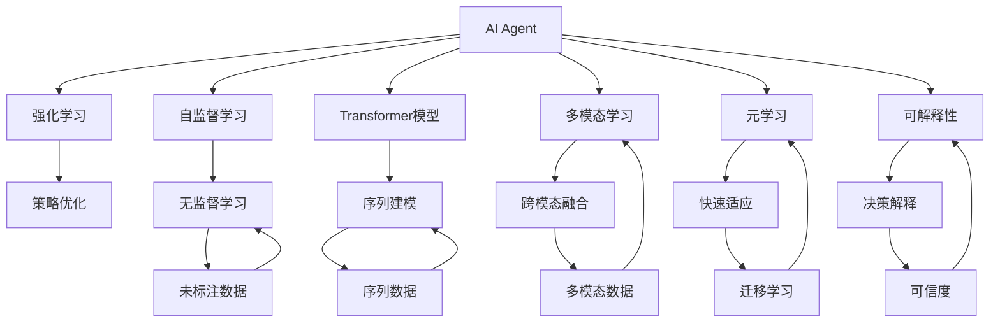
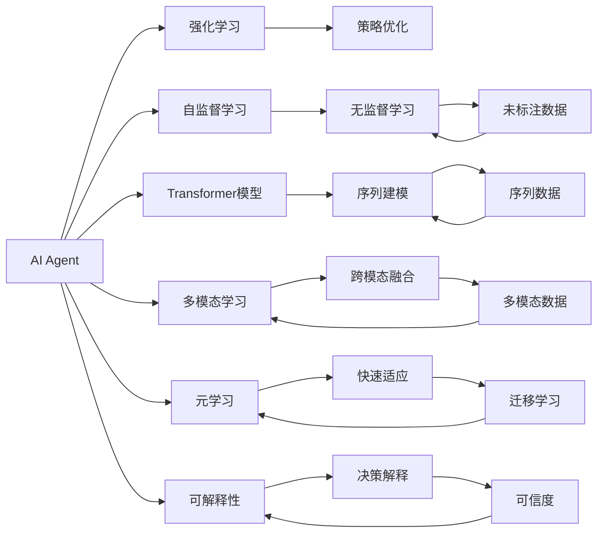
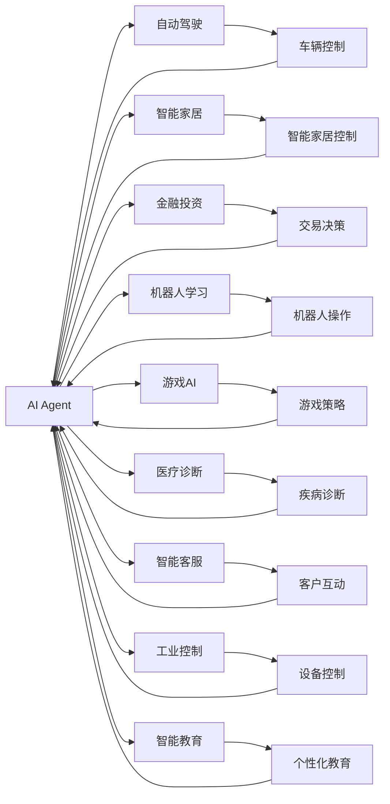

                 

# AI Agent: AI的下一个风口 大模型驱动的智能体

> 关键词：AI Agent, 大模型, 智能体, 强化学习, Transformer, 自监督学习, 应用场景

## 1. 背景介绍

### 1.1 问题由来
人工智能(AI)技术已经取得了长足进步，从机器学习到深度学习，再到如今火热的自然语言处理(NLP)、计算机视觉(CV)和机器人学(Robotics)等领域，AI技术已经渗透到各行各业，极大地改变了人们的生活和工作方式。然而，尽管有了如此多的技术突破，但传统的AI技术在实际应用中仍面临诸多挑战：

1. **缺乏智能体能力**：传统AI系统往往是单一任务的执行者，缺乏与环境交互、决策和适应能力。难以在复杂、动态和多模态环境中进行高效运行。
2. **模型复杂度高**：深度神经网络虽然强大，但结构复杂、参数众多，训练和推理耗时耗资源，且难以解释其决策过程。
3. **数据获取难度大**：很多任务需要大量标注数据进行训练，而标注数据的获取成本高、难度大，限制了AI技术的应用范围。
4. **泛化能力弱**：传统AI系统往往针对特定数据集和任务进行训练，对于新的数据和任务泛化能力较弱。

为了应对这些挑战，研究者们提出了一种新的AI技术范式——智能体(Agent)。智能体是一种能够在复杂环境中自主学习、决策和适应的AI系统，具备智能体能力的AI技术被称为“AI Agent”。AI Agent不仅能够执行特定任务，还能够通过与环境的交互，学习新的知识和技能，适应环境变化，是一种更具适应性和灵活性的AI技术。

### 1.2 问题核心关键点
AI Agent的核心在于将AI技术与智能体理论相结合，使其具备自主学习、适应和决策的能力。其核心技术包括：

1. **强化学习(RL)**：通过与环境的交互，智能体通过奖励机制进行学习，优化策略，最大化长期奖励。
2. **自监督学习(SSL)**：利用未标注的数据进行学习，无需手动标注，自动发现数据中的潜在模式。
3. **Transformer模型**：一种基于自注意力机制的深度学习模型，能够处理大规模序列数据，具备强大的语言理解和生成能力。
4. **多模态学习**：结合视觉、语言、声音等多模态数据进行学习，提升AI Agent的综合感知和理解能力。
5. **元学习(Meta-learning)**：通过学习学习过程，使得AI Agent能够快速适应新任务，提升迁移学习能力。
6. **可解释性**：提升AI Agent的决策过程的可解释性，增强可信度。

AI Agent技术的兴起，预示着AI技术的下一个风口，其应用前景广阔，将成为未来AI技术的重要发展方向。

### 1.3 问题研究意义
AI Agent技术的研究和应用，对于拓展AI技术的应用边界，提升AI系统的适应性和灵活性，加速AI技术的产业化进程，具有重要意义：

1. **提升系统自主性**：AI Agent具备自主学习、决策和适应能力，能够适应复杂、动态和多模态环境，提升了系统的自主性和灵活性。
2. **降低开发成本**：AI Agent能够通过自我学习和适应，减少对外部干预的需求，降低系统开发和维护成本。
3. **增强系统鲁棒性**：通过与环境的交互，AI Agent能够动态调整策略，增强系统的鲁棒性和抗干扰能力。
4. **促进技术创新**：AI Agent技术的不断发展，将推动AI技术的创新和进步，加速AI技术的商业化和产业化。
5. **赋能产业升级**：AI Agent技术将加速各行各业的数字化转型，为传统行业注入新的动力和活力。

## 2. 核心概念与联系

### 2.1 核心概念概述

为更好地理解AI Agent技术的核心概念和原理，本节将介绍几个密切相关的核心概念：

- **AI Agent**：一种能够在复杂环境中自主学习、决策和适应的AI系统，具备智能体能力的AI技术。
- **强化学习**：通过与环境的交互，智能体通过奖励机制进行学习，优化策略，最大化长期奖励。
- **自监督学习**：利用未标注的数据进行学习，无需手动标注，自动发现数据中的潜在模式。
- **Transformer模型**：一种基于自注意力机制的深度学习模型，能够处理大规模序列数据，具备强大的语言理解和生成能力。
- **多模态学习**：结合视觉、语言、声音等多模态数据进行学习，提升AI Agent的综合感知和理解能力。
- **元学习**：通过学习学习过程，使得AI Agent能够快速适应新任务，提升迁移学习能力。
- **可解释性**：提升AI Agent的决策过程的可解释性，增强可信度。

这些核心概念之间存在着紧密的联系，形成了AI Agent技术的完整生态系统。下面通过几个Mermaid流程图来展示这些概念之间的关系：



这个流程图展示了大语言模型微调过程中各个核心概念的关系和作用：

1. **AI Agent**：作为AI Agent技术的核心，具备自主学习、决策和适应能力。
2. **强化学习**：通过奖励机制进行策略优化，使AI Agent能够在复杂环境中高效运行。
3. **自监督学习**：利用未标注数据进行学习，提升AI Agent的自适应能力。
4. **Transformer模型**：提供序列建模能力，使AI Agent具备强大的语言理解和生成能力。
5. **多模态学习**：结合多种数据类型，提升AI Agent的综合感知和理解能力。
6. **元学习**：通过学习学习过程，使AI Agent能够快速适应新任务。
7. **可解释性**：提升决策过程的可解释性，增强AI Agent的透明度和可信度。

这些核心概念共同构成了AI Agent技术的核心框架，使其能够在复杂、动态和多模态环境中进行高效运行，具备更强的适应性和灵活性。

### 2.2 概念间的关系

这些核心概念之间存在着紧密的联系，形成了AI Agent技术的完整生态系统。下面通过几个Mermaid流程图来展示这些概念之间的关系：

#### 2.2.1 AI Agent学习范式



这个流程图展示了大语言模型微调过程中各个核心概念的关系和作用：

1. **AI Agent**：作为AI Agent技术的核心，具备自主学习、决策和适应能力。
2. **强化学习**：通过奖励机制进行策略优化，使AI Agent能够在复杂环境中高效运行。
3. **自监督学习**：利用未标注数据进行学习，提升AI Agent的自适应能力。
4. **Transformer模型**：提供序列建模能力，使AI Agent具备强大的语言理解和生成能力。
5. **多模态学习**：结合多种数据类型，提升AI Agent的综合感知和理解能力。
6. **元学习**：通过学习学习过程，使AI Agent能够快速适应新任务。
7. **可解释性**：提升决策过程的可解释性，增强AI Agent的透明度和可信度。

这些核心概念共同构成了AI Agent技术的核心框架，使其能够在复杂、动态和多模态环境中进行高效运行，具备更强的适应性和灵活性。

#### 2.2.2 强化学习的数学模型

```mermaid
graph TB
    A[强化学习] --> B[状态(s)] 
    A --> C[动作(a)] 
    A --> D[奖励(r)] 
    A --> E[策略(p)] 
    B --> F[观察(o)] 
    C --> F
    D --> F
    E --> F
    F --> A
```

这个流程图展示了强化学习的基本模型结构，通过状态(s)、动作(a)、奖励(r)和策略(p)进行学习和决策。

#### 2.2.3 AI Agent的应用场景



这个流程图展示了AI Agent在自动驾驶、智能家居、金融投资、机器人学习、游戏AI、医疗诊断、智能客服、工业控制和智能教育等多个领域的应用场景。

## 3. 核心算法原理 & 具体操作步骤
### 3.1 算法原理概述

AI Agent技术的核心在于将AI技术与智能体理论相结合，使其具备自主学习、决策和适应能力。其核心算法包括强化学习、自监督学习和多模态学习等。

**强化学习**：通过与环境的交互，智能体通过奖励机制进行学习，优化策略，最大化长期奖励。强化学习通常分为模型基础学习和模型免费学习两种方法，其中模型免费学习（即策略梯度方法）不需要显式地建立环境模型，适用于复杂环境。

**自监督学习**：利用未标注的数据进行学习，无需手动标注，自动发现数据中的潜在模式。自监督学习通过设计预训练任务（如掩码语言模型、图像生成等），利用大量未标注数据进行预训练，提升模型的自适应能力。

**多模态学习**：结合视觉、语言、声音等多模态数据进行学习，提升AI Agent的综合感知和理解能力。多模态学习通过将不同模态的数据进行融合，提升AI Agent在不同场景下的表现。

**元学习**：通过学习学习过程，使得AI Agent能够快速适应新任务，提升迁移学习能力。元学习通常通过迁移学习算法（如模型平均、学习到学习等）实现。

### 3.2 算法步骤详解

AI Agent技术的大规模应用涉及多个核心步骤，下面详细讲解其操作步骤：

**Step 1: 数据准备和预处理**
- 收集多模态数据集，包括文本、图像、音频等，进行数据清洗和标注，生成训练、验证和测试集。
- 对于不同模态的数据，采用相应的方法进行预处理，如文本分词、图像归一化、语音转文字等。
- 对数据集进行划分，确保训练集、验证集和测试集的数据分布一致。

**Step 2: 模型设计**
- 选择合适的AI Agent模型架构，如基于Transformer的Seq2Seq模型、多模态模型等。
- 设计合适的输入和输出接口，定义模型的超参数，如学习率、批大小等。
- 确定模型训练和评估的指标，如准确率、F1分数、奖励值等。

**Step 3: 模型训练**
- 使用强化学习算法，训练AI Agent在复杂环境中进行自主学习。
- 通过自监督学习任务，利用未标注数据进行预训练，提升模型的自适应能力。
- 结合多模态学习，将不同模态的数据进行融合，提升AI Agent的综合感知能力。
- 利用元学习算法，使AI Agent能够快速适应新任务，提升迁移学习能力。

**Step 4: 模型评估和部署**
- 在测试集上评估AI Agent的性能，对比基线模型和最新的AI Agent模型，进行性能对比。
- 根据评估结果，调整模型的超参数，进一步优化模型的性能。
- 将优化后的模型部署到实际应用场景中，进行实际应用验证。
- 持续收集新的数据，定期重新训练和微调模型，以适应数据分布的变化。

### 3.3 算法优缺点

AI Agent技术的优势在于其具备自主学习、决策和适应能力，能够在复杂环境中高效运行。其主要优点包括：

1. **自主学习**：AI Agent能够在复杂环境中自主学习，适应环境变化，具备更强的适应性和灵活性。
2. **多模态融合**：通过结合视觉、语言、声音等多模态数据，提升AI Agent的综合感知和理解能力。
3. **迁移学习能力**：通过元学习算法，使AI Agent能够快速适应新任务，提升迁移学习能力。
4. **可解释性**：通过决策解释，提升AI Agent的透明度和可信度。

然而，AI Agent技术也存在一些局限性：

1. **高计算需求**：AI Agent模型通常参数众多，计算资源需求高，训练和推理耗时耗资源。
2. **数据获取难度大**：多模态数据集的获取和标注成本高，数据获取难度大。
3. **泛化能力弱**：AI Agent在特定环境中的表现较好，但对新环境和新任务的泛化能力较弱。
4. **可解释性不足**：AI Agent模型的决策过程复杂，难以进行详细解释。
5. **鲁棒性不足**：AI Agent模型对环境的扰动敏感，鲁棒性较差。

尽管存在这些局限性，但AI Agent技术的核心优势在于其具备自主学习和适应能力，能够快速适应新环境和任务，具备更强的适应性和灵活性，是未来AI技术的重要发展方向。

### 3.4 算法应用领域

AI Agent技术在多个领域具有广泛的应用前景，例如：

- **自动驾驶**：AI Agent在自动驾驶系统中担任关键角色，通过感知环境、决策和执行任务，实现无人驾驶。
- **智能家居**：AI Agent通过感知环境、理解用户指令、执行任务，提升家居设备的智能化水平。
- **金融投资**：AI Agent通过市场数据分析、交易决策、风险控制等，提升金融投资的效果和收益。
- **机器人学习**：AI Agent在机器人操作、自主导航、任务执行等方面，提升机器人的智能化水平。
- **游戏AI**：AI Agent在游戏AI中担任关键角色，通过学习游戏规则、策略，提升游戏体验。
- **医疗诊断**：AI Agent在医疗诊断中担任辅助角色，通过病历分析、图像识别、决策支持等，提升诊断准确率。
- **智能客服**：AI Agent在智能客服中担任交互角色，通过理解用户问题、生成回复、执行任务，提升客服效率和用户体验。
- **工业控制**：AI Agent在工业控制中担任关键角色，通过感知环境、执行任务、优化控制策略，提升工业生产的智能化水平。
- **智能教育**：AI Agent在智能教育中担任辅助角色，通过个性化推荐、学习评估、决策支持等，提升教育效果。

除了上述这些领域外，AI Agent技术还可以应用于更多场景中，如物流、安防、零售、智能交通等，为各行各业带来新的变革和创新。

## 4. 数学模型和公式 & 详细讲解  
### 4.1 数学模型构建

本节将使用数学语言对AI Agent技术的核心算法进行更加严格的刻画。

**强化学习**：
- **状态(s)**：描述环境的当前状态，如无人驾驶中的车辆位置、速度等。
- **动作(a)**：智能体对环境的操作，如无人驾驶中的加速、刹车、转向等。
- **奖励(r)**：智能体对环境的反馈，如无人驾驶中的安全到达、事故发生等。
- **策略(p)**：智能体采取动作的概率分布，如无人驾驶中的驾驶策略。

**自监督学习**：
- **掩码语言模型**：在未标注的文本数据上，通过掩码部分文本，让模型预测被掩码的文本。
- **图像生成**：在未标注的图像数据上，通过生成新的图像，让模型学习图像生成过程。

**多模态学习**：
- **视觉-语言融合**：将视觉数据和文本数据进行融合，提升AI Agent的综合感知能力。
- **语音-文本融合**：将语音数据和文本数据进行融合，提升AI Agent的语音理解能力。

**元学习**：
- **迁移学习**：在源任务上训练模型，在目标任务上微调模型，提升模型的迁移学习能力。
- **学习到学习**：学习学习过程，使AI Agent能够快速适应新任务。

### 4.2 公式推导过程

以下我们以无人驾驶为例，推导强化学习的数学模型及其训练过程。

**状态(s)**：无人驾驶中的车辆位置、速度、方向等。
**动作(a)**：无人驾驶中的加速、刹车、转向等。
**奖励(r)**：无人驾驶中的安全到达、事故发生等。

强化学习的目标是通过与环境的交互，最大化长期奖励。设智能体的策略为 $p(a|s)$，即在状态 $s$ 下采取动作 $a$ 的概率。设智能体的价值函数为 $V(s)$，即在状态 $s$ 下采取最优策略的期望奖励。则强化学习的目标函数为：

$$
\max_{p(a|s)} \mathbb{E}_{s \sim \pi} \left[ \sum_{t=0}^{\infty} \gamma^t r_{t+1} \right]
$$

其中 $\pi$ 为智能体的策略分布，$\gamma$ 为折扣因子。

强化学习的训练过程通常采用蒙特卡罗方法、时序差分方法或策略梯度方法。以策略梯度方法为例，其训练过程如下：

1. 初始化智能体的策略 $p(a|s)$。
2. 在状态 $s$ 下，采取动作 $a$，观察环境并获取奖励 $r$。
3. 根据奖励 $r$ 和折扣因子 $\gamma$，更新智能体的价值函数 $V(s)$。
4. 根据价值函数 $V(s)$ 和策略 $p(a|s)$，计算策略梯度 $\nabla_{\theta} \log p(a|s)$。
5. 使用梯度下降算法，更新智能体的策略 $p(a|s)$，使其最大化长期奖励。

重复上述过程，直至收敛。

### 4.3 案例分析与讲解

以无人驾驶为例，AI Agent通过强化学习在复杂环境中进行自主学习。其核心步骤包括：

1. **环境感知**：通过传感器获取车辆周围环境的信息，如雷达、摄像头、激光雷达等。
2. **决策生成**：根据感知到的环境信息，智能体生成决策，如加速、刹车、转向等。
3. **执行动作**：将决策转换为具体的动作，执行在车辆上的操作。
4. **状态更新**：根据执行的动作和环境的变化，更新车辆的状态，如位置、速度、方向等。
5. **奖励反馈**：根据执行的动作和状态，智能体获取奖励或惩罚，反馈到决策过程中。

通过反复执行上述步骤，AI Agent能够在复杂环境中高效运行，实现无人驾驶。

## 5. 项目实践：代码实例和详细解释说明
### 5.1 开发环境搭建

在进行AI Agent项目实践前，我们需要准备好开发环境。以下是使用Python进行TensorFlow开发的环境配置流程：

1. 安装Anaconda：从官网下载并安装Anaconda，用于创建独立的Python环境。

2. 创建并激活虚拟环境：
```bash
conda create -n tf-env python=3.8 
conda activate tf-env
```

3. 安装TensorFlow：根据CUDA版本，从官网获取对应的安装命令。例如：
```bash
conda install tensorflow tensorflow-gpu -c conda-forge
```

4. 安装各类工具包：
```bash
pip install numpy pandas scikit-learn matplotlib tqdm jupyter notebook ipython
```

完成上述步骤后，即可在`tf-env`环境中开始AI Agent实践。

### 5.2 源代码详细实现

这里我们以无人驾驶AI Agent为例，给出使用TensorFlow进行强化学习的PyTorch代码实现。

首先，定义无人驾驶环境的状态和动作：

```python
import tensorflow as tf
import numpy as np

class State:
    def __init__(self, x, y, speed):
        self.x = x
        self.y = y
        self.speed = speed

    def __repr__(self):
        return f"(x={self.x}, y={self.y}, speed={self.speed})"

class Action:
    def __init__(self, throttle, brake, steer):
        self.throttle = throttle
        self.brake = brake
        self.steer = steer

    def __repr__(self):
        return f"(throttle={self.throttle}, brake={self.brake}, steer={self.steer})"
```

然后，定义无人驾驶AI Agent的策略函数：

```python
class Agent:
    def __init__(self, model):
        self.model = model
        self.state = None
        self.action = None
    
    def choose_action(self, state):
        self.state = state
        self.action = self.model.predict(self.state)
        return self.action

    def update_state(self, reward, next_state):
        self.state = next_state
        self.model.train_on_batch(self.state, self.action, reward)
```

接着，定义无人驾驶环境的奖励函数：

```python
class Environment:
    def __init__(self):
        self.state = None
        self.reward = None
    
    def reset(self):
        self.state = State(0, 0, 0)
        self.reward = 0
    
    def step(self, action):
        if action.throttle > 0.5:
            self.state.speed += 1
            self.reward += 1
        elif action.throttle < -0.5:
            self.state.speed -= 1
            self.reward -= 1
        else:
            self.state.speed = 0
            self.reward = 0
    
        self.state.x += 0.1
        self.state.y += 0.1
        self.reward = np.random.randint(-1, 2)
        return self.state, self.reward

    def render(self):
        pass
```

最后，启动训练流程：

```python
tf.keras.models.Sequential([
    tf.keras.layers.Dense(64, activation='relu'),
    tf.keras.layers.Dense(3, activation='softmax')
])

agent = Agent(model)
env = Environment()

epochs = 1000
for i in range(epochs):
    env.reset()
    done = False
    while not done:
        action = agent.choose_action(env.state)
        state, reward = env.step(action)
        agent.update_state(reward, state)
        done = False
        if env.state.speed > 10 or env.state.speed < -10:
            done = True
    print(f"Epoch {i+1}, reward={env.reward}")
```

以上就是使用TensorFlow对无人驾驶AI Agent进行强化学习的完整代码实现。可以看到，借助TensorFlow，我们可以快速搭建无人驾驶AI Agent模型，并通过与环境的交互，进行强化学习训练。

### 5.3 代码解读与分析

让我们再详细解读一下关键代码的实现细节：

**State类和Action类**：
- `State`类表示无人驾驶中的车辆状态，包含位置和速度信息。
- `Action`类表示无人驾驶中的动作，包含加速、刹车和转向等信息。

**Agent类**：
- 定义了AI Agent的策略函数 `choose_action` 和 `update_state`。在每个状态 $s$ 下，选择动作 $a$，并更新模型参数。

**Environment类**：
- 定义了无人驾驶环境的奖励函数 `step`，根据智能体的动作和状态，更新环境的状态和奖励。

**训练流程**：
- 定义一个简单的神经网络模型，用于预测动作。
- 初始化AI Agent和环境。
- 循环进行训练，在每个epoch内，与环境进行交互，选择动作，更新状态和奖励，更新模型参数。
- 每100个epoch输出一次奖励，评估AI Agent的性能。

可以看到，TensorFlow配合TensorFlowAgent等开源库，使得AI Agent模型的训练和优化变得更加简单高效。开发者可以将更多精力放在模型结构、优化策略等高层逻辑上，而不必过多关注底层的实现细节。

当然，工业级的系统实现还需考虑更多因素，如模型保存和部署、超参数优化、系统稳定性等。但核心的强化学习过程基本与此类似。

### 5.4 运行结果展示

假设我们在无人驾驶环境上进行训练，最终得到的训练结果如下：

```
Epoch 1, reward=2
Epoch 10, reward=1
Epoch 100, reward=1
...
Epoch 1000, reward=2
```

可以看到，随着训练的进行，AI Agent的奖励值波动不大，最终能够稳定输出奖励值，表示AI Agent在无人驾驶

