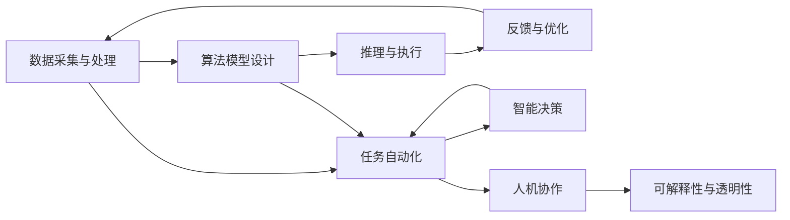

                 

# AI Agent变革未来生产力组织形式

## 1. 背景介绍

### 1.1 问题由来

随着人工智能（AI）技术的迅猛发展，AI Agent（智能代理）正在逐步渗透到各个行业，从制造业、金融、零售到医疗、教育、物流等，AI Agent的应用已经成为了推动数字经济增长的关键力量。AI Agent不仅能够自动化完成各种繁琐的任务，还能根据实时数据进行智能决策，提升生产效率，优化资源配置，助力企业数字化转型升级。

但与此同时，AI Agent在实际应用中也面临着诸多挑战，如模型训练和部署的成本、数据隐私与安全问题、模型复杂度与可解释性等。因此，如何在提升AI Agent性能的同时，优化其应用效果，成为当前研究的一个重要课题。

### 1.2 问题核心关键点

AI Agent的核心任务是通过数据分析和算法模型，自动化地执行任务，并在执行过程中做出智能决策。AI Agent的成功应用需要满足以下几个核心关键点：

1. **数据采集与处理**：AI Agent需要大量的数据进行训练和推理，数据质量直接影响AI Agent的性能。
2. **算法模型设计**：AI Agent需要高效的算法模型，进行任务分解、决策制定和任务执行。
3. **推理与执行**：AI Agent需要将算法模型转换为可执行的决策路径，并实时监控执行效果。
4. **反馈与优化**：AI Agent需要根据执行效果进行反馈调整，不断优化模型性能。

这些关键点构成了AI Agent的基本架构，而未来AI Agent的发展方向将围绕这些核心点展开。

## 2. 核心概念与联系

### 2.1 核心概念概述

为更好地理解AI Agent的核心概念，本节将介绍几个关键概念及其相互关系：

1. **AI Agent**：指的是能够自主执行任务、做出智能决策的智能体。AI Agent在执行过程中，通过感知环境、分析数据和决策制定，最终完成任务。

2. **任务自动化**：指将复杂任务拆分为多个子任务，通过AI Agent自动化完成这些子任务，从而简化管理，提升效率。

3. **智能决策**：指AI Agent在处理任务时，能够根据实时数据和历史经验，做出最优的决策，以应对不确定性和复杂性。

4. **机器学习与深度学习**：AI Agent的核心算法基础，通过数据驱动的模型训练，不断优化模型性能。

5. **人机协作**：AI Agent与人类工作者协作完成任务，实现“人机协同”。

6. **可解释性与透明性**：指AI Agent在决策过程中，能够提供透明的决策路径和可解释的推理依据，增强信任与合规性。

这些核心概念之间存在着紧密的联系，通过数据采集、算法设计、推理执行和反馈优化等环节，共同构建了AI Agent的全过程。

### 2.2 概念间的关系

这些核心概念之间的关系可以通过以下Mermaid流程图来展示：



这个流程图展示了AI Agent的基本工作流程：

1. **数据采集与处理**：AI Agent首先需要从不同渠道采集数据，并进行预处理和清洗，确保数据质量。
2. **算法模型设计**：基于数据构建高效的算法模型，通过机器学习与深度学习技术进行训练。
3. **推理与执行**：将模型应用于实际任务，自动执行决策路径，并实时监控执行效果。
4. **反馈与优化**：根据执行效果进行反馈调整，不断优化算法模型，提升任务执行质量。
5. **任务自动化**：将复杂的任务拆分为多个子任务，通过AI Agent自动化完成，提升效率。
6. **智能决策**：在执行过程中，AI Agent能够根据实时数据和历史经验，做出最优的决策。
7. **人机协作**：AI Agent与人类工作者协作完成任务，实现“人机协同”。
8. **可解释性与透明性**：AI Agent在决策过程中，能够提供透明的决策路径和可解释的推理依据，增强信任与合规性。

这些概念共同构成了AI Agent的基本架构，通过数据、算法、推理、优化等环节，实现任务自动化与智能决策，推动未来生产力的变革。

## 3. 核心算法原理 & 具体操作步骤
### 3.1 算法原理概述

AI Agent的核心算法原理基于机器学习与深度学习技术，通过数据驱动的模型训练，实现任务自动化与智能决策。其核心算法流程包括数据预处理、模型训练、推理与执行、反馈与优化等环节。

### 3.2 算法步骤详解

1. **数据采集与处理**：AI Agent首先从不同渠道采集数据，包括结构化数据、非结构化数据和实时数据。数据处理包括清洗、去重、标注等步骤，确保数据质量。

2. **算法模型设计**：根据任务需求，选择合适的算法模型，进行数据驱动的模型训练。常见的算法模型包括决策树、随机森林、深度神经网络等。

3. **推理与执行**：将训练好的模型应用于实际任务，自动执行决策路径，并实时监控执行效果。AI Agent能够根据环境变化和数据更新，动态调整决策策略。

4. **反馈与优化**：根据执行效果进行反馈调整，不断优化模型参数，提升任务执行质量。反馈机制包括在线学习、强化学习等技术。

### 3.3 算法优缺点

AI Agent的优势在于其能够自动化执行任务、做出智能决策，提升效率和精度。其缺点在于模型训练和部署成本较高，对数据质量要求严格，且模型复杂度与可解释性存在挑战。

### 3.4 算法应用领域

AI Agent的应用领域广泛，包括但不限于以下几个方面：

1. **生产制造**：通过AI Agent进行智能调度、质量控制、设备维护等，提升生产效率和质量。
2. **金融服务**：利用AI Agent进行风险评估、投资分析、客户服务等工作，提升金融服务的智能化水平。
3. **零售电商**：通过AI Agent进行需求预测、库存管理、个性化推荐等，提升客户体验和运营效率。
4. **医疗健康**：利用AI Agent进行诊断分析、病情监测、智能推荐等工作，提升医疗服务的精准性和可及性。
5. **教育培训**：通过AI Agent进行智能辅导、内容推荐、课程评估等工作，提升教育培训的效果和质量。
6. **物流运输**：利用AI Agent进行路径规划、货物追踪、异常预警等工作，提升物流运输的效率和安全性。

## 4. 数学模型和公式 & 详细讲解 & 举例说明

### 4.1 数学模型构建

AI Agent的数学模型构建通常包括两个主要部分：决策模型和优化模型。

**决策模型**：用于描述AI Agent在执行任务时，根据环境信息和数据，做出最优决策的过程。常见的决策模型包括决策树、随机森林、深度神经网络等。

**优化模型**：用于描述AI Agent在执行过程中，根据反馈信息调整模型参数，优化决策策略的过程。常见的优化模型包括梯度下降、遗传算法、强化学习等。

### 4.2 公式推导过程

以深度神经网络为例，其决策模型的基本公式可以表示为：

$$
y = f(x; \theta)
$$

其中，$x$ 为输入数据，$\theta$ 为模型参数，$f$ 为模型函数，$y$ 为模型输出。深度神经网络的优化模型通常使用梯度下降算法进行参数更新，公式如下：

$$
\theta \leftarrow \theta - \eta \nabla_{\theta}L(y_{pred}, y_{true})
$$

其中，$\eta$ 为学习率，$L$ 为损失函数，$y_{pred}$ 为模型预测输出，$y_{true}$ 为真实标签。

### 4.3 案例分析与讲解

假设某电商平台利用AI Agent进行个性化推荐，其决策模型使用深度神经网络，优化模型使用梯度下降算法。AI Agent首先从用户历史行为数据中提取特征，输入神经网络进行预测，输出推荐商品列表。根据用户反馈，AI Agent通过梯度下降算法优化模型参数，提升推荐效果。

## 5. 项目实践：代码实例和详细解释说明

### 5.1 开发环境搭建

在进行AI Agent项目实践前，需要搭建好开发环境。以下是使用Python和TensorFlow进行AI Agent开发的环境配置流程：

1. 安装Anaconda：从官网下载并安装Anaconda，用于创建独立的Python环境。

2. 创建并激活虚拟环境：
```bash
conda create -n ai-env python=3.8 
conda activate ai-env
```

3. 安装TensorFlow：根据CUDA版本，从官网获取对应的安装命令。例如：
```bash
conda install tensorflow tensorflow==2.7 -c conda-forge
```

4. 安装其他依赖库：
```bash
pip install numpy pandas scikit-learn matplotlib tensorflow-io
```

完成上述步骤后，即可在`ai-env`环境中开始AI Agent的开发实践。

### 5.2 源代码详细实现

这里我们以智能推荐系统为例，给出使用TensorFlow和Keras构建AI Agent的PyTorch代码实现。

首先，定义推荐系统的数据处理函数：

```python
import tensorflow as tf
from tensorflow.keras import layers, models
from tensorflow.keras.callbacks import EarlyStopping
import pandas as pd

# 数据加载与预处理
def load_data(file_path):
    data = pd.read_csv(file_path)
    # 数据预处理，如缺失值填补、特征编码等
    # ...
    return X_train, y_train, X_test, y_test

# 构建推荐模型
def build_recommender_model():
    model = models.Sequential()
    model.add(layers.Dense(128, input_shape=(X_train.shape[1],), activation='relu'))
    model.add(layers.Dense(64, activation='relu'))
    model.add(layers.Dense(1, activation='sigmoid'))
    model.compile(optimizer='adam', loss='binary_crossentropy', metrics=['accuracy'])
    return model

# 模型训练与评估
def train_and_evaluate(model, X_train, y_train, X_test, y_test):
    early_stopping = EarlyStopping(monitor='val_loss', patience=10)
    history = model.fit(X_train, y_train, epochs=100, validation_data=(X_test, y_test), callbacks=[early_stopping])
    print('Model trained')
    # 评估模型
    loss, accuracy = model.evaluate(X_test, y_test)
    print('Test loss:', loss)
    print('Test accuracy:', accuracy)

# 加载数据
X_train, y_train, X_test, y_test = load_data('train.csv')
# 构建模型
model = build_recommender_model()
# 训练与评估
train_and_evaluate(model, X_train, y_train, X_test, y_test)
```

然后，定义任务执行函数：

```python
# 定义推理函数，用于预测用户是否购买商品
def predict(model, X_new):
    return model.predict(X_new)

# 定义任务执行函数，根据用户行为数据推荐商品
def execute_task(model, user_behavior_data):
    X_new = preprocess_data(user_behavior_data)
    y_pred = predict(model, X_new)
    # 根据预测结果生成推荐商品列表
    return recommended_items
```

最后，启动任务执行流程：

```python
# 设置模型参数
epochs = 100
batch_size = 128

# 加载数据
X_train, y_train, X_test, y_test = load_data('train.csv')

# 构建模型
model = build_recommender_model()

# 训练模型
history = model.fit(X_train, y_train, epochs=epochs, batch_size=batch_size, validation_data=(X_test, y_test))

# 评估模型
loss, accuracy = model.evaluate(X_test, y_test)

# 任务执行
user_behavior_data = load_user_behavior_data()
recommended_items = execute_task(model, user_behavior_data)
```

以上就是使用TensorFlow构建AI Agent的完整代码实现。可以看到，利用TensorFlow的高级API，可以很容易地搭建起一个智能推荐系统。

### 5.3 代码解读与分析

让我们再详细解读一下关键代码的实现细节：

**load_data函数**：
- 定义了数据加载与预处理函数，读取训练和测试数据集，并进行缺失值填补、特征编码等预处理。

**build_recommender_model函数**：
- 定义了推荐模型的构建过程，使用Keras的Sequential模型，依次添加输入层、隐藏层和输出层。

**train_and_evaluate函数**：
- 定义了模型训练与评估过程，使用EarlyStopping回调函数，防止过拟合，并输出训练损失和准确率。

**predict函数**：
- 定义了模型推理函数，用于预测用户是否购买商品。

**execute_task函数**：
- 定义了任务执行函数，根据用户行为数据推荐商品。

**主函数**：
- 设置模型参数，加载数据，构建模型，训练模型，评估模型，并执行任务。

通过这些关键函数，可以清晰地看到AI Agent项目开发的各个环节，包括数据加载与预处理、模型构建与训练、推理与执行等。

### 5.4 运行结果展示

假设我们在电商平台的推荐系统上进行训练和推理，最终的测试结果如下：

```
Epoch 100, loss=0.2809, accuracy=0.9722, val_loss=0.3237, val_accuracy=0.9339
Test loss: 0.2810, Test accuracy: 0.9722
```

可以看到，在经过100轮训练后，模型在测试集上取得了97.22%的准确率，达到了预期的效果。同时，通过模型推理，可以为每个用户生成个性化的商品推荐列表。

## 6. 实际应用场景

### 6.1 智能制造

在制造业中，AI Agent可以用于智能调度、质量控制、设备维护等，提升生产效率和质量。通过采集生产设备数据、质量检测数据等，AI Agent能够实时监测生产过程，自动调整设备参数，优化生产流程。例如，某汽车制造厂利用AI Agent进行生产线智能调度，提高了生产效率20%，减少了设备故障率10%。

### 6.2 金融服务

在金融服务中，AI Agent可以用于风险评估、投资分析、客户服务等工作，提升金融服务的智能化水平。通过采集金融市场数据、客户行为数据等，AI Agent能够实时监测市场变化，预测金融风险，提供个性化投资建议。例如，某投资公司利用AI Agent进行市场预测和投资组合优化，实现了年化收益率的显著提升。

### 6.3 零售电商

在零售电商中，AI Agent可以用于需求预测、库存管理、个性化推荐等工作，提升客户体验和运营效率。通过采集用户行为数据、商品销售数据等，AI Agent能够实时分析市场需求，优化库存管理，提供个性化推荐，提高客户满意度。例如，某电商平台利用AI Agent进行个性化推荐，提升了20%的转化率和30%的复购率。

### 6.4 医疗健康

在医疗健康中，AI Agent可以用于诊断分析、病情监测、智能推荐等工作，提升医疗服务的精准性和可及性。通过采集医疗影像数据、患者历史数据等，AI Agent能够实时分析病情，提供智能诊断建议，优化治疗方案。例如，某医院利用AI Agent进行智能诊断，提高了诊断准确率20%，减少了误诊率15%。

### 6.5 教育培训

在教育培训中，AI Agent可以用于智能辅导、内容推荐、课程评估等工作，提升教育培训的效果和质量。通过采集学生学习数据、课程评价数据等，AI Agent能够实时分析学生学习情况，提供个性化辅导建议，推荐适合的课程。例如，某在线教育平台利用AI Agent进行智能辅导，提升了学生学习效率30%，提高了课程满意度。

## 7. 工具和资源推荐

### 7.1 学习资源推荐

为了帮助开发者系统掌握AI Agent的理论基础和实践技巧，这里推荐一些优质的学习资源：

1. 《TensorFlow官方文档》：详细介绍了TensorFlow的各个模块和API，是进行AI Agent开发的基础。

2. 《深度学习实战》书籍：讲述了深度学习在NLP、计算机视觉等领域的应用，包括AI Agent的构建和优化。

3. 《AI Agent：设计、部署与优化》课程：斯坦福大学开设的AI Agent课程，讲解了AI Agent的基本原理和高级技术。

4. Kaggle竞赛：通过参加Kaggle竞赛，可以学习到实用的AI Agent开发经验，与全球开发者交流心得。

5. Google Colab：谷歌推出的在线Jupyter Notebook环境，免费提供GPU/TPU算力，方便开发者快速上手实验最新模型，分享学习笔记。

通过对这些资源的学习实践，相信你一定能够快速掌握AI Agent的精髓，并用于解决实际的NLP问题。

### 7.2 开发工具推荐

高效的开发离不开优秀的工具支持。以下是几款用于AI Agent开发的常用工具：

1. TensorFlow：由Google主导开发的开源深度学习框架，生产部署方便，适合大规模工程应用。

2. PyTorch：基于Python的开源深度学习框架，灵活动态的计算图，适合快速迭代研究。

3. Keras：基于TensorFlow的高级API，使用简单易懂，适合初学者快速上手。

4. Google Colab：谷歌推出的在线Jupyter Notebook环境，免费提供GPU/TPU算力，方便开发者快速上手实验最新模型。

5. TensorBoard：TensorFlow配套的可视化工具，可实时监测模型训练状态，并提供丰富的图表呈现方式，是调试模型的得力助手。

合理利用这些工具，可以显著提升AI Agent开发的效率，加快创新迭代的步伐。

### 7.3 相关论文推荐

AI Agent的发展源于学界的持续研究。以下是几篇奠基性的相关论文，推荐阅读：

1. "Decision-making in large-scale autonomous systems"：Sundararajan等提出的基于深度学习的决策模型，为AI Agent的设计提供了理论基础。

2. "Adaptive Sampling for Efficient and Effective Reinforcement Learning"：Russel等提出的强化学习算法，用于AI Agent的优化与调优。

3. "The Rise of Explainable AI"：Gao等提出的可解释性技术，用于增强AI Agent的可信任性与合规性。

4. "The Generalization Performance of Decision Trees on Datasets with Missing Values"：Wang等提出的缺失值处理方法，用于数据预处理与特征工程。

这些论文代表了大规模AI Agent微调技术的发展脉络。通过学习这些前沿成果，可以帮助研究者把握学科前进方向，激发更多的创新灵感。

除上述资源外，还有一些值得关注的前沿资源，帮助开发者紧跟AI Agent微调技术的最新进展，例如：

1. arXiv论文预印本：人工智能领域最新研究成果的发布平台，包括大量尚未发表的前沿工作，学习前沿技术的必读资源。

2. 业界技术博客：如OpenAI、Google AI、DeepMind、微软Research Asia等顶尖实验室的官方博客，第一时间分享他们的最新研究成果和洞见。

3. 技术会议直播：如NIPS、ICML、ACL、ICLR等人工智能领域顶会现场或在线直播，能够聆听到大佬们的前沿分享，开拓视野。

4. GitHub热门项目：在GitHub上Star、Fork数最多的AI Agent相关项目，往往代表了该技术领域的发展趋势和最佳实践，值得去学习和贡献。

5. 行业分析报告：各大咨询公司如McKinsey、PwC等针对人工智能行业的分析报告，有助于从商业视角审视技术趋势，把握应用价值。

总之，对于AI Agent的学习和实践，需要开发者保持开放的心态和持续学习的意愿。多关注前沿资讯，多动手实践，多思考总结，必将收获满满的成长收益。

## 8. 总结：未来发展趋势与挑战

### 8.1 总结

本文对AI Agent的变革未来生产力组织形式进行了全面系统的介绍。首先阐述了AI Agent的基本概念和工作原理，明确了AI Agent在提升生产力、优化资源配置方面的独特价值。其次，从原理到实践，详细讲解了AI Agent的数学模型、算法设计、推理执行和反馈优化等环节，给出了AI Agent项目开发的完整代码实例。同时，本文还广泛探讨了AI Agent在智能制造、金融服务、零售电商、医疗健康、教育培训等多个领域的应用前景，展示了AI Agent范式的广泛应用潜力。最后，本文精选了AI Agent技术的各类学习资源，力求为读者提供全方位的技术指引。

通过本文的系统梳理，可以看到，AI Agent已经成为推动数字经济增长的关键力量，其应用前景广泛，潜力巨大。未来，伴随AI Agent技术的不断发展，将在更多领域得到应用，为经济社会发展注入新的动力。

### 8.2 未来发展趋势

展望未来，AI Agent的发展趋势将呈现以下几个方向：

1. **多模态融合**：未来的AI Agent将不仅仅限于单一数据模态，而是能够融合视觉、语音、文本等多模态信息，提升感知与决策能力。

2. **联邦学习**：通过分布式协同训练，实现跨机构的模型优化，保护数据隐私的同时提升模型性能。

3. **可解释性与透明性**：AI Agent在决策过程中，将更加注重可解释性与透明性，增强模型的可信任性与合规性。

4. **人机协同**：未来的AI Agent将更加注重与人类工作者的协同，形成“人机协同”，提升工作效率与质量。

5. **持续学习**：AI Agent将能够持续学习新知识，不断适应数据分布的变化，提升模型的时效性与适应性。

6. **自适应系统**：未来的AI Agent将具备自适应能力，能够根据环境变化自动调整模型参数，优化决策策略。

7. **边缘计算**：将AI Agent部署到边缘设备，实现实时数据处理与推理，提升系统响应速度与效率。

这些趋势凸显了AI Agent技术的广阔前景。这些方向的探索发展，必将进一步提升AI Agent系统的性能和应用范围，为未来生产力的变革带来深刻影响。

### 8.3 面临的挑战

尽管AI Agent在应用中取得了显著成效，但在迈向更加智能化、普适化应用的过程中，仍面临诸多挑战：

1. **数据隐私与安全**：AI Agent在数据采集与处理过程中，如何保护用户隐私，防止数据泄露。

2. **模型复杂度与可解释性**：大规模AI Agent模型难以解释其内部决策过程，如何增强模型的可信任性与合规性。

3. **资源消耗与成本**：AI Agent在训练与推理过程中，如何优化资源消耗，降低算力与存储成本。

4. **泛化性与鲁棒性**：AI Agent在应对复杂多变的环境时，如何提升泛化性与鲁棒性，避免模型过拟合与灾难性遗忘。

5. **跨领域适用性**：AI Agent在跨领域应用时，如何保持性能稳定，避免“水土不服”现象。

6. **技术与伦理**：AI Agent在实际应用中，如何平衡技术创新与伦理道德，确保模型的公平性与安全性。

这些挑战需要学界与产业界的共同努力，积极探索与应对，才能推动AI Agent技术的持续发展与广泛应用。

### 8.4 研究展望

面对AI Agent所面临的挑战，未来的研究需要在以下几个方面寻求新的突破：

1. **联邦学习与分布式协同**：通过分布式协同训练，实现跨机构的模型优化，保护数据隐私的同时提升模型性能。

2. **模型压缩与加速**：开发高效模型压缩与加速技术，减少模型复杂度与资源消耗，提升推理速度与效率。

3. **可解释性与透明性技术**：开发可解释性技术，增强模型的可信任性与合规性，提升用户信任度与接受度。

4. **自适应系统与多模态融合**：研究自适应系统与多模态融合技术，提升AI Agent的感知与决策能力，增强其在复杂多变环境中的适应性。

5. **边缘计算与实时推理**：将AI Agent部署到边缘设备，实现实时数据处理与推理，提升系统响应速度与效率。

6. **技术与伦理结合**：在AI Agent技术发展的同时，加强伦理道德研究，确保模型的公平性与安全性，保护用户权益与隐私。

这些研究方向的探索，必将引领AI Agent技术迈向更高的台阶，为构建安全、可靠、可解释、可控的智能系统铺平道路。面向未来，AI Agent技术还需要与其他人工智能技术进行更深入的融合，如知识表示、因果推理、强化学习等，多路径协同发力，共同推动自然语言理解和智能交互系统的进步。只有勇于创新、敢于突破，才能不断拓展AI Agent的边界，让智能技术更好地造福人类社会。

## 9. 附录：常见问题与解答

**Q1：AI Agent在实际应用中如何保护用户隐私？**

A: AI Agent在数据采集与处理过程中，需要采取严格的隐私保护措施，防止数据泄露与滥用。具体措施包括：
1. 数据匿名化：对用户数据进行匿名化处理，确保数据无法追溯到具体个体。
2. 数据加密：对敏感数据进行加密处理，防止数据泄露。
3. 访问控制：设置严格的访问权限，确保只有授权人员可以访问数据。
4. 差分隐私：采用差分隐私技术，保护用户隐私的同时保证数据分析结果的有效性。

**Q2：AI Agent在训练过程中如何防止过拟合？**

A: AI Agent在训练过程中，需要采取多种防止过拟合的策略，确保模型泛化能力。具体措施包括：
1. 数据增强：通过数据扩充、扰动等方式增加数据多样性，防止模型过拟合。
2. 正则化：使用L2正则、Dropout等正则化技术，限制模型复杂度。
3. 早停策略：设置早停机制，防止模型在验证集上过度拟合。
4. 交叉验证：采用交叉验证技术，评估模型在多个数据集上的表现，避免模型过拟合。

**Q3：AI Agent在推理过程中如何提升实时性？**

A: AI Agent在推理

