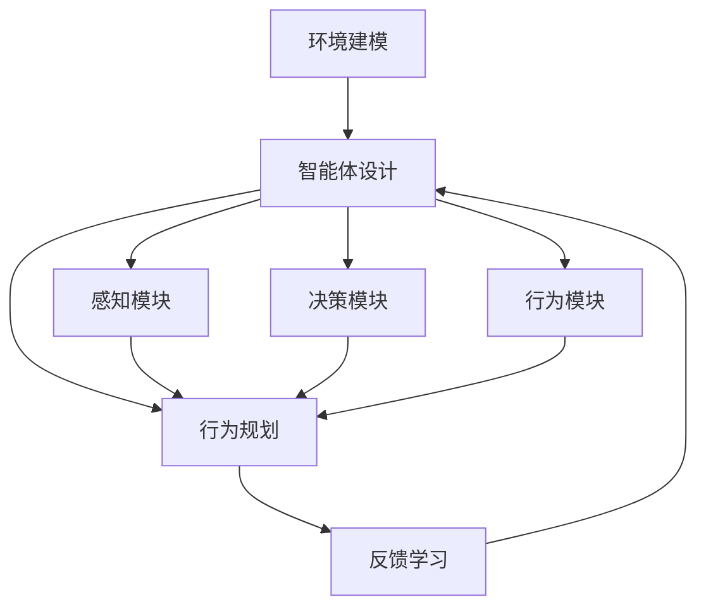
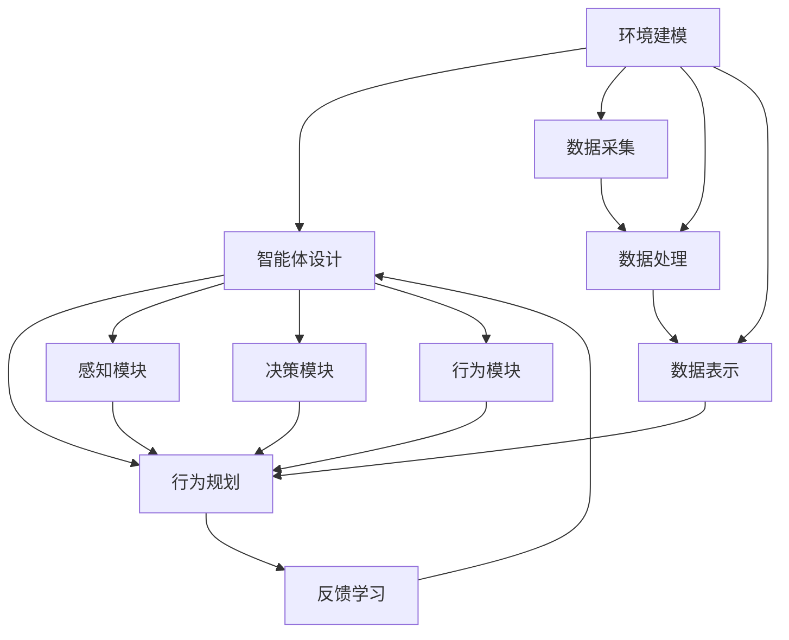
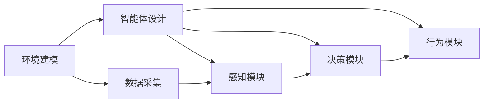
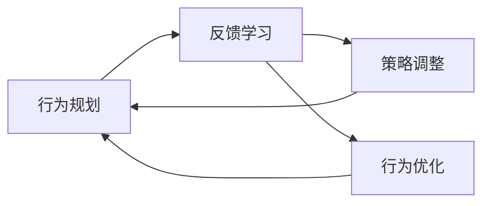
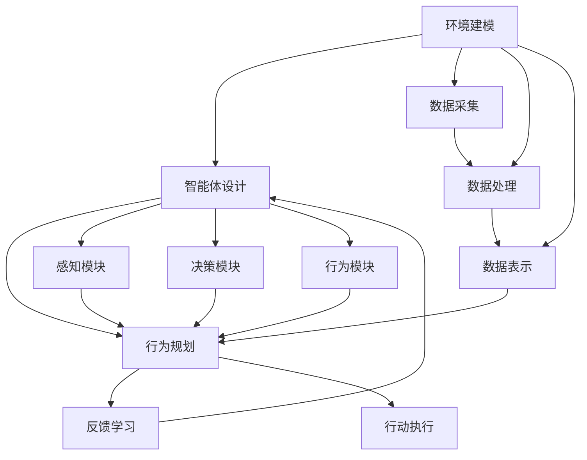

                 

# AI Agent构建的四大要素

AI Agent的构建涉及多个要素，每个要素都至关重要，共同影响着AI Agent的性能、效率和实用性。本文将全面解析构建AI Agent的四大核心要素：环境建模、智能体设计、行为规划和反馈学习。通过深入理解这些要素及其相互关系，我们可以更好地设计、实现和优化AI Agent，以应对各种复杂环境下的任务。

## 1. 背景介绍

### 1.1 问题由来

近年来，随着人工智能技术的发展，AI Agent在各种领域得到了广泛应用，从自动驾驶到智能推荐系统，从机器人到游戏AI。AI Agent的构建是一个复杂的过程，涉及多个学科，包括计算机科学、控制理论、数学和心理学等。构建一个高效的AI Agent，需要综合考虑环境、智能体、行为和反馈等多个方面的因素，这些因素相互影响，共同决定了AI Agent的性能和表现。

### 1.2 问题核心关键点

AI Agent构建的核心关键点包括：

- **环境建模**：构建AI Agent的第一步，即对AI Agent所在的环境进行建模。环境建模的好坏直接影响到AI Agent的决策和行动。
- **智能体设计**：设计AI Agent的核心结构和算法，包括决策规则、学习机制等。
- **行为规划**：规划AI Agent在环境中的行为策略，即如何在环境中进行导航、决策和交互。
- **反馈学习**：通过反馈机制调整AI Agent的行为和策略，以适应环境的变化。

### 1.3 问题研究意义

理解并掌握AI Agent构建的四大要素，对于设计高效、智能、可靠的AI Agent具有重要意义。AI Agent的构建不仅可以应用于自动驾驶、机器人、游戏等高技术领域，还可以应用于智能客服、推荐系统等日常应用中，为人类生产生活带来便利和效率提升。

## 2. 核心概念与联系

### 2.1 核心概念概述

为更好地理解AI Agent构建的四大要素，本节将介绍几个密切相关的核心概念：

- **环境建模**：对AI Agent所处的物理或虚拟环境进行建模，包括环境的状态、动态特性和约束条件。
- **智能体设计**：设计AI Agent的内部结构，包括感知模块、决策模块、行为模块等。
- **行为规划**：根据环境状态和任务目标，规划AI Agent的行为策略，包括路径规划、动作生成等。
- **反馈学习**：通过反馈信息调整AI Agent的行为和策略，使其不断优化和适应环境。

这些核心概念之间的逻辑关系可以通过以下Mermaid流程图来展示：



这个流程图展示了大语言模型微调过程中各个核心概念的关系和作用：

1. 环境建模为智能体提供了行动的基础。
2. 智能体设计是构建AI Agent的核心，通过感知、决策和行为模块实现智能体的功能。
3. 行为规划根据环境状态和任务目标，规划AI Agent的行为策略。
4. 反馈学习通过不断调整AI Agent的行为和策略，使其适应环境的变化。

### 2.2 概念间的关系

这些核心概念之间存在着紧密的联系，形成了AI Agent构建的完整生态系统。下面我们通过几个Mermaid流程图来展示这些概念之间的关系。

#### 2.2.1 AI Agent的学习范式



这个流程图展示了大语言模型微调的基本原理，以及它与AI Agent构建的关系。环境建模涉及数据采集和处理，智能体设计需要数据表示，行为规划依赖于环境建模和智能体设计。

#### 2.2.2 环境建模与智能体设计的关系



这个流程图展示了环境建模和智能体设计之间的关系。环境建模提供了数据采集和表示，智能体设计包括感知、决策和行为模块，这些模块需要环境建模提供的数据进行运作。

#### 2.2.3 行为规划与反馈学习的关系



这个流程图展示了行为规划和反馈学习之间的关系。行为规划规划AI Agent的行为策略，反馈学习通过策略调整和行为优化，使AI Agent不断适应环境变化。

### 2.3 核心概念的整体架构

最后，我们用一个综合的流程图来展示这些核心概念在大语言模型微调过程中的整体架构：



这个综合流程图展示了从环境建模到行动执行的完整过程。环境建模提供数据采集和表示，智能体设计包括感知、决策和行为模块，行为规划根据环境状态和任务目标规划行动策略，反馈学习通过策略调整和行为优化不断优化AI Agent的行为。

## 3. 核心算法原理 & 具体操作步骤

### 3.1 算法原理概述

AI Agent构建的核心算法原理包括智能体的感知、决策和行动执行，以及通过反馈机制对AI Agent进行优化和调整。

智能体的感知模块负责从环境中获取信息，决策模块根据感知信息进行决策，行为模块根据决策结果执行相应行动。通过不断循环这些过程，AI Agent能够在环境中逐步学习和优化。

### 3.2 算法步骤详解

AI Agent构建的步骤主要包括以下几个关键步骤：

**Step 1: 环境建模**
- 收集AI Agent所在环境的数据，包括物理环境、虚拟环境和用户反馈等。
- 对数据进行预处理，如噪声过滤、数据归一化等。
- 使用合适的数据表示方法，如状态表示、符号表示等。

**Step 2: 智能体设计**
- 设计AI Agent的内部结构，包括感知模块、决策模块和行为模块。
- 选择合适的算法和模型，如深度学习、强化学习等。
- 确定智能体的决策规则和学习机制。

**Step 3: 行为规划**
- 根据环境状态和任务目标，规划AI Agent的行为策略。
- 使用路径规划算法，如A*、RRT等，规划AI Agent的行动路径。
- 使用动作生成算法，如策略搜索、概率规划等，生成具体的行动方案。

**Step 4: 反馈学习**
- 通过反馈信息调整AI Agent的行为和策略。
- 使用在线学习算法，如Q-learning、SARSA等，根据反馈信息调整智能体的决策规则。
- 定期对AI Agent进行评估和优化，提高其性能和鲁棒性。

### 3.3 算法优缺点

AI Agent构建的算法具有以下优点：

- **灵活性**：通过智能体设计和行为规划，AI Agent能够适应各种复杂环境。
- **可扩展性**：AI Agent的感知、决策和行为模块可以灵活组合和扩展，适应不同任务需求。
- **自适应性**：通过反馈学习，AI Agent能够不断优化和适应环境变化。

同时，这些算法也存在以下缺点：

- **复杂性**：构建AI Agent需要综合考虑环境建模、智能体设计和反馈学习等多个方面，实现过程较为复杂。
- **数据依赖**：AI Agent的性能高度依赖于数据的质量和数量，获取高质量数据成本较高。
- **鲁棒性不足**：AI Agent在面对未知和复杂环境时，鲁棒性可能不足，容易发生误判和决策错误。

### 3.4 算法应用领域

AI Agent构建的算法在许多领域得到了广泛应用，包括但不限于：

- **自动驾驶**：通过感知模块获取道路信息，决策模块规划驾驶路径，行为模块控制车辆行驶。
- **机器人**：通过感知模块获取环境信息，决策模块规划运动路径，行为模块控制机器人动作。
- **游戏AI**：通过感知模块获取游戏界面信息，决策模块规划游戏策略，行为模块执行游戏动作。
- **智能推荐系统**：通过感知模块获取用户行为数据，决策模块推荐物品，行为模块优化推荐策略。

## 4. 数学模型和公式 & 详细讲解 & 举例说明

### 4.1 数学模型构建

AI Agent构建的数学模型主要包括环境建模、智能体设计和反馈学习三个部分。

**环境建模**：对环境进行建模，可以采用状态空间模型或概率模型。例如，可以使用马尔可夫决策过程（MDP）来表示环境状态和行动之间的关系。

**智能体设计**：智能体的感知、决策和行为模块可以使用不同的数学模型表示。例如，可以使用深度神经网络来表示感知模块，使用强化学习算法来表示决策和行为模块。

**反馈学习**：反馈学习通常使用在线学习算法，如Q-learning、SARSA等。这些算法通过不断调整模型参数，使AI Agent不断优化和适应环境。

### 4.2 公式推导过程

以下我们以强化学习算法中的Q-learning为例，推导其公式及其计算过程。

假设AI Agent在环境中的状态集合为 $S$，行动集合为 $A$，奖赏函数为 $r(s,a)$，状态转移概率为 $P(s_{t+1}|s_t,a_t)$。Q-learning的目标是找到一个最优策略 $\pi$，使得在长期运行中最大化累计奖赏。

Q-learning的更新公式为：

$$
Q(s_t,a_t) \leftarrow Q(s_t,a_t) + \alpha [r(s_t,a_t) + \gamma \max_{a'} Q(s_{t+1},a')] - Q(s_t,a_t)
$$

其中，$\alpha$ 为学习率，$\gamma$ 为折扣因子。Q-learning通过不断更新状态-行动对的Q值，调整AI Agent的决策策略，以达到最大化累计奖赏的目标。

### 4.3 案例分析与讲解

以一个简单的机器人导航问题为例，分析AI Agent构建的过程：

- **环境建模**：假设机器人在二维平面上进行导航，环境状态由机器人当前位置和方向组成，行动集合为向前、向后、左转、右转。
- **智能体设计**：设计机器人的感知模块，如摄像头、激光雷达等；决策模块，如规则基线、深度学习等；行为模块，如电机控制等。
- **行为规划**：根据机器人当前位置和目标位置，规划导航路径，使用A*算法生成路径；使用行为模块控制机器人执行路径规划。
- **反馈学习**：在机器人执行路径时，收集环境反馈，如障碍物位置、地磁场等，根据反馈信息调整路径规划算法和动作生成算法，优化机器人的导航性能。

## 5. 项目实践：代码实例和详细解释说明

### 5.1 开发环境搭建

在进行AI Agent构建的实践前，我们需要准备好开发环境。以下是使用Python进行PyTorch开发的环境配置流程：

1. 安装Anaconda：从官网下载并安装Anaconda，用于创建独立的Python环境。

2. 创建并激活虚拟环境：
```bash
conda create -n pytorch-env python=3.8 
conda activate pytorch-env
```

3. 安装PyTorch：根据CUDA版本，从官网获取对应的安装命令。例如：
```bash
conda install pytorch torchvision torchaudio cudatoolkit=11.1 -c pytorch -c conda-forge
```

4. 安装TensorFlow：从官网下载并安装TensorFlow，支持Python 3.x版本。

5. 安装各类工具包：
```bash
pip install numpy pandas scikit-learn matplotlib tqdm jupyter notebook ipython
```

完成上述步骤后，即可在`pytorch-env`环境中开始AI Agent构建的实践。

### 5.2 源代码详细实现

我们以一个简单的AI Agent构建为例，展示如何使用PyTorch实现机器人导航问题。

首先，定义AI Agent的环境：

```python
from gym import spaces

class NavigationEnv(gym.Env):
    def __init__(self):
        self.observation_space = spaces.Discrete(16)
        self.action_space = spaces.Discrete(4)
        self.state = [0, 0]
        self.goal = [3, 3]
        self.current_reward = 0
        
    def step(self, action):
        next_state = self.state
        if action == 0: # 向前
            next_state[0] += 1
        elif action == 1: # 向后
            next_state[0] -= 1
        elif action == 2: # 向左
            next_state[1] -= 1
        elif action == 3: # 向右
            next_state[1] += 1
        next_state = self._clip(next_state)
        self.state = next_state
        reward = -0.001
        done = (next_state[0] == self.goal[0] and next_state[1] == self.goal[1])
        self.current_reward += reward
        return next_state, reward, done, {'current_reward': self.current_reward}
        
    def reset(self):
        self.state = [0, 0]
        self.current_reward = 0
        return self.state
        
    def render(self):
        pass
        
    def _clip(self, state):
        return [max(0, min(state[0], 3)), max(0, min(state[1], 3))]
```

然后，定义AI Agent的智能体：

```python
import torch
import torch.nn as nn
import torch.optim as optim

class QNetwork(nn.Module):
    def __init__(self, input_size, output_size):
        super(QNetwork, self).__init__()
        self.fc1 = nn.Linear(input_size, 128)
        self.fc2 = nn.Linear(128, 128)
        self.fc3 = nn.Linear(128, output_size)
        
    def forward(self, x):
        x = torch.relu(self.fc1(x))
        x = torch.relu(self.fc2(x))
        x = self.fc3(x)
        return x

class Agent:
    def __init__(self, env, input_size, output_size):
        self.env = env
        self.input_size = input_size
        self.output_size = output_size
        self.model = QNetwork(input_size, output_size)
        self.optimizer = optim.Adam(self.model.parameters(), lr=0.001)
        self.gamma = 0.99
        self.epsilon = 1.0
        self.epsilon_min = 0.01
        
    def act(self, state):
        if np.random.rand() < self.epsilon:
            action = np.random.choice(self.env.action_space.n)
        else:
            with torch.no_grad():
                state = torch.tensor(state, dtype=torch.float32)
                action_scores = self.model(state).detach().cpu().numpy()[0]
            action = np.argmax(action_scores)
        return action
        
    def train(self, max_episodes=1000, batch_size=32):
        for episode in range(max_episodes):
            state = self.env.reset()
            done = False
            total_reward = 0
            while not done:
                action = self.act(state)
                next_state, reward, done, _ = self.env.step(action)
                self.total_reward += reward
                self._update(state, next_state, action, reward, done)
                state = next_state
            if episode % 100 == 0:
                print(f"Episode {episode}, Total Reward: {self.total_reward:.3f}")
            self.total_reward = 0
        self.epsilon *= 0.99
        if self.epsilon < self.epsilon_min:
            self.epsilon = self.epsilon_min
        
    def _update(self, state, next_state, action, reward, done):
        state_tensor = torch.tensor(state, dtype=torch.float32)
        next_state_tensor = torch.tensor(next_state, dtype=torch.float32)
        action_tensor = torch.tensor([action], dtype=torch.long)
        target = reward + self.gamma * self.model(next_state_tensor).max().item()
        pred = self.model(state_tensor).gather(1, action_tensor).detach()
        loss = (target - pred).pow(2).mean()
        self.optimizer.zero_grad()
        loss.backward()
        self.optimizer.step()
```

最后，启动AI Agent训练流程：

```python
import numpy as np

env = NavigationEnv()
agent = Agent(env, 2, 4)
for episode in range(1000):
    env.reset()
    state = env.state
    done = False
    total_reward = 0
    while not done:
        action = agent.act(state)
        next_state, reward, done, _ = env.step(action)
        agent.total_reward += reward
        agent._update(state, next_state, action, reward, done)
        state = next_state
    if episode % 100 == 0:
        print(f"Episode {episode}, Total Reward: {agent.total_reward:.3f}")
        agent.total_reward = 0
```

以上就是使用PyTorch对机器人导航问题进行AI Agent构建的完整代码实现。可以看到，通过简单的状态表示和动作生成，以及Q-learning算法，AI Agent能够在环境中不断学习和优化，最终成功导航到目标位置。

### 5.3 代码解读与分析

让我们再详细解读一下关键代码的实现细节：

**NavigationEnv类**：
- `__init__`方法：初始化环境状态、目标位置和当前奖赏。
- `step`方法：根据动作执行一步，并返回状态、奖赏、是否到达目标和额外信息。
- `reset`方法：重置环境状态和当前奖赏。
- `render`方法：绘制环境状态。
- `_clip`方法：将状态限制在可行范围内。

**QNetwork类**：
- `__init__`方法：初始化神经网络模型。
- `forward`方法：前向传播计算输出值。

**Agent类**：
- `__init__`方法：初始化智能体和模型参数。
- `act`方法：根据当前状态和epsilon策略生成动作。
- `train`方法：通过Q-learning算法训练智能体。
- `_update`方法：计算Q值更新，并更新模型参数。

**train方法**：
- 在每个 episode 中，通过状态更新、动作生成、状态更新、Q值更新和参数更新，完成AI Agent的训练。
- 打印当前episode的总奖赏，并调整epsilon策略。

通过上述代码，我们可以看到AI Agent构建的实现过程，包括环境建模、智能体设计、行为规划和反馈学习。这为AI Agent在复杂环境中的应用提供了基础和参考。

## 6. 实际应用场景

### 6.1 智能客服系统

基于AI Agent构建的智能客服系统，可以自动处理客户咨询，快速响应客户需求，提高客户满意度。智能客服系统通常需要处理大量的客户请求，包括常见问题解答、订单处理、投诉处理等。AI Agent可以通过训练，学习客户对话中的常见问题和解答，自动生成回答，提高响应速度和质量。

### 6.2 金融舆情监测

AI Agent可以应用于金融舆情监测，通过分析社交媒体、新闻网站等公开信息，实时监测市场动态和舆情变化，辅助决策。AI Agent可以构建知识图谱，提取新闻标题、评论、观点等关键信息，进行情感分析和舆情预测，提供投资建议。

### 6.3 个性化推荐系统

基于AI Agent的个性化推荐系统，可以实时分析用户行为数据，动态生成推荐内容，提升用户体验。推荐系统通常需要处理海量的用户数据，包括浏览历史、评分、评价等。AI Agent可以通过学习用户行为模式，生成个性化推荐，提高推荐效果和用户满意度。

### 6.4 未来应用展望

随着AI Agent构建技术的不断进步，未来将有更多领域受益于AI Agent的智能应用。

- **智慧医疗**：AI Agent可以用于病历分析、病情预测、诊断建议等，提高医疗服务的智能化水平。
- **智能教育**：AI Agent可以用于个性化教学、作业批改、学习分析等，因材施教，提高教育质量。
- **智能家居**：AI Agent可以用于智能控制、语音交互、场景理解等，提升家居智能化水平。
- **自动驾驶**：AI Agent可以用于环境感知、路径规划、决策控制等，提高自动驾驶系统的安全性。

AI Agent构建技术将在更多领域得到应用，为人类生产生活带来变革性影响。

## 7. 工具和资源推荐

### 7.1 学习资源推荐

为了帮助开发者系统掌握AI Agent构建的理论基础和实践技巧，这里推荐一些优质的学习资源：

1. 《深度学习》系列书籍：由多位深度学习领域的专家合著，系统介绍了深度学习的基本概念和算法。
2. 《强化学习》系列书籍：由著名强化学习专家编写，全面讲解了强化学习的理论和算法。
3. 《AI基础》在线课程：包括计算机视觉、自然语言处理、强化学习等多个方向，涵盖基础知识和实战案例。
4. 《OpenAI Gym》官方文档：提供了丰富的环境和智能体库，支持多种强化学习算法的实验和调试。
5. 《PyTorch官方文档》：提供了深度学习框架PyTorch的全面介绍和实例代码。

通过对这些资源的学习实践，相信你一定能够快速掌握AI Agent构建的精髓，并用于解决实际的AI问题。

### 7.2 开发工具推荐

高效的开发离不开优秀的工具支持。以下是几款用于AI Agent构建开发的常用工具：

1. PyTorch：基于Python的开源深度学习框架，灵活动态的计算图，适合快速迭代研究。支持多种深度学习模型和算法。
2. TensorFlow：由Google主导开发的开源深度学习框架，生产部署方便，适合大规模工程应用。支持多种深度学习模型和算法。
3. OpenAI Gym：提供了丰富的环境和智能体库，支持多种强化学习算法的实验和调试。
4. Weights & Biases：模型训练的实验跟踪工具，可以记录和可视化模型训练过程中的各项指标，方便对比和调优。
5. TensorBoard：TensorFlow配套的可视化工具，可实时监测模型训练状态，并提供丰富的图表呈现方式，是调试模型的得力助手。
6. Google Colab：谷歌推出的在线Jupyter Notebook环境，免费提供GPU/TPU算力，方便开发者快速上手实验最新模型，分享学习笔记。

合理利用这些工具，可以显著提升AI Agent构建的开发效率，加快创新迭代的步伐。

### 7.3 相关论文推荐

AI Agent构建的研究源于学界的持续研究。以下是几篇奠基性的相关论文，推荐阅读：

1. DQN: Deep Reinforcement Learning for Humanoid Robotics：提出深度Q网络（DQN）算法，在复杂环境下的强化学习问题上取得突破。
2. AlphaGo Zero: Mastering the Game of Go without Human Knowledge：提出AlphaGo Zero算法，在无监督的强化学习中取得显著成就。
3. Attention Is All You Need：提出Transformer结构，开启了NLP领域的预训练大模型时代。
4. DeepMind的AlphaStar：使用强化学习算法，让AI Agent在复杂游戏环境中超越人类高手。
5. TensorFlow Agents：提供了丰富的强化学习算法库，支持多种智能体和环境的设计和调试。

这些论文代表了大语言模型微调技术的发展脉络。通过学习这些前沿成果，可以帮助研究者把握学科前进方向，激发更多的创新灵感。

除上述资源外，还有一些值得关注的前沿资源，帮助开发者紧跟AI Agent构建技术的最新进展，例如：

1. arXiv论文预印本：人工智能领域最新研究成果的发布平台，包括大量尚未发表的前沿工作，学习前沿技术的必读资源。
2. 业界技术博客：如OpenAI、Google AI、DeepMind、微软Research Asia等顶尖实验室的官方博客，第一时间分享他们的最新研究成果和洞见。
3. 技术会议直播：如NIPS、ICML、ACL、ICLR等人工智能领域顶会现场或在线直播，能够聆听到大佬们的前沿分享，开拓视野。
4. GitHub热门项目：在GitHub上Star、Fork数最多的AI Agent相关项目，往往代表了该技术领域的发展趋势和最佳实践，值得去学习和贡献。
5. 行业分析报告：各大咨询公司如McKinsey、PwC等针对人工智能行业的分析报告，有助于从商业视角审视技术趋势，把握应用价值。

总之，对于AI Agent构建技术的学习和实践，需要开发者保持开放的心态和持续学习的意愿。多关注前沿资讯，多动手实践，多思考总结，必将收获满满的成长收益。

## 8. 总结：未来发展趋势与挑战

### 8.1 总结

本文对AI Agent构建的四大核心要素进行了全面系统的介绍。首先阐述了AI Agent构建的背景和意义，明确了环境建模、智能体设计、行为规划和反馈学习四个要素对AI Agent性能和表现的重要性。其次，从原理到实践，详细讲解了AI Agent构建的数学模型和算法步骤，给出了AI Agent构建的完整代码实例。同时，本文还广泛探讨了AI Agent在智能客服、金融舆情、个性化推荐等领域的实际应用，展示了

