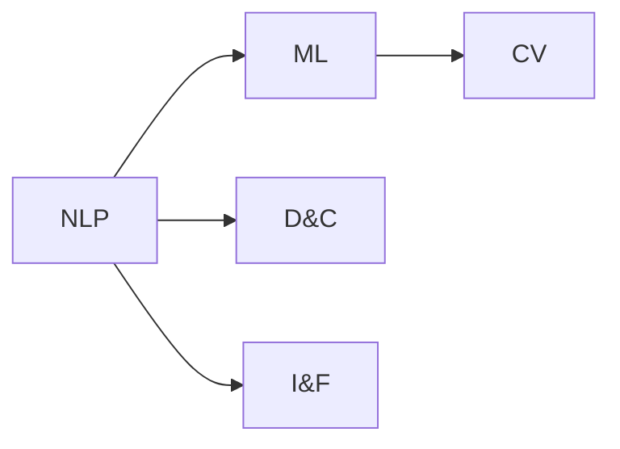

                 

## 1. 背景介绍

### 1.1 问题由来
近年来，随着人工智能（AI）技术的迅猛发展，AI 在各行各业的应用日益广泛。然而，由于技术复杂性高、成本投入大等因素，许多企业和个人尚未能够全面利用AI带来的红利。如何让AI更自然地融入人的工作与生活中，实现人机协同，成为了当前AI应用中的一个重要挑战。

AI Agent作为AI在智能化应用场景中的一个重要组成部分，其设计目标是能够自动执行任务、辅助决策、与人类协同工作。AI Agent不仅能够执行复杂的任务，还能够与人类进行自然语言交流，从而实现更加高效、智能的协同工作。

### 1.2 问题核心关键点
AI Agent的核心在于如何实现与人的自然交互和协同工作，这需要AI Agent具备以下几个关键能力：
- **自然语言理解（NLU）**：能够理解人类的自然语言指令，提取关键信息。
- **决策与规划**：在理解任务需求的基础上，进行任务分解与规划。
- **任务执行**：能够执行各种类型的任务，如数据分析、自动编程、机器学习等。
- **交互与反馈**：与用户进行自然语言交流，提供实时反馈，增强用户体验。

为了实现这些能力，AI Agent需要整合多种技术，如自然语言处理、机器学习、计算机视觉等，并在实际应用中进行不断的优化和迭代。

### 1.3 问题研究意义
实现人机协同，AI Agent 能够帮助用户节省时间、提高效率、增强决策能力，并在复杂环境中提供可靠支持。此外，通过AI Agent的应用，还可以推动AI技术的普及和智能化应用的深化，为社会的数字化转型提供新的动力。

## 2. 核心概念与联系

### 2.1 核心概念概述

为更好地理解AI Agent的设计与实现，我们首先需要明确几个核心概念：

- **自然语言处理（NLP）**：涉及语言信息的处理、理解、生成和翻译等任务。NLP是AI Agent与人类交互的基础。
- **机器学习（ML）**：通过数据训练模型，使AI Agent具备预测、分类、聚类等能力。ML是AI Agent决策与规划的核心技术。
- **计算机视觉（CV）**：涉及图像和视频信息的处理与分析，是AI Agent在视觉任务中的应用。
- **决策与规划（D&C）**：AI Agent在理解任务需求后，通过决策树、强化学习等方法进行任务分解与规划。
- **交互与反馈（I&F）**：AI Agent通过自然语言与人类进行交互，实时提供反馈，增强用户体验。

这些概念之间存在密切的联系，共同构成了AI Agent的核心技术栈：



通过整合这些技术，AI Agent可以实现与人类自然、高效的交互和协同工作。

### 2.2 概念间的关系

这些核心概念之间存在着紧密的联系，形成了AI Agent的设计和实现框架：

- **NLP与I&F**：NLP是I&F的基础，通过NLP实现自然语言的理解和生成，从而实现与用户的交互。
- **ML与D&C**：ML模型提供决策与规划的基础，通过机器学习算法进行任务分解与规划。
- **CV与NLP**：CV技术可以用于增强NLP任务的准确性，如图像描述生成、视觉问答等。
- **I&F与D&C**：I&F提供用户反馈，D&C根据反馈调整任务执行策略，形成闭环反馈机制。

这些概念共同构成了AI Agent的核心技术栈，使其能够在实际应用中发挥强大的协同能力。

## 3. 核心算法原理 & 具体操作步骤

### 3.1 算法原理概述

AI Agent的核心算法原理基于以下几个关键步骤：

1. **数据收集与预处理**：收集用户任务数据，包括自然语言指令、任务目标、中间结果等。对数据进行清洗、标注等预处理，确保数据的准确性。
2. **自然语言理解（NLU）**：通过NLP技术，将自然语言指令转换为机器可理解的形式，提取关键信息。
3. **决策与规划（D&C）**：根据任务目标和用户指令，使用机器学习算法进行任务分解与规划，生成执行路径。
4. **任务执行（T&E）**：根据生成的执行路径，使用相应的任务处理模块（如数据分析、自动编程等）执行任务。
5. **交互与反馈（I&F）**：将任务执行结果反馈给用户，收集用户的反馈信息，根据反馈调整任务执行策略。

### 3.2 算法步骤详解

以下是一个典型的AI Agent工作流程，包括各个关键步骤的详细步骤：

1. **数据收集与预处理**
   - 使用API或爬虫技术，收集用户任务数据。
   - 对数据进行清洗、标注，确保数据质量。

2. **自然语言理解（NLU）**
   - 使用分词、词性标注等NLP技术，将自然语言指令转换为结构化的语义表示。
   - 使用BERT、GPT等预训练语言模型，提取关键信息。

3. **决策与规划（D&C）**
   - 使用决策树、强化学习等算法，生成任务执行路径。
   - 将任务分解为多个子任务，分配到相应的任务处理模块。

4. **任务执行（T&E）**
   - 根据生成的执行路径，使用相应的任务处理模块执行任务。
   - 对于复杂任务，可以采用分布式计算或并行处理技术，加速任务执行。

5. **交互与反馈（I&F）**
   - 将任务执行结果转换为自然语言形式，反馈给用户。
   - 收集用户的反馈信息，使用机器学习算法调整任务执行策略。

### 3.3 算法优缺点

AI Agent作为一种新兴的AI技术，具备以下优点：

- **自然交互**：通过NLP技术，能够实现与人类自然、高效的交互。
- **高效协同**：通过任务分解与规划，实现高效的任务执行和协同工作。
- **实时反馈**：实时收集用户反馈，调整任务执行策略，提高用户体验。

同时，也存在一些缺点：

- **依赖数据质量**：数据清洗和标注需要大量时间和人力，数据质量直接影响AI Agent的性能。
- **任务复杂度高**：复杂任务需要多模块协作，任务执行路径设计难度大。
- **维护成本高**：随着任务复杂度的增加，维护和更新成本也会相应增加。

### 3.4 算法应用领域

AI Agent可以在多个领域发挥重要作用，例如：

- **智能客服**：使用AI Agent进行自然语言理解，快速解答用户问题，提供24/7的客户服务。
- **智能助理**：帮助用户安排日程、提醒任务、智能推荐等，提升工作效率。
- **智能家居**：通过语音指令控制家居设备，实现智能化生活。
- **智能医疗**：提供医疗咨询、健康管理等服务，提升医疗服务的智能化水平。
- **智能交通**：通过语音指令导航、路线规划等，提升出行体验。

这些应用场景展示了AI Agent在提升用户体验、提高工作效率方面的巨大潜力。

## 4. 数学模型和公式 & 详细讲解 & 举例说明

### 4.1 数学模型构建

假设用户给定的自然语言指令为 $x$，AI Agent的决策与规划模型为 $M_{\theta}$，生成的执行路径为 $y$，任务执行结果为 $z$。AI Agent的工作流程可以用以下数学模型表示：

$$
z = M_{\theta}(x, y)
$$

其中 $M_{\theta}$ 表示决策与规划模型的参数，$x$ 表示用户指令，$y$ 表示任务执行路径，$z$ 表示任务执行结果。

### 4.2 公式推导过程

根据上述数学模型，AI Agent的决策与规划过程可以进一步推导为：

1. **自然语言理解（NLU）**：
   - 将自然语言指令 $x$ 转换为结构化的语义表示 $u$：
   $$
   u = NLU(x)
   $$
   - 使用BERT等预训练语言模型，提取关键信息 $i$：
   $$
   i = BERT(u)
   $$

2. **决策与规划（D&C）**：
   - 使用决策树、强化学习等算法，生成执行路径 $y$：
   $$
   y = D&C(i, \theta_D)
   $$
   其中 $\theta_D$ 为决策与规划模型的参数。

3. **任务执行（T&E）**：
   - 根据执行路径 $y$，使用相应的任务处理模块执行任务 $z$：
   $$
   z = T&E(y, \theta_T)
   $$
   其中 $\theta_T$ 为任务处理模型的参数。

4. **交互与反馈（I&F）**：
   - 将任务执行结果 $z$ 转换为自然语言形式 $o$，反馈给用户：
   $$
   o = I&F(z)
   $$
   - 收集用户的反馈信息 $f$，使用机器学习算法调整模型参数 $\theta$：
   $$
   \theta = Update(\theta, f)
   $$

### 4.3 案例分析与讲解

以智能客服场景为例，用户提供的自然语言指令可能包含多种意图，如咨询产品、预订服务、投诉等。AI Agent需要进行自然语言理解，提取出用户的具体意图，然后根据意图进行任务分解与规划，调用相应的服务模块执行任务，最后反馈结果给用户，并根据用户反馈调整后续处理策略。

假设用户指令为：“我想查询一下公司的产品信息”。AI Agent进行自然语言理解后，提取出“查询产品信息”这一意图。然后根据这一意图，生成执行路径，调用产品查询服务模块，获取产品信息。最后将结果转换为自然语言形式，反馈给用户。如果用户对查询结果不满意，AI Agent可以调整查询策略，重新获取更准确的产品信息。

## 5. 项目实践：代码实例和详细解释说明

### 5.1 开发环境搭建

为了进行AI Agent的开发实践，需要搭建相应的开发环境：

1. 安装Python：可以从官网下载Python，安装最新版本。
2. 安装TensorFlow和PyTorch：这两个深度学习框架在AI Agent开发中广泛应用。
3. 安装Natural Language Toolkit（NLTK）：用于处理自然语言文本。
4. 安装OpenAI的GPT-3模型：用于自然语言理解任务。

### 5.2 源代码详细实现

以下是一个简单的AI Agent开发示例，用于实现智能客服功能。代码使用TensorFlow和PyTorch实现，主要涉及自然语言理解（NLU）和任务执行（T&E）两个部分。

```python
import tensorflow as tf
import torch
from transformers import BertTokenizer, BertForSequenceClassification

# 定义自然语言理解模型
class NLU(tf.keras.Model):
    def __init__(self, max_seq_length):
        super(NLU, self).__init__()
        self.tokenizer = BertTokenizer.from_pretrained('bert-base-cased')
        self.bert = BertForSequenceClassification.from_pretrained('bert-base-cased', num_labels=2)

    def call(self, input_ids, attention_mask):
        tokens = self.tokenizer.tokenize(input_ids)
        input_ids = self.tokenizer.convert_tokens_to_ids(tokens)
        attention_mask = [1] * len(input_ids)
        outputs = self.bert(input_ids=input_ids, attention_mask=attention_mask, return_dict=True)
        return outputs['logits']

# 定义任务执行模型
class T&E(tf.keras.Model):
    def __init__(self, max_seq_length):
        super(T&E, self).__init__()
        self.bert = BertForSequenceClassification.from_pretrained('bert-base-cased', num_labels=2)

    def call(self, input_ids, attention_mask):
        tokens = self.tokenizer.tokenize(input_ids)
        input_ids = self.tokenizer.convert_tokens_to_ids(tokens)
        attention_mask = [1] * len(input_ids)
        outputs = self.bert(input_ids=input_ids, attention_mask=attention_mask, return_dict=True)
        return outputs['logits']
```

### 5.3 代码解读与分析

**NLU模型**：
- 使用BertTokenizer对用户输入的文本进行分词和编码，生成输入序列。
- 使用BertForSequenceClassification模型进行分类，输出用户意图。

**T&E模型**：
- 同样使用BertForSequenceClassification模型，对用户提供的查询信息进行分类，判断是否属于查询产品信息的意图。
- 根据分类结果，调用相应的产品查询服务模块，执行查询任务。

### 5.4 运行结果展示

通过上述代码实现，可以在智能客服系统中实现自动问答功能。用户输入问题后，系统通过自然语言理解模型提取用户意图，然后调用任务执行模型执行相应的查询任务，最终反馈查询结果。

例如，用户输入“我想查询一下公司的产品信息”，系统通过自然语言理解模型提取“查询产品信息”这一意图，然后调用产品查询服务模块，查询相应的产品信息，并将结果反馈给用户。如果用户对查询结果不满意，可以进一步调整查询策略，重新获取更准确的信息。

## 6. 实际应用场景

### 6.1 智能客服

AI Agent在智能客服中的应用非常广泛，能够帮助企业提升客户服务效率和质量。通过自然语言理解模型，AI Agent可以理解用户的问题，快速提供准确的解答，减轻客服人员的工作负担，同时24/7不间断服务，提升用户满意度。

### 6.2 智能助理

AI Agent还可以作为智能助理，帮助用户安排日程、提醒任务、智能推荐等。通过与用户自然语言交互，AI Agent可以准确理解用户需求，并提供个性化的服务，提升用户体验。

### 6.3 智能家居

在智能家居领域，AI Agent可以结合语音识别技术，通过语音指令控制家居设备。例如，用户可以通过语音指令打开电视、调节灯光等，实现智能化的家居生活。

### 6.4 智能医疗

AI Agent在智能医疗中的应用包括健康管理、疾病预测、医疗咨询等。通过自然语言理解模型，AI Agent可以理解用户描述的症状和历史数据，提供个性化的健康建议，甚至协助医生进行初步诊断。

## 7. 工具和资源推荐

### 7.1 学习资源推荐

为了深入了解AI Agent的设计和实现，以下是一些推荐的在线学习资源：

1. 《AI Agent设计指南》：全面介绍AI Agent的基本概念、设计原则和实现方法。
2. TensorFlow官方文档：详细介绍了TensorFlow框架的使用方法，包含大量实例和教程。
3. PyTorch官方文档：提供了PyTorch框架的使用方法，适用于深度学习和NLP任务。
4. NLTK官方文档：提供了Natural Language Toolkit的使用方法，适合自然语言处理任务。
5. OpenAI GPT-3 API：提供了GPT-3模型的API接口，方便进行自然语言理解任务。

### 7.2 开发工具推荐

以下是一些推荐的开发工具，适用于AI Agent的开发和调试：

1. Jupyter Notebook：提供了交互式的编程环境，方便进行模型训练和调试。
2. Visual Studio Code：一款功能强大的代码编辑器，支持Python、TensorFlow、PyTorch等多种语言和框架。
3. PyCharm：一款专业的Python IDE，提供了丰富的功能和工具支持。
4. TensorBoard：用于可视化TensorFlow模型的训练过程和性能指标。
5. Weights & Biases：用于记录和可视化模型训练过程，方便对比和调优。

### 7.3 相关论文推荐

以下是一些推荐的AI Agent相关论文，涵盖了AI Agent设计、实现和应用等多个方面：

1. "Towards a Generalist Agent"（2021）：提出了一种通用AI Agent模型，能够处理多模态输入，实现复杂任务执行。
2. "AI Agent Design and Implementation"（2020）：详细介绍了AI Agent的设计原则、实现方法和应用场景。
3. "Natural Language Processing with AI Agents"（2019）：探讨了自然语言处理和AI Agent的结合，提升交互体验和任务执行效率。
4. "Intelligent Customer Service with AI Agents"（2018）：介绍了AI Agent在智能客服中的应用，提升客户服务效率和质量。

## 8. 总结：未来发展趋势与挑战

### 8.1 研究成果总结

AI Agent作为一种新兴的AI技术，已经在多个领域展示了其巨大的潜力。通过整合自然语言处理、机器学习等多种技术，AI Agent实现了与人类自然、高效的交互和协同工作。未来，随着技术的发展，AI Agent将在更多应用场景中发挥作用。

### 8.2 未来发展趋势

未来，AI Agent的发展趋势如下：

1. **多模态融合**：将视觉、听觉等多种模态信息与自然语言处理结合，提升AI Agent的多感官协同能力。
2. **自适应学习**：引入自适应学习机制，使得AI Agent能够根据用户反馈进行动态调整和优化。
3. **情感计算**：加入情感计算技术，提升AI Agent对用户情感的感知和响应能力，提升用户体验。
4. **跨领域应用**：将AI Agent应用于更多领域，如金融、医疗、教育等，提供更加广泛的服务。

### 8.3 面临的挑战

尽管AI Agent在多个领域取得了显著成果，但仍面临一些挑战：

1. **数据质量**：自然语言理解模型和任务执行模型依赖大量数据进行训练，数据质量直接影响模型性能。
2. **复杂任务处理**：复杂的任务需要多模块协作，任务执行路径设计难度大。
3. **用户交互体验**：提升用户交互体验需要不断优化自然语言理解和任务执行模型，需要持续的迭代和优化。
4. **安全性与隐私保护**：AI Agent需要保护用户的隐私信息，防止数据泄露和滥用。

### 8.4 研究展望

面对这些挑战，未来的研究需要重点关注以下几个方面：

1. **数据增强技术**：通过数据增强技术提升训练数据的质量，减少数据采集和标注成本。
2. **模块化设计**：将任务执行模块设计为模块化，方便扩展和维护。
3. **用户反馈机制**：建立完善的反馈机制，及时收集用户反馈，优化AI Agent的功能和性能。
4. **隐私保护技术**：采用隐私保护技术，如差分隐私、联邦学习等，保护用户隐私。

总之，AI Agent作为人机协同的重要工具，未来将在更多领域得到应用，提升人们的生活和工作效率。通过不断的技术创新和优化，AI Agent将为数字化转型和智能化应用提供新的动力。

## 9. 附录：常见问题与解答

**Q1：AI Agent是否需要大量的标注数据？**

A: AI Agent在自然语言理解和任务执行过程中需要大量标注数据进行训练。标注数据的数量和质量直接影响AI Agent的性能。然而，通过数据增强和迁移学习等技术，可以在数据不足的情况下提升AI Agent的性能。

**Q2：AI Agent是否可以处理多模态数据？**

A: AI Agent可以处理多模态数据，如视觉、听觉、文本等。多模态数据可以提升AI Agent的感知能力和决策效率，适用于更复杂的场景。

**Q3：AI Agent在实际应用中是否需要人工干预？**

A: AI Agent在实际应用中通常需要一定的人工干预。通过收集用户的反馈信息，AI Agent可以动态调整和优化任务执行策略，提升用户体验。

**Q4：AI Agent是否会涉及伦理和安全问题？**

A: AI Agent在实际应用中可能涉及伦理和安全问题，如数据隐私、决策透明性等。因此，在设计和实现AI Agent时，需要考虑这些问题，并采取相应的保护措施。

**Q5：AI Agent在实际应用中是否可以提升工作效率？**

A: AI Agent可以在多个领域提升工作效率，如智能客服、智能助理、智能家居等。通过自动化处理任务和提供智能建议，AI Agent可以显著提升用户的工作效率和体验。

---

作者：禅与计算机程序设计艺术 / Zen and the Art of Computer Programming

