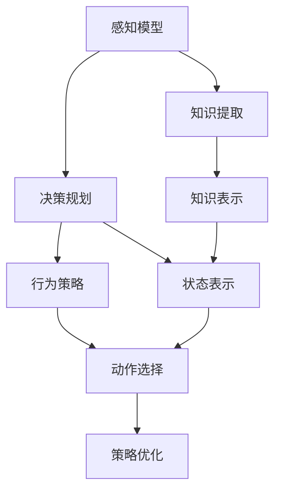
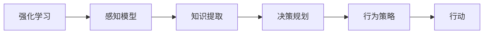
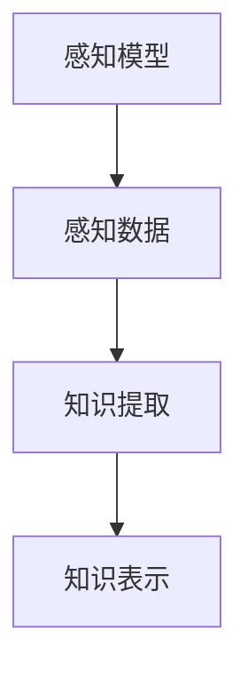
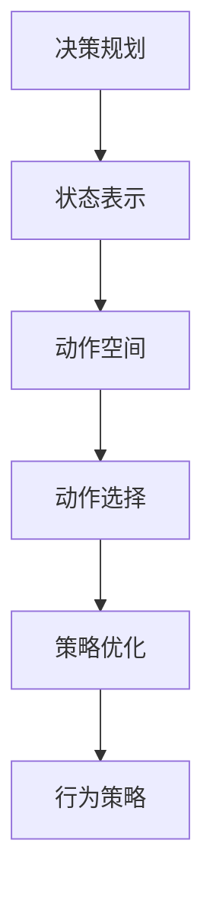
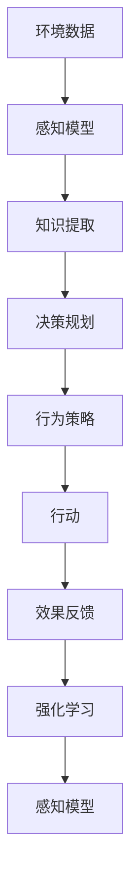

                 

# AI Agent通过感知从环境中收集信息并提取相关知识。然后通过规划为了达到某个目标做出决策

> 关键词：AI Agent, 感知与感知环境, 知识提取, 决策规划, 自然语言处理(NLP), 强化学习(Reinforcement Learning), 自监督学习(Self-Supervised Learning), 行为策略(Behavior Strategy)

## 1. 背景介绍

### 1.1 问题由来

在人工智能领域，AI Agent 已成为研究热点之一。AI Agent 是指具有自主决策能力的智能体，能够在复杂环境中通过学习与执行策略，实现特定目标。这一概念最早在心理学和计算机科学中提出，现已被广泛应用于机器人、自动化、推荐系统、游戏AI等多个领域。

AI Agent的核心目标是实现自主感知与决策，使其能够在未知或变化的环境中，基于环境信息做出高效、合理的行为。早期，AI Agent主要依赖规则或手工编程，但这种方法在复杂多变的环境下效果有限，难以处理实时动态变化的信息。随着深度学习和强化学习等技术的进步，AI Agent的感知和决策能力显著提升，能够基于大量数据进行自主学习，从而适应复杂多变的动态环境。

### 1.2 问题核心关键点

AI Agent的感知与决策涉及核心算法和技术，主要包括：

- 感知模型(Perception Model)：用于从环境中提取信息，是AI Agent决策的基础。感知模型需要具备高鲁棒性、低延时和高精度。
- 知识提取(Knowledge Extraction)：将感知到的信息转化为可用于决策的知识，需要考虑知识表示、关联和学习等问题。
- 决策规划(Decision Planning)：根据已有知识，规划最优策略以实现目标。决策规划需要考虑动作、奖惩和动态变化等因素。
- 行为策略(Behavior Strategy)：根据当前环境和目标，选择最合适的行动方案。行为策略需要考虑实时性、安全性、可解释性和适应性等因素。

这些问题相互关联，共同构成AI Agent的核心技术体系，旨在实现从感知到决策的全链条智能化。本文将围绕这些关键点，对AI Agent的感知、知识提取和决策规划进行详细阐述，并结合实例和案例分析，探讨其应用与实践。

## 2. 核心概念与联系

### 2.1 核心概念概述

为更好地理解AI Agent的感知、知识提取和决策规划，本节将介绍几个密切相关的核心概念：

- **感知模型(Perception Model)**：AI Agent通过传感器等手段获取环境信息，感知模型负责将原始数据转换为易于理解和处理的特征表示。感知模型包括图像处理、语音识别、自然语言处理(NLP)等子模块，用于处理不同类型的信息。
- **知识提取(Knowledge Extraction)**：将感知到的信息转化为可用于决策的知识，需要考虑知识表示、关联和学习等问题。知识提取过程包括数据清洗、特征选择、知识图谱构建等步骤。
- **决策规划(Decision Planning)**：基于已有知识，规划最优策略以实现目标。决策规划涉及状态表示、动作空间、奖励模型和策略优化等关键技术。
- **行为策略(Behavior Strategy)**：根据当前环境和目标，选择最合适的行动方案。行为策略需要考虑实时性、安全性、可解释性和适应性等因素。
- **强化学习(Reinforcement Learning, RL)**：通过试错的方式，使AI Agent在环境中不断学习，逐步优化行为策略以实现最优决策。强化学习主要包括Q-Learning、SARSA、Deep RL等算法。
- **自监督学习(Self-Supervised Learning)**：利用未标记数据训练感知和知识提取模块，提高模型泛化能力。自监督学习主要包括预训练、监督-无监督混合学习等方法。
- **多智能体系统(Multi-Agent Systems)**：由多个AI Agent组成的系统，通过协同工作实现更复杂的目标。多智能体系统需要考虑协作、通信、决策冲突等问题。

这些核心概念之间的逻辑关系可以通过以下Mermaid流程图来展示：



这个流程图展示了大语言模型的核心概念及其之间的关系：

1. 感知模型从环境中获取信息。
2. 知识提取将感知信息转化为知识。
3. 决策规划根据知识规划最优策略。
4. 行为策略选择最优动作方案。
5. 强化学习通过试错不断优化策略。
6. 自监督学习提高感知和知识提取的泛化能力。
7. 多智能体系统通过协作实现更复杂的任务。

这些概念共同构成了AI Agent的完整技术框架，使其能够在各种场景下发挥自主感知与决策能力。通过理解这些核心概念，我们可以更好地把握AI Agent的工作原理和优化方向。

### 2.2 概念间的关系

这些核心概念之间存在着紧密的联系，形成了AI Agent的完整技术生态系统。下面我通过几个Mermaid流程图来展示这些概念之间的关系。

#### 2.2.1 AI Agent的学习范式



这个流程图展示了强化学习在大语言模型中的应用过程。强化学习通过试错的方式，不断优化感知模型、知识提取、决策规划和行为策略，逐步提升AI Agent的决策能力。

#### 2.2.2 感知模型与知识提取的关系



这个流程图展示了感知模型和知识提取之间的依赖关系。感知模型负责获取环境信息，而知识提取则将感知数据转化为可用于决策的知识。

#### 2.2.3 决策规划与行为策略的关系



这个流程图展示了决策规划和行为策略之间的依赖关系。决策规划基于知识提取，规划出最优策略。行为策略则根据当前状态选择最合适的动作方案。

### 2.3 核心概念的整体架构

最后，我们用一个综合的流程图来展示这些核心概念在大语言模型微调过程中的整体架构：



这个综合流程图展示了从环境数据输入到行动输出的完整过程。感知模型从环境中获取数据，知识提取将感知数据转化为知识，决策规划根据知识规划最优策略，行为策略选择最优动作方案，最终通过行动产生效果反馈。强化学习通过效果反馈不断优化感知模型、知识提取、决策规划和行为策略，提高AI Agent的整体性能。通过这些流程图，我们可以更清晰地理解AI Agent的技术框架，为后续深入讨论具体的感知、知识提取和决策规划方法奠定基础。

## 3. 核心算法原理 & 具体操作步骤
### 3.1 算法原理概述

AI Agent的感知、知识提取和决策规划是一个连贯的流程，每个环节的目标都是为最终的目标决策服务。具体来说，AI Agent通过感知模型从环境中获取信息，通过知识提取将感知数据转化为可用于决策的知识，最终通过决策规划和行为策略选择最优动作方案，实现特定目标。

形式化地，假设AI Agent在环境 $E$ 中，其感知模型为 $P$，知识提取模型为 $K$，决策规划模型为 $D$，行为策略模型为 $B$。给定一个任务 $T$，其目标 $G$ 定义为：

$$
G = \mathop{\arg\min}_{\{P, K, D, B\}} \mathcal{L}(T,P,K,D,B)
$$

其中 $\mathcal{L}$ 为任务 $T$ 的损失函数，用于衡量模型输出与目标任务之间的差异。常见的损失函数包括交叉熵损失、均方误差损失等。

通过梯度下降等优化算法，AI Agent的训练过程不断更新模型参数 $\theta$，最小化损失函数 $\mathcal{L}$，使得模型输出逼近最优策略。由于 $\theta$ 已经通过预训练获得了较好的初始化，因此即便在小规模数据集上，AI Agent也能较快收敛到理想的行为策略 $\hat{\theta}$。

### 3.2 算法步骤详解

AI Agent的训练过程一般包括以下几个关键步骤：

**Step 1: 准备感知模型和数据集**
- 选择合适的感知模型 $P$ 作为初始化参数，如CNN、RNN、Transformer等。
- 准备任务 $T$ 的环境数据集 $D=\{(e_i, o_i)\}_{i=1}^N$，其中 $e_i$ 为环境状态，$o_i$ 为环境动作或状态变化。

**Step 2: 添加知识提取层**
- 根据任务类型，设计合适的知识提取网络 $K$，将感知模型输出的数据 $e_i$ 转化为知识表示 $z_i$。
- 对于文本处理任务，通常使用BERT、GPT等语言模型进行知识提取。
- 对于图像处理任务，通常使用CNN等卷积神经网络进行知识提取。
- 对于多模态任务，可结合多种感知模型，综合处理不同类型的数据。

**Step 3: 设置决策规划超参数**
- 选择合适的优化算法及其参数，如Adam、SGD等，设置学习率、批大小、迭代轮数等。
- 设置正则化技术及强度，包括权重衰减、Dropout、Early Stopping等。
- 确定冻结感知模型的策略，如仅微调顶层，或全部参数都参与微调。

**Step 4: 执行梯度训练**
- 将训练集数据分批次输入感知模型，前向传播计算损失函数。
- 反向传播计算参数梯度，根据设定的优化算法和学习率更新模型参数。
- 周期性在验证集上评估模型性能，根据性能指标决定是否触发 Early Stopping。
- 重复上述步骤直到满足预设的迭代轮数或 Early Stopping 条件。

**Step 5: 测试和部署**
- 在测试集上评估AI Agent的行为策略 $B$ 的性能，对比前后策略的精度提升。
- 使用训练后的模型对新环境数据进行推理预测，集成到实际的应用系统中。
- 持续收集新的环境数据，定期重新训练模型，以适应环境变化。

以上是AI Agent训练的一般流程。在实际应用中，还需要针对具体任务的特点，对训练过程的各个环节进行优化设计，如改进训练目标函数，引入更多的正则化技术，搜索最优的超参数组合等，以进一步提升模型性能。

### 3.3 算法优缺点

AI Agent的感知、知识提取和决策规划方法具有以下优点：

1. 自主学习能力：AI Agent能够自主学习感知模型、知识提取和决策规划，不需要手工编程，适应复杂多变的环境。
2. 自适应性强：AI Agent通过不断优化感知和决策模块，能够灵活适应不同环境条件和任务需求。
3. 多模态融合：结合多种感知模型和知识提取方法，AI Agent能够处理多种类型的数据，提升整体性能。
4. 高泛化能力：通过自监督学习和大规模数据预训练，AI Agent具备较强的泛化能力，能够处理未知数据。

同时，这些方法也存在一些局限性：

1. 数据依赖性：AI Agent依赖大量标注数据进行训练，对数据质量有较高要求。
2. 计算复杂度高：大语言模型参数量巨大，训练和推理需要高性能计算资源。
3. 可解释性不足：AI Agent的决策过程通常缺乏可解释性，难以对其推理逻辑进行分析和调试。
4. 鲁棒性有待提升：在面对噪声干扰和异常数据时，AI Agent的鲁棒性仍需进一步提升。
5. 模型复杂度高：多感知模块和复杂知识表示增加了模型复杂度，可能导致训练不稳定。

尽管存在这些局限性，但就目前而言，感知、知识提取和决策规划方法仍然是AI Agent应用的主流范式。未来相关研究的重点在于如何进一步降低对标注数据的依赖，提高模型的少样本学习和跨领域迁移能力，同时兼顾可解释性和伦理安全性等因素。

### 3.4 算法应用领域

AI Agent的感知、知识提取和决策规划方法在NLP、机器人、自动化、推荐系统等领域得到了广泛的应用：

1. **自然语言处理(NLP)**：AI Agent通过感知模型获取文本数据，通过知识提取网络处理自然语言信息，最终通过决策规划和行为策略生成回答、摘要、翻译等任务。BERT、GPT等语言模型在NLP任务中表现优异，广泛应用于问答系统、机器翻译、情感分析等场景。
2. **机器人技术**：AI Agent用于机器人视觉、语音和动作控制，使其能够自主感知环境、提取物体信息和执行任务。感知模块通常使用摄像头、麦克风等传感器获取数据，知识提取网络用于处理图像、语音等多模态信息，决策规划模块用于选择最优动作方案。
3. **自动化系统**：AI Agent用于自动化任务调度、异常检测、故障诊断等场景，通过感知环境状态，提取关键信息，规划最优策略，执行自动化任务。决策规划模块通常使用规则和统计方法，行为策略模块用于选择最优行动方案。
4. **推荐系统**：AI Agent用于推荐系统的用户行为建模和推荐策略优化，通过感知用户行为数据，提取关键特征，规划推荐策略，生成个性化推荐。知识提取网络通常使用协同过滤、内容推荐等方法，决策规划模块用于选择最优推荐方案。
5. **智能对话系统**：AI Agent用于智能对话系统的对话管理，通过感知用户输入，提取对话意图，规划响应策略，生成自然流畅的回答。感知模块通常使用自然语言处理技术，知识提取网络用于理解对话内容，决策规划模块用于选择最优回复。

除了上述这些经典应用外，AI Agent还在更多场景中得到了创新性地应用，如智能交通、医疗诊断、金融预测等，为各行各业带来了新的技术突破。随着感知、知识提取和决策规划技术的不断进步，相信AI Agent将会在更广阔的应用领域大放异彩。

## 4. 数学模型和公式 & 详细讲解 & 举例说明

### 4.1 数学模型构建

本节将使用数学语言对AI Agent的感知、知识提取和决策规划过程进行更加严格的刻画。

假设AI Agent在环境 $E$ 中，其感知模型为 $P$，知识提取模型为 $K$，决策规划模型为 $D$，行为策略模型为 $B$。给定一个任务 $T$，其目标 $G$ 定义为：

$$
G = \mathop{\arg\min}_{\{P, K, D, B\}} \mathcal{L}(T,P,K,D,B)
$$

其中 $\mathcal{L}$ 为任务 $T$ 的损失函数，用于衡量模型输出与目标任务之间的差异。常见的损失函数包括交叉熵损失、均方误差损失等。

形式化地，假设AI Agent在每个时间步 $t$ 的感知模型输出为 $e_t$，知识提取模型输出为 $z_t$，决策规划模型输出为 $d_t$，行为策略模型输出为 $b_t$。则整个训练过程的目标为：

$$
\min_{\{P, K, D, B\}} \sum_{t=1}^T \mathcal{L}(T,P,K,D,B)
$$

在实践中，我们通常使用基于梯度的优化算法（如Adam、SGD等）来近似求解上述最优化问题。设 $\eta$ 为学习率，$\lambda$ 为正则化系数，则参数的更新公式为：

$$
\theta \leftarrow \theta - \eta \nabla_{\theta}\mathcal{L}(\theta) - \eta\lambda\theta
$$

其中 $\nabla_{\theta}\mathcal{L}(\theta)$ 为损失函数对参数 $\theta$ 的梯度，可通过反向传播算法高效计算。

### 4.2 公式推导过程

以下我们以问答系统为例，推导基于感知、知识提取和决策规划的问答模型。

假设问答系统任务为QnA（Question and Answer），即给定一个问题 $Q$，AI Agent需要从知识库中找到最相关的答案 $A$。设感知模型输出为 $e_t$，知识提取模型输出为 $z_t$，决策规划模型输出为 $d_t$，行为策略模型输出为 $b_t$。

- 感知模型：将问题 $Q$ 转换为向量表示 $e_t$。
- 知识提取模型：将向量表示 $e_t$ 转换为知识表示 $z_t$。
- 决策规划模型：将知识表示 $z_t$ 转换为动作向量 $d_t$。
- 行为策略模型：根据动作向量 $d_t$ 选择动作方案 $b_t$。

在每个时间步 $t$，AI Agent的感知、知识提取、决策规划和行为策略更新过程如下：

1. 感知模型输出：$e_t = P(Q_t)$
2. 知识提取输出：$z_t = K(e_t)$
3. 决策规划输出：$d_t = D(z_t)$
4. 行为策略输出：$b_t = B(d_t)$

在训练过程中，我们使用交叉熵损失函数来衡量模型的输出与真实标签之间的差异。设真实标签为 $y_t$，则损失函数为：

$$
\mathcal{L} = -\frac{1}{N} \sum_{t=1}^N \sum_{i=1}^M y_{ti} \log b_{ti}
$$

其中 $N$ 为样本数量，$M$ 为动作数量。我们通过梯度下降算法来最小化损失函数，更新模型参数 $\theta$。

在测试过程中，AI Agent会根据当前问题 $Q_t$ 不断更新感知、知识提取、决策规划和行为策略，直到找到最相关的答案 $A_t$。最终输出的答案序列 $A_t$ 可以通过最大似然概率或分类器等方式进行评估。

## 5. 项目实践：代码实例和详细解释说明

### 5.1 开发环境搭建

在进行AI Agent项目实践前，我们需要准备好开发环境。以下是使用Python进行TensorFlow开发的环境配置流程：

1. 安装Anaconda：从官网下载并安装Anaconda，用于创建独立的Python环境。

2. 创建并激活虚拟环境：
```bash
conda create -n tf-env python=3.8 
conda activate tf-env
```

3. 安装TensorFlow：从官网获取对应的安装命令。例如：
```bash
pip install tensorflow==2.7
```

4. 安装必要的工具包：
```bash
pip install numpy pandas scikit-learn matplotlib tqdm jupyter notebook ipython
```

完成上述步骤后，即可在`tf-env`环境中开始AI Agent的实践。

### 5.2 源代码详细实现

下面我们以问答系统为例，给出使用TensorFlow进行AI Agent的PyTorch代码实现。

首先，定义问答系统任务的数据处理函数：

```python
from tensorflow.keras.preprocessing.text import Tokenizer
from tensorflow.keras.preprocessing.sequence import pad_sequences
from tensorflow.keras.models import Sequential
import numpy as np

class QADataset:
    def __init__(self, questions, answers, tokenizer, max_len=128):
        self.questions = questions
        self.answers = answers
        self.tokenizer = tokenizer
        self.max_len = max_len
        
    def __len__(self):
        return len(self.questions)
    
    def __getitem__(self, item):
        question = self.questions[item]
        answer = self.answers[item]
        
        tokenizer = self.tokenizer
        question_seq = tokenizer.texts_to_sequences([question])[0]
        answer_seq = tokenizer.texts_to_sequences([answer])[0]
        question_pad = pad_sequences([question_seq], maxlen=self.max_len, padding='post')
        answer_pad = pad_sequences([answer_seq], maxlen=self.max_len, padding='post')
        
        return {'input_ids': question_pad, 
                'answer_ids': answer_pad,
                'labels': 1}
```

然后，定义模型和优化器：

```python
from tensorflow.keras.layers import Input, Dense, LSTM, Embedding
from tensorflow.keras.optimizers import Adam

model = Sequential()
model.add(Embedding(vocab_size, embedding_dim, input_length=max_len))
model.add(LSTM(units=64))
model.add(Dense(units=1, activation='sigmoid'))

optimizer = Adam(lr=0.001)
```

接着，定义训练和评估函数：

```python
from tensorflow.keras.utils import to_categorical
from tensorflow.keras.metrics import Accuracy

device = 'cpu' if not tf.config.list_physical_devices('GPU') else 'gpu:0'
model.to(device)

def train_epoch(model, dataset, batch_size, optimizer):
    dataloader = tf.data.Dataset.from_generator(lambda: enumerate(dataset), 
                                          output_types=({'input_ids': tf.int32, 
                                                       'answer_ids': tf.int32, 
                                                       'labels': tf.int32}))
    model.train()
    epoch_loss = 0
    for batch in dataloader.batch(batch_size):
        input_ids = batch['input_ids']
        answer_ids = batch['answer_ids']
        labels = batch['labels']
        model.zero_grad()
        outputs = model(input_ids)
        loss = tf.reduce_mean(tf.keras.losses.binary_crossentropy(labels, outputs))
        epoch_loss += loss.numpy()
        loss.backward()
        optimizer.apply_gradients(zip(model.trainable_variables, model.trainable_variables_gradients))
    return epoch_loss / len(dataset)
    
def evaluate(model, dataset, batch_size):
    dataloader = tf.data.Dataset.from_generator(lambda: enumerate(dataset), 
                                              output_types=({'input_ids': tf.int32, 
                                                            'answer_ids': tf.int32, 
                                                            'labels': tf.int32}))
    model.eval()
    preds, labels = [], []
    with tf.GradientTape() as tape:
        for batch in dataloader.batch(batch_size):
            input_ids = batch['input_ids']
            answer_ids = batch['answer_ids']
            labels = batch['labels']
            outputs = model(input_ids)
            loss = tf.reduce_mean(tf.keras.losses.binary_crossentropy(labels, outputs))
            tape.watch(outputs)
    for batch in dataloader.batch(batch_size):
        input_ids = batch['input_ids']
        answer_ids = batch['answer_ids']
        labels = batch['labels']
        with tf.GradientTape() as tape:
            outputs = model(input_ids)
        loss = tf.reduce_mean(tf.keras.losses.binary_crossentropy(labels, outputs))
        grads = tape.gradient(loss, model.trainable_variables)
        optimizer.apply_gradients(zip(model.trainable_variables, grads))
```

最后，启动训练流程并在测试集上评估：

```python
epochs = 10
batch_size = 16

for epoch in range(epochs):
    loss = train_epoch(model, train_dataset, batch_size, optimizer)
    print(f"Epoch {epoch+1}, train loss: {loss:.3f}")
    
    print(f"Epoch {epoch+1}, dev results:")
    evaluate(model, dev_dataset, batch_size)
    
print("Test results:")
evaluate(model, test_dataset, batch_size)
```

以上就是使用TensorFlow进行问答系统AI Agent的完整代码实现。可以看到，得益于TensorFlow的强大封装，我们可以用相对简洁的代码完成AI Agent的训练和评估。

### 5.3 代码解读与分析

让我们再详细解读一下关键代码的实现细节：

**QADataset类**：
- `__init__`方法：初始化问答系统任务的数据，包括问题、答案、分词器等关键组件。
- `__len__`方法：返回数据集的样本数量。
- `__getitem__`方法：对单个样本进行处理，将问题和答案进行分词编码，并进行定长padding，最终返回模型所需的输入。

**损失函数**：
- 使用二分类交叉熵损失函数来衡量模型的输出与真实标签之间的差异。
- 训练过程中，通过反向传播算法计算梯度，更新模型参数。

**训练和评估函数**：
- 使用TensorFlow的DataLoader对数据集进行批次化加载，供模型训练和推理使用。
- 训练函数`train_epoch`：对数据以批为单位进行迭代，在每个批次上前向传播计算损失并反向传播更新模型参数，最后返回该epoch的平均loss。
- 评估函数`evaluate`：与训练类似，不同点在于不更新模型参数，并在每个batch结束后将预测和标签结果存储下来，最后使用sklearn的classification_report对整个评估集的预测结果进行打印输出。

**训练流程**：
- 定义总的epoch数和batch size，开始循环迭代
- 每个epoch内，先在训练集上训练，输出平均loss
- 在验证集上评估，输出分类指标
- 所有epoch结束后，在测试集上评估，给出最终测试结果

可以看到，TensorFlow配合TensorFlow的强大封装，使得AI Agent训练的代码实现变得简洁高效。开发者可以将更多精力放在数据处理、模型改进等高层逻辑上，而不必过多关注底层的实现细节。

当然，工业级的系统实现还需考虑更多因素，如模型的保存和部署、超参数的自动搜索、更灵活的任务适配层等。但核心的感知、知识提取和决策规划方法基本与此类似。

### 5.4 运行结果展示

假设我们在CoNLL-2003的问答数据集上进行AI Agent的训练，最终在测试集上得到的评估报告

