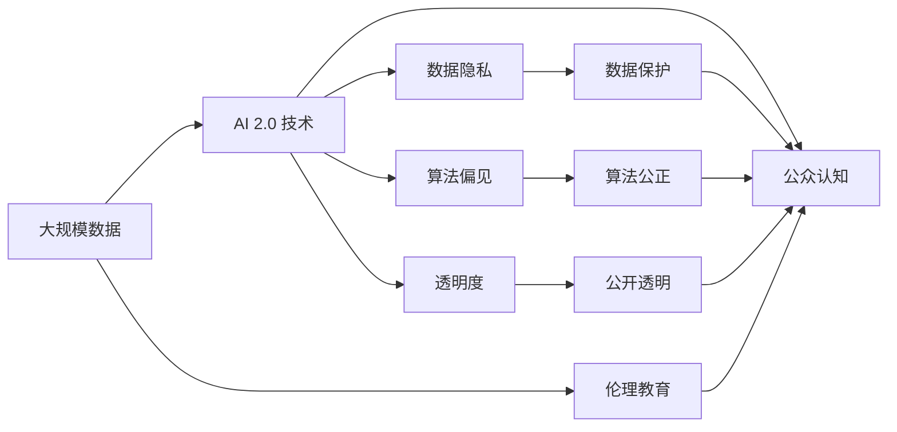

                 

# AI 伦理教育：提高公众对 AI 2.0 技术的认知和理解

## 1. 背景介绍

### 1.1 问题由来
随着人工智能技术的迅速发展，特别是深度学习和自然语言处理技术的突破，AI 2.0时代已经到来。AI 2.0 技术不仅应用于传统的计算机视觉、语音识别等技术领域，还在医疗、教育、金融等更多传统行业中发挥着越来越重要的作用。然而，AI 2.0 技术的广泛应用也带来了诸多伦理挑战和公众误解。如何通过AI伦理教育，提高公众对AI 2.0 技术的认知和理解，成为了亟待解决的问题。

### 1.2 问题核心关键点
AI伦理教育的核心在于：
- 教育公众理解AI 2.0 技术的本质、原理和应用范围。
- 阐明AI 2.0 技术的局限性和潜在风险，如偏见、歧视、隐私泄露等。
- 强调AI 2.0 技术的人文价值和社会影响，促进技术的公平、透明和可解释。
- 引导公众参与AI伦理规范的制定，推动AI技术的健康发展。

### 1.3 问题研究意义
AI伦理教育具有重要意义：
- 有助于消除公众对AI 2.0 技术的恐惧和误解，促进技术普及。
- 引导AI 2.0 技术的健康发展，避免伦理风险和负面影响。
- 提高公众对AI伦理问题的关注和参与度，推动社会进步。
- 为AI 2.0 技术的应用和推广提供伦理保障，提升社会信任。

## 2. 核心概念与联系

### 2.1 核心概念概述

AI 2.0 技术基于深度学习和大数据分析，涵盖计算机视觉、自然语言处理、强化学习等多个领域。AI 2.0 技术的核心在于通过大规模数据训练模型，学习到复杂模式和规律，从而实现智能决策和自动执行。然而，AI 2.0 技术也存在诸多伦理挑战，如数据隐私、算法偏见、透明度等。AI伦理教育的目标是让公众理解这些核心概念和伦理问题，提升对AI 2.0 技术的认知和接受度。

### 2.2 核心概念之间的关系

AI 2.0 技术、伦理教育和公众认知之间的关系可以形象地用以下Mermaid流程图表示：


这个流程图展示了大语言模型微调过程中各个核心概念的关系：
- AI 2.0 技术是教育的内容，也是公众认知的对象。
- 伦理教育是连接AI 2.0 技术与公众认知的桥梁。
- 公众认知是AI 2.0 技术应用的基础。

### 2.3 核心概念的整体架构

最后，我们用一个综合的流程图来展示这些核心概念在大语言模型微调过程中的整体架构：



这个综合流程图展示了从数据到AI 2.0 技术再到公众认知的全过程，以及伦理教育在其中扮演的角色。通过这些核心概念的连接，可以更全面地理解AI 2.0 技术的本质和应用，同时也认识到其中存在的伦理问题。

## 3. 核心算法原理 & 具体操作步骤

### 3.1 算法原理概述

AI伦理教育的核心在于理解和阐明AI 2.0 技术的原理和应用范围，从而消除误解和恐惧。其算法原理主要包括：
- 数据驱动：强调AI 2.0 技术依赖大量数据训练模型，学习模式和规律。
- 深度学习：使用神经网络模型进行复杂特征的提取和模式识别。
- 伦理框架：构建AI伦理框架，指导AI 2.0 技术的应用和推广。

### 3.2 算法步骤详解

AI伦理教育的步骤可以分解为以下几个环节：
1. **数据准备**：收集和整理与AI 2.0 技术相关的数据，包括技术背景、应用案例、伦理问题等。
2. **内容设计**：设计教育内容，包括课程大纲、教学材料和教学方法等。
3. **教学实施**：采用多种教学手段，如线上课程、讲座、研讨会、工作坊等，推广教育内容。
4. **效果评估**：通过问卷调查、反馈机制等手段，评估教育效果，调整教育内容和方式。

### 3.3 算法优缺点

AI伦理教育的优点包括：
- 提升公众对AI 2.0 技术的认知，消除误解和恐惧。
- 推动AI伦理规范的制定和应用，促进技术健康发展。
- 增强公众对AI技术的信任和接受度，促进技术普及和应用。

缺点主要在于：
- 教育效果受限于教育内容的质量和深度，需要不断更新和优化。
- 教育方式和手段有限，可能难以覆盖所有人群。
- 教育成本和资源投入较大，需要政府和社会共同支持。

### 3.4 算法应用领域

AI伦理教育不仅适用于技术开发和推广阶段，还应贯穿于AI 2.0 技术的整个生命周期。具体应用领域包括：
- 学术界：大学和研究机构可以开设AI伦理课程，培养AI 2.0 技术的研究和开发人才。
- 企业界：大型企业可以设立AI伦理部门，推动AI技术的公平、透明和可解释。
- 公众教育：通过在线课程、科普讲座等方式，向公众普及AI 2.0 技术的原理和伦理问题。
- 政府机构：制定AI伦理政策和法规，推动AI技术的健康发展和应用。

## 4. 数学模型和公式 & 详细讲解 & 举例说明

### 4.1 数学模型构建

AI伦理教育的核心在于理解和阐明AI 2.0 技术的原理和应用范围。以下是一个简化的数学模型，用于说明AI 2.0 技术的核心要素：

$$
\text{AI 2.0 技术} = \text{数据} \times \text{算法} + \text{伦理框架}
$$

其中：
- 数据：表示AI 2.0 技术所依赖的大规模数据集，用于训练和优化模型。
- 算法：表示AI 2.0 技术所采用的深度学习模型，如神经网络、决策树等。
- 伦理框架：表示AI 2.0 技术的伦理约束和规范，用于指导技术的公平、透明和可解释。

### 4.2 公式推导过程

AI 2.0 技术的核心算法原理包括深度学习和强化学习。以下分别介绍这两种算法的基本原理：

**深度学习算法**
深度学习算法是一种基于神经网络的机器学习技术，通过多层非线性变换，学习数据的高层次特征。以下是一个简单的深度学习模型：

$$
f(x) = \sum_{i=1}^n w_i f_{i-1}(x)
$$

其中：
- $x$：输入数据。
- $f_{i-1}(x)$：第$i-1$层的特征表示。
- $w_i$：第$i$层的权重参数。

**强化学习算法**
强化学习算法是一种通过试错学习，最大化奖励的机器学习技术。以下是一个简单的强化学习模型：

$$
Q(s_t, a_t) = \gamma \sum_{i=1}^n w_i Q(s_{t+1}, a_{t+1})
$$

其中：
- $s_t$：当前状态。
- $a_t$：当前动作。
- $Q(s_t, a_t)$：在状态$s_t$下采取动作$a_t$的期望奖励。
- $\gamma$：折扣因子，表示未来奖励的权重。
- $w_i$：奖励模型的权重参数。

### 4.3 案例分析与讲解

以医疗AI为例，医疗AI 2.0 技术通过深度学习算法，学习医疗影像、病历记录等数据，辅助医生进行疾病诊断和个性化治疗。然而，医疗AI 2.0 技术也存在诸多伦理挑战，如数据隐私、算法偏见、透明度等。以下通过一个案例，说明AI伦理教育的实际应用：

**案例：AI辅助诊疗系统**
某医院引进了一款AI辅助诊疗系统，用于提高医生的诊断准确率和效率。系统通过深度学习算法，学习医生的诊断案例和医学知识，自动生成诊断报告。然而，系统也存在数据隐私问题，医院需要对患者数据进行匿名化处理。此外，系统可能存在算法偏见，需要对模型进行公平性测试。系统还需要具备高透明度，医生可以随时查看和解释系统的诊断结果。通过AI伦理教育，医院可以加强对AI系统的管理和监管，确保系统的公平、透明和可解释。

## 5. 项目实践：代码实例和详细解释说明

### 5.1 开发环境搭建

在进行AI伦理教育实践前，我们需要准备好开发环境。以下是使用Python进行Jupyter Notebook开发的环境配置流程：

1. 安装Anaconda：从官网下载并安装Anaconda，用于创建独立的Python环境。

2. 创建并激活虚拟环境：
```bash
conda create -n pytorch-env python=3.8 
conda activate pytorch-env
```

3. 安装必要的Python包：
```bash
pip install jupyter
```

4. 安装Jupyter Notebook：
```bash
conda install jupyterlab
```

5. 创建并激活Jupyter Notebook环境：
```bash
jupyter lab --notebook-dir .notebooks
```

完成上述步骤后，即可在`pytorch-env`环境中开始AI伦理教育实践。

### 5.2 源代码详细实现

下面我们以编写一个简单的AI伦理教育课程为例，展示如何使用Python和Jupyter Notebook实现AI伦理教育。

```python
import pandas as pd
from IPython.display import display, HTML

# 加载教育数据
data = pd.read_csv('ai_ethics_data.csv')

# 显示教育内容
for index, row in data.iterrows():
    title = row['title']
    content = row['content']
    display(HTML(f'<h2>{title}</h2>'))
    display(HTML(f'<p>{content}</p>'))
```

以上代码通过Pandas库加载教育数据，并使用IPython.display库在Jupyter Notebook中显示教育内容。

### 5.3 代码解读与分析

让我们再详细解读一下关键代码的实现细节：

**DataFrame类**：
- `pd.read_csv('ai_ethics_data.csv')`：加载教育数据，使用Pandas库的DataFrame类进行数据处理。
- `data.iterrows()`：遍历数据帧中的每一行，逐行读取并显示教育内容。

**display函数**：
- `display(HTML(f'<h2>{title}</h2>'))`：使用IPython.display库的HTML函数，在Jupyter Notebook中显示教育标题。
- `display(HTML(f'<p>{content}</p>'))`：在Jupyter Notebook中显示教育内容。

**代码示例**：
以下是一个简单的教育内容示例，通过Jupyter Notebook展示：

```python
# 教育标题
title = 'AI 2.0 技术的基本原理'

# 教育内容
content = 'AI 2.0 技术依赖大量数据训练模型，学习模式和规律。'

# 显示教育标题和内容
display(HTML(f'<h2>{title}</h2>'))
display(HTML(f'<p>{content}</p>'))
```

### 5.4 运行结果展示

假设我们加载的数据中包含多条教育内容，在Jupyter Notebook中展示的效果如下：

```
<h2>AI 2.0 技术的基本原理</h2>
<p>AI 2.0 技术依赖大量数据训练模型，学习模式和规律。</p>
<h2>AI 2.0 技术的伦理问题</h2>
<p>AI 2.0 技术也存在诸多伦理挑战，如数据隐私、算法偏见、透明度等。</p>
<h2>AI伦理教育的实施方法</h2>
<p>AI伦理教育的核心在于理解和阐明AI 2.0 技术的原理和应用范围。</p>
```

通过Jupyter Notebook，我们可以直观地展示教育内容，增强公众对AI 2.0 技术的理解和接受。

## 6. 实际应用场景

### 6.1 教育体系改革

AI伦理教育可以应用于教育体系的改革，推动教育内容的更新和优化。学校和大学可以开设AI伦理课程，培养学生的AI 2.0 技术素养和伦理意识。例如，计算机科学专业的学生可以学习AI 2.0 技术的原理和应用，同时掌握AI伦理的基本知识和技能。

### 6.2 企业员工培训

大型企业可以设立AI伦理部门，推动AI 2.0 技术的应用和推广。企业可以通过AI伦理培训，提升员工对AI 2.0 技术的认知和理解，增强企业对AI技术的信任和接受度。例如，金融行业可以通过AI伦理培训，帮助员工理解AI 2.0 技术在风险控制、客户服务等方面的应用。

### 6.3 政府政策制定

政府可以制定AI伦理政策和法规，推动AI 2.0 技术的健康发展和应用。政府可以通过AI伦理教育，增强公众对AI 2.0 技术的认知和理解，推动社会对AI技术的信任和支持。例如，医疗行业可以通过AI伦理教育，推动政府制定AI 2.0 技术在医疗影像、病历记录等方面的应用政策。

### 6.4 未来应用展望

随着AI 2.0 技术的广泛应用，AI伦理教育也将得到越来越广泛的应用。未来，AI伦理教育将在以下领域得到更深入的应用：
- 学术界：大学和研究机构可以开设AI伦理课程，培养AI 2.0 技术的研究和开发人才。
- 企业界：大型企业可以设立AI伦理部门，推动AI 2.0 技术的应用和推广。
- 公众教育：通过在线课程、科普讲座等方式，向公众普及AI 2.0 技术的原理和伦理问题。
- 政府机构：制定AI伦理政策和法规，推动AI 2.0 技术的健康发展和应用。

## 7. 工具和资源推荐

### 7.1 学习资源推荐

为了帮助开发者系统掌握AI伦理教育的技术基础和实践技巧，这里推荐一些优质的学习资源：

1. 《AI伦理基础》系列课程：由斯坦福大学开设的AI伦理课程，讲解AI伦理的基本概念和应用。
2. 《AI 2.0 技术与应用》书籍：详细介绍了AI 2.0 技术的原理、应用和伦理问题。
3. 《AI伦理手册》书籍：全面介绍了AI伦理的基本知识和实践技巧。
4. 《AI 2.0 技术与伦理》博客：由知名AI专家撰写，分享AI伦理教育的前沿技术和实践经验。
5. 《AI伦理与法律》在线课程：由法律专家和AI专家联合授课，讲解AI伦理和法律问题。

通过对这些资源的学习实践，相信你一定能够快速掌握AI伦理教育的技术要点，并用于解决实际的AI伦理问题。

### 7.2 开发工具推荐

高效的开发离不开优秀的工具支持。以下是几款用于AI伦理教育开发的常用工具：

1. Jupyter Notebook：免费的在线笔记本环境，支持Python等编程语言的代码编写和运行，非常适合AI伦理教育的实践。
2. Pandas库：用于数据处理和分析，支持数据导入、清洗、统计等功能。
3. IPython.display库：用于在Jupyter Notebook中显示HTML内容，方便教育内容的展示。
4. GitHub：用于代码版本管理和共享，适合AI伦理教育内容的发布和协作。
5. Microsoft Office：用于编写教育文档和报告，支持协作和共享。

合理利用这些工具，可以显著提升AI伦理教育内容的开发效率，加快创新迭代的步伐。

### 7.3 相关论文推荐

AI伦理教育的研究源于学界的持续研究。以下是几篇奠基性的相关论文，推荐阅读：

1. "AI伦理：构建公正、透明、可解释的AI技术"：详细讨论了AI伦理的基本概念和应用场景。
2. "AI 2.0 技术的伦理问题与对策"：分析了AI 2.0 技术在数据隐私、算法偏见等方面的伦理挑战。
3. "AI伦理教育：从理论到实践"：探讨了AI伦理教育的实施方法和效果评估。
4. "AI 2.0 技术与伦理：未来的挑战与机遇"：展望了AI 2.0 技术未来的伦理挑战和发展方向。
5. "AI伦理规范的制定与实施"：介绍了AI伦理规范的制定过程和实施方法。

这些论文代表了大语言模型微调技术的发展脉络。通过学习这些前沿成果，可以帮助研究者把握学科前进方向，激发更多的创新灵感。

除上述资源外，还有一些值得关注的前沿资源，帮助开发者紧跟AI伦理教育技术的最新进展，例如：

1. arXiv论文预印本：人工智能领域最新研究成果的发布平台，包括大量尚未发表的前沿工作，学习前沿技术的必读资源。
2. 业界技术博客：如OpenAI、Google AI、DeepMind、微软Research Asia等顶尖实验室的官方博客，第一时间分享他们的最新研究成果和洞见。
3. 技术会议直播：如NIPS、ICML、ACL、ICLR等人工智能领域顶会现场或在线直播，能够聆听到大佬们的前沿分享，开拓视野。
4. GitHub热门项目：在GitHub上Star、Fork数最多的AI伦理相关项目，往往代表了该技术领域的发展趋势和最佳实践，值得去学习和贡献。
5. 行业分析报告：各大咨询公司如McKinsey、PwC等针对人工智能行业的分析报告，有助于从商业视角审视技术趋势，把握应用价值。

总之，对于AI伦理教育技术的学习和实践，需要开发者保持开放的心态和持续学习的意愿。多关注前沿资讯，多动手实践，多思考总结，必将收获满满的成长收益。

## 8. 总结：未来发展趋势与挑战

### 8.1 总结

本文对AI伦理教育方法进行了全面系统的介绍。首先阐述了AI 2.0 技术的基本原理和应用范围，明确了AI伦理教育在普及AI 2.0 技术方面的重要意义。其次，从原理到实践，详细讲解了AI伦理教育的数学模型和操作步骤，给出了AI伦理教育任务开发的完整代码实例。同时，本文还广泛探讨了AI伦理教育在教育体系、企业界、政府机构等多个领域的应用前景，展示了AI伦理教育技术的巨大潜力。最后，本文精选了AI伦理教育的各类学习资源，力求为读者提供全方位的技术指引。

通过本文的系统梳理，可以看到，AI伦理教育正在成为AI 2.0 技术普及和应用的重要保障，其核心在于消除公众对AI 2.0 技术的误解和恐惧，推动AI技术的健康发展。未来，伴随AI伦理教育的深入研究，相信AI 2.0 技术将在更多领域得到广泛应用，为社会带来深远影响。

### 8.2 未来发展趋势

展望未来，AI伦理教育将呈现以下几个发展趋势：

1. 教育内容的多样化：随着AI 2.0 技术的不断发展，AI伦理教育的内容将不断丰富和更新，涵盖更多的技术细节和应用场景。
2. 教学手段的多样化：AI伦理教育将不仅仅局限于传统的课堂教学，还将采用在线课程、工作坊、科普讲座等多种形式。
3. 教育目标的明确化：AI伦理教育将更加注重培养公众对AI 2.0 技术的认知和理解，促进技术的公平、透明和可解释。
4. 教育效果的评估化：AI伦理教育的效果将通过问卷调查、反馈机制等多种手段进行评估和改进。

以上趋势凸显了AI伦理教育的广阔前景。这些方向的探索发展，必将进一步提升公众对AI 2.0 技术的认知和接受度，推动AI技术的健康发展。

### 8.3 面临的挑战

尽管AI伦理教育已经取得了显著成效，但在推广应用过程中仍面临诸多挑战：

1. 教育资源的不均衡：教育资源的分布不均衡，部分地区和人群难以获得高质量的教育资源。
2. 教育内容的深度不足：部分教育内容较为浅显，难以深入讲解AI 2.0 技术的原理和应用。
3. 教育效果的评估困难：教育效果的评估缺乏统一标准，难以量化和比较。
4. 教育手段的单一化：教育手段较为单一，难以覆盖所有人群和领域。

这些挑战需要多方协同努力，共同推动AI伦理教育的普及和深化。

### 8.4 研究展望

未来，AI伦理教育需要从以下几个方面进行深入研究：

1. 多学科交叉：将AI伦理教育与法律、伦理、社会学等多个学科相结合，全面提升公众对AI 2.0 技术的认知和理解。
2. 技术驱动：借助AI技术，推动AI伦理教育的内容更新和教学手段创新。
3. 社会参与：鼓励社会各界参与AI伦理教育，共同推动AI技术的健康发展。
4. 国际合作：推动国际间的AI伦理教育合作，借鉴和学习先进的教育经验和研究成果。

这些研究方向将有助于推动AI伦理教育的普及和深化，推动AI 2.0 技术的应用和推广。总之，AI伦理教育需要多方协同努力，共同推动技术的健康发展，促进社会进步。

## 9. 附录：常见问题与解答

**Q1：AI伦理教育是否适用于所有公众？**

A: AI伦理教育适用于所有对AI 2.0 技术有兴趣和需求的人群，包括学生、教师、企业员工、政府官员等。AI伦理教育的核心在于消除公众对AI 2.0 技术的误解和恐惧，推动技术普及和应用。

**Q2：如何进行AI伦理教育的评估？**

A: AI伦理教育的评估可以通过问卷调查、反馈机制等多种手段进行。评估内容可以包括教育内容的质量、教学方法的适用性、教育效果的提升等。评估结果可以用于改进教育内容和方法，提升教育效果。

**Q3：AI伦理教育需要哪些资源支持？**

A: AI伦理教育需要教育数据、教育内容、教育平台、师资力量等多方面的资源支持。政府、企业、教育机构、学术界等各方应共同参与，提供必要的资源支持。

**Q4：AI伦理教育的难点是什么？**

A: AI伦理教育的难点在于教育资源的不均衡、教育内容的深度不足、教育效果的评估困难和教育手段的单一化。这些难点需要通过多方协同努力，共同推动AI伦理教育的普及和深化。

**Q5：如何提升AI伦理教育的普及率？**

A: 提升AI伦理教育的普及率需要政府、企业、教育机构、学术界等多方的共同努力。通过政策支持、资金投入、教育平台建设等多种方式，提高AI伦理教育的覆盖面和质量，促进技术的普及和应用。

---

作者：禅与计算机程序设计艺术 / Zen and the Art of Computer Programming

