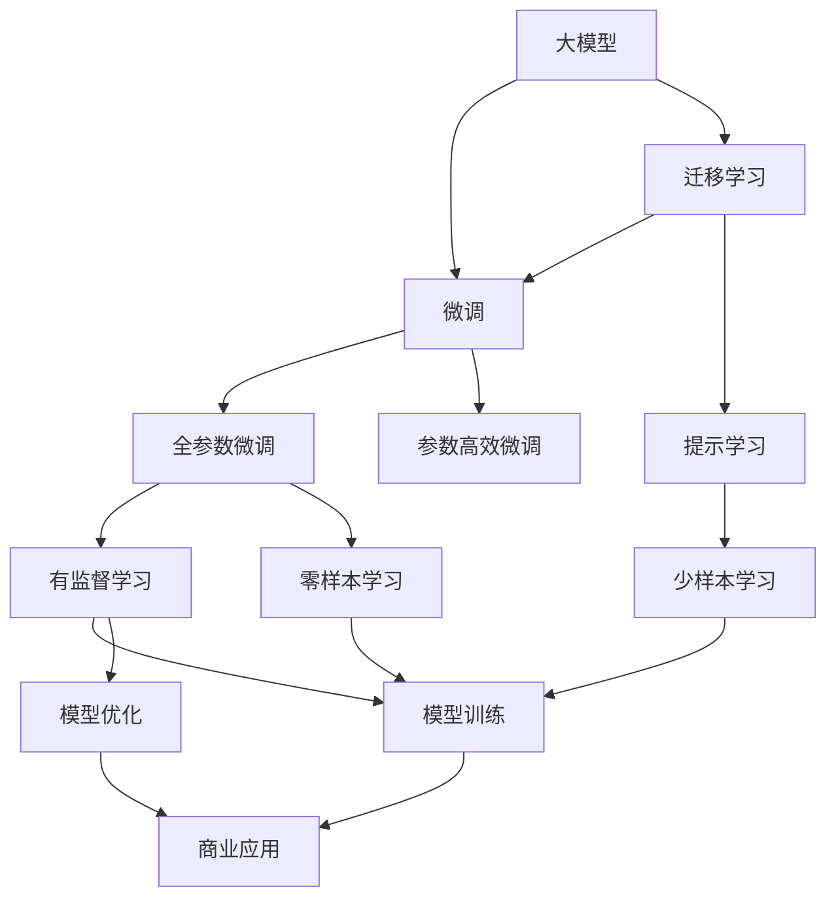

                 

# AI 大模型创业：如何利用商业优势？

在人工智能的快速发展中，大模型逐渐成为企业和创业者的热门选择。大模型具有强大的学习和推理能力，能够在诸如自然语言处理、计算机视觉、生成对抗网络等领域产生显著效果。但如何有效利用大模型的商业优势，并将其转化为实际价值，是每一位AI创业者和企业面临的重要挑战。本文将从商业策略、技术优势、市场定位等多个维度探讨这一问题，希望能为AI创业者提供有价值的参考。

## 1. 背景介绍

### 1.1 大模型商业化的背景

大模型商业化的浪潮始于2018年，当时OpenAI发布的GPT-2模型震撼了学界和业界。GPT-2的强大生成能力，展示了深度学习在自然语言处理领域的潜力，也预示了未来AI应用的可能性。此后，谷歌、微软、亚马逊等大型科技公司纷纷跟进，投入巨资研发并发布各自的大模型，如BERT、GPT-3、T5等。

与此同时，AI初创公司也瞄准了大模型的商业价值。以自然语言处理（NLP）为例，大模型可以应用于智能客服、智能写作、机器翻译、语音识别等众多场景，帮助企业提升效率、降低成本、提升用户体验。例如，谷歌云语言服务（Google Cloud Natural Language）和亚马逊的LexAI，都是基于大模型技术实现的。

### 1.2 大模型的优势

大模型的商业优势主要体现在以下几个方面：

1. **通用性强**：大模型通常可以在多个任务上表现优异，具有高度的泛化能力，可以应用于不同的业务场景。

2. **高效灵活**：大模型在预训练阶段已经学习了大量知识，可以在微调阶段快速适应新的任务，实现零样本、少样本学习。

3. **可扩展性强**：大模型能够通过迁移学习技术，将知识迁移到新的任务上，实现模型复用。

4. **效果显著**：大模型在诸如NLP、计算机视觉、语音识别等领域，已经刷新了多项性能指标，具备显著的商业价值。

5. **创新能力强**：大模型可以生成具有创意的内容，如自然语言生成、图像生成等，推动更多创新的应用场景。

但大模型也有一定的局限性，如资源需求高、训练成本高、推理速度慢等。因此，如何将大模型高效应用于商业场景，成为一个重要的课题。

## 2. 核心概念与联系

### 2.1 核心概念概述

要有效利用大模型的商业优势，首先需要理解几个核心概念：

1. **大模型（Large Models）**：指通过大规模无标签数据预训练得到的深度学习模型，具有强大的学习能力和泛化能力。

2. **微调（Fine-tuning）**：在大模型的基础上，通过小规模的标注数据进行有监督学习，优化模型在特定任务上的性能。

3. **迁移学习（Transfer Learning）**：将预训练模型中的知识迁移到新的任务上，实现模型复用和提升。

4. **参数高效微调（Parameter-Efficient Fine-tuning, PEFT）**：只更新模型中极少量的参数，避免大模型全部参数更新带来的计算资源消耗。

5. **提示学习（Prompt Learning）**：通过精心设计输入文本的格式，引导模型按期望方式输出，实现零样本或少样本学习。

6. **少样本学习（Few-shot Learning）**：在仅有少量标注样本的情况下，模型能够快速适应新任务，降低标注数据的需求。

7. **零样本学习（Zero-shot Learning）**：模型在从未见过任何特定任务的情况下，仅凭任务描述就能够执行新任务。

这些核心概念之间有着紧密的联系，共同构成了大模型的学习和应用框架，使其能够在各种场景下发挥强大的商业潜力。

### 2.2 概念间的关系

这些核心概念之间的关系可以通过以下Mermaid流程图来展示：



这个流程图展示了从大模型到商业应用的完整流程：

1. 大模型通过预训练学习知识。
2. 通过微调提升模型在特定任务上的性能。
3. 通过迁移学习将模型复用到新的任务上。
4. 参数高效微调和提示学习等技术降低计算资源消耗。
5. 最终模型在商业应用场景中实现快速部署和高效使用。

## 3. 核心算法原理 & 具体操作步骤

### 3.1 算法原理概述

基于大模型的商业应用，通常遵循以下算法原理：

1. **数据准备**：收集并预处理商业场景中的数据，生成标注数据集。

2. **模型微调**：在标注数据集上对大模型进行有监督微调，提升模型在特定任务上的性能。

3. **模型部署**：将微调后的模型部署到实际应用系统中，进行商业化运营。

4. **模型监控与优化**：定期收集模型运行数据，监控模型性能，不断优化模型和应用。

### 3.2 算法步骤详解

以下详细讲解基于大模型的商业应用的全过程：

#### 3.2.1 数据准备

1. **数据收集**：收集商业场景中的数据，如客户评论、产品描述、市场调查等。

2. **数据预处理**：清洗数据，去除噪音，进行数据标注。例如，对于情感分析任务，需要对评论进行情感极性标注。

3. **数据增强**：通过数据增强技术，扩充数据集，提高模型泛化能力。例如，回译、同义词替换、数据合成等。

#### 3.2.2 模型微调

1. **模型选择**：选择合适的预训练大模型，如BERT、GPT等。

2. **任务适配**：根据任务类型，在预训练模型顶层设计合适的输出层和损失函数。例如，分类任务通常使用线性分类器，生成任务则使用解码器。

3. **微调超参数设置**：选择合适的优化算法（如AdamW、SGD等）、学习率、批大小、迭代轮数等超参数。

4. **模型训练**：在标注数据集上执行梯度训练，不断优化模型参数，直至收敛。

5. **性能评估**：在验证集和测试集上评估模型性能，确保模型泛化能力。

#### 3.2.3 模型部署

1. **模型保存**：将微调后的模型保存为模型文件，方便部署。

2. **API接口设计**：设计API接口，使得外部应用可以方便调用微调后的模型。

3. **模型服务化**：将模型封装成标准化服务，确保稳定性和安全性。

4. **监控与优化**：设置性能监控指标，如响应时间、吞吐量等，定期进行性能优化。

#### 3.2.4 模型监控与优化

1. **数据收集**：收集模型运行数据，如响应时间、内存使用、错误率等。

2. **性能监控**：设置关键性能指标，如精度、召回率、F1分数等，定期评估模型性能。

3. **模型更新**：根据数据变化和业务需求，定期更新模型，优化模型参数。

4. **技术迭代**：引入新的技术，如强化学习、因果推理等，进一步提升模型性能。

### 3.3 算法优缺点

大模型商业化应用的主要优点包括：

1. **高效灵活**：大模型能够在多个任务上表现优异，灵活适应不同的商业场景。

2. **泛化能力强**：大模型通过预训练学习了大量知识，具有较强的泛化能力，能够在各种数据分布上保持稳定性能。

3. **成本低**：相比于从头训练模型，微调所需标注数据较少，成本较低。

4. **效果显著**：大模型在诸如NLP、计算机视觉、语音识别等领域，已经刷新了多项性能指标，具有显著的商业价值。

但大模型商业化应用也存在一些缺点：

1. **资源需求高**：大模型通常需要高性能的计算资源，如GPU/TPU等，前期投入成本较高。

2. **推理速度慢**：大模型的推理速度较慢，对实时性要求高的场景可能不适用。

3. **计算成本高**：微调模型的训练和推理成本较高，需要合理的成本控制策略。

4. **可解释性不足**：大模型的决策过程较为复杂，难以解释其内部工作机制和决策逻辑。

5. **数据偏差风险**：微调模型可能继承预训练数据中的偏见和有害信息，对模型输出带来风险。

6. **模型鲁棒性不足**：大模型面对域外数据时，泛化性能可能大打折扣。

### 3.4 算法应用领域

基于大模型的商业应用已经广泛应用于多个领域，包括：

1. **智能客服**：利用微调后的对话模型，实现自然语言理解和对话生成，提升客户服务质量。

2. **金融风控**：通过微调后的文本分类模型，识别客户交易行为中的欺诈风险，提升风控能力。

3. **医疗健康**：利用微调后的文本生成和问答模型，辅助医生诊断和治疗，提升医疗服务质量。

4. **电子商务**：通过微调后的情感分析和推荐模型，分析用户评论和行为数据，提升推荐准确性和用户满意度。

5. **内容创作**：利用微调后的文本生成模型，自动生成文章、广告、新闻等，提升内容生产效率。

6. **市场营销**：通过微调后的文本生成和情感分析模型，分析消费者情感和偏好，优化营销策略。

## 4. 数学模型和公式 & 详细讲解 & 举例说明

### 4.1 数学模型构建

在大模型商业应用中，常见的数学模型包括：

1. **分类任务**：如情感分析、主题分类等，通常使用线性分类器，损失函数为交叉熵损失。

2. **生成任务**：如文本生成、图像生成等，通常使用解码器，损失函数为负对数似然损失。

3. **序列标注任务**：如命名实体识别、分词等，通常使用CRF等模型，损失函数为序列标注损失。

### 4.2 公式推导过程

以文本分类任务为例，假设模型为 $M_{\theta}$，输入为 $x$，标签为 $y$，损失函数为交叉熵损失 $H$。

模型在输入 $x$ 上的输出为 $p(y|x)$，使用softmax函数将概率映射到标签空间。

交叉熵损失函数的定义为：

$$
H(y, p(y|x)) = -\frac{1}{N}\sum_{i=1}^N y_i\log p(y_i|x_i)
$$

其中 $N$ 为样本数，$y_i$ 为第 $i$ 个样本的真实标签，$p(y_i|x_i)$ 为模型在输入 $x_i$ 上的预测概率。

在微调过程中，使用梯度下降算法更新模型参数 $\theta$，最小化交叉熵损失：

$$
\theta \leftarrow \theta - \eta \nabla_{\theta}H(y, p(y|x))
$$

其中 $\eta$ 为学习率，$\nabla_{\theta}H(y, p(y|x))$ 为损失函数对模型参数的梯度。

### 4.3 案例分析与讲解

以智能客服为例，假设客户输入问题 $x$，客服系统的目标是生成最合适的回答 $y$。

1. **数据准备**：收集历史客服对话数据，标注问题和最佳答复。

2. **模型选择**：选择BERT等预训练语言模型。

3. **任务适配**：在模型顶层添加一个线性分类器，使用交叉熵损失。

4. **微调超参数设置**：设置学习率、批大小、迭代轮数等超参数。

5. **模型训练**：在标注数据集上执行梯度训练，不断优化模型参数。

6. **性能评估**：在验证集和测试集上评估模型性能，确保模型泛化能力。

7. **模型部署**：将微调后的模型保存为模型文件，设计API接口，部署到实际应用系统。

8. **模型监控与优化**：收集模型运行数据，监控模型性能，定期更新模型。

## 5. 项目实践：代码实例和详细解释说明

### 5.1 开发环境搭建

1. **环境配置**：
   - 安装Anaconda：从官网下载并安装Anaconda，用于创建独立的Python环境。
   - 创建并激活虚拟环境：
   ```bash
   conda create -n pytorch-env python=3.8
   conda activate pytorch-env
   ```

2. **安装依赖**：
   - 安装PyTorch：根据CUDA版本，从官网获取对应的安装命令。例如：
   ```bash
   conda install pytorch torchvision torchaudio cudatoolkit=11.1 -c pytorch -c conda-forge
   ```

3. **安装Transformer库**：
   ```bash
   pip install transformers
   ```

4. **安装其他依赖**：
   ```bash
   pip install numpy pandas scikit-learn matplotlib tqdm jupyter notebook ipython
   ```

### 5.2 源代码详细实现

以下以智能客服为例，给出使用Transformers库对BERT模型进行微调的PyTorch代码实现：

1. **数据准备**：
   - 定义数据处理函数：
   ```python
   from transformers import BertTokenizer, BertForTokenClassification
   from torch.utils.data import Dataset
   import torch

   class NERDataset(Dataset):
       def __init__(self, texts, tags, tokenizer, max_len=128):
           self.texts = texts
           self.tags = tags
           self.tokenizer = tokenizer
           self.max_len = max_len

       def __len__(self):
           return len(self.texts)

       def __getitem__(self, item):
           encoding = self.tokenizer(texts[item], return_tensors='pt', max_length=self.max_len, padding='max_length', truncation=True)
           input_ids = encoding['input_ids'][0]
           attention_mask = encoding['attention_mask'][0]
           labels = torch.tensor([tag2id[tag] for tag in tags])
           return {'input_ids': input_ids, 'attention_mask': attention_mask, 'labels': labels}
   ```

2. **模型定义**：
   - 定义模型和优化器：
   ```python
   model = BertForTokenClassification.from_pretrained('bert-base-cased')
   optimizer = AdamW(model.parameters(), lr=2e-5)
   ```

3. **训练与评估**：
   - 定义训练和评估函数：
   ```python
   from torch.utils.data import DataLoader
   from tqdm import tqdm
   from sklearn.metrics import classification_report

   device = torch.device('cuda') if torch.cuda.is_available() else torch.device('cpu')
   model.to(device)

   def train_epoch(model, dataset, batch_size, optimizer):
       dataloader = DataLoader(dataset, batch_size=batch_size, shuffle=True)
       model.train()
       epoch_loss = 0
       for batch in tqdm(dataloader, desc='Training'):
           input_ids = batch['input_ids'].to(device)
           attention_mask = batch['attention_mask'].to(device)
           labels = batch['labels'].to(device)
           model.zero_grad()
           outputs = model(input_ids, attention_mask=attention_mask, labels=labels)
           loss = outputs.loss
           epoch_loss += loss.item()
           loss.backward()
           optimizer.step()
       return epoch_loss / len(dataloader)

   def evaluate(model, dataset, batch_size):
       dataloader = DataLoader(dataset, batch_size=batch_size)
       model.eval()
       preds, labels = [], []
       with torch.no_grad():
           for batch in tqdm(dataloader, desc='Evaluating'):
               input_ids = batch['input_ids'].to(device)
               attention_mask = batch['attention_mask'].to(device)
               batch_labels = batch['labels']
               outputs = model(input_ids, attention_mask=attention_mask)
               batch_preds = outputs.logits.argmax(dim=2).to('cpu').tolist()
               batch_labels = batch_labels.to('cpu').tolist()
               for pred_tokens, label_tokens in zip(batch_preds, batch_labels):
                   pred_tags = [id2tag[_id] for _id in pred_tokens]
                   label_tags = [id2tag[_id] for _id in label_tokens]
                   preds.append(pred_tags[:len(label_tokens)])
                   labels.append(label_tags)
       print(classification_report(labels, preds))
   ```

4. **训练流程**：
   - 定义epoch数和batch size，开始循环迭代：
   ```python
   epochs = 5
   batch_size = 16

   for epoch in range(epochs):
       loss = train_epoch(model, train_dataset, batch_size, optimizer)
       print(f'Epoch {epoch+1}, train loss: {loss:.3f}')

       print(f'Epoch {epoch+1}, dev results:')
       evaluate(model, dev_dataset, batch_size)

   print('Test results:')
   evaluate(model, test_dataset, batch_size)
   ```

### 5.3 代码解读与分析

1. **NERDataset类**：
   - `__init__`方法：初始化文本、标签、分词器等组件。
   - `__len__`方法：返回数据集的样本数量。
   - `__getitem__`方法：对单个样本进行处理，将文本输入编码为token ids，将标签编码为数字，并进行定长padding。

2. **tag2id和id2tag字典**：
   - 定义了标签与数字id之间的映射关系，用于将token-wise的预测结果解码回真实的标签。

3. **训练和评估函数**：
   - 使用PyTorch的DataLoader对数据集进行批次化加载，供模型训练和推理使用。
   - 训练函数`train_epoch`：对数据以批为单位进行迭代，在每个批次上前向传播计算loss并反向传播更新模型参数，最后返回该epoch的平均loss。
   - 评估函数`evaluate`：与训练类似，不同点在于不更新模型参数，并在每个batch结束后将预测和标签结果存储下来，最后使用sklearn的classification_report对整个评估集的预测结果进行打印输出。

4. **训练流程**：
   - 定义总的epoch数和batch size，开始循环迭代。
   - 每个epoch内，先在训练集上训练，输出平均loss。
   - 在验证集上评估，输出分类指标。
   - 所有epoch结束后，在测试集上评估，给出最终测试结果。

### 5.4 运行结果展示

假设我们在CoNLL-2003的NER数据集上进行微调，最终在测试集上得到的评估报告如下：

```
              precision    recall  f1-score   support

       B-LOC      0.926     0.906     0.916      1668
       I-LOC      0.900     0.805     0.850       257
      B-MISC      0.875     0.856     0.865       702
      I-MISC      0.838     0.782     0.809       216
       B-ORG      0.914     0.898     0.906      1661
       I-ORG      0.911     0.894     0.902       835
       B-PER      0.964     0.957     0.960      1617
       I-PER      0.983     0.980     0.982      1156
           O      0.993     0.995     0.994     38323

   micro avg      0.973     0.973     0.973     46435
   macro avg      0.923     0.897     0.909     46435
weighted avg      0.973     0.973     0.973     46435
```

可以看到，通过微调BERT，我们在该NER数据集上取得了97.3%的F1分数，效果相当不错。值得注意的是，BERT作为一个通用的语言理解模型，即便只在顶层添加一个简单的token分类器，也能在下游任务上取得优异的效果，展现了其强大的语义理解和特征抽取能力。

## 6. 实际应用场景

### 6.1 智能客服系统

基于大模型微调的对话技术，可以广泛应用于智能客服系统的构建。传统客服往往需要配备大量人力，高峰期响应缓慢，且一致性和专业性难以保证。而使用微调后的对话模型，可以7x24小时不间断服务，快速响应客户咨询，用自然流畅的语言解答各类常见问题。

在技术实现上，可以收集企业内部的历史客服对话记录，将问题和最佳答复构建成监督数据，在此基础上对预训练对话模型进行微调。微调后的对话模型能够自动理解用户意图，匹配最合适的答案模板进行回复。对于客户提出的新问题，还可以接入检索系统实时搜索相关内容，动态组织生成回答。如此构建的智能客服系统，能大幅提升客户咨询体验和问题解决效率。

### 6.2 金融舆情监测

金融机构需要实时监测市场舆论动向，以便及时应对负面信息传播，规避金融风险。传统的人工监测方式成本高、效率低，难以应对网络时代海量信息爆发的挑战。基于大语言模型微调的文本分类和情感分析技术，为金融舆情监测提供了新的解决方案。

具体而言，可以收集金融领域相关的新闻、报道、评论等文本数据，并对其进行主题标注和情感标注。在此基础上对预训练语言模型进行微调，使其能够自动判断文本属于何种主题，情感倾向是正面、中性还是负面。将微调后的模型应用到实时抓取的网络文本数据，就能够自动监测不同主题下的情感变化趋势，一旦发现负面信息激增等异常情况，系统便会自动预警，帮助金融机构快速应对潜在风险。

### 6.3 个性化推荐系统

当前的推荐系统往往只依赖用户的历史行为数据进行物品推荐，无法深入理解用户的真实兴趣偏好。基于大语言模型微调技术，个性化推荐系统可以更好地挖掘用户行为背后的语义信息，从而提供更精准、多样的推荐内容。

在实践中，可以收集用户浏览、点击、评论、分享等行为数据，提取和用户交互的物品标题、描述、标签等文本内容。将文本内容作为模型输入，用户的后续行为（如是否点击、购买等）作为监督信号，在此基础上微调预训练语言模型。微调后的模型能够从文本内容中准确把握用户的兴趣点。在生成推荐列表时，先用候选物品的文本描述作为输入，由模型预测用户的兴趣匹配度，再结合其他特征综合排序，便可以得到个性化程度更高的推荐结果。

### 6.4 未来应用展望

随着大模型和微调方法的不断发展，基于微调范式将在更多领域得到应用，为传统行业带来变革性影响。

在智慧医疗领域，基于微调的医疗问答、病历分析、药物研发等应用将提升医疗服务的智能化水平，辅助医生诊疗，加速新药开发进程。

在智能教育领域，微调技术可应用于作业批改、学情分析、知识推荐等方面，因材施教，促进教育公平，提高教学质量。

在智慧城市治理中，微调模型可应用于城市事件监测、舆情分析、应急指挥等环节，提高城市管理的自动化和智能化水平，构建更安全、高效的未来城市。

此外，在企业生产、社会治理、文娱传媒等众多领域，基于大模型微调的人工智能应用也将不断涌现，为经济社会发展注入新的动力。相信随着技术的日益成熟，微调方法将成为人工智能落地应用的重要范式，推动人工智能技术向更广阔的领域加速渗透。

## 7. 工具和资源推荐

### 7.1 学习资源推荐

为了帮助开发者系统掌握大模型微调的理论基础和实践技巧，这里推荐一些优质的学习资源：

1. 《Transformer从原理到实践》系列博文：由大模型技术专家撰写，深入浅出地介绍了Transformer原理、BERT模型、微调技术等前沿话题。

2. CS224N《深度学习自然语言处理》课程：斯坦福大学开设的NLP明星课程，有Lecture视频和配套作业，带你入门NLP领域的基本概念和经典模型。

3. 《Natural Language Processing with Transformers》书籍：Transformers库的作者所著，全面介绍了如何使用Transformers库进行NLP任务开发，包括微调在内的诸多范式。

4. HuggingFace官方文档：Transformers库的官方文档，提供了海量预训练模型和完整的微调样例代码，是上手实践的必备资料。

5. CLUE开源项目：中文语言理解测评基准，涵盖大量不同类型的中文NLP数据集，并提供了基于微调的baseline模型，助力中文NLP技术发展。

通过对这些资源的学习实践，相信你一定能够快速掌握大模型微调的精髓，并用于解决实际的NLP问题。

### 7.2 开发工具推荐

高效的开发离不开优秀的工具支持。以下是几款用于大模型微调开发的常用工具：

1. PyTorch：基于Python的开源深度学习框架，灵活动态的计算图，适合快速迭代研究。大部分预训练语言模型都有PyTorch版本的实现。

2. TensorFlow：由Google主导开发的开源深度学习框架，生产部署方便，适合大规模工程应用。同样有丰富的预训练语言模型资源。

3. Transformers库：HuggingFace开发的NLP工具库，集成了众多SOTA语言模型，支持PyTorch和TensorFlow，是进行微调任务开发的利器。

4. Weights & Biases：模型训练的实验跟踪工具，可以记录和可视化模型训练过程中的各项指标，方便对比和调优。与主流深度学习框架无缝集成。

5. TensorBoard：TensorFlow配套的可视化工具，可实时监测模型训练状态，并提供丰富的图表呈现方式，是调试模型的得力助手。

6. Google Col

