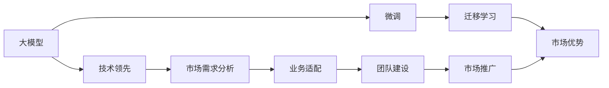
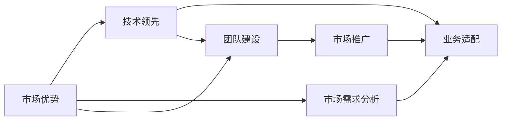

                 

# AI 大模型创业：如何利用市场优势？

大模型在近年来引发了科技界的广泛关注，而AI大模型创业企业也纷纷崭露头角。本文将探讨如何在AI大模型创业中充分利用市场优势，从技术、市场、业务、团队等多个方面展开深入讨论。

## 1. 背景介绍

### 1.1 问题由来

随着AI技术的快速发展，大模型在各行各业的应用变得愈发广泛，从NLP到图像处理，再到医疗、金融等领域，大模型都在提供更加智能、高效、便捷的服务。AI大模型创业企业应运而生，成为AI技术落地应用的重要推动力。然而，大模型创业企业在发展过程中也面临诸多挑战，如技术门槛高、市场需求多样化、应用场景复杂等。如何充分利用市场优势，提升创业企业的竞争力，成为亟待解决的问题。

### 1.2 问题核心关键点

创业企业利用市场优势的方法多种多样，主要涉及以下几个关键点：

- 技术领先：通过持续的技术创新和积累，保持在大模型领域的领先地位。
- 市场需求分析：精准定位目标市场，满足用户实际需求。
- 业务适配：将大模型应用到具体业务场景，实现与行业需求的对接。
- 团队建设：构建跨学科、多职能的团队，提升整体竞争力。
- 市场推广：通过有效市场推广，提升品牌知名度和市场份额。

这些关键点需要在创业企业的各个环节中持续关注和优化。

### 1.3 问题研究意义

本文将全面探讨AI大模型创业企业在市场竞争中如何充分利用市场优势，提升自身竞争力，同时也将深入分析大模型技术本身的发展趋势和面临的挑战，为创业企业的长远发展提供有价值的参考。

## 2. 核心概念与联系

### 2.1 核心概念概述

在AI大模型创业中，以下几个核心概念尤为重要：

- **大模型(Large Model)**：指采用深度学习技术训练得到的，参数量达到上亿级别的模型，如BERT、GPT等。大模型能够通过自监督学习从大规模数据中学习丰富的语义和知识。
- **微调(Fine-Tuning)**：指在大模型的基础上，通过下游任务的少量标注数据进行进一步优化，以适应特定任务的需求。
- **迁移学习(Transfer Learning)**：指将在大模型上学习到的知识迁移到新任务上，实现知识的共享和复用。
- **市场优势(Market Advantage)**：指创业企业在市场中具备的独特优势，包括技术领先、市场需求定位、业务适配能力等。

这些核心概念之间存在紧密联系，共同构成AI大模型创业的完整生态系统。

### 2.2 概念间的关系

这些核心概念之间的关系可以用以下Mermaid流程图表示：



这个流程图展示了从大模型到市场优势的整个流程，涵盖了技术、市场、业务、团队和推广各个环节。

### 2.3 核心概念的整体架构

最终的整体架构如下所示：



这个架构表明，技术领先、市场需求分析、业务适配、团队建设、市场推广等各个环节都与市场优势息息相关，构成了一个相互支持、相互作用的整体。

## 3. 核心算法原理 & 具体操作步骤

### 3.1 算法原理概述

AI大模型创业企业的核心算法原理主要涉及大模型的构建、微调、迁移学习和市场优势的利用。其核心在于如何将大模型应用到实际业务场景中，通过技术创新和市场策略的协同，实现商业价值的最大化。

### 3.2 算法步骤详解

1. **市场分析**：
   - **目标市场定位**：选择有潜力的市场需求，并深入分析用户需求和痛点。
   - **竞争环境分析**：评估竞争对手的市场占有率和优势，寻找差异化的市场切入点。

2. **技术创新**：
   - **大模型选择**：根据目标市场和需求，选择合适的预训练大模型。
   - **模型微调**：在选定的预训练大模型基础上，通过微调技术适应特定任务。
   - **技术优化**：持续优化模型架构和算法，提升模型性能和效率。

3. **业务适配**：
   - **场景适配**：将大模型应用到具体业务场景中，实现功能上的适配。
   - **业务集成**：将大模型与现有业务系统进行集成，确保无缝对接。

4. **团队建设**：
   - **跨学科团队**：组建涵盖AI、行业知识、市场推广、运营等领域的跨学科团队。
   - **能力提升**：定期培训团队成员，提升整体技术水平和业务能力。

5. **市场推广**：
   - **营销策略**：制定有效的市场推广策略，包括线上广告、内容营销、社群互动等。
   - **品牌建设**：通过高质量的产品和案例，树立品牌形象，提升品牌知名度。

### 3.3 算法优缺点

**优点**：
- **技术领先**：利用大模型的先发优势，快速积累行业知识，提升市场竞争力。
- **市场需求满足**：通过精准的市场分析，满足用户实际需求，提升用户体验和满意度。
- **业务适配性强**：通过场景适配和集成，将大模型高效应用于实际业务中。
- **团队协同高效**：跨学科团队合作，提升整体效率和创新能力。
- **市场推广广泛**：多样化营销策略，提升品牌知名度和市场份额。

**缺点**：
- **技术门槛高**：大模型涉及复杂的技术和算法，需要高度专业化的知识。
- **资源需求大**：大模型的训练和部署需要大量的计算资源和存储空间。
- **市场变化快**：市场需求和竞争环境变化迅速，需要持续监控和调整策略。
- **用户教育成本高**：用户需要适应新技术，可能需要额外的培训和教育成本。

### 3.4 算法应用领域

AI大模型创业企业可以广泛应用于以下领域：

- **NLP应用**：如智能客服、智能翻译、情感分析等。
- **图像处理**：如图像分类、目标检测、图像生成等。
- **医疗健康**：如影像诊断、电子病历分析、药物研发等。
- **金融科技**：如信用评分、风险评估、投资分析等。
- **智能制造**：如工业质检、供应链管理、智能仓储等。

这些领域的应用展示了AI大模型创业企业的广泛前景和巨大潜力。

## 4. 数学模型和公式 & 详细讲解 & 举例说明

### 4.1 数学模型构建

假设目标市场为自然语言处理(NLP)领域，创业企业选择了BERT作为预训练模型，并希望在情感分析任务上进行微调。

数学模型构建如下：
- **输入数据**：$x$，表示用户评论文本。
- **目标数据**：$y$，表示评论的情感极性。
- **预训练模型**：$M_{\theta}$，表示BERT模型。
- **损失函数**：$\ell$，表示情感分析的交叉熵损失函数。

### 4.2 公式推导过程

根据以上定义，情感分析任务的损失函数为：

$$
\ell = -\frac{1}{N} \sum_{i=1}^{N} \ell_i
$$

其中，$\ell_i = -y_i \log(M_{\theta}(x_i)) - (1 - y_i) \log(1 - M_{\theta}(x_i))$，表示单个样本的交叉熵损失。

在实际应用中，通过反向传播算法计算梯度，并使用优化算法（如Adam）更新模型参数。

### 4.3 案例分析与讲解

以一个具体的情感分析项目为例，分析模型的构建和微调过程：

1. **数据准备**：收集情感分析相关的用户评论数据，并对其进行预处理和标注。

2. **模型选择**：选择BERT作为预训练模型，并根据任务特点在顶层添加一个全连接层，作为情感分析的输出层。

3. **模型微调**：在微调过程中，设置学习率为$1e-5$，批次大小为$32$，迭代轮数为$10$，使用交叉熵损失函数进行优化。

4. **效果评估**：在验证集和测试集上评估模型性能，并根据结果调整模型参数，直至达到满意的性能指标。

## 5. 项目实践：代码实例和详细解释说明

### 5.1 开发环境搭建

1. **环境准备**：
   - **安装Python**：使用Anaconda安装Python 3.8。
   - **安装PyTorch**：使用pip安装PyTorch。
   - **安装Transformers库**：使用pip安装Transformers库。

2. **数据准备**：
   - **数据集收集**：从公开数据集或自行采集情感分析相关的用户评论数据。
   - **数据预处理**：使用Python的pandas、numpy等库进行数据清洗、标注和预处理。

### 5.2 源代码详细实现

```python
from transformers import BertTokenizer, BertForSequenceClassification
from transformers import AdamW
import torch
import pandas as pd

# 加载预训练模型和tokenizer
model = BertForSequenceClassification.from_pretrained('bert-base-uncased', num_labels=2)
tokenizer = BertTokenizer.from_pretrained('bert-base-uncased')

# 准备数据
df = pd.read_csv('sentiment_data.csv')
X = df['text'].tolist()
y = df['label'].tolist()

# 数据编码和预处理
inputs = tokenizer(X, padding=True, truncation=True, max_length=512, return_tensors='pt')
labels = torch.tensor(y, dtype=torch.long)

# 模型训练
device = torch.device('cuda') if torch.cuda.is_available() else torch.device('cpu')
model.to(device)
optimizer = AdamW(model.parameters(), lr=1e-5)

for epoch in range(10):
    model.train()
    for batch in data_loader(inputs, labels):
        batch = tuple(t.to(device) for t in batch)
        input_ids, attention_mask, labels = batch
        outputs = model(input_ids, attention_mask=attention_mask, labels=labels)
        loss = outputs.loss
        optimizer.zero_grad()
        loss.backward()
        optimizer.step()

# 模型评估
model.eval()
y_pred = model.predict(inputs)
y_pred = [id2label[_id] for _id in y_pred]
y_true = [id2label[_id] for _id in y_true]
print(classification_report(y_true, y_pred))
```

### 5.3 代码解读与分析

1. **数据准备**：
   - **数据收集**：使用pandas库从CSV文件中读取评论数据。
   - **数据预处理**：使用tokenizer将文本转化为token序列，并进行padding和truncation操作。

2. **模型训练**：
   - **模型选择**：选择BERT作为预训练模型，并添加全连接层作为情感分析输出。
   - **模型训练**：使用AdamW优化器，设置学习率为$1e-5$，批次大小为$32$，迭代轮数为$10$。

3. **模型评估**：
   - **模型评估**：在测试集上评估模型性能，并使用classification_report打印分类指标。

## 6. 实际应用场景

### 6.1 智能客服系统

智能客服系统是大模型创业企业在NLP领域的重要应用场景。通过微调BERT模型，可以构建能够自动理解用户意图、提供个性化回复的智能客服系统。

具体应用如下：

1. **用户意图识别**：通过分析用户的输入文本，识别出用户的意图。
2. **回复生成**：根据用户意图和历史对话记录，生成相应的回复。
3. **系统集成**：将智能客服系统集成到企业内部客户服务平台，实现自动化客服。

### 6.2 金融舆情监测

金融舆情监测是大模型创业企业在金融领域的重要应用场景。通过微调BERT模型，可以构建能够实时监测金融市场舆情，并及时发现负面信息的系统。

具体应用如下：

1. **数据采集**：收集金融市场的新闻、评论等文本数据。
2. **情感分析**：通过微调模型，分析文本的情感倾向，识别出负面信息。
3. **预警系统**：将分析结果反馈给风险控制系统，触发预警机制。

### 6.3 个性化推荐系统

个性化推荐系统是大模型创业企业在电商、视频等场景中的重要应用。通过微调BERT模型，可以实现更加精准的推荐结果。

具体应用如下：

1. **用户行为分析**：通过分析用户的历史行为数据，提取用户兴趣点。
2. **推荐结果生成**：根据用户兴趣点，使用微调模型生成推荐结果。
3. **系统集成**：将推荐系统集成到电商或视频平台，实现个性化推荐。

## 7. 工具和资源推荐

### 7.1 学习资源推荐

- **《深度学习》系列书籍**：由深度学习领域的专家撰写，深入浅出地介绍了深度学习的基本概念和经典模型。
- **Coursera《深度学习专项课程》**：斯坦福大学开设的深度学习课程，系统介绍了深度学习的原理和应用。
- **Kaggle平台**：通过参与机器学习竞赛，学习如何应用大模型进行实际问题解决。
- **arXiv预印本**：最新研究成果的发布平台，及时了解大模型领域的最新进展。

### 7.2 开发工具推荐

- **PyTorch**：灵活高效的深度学习框架，适合快速迭代研究。
- **TensorFlow**：生产部署方便的深度学习框架，适合大规模工程应用。
- **Transformers库**：HuggingFace开发的NLP工具库，集成了众多SOTA语言模型。
- **Weights & Biases**：模型训练的实验跟踪工具，记录和可视化模型训练指标。
- **TensorBoard**：TensorFlow配套的可视化工具，监测模型训练状态，提供图表呈现方式。

### 7.3 相关论文推荐

- **Attention is All You Need**：提出Transformer结构，开启大模型时代。
- **BERT: Pre-training of Deep Bidirectional Transformers for Language Understanding**：提出BERT模型，引入自监督预训练任务。
- **GPT-2: Language Models are Unsupervised Multitask Learners**：展示大模型的zero-shot学习能力。
- **LoRA: Low-Rank Adaptation of Large Language Models**：提出LoRA方法，实现参数高效微调。
- **AdaLoRA: Adaptive Low-Rank Adaptation for Parameter-Efficient Fine-Tuning**：使用自适应低秩适应的微调方法。

## 8. 总结：未来发展趋势与挑战

### 8.1 研究成果总结

本文系统介绍了AI大模型创业企业在市场竞争中的核心概念、核心算法原理、操作步骤、应用领域等。通过深入分析，展示了如何利用市场优势提升企业的竞争力。

### 8.2 未来发展趋势

1. **技术不断进步**：随着算力和数据量的不断提升，大模型规模将持续增大，模型性能和效率也将不断提升。
2. **应用领域广泛**：大模型将广泛应用于更多领域，如医疗、金融、制造等，推动各行各业智能化转型。
3. **融合更多技术**：大模型将与其他AI技术，如强化学习、因果推理等，进行更深入的融合，推动多模态智能应用的发展。
4. **商业化加速**：大模型创业企业将加速商业化进程，推动AI技术在更多领域落地应用。

### 8.3 面临的挑战

1. **技术门槛高**：大模型涉及复杂的技术和算法，需要高度专业化的知识。
2. **市场竞争激烈**：大模型领域竞争激烈，需要不断创新，保持技术领先。
3. **资源需求大**：大模型的训练和部署需要大量的计算资源和存储空间。
4. **用户教育成本高**：用户需要适应新技术，可能需要额外的培训和教育成本。

### 8.4 研究展望

未来，AI大模型创业企业需要在以下几个方面进行突破：

1. **技术持续创新**：保持技术领先，不断探索新的研究方向和技术突破。
2. **市场精准定位**：深入分析市场需求，精准定位目标用户和场景。
3. **业务深度融合**：将大模型与行业应用深度融合，提升实际价值和用户体验。
4. **团队跨学科合作**：构建跨学科团队，提升整体创新能力和业务能力。
5. **市场推广多样化**：采用多种市场推广策略，提升品牌知名度和市场份额。

## 9. 附录：常见问题与解答

### Q1: 大模型创业企业如何实现技术领先？

A: 技术领先是大模型创业企业成功的关键。具体措施包括：

1. **持续投入研发**：保持对技术研发的持续投入，不断探索新的研究方向和技术突破。
2. **合作研究**：与高校、研究机构等进行合作，获取最新的研究成果和技术支持。
3. **人才引进**：引进行业顶尖的技术人才，提升团队的技术实力。

### Q2: 大模型创业企业如何选择目标市场？

A: 选择目标市场需要综合考虑以下因素：

1. **市场需求**：选择有潜力的市场需求，确保能够创造商业价值。
2. **竞争环境**：评估竞争环境，寻找市场切入点。
3. **技术适配性**：选择技术适配性强的市场，降低技术转化难度。

### Q3: 大模型创业企业如何处理市场推广成本高的问题？

A: 处理市场推广成本高的问题，可以采用以下策略：

1. **精准营销**：通过精准定位目标用户，提升营销效果。
2. **合作推广**：与行业内的知名企业进行合作，共同推广产品。
3. **口碑营销**：通过用户口碑传播，降低推广成本。

### Q4: 大模型创业企业如何提升模型性能和效率？

A: 提升模型性能和效率，可以采取以下措施：

1. **模型优化**：使用模型压缩、量化加速等技术，提升模型性能和效率。
2. **优化算法**：选择高效的优化算法，如AdamW、Adafactor等，提升训练速度。
3. **硬件优化**：使用高性能计算设备，提升模型训练和推理速度。

### Q5: 大模型创业企业如何处理用户教育成本高的问题？

A: 处理用户教育成本高的问题，可以采取以下策略：

1. **用户培训**：提供用户培训课程，提升用户使用体验。
2. **用户手册**：编写详细的用户手册，指导用户使用产品。
3. **在线支持**：提供在线技术支持，帮助用户解决问题。

---

作者：禅与计算机程序设计艺术 / Zen and the Art of Computer Programming

