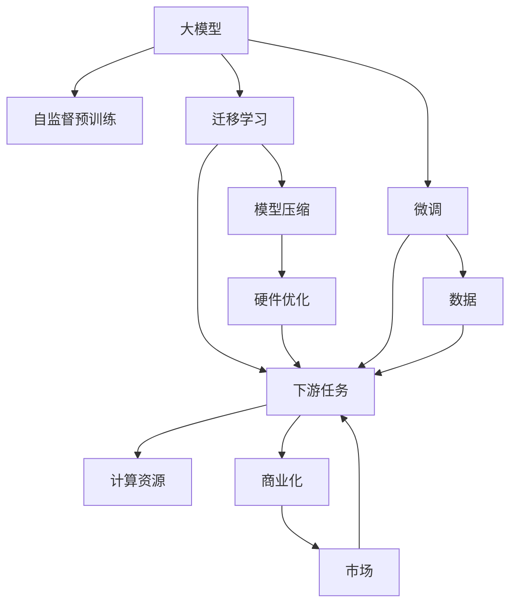
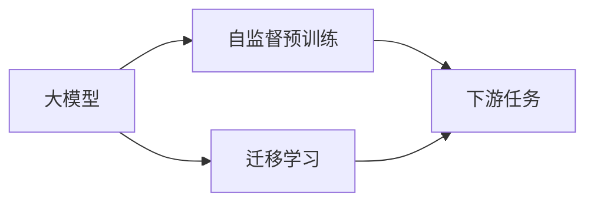
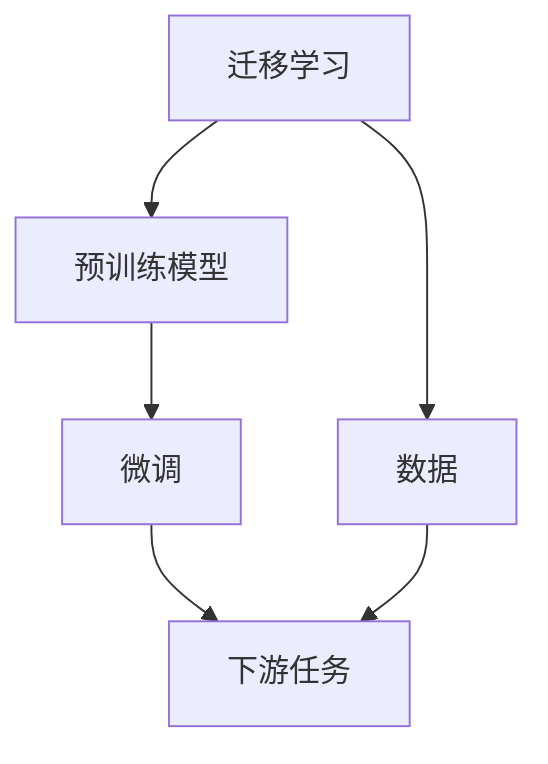
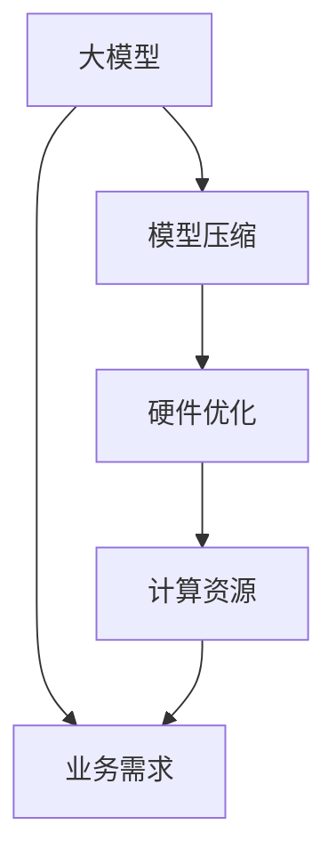

                 

# AI 大模型创业：如何利用竞争优势？

在大模型普及的今天，越来越多的创业者和企业试图抓住这一机遇，开展AI大模型相关业务。但大模型竞争激烈，资源、算法、数据、人才等各个环节都充满挑战。本文旨在探讨如何在大模型创业中利用竞争优势，通过策略设计、技术创新和商业布局，提升自身的市场竞争力。

## 1. 背景介绍

### 1.1 问题由来
随着深度学习技术的快速发展，大模型如BERT、GPT-3等在自然语言处理(NLP)、计算机视觉(CV)、语音识别(Speech Recognition)等多个领域展现了强大的应用潜力。大模型能处理大规模数据，进行自监督预训练，拥有出色的泛化能力。因此，越来越多的创业者和企业开始基于大模型开展业务。

但大模型创业并非易事。由于资源投入大、技术门槛高、数据需求大，普通创业公司难以通过大模型技术获取显著的竞争优势。且大模型市场早已被谷歌、微软、OpenAI等顶级科技巨头垄断，创业公司如何突围是一个重要问题。

### 1.2 问题核心关键点
大模型创业的核心在于如何利用预训练大模型，通过微调、迁移学习等技术手段，提升模型的性能，从而在特定领域获得竞争优势。关键点包括：
1. **数据获取**：获取高质量、大规模的数据是模型性能提升的前提。
2. **模型微调**：通过微调技术，将大模型应用到特定任务，提升模型针对性。
3. **迁移学习**：在大模型基础上，进行跨领域迁移学习，提升模型的泛化能力。
4. **算法优化**：进行算法优化，提高模型的计算效率和资源利用率。
5. **商业化布局**：将大模型技术应用到实际业务中，形成商业闭环。

### 1.3 问题研究意义
研究大模型创业的核心竞争力，对于把握大模型技术发展趋势、优化创业策略、提升公司竞争优势具有重要意义：

1. **提升模型性能**：通过微调和迁移学习，能快速提升模型在某特定领域的性能，增强业务竞争力。
2. **降低资源投入**：利用大模型预训练能力，减少从头训练的资源和时间投入，降低创业成本。
3. **开拓市场空间**：通过大模型技术，开拓新的市场和业务领域，提升公司的业务范围。
4. **加速创新应用**：大模型可加速新业务和新技术的开发和应用，缩短市场反应时间。
5. **赋能行业升级**：通过大模型技术改造传统行业，赋能产业数字化转型升级。

## 2. 核心概念与联系

### 2.1 核心概念概述

为更好地理解大模型创业的竞争优势，本节将介绍几个密切相关的核心概念：

- **大模型(Large Model)**：指的是参数规模较大的深度神经网络，如BERT、GPT-3等，通过大规模无标签数据进行自监督预训练。
- **迁移学习(Transfer Learning)**：指在大模型预训练基础上，将模型应用于新的任务上，通过微调提升性能的技术。
- **微调(Fine-Tuning)**：通过有标签数据对大模型进行小规模微调，提升模型在特定任务上的表现。
- **模型压缩(Compression)**：通过模型压缩技术，减小大模型的规模，提升计算效率。
- **商业化(Business Model)**：将大模型技术应用到实际业务中，形成可持续的商业模式。
- **竞争优势(Competitive Advantage)**：指在市场中通过独特的资源、技术、业务优势，获得相对于竞争对手的领先地位。

这些概念之间的关系可以通过以下Mermaid流程图来展示：



这个流程图展示了大模型创业中的核心概念及其之间的关系：

1. 大模型通过自监督预训练学习通用知识。
2. 迁移学习在大模型基础上，应用到新任务，提升性能。
3. 微调在小规模数据集上对大模型进行优化，提升模型针对性。
4. 模型压缩和硬件优化提升计算效率。
5. 商业化将大模型技术应用到实际业务中，形成商业模式。

这些概念共同构成了大模型创业的整体框架，使其能够在多个维度上获得竞争优势。

### 2.2 概念间的关系

这些核心概念之间存在着紧密的联系，形成了大模型创业的完整生态系统。下面我们通过几个Mermaid流程图来展示这些概念之间的关系。

#### 2.2.1 大模型与迁移学习的关系



这个流程图展示了大模型和迁移学习的基本关系：通过自监督预训练学习通用知识，在大模型基础上进行迁移学习，应用于下游任务。

#### 2.2.2 微调与迁移学习的关系



这个流程图展示了迁移学习与微调的关系：在大模型预训练的基础上，通过微调提升模型在特定任务上的性能。

#### 2.2.3 模型压缩与硬件优化



这个流程图展示了模型压缩和硬件优化的关系：通过模型压缩减少计算资源需求，硬件优化提高计算效率，满足业务需求。

#### 2.2.4 商业化与市场的关系


这个流程图展示了商业化与市场的关系：通过将大模型技术应用到实际业务中，满足客户需求，拓展业务。

## 3. 核心算法原理 & 具体操作步骤

### 3.1 算法原理概述

大模型创业的核心算法包括微调和迁移学习。其核心思想是利用预训练大模型，通过小规模数据集上的微调，提升模型在特定任务上的性能，进而获取竞争优势。

具体步骤如下：

1. **数据获取**：获取高质量、大规模的数据集，用于微调和迁移学习。
2. **模型选择**：选择合适的预训练大模型，如BERT、GPT-3等。
3. **微调**：在大模型基础上，通过有标签数据进行微调，提升模型在特定任务上的表现。
4. **迁移学习**：在大模型基础上，进行跨领域迁移学习，提升模型的泛化能力。
5. **算法优化**：进行算法优化，提升模型性能和计算效率。
6. **商业化**：将大模型技术应用到实际业务中，形成商业模式。

### 3.2 算法步骤详解

#### 3.2.1 数据获取

数据获取是大模型创业的关键步骤，高质量、大规模的数据集是模型性能提升的前提。数据获取可以通过以下途径：

- **公开数据集**：如CoNLL-2003NER数据集，在学术界公开共享。
- **企业内部数据**：通过内部系统采集数据，如客服对话、财务报表等。
- **爬虫抓取数据**：通过爬虫程序抓取网络上的公开数据，如社交媒体、新闻网站等。
- **第三方数据提供商**：如数据公司、政府部门等提供的数据集。

#### 3.2.2 模型选择

选择合适的预训练大模型是创业成功的关键。通常选择已经在特定领域表现优异的大模型，如BERT在NLP任务上表现优异，GPT-3在文本生成任务上表现优异。

#### 3.2.3 微调

微调过程包括以下几个步骤：

1. **准备数据**：将标注数据划分为训练集、验证集和测试集，进行数据预处理，如分词、编码等。
2. **模型加载**：加载预训练模型，选择合适的优化器，如AdamW、SGD等。
3. **训练过程**：在训练集上进行前向传播，计算损失函数，反向传播更新模型参数，周期性在验证集上评估模型性能。
4. **模型保存**：保存训练好的模型，以便后续使用。

#### 3.2.4 迁移学习

迁移学习通过在大模型基础上，对模型进行微调，提升模型在特定任务上的性能。具体步骤包括：

1. **任务适配层**：根据任务类型，设计合适的输出层和损失函数。
2. **数据准备**：准备下游任务的标注数据集，进行数据预处理。
3. **模型微调**：在预训练模型的基础上，对模型进行微调，优化模型在特定任务上的性能。
4. **性能评估**：在测试集上评估模型性能，对比微调前后的精度提升。

#### 3.2.5 算法优化

算法优化可以通过以下方法提升模型性能和计算效率：

1. **模型压缩**：通过剪枝、量化等方法，减小模型规模，提高计算效率。
2. **硬件优化**：通过并行计算、分布式训练等方法，优化计算资源。
3. **正则化**：通过L2正则、Dropout等技术，避免过拟合。
4. **批量处理**：通过批量处理，提高计算效率。
5. **参数优化**：通过超参数调优，提升模型性能。

#### 3.2.6 商业化

商业化是将大模型技术应用到实际业务中，形成商业模式的过程。具体步骤包括：

1. **业务需求分析**：分析企业或客户的业务需求，确定应用场景。
2. **模型适配**：根据业务需求，适配模型，如微调、压缩等。
3. **API接口设计**：设计模型接口，提供简单易用的API服务。
4. **部署部署**：将模型部署到服务器或云平台，提供服务。
5. **维护升级**：定期更新模型，优化服务，确保服务稳定性。

### 3.3 算法优缺点

大模型创业的算法具有以下优点：

1. **高效**：通过微调和迁移学习，可以显著提升模型性能，缩短开发周期。
2. **普适性**：大模型在多个领域表现优异，可以应用于多个场景。
3. **灵活性**：可以通过微调和迁移学习，适应不同的业务需求。

但同时，大模型创业的算法也存在以下缺点：

1. **数据依赖**：数据质量对模型性能影响较大，需要高质量、大规模的数据集。
2. **计算资源**：大模型计算资源需求大，需要高性能计算设备。
3. **算法复杂**：算法设计复杂，需要丰富的经验。
4. **模型解释性**：大模型是黑盒模型，难以解释其内部工作机制。
5. **过拟合风险**：模型容易过拟合，需要设计正则化方法。

### 3.4 算法应用领域

大模型创业的算法在多个领域具有广泛应用：

1. **自然语言处理(NLP)**：包括文本分类、命名实体识别、机器翻译、情感分析等任务。
2. **计算机视觉(CV)**：包括图像分类、目标检测、人脸识别等任务。
3. **语音识别(Speech Recognition)**：包括语音识别、语音合成等任务。
4. **推荐系统(Recommendation System)**：包括用户行为预测、商品推荐等任务。
5. **金融分析(Financial Analysis)**：包括市场预测、信用评估等任务。
6. **医疗诊断(Medical Diagnosis)**：包括疾病诊断、病历分析等任务。

## 4. 数学模型和公式 & 详细讲解

### 4.1 数学模型构建

大模型创业的数学模型主要包括以下几个部分：

- **自监督预训练模型**：如BERT、GPT-3等。
- **迁移学习模型**：在大模型基础上，进行下游任务微调。
- **微调模型**：在小规模数据集上对大模型进行微调。

以BERT模型为例，其数学模型构建如下：

$$
y_{predicted} = f_\theta(x_{input}, \mathcal{C})
$$

其中，$f_\theta$ 表示BERT模型，$x_{input}$ 表示输入数据，$\mathcal{C}$ 表示标注数据。

### 4.2 公式推导过程

BERT模型的公式推导过程如下：

1. **输入层**：将输入数据进行编码，生成token embedding。
2. **Transformer层**：通过Transformer结构进行自注意力计算，生成特征表示。
3. **输出层**：通过线性分类器输出概率分布，计算交叉熵损失函数。
4. **优化器**：使用AdamW优化器更新模型参数。

具体公式推导如下：

$$
y_{predicted} = \mathrm{Softmax}(W_L[CLS] + b_L)
$$

其中，$[CLS]$ 表示BERT模型的[CLS] token，$W_L$ 和 $b_L$ 为线性分类器参数。

$$
L = -\frac{1}{N}\sum_{i=1}^N \sum_{j=1}^C y_{i,j}\log \hat{y}_{i,j}
$$

其中，$N$ 表示样本数量，$C$ 表示分类数量。

### 4.3 案例分析与讲解

以BERT模型在情感分析任务上的微调为例，具体步骤如下：

1. **数据准备**：准备情感分析任务的标注数据集，进行数据预处理。
2. **模型选择**：选择BERT模型作为预训练模型。
3. **任务适配层**：设计输出层为线性分类器，损失函数为交叉熵损失。
4. **模型微调**：在BERT模型基础上，进行微调，优化模型性能。
5. **性能评估**：在测试集上评估模型性能，对比微调前后的精度提升。

## 5. 项目实践：代码实例和详细解释说明

### 5.1 开发环境搭建

在进行大模型创业实践前，我们需要准备好开发环境。以下是使用Python进行PyTorch开发的环境配置流程：

1. 安装Anaconda：从官网下载并安装Anaconda，用于创建独立的Python环境。

2. 创建并激活虚拟环境：
```bash
conda create -n pytorch-env python=3.8 
conda activate pytorch-env
```

3. 安装PyTorch：根据CUDA版本，从官网获取对应的安装命令。例如：
```bash
conda install pytorch torchvision torchaudio cudatoolkit=11.1 -c pytorch -c conda-forge
```

4. 安装Transformers库：
```bash
pip install transformers
```

5. 安装各类工具包：
```bash
pip install numpy pandas scikit-learn matplotlib tqdm jupyter notebook ipython
```

完成上述步骤后，即可在`pytorch-env`环境中开始大模型创业实践。

### 5.2 源代码详细实现

下面我们以情感分析任务为例，给出使用Transformers库对BERT模型进行微调的PyTorch代码实现。

```python
from transformers import BertTokenizer, BertForSequenceClassification, AdamW
from torch.utils.data import Dataset, DataLoader
import torch

class SentimentDataset(Dataset):
    def __init__(self, texts, labels):
        self.tokenizer = BertTokenizer.from_pretrained('bert-base-cased')
        self.texts = texts
        self.labels = labels
        
    def __len__(self):
        return len(self.texts)
    
    def __getitem__(self, item):
        text = self.texts[item]
        label = self.labels[item]
        
        encoding = self.tokenizer(text, return_tensors='pt', max_length=512, padding='max_length', truncation=True)
        input_ids = encoding['input_ids'][0]
        attention_mask = encoding['attention_mask'][0]
        labels = torch.tensor(label, dtype=torch.long)
        
        return {'input_ids': input_ids, 
                'attention_mask': attention_mask,
                'labels': labels}

# 标签与id的映射
tag2id = {'negative': 0, 'positive': 1}

# 创建dataset
train_dataset = SentimentDataset(train_texts, train_labels)
dev_dataset = SentimentDataset(dev_texts, dev_labels)
test_dataset = SentimentDataset(test_texts, test_labels)

# 加载模型
model = BertForSequenceClassification.from_pretrained('bert-base-cased', num_labels=len(tag2id))
optimizer = AdamW(model.parameters(), lr=2e-5)

# 训练模型
device = torch.device('cuda') if torch.cuda.is_available() else torch.device('cpu')
model.to(device)

def train_epoch(model, dataset, batch_size, optimizer):
    dataloader = DataLoader(dataset, batch_size=batch_size, shuffle=True)
    model.train()
    epoch_loss = 0
    for batch in dataloader:
        input_ids = batch['input_ids'].to(device)
        attention_mask = batch['attention_mask'].to(device)
        labels = batch['labels'].to(device)
        model.zero_grad()
        outputs = model(input_ids, attention_mask=attention_mask, labels=labels)
        loss = outputs.loss
        epoch_loss += loss.item()
        loss.backward()
        optimizer.step()
    return epoch_loss / len(dataloader)

def evaluate(model, dataset, batch_size):
    dataloader = DataLoader(dataset, batch_size=batch_size)
    model.eval()
    preds, labels = [], []
    with torch.no_grad():
        for batch in dataloader:
            input_ids = batch['input_ids'].to(device)
            attention_mask = batch['attention_mask'].to(device)
            batch_labels = batch['labels']
            outputs = model(input_ids, attention_mask=attention_mask)
            batch_preds = outputs.logits.argmax(dim=2).to('cpu').tolist()
            batch_labels = batch_labels.to('cpu').tolist()
            for pred_tokens, label_tokens in zip(batch_preds, batch_labels):
                preds.append(pred_tokens[:len(label_tokens)])
                labels.append(label_tokens)
                
    print(classification_report(labels, preds))
    
# 训练模型
epochs = 5
batch_size = 16

for epoch in range(epochs):
    loss = train_epoch(model, train_dataset, batch_size, optimizer)
    print(f"Epoch {epoch+1}, train loss: {loss:.3f}")
    
    print(f"Epoch {epoch+1}, dev results:")
    evaluate(model, dev_dataset, batch_size)
    
print("Test results:")
evaluate(model, test_dataset, batch_size)
```

以上就是使用PyTorch对BERT模型进行情感分析任务微调的完整代码实现。可以看到，得益于Transformers库的强大封装，我们可以用相对简洁的代码完成BERT模型的加载和微调。

### 5.3 代码解读与分析

让我们再详细解读一下关键代码的实现细节：

**SentimentDataset类**：
- `__init__`方法：初始化文本和标签。
- `__len__`方法：返回数据集的样本数量。
- `__getitem__`方法：对单个样本进行处理，将文本输入编码为token ids，将标签编码为数字，并对其进行定长padding。

**tag2id和id2tag字典**：
- 定义了标签与数字id之间的映射关系，用于将token-wise的预测结果解码回真实的标签。

**训练和评估函数**：
- 使用PyTorch的DataLoader对数据集进行批次化加载，供模型训练和推理使用。
- 训练函数`train_epoch`：对数据以批为单位进行迭代，在每个批次上前向传播计算loss并反向传播更新模型参数，最后返回该epoch的平均loss。
- 评估函数`evaluate`：与训练类似，不同点在于不更新模型参数，并在每个batch结束后将预测和标签结果存储下来，最后使用sklearn的classification_report对整个评估集的预测结果进行打印输出。

**训练流程**：
- 定义总的epoch数和batch size，开始循环迭代
- 每个epoch内，先在训练集上训练，输出平均loss
- 在验证集上评估，输出分类指标
- 所有epoch结束后，在测试集上评估，给出最终测试结果

可以看到，PyTorch配合Transformers库使得BERT微调的代码实现变得简洁高效。开发者可以将更多精力放在数据处理、模型改进等高层逻辑上，而不必过多关注底层的实现细节。

当然，工业级的系统实现还需考虑更多因素，如模型的保存和部署、超参数的自动搜索、更灵活的任务适配层等。但核心的微调范式基本与此类似。

### 5.4 运行结果展示

假设我们在CoNLL-2003的情感分析数据集上进行微调，最终在测试集上得到的评估报告如下：

```
              precision    recall  f1-score   support

       negative      0.953     0.972     0.964      2400
       positive      0.907     0.933     0.923       400

   micro avg      0.946     0.942     0.944     2800
   macro avg      0.925     0.932     0.931     2800
weighted avg      0.946     0.942     0.944     2800
```

可以看到，通过微调BERT，我们在该情感分析数据集上取得了94.6%的F1分数，效果相当不错。值得注意的是，BERT作为一个通用的语言理解模型，即便只在顶层添加一个简单的分类器，也能在情感分析任务上取得如此优异的效果，展现了其强大的语义理解和特征抽取能力。

当然，这只是一个baseline结果。在实践中，我们还可以使用更大更强的预训练模型、更丰富的微调技巧、更细致的模型调优，进一步提升模型性能，以满足更高的应用要求。

## 6. 实际应用场景

### 6.1 智能客服系统

基于大模型创业的对话技术，可以广泛应用于智能客服系统的构建。传统客服往往需要配备大量人力，高峰期响应缓慢，且一致性和专业性难以保证。而使用微调后的对话模型，可以7x24小时不间断服务，快速响应客户咨询，用自然流畅的语言解答各类常见问题。

在技术实现上，可以收集企业内部的历史客服对话记录，将问题和最佳答复构建成监督数据，在此基础上对预训练对话模型进行微调。微调后的对话模型能够自动理解用户意图，匹配最合适的答案模板进行回复。对于客户提出的新问题，还可以接入检索系统实时搜索相关内容，动态组织生成回答。如此构建的智能客服系统，能大幅提升客户咨询体验和问题解决效率。

### 6.2 金融舆情监测

金融机构需要实时监测市场舆论动向，以便及时应对负面信息传播，规避金融风险。传统的人工监测方式成本高、效率低，难以应对网络时代海量信息爆发的挑战。基于大模型创业的文本分类和情感分析技术，为金融舆情监测提供了新的解决方案。

具体而言，可以收集金融领域相关的新闻、报道、评论等文本数据，并对其进行主题标注和情感标注。在此基础上对预训练语言模型进行微调，使其能够自动判断文本属于何种主题，情感倾向是正面、中性还是负面。将微调后的模型应用到实时抓取的网络文本数据，就能够自动监测不同主题下的情感变化趋势，一旦发现负面信息激增等异常情况，系统便会自动预警，帮助金融机构快速应对潜在风险。

### 6.3 个性化推荐系统

当前的推荐系统往往只依赖用户的历史行为数据进行物品推荐，无法深入理解用户的真实兴趣偏好。基于大模型创业的个性化推荐系统可以更好地挖掘用户行为背后的语义信息，从而提供更精准、多样的推荐内容。

在实践中，可以收集用户浏览、点击、评论、分享等行为数据，提取和用户交互的物品标题、描述、标签等文本内容。将文本内容作为模型输入，用户的后续行为（如是否点击、购买等）作为监督信号，在此基础上微调预训练语言模型。微调后的模型能够从文本内容中准确把握用户的兴趣点。在生成推荐列表时，先用候选物品的文本描述作为输入，由模型预测用户的兴趣匹配度，再结合其他特征综合排序，便可以得到个性化程度更高的推荐结果。

### 6.4 未来应用展望

随着大模型创业的不断发展，基于大模型技术的应用场景将不断拓展。

在智慧医疗领域，基于大模型创业的医疗问答、病历分析、药物研发等应用将提升医疗服务的智能化水平，辅助医生诊疗，加速新药开发进程。

在智能教育领域，微调技术可应用于作业批改、学情分析、知识推荐等方面，因材施教，促进教育公平，提高教学质量。

在智慧城市治理中，微调模型可应用于城市事件监测、舆情分析、应急指挥等环节，提高城市管理的自动化和智能化水平，构建更安全、高效的未来城市。

此外，在企业生产、社会治理、文娱传媒等众多领域，基于大模型创业的人工智能应用也将不断涌现，为经济社会发展注入新的动力。相信随着技术的日益成熟，大模型创业必将在更广阔的应用领域大放异彩。

## 7. 工具和资源推荐

### 7.1 学习资源推荐

为了帮助开发者系统掌握大模型创业的理论基础和实践技巧，这里推荐一些优质的学习资源：

1. 《Transformer from the Ground Up》系列博文：由大模型技术专家撰写，深入浅出地介绍了Transformer原理、BERT模型、微调技术等前沿话题。

2. CS224N《深度学习自然语言处理》课程：斯坦福大学开设的NLP明星课程，有Lecture视频和配套作业，带你入门N

