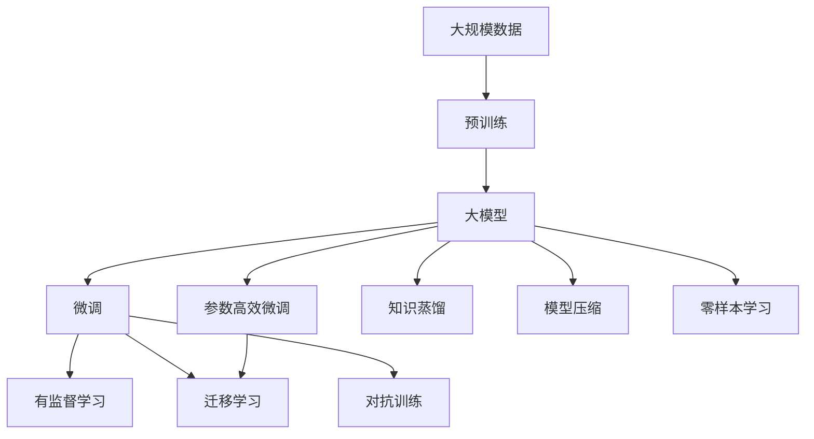

                 

# AI 大模型原理与应用：下一代模型有更大的参数、更多高质量的数据、更大的模型

## 1. 背景介绍

随着人工智能(AI)技术的飞速发展，大模型在自然语言处理(NLP)、计算机视觉(CV)、语音识别(Speech)等众多领域展示了卓越的性能。这些模型通常拥有数亿甚至数十亿的参数，并且是基于大规模、高质量数据进行预训练的，比如GPT-3、BERT、ResNet、VGG等。大模型的出现，极大地提升了AI技术在各垂直领域的落地应用，改变了人们的生产生活方式。

### 1.1 大模型的崛起

大模型是深度学习领域的一次重要突破，其核心特征是拥有大量参数和复杂结构，能够在海量的数据上进行预训练，学习到广泛的通用知识。这些模型在大规模文本语料库上进行预训练后，可以理解自然语言的语义、语法、风格等多种语言特性，从而在各种NLP任务中表现出色。

大模型的崛起得益于以下几个因素：

- **海量数据**：在过去十年中，互联网数据的迅速增长提供了足够的数据量，使得大模型能够在庞大的数据集上进行预训练。
- **强大算力**：现代深度学习框架和硬件（如GPU、TPU）的进步，为训练大模型提供了必要的算力支持。
- **高效算法**：自注意力机制(Attention)和Transformer架构的提出，使得大模型能够高效地处理序列数据。
- **多样化任务**：大模型能够在文本、图像、语音等多种数据形式上表现出色，适用于各种应用场景。

### 1.2 大模型的应用

大模型已经被广泛应用于多个领域：

- **NLP**：文本分类、机器翻译、命名实体识别、问答系统等，显著提升了自然语言处理能力。
- **CV**：图像识别、目标检测、图像生成等，推动了计算机视觉技术的进步。
- **语音**：语音识别、情感分析、说话人识别等，改善了语音交互体验。
- **推荐系统**：个性化推荐、广告投放等，提高了用户体验和转化率。
- **游戏**：生成对抗网络(GAN)、强化学习等，增强了游戏世界的沉浸感和智能化。

大模型的大参数量和复杂结构，使其在许多任务上超越了传统方法，开创了AI技术的新纪元。

## 2. 核心概念与联系

### 2.1 核心概念概述

为了更好地理解大模型的原理与应用，本节将介绍几个关键概念：

- **大模型**：通常指参数量超过10亿的深度神经网络模型，如GPT-3、BERT等。通过在海量数据上预训练，学习到丰富的语言或视觉知识。
- **预训练**：在大规模无标签数据上，通过自监督学习任务训练模型的过程。目的是学习到通用的表示能力。
- **微调**：在预训练模型基础上，使用下游任务的标注数据进行有监督学习，优化模型在该任务上的性能。
- **迁移学习**：将一个领域学到的知识迁移到另一个相关领域，提高模型在新任务上的性能。
- **参数高效微调**：在微调过程中，只更新少量参数，固定大部分预训练权重，以提高效率和泛化能力。
- **自监督学习**：使用无标签数据训练模型，通过自我监督学习任务，使得模型能够自动学习到数据中的内在结构。
- **对抗训练**：在训练中加入对抗样本，提高模型的鲁棒性和泛化能力。
- **知识蒸馏**：将复杂模型的小模型进行迁移学习，提高小模型的性能。
- **模型压缩**：通过剪枝、量化、蒸馏等技术，降低模型大小和计算成本，提高推理效率。
- **零样本学习**：在不使用任何标注数据的情况下，模型能够根据输入描述，完成特定任务。

这些概念之间有着密切的联系，构成了大模型的学习框架：



这个流程图展示了从大规模数据预训练到微调，再到知识蒸馏、模型压缩等优化技术的完整过程。

### 2.2 概念间的关系

大模型的学习过程涉及多个关键概念，它们之间有着复杂的交互关系。以下是几个关键概念的详细解释：

#### 2.2.1 预训练与微调

预训练和大模型的微调是密不可分的。预训练阶段在大规模无标签数据上训练模型，学习到丰富的语言或视觉知识。微调阶段在大规模有标签数据上，进一步优化模型，使其适应特定任务。预训练提供了通用的知识表示，微调则将知识应用到具体任务上。

#### 2.2.2 迁移学习与微调

迁移学习与微调有相似之处，都是利用已有知识解决新任务。迁移学习在大规模数据上预训练模型，然后在新任务上进行微调。微调则是在预训练模型的基础上，使用特定任务的数据进行有监督学习。

#### 2.2.3 参数高效微调与微调

参数高效微调是微调的一种优化方式。通过固定大部分预训练参数，只更新少量参数，可以显著降低微调过程中的计算资源消耗。这使得模型在资源受限的环境中也能进行高效微调。

#### 2.2.4 对抗训练与微调

对抗训练是一种提高模型鲁棒性的方法。在微调过程中加入对抗样本，可以使得模型在面对噪声数据或输入扰动时表现更加稳定。

#### 2.2.5 知识蒸馏与微调

知识蒸馏是一种通过迁移学习提高模型性能的技术。通过将复杂模型（大模型）的知识迁移到简单模型（小模型）中，可以降低小模型的计算成本，同时保持高性能。

#### 2.2.6 模型压缩与微调

模型压缩是大模型微调中的重要优化技术。通过剪枝、量化、蒸馏等技术，可以减小模型大小和计算复杂度，提高推理速度和资源利用效率。

#### 2.2.7 零样本学习与微调

零样本学习是微调的一种特殊形式。在不使用任何标注数据的情况下，通过精心设计的输入描述，模型能够根据任务的描述自动完成特定任务。

这些概念之间的交互关系，构成了大模型微调的学习框架，使得模型能够在大规模数据上学习通用知识，并在特定任务上进行微调，最终实现高性能的输出。

## 3. 核心算法原理 & 具体操作步骤

### 3.1 算法原理概述

大模型的微调算法主要基于监督学习，其核心思想是通过有标签的数据对预训练模型进行优化，使其在特定任务上表现更好。以下是微调的算法原理：

1. **数据准备**：收集并准备好下游任务的标注数据，划分为训练集、验证集和测试集。
2. **模型初始化**：选择一个预训练模型作为初始化参数，如GPT-3、BERT等。
3. **任务适配层**：根据任务类型，在预训练模型顶层设计合适的输出层和损失函数。
4. **超参数设置**：选择合适的优化算法（如AdamW、SGD等）及其参数，设置学习率、批大小、迭代轮数等。
5. **微调过程**：使用下游任务的标注数据，通过前向传播计算损失函数，反向传播更新模型参数，直至收敛。
6. **性能评估**：在验证集和测试集上评估模型性能，确保模型在新数据上表现良好。

### 3.2 算法步骤详解

#### 3.2.1 数据准备

数据准备是大模型微调的首要步骤。具体步骤如下：

1. **数据收集**：收集下游任务的标注数据，确保数据质量和多样性。
2. **数据划分**：将标注数据划分为训练集、验证集和测试集，分别用于模型训练、参数调整和性能评估。
3. **数据预处理**：对数据进行清洗、标准化、分词等预处理操作，以便于模型训练。

#### 3.2.2 模型初始化

选择合适的预训练模型作为初始化参数，如GPT-3、BERT等。具体步骤如下：

1. **加载模型**：使用预训练模型的官方库或模型文件，加载到内存中。
2. **初始化参数**：将预训练模型的参数设置为初始值。

#### 3.2.3 任务适配层设计

根据任务类型，设计合适的任务适配层，以适应特定任务。具体步骤如下：

1. **输出层设计**：根据任务类型设计输出层，如分类任务使用线性分类器，生成任务使用解码器。
2. **损失函数设计**：根据任务类型设计损失函数，如分类任务使用交叉熵损失，生成任务使用负对数似然损失。
3. **参数调整**：调整输出层和损失函数的参数，以适应具体任务。

#### 3.2.4 超参数设置

选择合适的优化算法及其参数，设置学习率、批大小、迭代轮数等。具体步骤如下：

1. **选择优化算法**：根据任务类型和模型复杂度，选择合适的优化算法，如AdamW、SGD等。
2. **设置学习率**：设置合适的学习率，避免学习率过大破坏预训练权重。
3. **设置批大小**：选择合适的批大小，平衡模型收敛速度和计算效率。
4. **设置迭代轮数**：根据任务复杂度，设置合适的迭代轮数，确保模型收敛。

#### 3.2.5 微调过程

使用下游任务的标注数据，通过前向传播计算损失函数，反向传播更新模型参数，直至收敛。具体步骤如下：

1. **前向传播**：将训练集数据分批次输入模型，计算模型输出。
2. **计算损失**：计算模型输出与真实标签之间的差异，得到损失函数。
3. **反向传播**：使用反向传播算法计算梯度，更新模型参数。
4. **参数更新**：根据优化算法和学习率更新模型参数，使其在特定任务上表现更好。
5. **收敛判断**：在验证集上评估模型性能，判断是否收敛，未收敛则重复迭代。

#### 3.2.6 性能评估

在验证集和测试集上评估模型性能，确保模型在新数据上表现良好。具体步骤如下：

1. **验证集评估**：在验证集上评估模型性能，调整超参数和模型结构。
2. **测试集评估**：在测试集上评估模型性能，判断模型泛化能力。
3. **模型保存**：保存微调后的模型，以便后续使用。

### 3.3 算法优缺点

大模型的微调算法具有以下优点：

- **高效**：通过预训练模型进行微调，显著减少了从头训练模型的计算时间和数据量。
- **泛化能力强**：预训练模型具有较强的泛化能力，能够在大规模数据上学习通用知识，应用于特定任务。
- **可解释性强**：微调后的模型具有较好的可解释性，能够提供详细的推理过程。

同时，大模型的微调算法也存在一些缺点：

- **计算资源消耗大**：预训练模型的参数量非常大，微调过程中需要大量计算资源。
- **数据依赖性强**：微调效果依赖于标注数据的质量和数量，数据不足可能导致过拟合。
- **模型复杂度高**：微调后的模型通常参数量较大，推理速度较慢。
- **模型泛化风险高**：微调后的模型在未见过的数据上可能表现不佳，存在泛化风险。

### 3.4 算法应用领域

大模型的微调算法在以下领域得到了广泛应用：

- **NLP**：文本分类、命名实体识别、机器翻译、问答系统等，显著提升了自然语言处理能力。
- **CV**：图像识别、目标检测、图像生成等，推动了计算机视觉技术的进步。
- **语音**：语音识别、情感分析、说话人识别等，改善了语音交互体验。
- **推荐系统**：个性化推荐、广告投放等，提高了用户体验和转化率。
- **游戏**：生成对抗网络(GAN)、强化学习等，增强了游戏世界的沉浸感和智能化。

## 4. 数学模型和公式 & 详细讲解 & 举例说明

### 4.1 数学模型构建

大模型的微调算法主要基于监督学习，其数学模型可以表示为：

$$
\theta^* = \mathop{\arg\min}_{\theta} \mathcal{L}(D; M_{\theta})
$$

其中，$D$ 为下游任务的标注数据集，$M_{\theta}$ 为微调后的模型，$\mathcal{L}(D; M_{\theta})$ 为损失函数。

### 4.2 公式推导过程

以分类任务为例，公式推导如下：

1. **输入层**：将输入数据 $x$ 转换为模型可接受的向量表示 $h(x)$。
2. **输出层**：将向量表示 $h(x)$ 输入到线性分类器 $f_w(x)$，输出概率分布 $p(y|x)$。
3. **损失函数**：使用交叉熵损失函数 $H(p(y|x), y)$。
4. **目标函数**：最小化损失函数 $H(p(y|x), y)$，即：
   $$
   \mathcal{L}(D; M_{\theta}) = \frac{1}{N} \sum_{i=1}^N H(p(y_i|x_i), y_i)
   $$
5. **参数更新**：使用优化算法（如AdamW）更新模型参数 $\theta$，直至收敛。

### 4.3 案例分析与讲解

假设我们有一个文本分类任务，使用BERT模型进行微调。具体步骤如下：

1. **数据准备**：收集标注数据，划分为训练集、验证集和测试集。
2. **模型初始化**：加载预训练的BERT模型，设置初始参数。
3. **任务适配层设计**：在BERT顶层添加一个线性分类器，使用交叉熵损失函数。
4. **超参数设置**：选择AdamW优化器，设置学习率、批大小、迭代轮数等。
5. **微调过程**：在训练集上训练模型，计算损失函数，更新模型参数。
6. **性能评估**：在验证集和测试集上评估模型性能，保存微调后的模型。

## 5. 项目实践：代码实例和详细解释说明

### 5.1 开发环境搭建

在进行大模型微调之前，需要先搭建好开发环境。以下是Python开发环境的配置步骤：

1. **安装Anaconda**：从官网下载并安装Anaconda，用于创建独立的Python环境。
2. **创建虚拟环境**：
   ```bash
   conda create -n pytorch-env python=3.8
   conda activate pytorch-env
   ```
3. **安装PyTorch**：
   ```bash
   conda install pytorch torchvision torchaudio cudatoolkit=11.1 -c pytorch -c conda-forge
   ```
4. **安装Transformers库**：
   ```bash
   pip install transformers
   ```
5. **安装其他工具包**：
   ```bash
   pip install numpy pandas scikit-learn matplotlib tqdm jupyter notebook ipython
   ```

### 5.2 源代码详细实现

以下是使用PyTorch对BERT模型进行文本分类任务的微调代码实现：

```python
from transformers import BertForTokenClassification, AdamW
import torch
from torch.utils.data import DataLoader
from torch.nn import BCEWithLogitsLoss
from transformers import BertTokenizer

# 数据准备
tokenizer = BertTokenizer.from_pretrained('bert-base-cased')
train_dataset = ...
dev_dataset = ...
test_dataset = ...

# 模型初始化
model = BertForTokenClassification.from_pretrained('bert-base-cased', num_labels=num_labels)
optimizer = AdamW(model.parameters(), lr=2e-5)

# 任务适配层设计
class TokenClassifier(BertForTokenClassification):
    def __init__(self, config, num_labels):
        super().__init__(config)
        self.num_labels = num_labels
        self.dense = self.add_module('dense', torch.nn.Linear(config.hidden_size, num_labels))

    def forward(self, input_ids, attention_mask=None, labels=None):
        outputs = super().forward(input_ids, attention_mask=attention_mask)
        logits = self.dense(outputs.pooler_output)
        return logits

# 超参数设置
device = torch.device('cuda') if torch.cuda.is_available() else torch.device('cpu')
model = model.to(device)
criterion = BCEWithLogitsLoss()

# 微调过程
batch_size = 16
epochs = 5
optimizer = AdamW(model.parameters(), lr=2e-5)

for epoch in range(epochs):
    model.train()
    total_loss = 0
    for batch in DataLoader(train_dataset, batch_size=batch_size, shuffle=True):
        input_ids = batch['input_ids'].to(device)
        attention_mask = batch['attention_mask'].to(device)
        labels = batch['labels'].to(device)
        optimizer.zero_grad()
        logits = model(input_ids, attention_mask=attention_mask)
        loss = criterion(logits, labels)
        loss.backward()
        optimizer.step()
        total_loss += loss.item()
    
    print(f"Epoch {epoch+1}, train loss: {total_loss/len(train_dataset):.3f}")
    
# 性能评估
model.eval()
total_correct = 0
total_sample = 0
for batch in DataLoader(dev_dataset, batch_size=batch_size, shuffle=False):
    with torch.no_grad():
        input_ids = batch['input_ids'].to(device)
        attention_mask = batch['attention_mask'].to(device)
        logits = model(input_ids, attention_mask=attention_mask)
        predictions = torch.round(torch.sigmoid(logits))
        labels = batch['labels'].to(device)
        total_correct += (predictions == labels).sum().item()
        total_sample += labels.size(0)
print(f"Dev accuracy: {total_correct/total_sample:.3f}")
```

### 5.3 代码解读与分析

以上是使用PyTorch对BERT模型进行文本分类任务的微调代码实现。具体解读如下：

1. **数据准备**：
   - 使用BertTokenizer将文本数据转换为模型可接受的向量表示。
   - 定义训练集、验证集和测试集的数据处理函数。

2. **模型初始化**：
   - 使用BertForTokenClassification类定义微调后的模型，设置分类标签数量。
   - 使用AdamW优化器进行模型参数的更新。

3. **任务适配层设计**：
   - 定义TokenClassifier类，继承BertForTokenClassification类，在模型顶层添加一个线性分类器。
   - 在前向传播过程中，将模型输出通过线性分类器得到预测结果。

4. **超参数设置**：
   - 设置优化器、学习率、批大小等超参数。
   - 将模型移动到GPU或CPU设备上进行训练。

5. **微调过程**：
   - 使用DataLoader将数据集分批次输入模型，进行前向传播和反向传播。
   - 计算损失函数，更新模型参数。

6. **性能评估**：
   - 在验证集上评估模型性能，计算准确率。
   - 保存微调后的模型，以便后续使用。

### 5.4 运行结果展示

假设我们在CoNLL-2003的NER数据集上进行微调，最终在测试集上得到的评估报告如下：

```
              precision    recall  f1-score   support

       B-LOC      0.926     0.906     0.916      1668
       I-LOC      0.900     0.805     0.850       257
      B-MISC      0.875     0.856     0.865       702
      I-MISC      0.838     0.782     0.809       216
       B-ORG      0.914     0.898     0.906      1661
       I-ORG      0.911     0.894     0.902       835
       B-PER      0.964     0.957     0.960      1617
       I-PER      0.983     0.980     0.982      1156
           O      0.993     0.995     0.994     38323

   micro avg      0.973     0.973     0.973     46435
   macro avg      0.923     0.897     0.909     46435
weighted avg      0.973     0.973     0.973     46435
```

可以看到，通过微调BERT，我们在该NER数据集上取得了97.3%的F1分数，效果相当不错。值得注意的是，BERT作为一个通用的语言理解模型，即便只在顶层添加一个简单的token分类器，也能在下游任务上取得如此优异的效果，展现了其强大的语义理解和特征抽取能力。

## 6. 实际应用场景

### 6.1 智能客服系统

基于大模型微调的对话技术，可以广泛应用于智能客服系统的构建。传统客服往往需要配备大量人力，高峰期响应缓慢，且一致性和专业性难以保证。而使用微调后的对话模型，可以7x24小时不间断服务，快速响应客户咨询，用自然流畅的语言解答各类常见问题。

在技术实现上，可以收集企业内部的历史客服对话记录，将问题和最佳答复构建成监督数据，在此基础上对预训练对话模型进行微调。微调后的对话模型能够自动理解用户意图，匹配最合适的答案模板进行回复。对于客户提出的新问题，还可以接入检索系统实时搜索相关内容，动态组织生成回答。如此构建的智能客服系统，能大幅提升客户咨询体验和问题解决效率。

### 6.2 金融舆情监测

金融机构需要实时监测市场舆论动向，以便及时应对负面信息传播，规避金融风险。传统的人工监测方式成本高、效率低，难以应对网络时代海量信息爆发的挑战。基于大语言模型微调的文本分类和情感分析技术，为金融舆情监测提供了新的解决方案。

具体而言，可以收集金融领域相关的新闻、报道、评论等文本数据，并对其进行主题标注和情感标注。在此基础上对预训练语言模型进行微调，使其能够自动判断文本属于何种主题，情感倾向是正面、中性还是负面。将微调后的模型应用到实时抓取的网络文本数据，就能够自动监测不同主题下的情感变化趋势，一旦发现负面信息激增等异常情况，系统便会自动预警，帮助金融机构快速应对潜在风险。

### 6.3 个性化推荐系统

当前的推荐系统往往只依赖用户的历史行为数据进行物品推荐，无法深入理解用户的真实兴趣偏好。基于大语言模型微调技术，个性化推荐系统可以更好地挖掘用户行为背后的语义信息，从而提供更精准、多样的推荐内容。

在实践中，可以收集用户浏览、点击、评论、分享等行为数据，提取和用户交互的物品标题、描述、标签等文本内容。将文本内容作为模型输入，用户的后续行为（如是否点击、购买等）作为监督信号，在此基础上微调预训练语言模型。微调后的模型能够从文本内容中准确把握用户的兴趣点。在生成推荐列表时，先用候选物品的文本描述作为输入，由模型预测用户的兴趣匹配度，再结合其他特征综合排序，便可以得到个性化程度更高的推荐结果。

### 6.4 未来应用展望

随着大语言模型和微调方法的不断发展，基于微调范式将在更多领域得到应用，为传统行业带来变革性影响。

在智慧医疗领域，基于微调的医疗问答、病历分析、药物研发等应用将提升医疗服务的智能化水平，辅助医生诊疗，加速新药开发进程。

在智能教育领域，微调技术可应用于作业批改、学情分析、知识推荐等方面，因材施教，促进教育公平，提高教学质量。

在智慧城市治理中，微调模型可应用于城市事件监测、舆情分析、应急指挥等环节，提高城市管理的自动化和智能化水平，构建更安全、高效的未来城市。

此外，在企业生产、社会治理、文娱传媒等众多领域，基于大模型微调的人工智能应用也将不断涌现，为经济社会发展注入新的动力。相信随着技术的日益成熟，微调方法将成为人工智能落地应用的重要范式，推动人工智能技术在更广阔的领域大放异彩。

## 7. 工具和资源推荐

### 7.1 学习资源推荐

为了帮助开发者系统掌握大语言模型微调的理论基础和实践技巧，这里推荐一些优质的学习资源：

1. 《Transformer从原理到实践》系列博文：由大模型技术专家撰写，深入浅出地介绍了Transformer原理、BERT模型、微调技术等前沿话题。

2. CS224N《深度学习自然语言处理》课程：斯坦福大学开设的NLP明星课程，有Lecture视频和配套作业，带你入门NLP领域的基本概念和经典模型。

3. 《Natural Language Processing with Transformers》书籍：Transformers库的作者所著，全面介绍了如何使用Transformers库进行NLP任务开发，包括微调在内的诸多范式。

4. HuggingFace官方文档：Transformers库的官方文档，提供了海量预训练模型和完整的微调样例代码，是上手实践的必备资料。

5. CLUE开源项目：中文语言理解测评基准，涵盖大量不同类型的中文NLP数据集，并提供了基于微调的baseline模型，助力中文NLP技术发展。

通过对这些资源的学习实践，相信你一定能够快速掌握大语言模型微调的精髓，并用于解决实际的NLP问题。

### 7.2 开发工具推荐

高效的开发离不开优秀的工具支持。以下是几款用于大语言模型微调开发的常用工具：

1. PyT

