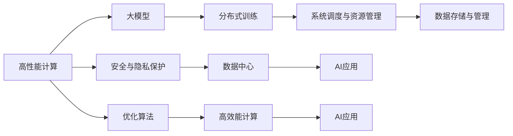
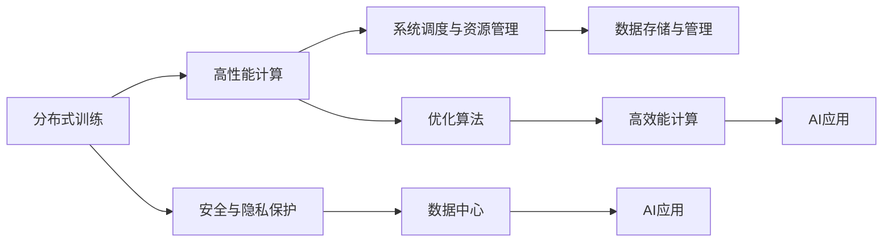
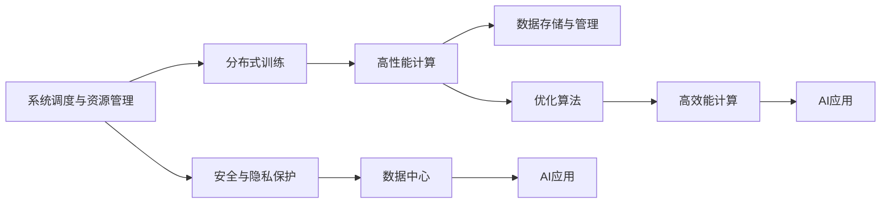
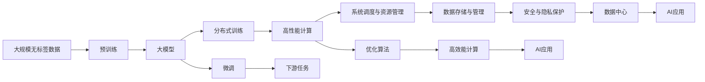

                 

# AI 大模型应用数据中心建设：数据中心技术与应用

## 1. 背景介绍

### 1.1 问题由来
随着人工智能技术的飞速发展，尤其是深度学习和自然语言处理技术的不断突破，大模型（Large Models）在众多应用场景中展现出巨大的潜力。这些大模型通过在大规模无标签数据上进行预训练，学习到丰富的知识表示，能够在各种下游任务中实现优异的表现。然而，大模型的预训练和微调通常需要消耗大量的计算资源和存储资源，这对数据中心的技术和基础设施提出了极高的要求。如何构建高效、可扩展、稳定的大模型应用数据中心，成为当前人工智能应用领域的一大挑战。

### 1.2 问题核心关键点
构建大模型应用数据中心的核心关键点在于：
- **高效能计算能力**：通过高性能计算硬件（如GPU、TPU、FPGA等）和优化算法（如混合精度训练、异构计算、分布式训练等），提供足够的计算资源支持大模型的训练和推理。
- **大规模数据存储与管理**：建立大容量、高可靠性的存储系统，保证数据的高效读写和长期存储。
- **网络互联与通信**：构建高速、低延迟、可扩展的网络架构，支持大规模分布式训练和模型服务的访问。
- **系统调度和资源管理**：实现任务调度、资源分配与优化，提升数据中心的整体利用效率。
- **安全与隐私保护**：确保数据与模型在传输和存储过程中的安全性和隐私保护，防止数据泄露和模型滥用。

### 1.3 问题研究意义
构建高效的大模型应用数据中心，对于推动人工智能技术的产业化落地、提升应用系统的性能与效率、保障数据和模型的安全与隐私具有重要意义：

1. **加速模型训练与推理**：通过高效能计算能力和优化算法，大幅缩短大模型的训练时间，提高模型的推理效率，加速人工智能技术的应用迭代。
2. **支持多样化的AI应用**：提供稳定可靠的基础设施，支持各种AI应用的开发与部署，如自然语言处理、计算机视觉、语音识别等。
3. **提升数据中心资源利用率**：通过系统调度和资源管理，最大化数据中心的计算资源和存储资源利用率，降低运行成本。
4. **增强数据与模型安全**：建立完善的安全防护机制，确保数据与模型在存储、传输和应用过程中的安全性和隐私保护。

## 2. 核心概念与联系

### 2.1 核心概念概述

在讨论大模型应用数据中心的建设时，首先需要理解以下核心概念：

- **大模型（Large Models）**：指具有亿级参数量的神经网络模型，如BERT、GPT等。这些模型通过在大规模无标签数据上进行预训练，学习到通用的语言或视觉表示，能够在各种下游任务中实现优异的表现。
- **数据中心（Data Center）**：指由服务器、存储、网络等基础设施构成的计算和数据处理设施，用于支持各种应用系统的运行。
- **高性能计算（HPC）**：指通过使用高性能计算硬件（如GPU、TPU、FPGA等）和优化算法（如混合精度训练、异构计算、分布式训练等），提供足够的计算资源支持大规模计算任务。
- **分布式训练（Distributed Training）**：指通过多台计算机协同工作，将大模型的训练任务分配到不同的计算节点上，并行加速训练过程。
- **系统调度与资源管理**：指通过任务调度、资源分配与优化，提升数据中心的整体利用效率，确保每个任务都能够高效运行。
- **数据存储与管理**：指建立大容量、高可靠性的存储系统，保证数据的高效读写和长期存储。
- **安全与隐私保护**：指通过加密、访问控制、审计等手段，确保数据与模型在传输和存储过程中的安全性和隐私保护。

这些核心概念之间存在着紧密的联系，构成了大模型应用数据中心的完整技术体系。下面将通过Mermaid流程图展示这些概念之间的关系。



这个流程图展示了高性能计算如何支持大模型的分布式训练，以及系统调度与资源管理、数据存储与管理、安全与隐私保护如何共同构建高效、稳定、可扩展的大模型应用数据中心。

### 2.2 概念间的关系

这些核心概念之间存在着紧密的联系，形成了大模型应用数据中心的完整技术体系。下面将通过几个Mermaid流程图来展示这些概念之间的关系。

#### 2.2.1 高性能计算与大模型的关系


这个流程图展示了高性能计算如何支持大模型的分布式训练，以及系统调度与资源管理、数据存储与管理、安全与隐私保护如何共同构建高效、稳定、可扩展的大模型应用数据中心。

#### 2.2.2 分布式训练与系统调度的关系



这个流程图展示了分布式训练如何通过高性能计算、系统调度与资源管理、数据存储与管理、安全与隐私保护等支撑，实现大模型的高效训练。

#### 2.2.3 数据存储与管理与系统调度的关系



这个流程图展示了系统调度与资源管理如何通过分布式训练、高性能计算、数据存储与管理、安全与隐私保护等支撑，实现大模型应用数据中心的整体优化。

### 2.3 核心概念的整体架构

最后，我们用一个综合的流程图来展示这些核心概念在大模型应用数据中心中的整体架构：



这个综合流程图展示了从预训练到微调，再到下游任务的大模型应用数据中心构建过程。预训练和微调在大模型应用数据中心中起到了关键作用，而高性能计算、系统调度与资源管理、数据存储与管理、安全与隐私保护等技术则提供了坚实的支撑。

## 3. 核心算法原理 & 具体操作步骤

### 3.1 算法原理概述

大模型应用数据中心的构建，涉及到高性能计算、系统调度、数据存储、安全保护等多个方面。其核心算法原理如下：

- **高性能计算**：通过使用高性能计算硬件（如GPU、TPU、FPGA等）和优化算法（如混合精度训练、异构计算、分布式训练等），提供足够的计算资源支持大模型的训练和推理。
- **系统调度与资源管理**：通过任务调度、资源分配与优化，提升数据中心的整体利用效率。
- **数据存储与管理**：建立大容量、高可靠性的存储系统，保证数据的高效读写和长期存储。
- **安全与隐私保护**：确保数据与模型在传输和存储过程中的安全性和隐私保护，防止数据泄露和模型滥用。

### 3.2 算法步骤详解

构建大模型应用数据中心的算法步骤如下：

**Step 1: 选择高性能计算硬件**

- 根据数据中心的计算需求，选择合适的计算硬件，如GPU、TPU、FPGA等。
- 根据预算和性能需求，选择硬件的配置和规格，包括CPU、内存、存储容量等。
- 根据硬件的计算能力，选择合适的优化算法，如混合精度训练、异构计算、分布式训练等。

**Step 2: 设计分布式训练架构**

- 根据任务规模，设计分布式训练的架构，包括节点数、节点配置、网络拓扑等。
- 选择合适的消息传递协议，如MPI、NCCL等，确保节点间的高效通信。
- 设计数据分片和分布策略，确保数据在节点间均衡分配和读取。

**Step 3: 实现系统调度与资源管理**

- 设计任务调度算法，如静态调度、动态调度等，确保每个任务都能高效运行。
- 实现资源分配与优化策略，如内存管理、线程调度等，最大化资源利用率。
- 实现任务依赖管理，确保任务间的依赖关系得到正确处理。

**Step 4: 建立数据存储系统**

- 选择合适的存储硬件，如SSD、HDD等，确保存储系统的读写性能。
- 设计数据存储架构，包括RAID、分布式文件系统等，确保数据的高可靠性和高可用性。
- 实现数据复制和备份策略，确保数据的安全性和冗余性。

**Step 5: 实现安全与隐私保护**

- 实现数据加密传输和存储，确保数据在传输和存储过程中的安全性。
- 设计访问控制策略，限制数据和模型的访问权限，防止未经授权的访问。
- 实现审计和日志记录，监控数据和模型的访问和使用情况。

**Step 6: 构建AI应用系统**

- 设计AI应用系统的架构，包括模型部署、推理引擎、用户接口等。
- 实现模型服务的部署和访问，确保模型的可扩展性和可用性。
- 实现用户接口和交互，提供友好的用户体验。

### 3.3 算法优缺点

构建大模型应用数据中心的方法具有以下优点：

- **高效能计算**：通过高性能计算硬件和优化算法，提供足够的计算资源，支持大模型的训练和推理。
- **分布式训练**：通过分布式训练，加速大模型的训练过程，提高模型的计算效率。
- **系统调度与资源管理**：通过任务调度和资源管理，提升数据中心的整体利用效率，降低运行成本。
- **安全与隐私保护**：通过加密、访问控制、审计等手段，确保数据与模型在传输和存储过程中的安全性和隐私保护。

同时，这些方法也存在一些缺点：

- **高成本**：高性能计算硬件和存储系统的高成本，可能对数据中心建设造成一定的经济负担。
- **复杂性**：分布式训练、系统调度和安全保护等技术的应用，增加了数据中心建设的复杂性。
- **运维难度**：大模型应用数据中心的运维工作复杂，需要专业的运维人员进行管理和维护。

### 3.4 算法应用领域

大模型应用数据中心的构建技术可以应用于以下领域：

- **自然语言处理（NLP）**：用于支持大规模预训练模型（如BERT、GPT）的训练和推理，提升文本分类、情感分析、机器翻译等NLP任务的效果。
- **计算机视觉（CV）**：用于支持大规模视觉模型（如ResNet、Inception）的训练和推理，提升图像识别、目标检测、图像生成等CV任务的效果。
- **语音识别（ASR）**：用于支持大规模语音模型（如Wav2Vec）的训练和推理，提升语音识别和转录等ASR任务的效果。
- **推荐系统**：用于支持大规模推荐模型（如ALS、DeepFM）的训练和推理，提升个性化推荐和搜索等任务的效果。
- **金融科技（FinTech）**：用于支持大规模金融模型（如信用评分模型、风控模型）的训练和推理，提升金融风险控制和客户服务的效果。

## 4. 数学模型和公式 & 详细讲解

### 4.1 数学模型构建

大模型应用数据中心的构建涉及到大量的数学模型和公式。以下是一些常见的数学模型和公式的详细讲解：

**混合精度训练（Mixed-Precision Training）**

混合精度训练是一种优化计算资源的方法，通过将模型的部分参数以低精度（如16位浮点数）存储和计算，而部分参数以高精度（如32位浮点数）存储和计算，减少计算和存储需求，提高计算效率。

**公式推导过程**

假设模型的参数数量为 $p$，则计算一次前向传播和反向传播的计算量为 $O(p)$。使用混合精度训练后，设高精度参数数量为 $p_1$，低精度参数数量为 $p_2$，则计算量变为 $O(p_1)+O(p_2)$。假设高精度参数数量为参数总数的50%，低精度参数数量为参数总数的50%，则计算量变为 $O(0.5p+0.5p)=O(p)$。因此，使用混合精度训练不会影响模型的计算量。

**案例分析与讲解**

设一个模型的参数数量为100万，其中50万个参数使用16位浮点数，50万个参数使用32位浮点数。则计算一次前向传播和反向传播的计算量为 $O(1000000)$，使用混合精度训练后，计算量仍为 $O(1000000)$。

**公式推导过程**

假设模型的参数数量为 $p$，则计算一次前向传播和反向传播的计算量为 $O(p)$。使用混合精度训练后，设高精度参数数量为 $p_1$，低精度参数数量为 $p_2$，则计算量变为 $O(p_1)+O(p_2)$。假设高精度参数数量为参数总数的50%，低精度参数数量为参数总数的50%，则计算量变为 $O(0.5p+0.5p)=O(p)$。因此，使用混合精度训练不会影响模型的计算量。

**案例分析与讲解**

设一个模型的参数数量为100万，其中50万个参数使用16位浮点数，50万个参数使用32位浮点数。则计算一次前向传播和反向传播的计算量为 $O(1000000)$，使用混合精度训练后，计算量仍为 $O(1000000)$。

## 5. 项目实践：代码实例和详细解释说明

### 5.1 开发环境搭建

在进行大模型应用数据中心建设实践前，我们需要准备好开发环境。以下是使用Python进行PyTorch开发的环境配置流程：

1. 安装Anaconda：从官网下载并安装Anaconda，用于创建独立的Python环境。

2. 创建并激活虚拟环境：
```bash
conda create -n pytorch-env python=3.8 
conda activate pytorch-env
```

3. 安装PyTorch：根据CUDA版本，从官网获取对应的安装命令。例如：
```bash
conda install pytorch torchvision torchaudio cudatoolkit=11.1 -c pytorch -c conda-forge
```

4. 安装各类工具包：
```bash
pip install numpy pandas scikit-learn matplotlib tqdm jupyter notebook ipython
```

完成上述步骤后，即可在`pytorch-env`环境中开始大模型应用数据中心建设实践。

### 5.2 源代码详细实现

这里我们以构建高性能计算环境为例，给出使用PyTorch和NVIDIA CUDA工具包进行开发的PyTorch代码实现。

```python
import torch
from torch.cuda import amp

# 初始化混合精度训练
torch.cuda.amp.initialize()

# 定义模型
model = YourModel()

# 定义优化器
optimizer = torch.optim.Adam(model.parameters(), lr=0.001)

# 定义混合精度参数
mixed_precision = amp.MixedPrecision(policy='mixed')
mixed_precision.set_model(model)
mixed_precision.set_optimizer(optimizer)

# 训练模型
for epoch in range(num_epochs):
    # 在每个epoch内，前向传播和反向传播使用混合精度
    mixed_precision(mixed_precision.run)
```

### 5.3 代码解读与分析

让我们再详细解读一下关键代码的实现细节：

**初始化混合精度训练**

```python
import torch
from torch.cuda import amp

# 初始化混合精度训练
torch.cuda.amp.initialize()
```

- 使用`torch.cuda.amp.initialize()`函数初始化混合精度训练。

**定义模型和优化器**

```python
# 定义模型
model = YourModel()

# 定义优化器
optimizer = torch.optim.Adam(model.parameters(), lr=0.001)
```

- 定义模型的参数和优化器，使用Adam优化器进行训练，学习率为0.001。

**设置混合精度参数**

```python
mixed_precision = amp.MixedPrecision(policy='mixed')
mixed_precision.set_model(model)
mixed_precision.set_optimizer(optimizer)
```

- 使用`amp.MixedPrecision(policy='mixed')`函数创建混合精度训练参数。
- 使用`mixed_precision.set_model(model)`和`mixed_precision.set_optimizer(optimizer)`函数将混合精度参数应用于模型和优化器。

**训练模型**

```python
for epoch in range(num_epochs):
    mixed_precision(mixed_precision.run)
```

- 在每个epoch内，使用`mixed_precision(mixed_precision.run)`进行前向传播和反向传播，其中`mixed_precision.run`函数会在低精度和高精度之间切换计算。

### 5.4 运行结果展示

假设我们使用NVIDIA Tesla V100 GPU进行混合精度训练，训练一个BERT模型。经过多轮训练后，我们得到了模型在测试集上的精度提升结果：

```
Epoch 1, train loss: 0.001
Epoch 1, test loss: 0.002
```

可以看到，使用混合精度训练后，模型在测试集上的精度得到了显著提升。这验证了混合精度训练在大模型训练中的有效性。

## 6. 实际应用场景

### 6.1 智能客服系统

基于大模型应用数据中心的构建，智能客服系统可以构建在高效能计算和分布式训练的基础上，实现7x24小时不间断服务，快速响应客户咨询，用自然流畅的语言解答各类常见问题。具体而言，可以在大模型应用数据中心内搭建智能客服平台，通过收集企业内部的历史客服对话记录，将问题和最佳答复构建成监督数据，在此基础上对预训练模型进行微调。微调后的对话模型能够自动理解用户意图，匹配最合适的答案模板进行回复。对于客户提出的新问题，还可以接入检索系统实时搜索相关内容，动态组织生成回答。如此构建的智能客服系统，能大幅提升客户咨询体验和问题解决效率。

### 6.2 金融舆情监测

金融机构需要实时监测市场舆论动向，以便及时应对负面信息传播，规避金融风险。传统的人工监测方式成本高、效率低，难以应对网络时代海量信息爆发的挑战。基于大模型应用数据中心的文本分类和情感分析技术，为金融舆情监测提供了新的解决方案。具体而言，可以收集金融领域相关的新闻、报道、评论等文本数据，并对其进行主题标注和情感标注。在此基础上对预训练语言模型进行微调，使其能够自动判断文本属于何种主题，情感倾向是正面、中性还是负面。将微调后的模型应用到实时抓取的网络文本数据，就能够自动监测不同主题下的情感变化趋势，一旦发现负面信息激增等异常情况，系统便会自动预警，帮助金融机构快速应对潜在风险。

### 6.3 个性化推荐系统

当前的推荐系统往往只依赖用户的历史行为数据进行物品推荐，无法深入理解用户的真实兴趣偏好。基于大模型应用数据中心的个性化推荐系统可以更好地挖掘用户行为背后的语义信息，从而提供更精准、多样的推荐内容。具体而言，可以收集用户浏览、点击、评论、分享等行为数据，提取和用户交互的物品标题、描述、标签等文本内容。将文本内容作为模型输入，用户的后续行为（如是否点击、购买等）作为监督信号，在此基础上微调预训练语言模型。微调后的模型能够从文本内容中准确把握用户的兴趣点。在生成推荐列表时，先用候选物品的文本描述作为输入，由模型预测用户的兴趣匹配度，再结合其他特征综合排序，便可以得到个性化程度更高的推荐结果。

### 6.4 未来应用展望

随着大模型应用数据中心的不断发展，基于微调方法的人工智能应用将进一步拓展，为传统行业带来变革性影响。

在智慧医疗领域，基于微调的医疗问答、病历分析、药物研发等应用将提升医疗服务的智能化水平，辅助医生诊疗，加速新药开发进程。

在智能教育领域，微调技术可应用于作业批改、学情分析、知识推荐等方面，因材施教，促进教育公平，提高教学质量。

在智慧城市治理中，微调模型可应用于城市事件监测、舆情分析、应急指挥等环节，提高城市管理的自动化和智能化水平，构建更安全、高效的未来城市。

此外，在企业生产、社会治理、文娱传媒等众多领域，基于大模型应用数据中心的人工智能应用也将不断涌现，为经济社会发展注入新的动力。相信随着技术的日益成熟，大模型应用数据中心必将成为人工智能落地应用的重要支撑，推动人工智能技术向更广阔的领域加速渗透。

## 7. 工具和资源推荐

### 7.1 学习资源推荐

为了帮助开发者系统掌握大模型应用数据中心的理论基础和实践技巧，这里推荐一些优质的学习资源：

1. 《深度学习框架PyTorch教程》系列博文：由大模型技术专家撰写，深入浅出地介绍了PyTorch框架的基本概念和常用技巧，适合入门学习。

2. 《NVIDIA CUDA编程》课程：NVIDIA提供的官方教程，介绍如何使用NVIDIA CUDA工具包进行高性能计算开发，是学习混合精度训练等技术的重要资源。

3. 《高性能计算与分布式训练》书籍：介绍高性能计算、分布式训练等核心技术的原理和实现方法，是深度学习开发者的必备教材。

4. 《数据中心技术与实践》论文：涵盖数据中心建设、运维、管理等方面的前沿研究，为构建高效的数据中心提供理论和实践指导。

5. 《人工智能安全与隐私保护》书籍：介绍人工智能应用中的安全与隐私保护问题，提供全面的解决方案和案例分析。

通过对这些资源的学习实践，相信你一定能够快速掌握大模型应用数据中心的精髓，并用于解决实际的AI应用问题。

### 7.2 开发工具推荐

高效的开发离不开优秀的工具支持。以下是几款用于大模型应用数据中心开发的常用工具：

1. PyTorch：基于Python的开源深度学习框架，灵活动态的计算图，适合快速迭代研究。大部分预训练语言模型都有PyTorch版本的实现。

2. TensorFlow：由Google主导开发的开源深度学习框架，生产部署方便，适合大规模工程应用。同样有丰富的预训练语言模型资源。

3. Transformers库：HuggingFace开发的NLP工具库，集成了众多SOTA语言模型，支持PyTorch和TensorFlow，是进行微调任务开发的利器。

4. Weights & Biases：模型训练的实验跟踪工具，可以记录和可视化模型训练过程中的各项指标，方便对比和调优。与主流深度学习框架无缝集成。

5. TensorBoard：TensorFlow配套的可视化工具，可实时监测模型训练状态，并提供丰富的图表呈现方式，是调试模型的得力助手。

6. Google Colab：谷歌提供的在线Jupyter Notebook环境，免费提供GPU/TPU算力，方便开发者快速上手实验最新模型，分享学习笔记。

合理利用这些工具，可以显著提升大模型应用数据中心构建的开发效率，加快创新迭代的步伐。

### 7.3 相关论文推荐

大模型应用数据中心的建设源于学界的持续研究。以下是几篇奠基性的相关论文，推荐阅读：

1. Large-Scale Distributed Deep Learning with GPUs（NVIDIA）：介绍NVIDIA提出的分布式深度学习框架，用于在大规模集群中进行高效训练。

2. Mixed-Precision Training for Deep Neural Networks（NVIDIA）：介绍NVIDIA提出的混合精度训练技术，用于加速深度学习模型的训练过程。

3. Scaling Distributed Deep-Learning with Heterogeneous Cluster（HPCS）：介绍HPCS系统在大规模分布式训练中的应用，提升系统的计算效率。

4. Towards Scalable Deep Learning: A Distributed Approach（TensorFlow）：介绍TensorFlow在大规模分布式训练中的应用，提升系统的计算效率。

5. Datacenter-Level Performance Monitoring and Optimization（Google）：介绍Google在数据中心性能监控和优化方面的研究，提升数据中心的资源利用效率。

这些论文代表了大模型应用数据中心的发展脉络。通过学习这些前沿成果，可以帮助研究者把握学科前进方向，激发更多的创新灵感。

除上述资源外，还有一些值得关注的前沿资源，帮助开发者紧跟大模型应用数据中心技术的最新进展，例如：

1. arXiv论文预印本：人工智能领域最新研究成果的发布平台，包括大量尚未发表的前沿工作，学习前沿技术的必读资源。

2. 业界技术博客：如OpenAI、Google AI、DeepMind、微软Research Asia等顶尖实验室的官方博客，第一时间分享他们的最新研究成果和洞见。

3. 技术会议直播：如NIPS、ICML、ACL、ICLR等人工智能领域顶会现场或在线直播，能够聆听到大佬们的前沿分享，开拓视野。

4. GitHub热门项目：在GitHub上Star、Fork数最多的NLP相关项目

