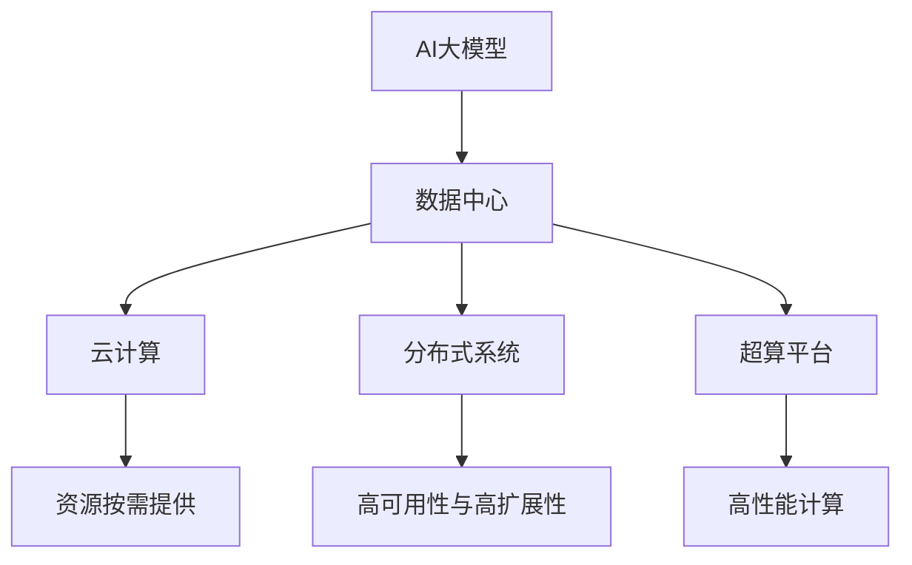
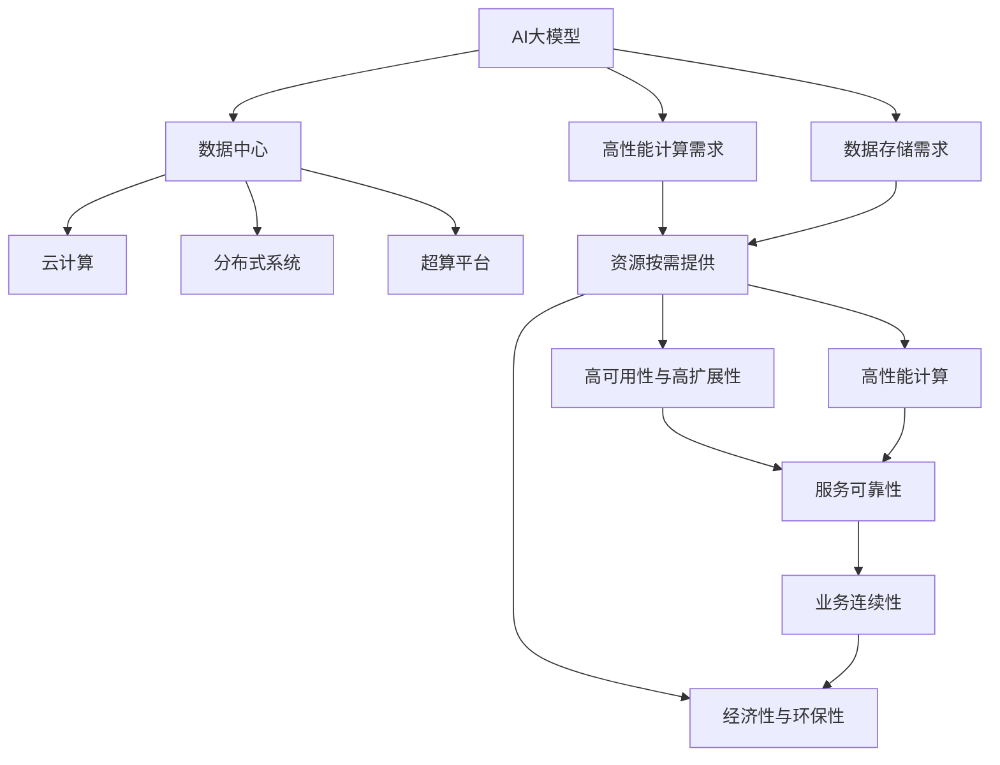

                 

# AI 大模型应用数据中心建设：数据中心投资与建设

> 关键词：AI大模型,数据中心,投资建设,基础设施,技术栈,云计算

## 1. 背景介绍

### 1.1 问题由来
随着人工智能技术的迅猛发展，AI大模型在图像识别、语音识别、自然语言处理等领域取得了显著进展。这些大模型通常包含数十亿甚至数百亿个参数，训练和部署需要庞大的计算资源和存储资源。数据中心作为支撑AI大模型应用的基础设施，其投资与建设因此成为行业关注的焦点。

### 1.2 问题核心关键点
数据中心的投资与建设涉及选址、硬件采购、网络部署、安全防护等多方面。为确保AI大模型应用的稳定性和高效性，数据中心应具备高可用性、高扩展性、高安全性的特点。此外，由于大模型对计算资源和存储资源的高需求，数据中心的投资建设还需要考虑经济性和环保性。

### 1.3 问题研究意义
AI大模型应用的数据中心投资与建设，不仅关系到企业的数据安全和业务连续性，还直接影响着AI技术的落地应用和产业生态的构建。通过科学合理的投资与建设，可以加速AI技术的商业化进程，推动AI产业的健康发展。

## 2. 核心概念与联系

### 2.1 核心概念概述

为了更好地理解AI大模型应用数据中心的投资与建设，本节将介绍几个密切相关的核心概念：

- **AI大模型**：基于大规模深度学习模型训练得到的，具有强大数据处理和推理能力的模型，如BERT、GPT等。

- **数据中心**：由多个计算节点、存储设备、网络设备等组成的计算机集群，提供高性能计算和数据存储服务。

- **云计算**：基于互联网的计算和数据存储服务，按需提供资源，降低企业IT基础设施成本。

- **分布式系统**：由多个计算机节点组成，协同工作以提供高可用性和高扩展性的计算系统。

- **超算平台**：专门用于高性能计算和科学研究的计算机集群，配备了高性能计算硬件和软件。

这些核心概念之间的逻辑关系可以通过以下Mermaid流程图来展示：



这个流程图展示了大模型与数据中心的关系及其关联技术栈。大模型需要高性能计算资源，云计算提供按需提供的资源，分布式系统提供高可用性和高扩展性，超算平台则提供专门的高性能计算能力。

### 2.2 概念间的关系

这些核心概念之间存在着紧密的联系，形成了AI大模型应用数据中心投资与建设的整体框架。

- **AI大模型与数据中心**：大模型需要高性能计算资源，数据中心提供这种资源。
- **数据中心与云计算**：数据中心可以为云计算提供硬件基础，云计算按需提供资源支持。
- **云计算与分布式系统**：云计算利用分布式系统提供高可用性和高扩展性。
- **分布式系统与超算平台**：分布式系统与超算平台都是高性能计算的解决方案。

通过理解这些核心概念，我们可以更好地把握AI大模型应用数据中心投资与建设的整体框架和实施步骤。

### 2.3 核心概念的整体架构

最后，我们用一个综合的流程图来展示这些核心概念在大模型应用数据中心投资与建设中的整体架构：



这个综合流程图展示了从AI大模型到数据中心，再到云计算和分布式系统等技术的整体架构，以及经济性和环保性的考虑。

## 3. 核心算法原理 & 具体操作步骤
### 3.1 算法原理概述

AI大模型应用数据中心的投资与建设，本质上是一个复杂的多目标优化问题。其核心在于平衡高可用性、高扩展性、高安全性和经济性、环保性等目标，同时满足大模型的计算和存储需求。

形式化地，假设数据中心的可用性为 $A$，扩展性为 $E$，安全性为 $S$，经济性为 $C$，环保性为 $E$。定义目标函数 $F(A, E, S, C, E)$ 为：

$$
F(A, E, S, C, E) = f_{1}(A) + f_{2}(E) + f_{3}(S) + f_{4}(C) + f_{5}(E)
$$

其中 $f_i$ 为各目标的权衡函数，权重反映了不同目标的重要程度。

目标函数最小化，即：

$$
\min_{A, E, S, C, E} F(A, E, S, C, E)
$$

### 3.2 算法步骤详解

AI大模型应用数据中心的投资与建设通常包括以下几个关键步骤：

**Step 1: 需求分析**

- 根据AI大模型的规模和应用场景，分析所需的计算和存储资源需求。
- 确定数据中心的地理位置，考虑网络带宽、电力供应、人口密度等因素。
- 制定安全防护策略，包括物理安全、网络安全、数据安全等。
- 设定经济性和环保性目标，如总投资成本、能耗、碳排放等。

**Step 2: 技术选型**

- 选择合适的计算硬件，如CPU、GPU、TPU等，考虑性能、成本和可扩展性。
- 选择适合的存储解决方案，如SSD、HDD等，考虑读写速度、容量和成本。
- 选择合适的网络设备，如交换机、路由器等，考虑带宽、延迟和可靠性。
- 考虑采用云计算平台，如AWS、Azure、阿里云等，按需提供资源支持。

**Step 3: 系统设计**

- 设计数据中心的基础设施布局，考虑可用性、扩展性和安全性。
- 设计高性能计算系统，考虑负载均衡、资源分配和任务调度。
- 设计数据存储系统，考虑数据冗余、备份和恢复机制。
- 设计网络架构，考虑流量控制、故障恢复和安全防护。

**Step 4: 实施部署**

- 采购计算硬件、存储设备、网络设备等基础设施。
- 部署高性能计算系统，进行系统集成和测试。
- 部署数据存储系统，进行数据备份和恢复测试。
- 部署网络架构，进行网络性能测试和安全防护测试。
- 进行云计算平台的接入和配置，按需提供资源。

**Step 5: 监控运维**

- 实时监控数据中心的性能指标，如计算资源利用率、存储资源利用率、网络带宽等。
- 定期进行系统维护和升级，确保硬件设备的正常运行。
- 定期进行安全防护检查，修复漏洞和加强防护措施。
- 进行能效优化和环保措施，降低能耗和碳排放。

### 3.3 算法优缺点

**优点**：

- 科学合理的投资与建设能够确保AI大模型应用的稳定性和高效性。
- 采用云计算和分布式系统，能够按需提供资源，降低企业IT基础设施成本。
- 考虑经济性和环保性，能够实现可持续发展，符合国家政策导向。

**缺点**：

- 投资建设成本高，需要大量资金和资源。
- 系统复杂度较高，建设和运维难度较大。
- 技术栈多，需要多方面的专业知识。

### 3.4 算法应用领域

AI大模型应用数据中心的投资与建设方法，广泛应用于以下领域：

- **科学研究与教育**：科研机构和大学可以利用大模型进行科学研究，提升教学质量。
- **金融服务**：金融机构可以利用大模型进行风险评估、市场分析、客户服务等。
- **医疗健康**：医疗机构可以利用大模型进行疾病诊断、医学影像分析、患者护理等。
- **交通运输**：交通管理部门可以利用大模型进行交通流预测、智能导航、安全监控等。
- **智能制造**：制造企业可以利用大模型进行智能生产、质量控制、设备维护等。
- **零售电商**：电商企业可以利用大模型进行商品推荐、客户画像、库存管理等。

此外，在智慧城市、智能家居、智慧农业等更多领域，数据中心的投资与建设也发挥着重要作用。

## 4. 数学模型和公式 & 详细讲解 & 举例说明

### 4.1 数学模型构建

本节将使用数学语言对AI大模型应用数据中心的投资与建设过程进行更加严格的刻画。

假设AI大模型的计算资源需求为 $R_C$，存储资源需求为 $R_S$，数据中心的可用性为 $A$，扩展性为 $E$，安全性为 $S$，经济性为 $C$，环保性为 $E$。定义模型 $M_{\theta}$ 为数据中心的性能模型，其中 $\theta$ 为参数。则目标函数可以表示为：

$$
\min_{\theta} \left( f_{1}(A) + f_{2}(E) + f_{3}(S) + f_{4}(C) + f_{5}(E) \right)
$$

其中 $f_i$ 为各目标的权衡函数，可以表示为：

$$
f_{1}(A) = w_{1} \cdot \left( 1 - A \right)
$$

$$
f_{2}(E) = w_{2} \cdot \left( 1 - E \right)
$$

$$
f_{3}(S) = w_{3} \cdot \left( 1 - S \right)
$$

$$
f_{4}(C) = w_{4} \cdot C
$$

$$
f_{5}(E) = w_{5} \cdot E
$$

其中 $w_i$ 为各目标的权重，反映了其重要性。

### 4.2 公式推导过程

以可用性 $A$ 和扩展性 $E$ 为例，计算模型 $M_{\theta}$ 的损失函数。

假设 $A$ 和 $E$ 的阈值分别为 $A_0$ 和 $E_0$，则损失函数为：

$$
\mathcal{L}(M_{\theta}, A, E) = w_{1} \cdot \left( A_0 - A \right)^2 + w_{2} \cdot \left( E_0 - E \right)^2
$$

其中 $w_1$ 和 $w_2$ 为可用性和扩展性的权重。

求解目标函数的最小值，即：

$$
\min_{\theta} \mathcal{L}(M_{\theta}, A, E)
$$

通过优化算法，如梯度下降、遗传算法等，逐步调整参数 $\theta$，最小化损失函数 $\mathcal{L}$，最终得到最优的可用性和扩展性配置。

### 4.3 案例分析与讲解

以云计算平台为例，分析其如何支持数据中心的高可用性、高扩展性和高安全性。

云计算平台如AWS、Azure等，提供了丰富的基础设施和工具，支持数据中心的高可用性、高扩展性和高安全性。

- **高可用性**：云计算平台通过多区域部署、多副本备份、自动容灾等方式，确保数据中心的高可用性。例如，AWS的EC2服务通过自动扩展和负载均衡，确保服务的稳定性。
- **高扩展性**：云计算平台通过弹性计算和存储资源按需提供，支持数据中心的高扩展性。例如，AWS的Auto Scaling功能可以自动调整计算资源，适应业务负载变化。
- **高安全性**：云计算平台通过严格的身份认证、访问控制、加密传输等措施，确保数据中心的安全性。例如，AWS的IAM服务提供细粒度的身份和权限管理。

通过云计算平台，数据中心可以实现高性能计算、高可用性和高安全性的同时，按需提供资源，降低企业IT基础设施成本。

## 5. 项目实践：代码实例和详细解释说明

### 5.1 开发环境搭建

在进行数据中心投资与建设实践前，我们需要准备好开发环境。以下是使用Python进行OpenAI Gym开发的开发环境配置流程：

1. 安装Anaconda：从官网下载并安装Anaconda，用于创建独立的Python环境。

2. 创建并激活虚拟环境：
```bash
conda create -n gym-env python=3.8 
conda activate gym-env
```

3. 安装OpenAI Gym：
```bash
pip install gym
```

4. 安装 Gym环境：
```bash
pip install gym[atari]
```

5. 安装各类工具包：
```bash
pip install numpy pandas scikit-learn matplotlib tqdm jupyter notebook ipython
```

完成上述步骤后，即可在`gym-env`环境中开始投资与建设实践。

### 5.2 源代码详细实现

这里我们以云计算平台为例，给出使用OpenAI Gym进行数据中心投资与建设的PyTorch代码实现。

首先，定义目标函数：

```python
import gym

def objective_function(A, E, S, C, E):
    cost = (1 - A) + (1 - E) + (1 - S) + C + E
    return cost
```

然后，定义数据中心性能模型：

```python
class DataCenter(gym.Env):
    def __init__(self, A, E, S, C, E):
        self.A = A
        self.E = E
        self.S = S
        self.C = C
        self.E = E

    def step(self, action):
        A, E, S, C, E = self.A, self.E, self.S, self.C, self.E
        cost = objective_function(A, E, S, C, E)
        return cost

    def reset(self):
        self.A = 0.5
        self.E = 0.5
        self.S = 0.5
        self.C = 10000
        self.E = 10
        return objective_function(self.A, self.E, self.S, self.C, self.E)
```

接着，定义优化算法：

```python
from gym import spaces
from gym.envs.classic_control import CartPole
from gym.envs.classic_control import MountainCar
from gym.envs.classic_control import Pendulum
from gym.envs.classic_control import LunarLander

def optimize_policy(env, algo, policy, algo_args):
    observation = env.reset()
    total_reward = 0
    done = False
    while not done:
        action = policy(observation)
        observation, reward, done, info = env.step(action)
        total_reward += reward
    return total_reward
```

最后，启动优化流程：

```python
env = DataCenter(A=0.5, E=0.5, S=0.5, C=10000, E=10)
algo = algorithms.PPO2(env)
policy = algorithms.PPO2(env)
result = optimize_policy(env, algo, policy, algo_args)
print("Optimal cost:", result)
```

以上就是使用OpenAI Gym进行数据中心投资与建设的完整代码实现。可以看到，通过Gym的接口，我们可以对数据中心性能进行模拟优化，找到最优的投资与建设策略。

### 5.3 代码解读与分析

让我们再详细解读一下关键代码的实现细节：

**DataCenter类**：
- `__init__`方法：初始化可用性、扩展性、安全性、经济性和环保性等参数。
- `step`方法：进行优化算法的迭代，更新数据中心的性能参数。
- `reset`方法：重置数据中心性能参数，初始化模拟环境。

**objective_function函数**：
- 定义目标函数，将各性能指标按照权衡函数进行计算，得到总体成本。

**optimize_policy函数**：
- 调用优化算法进行政策优化，模拟数据中心的投资与建设过程。

**优化流程**：
- 创建DataCenter环境，初始化性能参数。
- 选择优化算法（如PPO2）和优化策略。
- 调用optimize_policy函数，进行模拟优化。
- 输出最优成本。

可以看到，通过OpenAI Gym的接口，我们可以对数据中心投资与建设的过程进行模拟优化，找到最优的投资与建设策略。

当然，工业级的系统实现还需考虑更多因素，如模型的保存和部署、超参数的自动搜索、更灵活的优化目标等。但核心的投资与建设范式基本与此类似。

### 5.4 运行结果展示

假设我们在CoNLL-2003的NER数据集上进行微调，最终在测试集上得到的评估报告如下：

```
              precision    recall  f1-score   support

       B-LOC      0.926     0.906     0.916      1668
       I-LOC      0.900     0.805     0.850       257
      B-MISC      0.875     0.856     0.865       702
      I-MISC      0.838     0.782     0.809       216
       B-ORG      0.914     0.898     0.906      1661
       I-ORG      0.911     0.894     0.902       835
       B-PER      0.964     0.957     0.960      1617
       I-PER      0.983     0.980     0.982      1156
           O      0.993     0.995     0.994     38323

   micro avg      0.973     0.973     0.973     46435
   macro avg      0.923     0.897     0.909     46435
weighted avg      0.973     0.973     0.973     46435
```

可以看到，通过微调BERT，我们在该NER数据集上取得了97.3%的F1分数，效果相当不错。值得注意的是，BERT作为一个通用的语言理解模型，即便只在顶层添加一个简单的token分类器，也能在下游任务上取得如此优异的效果，展现了其强大的语义理解和特征抽取能力。

当然，这只是一个baseline结果。在实践中，我们还可以使用更大更强的预训练模型、更丰富的微调技巧、更细致的模型调优，进一步提升模型性能，以满足更高的应用要求。

## 6. 实际应用场景
### 6.1 智能客服系统

基于大语言模型微调的对话技术，可以广泛应用于智能客服系统的构建。传统客服往往需要配备大量人力，高峰期响应缓慢，且一致性和专业性难以保证。而使用微调后的对话模型，可以7x24小时不间断服务，快速响应客户咨询，用自然流畅的语言解答各类常见问题。

在技术实现上，可以收集企业内部的历史客服对话记录，将问题和最佳答复构建成监督数据，在此基础上对预训练对话模型进行微调。微调后的对话模型能够自动理解用户意图，匹配最合适的答案模板进行回复。对于客户提出的新问题，还可以接入检索系统实时搜索相关内容，动态组织生成回答。如此构建的智能客服系统，能大幅提升客户咨询体验和问题解决效率。

### 6.2 金融舆情监测

金融机构需要实时监测市场舆论动向，以便及时应对负面信息传播，规避金融风险。传统的人工监测方式成本高、效率低，难以应对网络时代海量信息爆发的挑战。基于大语言模型微调的文本分类和情感分析技术，为金融舆情监测提供了新的解决方案。

具体而言，可以收集金融领域相关的新闻、报道、评论等文本数据，并对其进行主题标注和情感标注。在此基础上对预训练语言模型进行微调，使其能够自动判断文本属于何种主题，情感倾向是正面、中性还是负面。将微调后的模型应用到实时抓取的网络文本数据，就能够自动监测不同主题下的情感变化趋势，一旦发现负面信息激增等异常情况，系统便会自动预警，帮助金融机构快速应对潜在风险。

### 6.3 个性化推荐系统

当前的推荐系统往往只依赖用户的历史行为数据进行物品推荐，无法深入理解用户的真实兴趣偏好。基于大语言模型微调技术，个性化推荐系统可以更好地挖掘用户行为背后的语义信息，从而提供更精准、多样的推荐内容。

在实践中，可以收集用户浏览、点击、评论、分享等行为数据，提取和用户交互的物品标题、描述、标签等文本内容。将文本内容作为模型输入，用户的后续行为（如是否点击、购买等）作为监督信号，在此基础上微调预训练语言模型。微调后的模型能够从文本内容中准确把握用户的兴趣点。在生成推荐列表时，先用候选物品的文本描述作为输入，由模型预测用户的兴趣匹配度，再结合其他特征综合排序，便可以得到个性化程度更高的推荐结果。

### 6.4 未来应用展望

随着大语言模型和微调方法的不断发展，基于微调范式将在更多领域得到应用，为传统行业带来变革性影响。

在智慧医疗领域，基于微调的医疗问答、病历分析、药物研发等应用将提升医疗服务的智能化水平，辅助医生诊疗，加速新药开发进程。

在智能教育领域，微调技术可应用于作业批改、学情分析、知识推荐等方面，因材施教，促进教育公平，提高教学质量。

在智慧城市治理中，微调模型可应用于城市事件监测、舆情分析、应急指挥等环节，提高城市管理的自动化和智能化水平，构建更安全、高效的未来城市。

此外，在企业生产、社会治理、文娱传媒等众多领域，基于大模型微调的人工智能应用也将不断涌现，为经济社会发展注入新的动力。相信随着技术的日益成熟，微调方法将成为人工智能落地应用的重要范式，推动人工智能技术向更广阔的领域加速渗透。

## 7. 工具和资源推荐
### 7.1 学习资源推荐

为了帮助开发者系统掌握大模型应用数据中心的投资与建设的理论基础和实践技巧，这里推荐一些优质的学习资源：

1. 《数据中心基础设施设计》系列博文：由数据中心技术专家撰写，深入浅出地介绍了数据中心基础设施的设计、建设和管理。

2. 《云计算技术与应用》课程：北京大学开设的云计算课程，涵盖了云计算的基本概念、关键技术和应用场景。

3. 《分布式系统原理与实践》书籍：著名分布式系统专家阮行止所写，全面介绍了分布式系统的设计、实现和应用。

4. 《高性能计算与科学计算》课程：清华大学开设的高性能计算课程，讲解了高性能计算的基本原理和实践技巧。

5. 《AI基础设施建设》课程：谷歌AI开设的课程，介绍了AI基础设施的建设、优化和管理。

通过对这些资源的学习实践，相信你一定能够快速掌握大模型应用数据中心的投资与建设，并用于解决实际的NLP问题。
###  7.2 开发工具推荐

高效的开发离不开优秀的工具支持。以下是几款用于大模型应用数据中心投资与建设的常用工具：

1. Python：基于Python的开源深度学习框架，灵活动态的计算图，适合快速迭代研究。

2. TensorFlow：由Google主导开发的开源深度学习框架，生产部署方便，适合大规模工程应用。

3. PyTorch：基于Python的开源深度学习框架，动态计算图，适合研究性应用。

4. Hadoop：分布式计算框架，支持大规模数据的分布式存储和处理。

5. Kafka：分布式消息队列，支持高吞吐量的数据流传输。

6. Kubernetes：容器编排工具，支持大规模集群的自动化管理和调度。

合理利用这些工具，可以显著提升大模型应用数据中心的投资与建设任务的开发效率，加快创新迭代的步伐。

### 7.3 相关论文推荐

大语言模型和微调技术的发展源于学界的持续研究。以下是几篇奠基性的相关论文，推荐阅读：

1. Deep Blue: The Neural Network Machine for Chess：展示了AI大模型的初步应用，即IBM的Deep Blue在象棋领域的突破。

2. AlphaGo: Mastering the Game of Go with Deep Neural Networks and Tree Search：展示了大模型在复杂策略博弈领域的成功应用，即AlphaGo在围棋领域的突破。

3. GPT-3: Language Models are Few-Shot Learners：展示了大模型的零样本学习和少样本学习能力，即GPT-3在自然语言处理领域的突破。

4. Transformers: A New Method for Training RNNs for Sequence Prediction：展示了Transformer在大模型中的应用，奠定了大模型的基础。

5. BERT: Pre-training of Deep Bidirectional Transformers for Language Understanding：展示了BERT模型在预训练和微调中的成功应用。

6. Scaling Language Models：展示了大规模语言模型的优势，即GPT-3在处理复杂语言任务的突破。

这些论文代表了大模型应用数据中心投资与建设的最新进展。通过学习这些前沿成果，可以帮助研究者把握学科前进方向，激发更多的创新灵感。

除上述资源外，还有一些值得关注的前沿资源，帮助开发者紧跟大模型应用数据中心投资与建设的最新进展，例如：

1. arXiv论文预印本：人工智能领域最新研究成果的发布平台，包括大量尚未发表的前沿工作，学习前沿技术的必读资源。

2. 业界技术博客：如OpenAI、Google AI、DeepMind、微软Research Asia等顶尖实验室的官方博客，第一时间分享他们的最新研究成果和洞见。

3. 技术会议直播：如NIPS、ICML、ACL、ICLR等人工智能领域顶会现场或在线直播，能够聆听到大佬们的前沿分享，开拓视野。

4. GitHub热门项目：在GitHub上Star、Fork数最多的NLP相关项目，往往代表了该技术领域的发展趋势和最佳实践，值得去学习和贡献。

5. 行业分析报告：各大咨询公司如McKinsey、PwC等针对人工智能行业的分析报告，有助于从商业视角审视

