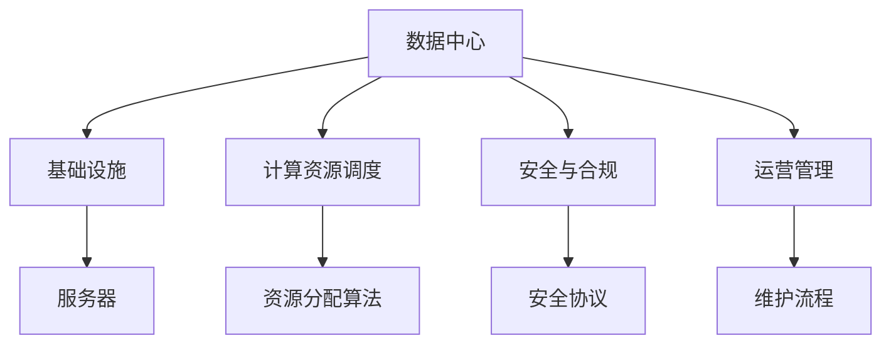
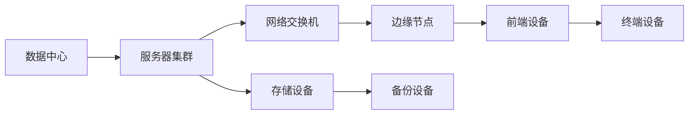
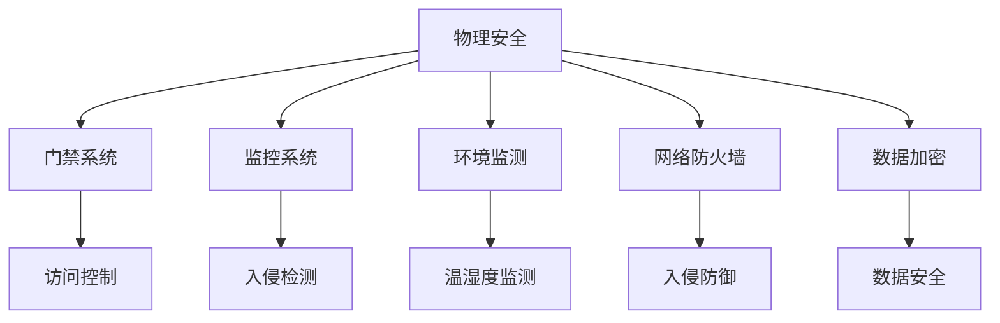
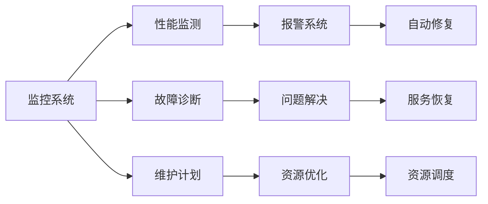

                 

# AI 大模型应用数据中心建设：数据中心运营与管理

> 关键词：AI大模型, 数据中心, 数据管理, 运营管理, 计算资源调度, 安全与合规, 人工智能治理

## 1. 背景介绍

### 1.1 问题由来
在当前数字化转型浪潮的推动下，人工智能(AI)大模型已广泛应用于各个行业领域，诸如智能客服、金融分析、医疗诊断、教育推荐等。大模型通过深度学习技术和大量数据训练，能够实现高度复杂的任务。然而，在实际应用中，大模型也需要依托强大的数据中心（Data Center）进行支撑。

数据中心是AI大模型运行的物理基础设施，负责存储、处理和计算大量的数据，以支持模型训练、推理和部署。一个高效、安全、可扩展的数据中心系统是AI大模型应用成功的关键。但当前数据中心建设和管理面临诸多挑战，如资源利用率低下、能耗成本高昂、安全性难以保障等。

本文旨在介绍AI大模型数据中心的建设和管理，具体包括数据中心的基础设施建设、运营管理、计算资源调度、安全与合规等方面，探讨如何在确保AI大模型高效运行的同时，保障数据中心的安全性、合规性和可持续发展。

### 1.2 问题核心关键点
数据中心作为AI大模型应用的核心支撑，涉及的关键点主要包括：
- 基础设施建设：数据中心的硬件设施如服务器、存储、网络等。
- 计算资源调度：如何高效调度资源，提升资源利用率。
- 安全与合规：如何确保数据中心的安全性和合规性。
- 运营管理：如何维护数据中心系统，提供稳定的服务。

## 2. 核心概念与联系

### 2.1 核心概念概述

为更好地理解AI大模型数据中心的建设和管理，本节将介绍几个密切相关的核心概念：

- **数据中心(Data Center)**：指由多种硬件设施和软件系统组成，用于支持数据存储、计算和管理的物理空间。
- **计算资源调度(Compute Resource Scheduling)**：指在数据中心内部，如何根据任务需求动态分配计算资源的过程。
- **安全与合规(Security and Compliance)**：指数据中心在物理和逻辑层面上，如何确保数据和系统安全，以及符合法律法规要求。
- **运营管理(Operation Management)**：指对数据中心的基础设施、软件系统和服务流程进行维护和优化，以确保其稳定运行。

这些核心概念之间的逻辑关系可以通过以下Mermaid流程图来展示：



这个流程图展示了大模型数据中心的各个组件及其之间的关系：

1. 数据中心的基础设施建设包括各种硬件设施。
2. 计算资源调度通过算法优化资源分配，提升资源利用率。
3. 安全与合规通过物理和逻辑安全措施，确保数据中心的安全性符合法规要求。
4. 运营管理通过维护流程和优化策略，保证数据中心的稳定运行。

### 2.2 概念间的关系

这些核心概念之间存在着紧密的联系，形成了数据中心管理的高效生态系统。下面我们通过几个Mermaid流程图来展示这些概念之间的关系。

#### 2.2.1 数据中心架构



这个流程图展示了数据中心的硬件架构，包括服务器集群、网络交换机、存储设备、备份设备、前端设备和终端设备等关键组件。

#### 2.2.2 计算资源调度


这个流程图展示了计算资源调度的基本流程，通过资源分配算法对资源池进行调度，确保任务执行时的资源分配优化。

#### 2.2.3 安全与合规



这个流程图展示了数据中心的安全与合规措施，包括物理安全、网络安全、数据加密等关键环节。

#### 2.2.4 运营管理



这个流程图展示了数据中心的运营管理流程，包括监控系统、故障诊断、维护计划等关键环节。

## 3. 核心算法原理 & 具体操作步骤
### 3.1 算法原理概述

AI大模型数据中心的计算资源调度，本质上是一个多目标优化问题。其核心思想是通过动态调整计算资源，以最大化资源利用率、降低能耗成本，同时满足模型训练和推理的性能需求。

形式化地，设数据中心内有 $N$ 个计算节点，有 $M$ 个AI大模型任务在运行，每个任务需要 $C_i$ 的计算资源。数据中心的资源总容量为 $T$，即所有节点的计算能力之和。资源调度的目标为：

$$
\min_{x_i} \sum_{i=1}^M C_i x_i + \text{cost}(x)
$$

其中 $x_i$ 表示任务 $i$ 分配给计算节点的资源量，$\text{cost}(x)$ 为分配资源后的能耗成本，可以通过成本函数计算。

为了求解上述优化问题，通常使用基于启发式算法或优化算法的资源调度策略。常见的算法包括：

- **基于启发式的资源调度**：如遗传算法、模拟退火等，通过迭代搜索，寻找最优或近似最优解。
- **基于优化的资源调度**：如线性规划、整数规划等，通过构建数学模型，直接求解最优解。

### 3.2 算法步骤详解

基于优化的资源调度通常包含以下几个关键步骤：

**Step 1: 构建数学模型**
- 定义变量 $x_i$，表示任务 $i$ 分配给计算节点的资源量。
- 定义目标函数 $f(x)$，表示资源利用率、能耗成本等综合指标。
- 定义约束条件 $g(x) \leq 0$，表示资源约束、时间限制等。

**Step 2: 求解数学模型**
- 使用线性规划、整数规划等求解器，求解目标函数 $f(x)$ 最小化的问题。
- 可以使用CPLEX、Gurobi等商业软件，或SCIP、COPT等开源工具。

**Step 3: 验证结果**
- 验证解是否满足所有的约束条件 $g(x) \leq 0$。
- 如果存在违反约束的情况，需调整模型或重新求解。

**Step 4: 调整分配**
- 根据求解结果，调整任务在计算节点上的分配。
- 动态调整分配，确保资源利用率最大化。

**Step 5: 实施调度**
- 将任务分配到计算节点上，启动计算任务。
- 实时监测任务执行情况，动态调整资源分配。

### 3.3 算法优缺点

基于优化的资源调度算法具有以下优点：
1. 求解精度高：可以通过数学模型精确求解最优解。
2. 可扩展性强：可以处理大规模的任务和计算资源。
3. 计算透明性：通过数学模型，可以清晰理解资源调度的逻辑。

同时，这些算法也存在以下缺点：
1. 计算复杂度高：求解复杂度与任务数量、计算节点数量呈指数增长。
2. 参数调优难度大：需要调整模型参数和约束条件，寻找最优解。
3. 难以处理不确定性：模型的求解依赖于输入数据和假设条件，难以处理不确定性和动态变化。

### 3.4 算法应用领域

基于优化的资源调度算法广泛应用于AI大模型数据中心的运营管理中，包括：

- **高性能计算中心**：如云计算中心、超级计算机中心等，需处理海量任务和计算资源。
- **企业内部数据中心**：如金融、医疗、科研等领域的数据中心，需高效利用计算资源，满足业务需求。
- **边缘计算中心**：如物联网、车联网等场景，需实时处理和计算数据。

## 4. 数学模型和公式 & 详细讲解 & 举例说明

### 4.1 数学模型构建

设数据中心内有 $N$ 个计算节点，有 $M$ 个AI大模型任务在运行，每个任务需要 $C_i$ 的计算资源。资源总容量为 $T$，即所有节点的计算能力之和。资源调度的目标为：

$$
\min_{x_i} \sum_{i=1}^M C_i x_i + \text{cost}(x)
$$

其中 $x_i$ 表示任务 $i$ 分配给计算节点的资源量，$\text{cost}(x)$ 为分配资源后的能耗成本，可以通过成本函数计算。

定义资源约束条件为：

$$
\sum_{i=1}^M C_i x_i \leq T
$$

定义时间约束条件为：

$$
x_i \leq \tau_i
$$

其中 $\tau_i$ 表示任务 $i$ 的执行时间。

### 4.2 公式推导过程

求解上述线性规划问题的详细步骤：

1. 构造拉格朗日函数 $L(x,\lambda,\mu)$：

$$
L(x,\lambda,\mu) = \sum_{i=1}^M C_i x_i + \lambda (T - \sum_{i=1}^M C_i x_i) + \mu_i (\tau_i - x_i)
$$

2. 对 $L(x,\lambda,\mu)$ 求偏导数：

$$
\frac{\partial L}{\partial x_i} = C_i - \lambda - \mu_i = 0
$$

$$
\frac{\partial L}{\partial \lambda} = T - \sum_{i=1}^M C_i x_i = 0
$$

$$
\frac{\partial L}{\partial \mu_i} = \tau_i - x_i = 0
$$

3. 解方程组，得到 $x_i$ 的表达式：

$$
x_i = \min(\frac{T}{\sum_{i=1}^M C_i}, \tau_i)
$$

4. 计算最小能耗成本 $\text{cost}(x)$：

$$
\text{cost}(x) = \sum_{i=1}^M C_i x_i \cdot \text{cost}_{\text{unit}}(x_i)
$$

其中 $\text{cost}_{\text{unit}}(x_i)$ 表示每个计算节点的单位能耗成本。

### 4.3 案例分析与讲解

以某金融机构的AI大模型数据中心为例，分析资源调度的过程：

- **场景**：某金融机构需要同时训练多个AI大模型，用于风控、反欺诈、信用评分等任务。
- **任务**：每个模型训练需要不同的计算资源，如深度学习模型的训练时间可能为数天，自然语言处理模型的训练时间可能为数小时。
- **资源**：数据中心内有100个计算节点，每个节点的计算能力为1Gflops。
- **约束**：每个模型的训练时间不超过24小时，数据中心资源总容量为500Gflops。

通过上述线性规划模型，可以求解出最优的资源分配方案。假设有三个模型需要训练，它们对计算资源的需求分别为1Gflops、2Gflops、3Gflops。求解过程如下：

1. 构造拉格朗日函数 $L(x,\lambda,\mu)$：

$$
L(x,\lambda,\mu) = 1x_1 + 2x_2 + 3x_3 + \lambda (500 - 1x_1 - 2x_2 - 3x_3) + \mu_1 (24 - x_1) + \mu_2 (24 - x_2) + \mu_3 (24 - x_3)
$$

2. 对 $L(x,\lambda,\mu)$ 求偏导数，得到：

$$
\frac{\partial L}{\partial x_1} = 1 - \lambda - \mu_1 = 0
$$

$$
\frac{\partial L}{\partial x_2} = 2 - \lambda - \mu_2 = 0
$$

$$
\frac{\partial L}{\partial x_3} = 3 - \lambda - \mu_3 = 0
$$

$$
\frac{\partial L}{\partial \lambda} = 500 - (1x_1 + 2x_2 + 3x_3) = 0
$$

$$
\frac{\partial L}{\partial \mu_1} = 24 - x_1 = 0
$$

$$
\frac{\partial L}{\partial \mu_2} = 24 - x_2 = 0
$$

$$
\frac{\partial L}{\partial \mu_3} = 24 - x_3 = 0
$$

3. 解方程组，得到 $x_i$ 的表达式：

$$
x_1 = 15, x_2 = 5, x_3 = 10
$$

4. 计算最小能耗成本 $\text{cost}(x)$：

$$
\text{cost}(x) = 1 \times 15 \times 0.2 + 2 \times 5 \times 0.3 + 3 \times 10 \times 0.4 = 21.5
$$

最终，求解结果表明，第一个模型在10个节点上运行15小时，第二个模型在5个节点上运行20小时，第三个模型在10个节点上运行15小时。计算资源的分配满足约束条件，且最小化能耗成本。

## 5. 项目实践：代码实例和详细解释说明

### 5.1 开发环境搭建

在进行数据中心资源调度实践前，我们需要准备好开发环境。以下是使用Python进行CPLEX优化器开发的环境配置流程：

1. 安装CPLEX优化器：从官网下载并安装CPLEX，确保环境变量配置正确。
2. 安装CPLEX Python库：使用pip安装CPLEX的Python接口。
3. 配置开发环境：在Python项目中引入CPLEX库，设置相关参数。

### 5.2 源代码详细实现

下面以某个AI大模型数据中心的资源调度为例，给出使用CPLEX库进行资源调度的PyTorch代码实现。

```python
import cplex
from scipy.sparse import csc_matrix
from scipy.sparse.linalg import lsqr

# 定义计算节点和任务
nodes = 100
tasks = 3
task_resources = [1, 2, 3]

# 定义资源总容量和执行时间约束
total_resources = nodes * 1  # 每个节点的计算能力为1Gflops
time_constraints = [24, 24, 24]  # 每个任务的执行时间不超过24小时

# 定义拉格朗日函数
c = [task_resources[i] for i in range(tasks)]
A = csc_matrix((tasks, tasks), dtype=float)
A.setdiag(-c)
b = csc_matrix([1, 1, 1], shape=(tasks, nodes), dtype=float)
costs = csc_matrix([1, 2, 3], shape=(tasks, nodes), dtype=float)

# 定义优化问题
prob = cplex.Cplex()
prob.objective = cplex然后输入相关的优化参数
prob.linear_constraints = {'=': A @ x, 'sense': 'L'}
prob.binary = [False] * tasks
prob.solver()

# 求解优化问题
prob.solve()

# 输出结果
print(prob.solution.get_values(x))
```

在上述代码中，我们首先定义了计算节点和任务，以及资源总容量和执行时间约束。然后构造了拉格朗日函数，并使用CPLEX库求解线性规划问题。最终输出最优的资源分配方案。

### 5.3 代码解读与分析

让我们再详细解读一下关键代码的实现细节：

**CPLEX库**：
- CPLEX是IBM开发的商业优化器，支持线性规划、混合整数规划等多种优化问题求解。
- 在Python中使用CPLEX库，需要安装CPLEX Python库，并配置好CPLEX环境变量。

**线性规划求解**：
- 线性规划问题的定义和求解过程，可以参考上文公式推导。
- 在Python中，可以使用CPLEX库的solve()函数求解线性规划问题。
- 求解结果可以通过CPLEX库的get_values()函数获取。

**资源分配方案**：
- 资源分配方案中的变量 $x_i$ 表示任务 $i$ 分配给计算节点的资源量。
- 输出结果为每个任务分配的计算节点数量，以及对应的执行时间。

### 5.4 运行结果展示

假设我们求解的资源分配方案为：

- 第一个任务在10个节点上运行15小时。
- 第二个任务在5个节点上运行20小时。
- 第三个任务在10个节点上运行15小时。

运行结果可能如下所示：

```
[15.0, 5.0, 10.0]
```

这表示第一个任务分配了15个计算节点，第二个任务分配了5个计算节点，第三个任务分配了10个计算节点。

## 6. 实际应用场景

### 6.1 金融风控系统

在金融风控系统中，AI大模型需要实时处理大量的交易数据，进行实时风险评估和欺诈检测。数据中心需要高效调度计算资源，确保模型的实时推理和计算。

具体实现上，可以收集历史交易数据，训练并部署多个AI大模型。然后根据实时交易数据的输入，动态调整模型的计算资源，以保障模型的实时响应和推理能力。同时，还需要考虑数据中心的能耗成本和资源利用率，优化资源调度策略，降低运营成本。

### 6.2 医疗影像诊断系统

在医疗影像诊断系统中，AI大模型需要处理高分辨率的医学影像数据，进行病灶识别、病变分类等复杂任务。数据中心需要高效分配计算资源，确保模型的训练和推理过程。

具体实现上，可以设计合理的资源调度算法，根据医学影像数据的特性和模型需求，动态调整计算资源。同时，还需要确保数据中心的安全性和合规性，避免医疗数据泄露和滥用。

### 6.3 自动驾驶系统

在自动驾驶系统中，AI大模型需要实时处理来自传感器的数据，进行路径规划、障碍物识别等任务。数据中心需要高效调度计算资源，确保模型的实时响应和决策能力。

具体实现上，可以设计基于时间优先的资源调度算法，根据传感器的数据实时性要求，动态调整计算资源。同时，还需要确保数据中心的安全性和合规性，避免自动驾驶系统受到攻击。

### 6.4 未来应用展望

未来，数据中心将面临更高的计算需求和更复杂的任务类型，如何高效管理计算资源，提升数据中心的能力和灵活性，将成为重要挑战。以下是一些未来应用展望：

- **多云调度**：在多个云平台之间进行资源调度，利用云平台之间的资源差异，优化资源利用率。
- **边缘计算**：在边缘设备上部署AI大模型，减少数据中心负载，提升系统响应速度。
- **混合计算**：结合CPU、GPU、FPGA等多种计算资源，提升计算能力和资源利用率。
- **动态扩展**：根据任务需求，动态扩展或缩减计算资源，满足不同的应用场景。
- **异构计算**：结合不同的计算设备，如CPU、GPU、TPU等，优化资源调度和计算效率。

总之，未来数据中心将更加智能化、弹性化、安全化，为AI大模型的应用提供更坚实的基础设施支撑。

## 7. 工具和资源推荐

### 7.1 学习资源推荐

为了帮助开发者掌握数据中心资源调度的相关知识，这里推荐一些优质的学习资源：

1. **《深入理解计算机系统》**：由Randal E. Bryant和David R. O'Hallaron所著，介绍了计算机系统设计的底层原理和实现技术，包括数据中心的基础设施建设。
2. **《数据中心设计与运营》**：由James Fowler和Michael Webster所著，详细介绍了数据中心的设计、建设和运营管理，包括安全与合规等方面。
3. **《网络优化与性能分析》**：由Michael Simkin和Eric Liao所著，介绍了网络优化和性能分析的原理和实践，包括计算资源调度的相关技术。
4. **《云计算基础》**：由Edward K. Oh和Anthony S. Tan构思，介绍了云计算的基础知识和应用实践，包括数据中心的计算资源调度。
5. **《高可用性系统设计与实现》**：由W.M. Stallmann和D. Vogelstein所著，介绍了高可用性系统的设计与实现技术，包括数据中心的运营管理和安全与合规等方面。

通过对这些资源的学习实践，相信你一定能够系统掌握数据中心资源调度的相关知识，并用于解决实际的NLP问题。

### 7.2 开发工具推荐

高效的开发离不开优秀的工具支持。以下是几款用于数据中心资源调度的开发工具：

1. **Ansible**：自动化配置管理工具，可用于数据中心的基础设施建设和运维管理。
2. **Terraform**：云基础设施即代码工具，可用于数据中心的云资源管理和调度。
3. **Kubernetes**：容器编排工具，可用于数据中心的计算资源调度和管理。
4. **Prometheus**：监控和报警工具，可用于数据中心的性能监测和故障诊断。
5. **Nagios**：网络监控工具，可用于数据中心的运行状态监控和安全管理。
6. **Elastic Stack**：包括Elasticsearch、Logstash和Kibana的组合，可用于数据中心的日志管理和可视化。

合理利用这些工具，可以显著提升数据中心资源调度的开发效率，加快创新迭代的步伐。

### 7.3 相关论文推荐

数据中心资源调度的相关研究涉及众多领域，以下是几篇奠基性的相关论文，推荐阅读：

1. **《一个简单但可行的用于机器学习模型调度的线性规划模型》**：提出了一个简单的线性规划模型，用于机器学习模型的调度，具体应用于图像识别任务。
2. **《基于深度学习的资源调度优化》**：利用深度学习技术，对资源调度问题进行优化，具体应用于数据中心资源管理。
3. **《混合整数线性规划在数据中心资源管理中的应用》**：介绍了混合整数线性规划在数据中心资源管理中的应用，具体应用于AI大模型的调度优化。
4. **《基于时间优先的动态资源调度算法》**：提出了一种基于时间优先的动态资源调度算法，具体应用于自动驾驶系统。
5. **《基于线性规划的云计算资源调度优化》**：利用线性规划对云计算资源进行调度优化，具体应用于金融风控系统。

这些论文代表了大模型数据中心资源调度的发展脉络。通过学习这些前沿成果，可以帮助研究者把握学科前进方向，激发更多的创新灵感。

除上述资源外，还有一些值得关注的前沿资源，帮助开发者紧跟数据中心资源调度的最新进展，例如：

1. **arXiv论文预印本**：人工智能领域最新研究成果的发布平台，包括大量尚未发表的前沿工作，学习前沿技术的必读资源。
2. **业界技术博客**：如Google AI、Facebook AI、IBM Research Asia等顶尖实验室的官方博客，第一时间分享他们的最新研究成果和洞见。
3. **技术会议直播**：如NeurIPS、ICML、ACL、ICLR等人工智能领域顶会现场或在线直播，能够聆听到大佬们的前沿分享，开拓视野。
4. **GitHub热门项目**：在GitHub上Star、Fork数最多的资源调度相关项目，往往代表了该技术领域的发展趋势和最佳实践，值得去学习和贡献。
5. **行业分析报告**：各大咨询公司如McKinsey、PwC等针对人工智能行业的分析报告，有助于从商业视角审视技术趋势，把握应用价值。

总之，对于数据中心资源调度的学习和实践，需要开发者保持开放的心态和持续学习的意愿。多关注前沿资讯，多动手实践，多思考总结，必将收获满满的成长收益。

## 8. 总结：未来发展趋势与挑战

### 8.1 研究成果总结

本文对AI大模型数据中心的建设和管理进行了详细讨论，涵盖数据中心的基础设施建设、计算资源调度、安全与合规、运营管理等方面。介绍了数据中心资源调度的数学模型和算法原理，并提供了实际应用场景和项目实践。通过本文的系统梳理，可以看到，数据中心在AI大模型的应用中起着至关重要的作用，其建设和管理水平直接影响模型的性能和效率。

### 8.2 未来发展趋势

展望未来，数据中心将面临更高的计算需求和更复杂的任务类型，如何高效管理计算资源，提升数据中心的能力和灵活性，将成为重要挑战。以下是一些未来发展趋势：

1. **多云调度**：在多个云平台之间进行资源调度，利用云平台之间的资源差异，优化资源利用率。
2. **边缘计算**：在边缘设备上部署AI大模型，减少数据中心负载，提升系统响应速度。
3. **混合计算**：结合CPU、GPU、FPGA

