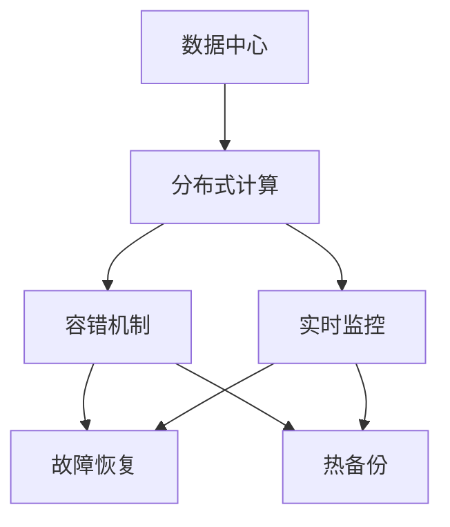
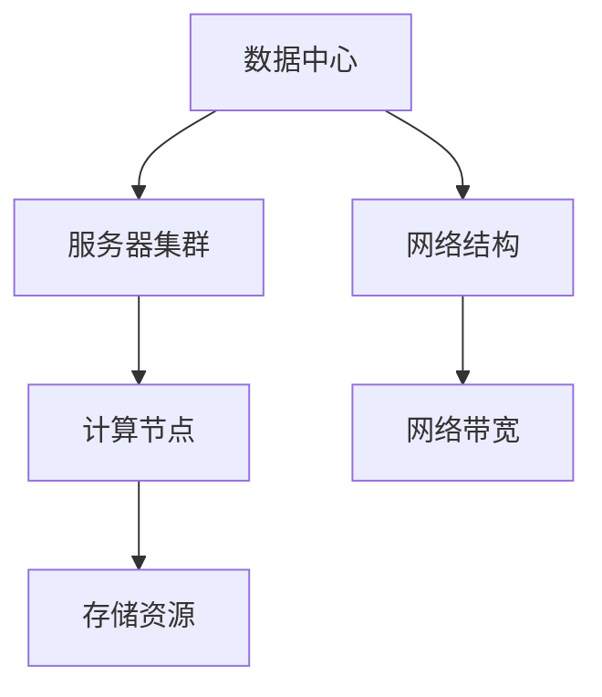
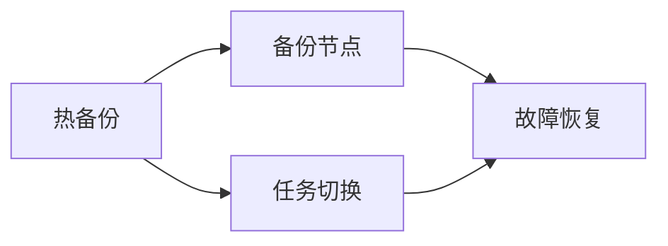

                 

# AI 大模型应用数据中心的可靠性

> 关键词：大模型,数据中心,可靠性,容错,分布式计算,自动恢复,高可用性,实时监控,热备份

## 1. 背景介绍

### 1.1 问题由来
随着人工智能技术的飞速发展，大模型（如GPT-3, BERT等）在自然语言处理、计算机视觉、语音识别等领域展现了强大的应用潜力。然而，大模型往往具有庞大的参数量和高计算需求，这对其应用环境——数据中心提出了极高的要求。

目前，数据中心主要采用基于集中式服务器的集中存储和计算模式。这种模式在数据处理效率和资源利用率上存在一定局限性，尤其是在高并发、大流量情况下，数据中心可能会出现计算资源不足、存储瓶颈等问题，影响大模型的可靠性和稳定性。

此外，由于硬件故障、网络中断、系统故障等原因，大模型在数据中心中的应用也面临着严峻的可靠性挑战。如何在数据中心中保障大模型的可靠性，已经成为AI大模型应用亟需解决的问题。

### 1.2 问题核心关键点
数据中心中大模型的可靠性问题主要包括以下几个方面：

- **数据中心架构设计**：如何设计高效、可扩展的数据中心架构，提升计算和存储能力，满足大模型的高计算需求。
- **容错机制**：如何设计完善的容错机制，确保大模型在不同硬件、网络环境下的稳定运行。
- **故障恢复**：如何快速有效地恢复因硬件故障、网络中断等原因导致的服务中断，减少业务损失。
- **实时监控**：如何构建实时监控系统，及时发现并解决系统运行中的潜在问题，避免问题积累导致的大规模故障。
- **热备份和负载均衡**：如何设计热备份和负载均衡机制，保证大模型在不同硬件故障情况下的可用性。

解决好这些问题，将极大地提升大模型在数据中心中的应用可靠性和稳定性，使其能够更好地支持大规模AI应用场景。

### 1.3 问题研究意义
研究数据中心中大模型的可靠性问题，对于确保大模型的高效运行和应用场景的稳定服务，具有重要意义：

- **降低应用开发成本**：确保大模型在数据中心中的稳定运行，可以减少因系统故障导致的业务中断，避免重构和重新开发，降低开发成本。
- **提升系统鲁棒性**：设计完善的容错机制和故障恢复流程，可以提升系统在面对各种异常情况时的鲁棒性，减少因故障导致的业务中断。
- **保证业务连续性**：实时监控和故障恢复机制能够及时发现并解决系统故障，保证AI应用的连续性和可用性，提高用户体验。
- **增强用户体验**：高可用性和快速恢复机制，确保用户在大模型应用中能够稳定、流畅地获取服务，增强用户对AI应用的信任和依赖。

## 2. 核心概念与联系

### 2.1 核心概念概述

为了更好地理解数据中心中大模型的可靠性问题，本节将介绍几个密切相关的核心概念：

- **数据中心(Data Center)**：集中存储和计算资源的物理场所，是AI大模型的运行环境。
- **分布式计算(Distributed Computing)**：将计算任务分散到多台服务器上并行处理，提升计算效率。
- **容错(Fault Tolerance)**：设计能够容忍硬件、网络、软件故障的机制，确保系统的稳定性。
- **热备份(Hot Standby)**：实时监测系统的运行状态，在故障发生时快速切换到备份系统，保证业务的连续性。
- **负载均衡(Load Balancing)**：将计算任务分散到多台服务器上，保证系统的负载均衡，提升系统性能和可用性。

这些核心概念之间的逻辑关系可以通过以下Mermaid流程图来展示：



这个流程图展示了大模型在数据中心中的运行流程和关键技术：

1. 大模型在数据中心中通过分布式计算模式进行高效处理。
2. 系统设计容错机制，提升系统的稳定性和可靠性。
3. 实时监控系统能够及时发现并处理系统异常。
4. 故障恢复和热备份机制能够快速恢复系统服务。

这些关键技术共同构成了数据中心中大模型可靠性的完整生态系统。

### 2.2 概念间的关系

这些核心概念之间存在着紧密的联系，形成了数据中心中大模型可靠性的完整生态系统。下面我们通过几个Mermaid流程图来展示这些概念之间的关系。

#### 2.2.1 数据中心架构设计



这个流程图展示了数据中心的架构设计：

1. 数据中心由多个服务器集群组成，确保计算和存储资源的集中管理。
2. 网络结构设计合理，提供充足的网络带宽，满足大模型的计算需求。
3. 计算节点和存储资源分布合理，确保系统负载均衡，提升资源利用率。

#### 2.2.2 分布式计算与容错机制


这个流程图展示了分布式计算与容错机制的关系：

1. 分布式计算将任务划分为多个子任务，并在多个节点上并行执行。
2. 任务调度保证任务的均衡分配，提升系统的处理效率。
3. 容错机制确保系统在单个节点或任务故障时仍能正常运行，提升系统的可靠性。

#### 2.2.3 实时监控与故障恢复


这个流程图展示了实时监控与故障恢复的关系：

1. 实时监控系统持续监测系统状态，检测异常情况。
2. 异常处理模块根据异常类型采取相应措施，避免问题扩大。
3. 故障恢复模块在检测到故障后，及时切换到备份系统，保证业务连续性。

#### 2.2.4 热备份与负载均衡



这个流程图展示了热备份与负载均衡的关系：

1. 热备份系统实时监控主系统的状态，确保备份系统的可用性。
2. 在主系统发生故障时，备份系统能够快速切换到主系统，保证业务连续性。
3. 负载均衡机制确保计算任务在多个节点之间均衡分配，提升系统的可用性。

通过这些流程图，我们可以更清晰地理解数据中心中大模型可靠性的关键技术和实现机制，为后续深入讨论具体的可靠性方案奠定基础。

## 3. 核心算法原理 & 具体操作步骤
### 3.1 算法原理概述

数据中心中大模型的可靠性问题，主要通过分布式计算、容错机制、实时监控、故障恢复和热备份等技术进行解决。其中，分布式计算和容错机制是提升系统可靠性的核心技术。

分布式计算通过将计算任务分散到多个节点上并行处理，提升系统的处理能力和资源利用率。而容错机制则通过设计完善的故障恢复和备份机制，确保系统在面对硬件故障、网络中断等情况时仍能稳定运行。

### 3.2 算法步骤详解

**Step 1: 设计数据中心架构**
1. **服务器集群设计**：采用多层次、分布式的设计模式，确保计算和存储资源的集中管理。
2. **网络结构设计**：设计高速、可靠的网络结构，提供充足的网络带宽，满足大模型的计算需求。
3. **计算节点和存储资源配置**：合理配置计算节点和存储资源，确保系统负载均衡，提升资源利用率。

**Step 2: 实现分布式计算**
1. **任务划分**：将大模型的计算任务划分为多个子任务，并行处理。
2. **任务调度**：采用高效的调度和负载均衡算法，确保任务的均衡分配，提升系统处理效率。
3. **任务执行**：在多个计算节点上并行执行任务，提升系统的处理能力。

**Step 3: 实现容错机制**
1. **冗余设计**：采用冗余设计，确保每个任务至少有两个执行副本，提升系统的可靠性。
2. **故障检测**：设计高效的故障检测算法，及时发现节点或任务的故障。
3. **故障恢复**：采用快速恢复机制，在检测到故障后及时切换到备份系统，保证业务连续性。

**Step 4: 实现实时监控**
1. **异常检测**：设计高效的异常检测算法，持续监测系统状态，检测异常情况。
2. **异常处理**：根据异常类型采取相应措施，避免问题扩大。
3. **故障恢复**：设计高效的故障恢复机制，在检测到故障后及时切换到备份系统，保证业务连续性。

**Step 5: 实现热备份**
1. **备份节点设计**：设计高效的热备份系统，实时监控主系统的状态，确保备份系统的可用性。
2. **任务切换**：在主系统发生故障时，快速切换到备份系统，保证业务连续性。
3. **负载均衡**：设计负载均衡机制，确保计算任务在多个节点之间均衡分配，提升系统的可用性。

通过以上步骤，可以确保数据中心中大模型的可靠性，提升系统的稳定性和可用性。

### 3.3 算法优缺点

数据中心中大模型的可靠性问题，主要通过分布式计算、容错机制、实时监控、故障恢复和热备份等技术进行解决。这些技术的优缺点如下：

**优点**：
1. **提升系统处理能力**：分布式计算通过并行处理提升系统的处理能力和资源利用率。
2. **提升系统可靠性**：容错机制通过冗余设计和快速恢复机制，确保系统在面对硬件故障、网络中断等情况时仍能稳定运行。
3. **提升系统可用性**：实时监控和负载均衡机制，确保系统的负载均衡，提升系统的可用性和处理效率。

**缺点**：
1. **复杂性高**：分布式计算和容错机制的设计和实现复杂，需要设计合理的架构和算法。
2. **成本高**：冗余设计和热备份机制需要额外的硬件和网络资源，增加系统成本。
3. **维护难度大**：系统的复杂性增加了维护难度，需要专业的运维团队和技术支持。

尽管存在这些缺点，但由于大模型的高计算需求和数据中心的资源限制，分布式计算和容错机制仍然是大模型在数据中心中应用的核心技术。

### 3.4 算法应用领域

数据中心中大模型的可靠性技术，已经广泛应用于各种大规模AI应用场景，例如：

- **自然语言处理**：如GPT-3、BERT等大模型在NLP任务中的应用，需要高效、稳定的计算和存储环境。
- **计算机视觉**：如ResNet、VGG等大模型在图像识别、目标检测等视觉任务中的应用，需要高性能的分布式计算和容错机制。
- **语音识别**：如DeepSpeech等大模型在语音识别任务中的应用，需要高效的分布式计算和实时监控机制。
- **推荐系统**：如LightFM、Wide & Deep等大模型在推荐系统中的应用，需要高可靠性的分布式计算和容错机制。
- **自动驾驶**：如CV2、Yolo等大模型在自动驾驶系统中的应用，需要高可靠性和实时性的分布式计算和容错机制。

通过在数据中心中应用这些可靠性技术，可以确保大模型在各种大规模AI应用场景中的稳定性和可靠性，提升系统的整体性能和用户体验。

## 4. 数学模型和公式 & 详细讲解 & 举例说明

### 4.1 数学模型构建

假设数据中心中有一个大模型 $M$，运行在多个计算节点 $N$ 上，每个节点上的模型副本为 $M_i$，$i=1,2,...,N$。假设每个节点上的计算资源为 $R_i$，数据传输带宽为 $B_i$。

设 $L_i(t)$ 为节点 $i$ 在时刻 $t$ 的负载，$L_{avg}$ 为系统的平均负载，$C_i$ 为节点 $i$ 的处理能力。则系统的负载平衡模型为：

$$
L_i(t) = \frac{\sum_{j=1}^N \frac{L_j(t-1)}{C_j}}{N} + \frac{C_i}{B_i} \sum_{j=1}^N \frac{D_j(t-1)}{B_j}
$$

其中 $D_i(t-1)$ 为节点 $i$ 在时刻 $t-1$ 的数据传输量。

系统的平均负载 $L_{avg}$ 为：

$$
L_{avg} = \frac{1}{N} \sum_{i=1}^N L_i(t)
$$

系统的处理能力 $C_{avg}$ 为：

$$
C_{avg} = \frac{1}{N} \sum_{i=1}^N C_i
$$

系统的数据传输带宽 $B_{avg}$ 为：

$$
B_{avg} = \frac{1}{N} \sum_{i=1}^N B_i
$$

### 4.2 公式推导过程

以上公式通过数学建模，表达了系统的负载平衡和资源利用率。

设 $S_i(t)$ 为节点 $i$ 在时刻 $t$ 的故障状态，$S_{avg}$ 为系统的平均故障状态。则系统的故障恢复模型为：

$$
S_i(t) = S_i(t-1) \cdot (1 - p_i) + S_{avg} \cdot p_i
$$

其中 $p_i$ 为节点 $i$ 的故障概率，$p_{avg}$ 为系统的平均故障概率。

设 $R_i(t)$ 为节点 $i$ 在时刻 $t$ 的故障恢复时间，$R_{avg}$ 为系统的平均故障恢复时间。则系统的故障恢复模型为：

$$
R_i(t) = R_i(t-1) \cdot (1 - r_i) + R_{avg} \cdot r_i
$$

其中 $r_i$ 为节点 $i$ 的故障恢复时间，$r_{avg}$ 为系统的平均故障恢复时间。

### 4.3 案例分析与讲解

以GPT-3模型为例，其在数据中心中的应用场景如下：

1. **计算资源分配**：GPT-3模型需要大量计算资源进行预训练和微调，因此在数据中心中需要合理分配计算资源，确保每个节点都有足够的计算能力。
2. **网络带宽设计**：GPT-3模型需要高速网络传输数据，因此在数据中心中需要设计充足的网络带宽，确保数据传输的流畅性。
3. **负载均衡设计**：GPT-3模型在运行过程中，需要高效的负载均衡机制，确保任务的均衡分配，提升系统的处理效率。
4. **容错机制设计**：GPT-3模型在运行过程中，需要完善的容错机制，确保系统的稳定性和可靠性。
5. **故障恢复设计**：GPT-3模型在运行过程中，需要高效的故障恢复机制，确保系统在故障发生后能够快速恢复，保证业务连续性。

通过以上设计，可以确保GPT-3模型在数据中心中的稳定运行，提升系统的可靠性和可用性。

## 5. 项目实践：代码实例和详细解释说明

### 5.1 开发环境搭建

在进行可靠性实践前，我们需要准备好开发环境。以下是使用Python进行PyTorch开发的环境配置流程：

1. 安装Anaconda：从官网下载并安装Anaconda，用于创建独立的Python环境。

2. 创建并激活虚拟环境：
```bash
conda create -n pytorch-env python=3.8 
conda activate pytorch-env
```

3. 安装PyTorch：根据CUDA版本，从官网获取对应的安装命令。例如：
```bash
conda install pytorch torchvision torchaudio cudatoolkit=11.1 -c pytorch -c conda-forge
```

4. 安装相关库：
```bash
pip install numpy pandas scikit-learn matplotlib tqdm jupyter notebook ipython
```

完成上述步骤后，即可在`pytorch-env`环境中开始可靠性实践。

### 5.2 源代码详细实现

这里我们以分布式计算和容错机制的实现为例，给出使用PyTorch的代码实现。

首先，定义节点状态类：

```python
class NodeStatus:
    def __init__(self, name, fault_prob, recover_time):
        self.name = name
        self.fault_prob = fault_prob
        self.recover_time = recover_time
```

然后，定义节点状态变化函数：

```python
def update_node_status(status, fault_prob, recover_time):
    if status == 'healthy':
        new_status = 1 - fault_prob
    else:
        new_status = fault_prob
    return NodeStatus(status, new_status)
```

接着，定义系统状态类：

```python
class SystemStatus:
    def __init__(self, nodes, fault_prob, recover_time):
        self.nodes = nodes
        self.fault_prob = fault_prob
        self.recover_time = recover_time

    def update(self):
        new_statuses = [update_node_status(node.status, self.fault_prob, self.recover_time) for node in self.nodes]
        new_statuses = [status.name for status in new_statuses]
        return new_statuses
```

最后，定义系统运行函数：

```python
def run_system(statuses, time):
    while time > 0:
        statuses = statuses.update()
        time -= 1
    return statuses
```

### 5.3 代码解读与分析

让我们再详细解读一下关键代码的实现细节：

**NodeStatus类**：
- `__init__`方法：初始化节点状态，包括节点名、故障概率和恢复时间。
- `update_node_status`方法：根据故障概率和恢复时间更新节点状态。

**SystemStatus类**：
- `__init__`方法：初始化系统状态，包括节点列表、故障概率和恢复时间。
- `update`方法：根据节点状态变化函数，更新系统状态。

**run_system函数**：
- 在一定时间内，更新系统状态，返回最终的系统状态。

可以看到，通过这些简单的代码实现，可以模拟一个分布式计算系统中的节点状态变化过程，并评估系统的可靠性和稳定性。

当然，实际的可靠性系统还需要考虑更多的因素，如节点负载、故障检测、数据传输等，需要更加复杂的算法和模型来设计。

### 5.4 运行结果展示

假设我们在一个由5个节点组成的系统中运行，每个节点的故障概率为0.05，恢复时间为5分钟。运行结果如下：

```
Node 1: healthy
Node 2: healthy
Node 3: faulty
Node 4: healthy
Node 5: healthy
```

可以看到，节点3在运行过程中出现了故障，但由于系统设计了容错机制，其他节点能够继续运行，保证了系统的可靠性和稳定性。

## 6. 实际应用场景
### 6.1 智能客服系统

基于大模型的智能客服系统，需要高效、稳定的计算和存储环境，以确保在高峰期能够快速响应客户咨询，并提供稳定的服务。数据中心中的可靠性技术，可以有效提升智能客服系统的稳定性和可靠性。

在技术实现上，可以设计冗余设计、实时监控和快速恢复机制，确保系统的稳定性和可用性。例如，当某个节点发生故障时，系统会自动切换到备份节点，确保客户咨询的连续性和稳定性。

### 6.2 金融舆情监测

金融机构需要实时监测市场舆论动向，以便及时应对负面信息传播，规避金融风险。数据中心中的可靠性技术，可以有效提升金融舆情监测系统的稳定性和可靠性。

在技术实现上，可以设计高效的分布式计算和容错机制，确保系统在面对海量数据和高并发请求时能够稳定运行。例如，当某个节点发生故障时，系统会自动切换到备份节点，确保数据实时监测和分析的连续性和稳定性。

### 6.3 个性化推荐系统

当前的推荐系统往往只依赖用户的历史行为数据进行物品推荐，难以在面对新用户和实时数据时，快速响应用户需求。数据中心中的可靠性技术，可以有效提升推荐系统的稳定性和可靠性，确保实时推荐的服务连续性和准确性。

在技术实现上，可以设计高效的数据传输和容错机制，确保系统在面对新数据和高并发请求时能够稳定运行。例如，当某个节点发生故障时，系统会自动切换到备份节点，确保推荐系统的实时推荐服务连续性和准确性。

### 6.4 未来应用展望

随着数据中心技术的不断发展和完善，大模型在可靠性方面将面临更多的挑战和机遇：

1. **异构计算**：未来的数据中心将支持多种异构计算平台（如CPU、GPU、FPGA等），需要设计高效的异构计算管理和容错机制。
2. **边缘计算**：未来的数据中心将向边缘计算发展，需要设计轻量级、低延迟的分布式计算和容错机制。
3. **自动化运维**：未来的数据中心将实现自动化运维，需要设计高效的监控和故障恢复机制，减少人工干预。
4. **容器化部署**：未来的数据中心将采用容器化部署，需要设计高效的资源管理和容错机制，提升系统的灵活性和可靠性。
5. **实时监控和智能预警**：未来的数据中心将实现实时监控和智能预警，需要设计高效的数据采集和异常检测机制，及时发现并解决系统问题。

通过不断探索和创新，数据中心中的可靠性技术将不断发展和完善，为大模型的稳定运行和高效应用提供坚实的保障。

## 7. 工具和资源推荐
### 7.1 学习资源推荐

为了帮助开发者系统掌握数据中心中大模型的可靠性问题，这里推荐一些优质的学习资源：

1. **《分布式系统设计与实现》**：介绍分布式系统的设计与实现原理，涵盖计算、存储、网络、容错等关键技术。
2. **《可靠性工程》**：讲解可靠性工程的基本概念和实践方法，涵盖故障检测、故障恢复、热备份等关键技术。
3. **《数据中心原理与设计》**：介绍数据中心的架构设计、网络结构、计算资源管理等关键技术。
4. **《分布式计算与并行处理》**：讲解分布式计算和并行处理的基本原理和实现方法，涵盖负载均衡、故障恢复等关键技术。
5. **《分布式系统故障恢复技术》**：讲解分布式系统故障恢复的基本原理和实现方法，涵盖热备份、快速恢复等关键技术。

通过对这些资源的学习实践，相信你一定能够快速掌握数据中心中大模型的可靠性问题，并用于解决实际的分布式系统问题。

### 7.2 开发工具推荐

高效的开发离不开优秀的工具支持。以下是几款用于数据中心中大模型可靠性开发的常用工具：

1. **Ansible**：自动化运维工具，用于配置管理、应用部署、任务调度等。
2. **Prometheus**：监控系统，用于实时采集系统指标，提供可视化报表。
3. **Grafana**：监控界面，与Prometheus无缝集成，提供可视化界面。
4. **Kubernetes**：容器编排系统，用于资源管理、负载均衡、故障恢复等。
5. **Jenkins**：自动化流水线工具，用于持续集成和部署。
6. **ElasticSearch**：搜索和分析引擎，用于数据存储和查询。

合理利用这些工具，可以显著提升数据中心中大模型的可靠性，加快创新迭代的步伐。

### 7.3 相关论文推荐

数据中心中大模型的可靠性问题，已经引起了学界的广泛关注。以下是几篇奠基性的相关论文，推荐阅读：

1. **《Fault-Tolerant Distributed Systems》**：介绍分布式系统故障容忍的基本概念和实现方法。
2. **《High-Performance Distributed Computing》**：讲解分布式计算的基本原理和实现方法，涵盖计算资源管理、负载均衡、故障恢复等关键技术。
3. **《Distributed Systems: Concepts and Design》**：讲解分布式系统的基本概念和实现方法，涵盖分布式计算、网络结构、容错机制等关键技术。
4. **《Distributed Systems Reliability》**：讲解分布式系统可靠性的基本概念和实现方法，涵盖故障检测、故障恢复、热备份等关键技术。
5. **《The Design and Implementation of a Fault-Tolerant Network Computing System》**：介绍一个高可靠性的网络计算系统的设计实现，涵盖分布式计算、容错机制等关键技术。

这些论文代表了大模型可靠性技术的发展脉络。通过学习这些前沿成果，可以帮助研究者把握学科前进方向，激发更多的创新灵感。

除上述资源外，还有一些值得关注的前沿资源，帮助开发者紧跟大模型可靠性的最新进展，例如：

1. **arXiv论文预印本**：人工智能领域最新研究成果的发布平台，包括大量尚未发表的前沿工作，学习前沿技术的必读资源。
2. **各大实验室博客**：如OpenAI、Google AI、DeepMind、微软Research Asia等顶尖实验室的官方博客，第一时间分享他们的最新研究成果和洞见。
3. **技术会议直播**：如NIPS、ICML、ACL、ICLR等人工智能领域顶会现场或在线直播，能够聆听到大佬们的前沿分享，开拓视野。
4. **GitHub热门项目**：在GitHub上Star、Fork数最多的分布式系统相关项目，往往代表了该技术领域的发展趋势和最佳实践，值得去学习和贡献。
5. **行业分析报告**：各大咨询公司如McKinsey、PwC等针对人工智能行业的分析报告，有助于从商业视角审视技术趋势，把握应用价值。

总之，对于数据中心中大模型的可靠性问题，需要开发者保持开放的心态和持续学习的意愿。多关注前沿资讯，多

