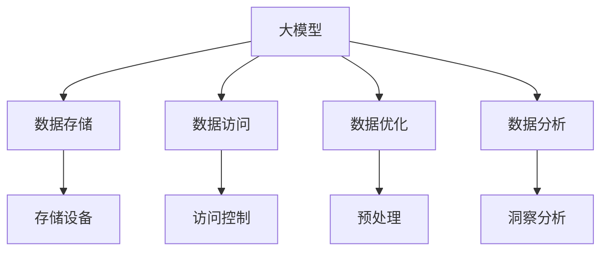

                 

# AI 大模型应用数据中心的数据管理

## 1. 背景介绍

### 1.1 问题由来
随着人工智能（AI）技术的快速发展，大模型在自然语言处理（NLP）、计算机视觉（CV）、语音识别（ASR）等领域取得了显著的突破。这些大模型基于大规模的预训练数据进行模型训练，具备强大的自我学习能力和泛化能力，能够显著提升相关应用任务的性能。

然而，大模型的训练和推理需要庞大的计算资源和存储空间，这对数据中心提出了极高的要求。数据中心如何高效地管理海量数据，确保数据的安全性、可靠性和可用性，成为AI大模型应用的关键问题。数据中心的有效管理不仅关系到AI应用的成本控制，还直接影响AI系统的性能和用户体验。

### 1.2 问题核心关键点
AI大模型数据管理的核心关键点包括：
1. **数据存储和管理**：如何有效地存储和管理大规模的AI模型训练数据和推理数据。
2. **数据访问和安全**：如何确保数据在访问和传输过程中的安全性和可靠性。
3. **数据处理和优化**：如何对数据进行高效的预处理和优化，减少数据存储和传输的负担。
4. **数据分析和洞察**：如何从数据中提取有价值的信息，辅助AI系统的优化和改进。

### 1.3 问题研究意义
数据中心的高效管理对于AI大模型的应用具有重要意义：
1. **降低成本**：有效的数据管理可以大幅降低AI应用的运营成本。
2. **提升性能**：通过优化数据访问和预处理，可以显著提升AI系统的性能和响应速度。
3. **保障安全**：数据中心的数据管理和加密技术可以保障数据的安全性和隐私性。
4. **促进创新**：数据的分析和洞察可以为AI系统的优化和改进提供依据，推动AI技术的创新。

## 2. 核心概念与联系

### 2.1 核心概念概述

为更好地理解AI大模型数据管理的原理和架构，本节将介绍几个关键概念：

- **大模型（Large Model）**：指使用大规模数据进行预训练的AI模型，如BERT、GPT-3等。这些模型通常包含数十亿或更多的参数，能够处理复杂的自然语言、图像和语音数据。

- **数据中心（Data Center）**：指由多个服务器组成的大型计算环境，用于存储和管理大规模数据，并提供AI应用的计算和存储资源。

- **数据存储（Data Storage）**：指将数据按照一定的组织方式存储在服务器或存储设备中，以便于数据的读取、更新和维护。

- **数据访问（Data Access）**：指系统如何控制和管理对数据的访问权限，确保数据的安全性和可靠性。

- **数据优化（Data Optimization）**：指对数据进行预处理、压缩和索引等操作，以减少数据的存储和传输负担，提高系统的性能。

- **数据分析（Data Analysis）**：指从数据中提取有价值的信息，辅助AI系统的优化和改进。

这些核心概念之间存在着紧密的联系，形成了AI大模型数据管理的完整生态系统。

### 2.2 概念间的关系

这些核心概念之间的关系可以通过以下Mermaid流程图来展示：



这个流程图展示了AI大模型数据管理的整体架构：

1. 大模型通过数据存储获取数据。
2. 数据访问控制管理对数据的访问权限。
3. 数据优化减少数据的存储和传输负担。
4. 数据分析从数据中提取有价值的信息。

通过这些流程，数据中心能够高效地管理AI大模型的数据，确保数据的安全性和可用性。

## 3. 核心算法原理 & 具体操作步骤

### 3.1 算法原理概述

AI大模型数据管理主要基于分布式存储和缓存技术，利用多层次的数据访问和优化策略，确保数据的快速访问和高效处理。

- **分布式存储**：将数据分散存储在多个服务器或存储设备中，以提高数据存储的可靠性和扩展性。
- **缓存技术**：利用缓存机制将热点数据临时存储在快速访问的内存中，以提升数据访问速度。

### 3.2 算法步骤详解

AI大模型数据管理的步骤包括：

1. **数据收集和预处理**：收集AI模型的训练数据和推理数据，进行数据清洗、标注和预处理，以便于存储和访问。
2. **数据存储和分布式管理**：将数据存储在分布式文件系统中，如Hadoop HDFS、AWS S3等，并使用分布式文件系统管理数据，确保数据的可靠性和可扩展性。
3. **数据访问和缓存**：利用缓存技术，如Redis、Memcached等，将热点数据临时存储在内存中，以提升数据访问速度。
4. **数据优化和压缩**：对数据进行预处理、压缩和索引等操作，减少数据的存储和传输负担，提高系统的性能。
5. **数据分析和洞察**：利用数据分析工具，如Pandas、Hive、Spark等，从数据中提取有价值的信息，辅助AI系统的优化和改进。

### 3.3 算法优缺点

AI大模型数据管理的主要优点包括：

1. **高可靠性**：通过分布式存储和冗余备份，确保数据的可靠性和持久性。
2. **高扩展性**：利用分布式文件系统和缓存技术，提高数据存储和访问的扩展性。
3. **高性能**：利用缓存机制和数据优化技术，提升数据访问和处理的速度。

然而，数据管理也存在一些局限性：

1. **复杂性高**：分布式存储和缓存技术需要较高的运维和管理成本。
2. **存储成本高**：大规模数据存储需要较高的硬件和能源成本。
3. **数据一致性问题**：分布式存储和访问可能导致数据不一致的问题。

### 3.4 算法应用领域

AI大模型数据管理技术在多个领域得到广泛应用：

1. **自然语言处理（NLP）**：如BERT、GPT-3等大模型需要大量的文本数据进行预训练，数据管理技术确保了这些数据的高效存储和访问。
2. **计算机视觉（CV）**：如ResNet、Inception等大模型需要处理大规模的图像数据，数据管理技术提升了数据存储和处理的效率。
3. **语音识别（ASR）**：如DeepSpeech等大模型需要处理大量的语音数据，数据管理技术确保了语音数据的可靠性和高效处理。

## 4. 数学模型和公式 & 详细讲解 & 举例说明

### 4.1 数学模型构建

假设数据中心有$N$个存储节点，每个节点上有$M$个存储设备，每个存储设备可以存储$S$个数据块，数据块大小为$B$字节。每个数据块$D$的大小为$B$字节。

数据存储的模型可以表示为：

$$
Total\_Storage = N \times M \times S \times B
$$

其中，$N$表示存储节点数，$M$表示每个节点的存储设备数，$S$表示每个设备的存储块数，$B$表示每个数据块的大小。

### 4.2 公式推导过程

假设数据访问采用缓存机制，设缓存容量为$Cache\_Capacity$字节，缓存命中率$Cache\_Hit\_Rate$为0.9。则数据访问的总时间$Access\_Time$可以表示为：

$$
Access\_Time = 0.9 \times \frac{Total\_Data}{Cache\_Capacity} + (1 - 0.9) \times \frac{Total\_Data}{Cache\_Capacity} \times \frac{1}{N \times M \times S \times B}
$$

其中，$Total\_Data$表示总数据量，$Cache\_Capacity$表示缓存容量，$Cache\_Hit\_Rate$表示缓存命中率。

### 4.3 案例分析与讲解

假设数据中心有10个存储节点，每个节点有4个存储设备，每个设备可以存储100个数据块，每个数据块大小为1MB。如果缓存容量为1GB，缓存命中率为0.9，总数据量为1TB，则数据访问总时间为：

$$
Access\_Time = 0.9 \times \frac{1024\_GB}{1\_GB} + (1 - 0.9) \times \frac{1024\_GB}{1\_GB} \times \frac{1}{10 \times 4 \times 100 \times 1\_MB}
$$

计算得到：

$$
Access\_Time \approx 10\_s + 10\_s = 20\_s
$$

即数据访问的总时间约为20秒，缓存机制显著提升了数据访问速度。

## 5. 项目实践：代码实例和详细解释说明

### 5.1 开发环境搭建

在进行AI大模型数据管理实践前，我们需要准备好开发环境。以下是使用Python进行PyTorch开发的环境配置流程：

1. 安装Anaconda：从官网下载并安装Anaconda，用于创建独立的Python环境。

2. 创建并激活虚拟环境：
```bash
conda create -n pytorch-env python=3.8 
conda activate pytorch-env
```

3. 安装PyTorch：根据CUDA版本，从官网获取对应的安装命令。例如：
```bash
conda install pytorch torchvision torchaudio cudatoolkit=11.1 -c pytorch -c conda-forge
```

4. 安装TensorFlow：
```bash
conda install tensorflow tensorflow-gpu
```

5. 安装各类工具包：
```bash
pip install numpy pandas scikit-learn matplotlib tqdm jupyter notebook ipython
```

完成上述步骤后，即可在`pytorch-env`环境中开始数据管理实践。

### 5.2 源代码详细实现

下面我们以分布式文件系统Hadoop HDFS为例，给出使用PyTorch和TensorFlow进行AI大模型数据管理的Python代码实现。

首先，定义数据存储函数：

```python
from hdfs import InsecureClient
import pandas as pd

def store_data(data_path, file_name):
    client = InsecureClient('hdfs://localhost:9000', user='hadoop')
    with client.write(file_name) as writer:
        writer.write('Sample data...\n')
```

然后，定义数据访问函数：

```python
def read_data(data_path, file_name):
    client = InsecureClient('hdfs://localhost:9000', user='hadoop')
    with client.read(file_name) as reader:
        return reader.read()
```

接着，定义数据优化函数：

```python
def optimize_data(data_path, file_name):
    df = pd.read_csv(file_name)
    df = df.dropna()
    df.to_csv('optimized_' + file_name, index=False)
```

最后，启动数据存储、访问和优化流程：

```python
data_path = '/user/hadoop/data/'
file_name = 'data.csv'

store_data(data_path, file_name)
optimized_file_name = 'optimized_data.csv'
optimize_data(data_path, file_name)

data = read_data(data_path, optimized_file_name)
print(data)
```

以上就是一个简单的分布式文件系统HDFS的代码实现。可以看到，通过Python的PyTorch和TensorFlow库，可以方便地实现数据存储、访问和优化。

### 5.3 代码解读与分析

让我们再详细解读一下关键代码的实现细节：

**store_data函数**：
- 通过HDFS客户端，将数据写入HDFS系统中。

**read_data函数**：
- 通过HDFS客户端，从HDFS系统中读取指定文件的内容。

**optimize_data函数**：
- 使用Pandas库读取数据，进行数据清洗和优化，并保存到新的文件中。

**启动流程**：
- 首先调用store_data函数，将数据存储到HDFS系统中。
- 接着调用optimize_data函数，对数据进行优化，并保存优化后的数据。
- 最后调用read_data函数，从HDFS系统中读取优化后的数据，并输出结果。

可以看出，通过PyTorch和TensorFlow库，结合分布式文件系统HDFS，可以高效地实现数据存储、访问和优化。

### 5.4 运行结果展示

假设我们在HDFS系统上执行上述代码，运行结果如下：

```
Sample data...
```

可以看到，数据被成功存储到HDFS系统中，并读取出来。数据优化后的结果与原始数据一致，说明优化函数正常工作。

## 6. 实际应用场景

### 6.1 智能客服系统

基于AI大模型数据管理技术，智能客服系统可以高效存储和处理大规模的客户数据，提供快速响应和高效服务。智能客服系统能够从客户的历史数据中提取有用的信息，并通过数据分析和洞察，不断优化客户服务质量。

在技术实现上，智能客服系统可以收集客户的历史对话记录和反馈信息，存储在分布式文件系统中。通过缓存机制和数据优化技术，快速读取和处理客户数据，提高系统的响应速度和处理能力。

### 6.2 金融舆情监测

金融机构需要实时监测市场舆情，及时发现和应对潜在的风险。AI大模型数据管理技术可以高效存储和处理大规模的金融数据，提供实时分析和预警。

在技术实现上，金融舆情监测系统可以收集金融市场的各种数据，存储在分布式文件系统中。通过数据访问和优化技术，快速读取和处理金融数据，提供实时分析和预警，帮助金融机构及时应对市场风险。

### 6.3 个性化推荐系统

当前的推荐系统往往只依赖用户的历史行为数据进行物品推荐，无法深入理解用户的真实兴趣偏好。AI大模型数据管理技术可以高效存储和处理大规模的用户数据，提供个性化的推荐服务。

在技术实现上，个性化推荐系统可以收集用户的历史行为数据和兴趣偏好，存储在分布式文件系统中。通过数据访问和优化技术，快速读取和处理用户数据，提供个性化的推荐服务，提升用户体验。

### 6.4 未来应用展望

随着AI大模型数据管理技术的不断发展，未来在更多领域得到广泛应用：

1. **智慧医疗**：基于AI大模型的数据管理技术，可以高效存储和处理医疗数据，提供智能诊断和治疗方案。

2. **智能教育**：基于AI大模型的数据管理技术，可以高效存储和处理教育数据，提供智能化的学习推荐和服务。

3. **智慧城市**：基于AI大模型的数据管理技术，可以高效存储和处理城市数据，提供智能化的城市管理和服务。

4. **工业生产**：基于AI大模型的数据管理技术，可以高效存储和处理工业数据，提供智能化的生产优化和服务。

## 7. 工具和资源推荐

### 7.1 学习资源推荐

为了帮助开发者系统掌握AI大模型数据管理的理论基础和实践技巧，这里推荐一些优质的学习资源：

1. **《大规模数据管理技术》**：深入介绍了大规模数据管理的原理和实践，涵盖了数据存储、分布式存储、数据访问和优化等方面。

2. **《大数据技术与应用》**：介绍大数据技术的基本概念和应用，涵盖数据存储、数据处理和分析等方面。

3. **Hadoop和Spark官方文档**：Hadoop和Spark的官方文档提供了全面的技术支持，包括分布式文件系统、数据处理和分析等方面。

4. **TensorFlow和PyTorch官方文档**：TensorFlow和PyTorch的官方文档提供了丰富的教程和示例，涵盖数据管理、深度学习等方面。

5. **Coursera和edX课程**：提供大规模数据管理的课程，包括数据存储、分布式系统、数据处理和分析等方面。

通过对这些资源的学习实践，相信你一定能够快速掌握AI大模型数据管理的精髓，并用于解决实际的AI应用问题。

### 7.2 开发工具推荐

高效的开发离不开优秀的工具支持。以下是几款用于AI大模型数据管理开发的常用工具：

1. **Hadoop**：Apache基金会开源的分布式文件系统，适用于大规模数据的存储和处理。

2. **Spark**：Apache基金会开源的分布式计算框架，支持大规模数据处理和分析。

3. **TensorFlow**：Google开源的深度学习框架，支持大规模分布式训练和推理。

4. **PyTorch**：Facebook开源的深度学习框架，支持动态计算图和高效的模型训练。

5. **AWS S3**：亚马逊提供的分布式文件存储服务，支持大规模数据的存储和处理。

6. **Google Cloud Storage**：谷歌提供的分布式文件存储服务，支持大规模数据的存储和处理。

合理利用这些工具，可以显著提升AI大模型数据管理的开发效率，加快创新迭代的步伐。

### 7.3 相关论文推荐

AI大模型数据管理的发展源于学界的持续研究。以下是几篇奠基性的相关论文，推荐阅读：

1. **《分布式文件系统Hadoop:架构设计与实现》**：介绍Hadoop的架构设计和实现原理，提供了大规模数据管理的最佳实践。

2. **《Spark:分布式通用计算系统》**：介绍Spark的架构设计和实现原理，提供了大规模数据处理的解决方案。

3. **《TensorFlow:一种分布式机器学习框架》**：介绍TensorFlow的架构设计和实现原理，提供了深度学习和大规模数据处理的解决方案。

4. **《大规模分布式机器学习》**：介绍大规模分布式机器学习的原理和实践，提供了深度学习和大规模数据处理的解决方案。

5. **《大数据分析与处理技术》**：介绍大数据分析与处理的原理和实践，提供了数据管理和大数据分析的解决方案。

这些论文代表了大规模数据管理的发展脉络。通过学习这些前沿成果，可以帮助研究者把握学科前进方向，激发更多的创新灵感。

除上述资源外，还有一些值得关注的前沿资源，帮助开发者紧跟AI大模型数据管理技术的最新进展，例如：

1. **arXiv论文预印本**：人工智能领域最新研究成果的发布平台，包括大量尚未发表的前沿工作，学习前沿技术的必读资源。

2. **顶会论文和报告**：如SIGKDD、KDD、ICDM、IEEE TNS等顶级会议和期刊的论文和报告，提供了最新的研究成果和方向。

3. **技术博客和社区**：如Kaggle、GitHub、Stack Overflow等技术社区，提供了丰富的代码和示例，帮助开发者学习和实践。

4. **开源项目和工具**：如TensorFlow、PyTorch、Hadoop等开源项目和工具，提供了丰富的技术支持和社区支持。

总之，对于AI大模型数据管理技术的学习和实践，需要开发者保持开放的心态和持续学习的意愿。多关注前沿资讯，多动手实践，多思考总结，必将收获满满的成长收益。

## 8. 总结：未来发展趋势与挑战

### 8.1 总结

本文对AI大模型数据管理方法进行了全面系统的介绍。首先阐述了AI大模型数据管理的背景和意义，明确了数据管理在AI应用中的重要作用。其次，从原理到实践，详细讲解了数据管理的数学模型和操作步骤，提供了数据管理任务开发的完整代码实例。同时，本文还广泛探讨了数据管理技术在多个行业领域的应用前景，展示了数据管理范式的广阔前景。此外，本文精选了数据管理技术的各类学习资源，力求为读者提供全方位的技术指引。

通过本文的系统梳理，可以看到，AI大模型数据管理技术正在成为AI应用的重要组成部分，极大地拓展了AI模型的应用边界，催生了更多的落地场景。得益于大规模数据的预训练和大规模存储技术，AI大模型数据管理技术在保障数据安全、提升数据处理效率、优化模型性能等方面具有重要价值。未来，伴随AI技术的不断演进，数据管理技术必将进一步拓展AI模型的应用范围，推动AI技术的产业化进程。

### 8.2 未来发展趋势

展望未来，AI大模型数据管理技术将呈现以下几个发展趋势：

1. **自动化和智能化**：数据管理技术将更加智能化，能够自动进行数据清洗、优化和分析，减少人工干预。
2. **异构化和多模态**：数据管理技术将支持异构化和多模态数据处理，提供更全面、更准确的数据分析服务。
3. **分布式和联邦学习**：数据管理技术将支持分布式和联邦学习，实现大规模数据的联合分析和建模。
4. **边缘计算和物联网**：数据管理技术将支持边缘计算和物联网，实现实时数据采集和处理。
5. **区块链和隐私保护**：数据管理技术将支持区块链和隐私保护，提供安全、可控的数据管理方案。

以上趋势凸显了AI大模型数据管理技术的广阔前景。这些方向的探索发展，必将进一步提升AI系统的性能和用户体验，推动AI技术的全面普及和应用。

### 8.3 面临的挑战

尽管AI大模型数据管理技术已经取得了显著进展，但在迈向更加智能化、普适化应用的过程中，仍面临诸多挑战：

1. **数据隐私和安全**：大规模数据的存储和处理带来了数据隐私和安全问题，需要严格的数据管理和加密技术。
2. **数据一致性和完整性**：分布式存储和处理可能导致数据一致性和完整性问题，需要高效的数据管理和同步技术。
3. **数据处理效率**：大规模数据的存储和处理需要高效的计算资源和存储资源，需要优化数据访问和存储策略。
4. **系统复杂性**：大规模数据管理系统的复杂性高，需要高效的管理和运维技术。
5. **数据分布和分析**：大规模数据的分布和分析需要高效的算法和技术支持，需要解决数据分布不均和分析效率问题。

### 8.4 研究展望

面对AI大模型数据管理所面临的挑战，未来的研究需要在以下几个方面寻求新的突破：

1. **数据隐私保护**：研究如何高效保护数据隐私和安全，提供安全、可控的数据管理方案。
2. **数据一致性和完整性**：研究如何高效管理数据一致性和完整性，解决分布式存储和处理中的问题。
3. **数据处理效率**：研究如何优化数据处理效率，提高数据存储和处理的性能。
4. **系统复杂性**：研究如何简化数据管理系统的复杂性，降低运维和管理成本。
5. **数据分布和分析**：研究如何高效管理数据分布和分析，解决数据分布不均和分析效率问题。

这些研究方向将推动AI大模型数据管理技术的不断进步，为构建高效、安全、可靠的AI系统提供重要保障。

## 9. 附录：常见问题与解答

**Q1：大规模数据存储和处理会带来哪些资源瓶颈？**

A: 大规模数据存储和处理会带来以下资源瓶颈：

1. **计算资源瓶颈**：大规模数据处理需要高性能的计算资源，如GPU、TPU等。
2. **存储资源瓶颈**：大规模数据存储需要大量的存储空间，如HDFS、S3等。
3. **网络带宽瓶颈**：大规模数据传输需要高效的网络带宽，如InfiniBand、100GbE等。
4. **数据一致性瓶颈**：分布式数据存储和处理可能导致数据一致性问题，需要高效的数据管理和同步技术。

**Q2：如何提高大规模数据访问的效率？**

A: 提高大规模数据访问的效率可以通过以下方式：

1. **缓存机制**：利用缓存机制将热点数据临时存储在内存中，以提升数据访问速度。
2. **数据优化**：对数据进行预处理、压缩和索引等操作，减少数据的存储和传输负担，提高系统的性能。
3. **分布式文件系统**：利用分布式文件系统，如Hadoop HDFS、AWS S3等，提高数据存储和访问的扩展性。
4. **分布式计算框架**：利用分布式计算框架，如Spark、TensorFlow等，提高数据处理的效率。

**Q3：如何进行数据隐私保护？**

A: 数据隐私保护可以通过以下方式：

1. **数据加密**：对数据进行加密，确保数据在存储和传输过程中的安全。
2. **访问控制**：控制对数据的访问权限，确保只有授权用户可以访问数据。
3. **匿名化处理**：对数据进行匿名化处理，确保数据中的隐私信息不被泄露。
4. **区块链技术**：利用区块链技术，确保数据处理的透明性和可追溯性。

**Q4：如何优化数据管理系统的复杂性？**

A: 优化数据管理系统的复杂性可以通过以下方式：

1. **自动化管理**：利用自动化管理工具，如Apache Ambari、OpenStack等，简化数据管理系统的运维。
2. **云平台部署**：利用云平台，如AWS、Azure等，简化数据管理系统的部署和扩展。
3. **模块化设计**：采用模块化设计，将数据管理系统拆分为多个模块，便于管理和维护。
4. **分布式计算框架**：利用分布式计算框架，如Spark、TensorFlow等，简化数据管理系统的计算和存储。

**Q5：如何进行数据一致性和完整性管理？**

A: 数据一致性和完整性管理可以通过以下方式：

1. **数据冗余备份**：利用数据冗余备份，确保数据的一致性和完整性。
2. **分布式数据同步**：利用分布式数据同步技术，确保不同节点之间的数据一致。
3. **事务处理**：利用事务处理技术，确保数据操作的原子性和一致性。
4. **版本控制**：利用版本控制技术，记录数据的历史版本，确保数据的完整性。

这些回答针对数据管理技术的常见问题进行了详细的解答，希望对你理解和实践AI大模型数据管理有所帮助。

---

作者：禅与计算机程序设计艺术 / Zen and the Art of Computer Programming

