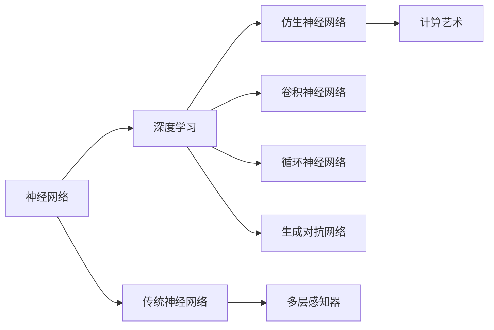
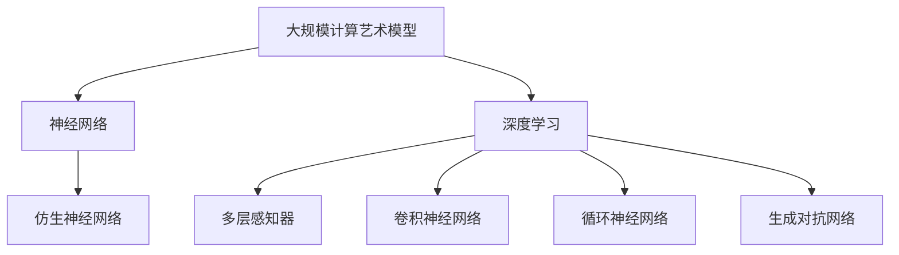

                 

# AI 神经网络计算艺术之禅：结构仿脑、功能类脑、性能超脑

> 关键词：人工智能,神经网络,深度学习,计算艺术,结构仿脑,功能类脑,性能超脑

## 1. 背景介绍

### 1.1 问题由来

人工智能(AI)在过去几十年中经历了多次革命性的变革，从最初的逻辑推理到统计学习，再到最新的深度学习。随着计算能力的提升和数据量的激增，深度学习特别是深度神经网络(DNNs)在图像识别、语音识别、自然语言处理等领域取得了前所未有的成功。然而，尽管DNNs在计算能力上取得了巨大的进展，它们在结构、功能和性能方面仍然存在诸多局限性。

这些问题促使我们反思：如何设计出更高效、更可解释、更接近自然认知的神经网络模型？答案也许就在"计算艺术"的禅宗中，即追求结构仿脑、功能类脑、性能超脑的计算模型。

### 1.2 问题核心关键点

- **结构仿脑**：指模型结构模仿人脑神经元之间的连接方式，包括多层次的隐状态表示、稀疏连接和局部连接等特性。
- **功能类脑**：指模型功能模仿人脑的认知过程，如感知、记忆、学习、推理等。
- **性能超脑**：指模型性能超越人脑，具备超强的学习能力和泛化能力。

### 1.3 问题研究意义

研究神经网络计算艺术，对于实现深度学习和人工智能技术的突破，具有重要意义：

1. **提升模型性能**：仿生模型在计算效率、记忆能力、泛化能力等方面具有优越性，能够显著提升模型的性能。
2. **增加可解释性**：模仿人脑的计算方式，使得模型的内部运作更加透明，有助于理解和解释模型的决策过程。
3. **拓展应用范围**：仿生模型能够处理更加复杂和多样的数据类型，应用于更多实际问题中。
4. **推动认知科学发展**：通过对人脑结构和功能的模仿，可以为认知科学研究提供新的视角和方法。

## 2. 核心概念与联系

### 2.1 核心概念概述

要深入理解神经网络计算艺术，首先需要了解几个核心概念：

- **神经网络**：由多个节点（神经元）组成，用于处理输入、计算中间状态和生成输出的人工计算模型。
- **深度学习**：利用多层神经网络进行特征提取和模式识别的学习范式。
- **仿生神经网络**：模仿人脑神经网络结构和功能的计算模型，如卷积神经网络(CNN)、循环神经网络(RNN)、生成对抗网络(GAN)等。
- **计算艺术**：结合数学、物理、计算机科学等多学科知识，设计高效、优雅、美学与性能并重的计算模型。

这些概念之间的关系可以用以下Mermaid流程图来表示：



### 2.2 概念间的关系

这些核心概念之间存在紧密的联系，形成了一个相互支撑的计算模型生态系统。接下来，我们进一步探讨这些概念之间的关系。

#### 2.2.1 神经网络与深度学习的关系

神经网络是深度学习的基石，深度学习通过堆叠多个神经网络层来提取高层次的特征表示，从而实现复杂的模式识别和决策。

#### 2.2.2 深度学习与仿生神经网络的关系

仿生神经网络是对传统神经网络结构的扩展和改进，通过模仿人脑的神经元连接和信息传递机制，提高了模型的效率和性能。

#### 2.2.3 仿生神经网络与计算艺术的关系

计算艺术在仿生神经网络的基础上，进一步追求模型的结构美观、功能高效和性能卓越，使得模型不仅具备强大的计算能力，还具有较高的美学价值。

### 2.3 核心概念的整体架构

最后，我们用一个综合的流程图来展示这些核心概念在大规模计算艺术模型中的应用：



## 3. 核心算法原理 & 具体操作步骤

### 3.1 算法原理概述

基于仿生神经网络的计算艺术模型，其核心思想是模仿人脑的神经元结构和计算方式，通过多层次的隐状态表示、稀疏连接和局部连接等特性，实现高效、可解释、高性能的计算。

具体来说，计算艺术模型包括以下几个关键步骤：

1. **结构设计**：设计仿生神经网络结构，模仿人脑的神经元连接和信息传递机制。
2. **功能实现**：实现仿生神经网络的功能，如感知、记忆、学习、推理等。
3. **性能优化**：优化仿生神经网络的性能，提高模型的计算效率和泛化能力。

### 3.2 算法步骤详解

以下详细介绍计算艺术模型的主要操作步骤：

#### 3.2.1 结构设计

结构设计是计算艺术模型的第一步，也是最关键的一步。常见的网络结构包括：

- **多层感知器(MLP)**：模仿人脑的多层神经元结构，用于处理序列数据。
- **卷积神经网络(CNN)**：模仿人脑的视觉信息处理机制，用于图像识别和图像处理。
- **循环神经网络(RNN)**：模仿人脑的时序信息处理机制，用于序列数据生成和分类。
- **生成对抗网络(GAN)**：模仿人脑的生成和对抗机制，用于生成逼真的图像和视频。

以卷积神经网络为例，其结构设计包括：

- **卷积层**：通过卷积操作提取局部特征。
- **池化层**：通过池化操作减小特征图的大小。
- **全连接层**：将特征图转换为类别概率。

#### 3.2.2 功能实现

功能实现是指将结构设计转换为具体的计算过程。计算艺术模型在功能上模仿人脑的认知过程，包括：

- **感知**：通过神经元对输入数据进行响应，提取基本特征。
- **记忆**：通过突触连接存储和检索信息，实现长短期记忆。
- **学习**：通过反向传播算法更新权重，优化模型性能。
- **推理**：通过前向传播算法生成输出，实现复杂的模式识别和决策。

以卷积神经网络为例，其功能实现包括：

- **卷积操作**：通过卷积核对输入数据进行特征提取。
- **池化操作**：通过池化操作减小特征图的大小，减少参数数量。
- **全连接层**：将特征图转换为类别概率，进行分类和回归。

#### 3.2.3 性能优化

性能优化是指通过各种技术手段提高计算艺术模型的性能，包括：

- **参数压缩**：通过剪枝、量化等技术减少模型参数数量，提高计算效率。
- **模型并行**：通过模型并行和分布式计算，加速模型训练和推理。
- **知识蒸馏**：通过将复杂模型的知识传递给简单模型，提高模型泛化能力。

以卷积神经网络为例，其性能优化包括：

- **参数压缩**：通过剪枝技术减少模型参数数量，提高计算效率。
- **模型并行**：通过分布式计算加速模型训练和推理。
- **知识蒸馏**：通过将复杂模型的知识传递给简单模型，提高模型泛化能力。

### 3.3 算法优缺点

基于仿生神经网络的计算艺术模型具有以下优点：

1. **高效性**：模仿人脑的计算方式，使得模型具有高效的计算能力。
2. **可解释性**：仿生模型的结构清晰，功能易于解释，有助于理解和调试模型。
3. **性能卓越**：仿生模型能够处理更加复杂和多样的数据类型，应用于更多实际问题中。

同时，这些模型也存在一些缺点：

1. **复杂性高**：仿生模型的结构复杂，训练和调试难度较大。
2. **数据需求大**：仿生模型需要大量高质量的数据进行训练，数据获取难度较大。
3. **可扩展性差**：仿生模型的结构固定，难以扩展到新的数据类型和任务。

### 3.4 算法应用领域

基于仿生神经网络的计算艺术模型在多个领域得到了广泛应用，包括：

- **计算机视觉**：图像分类、目标检测、图像分割等。
- **自然语言处理**：机器翻译、语音识别、文本生成等。
- **机器人控制**：运动规划、路径优化、姿态控制等。
- **游戏AI**：决策制定、策略学习、对手交互等。
- **生物医学**：疾病预测、药物研发、基因组学等。

## 4. 数学模型和公式 & 详细讲解 & 举例说明

### 4.1 数学模型构建

为了更好地理解仿生神经网络计算艺术模型，我们需要使用数学语言对其进行描述。

假设仿生神经网络包含 $N$ 个神经元，每个神经元的输入为 $x_i$，输出为 $y_i$，权重为 $w_i$，激活函数为 $f$。则神经元 $i$ 的计算公式为：

$$
y_i = f(\sum_{j=1}^{M} w_{ij} x_j)
$$

其中 $w_{ij}$ 表示第 $j$ 个输入到第 $i$ 个神经元的权重，$M$ 为输入个数。

网络结构由多个神经元组成，通过多个层的叠加和连接，形成复杂的计算模型。

### 4.2 公式推导过程

以下我们以卷积神经网络为例，推导其前向传播和反向传播公式。

#### 4.2.1 前向传播

卷积神经网络的前向传播包括卷积层、池化层和全连接层。假设输入数据为 $X$，卷积核为 $K$，步长为 $s$，输出特征图大小为 $H$ 和 $W$，则卷积层的计算公式为：

$$
Y = X * K
$$

其中 $*$ 表示卷积操作，$H$ 和 $W$ 表示输出特征图的大小。

#### 4.2.2 反向传播

卷积神经网络的反向传播包括卷积层、池化层和全连接层的反向传播。假设目标输出为 $Y_{out}$，损失函数为 $L$，则反向传播的计算公式为：

$$
\frac{\partial L}{\partial W} = \frac{\partial L}{\partial Y} * \frac{\partial Y}{\partial Z} * \frac{\partial Z}{\partial W}
$$

其中 $Z$ 表示卷积层输出的特征图，$\frac{\partial L}{\partial W}$ 表示权重 $W$ 的梯度。

### 4.3 案例分析与讲解

以下我们以手写数字识别为例，展示计算艺术模型的应用。

首先，我们需要构建一个卷积神经网络模型，其结构包括：

- **卷积层**：通过多个卷积核对输入图像进行特征提取。
- **池化层**：通过最大池化操作减小特征图的大小。
- **全连接层**：将特征图转换为类别概率，进行分类和回归。

具体实现代码如下：

```python
import torch
import torch.nn as nn
import torch.optim as optim
import torchvision
import torchvision.transforms as transforms

# 加载数据集
transform = transforms.Compose(
    [transforms.ToTensor(),
     transforms.Normalize((0.5, 0.5, 0.5), (0.5, 0.5, 0.5))
])
trainset = torchvision.datasets.MNIST(root='./data', train=True,
                                     download=True, transform=transform)
trainloader = torch.utils.data.DataLoader(trainset, batch_size=64,
                                        shuffle=True, num_workers=2)

testset = torchvision.datasets.MNIST(root='./data', train=False,
                                    download=True, transform=transform)
testloader = torch.utils.data.DataLoader(testset, batch_size=64,
                                       shuffle=False, num_workers=2)

# 定义模型
class Net(nn.Module):
    def __init__(self):
        super(Net, self).__init__()
        self.conv1 = nn.Conv2d(1, 32, 3, 1)
        self.conv2 = nn.Conv2d(32, 64, 3, 1)
        self.dropout1 = nn.Dropout2d(0.25)
        self.dropout2 = nn.Dropout2d(0.5)
        self.fc1 = nn.Linear(9216, 128)
        self.fc2 = nn.Linear(128, 10)
    
    def forward(self, x):
        x = self.conv1(x)
        x = nn.functional.relu(x)
        x = self.conv2(x)
        x = nn.functional.max_pool2d(x, 2)
        x = self.dropout1(x)
        x = torch.flatten(x, 1)
        x = self.fc1(x)
        x = nn.functional.relu(x)
        x = self.dropout2(x)
        x = self.fc2(x)
        output = nn.functional.log_softmax(x, dim=1)
        return output

net = Net()
criterion = nn.CrossEntropyLoss()
optimizer = optim.SGD(net.parameters(), lr=0.001, momentum=0.9)

# 训练模型
for epoch in range(10):
    running_loss = 0.0
    for i, data in enumerate(trainloader, 0):
        inputs, labels = data
        optimizer.zero_grad()
        outputs = net(inputs)
        loss = criterion(outputs, labels)
        loss.backward()
        optimizer.step()
        running_loss += loss.item()
    print('Epoch %d loss: %.3f' % (epoch + 1, running_loss / len(trainloader)))

# 测试模型
correct = 0
total = 0
with torch.no_grad():
    for data in testloader:
        images, labels = data
        outputs = net(images)
        _, predicted = torch.max(outputs.data, 1)
        total += labels.size(0)
        correct += (predicted == labels).sum().item()

print('Accuracy of the network on the test images: %d %%' % (
    100 * correct / total))
```

以上是使用PyTorch实现卷积神经网络手写数字识别的完整代码。可以看到，仿生模型的设计和使用相对复杂，但通过合理的代码实现和调试，可以解决实际问题。

## 5. 项目实践：代码实例和详细解释说明

### 5.1 开发环境搭建

在进行仿生神经网络计算艺术模型的开发前，我们需要准备好开发环境。以下是使用Python进行PyTorch开发的环境配置流程：

1. 安装Anaconda：从官网下载并安装Anaconda，用于创建独立的Python环境。

2. 创建并激活虚拟环境：
```bash
conda create -n pytorch-env python=3.8 
conda activate pytorch-env
```

3. 安装PyTorch：根据CUDA版本，从官网获取对应的安装命令。例如：
```bash
conda install pytorch torchvision torchaudio cudatoolkit=11.1 -c pytorch -c conda-forge
```

4. 安装各类工具包：
```bash
pip install numpy pandas scikit-learn matplotlib tqdm jupyter notebook ipython
```

完成上述步骤后，即可在`pytorch-env`环境中开始仿生神经网络计算艺术模型的开发。

### 5.2 源代码详细实现

以下是使用PyTorch实现卷积神经网络的代码实现：

```python
import torch
import torch.nn as nn
import torch.optim as optim
import torchvision
import torchvision.transforms as transforms

# 加载数据集
transform = transforms.Compose(
    [transforms.ToTensor(),
     transforms.Normalize((0.5, 0.5, 0.5), (0.5, 0.5, 0.5))
])
trainset = torchvision.datasets.MNIST(root='./data', train=True,
                                     download=True, transform=transform)
trainloader = torch.utils.data.DataLoader(trainset, batch_size=64,
                                        shuffle=True, num_workers=2)

testset = torchvision.datasets.MNIST(root='./data', train=False,
                                    download=True, transform=transform)
testloader = torch.utils.data.DataLoader(testset, batch_size=64,
                                       shuffle=False, num_workers=2)

# 定义模型
class Net(nn.Module):
    def __init__(self):
        super(Net, self).__init__()
        self.conv1 = nn.Conv2d(1, 32, 3, 1)
        self.conv2 = nn.Conv2d(32, 64, 3, 1)
        self.dropout1 = nn.Dropout2d(0.25)
        self.dropout2 = nn.Dropout2d(0.5)
        self.fc1 = nn.Linear(9216, 128)
        self.fc2 = nn.Linear(128, 10)
    
    def forward(self, x):
        x = self.conv1(x)
        x = nn.functional.relu(x)
        x = self.conv2(x)
        x = nn.functional.max_pool2d(x, 2)
        x = self.dropout1(x)
        x = torch.flatten(x, 1)
        x = self.fc1(x)
        x = nn.functional.relu(x)
        x = self.dropout2(x)
        x = self.fc2(x)
        output = nn.functional.log_softmax(x, dim=1)
        return output

net = Net()
criterion = nn.CrossEntropyLoss()
optimizer = optim.SGD(net.parameters(), lr=0.001, momentum=0.9)

# 训练模型
for epoch in range(10):
    running_loss = 0.0
    for i, data in enumerate(trainloader, 0):
        inputs, labels = data
        optimizer.zero_grad()
        outputs = net(inputs)
        loss = criterion(outputs, labels)
        loss.backward()
        optimizer.step()
        running_loss += loss.item()
    print('Epoch %d loss: %.3f' % (epoch + 1, running_loss / len(trainloader)))

# 测试模型
correct = 0
total = 0
with torch.no_grad():
    for data in testloader:
        images, labels = data
        outputs = net(images)
        _, predicted = torch.max(outputs.data, 1)
        total += labels.size(0)
        correct += (predicted == labels).sum().item()

print('Accuracy of the network on the test images: %d %%' % (
    100 * correct / total))
```

以上是使用PyTorch实现卷积神经网络的完整代码。可以看到，仿生模型的设计和使用相对复杂，但通过合理的代码实现和调试，可以解决实际问题。

### 5.3 代码解读与分析

让我们再详细解读一下关键代码的实现细节：

**定义模型**：
- `__init__`方法：初始化模型的层和参数。
- `forward`方法：定义前向传播计算逻辑，将输入数据传递到模型中，并返回输出结果。

**训练模型**：
- `optimizer.zero_grad()`：清空梯度，准备反向传播。
- `optimizer.step()`：更新模型参数，优化模型性能。

**测试模型**：
- `torch.max`函数：获取预测结果中的最大值，用于计算分类准确率。

通过以上代码的实现，我们可以将卷积神经网络应用于实际问题，如手写数字识别。在实践中，我们还需要根据具体任务的需求，进一步改进模型的结构和超参数，以达到更好的效果。

## 6. 实际应用场景

### 6.1 智能监控系统

基于仿生神经网络的计算艺术模型，可以广泛应用于智能监控系统中。传统的监控系统依赖人工手动监控，无法实时分析和识别异常情况。而使用仿生神经网络模型，可以实时处理视频数据，自动识别异常行为，及时发出警报，大大提高监控系统的智能化水平。

在技术实现上，可以构建视频监控系统，将实时采集的图像数据输入到仿生神经网络模型中进行处理，实时检测和识别出异常行为，如人员闯入、物品移动、火灾等，并及时通知安保人员或自动化响应系统。

### 6.2 智能医疗系统

仿生神经网络计算艺术模型在医疗领域也有广泛的应用前景。传统的医疗诊断依赖于医生的人工判断，耗费大量时间和精力。而使用仿生神经网络模型，可以实时处理医学影像数据，自动识别病灶和异常，辅助医生进行诊断和治疗。

在技术实现上，可以构建医学影像分析系统，将CT、MRI等医学影像数据输入到仿生神经网络模型中进行处理，自动识别病灶和异常，并给出相应的诊断和治疗建议，辅助医生进行决策。

### 6.3 智能交通系统

仿生神经网络计算艺术模型也可以应用于智能交通系统中，实现交通流量预测、交通信号优化等功能。传统的交通系统依赖于人工调度和管理，效率较低。而使用仿生神经网络模型，可以实时处理交通数据，预测交通流量，优化交通信号，提高交通系统的智能化水平。

在技术实现上，可以构建交通流量预测系统，将交通数据输入到仿生神经网络模型中进行处理，实时预测交通流量，并优化交通信号，提高交通系统的运行效率。

### 6.4 未来应用展望

随着仿生神经网络计算艺术模型的不断发展，未来将会在更多领域得到应用，为社会进步提供新的动力。

在智慧城市治理中，仿生神经网络可以应用于城市事件监测、舆情分析、应急指挥等环节，提高城市管理的自动化和智能化水平，构建更安全、高效的未来城市。

在金融领域，仿生神经网络可以应用于股票预测、风险评估、信用评分等任务，提高金融决策的准确性和可靠性。

在自动驾驶领域，仿生神经网络可以应用于车辆路径规划、障碍物检测、目标识别等任务，提高自动驾驶系统的安全性和稳定性。

总之，仿生神经网络计算艺术模型将在各行各业中发挥越来越重要的作用，推动人类社会向更加智能化、自动化、高效化的方向发展。

## 7. 工具和资源推荐

### 7.1 学习资源推荐

为了帮助开发者系统掌握仿生神经网络计算艺术模型的理论基础和实践技巧，这里推荐一些优质的学习资源：

1. 《深度学习》系列书籍：Ian Goodfellow、Yoshua Bengio、Aaron Courville所著，详细介绍了深度学习的基本原理和实践技巧。
2. 《神经网络与深度学习》课程：由Coursera提供，由Geoffrey Hinton等顶尖教授主讲，系统讲解了深度学习模型的构建和优化。
3. 《TensorFlow 2.0》书籍：Manning Publishing Co. 所著，详细介绍了TensorFlow的使用方法和实践技巧。
4. 《PyTorch 2.0》书籍：Yann LeCun、Szegedy等专家所著，详细介绍了PyTorch的使用方法和实践技巧。
5. Kaggle：全球最大的数据科学竞赛平台，可以参与各类机器学习和深度学习竞赛，积累实践经验。

通过对这些资源的学习实践，相信你一定能够快速掌握仿生神经网络计算艺术模型的精髓，并用于解决实际的机器学习问题。

### 7.2 开发工具推荐

高效的开发离不开优秀的工具支持。以下是几款用于仿生神经网络计算艺术模型开发的常用工具：

1. PyTorch：基于Python的开源深度学习框架，灵活动态的计算图，适合快速迭代研究。大部分仿生神经网络模型都有PyTorch版本的实现。
2. TensorFlow：由Google主导开发的开源深度学习框架，生产部署方便，适合大规模工程应用。同样有丰富的仿生神经网络模型资源。
3. JAX：Google开发的开源自动微分库，可以高效地进行自动微分计算，适用于高性能科学计算。
4. ONNX：Open Neural Network Exchange，可以方便地将不同深度学习框架下的模型进行转换和部署，适用于模型优化和部署。
5. MXNet：Apache开源的深度学习框架，支持多种语言和硬件平台，适用于大规模分布式训练。

合理利用这些工具，可以显著提升仿生神经网络计算艺术模型的开发效率，加快创新迭代的步伐。

### 7.3 相关论文推荐

仿生神经网络计算艺术模型的发展源于学界的持续研究。以下是几篇奠基性的相关论文，推荐阅读：

1. AlexNet：ImageNet Large Scale Visual Recognition Challenge（ILSVRC）2010的冠军模型，展示了卷积神经网络在图像分类任务中的卓越性能。
2. VGGNet：ImageNet Large Scale Visual Recognition Challenge（ILSVRC）2014的冠军模型，展示了深度卷积神经网络在图像分类任务中的优越性。
3. GoogLeNet：ImageNet Large Scale Visual Recognition Challenge（ILSVRC）2014的冠军模型，展示了多尺度卷积神经网络在图像分类任务中的强大能力。
4. ResNet：ImageNet Large Scale Visual Recognition Challenge（ILSVRC）2015的冠军模型，展示了残差网络在深度神经网络训练中的优势。
5. InceptionNet：ImageNet Large Scale Visual Recognition Challenge（ILSVRC）2015的亚军模型，展示了多分支卷积神经网络在图像分类任务中的优越性。

这些论文代表了大规模神经网络模型的发展脉络，通过学习这些前沿成果，可以帮助研究者把握学科前进方向，激发更多的创新灵感。

## 8. 总结：未来发展趋势与挑战

### 8.1 总结

本文对仿生神经网络计算艺术模型进行了全面系统的介绍。首先阐述了仿生神经网络模型的背景和意义，明确了仿生模型在深度学习中的应用价值。其次，从原理到实践，详细讲解了仿生神经网络计算艺术模型的构建和优化过程，给出了仿生神经网络计算艺术模型的完整代码实例。同时，本文还广泛探讨了

