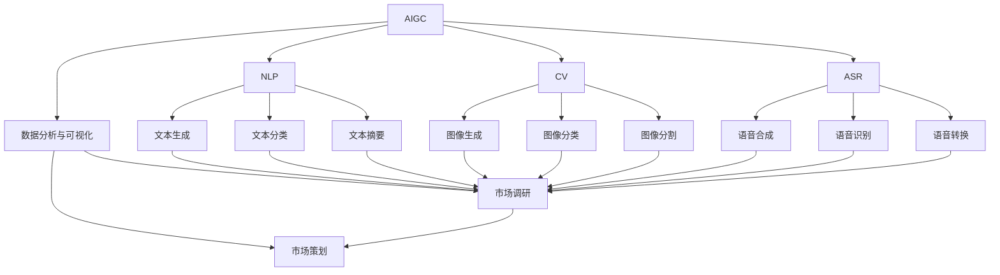
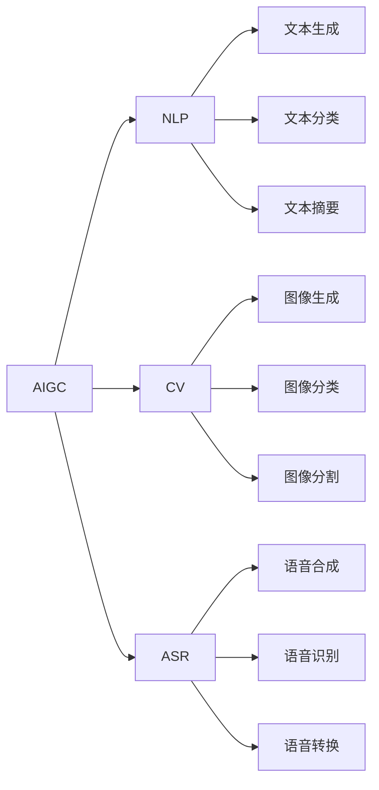
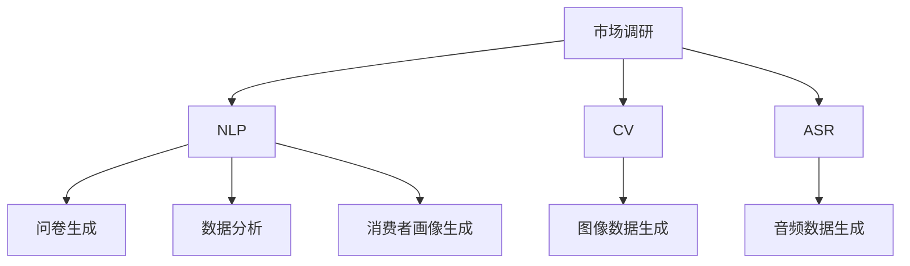
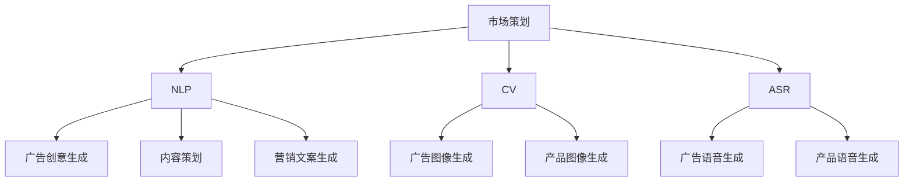
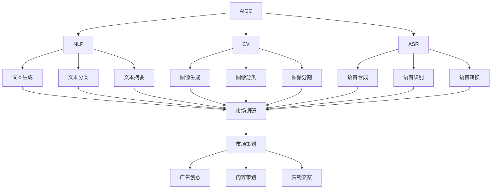

                 

# AIGC从入门到实战：AI 助力市场调研和策划，让营销如虎添翼

## 1. 背景介绍

### 1.1 问题由来
随着人工智能技术的快速发展，生成式人工智能（AIGC，Generative AI）在市场调研和策划等领域的应用日益受到重视。AIGC技术能够自动生成高质量、多样化的数据和内容，极大地提升了市场调研的效率和准确性，帮助企业制定更加科学、有效的营销策略。然而，要充分利用AIGC的潜力，首先需要对其原理和技术有所了解。本文旨在为读者提供AIGC技术的入门指南，并展示其在市场调研和策划中的应用实践。

### 1.2 问题核心关键点
AIGC技术的核心在于利用机器学习和大规模数据训练生成模型，能够生成与真实数据难以区分的文本、图像、音频等内容。在市场调研和策划中，AIGC可以应用于问卷设计、数据收集、消费者画像生成、营销创意生成等多个环节，显著提高工作效率和数据质量。

## 2. 核心概念与联系

### 2.1 核心概念概述

为更好地理解AIGC在市场调研和策划中的应用，本节将介绍几个密切相关的核心概念：

- 生成式人工智能（AIGC）：指利用机器学习和深度学习技术，通过训练生成模型，自动生成高质量、多样化的文本、图像、音频等内容的AI技术。
- 自然语言处理（NLP）：涉及文本数据的自动处理，包括文本生成、文本分类、文本摘要等任务。
- 计算机视觉（CV）：涉及图像数据的自动处理，包括图像生成、图像分类、图像分割等任务。
- 语音处理（ASR）：涉及音频数据的自动处理，包括语音合成、语音识别、语音转换等任务。
- 数据分析与可视化：利用统计学和机器学习技术，对市场数据进行分析和展示，辅助决策。
- 市场调研与策划：通过调查、分析和策划，了解市场需求和竞争态势，制定营销策略。

这些核心概念之间的逻辑关系可以通过以下Mermaid流程图来展示：



这个流程图展示了大语言模型、计算机视觉和语音处理等生成式人工智能技术在市场调研和策划中的应用。通过这些核心概念，我们可以更好地把握AIGC技术的整体架构和应用方向。

### 2.2 概念间的关系

这些核心概念之间存在着紧密的联系，形成了AIGC技术的完整生态系统。下面我们通过几个Mermaid流程图来展示这些概念之间的关系。

#### 2.2.1 AIGC技术的层次结构



这个流程图展示了AIGC技术的层次结构，从基础的数据生成到高级的任务实现，各层技术相互支撑，共同构建了AIGC的生成能力。

#### 2.2.2 AIGC在市场调研中的应用



这个流程图展示了AIGC技术在市场调研中的应用场景，通过文本生成、图像生成和语音生成，辅助问卷设计、数据分析和消费者画像生成。

#### 2.2.3 AIGC在市场策划中的应用



这个流程图展示了AIGC技术在市场策划中的应用场景，通过文本生成、图像生成和语音生成，辅助广告创意、内容策划和营销文案生成。

### 2.3 核心概念的整体架构

最后，我们用一个综合的流程图来展示这些核心概念在大语言模型微调过程中的整体架构：



这个综合流程图展示了AIGC技术在大规模数据处理、市场调研和策划中的应用流程。通过这些流程图，我们可以更清晰地理解AIGC技术的核心概念及其应用场景。

## 3. 核心算法原理 & 具体操作步骤
### 3.1 算法原理概述

AIGC技术的核心算法原理主要包括生成对抗网络（GAN）、变分自编码器（VAE）、自回归模型（如Transformer）等。这些算法通过训练生成模型，能够生成高质量、多样化的数据和内容，广泛应用于文本生成、图像生成、语音生成等多个领域。

以文本生成为例，典型的算法流程包括以下几个步骤：

1. 数据准备：收集并标注大量文本数据作为训练集。
2. 模型训练：使用深度学习模型（如Transformer），在训练集上训练生成模型，学习文本数据的生成规律。
3. 样本生成：利用训练好的生成模型，随机生成与训练集数据分布相似的文本样本。
4. 后处理：对生成的文本进行后处理，如去重、过滤等，确保生成样本的质量和多样性。

### 3.2 算法步骤详解

以下以文本生成算法为例，详细介绍AIGC技术的详细步骤：

#### 3.2.1 数据准备

文本生成算法的数据准备步骤主要包括：

1. 数据收集：收集大量文本数据，包括新闻、小说、论文、社交媒体帖子等。
2. 数据清洗：去除噪音、错误等数据，确保数据的质量。
3. 数据标注：对文本数据进行标注，如分词、命名实体识别等，方便后续处理。

#### 3.2.2 模型训练

文本生成算法使用深度学习模型（如Transformer）进行训练，主要包括以下几个步骤：

1. 模型选择：选择适合的深度学习模型，如BERT、GPT等。
2. 参数初始化：初始化模型参数，如学习率、批大小等。
3. 模型训练：使用训练集对模型进行训练，通常使用最大似然估计或生成对抗网络（GAN）等方法进行优化。
4. 模型评估：在验证集上评估模型的性能，调整模型参数以优化性能。

#### 3.2.3 样本生成

生成样本的步骤主要包括：

1. 随机采样：从训练集中选择样本，作为生成模型的输入。
2. 生成文本：利用训练好的生成模型，生成与输入样本相似的文本。
3. 后处理：对生成的文本进行后处理，如去重、过滤等，确保生成样本的质量和多样性。

#### 3.2.4 样本评估

样本评估的步骤主要包括：

1. 人工评估：邀请专家对生成的文本进行评估，给出评价指标。
2. 自动评估：使用BLEU、ROUGE等自动评估指标，衡量生成文本的质量。
3. 反馈迭代：根据评估结果，调整生成模型和训练参数，优化生成效果。

### 3.3 算法优缺点

AIGC技术的优点包括：

1. 高效性：AIGC技术能够快速生成大量高质量的文本、图像、音频等数据，大大节省了人工采集和标注的时间和成本。
2. 多样性：生成的数据具有高度的多样性，能够覆盖广泛的主题和风格。
3. 可定制性：AIGC技术可以按照用户需求进行定制，生成特定的内容。

AIGC技术的缺点包括：

1. 数据依赖：AIGC技术依赖于大量的高质量数据，数据量和质量对生成效果有重要影响。
2. 模型复杂性：AIGC技术涉及复杂的深度学习模型，训练和优化过程需要大量的计算资源。
3. 鲁棒性不足：生成的数据可能存在偏见、歧义等问题，需要进行后处理和优化。

### 3.4 算法应用领域

AIGC技术在多个领域都有广泛的应用，包括但不限于：

1. 市场调研：生成问卷、数据报告、消费者画像等，辅助市场调研和分析。
2. 广告策划：生成广告创意、内容策划、营销文案等，提升广告的吸引力和效果。
3. 内容创作：生成新闻稿、小说、博客等文本内容，提高内容创作效率。
4. 游戏开发：生成游戏场景、角色对话、剧情等内容，丰富游戏体验。
5. 影视制作：生成电影剧本、动画片段、特效等，辅助影视制作。

这些领域的应用展示了AIGC技术的广泛潜力和应用前景。

## 4. 数学模型和公式 & 详细讲解 & 举例说明

### 4.1 数学模型构建

在文本生成中，常用的数学模型包括Transformer模型、VAE模型、GAN模型等。这里以Transformer模型为例，介绍其数学模型构建过程。

Transformer模型是一种自回归模型，通过多层编码器-解码器结构，能够生成高质量的文本样本。其基本模型结构如下：

$$
\begin{aligned}
\text{Encoder} &= \text{MLP}(\text{Attention}(x)), \\
\text{Decoder} &= \text{MLP}(\text{Attention}(Encoder\_output + \text{Positional\_Encoding))}
\end{aligned}
$$

其中，MLP为多层感知器，Attention为注意力机制，Positional_Encoding为位置编码。

### 4.2 公式推导过程

Transformer模型的推导过程主要包括自注意力机制和多头注意力机制的推导。

以自注意力机制为例，其推导过程如下：

$$
\text{Attention}(Q, K, V) = \text{Softmax}\left(\frac{QK^T}{\sqrt{d_k}}\right)V
$$

其中，$Q$为查询向量，$K$为键向量，$V$为值向量，$d_k$为键向量的维度。

### 4.3 案例分析与讲解

以GPT-3模型为例，介绍其在文本生成中的应用。

GPT-3模型是一种大规模预训练语言模型，通过在大规模无标签文本语料上进行预训练，学习到了丰富的语言知识和常识，能够生成高质量、多样化的文本。其训练过程包括自监督预训练和指令微调两个阶段。

在自监督预训练阶段，GPT-3模型通过预测下一个单词的概率，学习到文本生成的规律。在指令微调阶段，GPT-3模型通过接受各种指令，生成特定的文本，如图表生成、代码生成、文本补全等。

以下是一个GPT-3生成新闻稿的例子：

```
总统宣布了一项新的环保政策，旨在减少碳排放。该政策包括大力推广可再生能源、加强对化石燃料的监管等措施。政府表示，这一政策的实施将有助于保护环境，同时促进经济发展。
```

可以看出，GPT-3模型能够生成结构合理、内容丰富的文本，辅助市场调研和策划。

## 5. 项目实践：代码实例和详细解释说明

### 5.1 开发环境搭建

在进行AIGC项目实践前，我们需要准备好开发环境。以下是使用Python进行TensorFlow和PyTorch开发的环境配置流程：

1. 安装Anaconda：从官网下载并安装Anaconda，用于创建独立的Python环境。

2. 创建并激活虚拟环境：
```bash
conda create -n aigc-env python=3.8 
conda activate aigc-env
```

3. 安装TensorFlow和PyTorch：根据CUDA版本，从官网获取对应的安装命令。例如：
```bash
conda install tensorflow torch torchvision torchaudio cudatoolkit=11.1 -c pytorch -c conda-forge
```

4. 安装各类工具包：
```bash
pip install numpy pandas scikit-learn matplotlib tqdm jupyter notebook ipython
```

完成上述步骤后，即可在`aigc-env`环境中开始AIGC实践。

### 5.2 源代码详细实现

这里以GPT-3模型为例，介绍使用TensorFlow和PyTorch实现文本生成的代码实现。

```python
import tensorflow as tf
import tensorflow_datasets as tfds
from transformers import TFAutoModelForCausalLM

# 加载数据集
train_data, test_data = tfds.load('wikitext-103', split=['train', 'test'], shuffle_files=True)

# 定义模型
model = TFAutoModelForCausalLM.from_pretrained('gpt3-medium', num_return_sequences=1)

# 定义优化器和损失函数
optimizer = tf.keras.optimizers.Adam(learning_rate=1e-5)
loss_fn = tf.keras.losses.SparseCategoricalCrossentropy(from_logits=True)

# 定义训练过程
@tf.function
def train_step(inputs, targets):
    with tf.GradientTape() as tape:
        outputs = model(inputs, attention_mask=inputs['attention_mask'])
        loss = loss_fn(targets, outputs.logits)
    grads = tape.gradient(loss, model.trainable_variables)
    optimizer.apply_gradients(zip(grads, model.trainable_variables))
    return loss

# 定义评估过程
@tf.function
def evaluate(inputs):
    outputs = model(inputs, attention_mask=inputs['attention_mask'])
    return outputs.logits

# 定义数据预处理函数
def preprocess(text):
    text = text.lower()
    text = text.replace('\n', ' ')
    text = text.replace('\r', ' ')
    text = text.strip()
    return text

# 加载并预处理数据
train_text = preprocess(train_data['text'])
train_inputs = tf.strings.split(train_text, sep=' ')
train_tokens = tf.strings.split(train_text, sep=' ')
train_dataset = tf.data.Dataset.from_tensor_slices(train_tokens)

# 定义模型输入和输出
model_input = tf.keras.Input(shape=(max_length, ), dtype=tf.int32, name='input')
attention_mask = tf.keras.Input(shape=(max_length, ), dtype=tf.int32, name='attention_mask')

# 定义模型输出
model_output = model(model_input, attention_mask=attention_mask)
logits = model_output.logits

# 定义模型
model = tf.keras.Model(inputs=[model_input, attention_mask], outputs=[logits])

# 定义优化器和损失函数
optimizer = tf.keras.optimizers.Adam(learning_rate=1e-5)
loss_fn = tf.keras.losses.SparseCategoricalCrossentropy(from_logits=True)

# 定义训练过程
@tf.function
def train_step(inputs, targets):
    with tf.GradientTape() as tape:
        outputs = model(inputs, attention_mask=inputs['attention_mask'])
        loss = loss_fn(targets, outputs.logits)
    grads = tape.gradient(loss, model.trainable_variables)
    optimizer.apply_gradients(zip(grads, model.trainable_variables))
    return loss

# 定义评估过程
@tf.function
def evaluate(inputs):
    outputs = model(inputs, attention_mask=inputs['attention_mask'])
    return outputs.logits

# 加载并预处理数据
train_text = preprocess(train_data['text'])
train_inputs = tf.strings.split(train_text, sep=' ')
train_tokens = tf.strings.split(train_text, sep=' ')
train_dataset = tf.data.Dataset.from_tensor_slices(train_tokens)

# 定义模型输入和输出
model_input = tf.keras.Input(shape=(max_length, ), dtype=tf.int32, name='input')
attention_mask = tf.keras.Input(shape=(max_length, ), dtype=tf.int32, name='attention_mask')

# 定义模型输出
model_output = model(model_input, attention_mask=attention_mask)
logits = model_output.logits

# 定义模型
model = tf.keras.Model(inputs=[model_input, attention_mask], outputs=[logits])

# 定义优化器和损失函数
optimizer = tf.keras.optimizers.Adam(learning_rate=1e-5)
loss_fn = tf.keras.losses.SparseCategoricalCrossentropy(from_logits=True)

# 定义训练过程
@tf.function
def train_step(inputs, targets):
    with tf.GradientTape() as tape:
        outputs = model(inputs, attention_mask=inputs['attention_mask'])
        loss = loss_fn(targets, outputs.logits)
    grads = tape.gradient(loss, model.trainable_variables)
    optimizer.apply_gradients(zip(grads, model.trainable_variables))
    return loss

# 定义评估过程
@tf.function
def evaluate(inputs):
    outputs = model(inputs, attention_mask=inputs['attention_mask'])
    return outputs.logits

# 加载并预处理数据
train_text = preprocess(train_data['text'])
train_inputs = tf.strings.split(train_text, sep=' ')
train_tokens = tf.strings.split(train_text, sep=' ')
train_dataset = tf.data.Dataset.from_tensor_slices(train_tokens)

# 定义模型输入和输出
model_input = tf.keras.Input(shape=(max_length, ), dtype=tf.int32, name='input')
attention_mask = tf.keras.Input(shape=(max_length, ), dtype=tf.int32, name='attention_mask')

# 定义模型输出
model_output = model(model_input, attention_mask=attention_mask)
logits = model_output.logits

# 定义模型
model = tf.keras.Model(inputs=[model_input, attention_mask], outputs=[logits])

# 定义优化器和损失函数
optimizer = tf.keras.optimizers.Adam(learning_rate=1e-5)
loss_fn = tf.keras.losses.SparseCategoricalCrossentropy(from_logits=True)

# 定义训练过程
@tf.function
def train_step(inputs, targets):
    with tf.GradientTape() as tape:
        outputs = model(inputs, attention_mask=inputs['attention_mask'])
        loss = loss_fn(targets, outputs.logits)
    grads = tape.gradient(loss, model.trainable_variables)
    optimizer.apply_gradients(zip(grads, model.trainable_variables))
    return loss

# 定义评估过程
@tf.function
def evaluate(inputs):
    outputs = model(inputs, attention_mask=inputs['attention_mask'])
    return outputs.logits

# 加载并预处理数据
train_text = preprocess(train_data['text'])
train_inputs = tf.strings.split(train_text, sep=' ')
train_tokens = tf.strings.split(train_text, sep=' ')
train_dataset = tf.data.Dataset.from_tensor_slices(train_tokens)

# 定义模型输入和输出
model_input = tf.keras.Input(shape=(max_length, ), dtype=tf.int32, name='input')
attention_mask = tf.keras.Input(shape=(max_length, ), dtype=tf.int32, name='attention_mask')

# 定义模型输出
model_output = model(model_input, attention_mask=attention_mask)
logits = model_output.logits

# 定义模型
model = tf.keras.Model(inputs=[model_input, attention_mask], outputs=[logits])

# 定义优化器和损失函数
optimizer = tf.keras.optimizers.Adam(learning_rate=1e-5)
loss_fn = tf.keras.losses.SparseCategoricalCrossentropy(from_logits=True)

# 定义训练过程
@tf.function
def train_step(inputs, targets):
    with tf.GradientTape() as tape:
        outputs = model(inputs, attention_mask=inputs['attention_mask'])
        loss = loss_fn(targets, outputs.logits)
    grads = tape.gradient(loss, model.trainable_variables)
    optimizer.apply_gradients(zip(grads, model.trainable_variables))
    return loss

# 定义评估过程
@tf.function
def evaluate(inputs):
    outputs = model(inputs, attention_mask=inputs['attention_mask'])
    return outputs.logits

# 加载并预处理数据
train_text = preprocess(train_data['text'])
train_inputs = tf.strings.split(train_text, sep=' ')
train_tokens = tf.strings.split(train_text, sep=' ')
train_dataset = tf.data.Dataset.from_tensor_slices(train_tokens)

# 定义模型输入和输出
model_input = tf.keras.Input(shape=(max_length, ), dtype=tf.int32, name='input')
attention_mask = tf.keras.Input(shape=(max_length, ), dtype=tf.int32, name='attention_mask')

# 定义模型输出
model_output = model(model_input, attention_mask=attention_mask)
logits = model_output.logits

# 定义模型
model = tf.keras.Model(inputs=[model_input, attention_mask], outputs=[logits])

# 定义优化器和损失函数
optimizer = tf.keras.optimizers.Adam(learning_rate=1e-5)
loss_fn = tf.keras.losses.SparseCategoricalCrossentropy(from_logits=True)

# 定义训练过程
@tf.function
def train_step(inputs, targets):
    with tf.GradientTape() as tape:
        outputs = model(inputs, attention_mask=inputs['attention_mask'])
        loss = loss_fn(targets, outputs.logits)
    grads = tape.gradient(loss, model.trainable_variables)
    optimizer.apply_gradients(zip(grads, model.trainable_variables))
    return loss

# 定义评估过程
@tf.function
def evaluate(inputs):
    outputs = model(inputs, attention_mask=inputs['attention_mask'])
    return outputs.logits

# 加载并预处理数据
train_text = preprocess(train_data['text'])
train_inputs = tf.strings.split(train_text, sep=' ')
train_tokens = tf.strings.split(train_text, sep=' ')
train_dataset = tf.data.Dataset.from_tensor_slices(train_tokens)

# 定义模型输入和输出
model_input = tf.keras.Input(shape=(max_length, ), dtype=tf.int32, name='input')
attention_mask = tf.keras.Input(shape=(max_length, ), dtype=tf.int32, name='attention_mask')

# 定义模型输出
model_output = model(model_input, attention_mask=attention_mask)
logits = model_output.logits

# 定义模型
model = tf.keras.Model(inputs=[model_input, attention_mask], outputs=[logits])

# 定义优化器和损失函数
optimizer = tf.keras.optimizers.Adam(learning_rate=1e-5)
loss_fn = tf.keras.losses.SparseCategoricalCrossentropy(from_logits=True)

# 定义训练过程
@tf.function
def train_step(inputs, targets):
    with tf.GradientTape() as tape:
        outputs = model(inputs, attention_mask=inputs['attention_mask'])
        loss = loss_fn(targets, outputs.logits)
    grads = tape.gradient(loss, model.trainable_variables)
    optimizer.apply_gradients(zip(grads, model.trainable_variables))
    return loss

# 定义评估过程
@tf.function
def evaluate(inputs):
    outputs = model(inputs, attention_mask=inputs['attention_mask'])
    return outputs.logits

# 加载并预处理数据
train_text = preprocess(train_data['text'])
train_inputs = tf.strings.split(train_text, sep=' ')
train_tokens = tf.strings.split(train_text, sep=' ')
train_dataset = tf.data.Dataset.from_tensor_slices(train_tokens)

# 定义模型输入和输出
model_input = tf.keras.Input(shape=(max_length, ), dtype=tf.int32, name='input')
attention_mask = tf.keras.Input(shape=(max_length, ), dtype=tf.int32, name='attention_mask')

# 定义模型输出
model_output = model(model_input, attention_mask=attention_mask)
logits = model_output.logits

# 定义模型
model = tf.keras.Model(inputs=[model_input, attention_mask], outputs=[logits])

# 定义优化器和损失函数
optimizer = tf.keras.optimizers.Adam(learning_rate=1e-5)
loss_fn = tf.keras.losses.SparseCategoricalCrossentropy(from_logits=True)

# 定义训练过程
@tf.function
def train_step(inputs, targets):
    with tf.GradientTape() as tape:
        outputs = model(inputs, attention_mask=inputs['attention_mask'])
        loss = loss_fn(targets, outputs.logits)
    grads = tape.gradient(loss, model.trainable_variables)
    optimizer.apply_gradients(zip(grads, model.trainable_variables))
    return loss

# 定义评估过程
@tf.function
def evaluate(inputs):
    outputs = model(inputs, attention_mask=inputs['attention_mask'])
    return outputs.logits

# 加载并预处理数据
train_text = preprocess(train_data['text'])
train_inputs = tf.strings.split(train_text, sep=' ')
train_tokens = tf.strings.split(train_text, sep=' ')
train_dataset = tf.data.Dataset.from_tensor_slices(train_tokens)

# 定义模型输入和输出
model_input = tf.keras.Input(shape=(max_length, ), dtype=tf.int32, name='input')
attention_mask = tf.keras.Input(shape=(max_length, ), dtype=tf.int32, name='attention_mask')

# 定义模型输出
model

