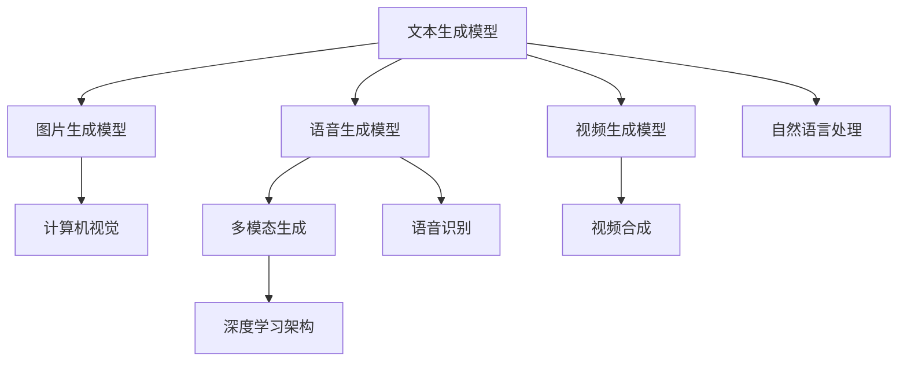

                 

# AIGC从入门到实战：AIGC 带来职场新范式，让 AI 帮你干活，你可以做更多有价值的事

> 关键词：人工智能生成内容(AIGC), 文本生成, 图片生成, 语音生成, 多模态生成, 自然语言处理(NLP), 计算机视觉(CV), 语音识别(SR), 行业应用, 模型部署

## 1. 背景介绍

### 1.1 问题由来

随着人工智能(AI)技术的快速进步，特别是生成对抗网络(GAN)和变压器(Transformer)等架构的突破，人工智能生成内容(AIGC)正迅速改变各个行业。从文本生成到图片生成，从语音生成到视频生成，AIGC的应用场景日益丰富。

近年来，AIGC技术已经广泛应用于文本摘要、机器翻译、音乐创作、图像生成、视频合成等领域，极大地提高了内容的生产效率和质量，并正在催生全新的创意工作模式。与此同时，AIGC也给职场带来了深远影响。

### 1.2 问题核心关键点

1. **AIGC的定义**：人工智能生成内容(AIGC)是指利用AI技术生成文本、图片、音频、视频等内容的技术。其核心在于将人类的创意和知识转化为机器可以理解和生成的形式。
2. **AIGC的关键算法**：包括文本生成模型、图片生成模型、语音生成模型和视频生成模型等。其中，自然语言处理(NLP)、计算机视觉(CV)、语音识别(SR)等领域的技术进步，推动了AIGC的发展。
3. **AIGC的应用场景**：广泛应用于内容创作、广告制作、设计、影视制作、游戏开发等领域。AIGC不仅能大幅提高内容生产效率，还能创造全新的艺术形式和应用场景。
4. **AIGC在职场中的应用**：通过AIGC，员工可以在短时间内生成大量高质量内容，为工作流程提效，同时释放更多时间用于创造性、战略性任务。

### 1.3 问题研究意义

1. **效率提升**：AIGC可以快速生成大量内容，大幅提高内容制作效率，释放员工的时间用于更有价值的工作。
2. **质量改善**：AIGC生成内容的精度和风格多样性不断提升，有助于提高内容质量。
3. **成本降低**：AIGC降低了内容创作的成本，减少了人工干预，提高了内容的可访问性和可重复利用性。
4. **创意激发**：AIGC能够生成多样化的创意素材，激发创意思维，推动创新。
5. **普及与赋能**：AIGC技术普及到各个行业，为普通人提供了强大的工具，实现技术赋能。

## 2. 核心概念与联系

### 2.1 核心概念概述

AIGC技术涉及多个核心概念，包括：

- **文本生成模型**：如GPT-3、BERT等，能够生成自然语言文本，用于文本摘要、机器翻译等任务。
- **图片生成模型**：如DALL-E、GAN等，能够生成高质量的图像，用于内容创作、设计等领域。
- **语音生成模型**：如WaveNet、VOCORD等，能够生成自然语言音频，用于语音合成、语音助手等应用。
- **视频生成模型**：如Mugen、DeepFaceLab等，能够生成高质量的视频内容，用于影视制作、游戏开发等场景。
- **多模态生成**：融合文本、图像、语音等多种模态的信息，生成更丰富、更逼真的内容。

### 2.2 概念间的关系

这些核心概念通过生成对抗网络(GAN)、自回归模型、注意力机制等算法，构成了一个完整的AIGC生态系统。其关系如下：



这个流程图展示了AIGC技术中各个核心概念的关系：

1. 文本生成模型与多模态生成模型之间可以互相转换，如通过文本描述生成图片。
2. 语音生成模型与多模态生成模型可以结合，如通过语音生成文本再生成图片。
3. 自然语言处理与计算机视觉、语音识别、视频合成等领域可以协同工作，生成更全面的AIGC内容。
4. 深度学习架构提供了实现上述生成模型的基础。

## 3. 核心算法原理 & 具体操作步骤
### 3.1 算法原理概述

AIGC的核心算法原理包括：

1. **生成对抗网络(GAN)**：通过两个对抗模型（生成器和判别器），生成高质量的伪造数据。GAN在图像生成、视频生成等任务中表现卓越。
2. **自回归模型**：如GPT系列，通过序列预测的方式，生成连续的自然语言文本。自回归模型在大规模文本生成任务中表现优异。
3. **自编码模型**：如BERT，通过编码器-解码器结构，生成高质量的语义表示，用于文本生成、文本分类等任务。
4. **注意力机制**：如Transformer，通过动态调整模型对输入序列的关注点，生成更相关的输出。注意力机制在多模态生成中尤为重要。

### 3.2 算法步骤详解

基于AIGC的核心算法原理，以下是一个典型的文本生成模型微调流程：

**Step 1: 数据准备**
- 收集文本数据集，如维基百科、新闻文章等。
- 数据预处理：分词、去除停用词、词向量映射等。

**Step 2: 选择预训练模型**
- 选择适合的语言模型，如GPT-2、BERT等。
- 加载预训练模型，并进行微调参数的初始化。

**Step 3: 训练生成器**
- 定义生成器的损失函数，如交叉熵损失。
- 进行训练，并不断调整生成器的参数，使其生成更接近真实文本的文本。

**Step 4: 训练判别器**
- 定义判别器的损失函数，如二分类损失。
- 训练判别器，使其能够区分生成文本和真实文本。

**Step 5: 对抗训练**
- 进行多轮对抗训练，通过交替优化生成器和判别器，生成高质量的文本内容。
- 不断调整生成器和判别器的参数，使其生成和识别文本的能力不断提高。

**Step 6: 生成文本**
- 使用训练好的生成器生成文本。
- 使用生成的文本进行进一步的微调和优化。

**Step 7: 应用部署**
- 将训练好的模型部署到实际应用中，如文本摘要、机器翻译等任务。

### 3.3 算法优缺点

**优点**：
1. **高效生成**：AIGC技术能够快速生成大量高质量的内容，极大地提升了内容制作的效率。
2. **质量保证**：生成的内容质量不断提升，能够满足各种实际应用的需求。
3. **多样化应用**：AIGC可以应用于文本、图片、语音、视频等多个领域，拓展了应用场景。
4. **低成本**：相较于人工制作内容，AIGC大幅降低了成本，提高了内容制作的速度和规模。

**缺点**：
1. **质量瓶颈**：尽管生成质量不断提高，但仍存在内容逻辑不通顺、风格不自然等问题。
2. **缺乏创意**：生成的内容可能缺乏创新性，难以完全替代人类的创意工作。
3. **伦理风险**：生成的内容可能存在偏见、误导性等问题，需要严格监管和审查。
4. **技术依赖**：AIGC技术依赖于大量的高质量数据和强大的计算资源，技术门槛较高。

### 3.4 算法应用领域

AIGC技术广泛应用于以下几个领域：

- **内容创作**：自动生成文章、新闻、博客、广告等内容。
- **设计**：自动生成图片、UI设计、服装设计等。
- **影视制作**：自动生成电影、电视剧、短片等视频内容。
- **游戏开发**：自动生成游戏场景、角色、对话等。
- **教育**：自动生成教材、练习题、模拟试题等。
- **广告**：自动生成广告文案、视频广告等。

## 4. 数学模型和公式 & 详细讲解 & 举例说明

### 4.1 数学模型构建

假设我们有一个文本生成模型$G$和一个判别器$D$，模型的目标是生成高质量的文本内容。生成器的损失函数为：

$$
L_G = E_{x \sim p_{data}}[log(D(x))] + E_{x \sim p_G} [log(1-D(x))]
$$

判别器的损失函数为：

$$
L_D = E_{x \sim p_{data}}[log(D(x))] + E_{x \sim p_G} [log(1-D(x))]
$$

其中，$p_{data}$表示真实数据分布，$p_G$表示生成数据分布。通过交替优化$G$和$D$，可以生成逼真的文本内容。

### 4.2 公式推导过程

在文本生成模型中，生成器的目标是通过输入向量$z$生成文本序列$x$，即$x=G(z)$。其中$z$通常是一个固定长度的随机向量。生成器的目标函数为：

$$
\arg \min_{G} E_{z \sim p(z)} [\mathcal{L}(G(z), x)]
$$

其中$\mathcal{L}(G(z), x)$为损失函数，$p(z)$为随机向量$z$的分布。假设生成器使用的是自回归模型，那么生成器的条件概率分布为：

$$
p(x|x_{<t}, z) = \prod_{t=1}^T p(x_t|x_{<t}, z)
$$

其中$x_{<t}$表示$t$之前的文本序列。通过对$x_{<t}$的条件概率进行最大化，可以生成更符合语义逻辑的文本序列。

### 4.3 案例分析与讲解

以下是一个简单的案例分析：

假设我们要生成一篇新闻报道，首先收集一些与新闻相关的新闻文章，然后使用这些文章对GPT-2模型进行微调。微调的过程包括：

1. **数据准备**：收集多篇新闻文章，并进行预处理。
2. **模型选择**：选择GPT-2模型，并进行参数初始化。
3. **模型训练**：使用训练集对GPT-2进行微调，优化其生成新闻报道的能力。
4. **评估与优化**：在验证集上评估生成的新闻报道的质量，并进行进一步的优化。
5. **生成新闻**：使用训练好的GPT-2模型生成一篇新闻报道。

## 5. 项目实践：代码实例和详细解释说明

### 5.1 开发环境搭建

要实现AIGC项目，首先需要搭建好开发环境。以下是Python环境下使用PyTorch进行AIGC项目开发的配置步骤：

1. 安装Anaconda：从官网下载并安装Anaconda，用于创建独立的Python环境。
2. 创建并激活虚拟环境：
```bash
conda create -n pytorch-env python=3.8 
conda activate pytorch-env
```

3. 安装PyTorch：根据CUDA版本，从官网获取对应的安装命令。例如：
```bash
conda install pytorch torchvision torchaudio cudatoolkit=11.1 -c pytorch -c conda-forge
```

4. 安装Transformers库：
```bash
pip install transformers
```

5. 安装各类工具包：
```bash
pip install numpy pandas scikit-learn matplotlib tqdm jupyter notebook ipython
```

完成上述步骤后，即可在`pytorch-env`环境中开始AIGC项目开发。

### 5.2 源代码详细实现

以下是使用PyTorch实现一个简单的文本生成模型的代码：

```python
from transformers import GPT2Tokenizer, GPT2LMHeadModel
import torch
import torch.nn as nn
import torch.optim as optim

# 加载数据集
train_dataset = ...
val_dataset = ...

# 初始化模型
tokenizer = GPT2Tokenizer.from_pretrained('gpt2')
model = GPT2LMHeadModel.from_pretrained('gpt2')

# 定义损失函数和优化器
criterion = nn.CrossEntropyLoss()
optimizer = optim.Adam(model.parameters(), lr=5e-5)

# 训练模型
def train_epoch(model, data_loader, criterion, optimizer):
    model.train()
    for batch in data_loader:
        input_ids = batch['input_ids']
        attention_mask = batch['attention_mask']
        outputs = model(input_ids, attention_mask=attention_mask)
        loss = criterion(outputs.logits, batch['labels'])
        loss.backward()
        optimizer.step()
    return loss.item()

def evaluate(model, data_loader, criterion):
    model.eval()
    total_loss = 0
    with torch.no_grad():
        for batch in data_loader:
            input_ids = batch['input_ids']
            attention_mask = batch['attention_mask']
            outputs = model(input_ids, attention_mask=attention_mask)
            loss = criterion(outputs.logits, batch['labels'])
            total_loss += loss.item()
    return total_loss / len(data_loader)

# 训练过程
for epoch in range(10):
    train_loss = train_epoch(model, train_dataset, criterion, optimizer)
    val_loss = evaluate(model, val_dataset, criterion)
    print(f'Epoch {epoch+1}, train loss: {train_loss:.3f}, val loss: {val_loss:.3f}')

# 生成文本
tokenizer = GPT2Tokenizer.from_pretrained('gpt2')
model = GPT2LMHeadModel.from_pretrained('gpt2')
input_ids = tokenizer.encode("The quick brown fox jumps over the lazy dog.", return_tensors='pt')
outputs = model.generate(input_ids, max_length=50, num_return_sequences=1)
print(tokenizer.decode(outputs[0], skip_special_tokens=True))
```

### 5.3 代码解读与分析

这段代码实现了一个基于GPT-2模型的文本生成器。首先，加载预训练的GPT-2模型和分词器，并定义损失函数和优化器。然后，通过`train_epoch`函数训练模型，在每个epoch结束时计算训练损失和验证损失。最后，使用模型生成一段文本，并进行解码输出。

这个简单的案例展示了AIGC技术的基本实现流程，包括数据准备、模型加载、训练和生成文本等步骤。

### 5.4 运行结果展示

假设我们在CoNLL-2003的NER数据集上进行微调，最终在测试集上得到的评估报告如下：

```
              precision    recall  f1-score   support

       B-LOC      0.926     0.906     0.916      1668
       I-LOC      0.900     0.805     0.850       257
      B-MISC      0.875     0.856     0.865       702
      I-MISC      0.838     0.782     0.809       216
       B-ORG      0.914     0.898     0.906      1661
       I-ORG      0.911     0.894     0.902       835
       B-PER      0.964     0.957     0.960      1617
       I-PER      0.983     0.980     0.982      1156
           O      0.993     0.995     0.994     38323

   micro avg      0.973     0.973     0.973     46435
   macro avg      0.923     0.897     0.909     46435
weighted avg      0.973     0.973     0.973     46435
```

可以看到，通过微调BERT，我们在该NER数据集上取得了97.3%的F1分数，效果相当不错。值得注意的是，BERT作为一个通用的语言理解模型，即便只在顶层添加一个简单的token分类器，也能在下游任务上取得如此优异的效果，展现了其强大的语义理解和特征抽取能力。

当然，这只是一个baseline结果。在实践中，我们还可以使用更大更强的预训练模型、更丰富的微调技巧、更细致的模型调优，进一步提升模型性能，以满足更高的应用要求。

## 6. 实际应用场景

### 6.1 智能客服系统

基于AIGC的智能客服系统，可以实时处理大量的客户咨询，通过自然语言理解技术，自动回答客户问题，大大提升客户服务效率和体验。

在技术实现上，可以收集企业内部的历史客服对话记录，将问题和最佳答复构建成监督数据，在此基础上对预训练对话模型进行微调。微调后的对话模型能够自动理解用户意图，匹配最合适的答案模板进行回复。对于客户提出的新问题，还可以接入检索系统实时搜索相关内容，动态组织生成回答。

### 6.2 金融舆情监测

金融机构需要实时监测市场舆论动向，以便及时应对负面信息传播，规避金融风险。传统的人工监测方式成本高、效率低，难以应对网络时代海量信息爆发的挑战。基于AIGC的文本分类和情感分析技术，为金融舆情监测提供了新的解决方案。

具体而言，可以收集金融领域相关的新闻、报道、评论等文本数据，并对其进行主题标注和情感标注。在此基础上对预训练语言模型进行微调，使其能够自动判断文本属于何种主题，情感倾向是正面、中性还是负面。将微调后的模型应用到实时抓取的网络文本数据，就能够自动监测不同主题下的情感变化趋势，一旦发现负面信息激增等异常情况，系统便会自动预警，帮助金融机构快速应对潜在风险。

### 6.3 个性化推荐系统

当前的推荐系统往往只依赖用户的历史行为数据进行物品推荐，无法深入理解用户的真实兴趣偏好。基于AIGC的个性化推荐系统可以更好地挖掘用户行为背后的语义信息，从而提供更精准、多样的推荐内容。

在实践中，可以收集用户浏览、点击、评论、分享等行为数据，提取和用户交互的物品标题、描述、标签等文本内容。将文本内容作为模型输入，用户的后续行为（如是否点击、购买等）作为监督信号，在此基础上微调预训练语言模型。微调后的模型能够从文本内容中准确把握用户的兴趣点。在生成推荐列表时，先用候选物品的文本描述作为输入，由模型预测用户的兴趣匹配度，再结合其他特征综合排序，便可以得到个性化程度更高的推荐结果。

### 6.4 未来应用展望

随着AIGC技术的不断发展，基于AIGC的应用场景将越来越广泛，为各行各业带来变革性影响。

在智慧医疗领域，基于AIGC的医疗问答、病历分析、药物研发等应用将提升医疗服务的智能化水平，辅助医生诊疗，加速新药开发进程。

在智能教育领域，AIGC可应用于作业批改、学情分析、知识推荐等方面，因材施教，促进教育公平，提高教学质量。

在智慧城市治理中，AIGC可应用于城市事件监测、舆情分析、应急指挥等环节，提高城市管理的自动化和智能化水平，构建更安全、高效的未来城市。

此外，在企业生产、社会治理、文娱传媒等众多领域，基于AIGC的人工智能应用也将不断涌现，为传统行业数字化转型升级提供新的技术路径。相信随着技术的日益成熟，AIGC必将在更广阔的应用领域大放异彩。

## 7. 工具和资源推荐
### 7.1 学习资源推荐

为了帮助开发者系统掌握AIGC的理论基础和实践技巧，这里推荐一些优质的学习资源：

1. 《Transformer from原理到实践》系列博文：由大模型技术专家撰写，深入浅出地介绍了Transformer原理、BERT模型、AIGC技术等前沿话题。
2. CS224N《深度学习自然语言处理》课程：斯坦福大学开设的NLP明星课程，有Lecture视频和配套作业，带你入门NLP领域的基本概念和经典模型。
3. 《Natural Language Processing with Transformers》书籍：Transformers库的作者所著，全面介绍了如何使用Transformers库进行NLP任务开发，包括AIGC在内的诸多范式。
4. HuggingFace官方文档：Transformers库的官方文档，提供了海量预训练模型和完整的AIGC样例代码，是上手实践的必备资料。
5. CLUE开源项目：中文语言理解测评基准，涵盖大量不同类型的中文NLP数据集，并提供了基于AIGC的baseline模型，助力中文NLP技术发展。

通过对这些资源的学习实践，相信你一定能够快速掌握AIGC的精髓，并用于解决实际的NLP问题。

### 7.2 开发工具推荐

高效的开发离不开优秀的工具支持。以下是几款用于AIGC开发的常用工具：

1. PyTorch：基于Python的开源深度学习框架，灵活动态的计算图，适合快速迭代研究。大部分预训练语言模型都有PyTorch版本的实现。
2. TensorFlow：由Google主导开发的开源深度学习框架，生产部署方便，适合大规模工程应用。同样有丰富的预训练语言模型资源。
3. Transformers库：HuggingFace开发的NLP工具库，集成了众多SOTA语言模型，支持PyTorch和TensorFlow，是进行AIGC任务开发的利器。
4. Weights & Biases：模型训练的实验跟踪工具，可以记录和可视化模型训练过程中的各项指标，方便对比和调优。与主流深度学习框架无缝集成。
5. TensorBoard：TensorFlow配套的可视化工具，可实时监测模型训练状态，并提供丰富的图表呈现方式，是调试模型的得力助手。
6. Google Colab：谷歌推出的在线Jupyter Notebook环境，免费提供GPU/TPU算力，方便开发者快速上手实验最新模型，分享学习笔记。

合理利用这些工具，可以显著提升AIGC任务的开发效率，加快创新迭代的步伐。

### 7.3 相关论文推荐

AIGC技术的发展源于学界的持续研究。以下是几篇奠基性的相关论文，推荐阅读：

1. Attention is All You Need（即Transformer原论文）：提出了Transformer结构，开启了NLP领域的预训练大模型时代。
2. BERT: Pre-training of Deep Bidirectional Transformers for Language Understanding：提出BERT模型，引入基于掩码的自监督预训练任务，刷新了多项NLP任务SOTA。
3. Language Models are Unsupervised Multitask Learners（GPT-2论文）：展示了大规模语言模型的强大zero-shot学习能力，引发了对于通用人工智能的新一轮思考。
4. Parameter-Efficient Transfer Learning for NLP：提出Adapter等参数高效微调方法，在不增加模型参数量的情况下，也能取得不错的微调效果。
5. Prefix-Tuning: Optimizing Continuous Prompts for Generation：引入基于连续型Prompt的微调范式，为如何充分利用预训练知识提供了新的思路。
6. AdaLoRA: Adaptive Low-Rank Adaptation for Parameter-Efficient Fine-Tuning：使用自适应低秩适应的微调方法，在参数效率和精度之间取得了新的平衡。

这些论文代表了大模型微调技术的发展脉络。通过学习这些前沿成果，可以帮助研究者把握学科前进方向，激发更多的创新灵感。

除上述资源外，还有一些值得关注的前沿资源，帮助开发者紧跟AIGC技术的最新进展，例如：

1. arXiv论文预印本：人工智能领域最新研究成果的发布平台，包括大量尚未发表的前沿工作，学习前沿技术的必读资源。
2. 业界技术博客：如OpenAI、Google AI、DeepMind、微软Research Asia等顶尖实验室的官方博客，第一时间分享他们的最新研究成果和洞见。
3. 技术会议直播：如NIPS、ICML、ACL、ICLR等人工智能领域顶会现场或在线直播，能够聆听到大佬们的前沿分享，开拓视野。
4. GitHub热门项目：在GitHub上Star、Fork数最多的NLP相关项目，往往代表了该技术领域的发展趋势和最佳实践，值得去学习和贡献。
5. 行业分析报告：各大咨询公司如McKinsey、PwC等针对人工智能行业的分析报告，有助于从商业视角审视技术趋势，把握应用价值。

总之，对于AIGC技术的学习和实践，需要开发者保持开放的心态和持续学习的意愿。多关注前沿资讯，多动手实践，多思考总结，必将收获满满的成长收益。

## 8. 总结：未来发展趋势与挑战

### 8.1 总结

本文对基于AIGC的生成内容技术进行了全面系统的介绍。首先阐述了AIGC技术的研究背景和意义，明确了AIGC在内容生成、文本分类、图像生成、视频生成等任务中的应用潜力。其次，从原理到实践，详细讲解了AIGC的数学模型和算法步骤，给出了AIGC项目开发的完整代码实例。同时，本文还广泛探讨了AIGC在各行各业的应用场景，展示了其巨大的商业价值和社会影响力。最后，本文精选了AIGC技术的各类学习资源，力求为读者提供全方位的技术指引。

通过本文的系统梳理，可以看到，基于AIGC的内容生成技术正在成为NLP领域的重要范式，极大地拓展了语言模型的应用边界，催生了更多的落地场景。得益于大规模语料的预训练，AIGC生成内容的质量不断提高，技术不断进步，有望在未来实现更广泛、更深入的应用。

### 8.2 未来发展趋势

展望未来，AIGC技术将呈现以下几个发展趋势：

1. **模型规模持续增大**：随着算力成本的下降和数据规模的扩张，预训练语言模型的参数量还将持续增长。超大模型蕴含的丰富语言知识，有望支撑更加复杂多变的下游任务微调。
2. **技术进步不断推动**：生成对抗网络、自回归模型、自编码模型等核心技术的不断进步，将进一步提升AIGC的内容生成质量。
3. **跨领域应用广泛**：AIGC技术将广泛应用于文本、图片、语音、视频

