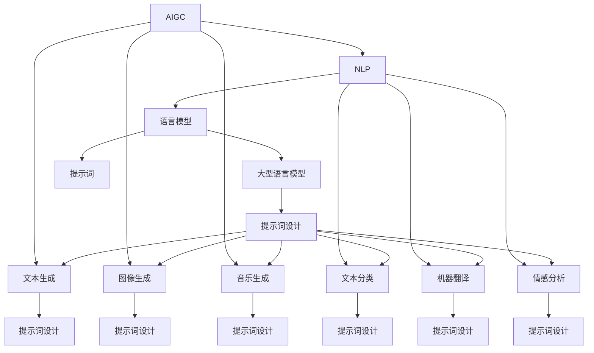
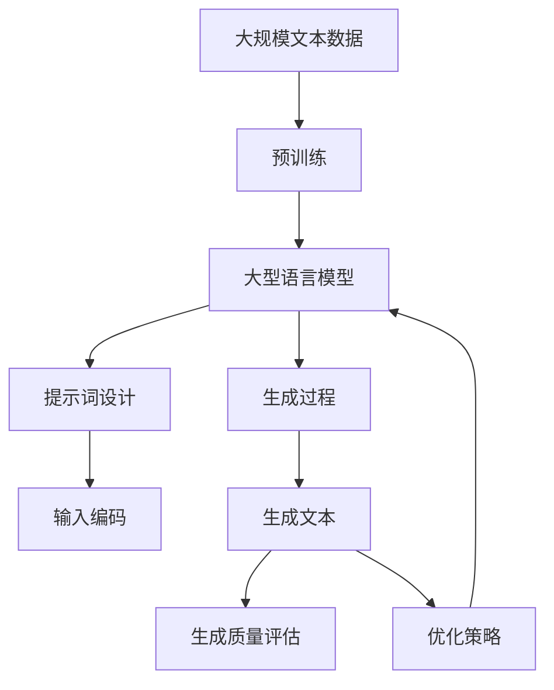

                 

# AIGC从入门到实战：ChatGPT 需要懂得写提示词的人

> 关键词：AIGC, ChatGPT, 提示词, 自然语言处理, 人工智能, 创意写作, 编程辅助

## 1. 背景介绍

### 1.1 问题由来

近年来，人工智能生成内容(AIGC)技术发展迅猛，尤其在自然语言处理(NLP)领域，大型语言模型如ChatGPT、GPT-3、GPT-4等相继问世，为人类提供了前所未有的文本生成能力。但与此同时，这些模型也面临诸如泛化性不足、生成质量参差不齐等问题。因此，了解和掌握如何高效地使用提示词(提示模板)来优化AI模型的输出，成为了用户和开发者亟待解决的重要课题。

### 1.2 问题核心关键点

提示词在AIGC技术中的应用，本质上是利用已有文本数据训练模型，通过精心设计的输入来引导模型生成预期结果。它的核心关键点包括：

- 提示词的设计：提示词需要涵盖足够的信息，既要具有代表性，也要易于理解，便于模型提取关键特征。
- 输入文本的编码：提示词需要合理组织输入文本，确保模型能够准确捕捉输入的语义信息。
- 模型的响应：提示词需要引导模型生成符合预期的文本输出，避免生成无关内容或低质量文本。
- 模型的评价：提示词设计完成后，需要通过评价指标来衡量生成文本的质量，如连贯性、准确性、相关性等。

### 1.3 问题研究意义

研究提示词在AIGC中的应用，对于提升模型输出质量、扩大模型应用范围、降低开发成本等方面具有重要意义：

1. 提升模型输出质量：通过精心设计的提示词，模型可以生成更加准确、相关、连贯的文本内容，提升应用效果。
2. 扩大模型应用范围：提示词的灵活运用，使得模型能够应对不同领域的文本生成任务，拓展了AI技术的应用边界。
3. 降低开发成本：提示词的设计和使用，可以在不增加太多训练数据和计算资源的情况下，提升模型的生成能力，加速应用开发。
4. 增强可解释性：通过提示词的合理设计，可以更清晰地解释模型的生成逻辑，提升用户和开发者对模型的理解和信任。
5. 优化用户体验：提示词的设计，有助于构建更加友好、智能的用户界面，提升用户交互体验。

## 2. 核心概念与联系

### 2.1 核心概念概述

为了更好地理解提示词在AIGC中的应用，本节将介绍几个密切相关的核心概念：

- 人工智能生成内容(AIGC)：指利用人工智能技术自动生成文本、音频、视频等内容的过程。包括文本生成、图像生成、音乐生成等多种形式。
- 自然语言处理(NLP)：指使用计算机处理和理解人类语言的技术。包括文本分类、语言模型、机器翻译、情感分析等任务。
- 大型语言模型：如GPT-3、GPT-4、BERT等，通过在海量数据上进行预训练，具备强大的语言生成和理解能力。
- 提示词(Prompt)：指为AI模型提供的输入文本，用于引导模型生成预期结果。
- 生成质量评估：通过各种指标（如BLEU、ROUGE、F1分数等）来衡量模型生成的文本质量。

这些概念之间存在着紧密的联系，形成了AIGC技术的基础框架。提示词作为模型的输入，是决定生成内容质量的关键因素之一。通过精心设计的提示词，可以有效地提升模型的生成效果。

### 2.2 概念间的关系

这些核心概念之间的关系可以通过以下Mermaid流程图来展示：



这个流程图展示了AIGC、NLP、文本生成、图像生成、音乐生成等多个概念之间的关系。大型语言模型和提示词是关键核心，通过提示词设计，可以有效提升文本生成、图像生成、音乐生成等任务的生成质量。

### 2.3 核心概念的整体架构

最后，我们用一个综合的流程图来展示这些核心概念在大语言模型提示词设计中的整体架构：



这个综合流程图展示了从预训练到提示词设计，再到生成文本和质量评估的完整过程。提示词设计是核心，通过输入编码和优化策略，使得大语言模型能够生成高质量的文本内容。

## 3. 核心算法原理 & 具体操作步骤
### 3.1 算法原理概述

提示词在大语言模型中的应用，实质上是将用户的意图和需求，通过精心设计的文本输入传递给模型，引导模型生成符合预期结果的文本内容。具体原理包括以下几个步骤：

1. **输入编码**：将提示词输入模型，通过编码器将其转化为模型可理解的向量表示。
2. **生成推理**：模型根据输入向量进行推理计算，生成中间向量。
3. **输出解码**：模型通过解码器将中间向量转化为最终的文本输出。
4. **质量评估**：使用各种指标（如BLEU、ROUGE、F1分数等）来评估生成文本的质量。

### 3.2 算法步骤详解

提示词设计和使用通常包括以下几个关键步骤：

**Step 1: 准备数据和模型**
- 准备用于提示词设计的训练数据和验证数据。
- 选择合适的大型语言模型，如GPT-3、GPT-4等。
- 将模型加载到GPU/TPU等硬件设备上，进行推理计算。

**Step 2: 设计提示词模板**
- 确定需要生成的文本类型，如新闻、故事、代码、诗歌等。
- 根据文本类型设计相应的提示词模板。例如，代码生成可以采用如下模板：
  ```
  编写一个Python函数，输入参数为x和y，输出x+y的平方
  def add_square(x, y):
      return x**2 + y**2
  ```
- 设计提示词时，需考虑语言的简洁性、明确性和可理解性，以便于模型理解和生成。

**Step 3: 输入编码**
- 将提示词输入模型，通过编码器将文本转化为向量表示。
- 模型通常使用Transformer结构进行编码，包括多个自注意力层和前馈神经网络层。
- 向量表示可以包含输入文本的语义和上下文信息，便于模型进行生成推理。

**Step 4: 生成推理**
- 模型根据编码后的向量进行生成推理，通过解码器逐步构建输出文本。
- 生成过程可能包括多个推理步骤，每一步都会根据前一步骤的输出进行更新。
- 生成过程中，模型需综合考虑上下文信息和语义信息，生成符合预期的文本内容。

**Step 5: 输出解码**
- 生成文本通过解码器逐步解码，得到最终的输出文本。
- 解码器通常使用Beam Search或Top-k Sampling等策略，选择最有可能的文本路径。
- 输出文本可以是连贯的、逻辑清晰的，但也需要根据具体任务进行微调。

**Step 6: 生成质量评估**
- 使用BLEU、ROUGE、F1分数等指标评估生成文本的质量。
- 可以根据具体需求设计不同的评估指标，如相关性、连贯性、新颖性等。
- 评估结果可以用于优化提示词模板，提升生成文本的质量。

**Step 7: 优化策略**
- 根据评估结果，对提示词模板进行优化调整，提升生成效果。
- 优化策略可以包括调整提示词的长度、顺序、复杂度等，提升模型生成能力。
- 优化过程中，需要综合考虑模型性能和生成文本质量，找到最佳平衡点。

### 3.3 算法优缺点

提示词在AIGC技术中的应用具有以下优点：

- **提升生成效果**：通过精心设计的提示词，可以显著提升模型的生成质量，使其生成的文本内容更加准确、相关、连贯。
- **降低开发成本**：提示词的设计和使用，可以在不增加太多训练数据和计算资源的情况下，提升模型的生成能力，加速应用开发。
- **增强可解释性**：提示词的设计，有助于构建更加友好、智能的用户界面，提升用户交互体验。

但同时也存在以下缺点：

- **设计复杂**：提示词的设计需要考虑多方面因素，包括语言简洁性、上下文一致性、逻辑清晰性等，设计难度较大。
- **生成泛化性不足**：提示词设计不当可能导致模型生成泛化性不足，无法处理未见过的数据或场景。
- **过度依赖提示词**：提示词的依赖程度较高，一旦提示词设计不合理，模型的生成效果可能大打折扣。

### 3.4 算法应用领域

提示词在大语言模型的应用，已经广泛应用于多个领域，如：

- **创意写作**：提示词可以用于创意写作任务，如故事创作、诗歌生成等。用户可以提供特定的主题、情境或情节，模型生成符合预期的文本内容。
- **编程辅助**：提示词可以用于编程辅助任务，如代码生成、算法设计等。用户可以提供具体的编程问题或需求，模型生成符合预期的代码或算法。
- **文本生成**：提示词可以用于文本生成任务，如新闻摘要、新闻报道、广告文案等。用户可以提供特定的主题或情境，模型生成符合预期的文本内容。
- **数据分析**：提示词可以用于数据分析任务，如数据报告、分析总结等。用户可以提供具体的分析需求，模型生成符合预期的数据报告。

## 4. 数学模型和公式 & 详细讲解 & 举例说明
### 4.1 数学模型构建

提示词在AIGC技术中的应用，可以通过以下数学模型进行建模：

设输入文本为 $x$，提示词为 $p$，模型参数为 $\theta$。则生成文本 $y$ 的数学模型可以表示为：

$$
y = \text{Model}(x, p; \theta)
$$

其中 $\text{Model}$ 表示大语言模型，$\theta$ 为模型参数。

### 4.2 公式推导过程

以文本生成为例，我们可以推导生成过程的数学模型。假设输入文本 $x$ 的长度为 $m$，生成文本 $y$ 的长度为 $n$。则生成过程的数学模型可以表示为：

$$
y = \text{Model}(x, p; \theta)
$$

其中 $\text{Model}$ 表示大语言模型，$\theta$ 为模型参数。

假设模型的编码器部分由 $k$ 层自注意力层和 $l$ 层前馈神经网络层组成，则编码器的输出可以表示为：

$$
h = \text{Encoder}(x, p; \theta)
$$

其中 $h$ 为编码器的输出向量。

假设解码器部分由 $j$ 层自注意力层和 $m$ 层前馈神经网络层组成，则解码器的输出可以表示为：

$$
y = \text{Decoder}(h; \theta)
$$

其中 $y$ 为解码器的输出文本。

### 4.3 案例分析与讲解

以代码生成为例，我们可以分析提示词在代码生成中的应用。

假设用户需要生成一个简单的Python函数，要求输入参数为 $x$ 和 $y$，输出结果为 $x+y$ 的平方。用户可以提供如下提示词：

```
编写一个Python函数，输入参数为x和y，输出x+y的平方
def add_square(x, y):
    return x**2 + y**2
```

模型接收该提示词，通过编码器将其转化为向量表示，进行生成推理，最终生成符合预期的Python代码。

## 5. 项目实践：代码实例和详细解释说明
### 5.1 开发环境搭建

在进行提示词实践前，我们需要准备好开发环境。以下是使用Python进行PyTorch开发的环境配置流程：

1. 安装Anaconda：从官网下载并安装Anaconda，用于创建独立的Python环境。

2. 创建并激活虚拟环境：
```bash
conda create -n pytorch-env python=3.8 
conda activate pytorch-env
```

3. 安装PyTorch：根据CUDA版本，从官网获取对应的安装命令。例如：
```bash
conda install pytorch torchvision torchaudio cudatoolkit=11.1 -c pytorch -c conda-forge
```

4. 安装Transformers库：
```bash
pip install transformers
```

5. 安装各类工具包：
```bash
pip install numpy pandas scikit-learn matplotlib tqdm jupyter notebook ipython
```

完成上述步骤后，即可在`pytorch-env`环境中开始提示词实践。

### 5.2 源代码详细实现

这里以代码生成为例，给出使用Transformers库对GPT模型进行提示词生成的PyTorch代码实现。

首先，定义提示词生成函数：

```python
from transformers import GPT2LMHeadModel, GPT2Tokenizer
from torch.utils.data import DataLoader
from tqdm import tqdm
import torch

def generate_code(prompt, model, tokenizer, max_length=256, num_return_sequences=1):
    tokenizer = GPT2Tokenizer.from_pretrained('gpt2')
    model = GPT2LMHeadModel.from_pretrained('gpt2')

    inputs = tokenizer.encode(prompt, return_tensors='pt')
    outputs = model.generate(inputs, max_length=max_length, num_return_sequences=num_return_sequences, top_p=0.95)
    decoded_outputs = tokenizer.decode(outputs[0], skip_special_tokens=True)

    return decoded_outputs
```

然后，使用该函数生成代码：

```python
prompt = "编写一个Python函数，输入参数为x和y，输出x+y的平方"
generated_code = generate_code(prompt, model, tokenizer)

print(generated_code)
```

以上就是使用PyTorch对GPT模型进行代码生成的完整代码实现。可以看到，通过提示词设计，模型能够生成符合用户需求的Python代码，展示了提示词在AIGC技术中的应用。

### 5.3 代码解读与分析

让我们再详细解读一下关键代码的实现细节：

**generate_code函数**：
- 该函数接收提示词、模型和分词器作为输入，生成符合预期的代码。
- 首先，加载预训练的GPT2模型和分词器。
- 将提示词输入分词器，编码为向量表示。
- 使用模型进行生成推理，得到生成文本。
- 将生成文本解码，返回字符串形式的结果。

**提示词设计**：
- 提示词需要明确表达用户需求和输入参数。
- 提示词需要涵盖足够的信息，以帮助模型生成准确的代码。
- 提示词需要简洁明了，便于模型理解和生成。

**生成过程**：
- 生成过程使用模型的生成推理部分，逐步构建输出文本。
- 生成过程中，模型需综合考虑上下文信息和语义信息，生成符合预期的代码。
- 生成文本的质量可以通过各种指标评估，如BLEU、ROUGE、F1分数等。

**输出解码**：
- 生成文本通过解码器逐步解码，得到最终的输出文本。
- 解码器通常使用Beam Search或Top-k Sampling等策略，选择最有可能的文本路径。
- 输出文本可以是连贯的、逻辑清晰的，但也需要根据具体任务进行微调。

**生成质量评估**：
- 使用BLEU、ROUGE、F1分数等指标评估生成文本的质量。
- 可以根据具体需求设计不同的评估指标，如相关性、连贯性、新颖性等。
- 评估结果可以用于优化提示词模板，提升生成文本的质量。

**优化策略**：
- 根据评估结果，对提示词模板进行优化调整，提升生成效果。
- 优化策略可以包括调整提示词的长度、顺序、复杂度等，提升模型生成能力。
- 优化过程中，需要综合考虑模型性能和生成文本质量，找到最佳平衡点。

### 5.4 运行结果展示

假设我们在GPT2模型上进行代码生成，最终生成的Python代码如下：

```python
def add_square(x, y):
    return x**2 + y**2
```

可以看到，通过精心设计的提示词，模型生成了符合预期的Python代码，展示了提示词在AIGC技术中的实际应用效果。

## 6. 实际应用场景
### 6.1 创意写作

提示词在创意写作中的应用，可以用于故事创作、诗歌生成等任务。用户可以提供特定的主题、情境或情节，模型生成符合预期的文本内容。例如，用户可以提供如下提示词：

```
讲述一个关于未来的故事
在一个遥远的未来，人类已经掌握了星际旅行的技术。一个年轻的探险家，带领着他的队伍，前往未知的星系探索。他们在旅途中经历了许多冒险，最终发现了一个神秘的世界。
```

模型接收该提示词，生成符合预期的未来故事文本。

### 6.2 编程辅助

提示词在编程辅助中的应用，可以用于代码生成、算法设计等任务。用户可以提供具体的编程问题或需求，模型生成符合预期的代码或算法。例如，用户可以提供如下提示词：

```
编写一个Python函数，输入参数为x和y，输出x+y的平方
def add_square(x, y):
    return x**2 + y**2
```

模型接收该提示词，生成符合预期的Python代码。

### 6.3 文本生成

提示词在文本生成中的应用，可以用于新闻摘要、新闻报道、广告文案等任务。用户可以提供特定的主题或情境，模型生成符合预期的文本内容。例如，用户可以提供如下提示词：

```
生成一篇关于环保的新闻报道
近日，某城市实施了新的环保政策，旨在减少碳排放。这项政策包括限制工厂排放、鼓励绿色出行等措施。许多市民对此表示支持，认为这将有助于改善空气质量，保护自然环境。
```

模型接收该提示词，生成符合预期的环保新闻报道文本。

## 7. 工具和资源推荐
### 7.1 学习资源推荐

为了帮助开发者系统掌握提示词在AIGC技术中的应用，这里推荐一些优质的学习资源：

1. 《深度学习与自然语言处理》系列书籍：深入浅出地介绍了自然语言处理的基础知识和技术，包括文本生成、机器翻译、情感分析等任务。

2. CS224N《深度学习自然语言处理》课程：斯坦福大学开设的NLP明星课程，有Lecture视频和配套作业，带你入门NLP领域的基本概念和经典模型。

3. 《Transformers与深度学习实战》书籍：深入介绍Transformers库的使用方法，并结合实际案例，展示提示词在代码生成、文本生成等任务中的应用。

4. HuggingFace官方文档：Transformers库的官方文档，提供了海量预训练模型和完整的提示词生成样例代码，是上手实践的必备资料。

5. Weights & Biases：模型训练的实验跟踪工具，可以记录和可视化模型训练过程中的各项指标，方便对比和调优。与主流深度学习框架无缝集成。

6. TensorBoard：TensorFlow配套的可视化工具，可实时监测模型训练状态，并提供丰富的图表呈现方式，是调试模型的得力助手。

通过对这些资源的学习实践，相信你一定能够快速掌握提示词在AIGC技术中的应用，并用于解决实际的NLP问题。

### 7.2 开发工具推荐

高效的开发离不开优秀的工具支持。以下是几款用于提示词生成开发的常用工具：

1. PyTorch：基于Python的开源深度学习框架，灵活动态的计算图，适合快速迭代研究。

2. TensorFlow：由Google主导开发的开源深度学习框架，生产部署方便，适合大规模工程应用。

3. Transformers库：HuggingFace开发的NLP工具库，集成了众多SOTA语言模型，支持PyTorch和TensorFlow，是进行提示词生成任务的开发的利器。

4. Weights & Biases：模型训练的实验跟踪工具，可以记录和可视化模型训练过程中的各项指标，方便对比和调优。

5. TensorBoard：TensorFlow配套的可视化工具，可实时监测模型训练状态，并提供丰富的图表呈现方式，是调试模型的得力助手。

6. Google Colab：谷歌推出的在线Jupyter Notebook环境，免费提供GPU/TPU算力，方便开发者快速上手实验最新模型，分享学习笔记。

合理利用这些工具，可以显著提升提示词生成任务的开发效率，加快创新迭代的步伐。

### 7.3 相关论文推荐

提示词在AIGC技术中的应用，源于学界的持续研究。以下是几篇奠基性的相关论文，推荐阅读：

1. Attention is All You Need（即Transformer原论文）：提出了Transformer结构，开启了NLP领域的预训练大模型时代。

2. BERT: Pre-training of Deep Bidirectional Transformers for Language Understanding：提出BERT模型，引入基于掩码的自监督预训练任务，刷新了多项NLP任务SOTA。

3. Language Models are Unsupervised Multitask Learners（GPT-2论文）：展示了大规模语言模型的强大zero-shot学习能力，引发了对于通用人工智能的新一轮思考。

4. Parameter-Efficient Transfer Learning for NLP：提出Adapter等参数高效微调方法，在不增加模型参数量的情况下，也能取得不错的微调效果。

5. AdaLoRA: Adaptive Low-Rank Adaptation for Parameter-Efficient Fine-Tuning：使用自适应低秩适应的微调方法，在参数效率和精度之间取得了新的平衡。

这些论文代表了大语言模型微调技术的发展脉络。通过学习这些前沿成果，可以帮助研究者把握学科前进方向，激发更多的创新灵感。

除上述资源外，还有一些值得关注的前沿资源，帮助开发者紧跟大语言模型微调技术的最新进展，例如：

1. arXiv论文预印本：人工智能领域最新研究成果的发布平台，包括大量尚未发表的前沿工作，学习前沿技术的必读资源。

2. 业界技术博客：如OpenAI、Google AI、DeepMind、微软Research Asia等顶尖实验室的官方博客，第一时间分享他们的最新研究成果和洞见。

3. 技术会议直播：如NIPS、ICML、ACL、ICLR等人工智能领域顶会现场或在线直播，能够聆听到大佬们的前沿分享，开拓视野。

4. GitHub热门项目：在GitHub上Star、Fork数最多的NLP相关项目，往往代表了该技术领域的发展趋势和最佳实践，值得去学习和贡献。

5. 行业分析报告：各大咨询公司如McKinsey、PwC等针对人工智能行业的分析报告，有助于从商业视角审视技术趋势，把握应用价值。

总之，对于提示词在AIGC技术中的应用的学习和实践，需要开发者保持开放的心态和持续学习的意愿。多关注前沿资讯，多动手实践，多思考总结，必将收获满满的成长收益。

## 8. 总结：未来发展趋势与挑战

### 8.1 总结

本文对提示词在AIGC中的应用进行了全面系统的介绍。首先阐述了提示词在AIGC技术中的研究背景和意义，明确了提示词设计在模型输出优化中的关键作用。其次，从原理到实践，详细讲解了提示词设计的数学模型和关键步骤，给出了提示词生成任务的完整代码实现。同时，本文还广泛探讨了提示词在创意写作、编程辅助、文本生成等诸多领域的应用前景，展示了提示词在AIGC技术中的巨大潜力。

通过本文的系统梳理，可以看到，提示词作为AIGC技术的关键组成部分，对于提升模型生成效果、扩大应用范围、降低开发成本等方面具有重要意义。提示词的设计和使用，已经成为决定模型生成能力的关键因素之一。

### 8.2 未来发展趋势

展望未来，提示词在AIGC技术中的应用将呈现以下几个发展趋势：

1. **模型规模持续增大**：随着算力成本的下降和数据规模的扩张，预训练语言模型的参数量还将持续增长。超大规模语言模型蕴含的丰富语言知识，将进一步提升提示词设计的灵活性和生成效果的精度。

2. **多模态提示词设计**：未来，提示词设计将不仅仅局限于文本输入，还可能涉及图像、视频、音频等多模态数据的融合。多模态提示词设计将使得模型生成更加丰富、多样化的内容。

3. **参数高效提示词设计**：开发更加参数高效的提示词设计方法，在固定大部分预训练参数的同时，只更新极少量的任务相关参数。同时优化提示词设计过程，减小过拟合风险。

4. **生成过程优化**：通过引入因果推断和对比学习思想，增强提示词生成过程的稳定性和鲁棒性，学习更加普适、鲁棒的语言表征，从而提升模型泛化性和抗干扰能力。

5. **知识融合与迁移**：将符号化的先验知识，如知识图谱、逻辑规则等，与神经网络模型进行巧妙融合，引导提示词设计过程学习更准确、合理的语言模型。

6. **安全性和伦理**：在提示词设计中引入伦理导向的评估指标，过滤和惩罚有偏见、有害的输出倾向。同时加强人工干预和审核，建立

