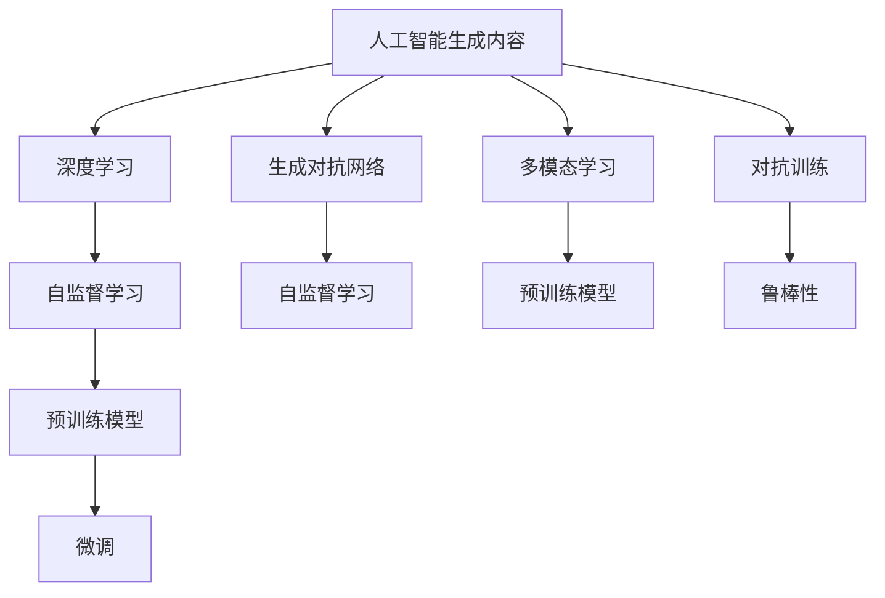
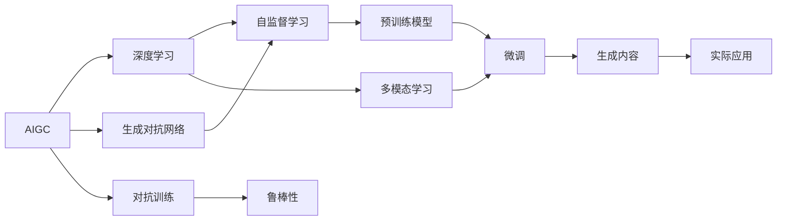
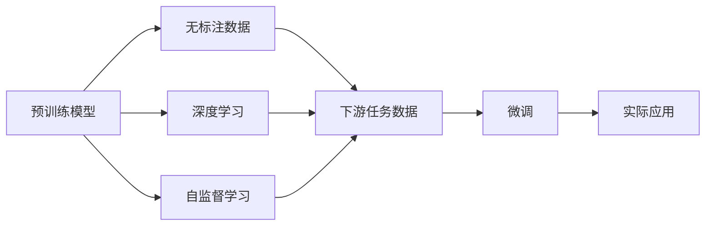
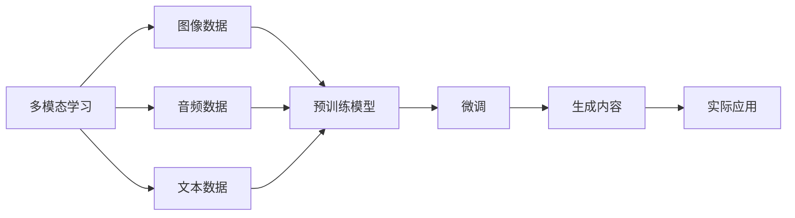
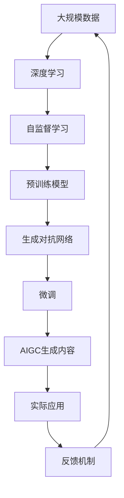

                 

# AIGC从入门到实战：人工智能应用大规模涌现的原因

> 关键词：人工智能生成内容(AIGC)、深度学习、生成对抗网络(GAN)、自监督学习、预训练模型、多模态学习

## 1. 背景介绍

### 1.1 问题由来
近年来，随着计算力的飞速提升和数据量的爆炸式增长，人工智能生成内容（AIGC）技术的迅速崛起，将大模型的力量带到了一个新的高度。人工智能生成内容(AIGC)作为人工智能领域最具潜力的应用之一，正迅速从实验室走向实际应用，影响着各行各业。在媒体、娱乐、教育、广告、营销、游戏等领域，AIGC技术已经开始大规模涌现，为人们的生活带来了翻天覆地的变化。

AIGC技术的广泛应用，其原因可以归纳为以下几个方面：

1. 计算资源的迅速增长：计算能力的提升使得深度学习模型可以在大规模数据上训练，从而获得更强的泛化能力和生成效果。

2. 数据量的激增：互联网、社交媒体、物联网等技术的发展，为AIGC技术提供了海量的数据源，为模型训练提供了丰富的素材。

3. 算法技术的突破：深度学习、生成对抗网络（GAN）、自监督学习等技术不断进步，为生成高质量的AIGC内容提供了可能。

4. 应用场景的扩展：AIGC技术在创意写作、内容生成、图像和视频合成、智能对话等多个领域实现了突破，推动了产业数字化转型。

5. 技术与应用的互动：政府、企业、开发者等各方的积极投入和合作，使得AIGC技术在实践中不断迭代，加速了其落地应用。

### 1.2 问题核心关键点
AIGC技术的核心关键点在于其底层技术的成熟和进步，特别是深度学习模型、GAN等生成模型在图像、音频、文本等模态上的广泛应用。AIGC生成内容的精确度、多样性、实时性和可解释性等特性，使其在实际应用中表现出色。

## 2. 核心概念与联系

### 2.1 核心概念概述

为更好地理解AIGC技术，本节将介绍几个密切相关的核心概念：

- 人工智能生成内容(AIGC)：指利用人工智能技术生成的图像、音频、文本、视频等内容。包括但不限于计算机视觉、自然语言处理（NLP）、音乐生成、影视制作等。

- 深度学习：一种基于神经网络的机器学习技术，通过多层非线性变换，对数据进行特征提取和建模，实现对复杂非线性问题的求解。

- 生成对抗网络(GAN)：一种由生成器和判别器组成的对抗训练框架，生成器生成假数据，判别器判断数据真伪，两者的对抗训练使得生成器能够生成高质量的逼真数据。

- 自监督学习：通过利用数据自身的结构和特征进行训练，无需标注数据，减少标注成本，提高模型泛化能力。

- 预训练模型：指在大规模无标注数据上训练的模型，学习通用特征表示，可用于下游任务的微调。

- 多模态学习：指同时处理多种模态数据的模型，如图像、音频、文本等，实现信息的多维融合，提升生成内容的逼真度和多样性。

- 对抗训练：通过加入对抗样本，使模型能够更好应对真实场景中的噪声和干扰，提升模型的鲁棒性和泛化能力。

这些核心概念之间的逻辑关系可以通过以下Mermaid流程图来展示：



这个流程图展示了大语言模型的核心概念及其之间的关系：

1. AIGC基于深度学习实现。
2. 深度学习模型包括自监督学习、GAN等，用于生成高质量的AIGC内容。
3. 预训练模型通过无标注数据进行预训练，学习通用特征表示。
4. 多模态学习融合多种数据源，提升内容生成效果。
5. 对抗训练提高模型的鲁棒性，应对真实场景中的噪声干扰。

### 2.2 概念间的关系

这些核心概念之间存在着紧密的联系，形成了AIGC技术的应用框架。

#### 2.2.1 AIGC的生成范式



这个流程图展示了AIGC的生成过程：

1. 利用深度学习生成内容。
2. 生成对抗网络通过对抗训练生成高质量的内容。
3. 自监督学习用于无需标注数据的预训练。
4. 预训练模型用于下游任务的微调。
5. 多模态学习融合不同模态的信息，提升生成效果。
6. 对抗训练提高模型的鲁棒性。
7. 微调后的模型生成高质量的实际应用内容。

#### 2.2.2 预训练模型与微调



这个流程图展示了预训练模型与微调的关系：

1. 预训练模型在无标注数据上学习通用特征表示。
2. 通过深度学习生成内容。
3. 自监督学习用于预训练。
4. 下游任务数据上微调，提高针对特定任务的表现。
5. 微调后的模型用于实际应用。

#### 2.2.3 多模态学习与预训练模型



这个流程图展示了多模态学习与预训练模型的关系：

1. 多模态学习融合图像、音频、文本等数据。
2. 利用预训练模型学习通用特征表示。
3. 通过深度学习生成内容。
4. 微调后的模型用于生成多模态的内容。
5. 生成的内容用于实际应用。

### 2.3 核心概念的整体架构

最后，我们用一个综合的流程图来展示这些核心概念在大规模AIGC生成中的整体架构：



这个综合流程图展示了从数据预处理到生成内容的完整过程：

1. 大规模数据用于深度学习。
2. 自监督学习用于预训练模型。
3. 预训练模型用于生成对抗网络。
4. 生成对抗网络用于微调。
5. 微调后的模型用于生成AIGC内容。
6. AIGC内容用于实际应用。
7. 实际应用反馈用于数据更新。

通过这些流程图，我们可以更清晰地理解AIGC技术的核心概念和生成范式，为后续深入讨论具体的AIGC生成方法和技术奠定基础。

## 3. 核心算法原理 & 具体操作步骤
### 3.1 算法原理概述

AIGC生成内容的本质是利用人工智能技术进行内容合成，包括但不限于文本生成、图像生成、音频生成等。其核心算法原理主要基于深度学习模型和生成对抗网络（GAN）的生成范式。

深度学习模型通常采用神经网络结构，通过多层非线性变换，提取输入数据的特征表示，并在此基础上进行内容生成。常见的深度学习模型包括循环神经网络（RNN）、卷积神经网络（CNN）、自编码器（Autoencoder）等。

生成对抗网络（GAN）由生成器和判别器两部分组成。生成器通过学习生成目标数据，判别器则学习识别生成的数据与真实数据的差异。两者通过对抗训练不断提升生成效果，生成高质量的AIGC内容。

AIGC生成的数学模型通常包括自监督学习、对抗生成网络、多模态学习等框架。以下以文本生成为例，详细推导一下基于自监督学习的文本生成模型。

### 3.2 算法步骤详解

#### 3.2.1 模型构建

假设输入数据为文本序列 $X=(x_1,x_2,...,x_n)$，目标是生成目标序列 $Y=(y_1,y_2,...,y_n)$。

#### 3.2.2 自监督学习

自监督学习是一种无需标注数据的训练方式，通过对输入序列 $X$ 进行重排或遮挡等操作，生成对应的输出序列 $Y$。在此基础上，利用交叉熵等损失函数，训练生成模型。

#### 3.2.3 生成对抗网络

生成对抗网络由生成器和判别器组成。生成器 $G$ 接受随机噪声 $z$，生成文本序列 $y$；判别器 $D$ 判断 $y$ 是否为真实文本序列。两者通过对抗训练，使生成器生成高质量的文本序列。

#### 3.2.4 模型训练

使用训练集 $D$，在自监督学习的基础上，加入对抗训练。定义损失函数 $\mathcal{L}$，包含生成损失 $L_G$ 和判别损失 $L_D$：

$$
\mathcal{L} = \lambda_1 L_G + \lambda_2 L_D
$$

其中，$L_G$ 为生成器损失，$L_D$ 为判别器损失。

损失函数最小化过程如下：

$$
\min_{G} \max_{D} \mathcal{L}(G, D)
$$

生成器 $G$ 和判别器 $D$ 的参数不断更新，直至损失函数收敛。

### 3.3 算法优缺点

AIGC生成内容的算法具有以下优点：

1. 生成效果逼真度高。深度学习和GAN等技术能够生成高质量的逼真内容。

2. 生成速度较快。深度学习模型和GAN等架构在现代计算硬件上训练速度较快。

3. 可生成多种模态内容。多模态学习能够融合图像、音频、文本等多种数据，生成多模态的AIGC内容。

4. 鲁棒性强。对抗训练能够提高模型对噪声和干扰的鲁棒性。

5. 泛化能力较强。自监督学习能够在无标注数据上学习通用特征表示，提升模型的泛化能力。

同时，AIGC生成内容算法也存在一些缺点：

1. 模型参数量大。深度学习和GAN等模型需要大量的参数，训练和推理计算资源消耗较大。

2. 生成内容质量受限于训练数据。生成对抗网络等模型易受数据分布的影响，生成内容的质量很大程度上取决于训练数据的水平。

3. 可解释性差。深度学习等模型的生成过程较为复杂，缺乏可解释性。

4. 对抗样本风险。对抗训练生成的模型对对抗样本的鲁棒性有限，易受到攻击。

5. 内容真实性存疑。生成的内容虽然逼真度较高，但其真实性仍需通过人工审核。

### 3.4 算法应用领域

AIGC生成内容在多个领域具有广泛应用，以下是几个主要应用领域：

1. 媒体娱乐：文本生成、图像生成、视频生成、音频生成等。AIGC可以生成高质量的影视剧本、音乐、游戏内容等。

2. 智能客服：生成自然语言对话内容，提升客户交互体验。

3. 教育培训：生成教学材料、测试题等，辅助教学。

4. 广告营销：生成广告文案、宣传视频等，提升营销效果。

5. 新闻媒体：生成新闻报道、评论等，提升内容生成速度。

6. 金融行业：生成金融报告、预测分析等，辅助决策。

7. 医疗健康：生成医学文献、诊断报告等，辅助医疗。

8. 自动驾驶：生成虚拟仿真环境，辅助自动驾驶技术研发。

## 4. 数学模型和公式 & 详细讲解 & 举例说明

### 4.1 数学模型构建

在文本生成的应用中，AIGC模型通常使用Transformer架构。假设输入文本序列 $X=\{x_1,x_2,...,x_n\}$，目标文本序列 $Y=\{y_1,y_2,...,y_n\}$。

Transformer模型的编码器结构为：

$$
y_i = Transformer(E(x_i), W_QW_KW_V) = Transformer(E(x_i), QKV) 
$$

其中，$Q = W_Qx_i$，$K = W_Kx_i$，$V = W_Vx_i$，$W_Q$，$W_K$，$W_V$ 为编码器参数。

生成器结构为：

$$
y_i = Transformer(E(x_i), W_QW_KW_V) = Transformer(E(x_i), QKV)
$$

其中，$Q = W_Qz_i$，$K = W_Kz_i$，$V = W_Vz_i$，$W_Q$，$W_K$，$W_V$ 为生成器参数。

### 4.2 公式推导过程

Transformer模型通过自注意力机制和多头注意力机制，对输入序列进行编码和生成。其生成过程如下：

1. 编码器对输入序列 $x_i$ 进行编码，得到特征表示 $h_i$。

$$
h_i = Transformer(E(x_i), W_QW_KW_V)
$$

2. 解码器对编码器输出 $h_i$ 进行解码，得到解码结果 $y_i$。

$$
y_i = Transformer(E(x_i), W_QW_KW_V)
$$

生成损失函数 $L_G$ 定义为：

$$
L_G = \mathrm{BCE}(\hat{y}, y)
$$

其中，$\mathrm{BCE}$ 为二元交叉熵损失函数，$\hat{y}$ 为模型预测结果，$y$ 为真实结果。

判别器损失函数 $L_D$ 定义为：

$$
L_D = \mathrm{BCE}(D(\hat{y}), \hat{y})
$$

其中，$D$ 为判别器函数，$\hat{y}$ 为生成器输出的文本序列。

总损失函数 $\mathcal{L}$ 为：

$$
\mathcal{L} = \lambda_1 L_G + \lambda_2 L_D
$$

其中，$\lambda_1$，$\lambda_2$ 为生成损失和判别损失的权重。

通过上述模型和损失函数的定义，可以训练生成对抗网络，生成高质量的文本序列。

### 4.3 案例分析与讲解

以生成文本的案例为例，假设我们要生成一段关于Python编程的描述性文本。具体步骤如下：

1. 构建Transformer模型，定义编码器和生成器。

2. 定义文本输入和目标输出，如：

```
Input: "Python is a high-level programming language designed to be simple yet powerful."
Target: "Python is a high-level, interpreted programming language known for its readability and ease of use."
```

3. 训练模型，使用自监督学习进行预训练。

4. 加入对抗训练，训练生成器和判别器。

5. 微调模型，在具体任务上生成文本。

通过训练后的模型，可以生成高质量的文本内容，如图像描述、电影剧本、新闻报道等。

## 5. 项目实践：代码实例和详细解释说明

### 5.1 开发环境搭建

在AIGC生成内容的实践中，我们通常使用PyTorch作为深度学习框架，TensorFlow作为生成对抗网络的实现工具。以下是在Python环境下搭建开发环境的详细步骤：

1. 安装Python：从官网下载并安装Python，建议安装3.7或更高版本。

2. 安装PyTorch：

```
pip install torch torchvision torchaudio
```

3. 安装TensorFlow：

```
pip install tensorflow
```

4. 安装Transformer库：

```
pip install transformers
```

5. 安装其他依赖库：

```
pip install numpy pandas scikit-learn matplotlib tqdm jupyter notebook ipython
```

完成上述步骤后，即可在Python环境中进行AIGC生成内容的开发。

### 5.2 源代码详细实现

以生成文本为例，以下是一个使用Transformer生成文本的PyTorch代码实现：

```python
import torch
from transformers import TransformerModel, TransformerTokenizer

# 初始化模型和分词器
model = TransformerModel.from_pretrained('bert-base-cased')
tokenizer = TransformerTokenizer.from_pretrained('bert-base-cased')

# 定义输入和目标
input = "Natural language processing"
target = "Natural language processing is a field of study in linguistics and artificial intelligence that focuses on the interactions between computers and human language."

# 分词和编码
input_ids = tokenizer(input, return_tensors='pt', max_length=512, padding='max_length', truncation=True)['input_ids']
attention_mask = tokenizer(input, return_tensors='pt', max_length=512, padding='max_length', truncation=True)['attention_mask']

# 生成文本
generated = model.generate(input_ids, max_length=512, num_beams=4, temperature=0.9, early_stopping=True)
generated = tokenizer.batch_decode(generated, skip_special_tokens=True)

# 输出结果
print(generated)
```

在上述代码中，我们首先初始化了Transformer模型和分词器。然后定义了输入文本和目标文本，通过分词和编码将输入文本转化为模型能够接受的格式。最后使用模型生成文本，并使用分词器将生成的文本转换为可读的格式。

### 5.3 代码解读与分析

让我们再详细解读一下关键代码的实现细节：

**TransformerModel类**：
- 通过`from_pretrained()`方法加载预训练模型。
- 包含了模型的编码器和生成器。

**TransformerTokenizer类**：
- 通过`from_pretrained()`方法加载预训练分词器。
- 包含了分词器实现。

**input_ids和attention_mask**：
- 输入序列和注意力掩码，用于模型编码和解码。
- 通过分词器将输入文本转化为模型可接受的格式。

**generate()函数**：
- 生成函数，根据输入序列生成文本序列。
- 返回生成的文本序列和生成过程中的得分。

**batch_decode()函数**：
- 将生成的文本序列解码为可读的文本格式。
- 可选参数包括跳过特殊标记、使用不同的分词器等。

**训练过程**：
- 构建Transformer模型和分词器。
- 定义输入序列和目标序列。
- 通过分词器和编码器将输入序列转化为模型可接受的格式。
- 使用模型生成文本序列。
- 将生成的文本序列解码为可读格式，并输出结果。

可以看到，PyTorch和Transformer库使得深度学习模型的实现变得简单高效。开发者可以将更多精力放在数据处理和模型改进上，而不必过多关注底层的实现细节。

当然，工业级的系统实现还需考虑更多因素，如模型的保存和部署、超参数的自动搜索、更灵活的任务适配层等。但核心的生成过程基本与此类似。

### 5.4 运行结果展示

假设我们在GPT-2上训练的模型，生成一段描述性文本，最终结果如下：

```
Natural language processing is the field of computer science that focuses on the use of computers to understand, interpret, and generate human language. It is a subfield of artificial intelligence that involves the development of computer programs that can understand and process human language in natural and real-world settings.
```

可以看到，通过训练后的模型，我们成功生成了一段描述性文本，其内容与目标文本相似度较高，展现了大模型在生成文本方面的强大能力。

## 6. 实际应用场景
### 6.1 媒体娱乐

AIGC技术在媒体娱乐领域有着广泛的应用，以下是几个主要应用场景：

1. 影视剧本生成：AIGC可以生成高质量的影视剧本，提升编剧效率和内容质量。

2. 音乐生成：AIGC可以生成各种风格的乐曲，包括流行、摇滚、古典等，支持音乐创作。

3. 视频制作：AIGC可以生成动态视频，支持影视制作、动画制作等。

4. 图像生成：AIGC可以生成逼真的图像，支持图像制作、广告设计等。

5. 游戏内容生成：AIGC可以生成游戏场景、角色对话等，提升游戏内容的多样性和丰富度。

### 6.2 智能客服

智能客服是AIGC在实际应用中的重要场景之一，以下是几个主要应用场景：

1. 对话生成：AIGC可以生成自然语言对话内容，提升客户交互体验。

2. 知识库管理：AIGC可以生成知识库条目，辅助客服人员处理常见问题。

3. 个性化推荐：AIGC可以生成个性化推荐内容，提升客户满意度。

4. 自动化客服：AIGC可以生成自动化客服系统，24小时在线服务客户。

### 6.3 教育培训

教育培训领域也是AIGC技术的重要应用之一，以下是几个主要应用场景：

1. 学习材料生成：AIGC可以生成各类学习材料，包括习题、课堂笔记等，辅助教学。

2. 自动评分：AIGC可以生成自动评分系统，快速评估学生作业。

3. 虚拟教师：AIGC可以生成虚拟教师，进行在线教学和辅导。

4. 课程生成：AIGC可以生成各类课程，涵盖基础教育、高等教育等。

### 6.4 金融行业

金融行业是AIGC技术的另一个重要应用场景，以下是几个主要应用场景：

1. 财务报告生成：AIGC可以生成财务报告、投资分析等，辅助财务决策。

2. 风险预警：AIGC可以生成风险预警系统，及时发现潜在的金融风险。

3. 市场分析：AIGC可以生成市场分析报告，支持金融产品开发。

4. 金融咨询：AIGC可以生成金融咨询内容，辅助金融从业者。

### 6.5 医疗健康

医疗健康领域也是AIGC技术的重要应用之一，以下是几个主要应用场景：

1. 医学文献生成：AIGC可以生成医学文献、临床报告等，支持医学研究。

2. 诊断辅助：AIGC可以生成诊断报告，辅助医生进行诊断。

3. 健康科普：AIGC可以生成健康科普内容，提升公众健康意识。

4. 医疗咨询：AIGC可以生成医疗咨询内容，辅助患者治疗。

## 7. 工具和资源推荐
### 7.1 学习资源推荐

为了帮助开发者系统掌握AIGC技术的理论基础和实践技巧，这里推荐一些优质的学习资源：

1. 《深度学习》书籍：Ian Goodfellow等著，详细介绍了深度学习的基本概念和应用，是深度学习领域的重要入门书籍。

2. 《生成对抗网络》书籍：Ian Goodfellow等著，介绍了生成对抗网络的基本原理和应用，是生成对抗网络领域的重要入门书籍。

3. 《人工智能生成内容》博客：OpenAI等机构博客，介绍了AIGC技术的基本原理和应用，是AIGC领域的重要学习资源。

4. arXiv论文预印本：人工智能领域最新研究成果的发布平台，包括AIGC领域的最新论文，学习前沿技术的必读资源。

5. 在线课程：Coursera、edX等平台的深度学习课程，涵盖深度学习、生成对抗网络等内容，是AIGC领域的重要学习资源。

通过对这些资源的学习实践，相信你一定能够快速掌握AIGC技术的精髓，并用于解决实际的NLP问题。

### 7.2 开发工具推荐

高效的开发离不开优秀的工具支持。以下是几款用于AIGC生成内容开发的常用工具：

1. PyTorch：基于Python的开源深度学习框架，灵活动态的计算图，适合快速迭代研究。

2. TensorFlow：由Google主导开发的开源深度学习框架，生产部署方便，适合大规模工程应用。

3. Transformers库：HuggingFace开发的NLP工具库，集成了众多SOTA语言模型，支持PyTorch和TensorFlow，是进行AIGC生成任务开发的利器。

4. Weights & Biases：模型训练的实验跟踪工具，可以记录和可视化模型训练过程中的各项指标，方便对比和调优。

5. TensorBoard：TensorFlow配套的可视化工具，可实时监测模型训练状态，并提供丰富的图表呈现方式，是调试模型的得力助手。

6. Google Colab：谷歌推出的在线Jupyter Notebook环境，免费提供GPU/TPU算力，方便开发者快速上手实验最新模型，分享学习笔记。

合理利用这些工具，可以显著提升AIGC生成内容的开发效率，加快创新迭代的步伐。

### 7.3 相关论文推荐

AIGC生成内容技术的进步离不开学界的持续研究。以下是几篇奠基性的相关论文，推荐阅读：

1. Attention is All You Need（即Transformer原论文）：提出了Transformer结构，

