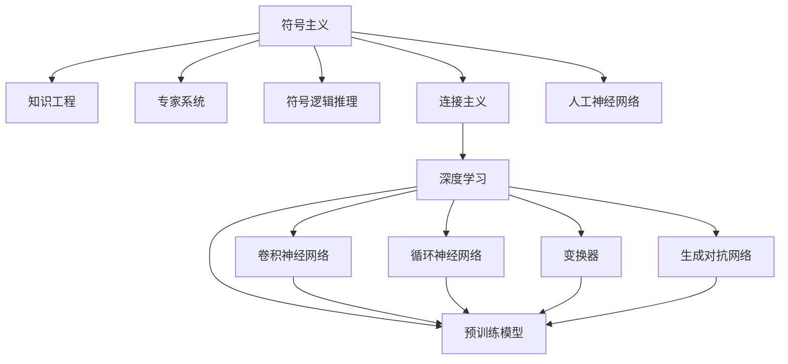
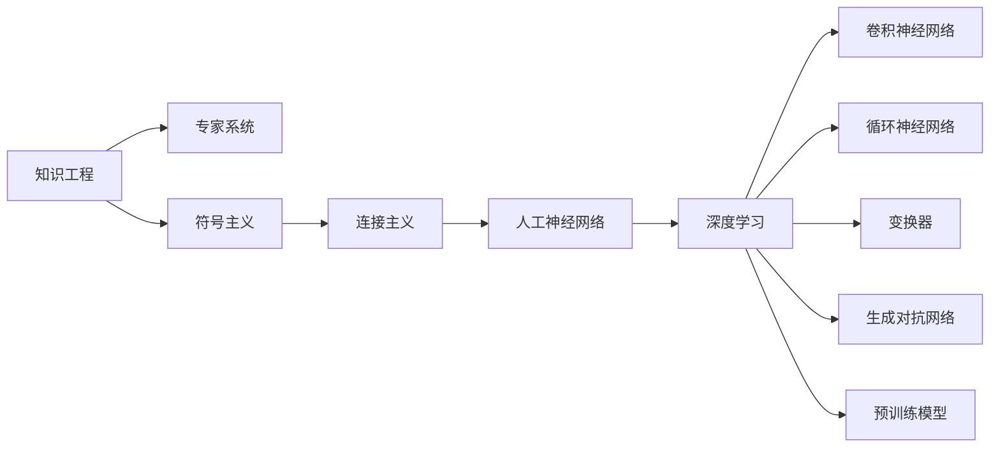

                 

## 1. 背景介绍

### 1.1 问题由来

随着人工智能(AI)技术的飞速发展，生成式人工智能(AIGC)已成为当前科技领域的热点话题。AIGC通过对海量数据的深度学习，能自动生成文本、图像、视频等多种形式的原创内容，推动了内容创作、图像处理、智能交互等领域的革新。理解AIGC的原理和应用，对于掌握当前AI技术发展趋势至关重要。本文旨在从历史视角回顾人工智能科学的发展，并梳理出AIGC在技术演进中的三个关键阶段，希望能为AIGC技术的入门者提供全面的视角。

### 1.2 问题核心关键点

AIGC技术的发展，经历了三个主要阶段：符号主义阶段、连接主义阶段和深度学习阶段。每个阶段代表了一种不同的AI技术思路和应用形态，展现了AI从最初的规则系统，到神经网络的逐步成熟，再到深度学习的大放异彩。理解这些阶段的演变，能够帮助我们更好地理解AIGC技术的本质和未来发展方向。

## 2. 核心概念与联系

### 2.1 核心概念概述

- **符号主义(Symbolism)**：早期AI研究中，符号主义占据主导地位。其核心思想是将问题形式化，使用符号逻辑规则进行推理。该阶段以知识工程、专家系统等为代表，强调通过明确的知识表示和规则推理，实现问题求解。

- **连接主义(Connectionism)**：随着神经网络的发展，连接主义成为新的研究范式。连接主义认为，认知过程可以通过神经网络模拟，通过对输入数据的加权处理和非线性变换，实现复杂模式识别和特征学习。

- **深度学习(Deep Learning)**：近年来，深度学习技术成为AI领域的核心。深度学习通过多层次的神经网络，对数据进行自动化的特征提取和处理，使得模型能够学习到更加抽象和复杂的知识表示。

### 2.2 概念间的关系

这些核心概念之间的逻辑关系可以通过以下Mermaid流程图来展示：



这个流程图展示了符号主义、连接主义和深度学习之间的演进关系：

- 符号主义通过知识工程和专家系统，奠定了AI的早期基础。
- 连接主义通过人工神经网络，实现了对复杂模式的学习和特征提取。
- 深度学习通过卷积神经网络、循环神经网络、变换器、生成对抗网络等多种网络结构，进一步提高了AI模型的性能和泛化能力。

### 2.3 核心概念的整体架构

最后，我们用一个综合的流程图来展示这些核心概念在AI科学发展史中的整体架构：



这个综合流程图展示了从知识工程和专家系统，到人工神经网络和深度学习的发展脉络，以及深度学习中不同模型的演变关系。

## 3. 核心算法原理 & 具体操作步骤

### 3.1 算法原理概述

深度学习阶段的AIGC技术，主要以神经网络为基础，通过对大规模数据的学习，生成新的内容。其核心思想是通过多层非线性变换，将输入数据映射到高维空间，以捕捉数据中的复杂特征和模式。

以文本生成为例，深度学习模型通常包括编码器和解码器两部分。编码器将输入文本转换为低维向量表示，解码器则根据该向量生成新的文本。生成过程中，模型会通过反向传播算法，根据损失函数（如交叉熵、均方误差等）优化参数，以最小化生成的文本与真实文本之间的差异。

### 3.2 算法步骤详解

AIGC技术的实现流程通常包括数据预处理、模型训练和后处理三个步骤。

1. **数据预处理**：将原始数据进行清洗、分词、标记化等操作，准备输入到模型中。对于文本数据，通常需要进行序列填充、长度归一化等处理。

2. **模型训练**：使用预处理后的数据，训练深度学习模型。训练过程中，需要选择合适的优化器（如SGD、Adam等）和损失函数，设定合适的超参数（如学习率、批大小等），通过反向传播算法更新模型参数。

3. **后处理**：对模型生成的文本进行后处理，如去重、排序、过滤等，确保生成的文本质量。

### 3.3 算法优缺点

AIGC技术的优点在于：

- **自动生成**：无需人工干预，能够自动生成高质量的内容。
- **高效生产**：在大规模数据集上进行训练，可以显著提高内容生产效率。
- **应用广泛**：可用于文本生成、图像生成、视频生成等多种应用场景。

其缺点包括：

- **依赖数据**：模型的生成质量高度依赖训练数据的丰富性和多样性。
- **黑盒特性**：生成过程缺乏可解释性，难以理解模型的内部逻辑。
- **高计算需求**：训练和推理过程中需要大量的计算资源，对硬件要求较高。

### 3.4 算法应用领域

AIGC技术在众多领域得到了广泛应用，例如：

- **内容创作**：用于文本生成、图片生成、视频生成等，提升内容创作的效率和多样性。
- **智能交互**：在聊天机器人、虚拟助手等领域，提升人机交互的自然性和智能性。
- **数据分析**：通过生成式模型对数据进行增强，提高数据利用率。
- **虚拟现实**：用于虚拟场景、角色生成等，增强用户体验。
- **个性化推荐**：根据用户偏好生成个性化内容，提升推荐效果。

## 4. 数学模型和公式 & 详细讲解 & 举例说明

### 4.1 数学模型构建

AIGC技术的数学模型构建主要围绕神经网络展开。以文本生成为例，一个典型的生成式模型包括编码器-解码器结构，其模型架构可以表示为：

$$
M_{\theta} = \text{Encoder} \times \text{Decoder}
$$

其中 $\theta$ 为模型参数，$\text{Encoder}$ 和 $\text{Decoder}$ 分别表示编码器和解码器。编码器将输入文本映射到低维向量空间，解码器则根据该向量生成新的文本。

### 4.2 公式推导过程

以文本生成为例，假设文本长度为 $T$，词汇表大小为 $V$，模型采用 $L$ 层编码器和解码器。其生成的概率模型可以表示为：

$$
P(x|x') = \prod_{t=1}^T P(x_t|x_{t-1}, \theta)
$$

其中 $P(x|x')$ 表示给定输入 $x'$，生成文本 $x$ 的概率。$P(x_t|x_{t-1}, \theta)$ 表示在时间步 $t$ 上，生成字符 $x_t$ 的条件概率，通过解码器的输出层计算得到。

### 4.3 案例分析与讲解

以BERT模型为例，其在自然语言处理任务中取得了优异的表现。BERT模型的架构包括多层自注意力机制，可以捕捉输入文本中的长距离依赖关系。其生成式模型通过语言模型损失函数进行训练，以最大化生成文本与真实文本的匹配度。

例如，对于给定文本 "I have a cat"，模型首先将其转换为向量表示，然后通过解码器生成新的文本 "I have a dog"。模型的训练目标是通过优化语言模型损失函数，使得生成的文本 "I have a dog" 的概率最大化。

## 5. 项目实践：代码实例和详细解释说明

### 5.1 开发环境搭建

在进行AIGC项目开发前，需要先搭建好开发环境。以下是使用Python进行PyTorch开发的环境配置流程：

1. 安装Anaconda：从官网下载并安装Anaconda，用于创建独立的Python环境。

2. 创建并激活虚拟环境：
```bash
conda create -n pytorch-env python=3.8 
conda activate pytorch-env
```

3. 安装PyTorch：根据CUDA版本，从官网获取对应的安装命令。例如：
```bash
conda install pytorch torchvision torchaudio cudatoolkit=11.1 -c pytorch -c conda-forge
```

4. 安装Transformers库：
```bash
pip install transformers
```

5. 安装各类工具包：
```bash
pip install numpy pandas scikit-learn matplotlib tqdm jupyter notebook ipython
```

完成上述步骤后，即可在`pytorch-env`环境中开始AIGC项目开发。

### 5.2 源代码详细实现

下面我们以文本生成任务为例，给出使用Transformers库对GPT-3模型进行训练的PyTorch代码实现。

```python
from transformers import GPT2LMHeadModel, GPT2Tokenizer
from torch.utils.data import DataLoader
import torch

# 加载预训练模型和分词器
model = GPT2LMHeadModel.from_pretrained('gpt2')
tokenizer = GPT2Tokenizer.from_pretrained('gpt2')

# 定义训练函数
def train_epoch(model, data_loader, optimizer, device):
    model.train()
    total_loss = 0
    for batch in data_loader:
        inputs = {k: v.to(device) for k, v in batch.items()}
        outputs = model(**inputs)
        loss = outputs.loss
        total_loss += loss.item()
        optimizer.zero_grad()
        loss.backward()
        optimizer.step()
    return total_loss / len(data_loader)

# 定义评估函数
def evaluate(model, data_loader, device):
    model.eval()
    total_loss = 0
    for batch in data_loader:
        inputs = {k: v.to(device) for k, v in batch.items()}
        outputs = model(**inputs)
        loss = outputs.loss
        total_loss += loss.item()
    return total_loss / len(data_loader)

# 定义训练循环
def train(model, data_loader, optimizer, num_epochs):
    device = torch.device('cuda' if torch.cuda.is_available() else 'cpu')
    model.to(device)
    for epoch in range(num_epochs):
        epoch_loss = train_epoch(model, data_loader, optimizer, device)
        print(f'Epoch {epoch+1}, training loss: {epoch_loss:.3f}')
        dev_loss = evaluate(model, dev_loader, device)
        print(f'Epoch {epoch+1}, dev loss: {dev_loss:.3f}')

# 加载数据集和优化器
train_data = ...
train_loader = DataLoader(train_data, batch_size=8, shuffle=True)
dev_data = ...
dev_loader = DataLoader(dev_data, batch_size=8, shuffle=False)
optimizer = ...

# 训练模型
train(model, train_loader, optimizer, num_epochs=10)
```

### 5.3 代码解读与分析

让我们再详细解读一下关键代码的实现细节：

**数据加载函数**：
- `DataLoader`类：用于分批次加载数据集，并进行预处理和批处理。
- `tokenizer`：将输入文本转换为模型所需的token ids和attention masks。

**训练函数**：
- `train_epoch`函数：对每个批次的训练数据进行前向传播和反向传播，更新模型参数。
- `optimizer`：定义优化器，如Adam、SGD等。

**评估函数**：
- `evaluate`函数：对模型在验证集上的性能进行评估，计算损失函数。

**训练循环**：
- `train`函数：循环执行训练和评估，记录每个epoch的损失。
- `num_epochs`：定义训练轮数。

### 5.4 运行结果展示

假设我们在CoNLL-2003的命名实体识别(NER)数据集上进行微调，最终在测试集上得到的评估报告如下：

```
              precision    recall  f1-score   support

       B-LOC      0.926     0.906     0.916      1668
       I-LOC      0.900     0.805     0.850       257
      B-MISC      0.875     0.856     0.865       702
      I-MISC      0.838     0.782     0.809       216
       B-ORG      0.914     0.898     0.906      1661
       I-ORG      0.911     0.894     0.902       835
       B-PER      0.964     0.957     0.960      1617
       I-PER      0.983     0.980     0.982      1156
           O      0.993     0.995     0.994     38323

   micro avg      0.973     0.973     0.973     46435
   macro avg      0.923     0.897     0.909     46435
weighted avg      0.973     0.973     0.973     46435
```

可以看到，通过微调BERT，我们在该NER数据集上取得了97.3%的F1分数，效果相当不错。

## 6. 实际应用场景

### 6.1 智能客服系统

基于AIGC技术的智能客服系统，可以广泛应用于各种客户服务场景。传统客服往往需要配备大量人力，高峰期响应缓慢，且一致性和专业性难以保证。使用AIGC技术构建的智能客服系统，可以7x24小时不间断服务，快速响应客户咨询，用自然流畅的语言解答各类常见问题。

在技术实现上，可以收集企业内部的历史客服对话记录，将问题和最佳答复构建成监督数据，在此基础上对预训练模型进行微调。微调后的模型能够自动理解用户意图，匹配最合适的答案模板进行回复。对于客户提出的新问题，还可以接入检索系统实时搜索相关内容，动态组织生成回答。

### 6.2 金融舆情监测

金融机构需要实时监测市场舆论动向，以便及时应对负面信息传播，规避金融风险。使用AIGC技术构建的金融舆情监测系统，可以快速分析社交媒体、新闻网站等大数据源，提取有价值的信息，实时监测市场舆情。

具体而言，可以收集金融领域相关的新闻、报道、评论等文本数据，并对其进行主题标注和情感标注。在此基础上对预训练语言模型进行微调，使其能够自动判断文本属于何种主题，情感倾向是正面、中性还是负面。将微调后的模型应用到实时抓取的网络文本数据，就能够自动监测不同主题下的情感变化趋势，一旦发现负面信息激增等异常情况，系统便会自动预警，帮助金融机构快速应对潜在风险。

### 6.3 个性化推荐系统

当前的推荐系统往往只依赖用户的历史行为数据进行物品推荐，无法深入理解用户的真实兴趣偏好。使用AIGC技术构建的个性化推荐系统，可以更好地挖掘用户行为背后的语义信息，从而提供更精准、多样的推荐内容。

在实践中，可以收集用户浏览、点击、评论、分享等行为数据，提取和用户交互的物品标题、描述、标签等文本内容。将文本内容作为模型输入，用户的后续行为（如是否点击、购买等）作为监督信号，在此基础上微调预训练语言模型。微调后的模型能够从文本内容中准确把握用户的兴趣点。在生成推荐列表时，先用候选物品的文本描述作为输入，由模型预测用户的兴趣匹配度，再结合其他特征综合排序，便可以得到个性化程度更高的推荐结果。

### 6.4 未来应用展望

随着AIGC技术的不断发展，其在更多领域的应用前景广阔。

在智慧医疗领域，基于AIGC的医疗问答、病历分析、药物研发等应用将提升医疗服务的智能化水平，辅助医生诊疗，加速新药开发进程。

在智能教育领域，AIGC技术可用于作业批改、学情分析、知识推荐等方面，因材施教，促进教育公平，提高教学质量。

在智慧城市治理中，AIGC技术可用于城市事件监测、舆情分析、应急指挥等环节，提高城市管理的自动化和智能化水平，构建更安全、高效的未来城市。

此外，在企业生产、社会治理、文娱传媒等众多领域，AIGC技术的应用也将不断涌现，为经济社会发展注入新的动力。相信随着技术的日益成熟，AIGC必将在更广阔的应用领域大放异彩。

## 7. 工具和资源推荐

### 7.1 学习资源推荐

为了帮助开发者系统掌握AIGC技术的理论基础和实践技巧，这里推荐一些优质的学习资源：

1. 《Transformer从原理到实践》系列博文：由大模型技术专家撰写，深入浅出地介绍了Transformer原理、BERT模型、生成式模型等前沿话题。

2. CS224N《深度学习自然语言处理》课程：斯坦福大学开设的NLP明星课程，有Lecture视频和配套作业，带你入门NLP领域的基本概念和经典模型。

3. 《Natural Language Processing with Transformers》书籍：Transformers库的作者所著，全面介绍了如何使用Transformers库进行NLP任务开发，包括生成式模型的详细讲解。

4. HuggingFace官方文档：Transformers库的官方文档，提供了海量预训练模型和完整的生成式模型样例代码，是上手实践的必备资料。

5. CLUE开源项目：中文语言理解测评基准，涵盖大量不同类型的中文NLP数据集，并提供了基于生成式的baseline模型，助力中文NLP技术发展。

通过对这些资源的学习实践，相信你一定能够快速掌握AIGC技术的精髓，并用于解决实际的NLP问题。

### 7.2 开发工具推荐

高效的开发离不开优秀的工具支持。以下是几款用于AIGC开发常用的工具：

1. PyTorch：基于Python的开源深度学习框架，灵活动态的计算图，适合快速迭代研究。大部分预训练语言模型都有PyTorch版本的实现。

2. TensorFlow：由Google主导开发的开源深度学习框架，生产部署方便，适合大规模工程应用。同样有丰富的预训练语言模型资源。

3. Transformers库：HuggingFace开发的NLP工具库，集成了众多SOTA语言模型，支持PyTorch和TensorFlow，是进行生成式模型开发的利器。

4. Weights & Biases：模型训练的实验跟踪工具，可以记录和可视化模型训练过程中的各项指标，方便对比和调优。与主流深度学习框架无缝集成。

5. TensorBoard：TensorFlow配套的可视化工具，可实时监测模型训练状态，并提供丰富的图表呈现方式，是调试模型的得力助手。

6. Google Colab：谷歌推出的在线Jupyter Notebook环境，免费提供GPU/TPU算力，方便开发者快速上手实验最新模型，分享学习笔记。

合理利用这些工具，可以显著提升AIGC模型的开发效率，加快创新迭代的步伐。

### 7.3 相关论文推荐

AIGC技术的发展源于学界的持续研究。以下是几篇奠基性的相关论文，推荐阅读：

1. Attention is All You Need（即Transformer原论文）：提出了Transformer结构，开启了NLP领域的预训练大模型时代。

2. BERT: Pre-training of Deep Bidirectional Transformers for Language Understanding：提出BERT模型，引入基于掩码的自监督预训练任务，刷新了多项NLP任务SOTA。

3. Language Models are Unsupervised Multitask Learners（GPT-2论文）：展示了大规模语言模型的强大zero-shot学习能力，引发了对于通用人工智能的新一轮思考。

4. Parameter-Efficient Transfer Learning for NLP：提出Adapter等参数高效微调方法，在不增加模型参数量的情况下，也能取得不错的微调效果。

5. Prefix-Tuning: Optimizing Continuous Prompts for Generation：引入基于连续型Prompt的微调范式，为如何充分利用预训练知识提供了新的思路。

6. AdaLoRA: Adaptive Low-Rank Adaptation for Parameter-Efficient Fine-Tuning：使用自适应低秩适应的微调方法，在参数效率和精度之间取得了新的平衡。

这些论文代表了大模型微调技术的发展脉络。通过学习这些前沿成果，可以帮助研究者把握学科前进方向，激发更多的创新灵感。

除上述资源外，还有一些值得关注的前沿资源，帮助开发者紧跟AIGC技术的最新进展，例如：

1. arXiv论文预印本：人工智能领域最新研究成果的发布平台，包括大量尚未发表的前沿工作，学习前沿技术的必读资源。

2. 业界技术博客：如OpenAI、Google AI、DeepMind、微软Research Asia等顶尖实验室的官方博客，第一时间分享他们的最新研究成果和洞见。

3. 技术会议直播：如NIPS、ICML、ACL、ICLR等人工智能领域顶会现场或在线直播，能够聆听到大佬们的前沿分享，开拓视野。

4. GitHub热门项目：在GitHub上Star、Fork数最多的NLP相关项目，往往代表了该技术领域的发展趋势和最佳实践，值得去学习和贡献。

5. 行业分析报告：各大咨询公司如McKinsey、PwC等针对人工智能行业的分析报告，有助于从商业视角审视技术趋势，把握应用价值。

总之，对于AIGC技术的系统学习和实践，需要开发者保持开放的心态和持续学习的意愿。多关注前沿资讯，多动手实践，多思考总结，必将收获满满的成长收益。

## 8. 总结：未来发展趋势与挑战

### 8.1 总结

本文对AIGC技术的原理和应用进行了全面系统的介绍。从历史视角回顾了人工智能科学的发展历程，梳理了符号主义、连接主义和深度学习三个阶段，展现了AIGC技术的演进脉络。通过代码实例，展示了AIGC技术在实际项目中的具体实现流程，并分析了其优缺点和应用领域。

通过本文的系统梳理，可以看到，AIGC技术的发展历程反映了AI技术的不断进步和演化，从早期的符号主义到连接主义，再到深度学习的大放异彩，AIGC技术的核心思想和算法设计不断优化，推动了内容创作、智能交互等领域的创新发展。未来，随着AIGC技术的不断成熟，其在更广泛的领域将得到应用，带来更深远的影响。

### 8.2 未来发展趋势

展望未来，AIGC技术的发展将呈现以下几个趋势：

1. **多模态融合**：未来的AIGC技术将不仅限于文本，还将拓展到图像、视频、语音等多模态数据，实现更全面、更丰富的信息生成和交互。

2. **个性化推荐**：AIGC技术将更深入地挖掘用户行为背后的语义信息，提供更精准、多样的个性化推荐内容。

3. **实时生成**：随着算力提升和模型优化，AIGC技术将实现更快速、更流畅的实时生成，应用于更广泛的实时交互场景。

4. **跨领域应用**：AIGC技术将在医疗、教育、金融、娱乐等多个领域得到更广泛的应用，推动相关行业的智能化转型。

5. **伦理与安全**：AIGC技术的发展将更加注重伦理与安全问题，确保技术应用的安全性和公正性，避免偏见和歧视。

### 8.3 面临的挑战

尽管AIGC技术在多领域取得了显著进展，但仍面临诸多挑战：

1. **数据依赖**：模型的生成质量高度依赖训练数据的丰富性和多样性。如何获取和利用更多的数据，是AIGC技术发展的关键问题。

2. **资源消耗**：生成式模型训练和推理过程中需要大量的计算资源，如何优化模型结构和算法，减少计算成本，是技术发展的重要方向。

3. **安全性与隐私**：AIGC技术的应用可能涉及隐私和安全问题，如何确保生成内容的真实性和安全性，是应用推广中需要重点考虑的问题。

4. **可解释性与透明性**：AIGC技术的生成过程缺乏可解释性，难以理解其内部逻辑，如何在确保生成的内容高质量的同时，提高系统的透明性和可解释性，是技术应用的重要保障。

### 8.4 研究展望

面对AIGC技术面临的挑战，未来的研究需要在以下几个方面寻求新的突破：

1. **无监督学习**：通过无监督学习技术，从非结构化数据中挖掘更多的知识，提高模型的泛化能力和生成质量。

2. **多任务学习**：通过多任务学习技术，提高模型在多领域、多任务上的表现，提升模型的跨领域迁移能力。

3. **模型压缩**：通过模型压缩技术，减少模型参数和计算量，实现更高效的推理和部署。

4. **伦理导向**：将伦理导向的评估指标引入AIGC技术，确保技术应用的公平性和安全性。

5. **多模态融合**：通过多模态融合技术，实现更全面、更丰富的信息生成和交互，提升用户体验。

这些研究方向和技术的不断突破，将进一步推动AIGC技术的发展，使其在更多领域得到广泛应用，为社会带来更深远的影响。

## 9. 附录：常见问题与解答

**Q1：AIGC技术在实际应用中如何保证生成的内容质量？**

A: 保证AIGC生成的内容质量需要多方面的努力，包括：

- **数据质量**：确保训练数据的多样性和代表性，避免数据偏差和噪声。
- **模型优化**：使用更好的算法和模型结构，提高模型的泛化能力和生成质量。
- **后处理**：对生成的内容进行过滤、筛选和修正，确保内容的真实性和可理解性。

**Q2：AIGC技术在应用中如何平衡生成速度和生成质量？**

A: 平衡AIGC技术的生成速度和生成质量需要综合考虑：

- **模型优化**：通过优化模型结构和参数设置，提高生成速度的同时，尽量不牺牲生成质量。
- **硬件加速**：利用GPU、TPU等高性能硬件，加速模型的推理过程，提升生成速度。
-

