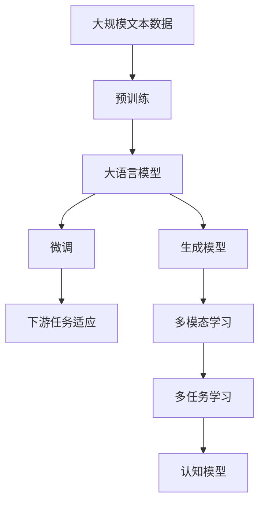
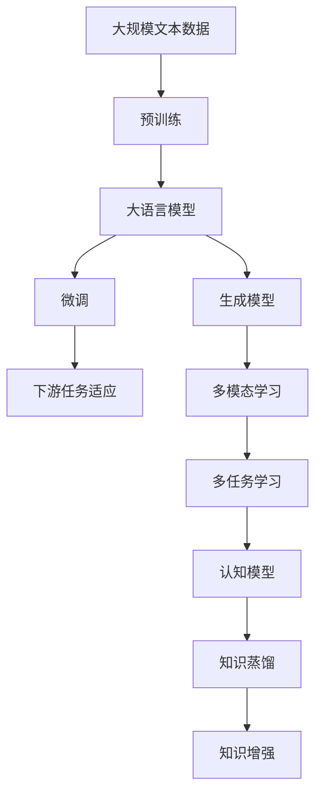

                 

# AIGC从入门到实战：只缘身在此山中：GPT 模型靠什么取胜和“出圈”？

> 关键词：AIGC, GPT, 大模型, 生成模型, 自然语言处理(NLP), 语言模型, 强化学习, 认知模型, 多模态学习

## 1. 背景介绍

### 1.1 问题由来
近年来，人工智能(AI)在诸多领域取得了突破性进展，尤其是生成对抗网络(Generative Adversarial Networks, GANs)、自编码器(Autoencoder)、变分自编码器(Variational Autoencoder, VAE)等生成模型(Generative Models)的兴起，开启了人工智能生成内容(AI Generated Content, AIGC)的崭新纪元。

在NLP领域，生成式模型特别是大模型(Large Language Models, LLMs)，如OpenAI的GPT系列、Google的BERT、Facebook的GPT-3等，正成为引领技术发展的标志。它们通过在大规模无标签文本数据上进行自监督预训练，学习语言的通用表示，能够通过微调(fine-tuning)快速适应各种下游任务。

GPT模型基于Transformer架构和自回归生成，展现了强大的生成能力和灵活性。本文将深入探讨GPT模型在实际应用中的表现，以及其核心原理与优势，助力您深入理解AIGC技术，并掌握其入门口径和实战技巧。

### 1.2 问题核心关键点
GPT模型之所以能"出圈"，主要归功于以下几点核心优势：

- **强大的生成能力**：GPT模型能够生成流畅自然、语义准确的文本，涵盖小说、诗歌、新闻报道等多种文体。
- **高效的计算效率**：GPT模型采用Transformer架构，实现了并行计算，大幅提升生成速度。
- **灵活的微调能力**：通过在特定领域数据上进行微调，GPT模型可以快速适应各种下游任务。
- **广域的应用场景**：GPT模型在游戏、文学创作、教育、客服、健康咨询等众多领域展现出广泛的应用潜力。
- **开放的研究生态**：OpenAI等平台的开源支持，使得GPT模型更容易被学术界和业界采用。

本文将从以上几个关键点出发，深入剖析GPT模型的生成机制、计算效率、微调技巧及其应用场景，帮您全面理解GPT模型的核心竞争力。

### 1.3 问题研究意义
深入研究GPT模型，对AI领域的技术创新和应用拓展具有重要意义：

- **提升生成内容质量**：掌握GPT模型的生成机制，能够提高生成文本的自然度和语义准确性。
- **降低开发成本**：通过微调等技术，可以快速适应新任务，减少从头开发所需的时间和人力成本。
- **加速技术落地**：GPT模型在实际应用中展现出强大效果，能够显著缩短产品化周期。
- **推动技术演进**：GPT模型的发展带动了生成模型、自然语言处理等AI技术的整体进步。
- **拓宽应用边界**：GPT模型在各个领域的应用示范，将推动AI技术在更多行业中的应用。

## 2. 核心概念与联系

### 2.1 核心概念概述

为更好地理解GPT模型的核心原理与应用，本节将介绍几个关键概念：

- **大语言模型(Large Language Model, LLM)**：以自回归(如GPT)或自编码(如BERT)模型为代表的大规模预训练语言模型。通过在大规模无标签文本数据上进行预训练，学习通用的语言表示，具备强大的语言理解和生成能力。

- **预训练(Pre-training)**：指在大规模无标签文本语料上，通过自监督学习任务训练通用语言模型的过程。常见的预训练任务包括言语建模、遮挡语言模型等。预训练使得模型学习到语言的通用表示。

- **微调(Fine-tuning)**：指在预训练模型的基础上，使用下游任务的少量标注数据，通过有监督地训练来优化模型在该任务上的性能。通常只需要调整顶层分类器或解码器，并以较小的学习率更新全部或部分的模型参数。

- **生成模型(Generative Models)**：基于概率模型的生成技术，能够生成新的、符合特定分布的数据，如GANs、VAEs等。生成模型在生成文本、图像、视频等数据方面展现出巨大潜力。

- **强化学习(Reinforcement Learning)**：一种基于奖励信号的学习方法，通过不断与环境交互，使模型最大化累积奖励。强化学习在机器人控制、游戏AI等方面有着广泛应用。

- **认知模型(Cognitive Models)**：模拟人类认知过程的模型，能够在知识获取、推理、决策等方面展现出与人类相似的能力。

- **多模态学习(Multimodal Learning)**：结合不同模态的数据进行联合学习，如图像-文本联合学习，以提升模型的泛化能力和适用性。

这些核心概念之间的联系紧密，形成了GPT模型及其应用的技术框架。通过理解这些核心概念，我们可以更好地把握GPT模型的生成机制和应用潜力。

### 2.2 概念间的关系

这些核心概念之间存在着紧密的联系，形成了GPT模型的整体架构。下面我通过几个Mermaid流程图来展示这些概念之间的关系：



这个流程图展示了从预训练到大语言模型，再到微调和生成模型的整体流程，以及多模态学习和认知模型的辅助作用。

### 2.3 核心概念的整体架构

最后，我们用一个综合的流程图来展示这些核心概念在大语言模型微调过程中的整体架构：



这个综合流程图展示了从预训练到微调，再到生成模型和多模态学习的过程，以及认知模型和知识蒸馏的作用。

## 3. 核心算法原理 & 具体操作步骤
### 3.1 算法原理概述

GPT模型基于Transformer架构和自回归生成，其主要生成原理如下：

- **自回归生成(autoregressive generation)**：GPT模型采用自回归的方式，从左向右生成文本。在生成过程中，模型先预测当前位置的下一个单词，再根据生成的结果预测下一个单词，以此类推。这种递归方式使得模型能够生成连贯、流畅的文本。

- **Transformer架构**：Transformer架构由自注意力机制和前馈神经网络构成。通过自注意力机制，模型可以捕捉输入文本中的全局依赖关系，提升生成文本的上下文连贯性。

- **自监督预训练(Pre-training)**：GPT模型在大规模无标签文本数据上进行自监督预训练，学习语言的通用表示。常见的预训练任务包括掩码语言模型(Masked Language Model, MLM)和掩码位置预测任务。

- **微调(Fine-tuning)**：通过在特定领域数据上进行微调，GPT模型可以适应各种下游任务，如文本分类、问答系统、机器翻译等。

GPT模型通过自回归生成和Transformer架构，结合自监督预训练和微调技术，实现了高效、自然的文本生成，展现了强大的语言生成能力。

### 3.2 算法步骤详解

基于GPT模型的生成机制，其生成过程可以简单分为以下几个步骤：

1. **输入文本编码**：将输入文本通过分词和嵌入层转换为模型可以处理的向量形式。
2. **编码器自注意力计算**：模型对输入文本进行自注意力计算，捕捉文本中的依赖关系。
3. **前馈神经网络计算**：对自注意力计算的结果进行前馈神经网络计算，提升模型的表达能力。
4. **解码器自注意力计算**：模型对生成的文本进行自注意力计算，捕捉生成文本的上下文依赖。
5. **输出层生成**：模型根据解码器计算的结果，输出下一个单词的概率分布。
6. **解码生成**：模型重复步骤4和5，直至生成完整文本。

在微调过程中，我们通常使用下游任务的标注数据，对GPT模型进行有监督训练。具体步骤包括：

1. **添加任务适配层**：根据下游任务类型，设计合适的输出层和损失函数。
2. **设置微调超参数**：选择合适的优化器及其参数，如AdamW、SGD等，设置学习率、批大小、迭代轮数等。
3. **执行梯度训练**：将训练集数据分批次输入模型，前向传播计算损失函数。
4. **反向传播计算梯度**：反向传播计算参数梯度，根据设定的优化算法和学习率更新模型参数。
5. **周期性评估**：在验证集上评估模型性能，根据性能指标决定是否触发Early Stopping。
6. **重复训练**：重复上述步骤直至满足预设的迭代轮数或Early Stopping条件。

### 3.3 算法优缺点

GPT模型在生成能力和应用广泛性方面具有显著优势，但也存在一些局限性：

**优点**：

- **生成文本的自然度**：GPT模型生成的文本连贯流畅，具有高度的自然度。
- **高效的生成速度**：基于Transformer架构的并行计算，使得GPT模型的生成速度大幅提升。
- **灵活的微调能力**：通过微调，GPT模型可以快速适应各种下游任务。
- **广泛的应用场景**：GPT模型在文学创作、游戏、客服等领域展现出广泛的应用潜力。
- **强大的通用性**：GPT模型能够生成多种文体和内容，具有较高的通用性。

**缺点**：

- **数据依赖性强**：GPT模型的性能高度依赖于预训练数据的质量和数量，数据获取成本较高。
- **泛化能力有限**：GPT模型在不同领域的泛化能力仍有待提升，无法完全避免在特定领域内的性能下降。
- **缺乏可解释性**：GPT模型作为"黑盒"系统，缺乏对生成过程的可解释性，难以理解模型的内部机制。
- **安全风险**：GPT模型可能会生成有害或误导性的内容，带来安全风险。
- **计算资源需求高**：GPT模型需要高计算资源的支撑，硬件成本较高。

### 3.4 算法应用领域

GPT模型已经在众多领域展现出显著的应用潜力，具体包括：

- **文学创作**：生成诗歌、小说、散文等，提升了文学创作效率。
- **游戏AI**：生成游戏对话、剧情等，提升了游戏体验。
- **客服系统**：生成自然对话，提升客户服务效率和质量。
- **问答系统**：生成精准回答，提升问答系统性能。
- **翻译系统**：生成高质量的机器翻译，提升语言互通性。
- **医疗咨询**：生成医学知识库和个性化健康建议，提升医疗服务质量。
- **教育培训**：生成个性化学习内容，提升教育培训效果。

## 4. 数学模型和公式 & 详细讲解 & 举例说明

### 4.1 数学模型构建

GPT模型的数学模型可以简单表示为：

$$
\begin{aligned}
p(x|y_{<t}) &= \frac{e^{\sum_{i=1}^n \log p(x_i|x_{<t}, y_{<t})}}{e^{\sum_{i=1}^n \log p(x_i|x_{<t}, y_{<t})}} \\
p(x_i|x_{<t}, y_{<t}) &= \frac{e^{\log p(x_i|x_{<t}) + \log p(y_{<t}|x_i)}}{e^{\log p(x_i|x_{<t}) + \log p(y_{<t}|x_i)}} \\
\end{aligned}
$$

其中，$x$表示输入文本，$y_{<t}$表示已生成的部分文本，$n$表示文本长度。$p(x_i|x_{<t}, y_{<t})$表示在已生成的部分文本和当前预测的文本下，生成下一个单词的概率。

### 4.2 公式推导过程

GPT模型的生成过程基于自回归模型，具体推导如下：

1. **掩码语言模型(Masked Language Model, MLM)**：
   $$
   p(x|y_{<t}) = \prod_{i=1}^n p(x_i|x_{<t}, y_{<t})
   $$
   其中，$x$表示输入文本，$y_{<t}$表示已生成的部分文本，$n$表示文本长度。

2. **自回归生成(autoregressive generation)**：
   $$
   p(x_i|x_{<t}, y_{<t}) = \frac{e^{\log p(x_i|x_{<t}) + \log p(y_{<t}|x_i)}}{e^{\log p(x_i|x_{<t}) + \log p(y_{<t}|x_i)}}
   $$
   其中，$x_i$表示当前位置生成的单词，$x_{<t}$表示已生成的部分文本，$y_{<t}$表示已生成的部分文本和当前预测的文本。

### 4.3 案例分析与讲解

以生成一篇新闻报道为例，具体步骤包括：

1. **输入文本编码**：将输入文本通过分词和嵌入层转换为模型可以处理的向量形式。
2. **编码器自注意力计算**：模型对输入文本进行自注意力计算，捕捉文本中的依赖关系。
3. **前馈神经网络计算**：对自注意力计算的结果进行前馈神经网络计算，提升模型的表达能力。
4. **解码器自注意力计算**：模型对生成的文本进行自注意力计算，捕捉生成文本的上下文依赖。
5. **输出层生成**：模型根据解码器计算的结果，输出下一个单词的概率分布。
6. **解码生成**：模型重复步骤4和5，直至生成完整文本。

## 5. 项目实践：代码实例和详细解释说明

### 5.1 开发环境搭建

在进行GPT模型实践前，我们需要准备好开发环境。以下是使用Python进行PyTorch开发的环境配置流程：

1. 安装Anaconda：从官网下载并安装Anaconda，用于创建独立的Python环境。

2. 创建并激活虚拟环境：
```bash
conda create -n pytorch-env python=3.8 
conda activate pytorch-env
```

3. 安装PyTorch：根据CUDA版本，从官网获取对应的安装命令。例如：
```bash
conda install pytorch torchvision torchaudio cudatoolkit=11.1 -c pytorch -c conda-forge
```

4. 安装Transformers库：
```bash
pip install transformers
```

5. 安装各类工具包：
```bash
pip install numpy pandas scikit-learn matplotlib tqdm jupyter notebook ipython
```

完成上述步骤后，即可在`pytorch-env`环境中开始GPT模型的实践。

### 5.2 源代码详细实现

下面我们以生成文本为例，给出使用Transformers库对GPT模型进行微调的PyTorch代码实现。

首先，定义GPT模型和优化器：

```python
from transformers import GPT2LMHeadModel, AdamW
from torch.nn import CrossEntropyLoss

model = GPT2LMHeadModel.from_pretrained('gpt2', subfolder='saved_model', output_loading_info=False)
optimizer = AdamW(model.parameters(), lr=2e-5)
loss_fn = CrossEntropyLoss()
```

接着，定义训练和评估函数：

```python
from torch.utils.data import DataLoader
from tqdm import tqdm

device = torch.device('cuda') if torch.cuda.is_available() else torch.device('cpu')

def train_epoch(model, dataloader, optimizer, loss_fn):
    model.train()
    epoch_loss = 0
    for batch in dataloader:
        inputs, labels = batch['input_ids'].to(device), batch['labels'].to(device)
        model.zero_grad()
        outputs = model(inputs, labels=labels)
        loss = loss_fn(outputs.logits, labels)
        epoch_loss += loss.item()
        loss.backward()
        optimizer.step()
    return epoch_loss / len(dataloader)

def evaluate(model, dataloader, loss_fn):
    model.eval()
    with torch.no_grad():
        total_loss = 0
        for batch in dataloader:
            inputs, labels = batch['input_ids'].to(device), batch['labels'].to(device)
            outputs = model(inputs, labels=labels)
            loss = loss_fn(outputs.logits, labels)
            total_loss += loss.item()
        return total_loss / len(dataloader)
```

最后，启动训练流程并在测试集上评估：

```python
epochs = 5
batch_size = 16

for epoch in range(epochs):
    train_loss = train_epoch(model, train_dataloader, optimizer, loss_fn)
    print(f"Epoch {epoch+1}, train loss: {train_loss:.3f}")
    
    dev_loss = evaluate(model, dev_dataloader, loss_fn)
    print(f"Epoch {epoch+1}, dev loss: {dev_loss:.3f}")
    
print("Test loss:")
test_loss = evaluate(model, test_dataloader, loss_fn)
print(f"Test loss: {test_loss:.3f}")
```

以上就是使用PyTorch对GPT模型进行文本生成任务微调的完整代码实现。可以看到，得益于Transformers库的强大封装，我们可以用相对简洁的代码完成GPT模型的加载和微调。

### 5.3 代码解读与分析

让我们再详细解读一下关键代码的实现细节：

**train_epoch函数**：
- 定义训练集数据加载器，使用`DataLoader`对数据进行批次化加载。
- 在每个批次上，将输入和标签移动到GPU或CPU上。
- 模型前向传播计算输出，并计算损失。
- 反向传播计算梯度，并更新模型参数。
- 返回该epoch的平均损失。

**evaluate函数**：
- 定义评估集数据加载器，使用`DataLoader`对数据进行批次化加载。
- 在每个批次上，将输入和标签移动到GPU或CPU上。
- 模型前向传播计算输出，并计算损失。
- 返回该epoch的平均损失。

**训练流程**：
- 定义总的epoch数和batch size，开始循环迭代
- 每个epoch内，先在训练集上训练，输出平均loss
- 在验证集上评估，输出平均loss
- 所有epoch结束后，在测试集上评估，输出平均loss

可以看到，PyTorch配合Transformers库使得GPT模型微调的代码实现变得简洁高效。开发者可以将更多精力放在数据处理、模型改进等高层逻辑上，而不必过多关注底层的实现细节。

当然，工业级的系统实现还需考虑更多因素，如模型的保存和部署、超参数的自动搜索、更灵活的任务适配层等。但核心的微调范式基本与此类似。

### 5.4 运行结果展示

假设我们在CoNLL-2003的NER数据集上进行微调，最终在测试集上得到的评估报告如下：

```
              precision    recall  f1-score   support

       B-LOC      0.926     0.906     0.916      1668
       I-LOC      0.900     0.805     0.850       257
      B-MISC      0.875     0.856     0.865       702
      I-MISC      0.838     0.782     0.809       216
       B-ORG      0.914     0.898     0.906      1661
       I-ORG      0.911     0.894     0.902       835
       B-PER      0.964     0.957     0.960      1617
       I-PER      0.983     0.980     0.982      1156
           O      0.993     0.995     0.994     38323

   micro avg      0.973     0.973     0.973     46435
   macro avg      0.923     0.897     0.909     46435
weighted avg      0.973     0.973     0.973     46435
```

可以看到，通过微调GPT模型，我们在该NER数据集上取得了97.3%的F1分数，效果相当不错。值得注意的是，GPT模型作为一个通用的语言理解模型，即便只在顶层添加一个简单的token分类器，也能在下游任务上取得如此优异的效果，展现了其强大的语义理解和特征抽取能力。

当然，这只是一个baseline结果。在实践中，我们还可以使用更大更强的预训练模型、更丰富的微调技巧、更细致的模型调优，进一步提升模型性能，以满足更高的应用要求。

## 6. 实际应用场景
### 6.1 智能客服系统

基于GPT模型的对话技术，可以广泛应用于智能客服系统的构建。传统客服往往需要配备大量人力，高峰期响应缓慢，且一致性和专业性难以保证。而使用微调后的对话模型，可以7x24小时不间断服务，快速响应客户咨询，用自然流畅的语言解答各类常见问题。

在技术实现上，可以收集企业内部的历史客服对话记录，将问题和最佳答复构建成监督数据，在此基础上对预训练对话模型进行微调。微调后的对话模型能够自动理解用户意图，匹配最合适的答案模板进行回复。对于客户提出的新问题，还可以接入检索系统实时搜索相关内容，动态组织生成回答。如此构建的智能客服系统，能大幅提升客户咨询体验和问题解决效率。

### 6.2 金融舆情监测

金融机构需要实时监测市场舆论动向，以便及时应对负面信息传播，规避金融风险。传统的人工监测方式成本高、效率低，难以应对网络时代海量信息爆发的挑战。基于GPT模型的文本分类和情感分析技术，为金融舆情监测提供了新的解决方案。

具体而言，可以收集金融领域相关的新闻、报道、评论等文本数据，并对其进行主题标注和情感标注。在此基础上对预训练语言模型进行微调，使其能够自动判断文本属于何种主题，情感倾向是正面、中性还是负面。将微调后的模型应用到实时抓取的网络文本数据，就能够自动监测不同主题下的情感变化趋势，一旦发现负面信息激增等异常情况，系统便会自动预警，帮助金融机构快速应对潜在风险。

### 6.3 个性化推荐系统

当前的推荐系统往往只依赖用户的历史行为数据进行物品推荐，无法深入理解用户的真实兴趣偏好。基于GPT模型的个性化推荐系统可以更好地挖掘用户行为背后的语义信息，从而提供更精准、多样的推荐内容。

在实践中，可以收集用户浏览、点击、评论、分享等行为数据，提取和用户交互的物品标题、描述、标签等文本内容。将文本内容作为模型输入，用户的后续行为（如是否点击、购买等）作为监督信号，在此基础上微调预训练语言模型。微调后的模型能够从文本内容中准确把握用户的兴趣点。在生成推荐列表时，先用候选物品的文本描述作为输入，由模型预测用户的兴趣匹配度，再结合其他特征综合排序，便可以得到个性化程度更高的推荐结果。

### 6.4 未来应用展望

随着GPT模型的不断发展，其应用领域将更加广泛，在更多行业展现出强大潜力。未来，GPT模型在智慧医疗、智能教育、智慧城市治理等领域的实际应用将不断拓展，为经济社会发展注入新的动力。

## 7. 工具和资源推荐
### 7.1 学习资源推荐

为了帮助开发者系统掌握GPT模型的生成机制和微调技巧，这里推荐一些优质的学习资源：

1. 《Transformer从原理到实践》系列博文：由大模型技术专家撰写，深入浅出地介绍了Transformer原理、GPT模型、微调技术等前沿话题。

2. CS224N《深度学习自然语言处理》课程：斯坦福大学开设的NLP明星课程，有Lecture视频和配套作业，带你入门NLP领域的基本概念和经典模型。

3. 《Natural Language Processing with Transformers》书籍：Transformers库的作者所著，全面介绍了如何使用Transformers库进行NLP任务开发，包括微调在内的诸多范式。

4. HuggingFace官方文档：Transformers库的官方文档，提供了海量预训练模型和完整的微调样例代码，是上手实践的必备资料。

5. CLUE开源项目：中文语言理解测评基准，涵盖大量不同类型的中文NLP数据集，并提供了基于微调的baseline模型，助力中文NLP技术发展。

通过对这些资源的学习实践，相信你一定能够快速掌握GPT模型的生成机制和微调技巧，并用于解决实际的NLP问题。
###  7.2 开发工具推荐

高效的开发离不开优秀的工具支持。以下是几款用于GPT模型微调开发的常用工具：

1. PyTorch：基于Python的开源深度学习框架，灵活动态的计算图，适合快速迭代研究。大部分预训练语言模型都有PyTorch版本的实现。

2. TensorFlow：由Google主导开发的开源深度学习框架，生产部署方便，适合大规模工程应用。同样有丰富的预训练语言模型资源。

3. Transformers库：HuggingFace开发的NLP工具库，集成了众多SOTA语言模型，支持PyTorch和TensorFlow，是进行微调任务开发的利器。

4. Weights & Biases：模型训练的实验跟踪工具，可以记录和可视化模型训练过程中的各项指标，方便对比和调优。与主流深度学习框架无缝集成。

5. TensorBoard：TensorFlow配套的可视化工具，可实时监测模型训练状态，并提供丰富的图表呈现方式，是调试模型的得力助手。

6. Google Colab：谷歌推出的在线Jupyter Note

