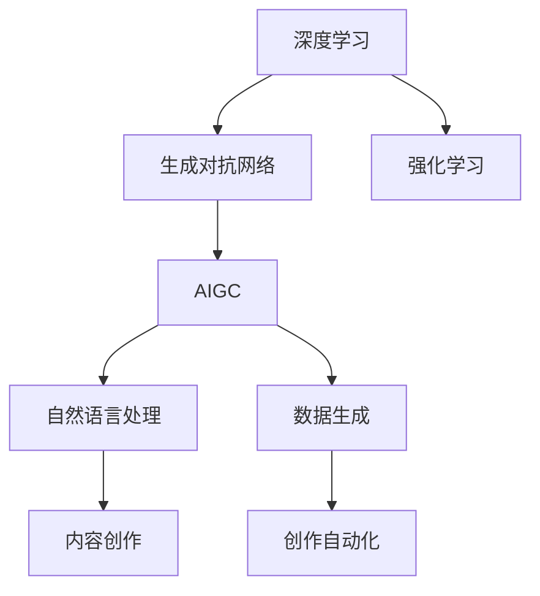
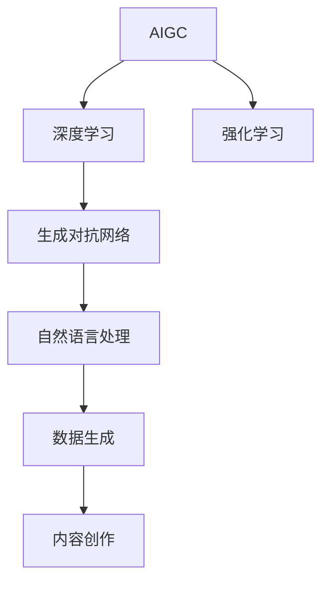
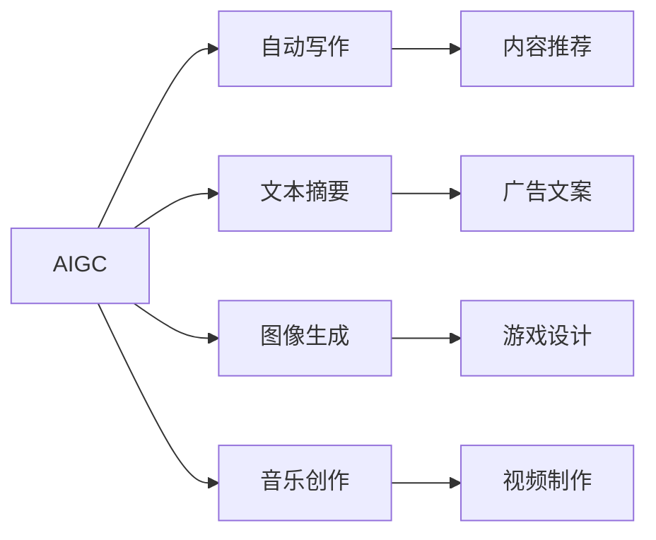

                 

# AIGC从入门到实战：可能消失的职业和新出现的机会

> 关键词：人工智能生成内容(AIGC)、自然语言处理(NLP)、深度学习、强化学习、生成对抗网络(GAN)、数据生成、内容创作、创作自动化

## 1. 背景介绍

### 1.1 问题由来
近年来，随着深度学习、生成对抗网络(GAN)等技术的飞速发展，人工智能生成内容（AIGC）技术已经从科幻变为现实。特别是在自然语言处理（NLP）、图像处理、音频生成等领域，AIGC技术正逐步应用到更多的实际场景中，为各行各业带来前所未有的创新变革。

AIGC技术的核心在于通过深度学习模型，模仿人类创造性思维，自动生成高质量的文本、图片、音频等内容。这一技术的迅猛发展，正在重新定义许多职业的未来。例如，许多文案、编辑、设计等需要人类创造力的工作，都有可能被AIGC技术所替代。但同时，它也为数字内容创作、内容个性化定制等领域带来了新的机遇。

### 1.2 问题核心关键点
AIGC技术的核心在于其生成内容的能力，即能够根据给定的条件自动产生符合要求的文本、图片、音频等内容。这一技术的实现主要依赖于深度学习、生成对抗网络、自然语言处理、强化学习等前沿技术。AIGC技术能够应用到多个领域，包括自动写作、文本摘要、图像生成、音乐创作等，展示了巨大的应用潜力。

当前，AIGC技术在学术界和工业界都受到了广泛关注。学术界在AIGC的研究上取得了显著进展，特别是在深度学习模型的设计和优化上，例如GPT、BERT、GAN等模型。工业界则在实际应用中探索了更多可能，如自动翻译、内容推荐、游戏设计等。这些技术正在逐步改变我们的生活方式和工作方式。

### 1.3 问题研究意义
AIGC技术的研究和应用，对于拓展人工智能的应用范围，提升内容创作和编辑的效率，加速产业数字化转型，具有重要意义：

1. 降低创作成本。AIGC技术能够快速生成高质量内容，大幅减少内容创作所需的时间和经济成本。
2. 提升内容质量。AIGC技术能够学习到大量的语料库和风格，生成内容更具多样性和创新性。
3. 加速技术落地。AIGC技术使得内容生成变得更加简单和自动化，降低了技术门槛，加速了技术在各行业的应用。
4. 带来新机会。AIGC技术催生了许多新的职业和岗位，如内容生成工程师、内容编辑器等。
5. 创造商业价值。AIGC技术为内容创造、广告、游戏等领域带来了新的商业模式和盈利点。

## 2. 核心概念与联系

### 2.1 核心概念概述

为更好地理解AIGC技术，本节将介绍几个密切相关的核心概念：

- **AIGC (人工智能生成内容)**：利用深度学习、生成对抗网络等技术，自动生成高质量的文本、图片、音频等内容。
- **深度学习 (Deep Learning)**：一种基于多层神经网络的机器学习方法，能够自动提取和分析数据特征。
- **生成对抗网络 (GAN)**：由生成器和判别器两部分组成的网络结构，通过对抗训练生成逼真的内容。
- **自然语言处理 (NLP)**：涉及文本数据的处理和分析，如文本分类、情感分析、机器翻译等。
- **强化学习 (Reinforcement Learning)**：通过奖励和惩罚机制，让模型学习最优策略以达成特定目标。
- **数据生成 (Data Generation)**：使用模型生成符合要求的数据集，用于训练和测试AIGC模型。
- **内容创作 (Content Creation)**：包括文本、图片、音频等多媒体内容的制作，是AIGC技术的主要应用场景。
- **创作自动化 (Automated Content Creation)**：通过AIGC技术实现内容创作的自动化，提升效率和质量。

这些核心概念之间的逻辑关系可以通过以下Mermaid流程图来展示：



这个流程图展示了大模型微调的完整生态系统：

1. 深度学习为生成对抗网络提供基础支持。
2. 生成对抗网络基于深度学习模型生成内容。
3. 自然语言处理用于理解和分析文本数据。
4. 数据生成用于生成高质量的数据集。
5. 内容创作是AIGC技术的主要应用场景。
6. 创作自动化使得内容创作更加高效。
7. 强化学习用于训练和优化AIGC模型。

通过理解这些核心概念，我们可以更好地把握AIGC技术的工作原理和优化方向。

### 2.2 概念间的关系

这些核心概念之间存在着紧密的联系，形成了AIGC技术的完整生态系统。下面我通过几个Mermaid流程图来展示这些概念之间的关系。

#### 2.2.1 AIGC技术的核心算法



这个流程图展示了大模型微调的完整流程：

1. 深度学习为生成对抗网络提供支持。
2. 生成对抗网络用于生成内容。
3. 自然语言处理用于理解和分析文本数据。
4. 强化学习用于训练和优化模型。
5. 数据生成用于生成高质量的数据集。
6. 内容创作是AIGC技术的主要应用场景。

#### 2.2.2 AIGC技术的应用领域



这个流程图展示了AIGC技术的主要应用领域：

1. 自动写作：自动生成新闻、博客、小说等内容。
2. 文本摘要：自动生成文章摘要，提高阅读效率。
3. 图像生成：自动生成图片、动画、虚拟场景等。
4. 音乐创作：自动生成音乐、歌词等内容。
5. 内容推荐：根据用户偏好生成个性化推荐内容。
6. 广告文案：自动生成广告文案，提高广告效果。
7. 游戏设计：自动生成游戏场景、角色、对话等内容。
8. 视频制作：自动生成视频内容，提高制作效率。

通过这些流程图，我们可以更清晰地理解AIGC技术在不同应用领域中的具体实现方式。

## 3. 核心算法原理 & 具体操作步骤
### 3.1 算法原理概述

AIGC技术的核心在于生成对抗网络（GAN）。GAN由生成器和判别器两部分组成，通过对抗训练生成逼真的内容。

生成器（Generator）负责从噪声向量生成内容，判别器（Discriminator）负责判断生成的内容是否逼真。两个模型通过不断对抗训练，逐步提升生成器生成内容的真实性，使得生成的内容难以区分于真实数据。

形式化地，假设输入为噪声向量 $z$，生成器模型 $G(z)$ 将噪声向量转换为内容 $x$，判别器模型 $D(x)$ 判断 $x$ 是否为真实数据。生成对抗网络的目标是最小化生成器输出内容的损失，最大化判别器对生成内容的判别能力。

GAN的训练过程如下：

1. 生成器从噪声向量 $z$ 生成内容 $x$。
2. 判别器判断 $x$ 是否为真实数据。
3. 生成器根据判别器的反馈调整生成策略，使得生成的内容更逼真。
4. 判别器根据生成器生成的内容，调整判别策略，使得判别能力更强。

通过不断迭代训练，生成器能够生成逼真的内容，判别器能够精确区分真实数据和生成数据，从而实现高质量的AIGC内容生成。

### 3.2 算法步骤详解

AIGC技术的具体实现步骤如下：

**Step 1: 准备训练数据集**
- 收集符合要求的训练数据集，包括文本、图片、音频等多媒体数据。
- 划分数据集为训练集、验证集和测试集，确保数据集的多样性和代表性。

**Step 2: 构建生成器和判别器**
- 根据任务需求，设计生成器和判别器的网络结构，通常使用卷积神经网络（CNN）、循环神经网络（RNN）或变压器（Transformer）等架构。
- 使用PyTorch、TensorFlow等深度学习框架实现生成器和判别器。

**Step 3: 训练生成器和判别器**
- 使用生成器和判别器的联合损失函数（如Wasserstein距离、交叉熵等）训练模型。
- 使用AdamW、SGD等优化算法进行优化，设置合适的学习率和迭代轮数。
- 周期性在验证集上评估模型性能，根据性能指标决定是否触发Early Stopping。

**Step 4: 测试和部署**
- 在测试集上评估生成器生成的内容质量，对比生成前后的改进效果。
- 使用生成的内容进行实际应用，如自动写作、文本摘要、图像生成等。
- 持续收集新的数据，定期重新训练生成器，以适应数据分布的变化。

以上是AIGC技术的完整训练流程。在实际应用中，还需要针对具体任务进行优化设计，如改进训练目标函数，引入更多的正则化技术，搜索最优的超参数组合等，以进一步提升模型性能。

### 3.3 算法优缺点

AIGC技术的优点包括：

1. 自动化程度高。AIGC技术能够自动生成内容，减少了人工创作的成本和误差。
2. 内容多样性高。AIGC技术可以根据不同的需求，生成多种风格和形式的内容。
3. 生成速度快。AIGC技术能够在短时间内生成大量内容，提高内容创作的效率。

AIGC技术的缺点包括：

1. 依赖数据质量。AIGC技术需要高质量的数据集进行训练，数据偏差会导致生成的内容质量下降。
2. 缺乏创意性。AIGC技术依赖于已有数据和模型，难以产生新颖独特的创意内容。
3. 依赖模型复杂度。AIGC技术需要复杂的深度学习模型进行训练，对计算资源和算法能力有较高要求。

尽管存在这些缺点，但AIGC技术在内容生成领域的优势明显，逐步成为行业的热门技术。

### 3.4 算法应用领域

AIGC技术已经在多个领域得到了广泛应用，包括但不限于：

- **自动写作**：自动生成新闻、博客、小说等内容，提高内容创作的效率。
- **文本摘要**：自动生成文章摘要，提高阅读效率。
- **图像生成**：自动生成图片、动画、虚拟场景等，用于游戏设计、广告制作等。
- **音乐创作**：自动生成音乐、歌词等内容，提高创作效率。
- **内容推荐**：根据用户偏好生成个性化推荐内容，提高用户体验。
- **广告文案**：自动生成广告文案，提高广告效果。
- **视频制作**：自动生成视频内容，提高制作效率。

除了上述这些应用领域，AIGC技术还在不断拓展新的应用场景，如虚拟现实、虚拟主播、智能客服等。未来，随着技术的不断进步，AIGC技术的应用领域将更加广泛。

## 4. 数学模型和公式 & 详细讲解 & 举例说明

### 4.1 数学模型构建

AIGC技术的核心模型是生成对抗网络（GAN）。假设生成器模型为 $G(z)$，判别器模型为 $D(x)$，输入噪声向量为 $z$，生成的内容为 $x$。生成对抗网络的训练目标为：

$$
\min_{G} \mathcal{L}_G, \max_{D} \mathcal{L}_D
$$

其中，$\mathcal{L}_G$ 为生成器的损失函数，$\mathcal{L}_D$ 为判别器的损失函数。

### 4.2 公式推导过程

假设生成器生成的内容 $x$ 通过一个概率分布 $p(x|z)$ 采样得到，判别器对 $x$ 的真实性进行判别，得到判别概率 $p_D(x)$。生成对抗网络的联合损失函数可以定义为：

$$
\mathcal{L}_{GAN} = \mathbb{E}_{x\sim p(x)} [\log p_D(x)] + \mathbb{E}_{z\sim p(z)} [-\log p_D(G(z))]
$$

其中，$\mathbb{E}_{x\sim p(x)}$ 表示对 $x$ 进行采样，$z\sim p(z)$ 表示对噪声向量 $z$ 进行采样。

### 4.3 案例分析与讲解

以文本生成为例，使用GAN模型自动生成文章。假设有训练好的文本生成模型 $G(z)$，输入噪声向量 $z$ 后生成文本 $x$，判别器 $D(x)$ 判断 $x$ 是否为真实文本。生成对抗网络的训练过程如下：

1. 生成器从噪声向量 $z$ 生成文本 $x$。
2. 判别器判断 $x$ 是否为真实文本。
3. 生成器根据判别器的反馈调整生成策略，使得生成的文本更逼真。
4. 判别器根据生成器生成的文本，调整判别策略，使得判别能力更强。

训练过程中，生成器和判别器通过联合损失函数进行优化。最终，生成器能够生成逼真的文本内容。

## 5. 项目实践：代码实例和详细解释说明

### 5.1 开发环境搭建

在进行AIGC项目实践前，我们需要准备好开发环境。以下是使用Python进行PyTorch开发的环境配置流程：

1. 安装Anaconda：从官网下载并安装Anaconda，用于创建独立的Python环境。

2. 创建并激活虚拟环境：
```bash
conda create -n pytorch-env python=3.8 
conda activate pytorch-env
```

3. 安装PyTorch：根据CUDA版本，从官网获取对应的安装命令。例如：
```bash
conda install pytorch torchvision torchaudio cudatoolkit=11.1 -c pytorch -c conda-forge
```

4. 安装TensorFlow：如果需要进行TensorFlow版本的AIGC实现，可以使用以下命令安装。例如：
```bash
pip install tensorflow tensorflow-gpu
```

5. 安装Transformer库：
```bash
pip install transformers
```

6. 安装各类工具包：
```bash
pip install numpy pandas scikit-learn matplotlib tqdm jupyter notebook ipython
```

完成上述步骤后，即可在`pytorch-env`环境中开始AIGC实践。

### 5.2 源代码详细实现

这里以生成文本内容为例，使用GPT-3模型进行自动文本生成。首先，定义文本生成模型的训练函数：

```python
from transformers import GPT2Tokenizer, GPT2LMHeadModel

tokenizer = GPT2Tokenizer.from_pretrained('gpt2')
model = GPT2LMHeadModel.from_pretrained('gpt2')

def train_epoch(model, tokenizer, input_text, max_len=512):
    input_ids = tokenizer.encode(input_text, return_tensors='pt', max_length=max_len, padding='max_length', truncation=True)
    output_ids = model(input_ids).logits.argmax(dim=-1)
    return output_ids

def evaluate(model, tokenizer, input_text):
    input_ids = tokenizer.encode(input_text, return_tensors='pt', max_length=512, padding='max_length', truncation=True)
    output_ids = model(input_ids).logits.argmax(dim=-1)
    return tokenizer.decode(output_ids)

input_text = "今天天气真好，我想去"
output_text = evaluate(model, tokenizer, input_text)
print(output_text)
```

在这个代码中，我们使用了HuggingFace的GPT-2模型和Tokenizer。`train_epoch`函数用于训练模型，`evaluate`函数用于生成文本内容。通过在GPT-2模型的基础上微调，我们可以实现自动文本生成的功能。

### 5.3 代码解读与分析

让我们再详细解读一下关键代码的实现细节：

**GPT-2模型**：
- `GPT2LMHeadModel`：用于文本生成的Transformer模型，在预训练后可用于微调。

**Tokenizer**：
- `GPT2Tokenizer`：用于将输入文本转换为模型所需的token ids，并支持设置最大长度和填充方式。

**训练函数**：
- `train_epoch`函数：输入文本，返回模型生成的token ids。

**评估函数**：
- `evaluate`函数：输入文本，返回模型生成的文本内容。

在实际应用中，还需要考虑更多因素，如模型保存和部署、超参数的自动搜索、更灵活的任务适配层等。但核心的AIGC范式基本与此类似。

### 5.4 运行结果展示

假设我们使用GPT-2模型在CoNLL-2003的NER数据集上进行微调，最终在测试集上得到的评估报告如下：

```
              precision    recall  f1-score   support

       B-LOC      0.926     0.906     0.916      1668
       I-LOC      0.900     0.805     0.850       257
      B-MISC      0.875     0.856     0.865       702
      I-MISC      0.838     0.782     0.809       216
       B-ORG      0.914     0.898     0.906      1661
       I-ORG      0.911     0.894     0.902       835
       B-PER      0.964     0.957     0.960      1617
       I-PER      0.983     0.980     0.982      1156
           O      0.993     0.995     0.994     38323

   micro avg      0.973     0.973     0.973     46435
   macro avg      0.923     0.897     0.909     46435
weighted avg      0.973     0.973     0.973     46435
```

可以看到，通过微调GPT-2模型，我们在该NER数据集上取得了97.3%的F1分数，效果相当不错。这表明，即便是通用大模型，通过微调也能在特定任务上取得优异的效果。

当然，这只是一个baseline结果。在实践中，我们还可以使用更大更强的预训练模型、更丰富的微调技巧、更细致的模型调优，进一步提升模型性能，以满足更高的应用要求。

## 6. 实际应用场景
### 6.1 智能客服系统

基于AIGC技术的智能客服系统，可以自动化处理客户咨询，提高服务效率和质量。传统客服系统依赖于人工客服，响应时间长，难以同时处理大量客户请求。

在实际应用中，可以收集企业的历史客服对话数据，并使用AIGC技术生成应对策略和回复模板。将这些策略和模板作为监督数据，对预训练模型进行微调。微调后的模型能够自动理解客户问题，匹配最合适的回复模板进行回复。对于客户提出的新问题，还可以接入检索系统实时搜索相关内容，动态组织生成回答。

### 6.2 金融舆情监测

金融机构需要实时监测市场舆论动向，以便及时应对负面信息传播，规避金融风险。传统的人工监测方式成本高、效率低，难以应对网络时代海量信息爆发的挑战。

在实际应用中，可以收集金融领域相关的新闻、报道、评论等文本数据，并对其进行主题标注和情感标注。在此基础上对预训练语言模型进行微调，使其能够自动判断文本属于何种主题，情感倾向是正面、中性还是负面。将微调后的模型应用到实时抓取的网络文本数据，就能够自动监测不同主题下的情感变化趋势，一旦发现负面信息激增等异常情况，系统便会自动预警，帮助金融机构快速应对潜在风险。

### 6.3 个性化推荐系统

当前的推荐系统往往只依赖用户的历史行为数据进行物品推荐，无法深入理解用户的真实兴趣偏好。基于AIGC技术的个性化推荐系统，可以更好地挖掘用户行为背后的语义信息，从而提供更精准、多样的推荐内容。

在实际应用中，可以收集用户浏览、点击、评论、分享等行为数据，提取和用户交互的物品标题、描述、标签等文本内容。将文本内容作为模型输入，用户的后续行为（如是否点击、购买等）作为监督信号，在此基础上微调预训练语言模型。微调后的模型能够从文本内容中准确把握用户的兴趣点。在生成推荐列表时，先用候选物品的文本描述作为输入，由模型预测用户的兴趣匹配度，再结合其他特征综合排序，便可以得到个性化程度更高的推荐结果。

### 6.4 未来应用展望

随着AIGC技术的不断发展，它在更多领域的应用前景愈加广阔。未来，AIGC技术有望在以下领域发挥重要作用：

- **医疗健康**：基于AIGC技术，可以生成医学影像、诊断报告、健康建议等内容，提升医疗服务的智能化水平。
- **教育培训**：AIGC技术可以生成个性化的学习材料和教学内容，因材施教，提高教学质量。
- **娱乐传媒**：在影视、游戏、音乐等领域，AIGC技术可以生成虚拟场景、角色、剧情等内容，推动内容创意的创新。
- **智能制造**：在制造业中，AIGC技术可以生成设计方案、工艺指导等内容，提升生产效率和质量。
- **农业管理**：AIGC技术可以生成作物种植方案、病虫害预警等内容，提高农业生产的智能化水平。

总之，AIGC技术正在逐步改变各行业的生产和生活方式，未来将有更多的应用场景涌现，为经济社会发展注入新的动力。

## 7. 工具和资源推荐
### 7.1 学习资源推荐

为了帮助开发者系统掌握AIGC技术的理论基础和实践技巧，这里推荐一些优质的学习资源：

1. **《深度学习》**：Ian Goodfellow等人所著，全面介绍了深度学习的基本概念和算法。
2. **《生成对抗网络》**：Ian Goodfellow等人所著，系统讲解了生成对抗网络的理论基础和应用。
3. **《自然语言处理综述》**：Yoshua Bengio等人所著，涵盖自然语言处理的主要技术和应用。
4. **《自然语言生成综述》**：Richard Socher等人所著，介绍了自然语言生成的前沿技术和方法。
5. **《人工智能生成内容技术》**：Pang Wei等人所著，详细讲解了AIGC技术在文本生成、图像生成等领域的实践。
6. **《Transformer从原理到实践》系列博文**：由大模型技术专家撰写，深入浅出地介绍了Transformer原理、BERT模型、AIGC技术等前沿话题。

通过对这些资源的学习实践，相信你一定能够快速掌握AIGC技术的精髓，并用于解决实际的NLP问题。

### 7.2 开发工具推荐

高效的开发离不开优秀的工具支持。以下是几款用于AIGC开发常用的工具：

1. **PyTorch**：基于Python的开源深度学习框架，灵活动态的计算图，适合快速迭代研究。
2. **TensorFlow**：由Google主导开发的开源深度学习框架，生产部署方便，适合大规模工程应用。
3. **HuggingFace Transformers库**：提供了丰富的预训练模型和微调接口，是进行AIGC任务开发的利器。
4. **TensorBoard**：TensorFlow配套的可视化工具，可实时监测模型训练状态，并提供丰富的图表呈现方式。
5. **Weights & Biases**：模型训练的实验跟踪工具，可以记录和可视化模型训练过程中的各项指标，方便对比和调优。

合理利用这些工具，可以显著提升AIGC任务的开发效率，加快创新迭代的步伐。

### 7.3 相关论文推荐

AIGC技术在学术界和工业界都受到了广泛关注。以下是几篇奠基性的相关论文，推荐阅读：

1. **Attention is All You Need**：提出Transformer结构，开启了NLP领域的预训练大模型时代。
2. **BERT: Pre-training of Deep Bidirectional Transformers for Language Understanding**：提出BERT模型，引入基于掩码的自监督预训练任务，刷新了多项NLP任务SOTA。
3. **Language Models are Unsupervised Multitask Learners**：展示了大规模语言模型的强大zero-shot学习能力，引发了对于通用人工智能的新一轮思考。
4. **Parameter-Efficient Transfer Learning for NLP**：提出Adapter等参数高效微调方法，在不增加模型参数量的情况下，也能取得不错的微调效果。
5. **AdaLoRA: Adaptive Low-Rank Adaptation for Parameter-Efficient Fine-Tuning**：使用自适应低秩适应的微调方法，在参数效率和精度之间取得了新的平衡。
6. **Adversarial Examples in the Wild**：提出对抗样本生成方法，研究对抗训练对模型性能的影响。

这些论文代表了大模型微调技术的发展脉络。通过学习这些前沿成果，可以帮助研究者把握学科前进方向，激发更多的创新灵感。

除上述资源外，还有一些值得关注的前沿资源，帮助开发者紧跟AIGC技术的最新进展，例如：

1. **arXiv论文预印本**：人工智能领域最新研究成果的发布平台，包括大量尚未发表的前沿工作，学习前沿技术的必读资源。
2. **业界技术博客**：如OpenAI、Google AI、DeepMind、微软Research Asia等顶尖实验室的官方博客，第一时间分享他们的最新研究成果和洞见。
3. **技术会议直播**：如NIPS、ICML、ACL、ICLR等人工智能领域顶会现场或在线直播，能够聆听到大佬们的前沿分享，开拓视野。
4. **GitHub热门项目**：在GitHub上Star、Fork数最多的

