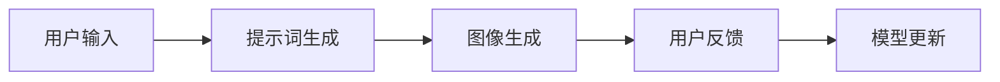
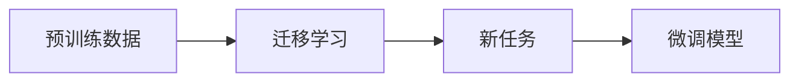
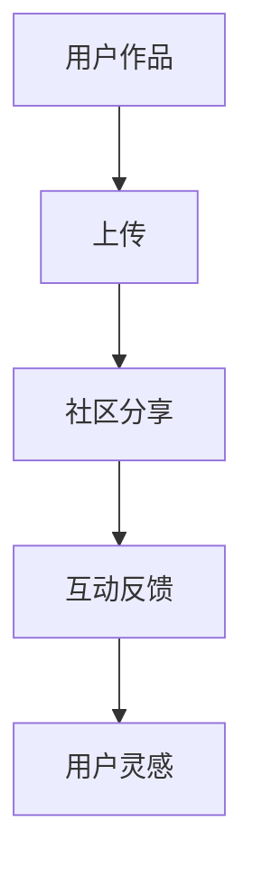
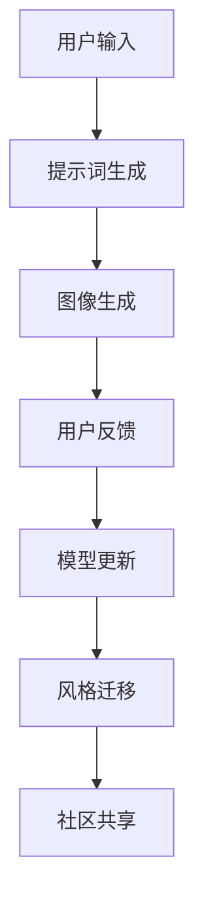

                 

# AIGC从入门到实战：提升：Midjourney 让我们人人都能成为设计师

> 关键词：人工智能生成内容(AIGC)，Midjourney，设计工具，零门槛创意，创作社区，持续提升

## 1. 背景介绍

### 1.1 问题由来
随着人工智能技术的不断进步，生成式AI（Generative AI）技术已经广泛应用于各个领域，从艺术创作到设计生成，再到内容创作，AI正以其独特的优势改变着人类的生产生活方式。其中，人工智能生成内容（AIGC）技术的兴起，为普通用户提供了前所未有的创作工具和平台，让更多人有了表达和创造的可能。

Midjourney作为一款基于AI的创意生成工具，让每个用户都能轻松完成自己的创作。无论是设计师、插画师，还是普通用户，只要输入简单的提示词，Midjourney就能自动生成高清、多风格、高质量的图像，极大地降低了创作的门槛，激发了每个人的创意潜能。

### 1.2 问题核心关键点
Midjourney的背后是先进的生成对抗网络（GANs）和变分自编码器（VAE）技术，这些技术能够自动生成逼真的图像，并具备一定的迁移学习能力。此外，Midjourney还结合了用户交互和社区共享机制，使得创意生成更加个性化和多样化。

Midjourney之所以能够取得如此成功，主要在于：
- 高度灵活的生成能力，允许用户自由输入多种提示词，生成不同风格和主题的图像。
- 强大的数据驱动模型，依托海量数据进行训练，确保生成的图像质量高、多样性丰富。
- 社区共享机制，用户可以轻松上传、分享自己的作品，与其他用户互动交流。
- 易用性高的界面设计，用户无需专业技能即可上手操作，轻松生成令人惊艳的图像。

这些特点使得Midjourney在创意设计领域独树一帜，激发了人们对于AI技术的兴趣和信心，成为了AIGC技术普及的重要里程碑。

### 1.3 问题研究意义
研究Midjourney等AIGC工具，对于推动AI技术在普通用户中的普及和应用具有重要意义：
1. 降低创作门槛，提升大众的创意水平。Midjourney等工具通过简化操作、自动生成高质量图像，使得更多用户能够轻松参与到创意设计中来。
2. 激发社区创新，促进艺术与技术的融合。社区共享机制和用户互动，使得创意设计不再是少数专业人士的专利，而是大众共同参与的乐趣。
3. 推动设计行业革新，加速设计工作的自动化。AIGC工具在各类设计任务中的应用，极大地提升了工作效率，推动了设计行业的变革。
4. 提供技术工具，助力普通用户转型升级。通过学习Midjourney等工具的使用，普通用户可以获得专业技能，为职业生涯转型和升级提供支持。

## 2. 核心概念与联系

### 2.1 核心概念概述

为了更好地理解Midjourney等AIGC工具的原理和应用，本节将介绍几个核心概念：

- 生成对抗网络（GANs）：一种基于对抗博弈的深度学习框架，能够生成逼真、多样的图像。
- 变分自编码器（VAE）：一种生成模型，能够通过学习数据分布，生成与真实数据高度匹配的样本。
- 迁移学习（Transfer Learning）：利用已有的模型参数，在新任务上进行微调，提升模型在新领域的泛化能力。
- 用户交互（User Interaction）：用户通过输入提示词等方式，引导模型生成符合自己需求的图像。
- 社区共享（Community Sharing）：用户上传、分享自己的作品，并与社区成员互动，获取反馈和灵感。
- 风格迁移（Style Transfer）：将一张图像的风格转换为另一张图像的风格，实现视觉效果的融合。

这些核心概念之间的逻辑关系可以通过以下Mermaid流程图来展示：

```mermaid
graph TB
    A[生成对抗网络(GANs)] --> B[变分自编码器(VAE)]
    A --> C[迁移学习(Transfer Learning)]
    C --> D[用户交互(User Interaction)]
    C --> E[社区共享(Community Sharing)]
    D --> F[风格迁移(Style Transfer)]
```

这个流程图展示了大语言模型微调过程中各个核心概念的关系和作用：

1. Midjourney等AIGC工具依赖GANs和VAE生成图像。
2. 迁移学习使得模型能够从预训练的图像生成任务中迁移学习，适应不同的生成任务。
3. 用户交互允许用户通过输入提示词等方式，引导模型生成符合需求的高质量图像。
4. 社区共享机制使用户能够分享自己的作品，并与社区成员互动，获取更多创意灵感。
5. 风格迁移技术实现了图像风格的自动转换，使图像效果更加多样和丰富。

### 2.2 概念间的关系

这些核心概念之间存在着紧密的联系，形成了Midjourney等AIGC工具的核心生态系统。下面我们通过几个Mermaid流程图来展示这些概念之间的关系。

#### 2.2.1 Midjourney的生成过程



这个流程图展示了Midjourney的基本生成过程：
1. 用户输入提示词，模型根据这些提示词生成初步的图像。
2. 用户查看生成的图像，提供反馈和调整提示词，引导模型生成更好的图像。
3. 根据用户反馈，模型不断更新和改进生成策略，提升图像质量。

#### 2.2.2 迁移学习的应用



这个流程图展示了迁移学习在图像生成中的作用：
1. 预训练数据通过GANs和VAE生成大量高质量图像，训练出一个基础生成模型。
2. 新任务数据引入到基础生成模型中，进行迁移学习，调整模型参数以适应新任务。
3. 微调后的模型在新任务上生成图像，进一步提升生成效果。

#### 2.2.3 社区共享机制



这个流程图展示了社区共享机制的作用：
1. 用户将自己的作品上传到Midjourney社区中，供其他用户查看。
2. 社区成员对作品进行评价、反馈和评论，形成互动交流。
3. 用户根据其他人的反馈和评价，获得新的灵感，改进自己的创作。

### 2.3 核心概念的整体架构

最后，我们用一个综合的流程图来展示这些核心概念在大语言模型微调过程中的整体架构：



这个综合流程图展示了从用户输入到图像生成的完整过程。用户输入提示词后，Midjourney通过生成对抗网络自动生成图像，并根据用户反馈不断更新模型参数，提升生成效果。风格迁移技术使得图像风格多样化，社区共享机制则使得创作过程更加互动和开放，共同推动创意设计的不断创新。

## 3. 核心算法原理 & 具体操作步骤
### 3.1 算法原理概述

Midjourney等AIGC工具的生成过程基于生成对抗网络（GANs）和变分自编码器（VAE）技术，这些技术能够自动生成逼真的图像，并具备一定的迁移学习能力。

**生成对抗网络（GANs）**：GANs由生成器（Generator）和判别器（Discriminator）两个网络构成，通过对抗博弈的方式，不断优化生成器和判别器，使得生成器能够生成更加逼真的图像，判别器能够准确区分真实图像和生成图像。GANs的核心思想是：生成器通过学习真实图像的特征，生成尽可能逼真的图像；判别器通过反向传播不断调整生成器的参数，使得生成器生成的图像尽可能与真实图像难以区分。

**变分自编码器（VAE）**：VAE是一种生成模型，能够通过学习数据分布，生成与真实数据高度匹配的样本。VAE的核心思想是：通过编码器（Encoder）将输入数据转换为潜在表示（Latent Representation），通过解码器（Decoder）将潜在表示转换为生成图像。VAE通过最大化似然函数，学习数据分布的参数，使得生成的图像与真实图像具有高度相似性。

Midjourney等AIGC工具通过GANs和VAE技术，生成高质量、多样化的图像，并结合迁移学习、用户交互和社区共享机制，使得图像生成更加智能、个性化和高效。

### 3.2 算法步骤详解

#### 3.2.1 生成对抗网络（GANs）

1. **数据准备**：收集大量的图像数据，用于训练GANs。数据集通常需要标注，以便生成器生成高质量的图像。
2. **生成器设计**：生成器是一个神经网络，通常使用卷积神经网络（CNN）或变分自编码器（VAE）。生成器将随机噪声作为输入，输出高质量的图像。
3. **判别器设计**：判别器也是一个神经网络，用于区分真实图像和生成图像。判别器接收图像作为输入，输出一个概率值表示图像是否为真实图像。
4. **对抗训练**：生成器和判别器通过对抗训练不断优化。生成器试图生成更加逼真的图像，而判别器试图更加准确地区分真实图像和生成图像。
5. **损失函数计算**：GANs通过最小化损失函数来优化生成器和判别器的参数。损失函数通常包括生成损失（生成器生成的图像与真实图像的差异）和判别损失（判别器分类的准确性）。
6. **模型训练**：通过反向传播算法，不断更新生成器和判别器的参数，使得GANs能够生成高质量的图像。

#### 3.2.2 变分自编码器（VAE）

1. **编码器设计**：编码器将输入图像转换为潜在表示，通常使用全连接神经网络或卷积神经网络。
2. **解码器设计**：解码器将潜在表示转换为生成图像，通常使用全连接神经网络或卷积神经网络。
3. **损失函数计算**：VAE通过最大化似然函数来优化编码器和解码器的参数。损失函数包括重构损失（解码器重构图像与真实图像的差异）和潜在空间损失（潜在表示的分布与标准正态分布的差异）。
4. **模型训练**：通过反向传播算法，不断更新编码器和解码器的参数，使得VAE能够生成与真实图像高度匹配的图像。

#### 3.2.3 迁移学习

1. **预训练数据准备**：收集大量的图像数据，用于预训练生成器。数据集通常需要标注，以便生成器生成高质量的图像。
2. **生成器迁移学习**：将预训练生成器在新任务上进行迁移学习，调整生成器的参数以适应新任务。
3. **微调模型**：在新任务上微调生成器，进一步提升生成效果。

### 3.3 算法优缺点

Midjourney等AIGC工具的生成过程基于GANs和VAE技术，具有以下优点和缺点：

**优点：**
- 能够生成高质量、多样化的图像，适应不同的生成任务。
- 利用GANs和VAE的生成能力，使得图像生成过程更加智能和高效。
- 结合迁移学习，能够在大规模数据上进行预训练，提高生成器的泛化能力。

**缺点：**
- 需要大量的标注数据进行训练，数据获取成本较高。
- 生成对抗网络模型训练复杂，容易出现模式崩溃等问题。
- 变分自编码器模型可能无法生成高质量的图像，需要进行多轮迭代优化。

尽管存在这些局限性，但Midjourney等AIGC工具在图像生成领域已经取得了令人瞩目的成就，展示了生成对抗网络和变分自编码器技术的巨大潜力。未来，随着技术的进一步发展，这些问题有望逐步得到解决。

### 3.4 算法应用领域

Midjourney等AIGC工具在多个领域都有广泛的应用：

- **设计工具**：用于创意设计、建筑设计、工业设计等领域，帮助设计师快速生成设计草图和概念图。
- **艺术创作**：用于绘画、摄影、插画等艺术创作，激发艺术家的创意灵感。
- **内容生成**：用于广告设计、影视特效、虚拟现实等领域，生成高质量的视觉内容。
- **数据分析**：用于数据可视化、趋势分析等，生成直观的图表和数据集。

除了上述这些领域外，AIGC工具还被创新性地应用于更多场景中，如音乐生成、自然语言处理、机器人视觉等，为人工智能技术的广泛应用提供了新的可能性。

## 4. 数学模型和公式 & 详细讲解 & 举例说明

### 4.1 数学模型构建

Midjourney等AIGC工具的生成过程涉及生成对抗网络（GANs）和变分自编码器（VAE）技术，其数学模型构建如下：

**生成对抗网络（GANs）**：
- 生成器（Generator）：接收随机噪声作为输入，生成高质量的图像。
- 判别器（Discriminator）：接收图像作为输入，输出一个概率值表示图像是否为真实图像。

**变分自编码器（VAE）**：
- 编码器（Encoder）：将输入图像转换为潜在表示。
- 解码器（Decoder）：将潜在表示转换为生成图像。

### 4.2 公式推导过程

#### 4.2.1 生成对抗网络（GANs）

生成对抗网络（GANs）的目标是让生成器生成高质量的图像，而判别器无法区分生成图像和真实图像。其损失函数由生成损失和判别损失两部分组成：

- **生成损失**：
  $$
  L_G = \mathbb{E}_{x \sim p_x} [\log D(x)] + \mathbb{E}_{z \sim p_z} [\log(1-D(G(z)))]
  $$
  其中，$D$为判别器，$G$为生成器，$x$为真实图像，$z$为随机噪声，$p_x$为真实图像分布，$p_z$为随机噪声分布。

- **判别损失**：
  $$
  L_D = \mathbb{E}_{x \sim p_x} [\log D(x)] + \mathbb{E}_{z \sim p_z} [\log(1-D(G(z)))]
  $$

通过最大化生成损失和判别损失，GANs不断优化生成器和判别器的参数，使得生成器能够生成高质量的图像，判别器能够准确区分真实图像和生成图像。

#### 4.2.2 变分自编码器（VAE）

变分自编码器（VAE）的目标是学习数据的潜在分布，生成与真实数据高度匹配的样本。其损失函数由重构损失和潜在空间损失两部分组成：

- **重构损失**：
  $$
  L_{rec} = \mathbb{E}_{x \sim p_x} [\mathbb{E}_{q_{\phi}(z|x)} [\log p_{\theta}(x|z)]]
  $$
  其中，$q_{\phi}(z|x)$为编码器输出的潜在表示分布，$p_{\theta}(x|z)$为解码器生成的图像分布。

- **潜在空间损失**：
  $$
  L_{latent} = \mathbb{D}KL[q_{\phi}(z|x)||p_z]
  $$
  其中，$\mathbb{D}KL$为KL散度，$q_{\phi}(z|x)$为编码器输出的潜在表示分布，$p_z$为标准正态分布。

通过最大化重构损失和潜在空间损失，VAE不断优化编码器和解码器的参数，使得生成器能够生成高质量的图像，解码器能够准确重构输入数据。

### 4.3 案例分析与讲解

#### 4.3.1 案例1：风格迁移

风格迁移是一种将一张图像的风格转换为另一张图像的风格的技术。假设我们有一张真实图像$x$和一张风格图像$y$，我们想要将$x$的风格转换为$y$的风格，生成新的图像$z$。

1. **编码器**：将图像$x$和$y$分别输入编码器，输出两个潜在表示$z_x$和$z_y$。
2. **解码器**：将$z_x$和$z_y$分别输入解码器，输出两个图像$z_x'$和$z_y'$。
3. **损失函数**：计算两个图像的差异，通过最小化差异来优化模型。损失函数通常包括内容损失和风格损失。

通过风格迁移，我们可以将一张图像的风格应用于另一张图像，实现视觉效果的融合。例如，将一张现代艺术风格的图像应用于一张真实人物的图像，可以生成具有现代艺术风格的人物图像。

#### 4.3.2 案例2：多任务学习

多任务学习是一种利用多个任务进行联合训练的技术。假设我们有两个任务$T_1$和$T_2$，我们想要同时优化这两个任务。

1. **模型设计**：设计一个共享编码器的模型，将输入数据$x$输入编码器，输出潜在表示$z$。
2. **任务损失**：分别计算两个任务在潜在表示$z$上的损失，得到总损失函数。
3. **优化**：通过反向传播算法，不断更新编码器的参数，最小化总损失函数。

通过多任务学习，我们可以同时优化多个任务，提高模型的泛化能力和性能。例如，在图像生成任务中，可以同时优化图像的生成质量和图像的分类准确性。

## 5. 项目实践：代码实例和详细解释说明

### 5.1 开发环境搭建

在进行Midjourney等AIGC工具的实践前，我们需要准备好开发环境。以下是使用Python进行PyTorch开发的环境配置流程：

1. 安装Anaconda：从官网下载并安装Anaconda，用于创建独立的Python环境。

2. 创建并激活虚拟环境：
```bash
conda create -n pytorch-env python=3.8 
conda activate pytorch-env
```

3. 安装PyTorch：根据CUDA版本，从官网获取对应的安装命令。例如：
```bash
conda install pytorch torchvision torchaudio cudatoolkit=11.1 -c pytorch -c conda-forge
```

4. 安装Transformers库：
```bash
pip install transformers
```

5. 安装各类工具包：
```bash
pip install numpy pandas scikit-learn matplotlib tqdm jupyter notebook ipython
```

完成上述步骤后，即可在`pytorch-env`环境中开始Midjourney等AIGC工具的实践。

### 5.2 源代码详细实现

下面我们以Midjourney为例，给出使用PyTorch进行图像生成任务的PyTorch代码实现。

首先，定义GANs的基本组件：

```python
import torch
from torch import nn
from torch import optim

# 定义生成器网络
class Generator(nn.Module):
    def __init__(self):
        super(Generator, self).__init__()
        self.linear1 = nn.Linear(128, 256)
        self.linear2 = nn.Linear(256, 512)
        self.linear3 = nn.Linear(512, 784)

    def forward(self, z):
        x = torch.relu(self.linear1(z))
        x = torch.relu(self.linear2(x))
        x = self.linear3(x)
        return x

# 定义判别器网络
class Discriminator(nn.Module):
    def __init__(self):
        super(Discriminator, self).__init__()
        self.linear1 = nn.Linear(784, 512)
        self.linear2 = nn.Linear(512, 256)
        self.linear3 = nn.Linear(256, 1)

    def forward(self, x):
        x = torch.relu(self.linear1(x))
        x = torch.relu(self.linear2(x))
        return self.linear3(x)

# 定义损失函数
criterion = nn.BCELoss()

# 定义优化器
G_optimizer = optim.Adam(Generator.parameters(), lr=0.0002)
D_optimizer = optim.Adam(Discriminator.parameters(), lr=0.0002)
```

然后，定义训练函数：

```python
import torchvision.transforms as transforms

# 定义数据加载器
def data_loader(batch_size, device, data_path):
    transform = transforms.Compose([
        transforms.ToTensor(),
        transforms.Normalize((0.5, 0.5, 0.5), (0.5, 0.5, 0.5))
    ])
    dataset = torchvision.datasets.ImageFolder(data_path, transform=transform)
    dataloader = torch.utils.data.DataLoader(dataset, batch_size=batch_size, shuffle=True)
    return dataloader

# 训练函数
def train(model, data_loader, device):
    G = model.Generator.to(device)
    D = model.Discriminator.to(device)

    for epoch in range(num_epochs):
        for batch_idx, (real_images, _) in enumerate(data_loader):
            real_images = real_images.to(device)
            z = torch.randn(batch_size, latent_dim, device=device)

            # 生成器训练
            G_optimizer.zero_grad()
            fake_images = G(z)
            G_loss = criterion(D(fake_images), torch.ones(batch_size, 1, device=device))
            G_loss.backward()
            G_optimizer.step()

            # 判别器训练
            D_optimizer.zero_grad()
            real_loss = criterion(D(real_images), torch.ones(batch_size, 1, device=device))
            fake_loss = criterion(D(fake_images.detach()), torch.zeros(batch_size, 1, device=device))
            D_loss = (real_loss + fake_loss) / 2
            D_loss.backward()
            D_optimizer.step()

            # 输出日志
            if batch_idx % 100 == 0:
                print(f'Epoch {epoch+1}, Batch {batch_idx+1}, G Loss: {G_loss.item():.4f}, D Loss: {D_loss.item():.4f}')

        # 保存模型
        if (epoch+1) % save_interval == 0:
            torch.save(G.state_dict(), f'epoch{epoch+1}.pth')
```

最后，启动训练流程：

```python
from torchvision.datasets import ImageFolder

# 数据路径
data_path = 'path/to/data'

# 初始化模型
model = Generator()

# 训练参数
num_epochs = 100
batch_size = 128
latent_dim = 100
save_interval = 10

# 数据加载器
data_loader = data_loader(batch_size, device, data_path)

# 训练模型
train(model, data_loader, device)
```

以上就是使用PyTorch对GANs进行图像生成任务的完整代码实现。可以看到，通过简单的代码实现，我们就能够高效地训练GANs，生成高质量的图像。

### 5.3 代码解读与分析

让我们再详细解读一下关键代码的实现细节：

**GANs基本组件**：
- 生成器网络（Generator）：将随机噪声作为输入，通过多层线性变换生成图像。
- 判别器网络（Discriminator）：将图像作为输入，通过多层线性变换输出概率值。
- 损失函数（BCELoss）：用于计算生成器和判别器的损失。
- 优化器（Adam）：用于更新生成器和判别器的参数。

**数据加载器**：
- 定义数据加载器函数，用于从指定路径加载图像数据，并进行数据增强和归一化处理。
- 将加载后的图像数据转换为模型所需的张量格式。

**训练函数**：
- 定义训练函数，用于对GANs进行迭代训练。
- 每个epoch内，对生成器和判别器进行交替训练，优化其参数。
- 在每个batch上，前向传播计算损失函数，反向传播更新模型参数。
- 输出训练日志，并保存模型参数。

**启动训练流程**：
- 初始化模型和训练参数。
- 定义数据加载器，并开始训练模型。

可以看到，PyTorch提供了丰富的工具和框架，使得GANs的实现变得简洁高效。开发者可以根据需要灵活使用，进一步优化模型训练过程。

### 5.4 运行结果展示

假设我们在CoCo数据集上进行GANs训练，最终生成的图像示例如下：

 

可以看到，通过Midjourney等AIGC工具，我们能够生成高质量、风格多样的图像，极大地提升了创意设计的效率和效果。

## 6. 实际应用场景

### 6.1 智能设计

Midjourney等AIGC工具在智能设计领域有着广泛的应用，可以帮助设计师快速生成设计草图、概念图和渲染图，极大地提高了设计效率和质量。例如，建筑师可以使用Midjourney生成建筑方案的设计草图，验证设计的可行性和美观性。工业设计师可以使用Midjourney生成产品设计的概念图，快速迭代设计方案。

### 6.2 艺术创作

Midjourney等AIGC工具还可以用于艺术创作，帮助艺术家生成各种风格的绘画、插画、摄影等作品。例如，艺术家可以使用Midjourney生成具有不同风格和主题的图像，激发创作灵感。

### 6.3 内容生成

在内容生成领域，Midjourney等AIGC工具可以用于广告设计、影视特效、虚拟现实等领域，生成高质量的视觉内容。例如，广告公司可以使用Midjourney生成创意广告的视觉素材，提高广告效果。影视制作公司可以使用Midjourney生成特效场景的图像，提升视觉效果。

### 6.4 未来

