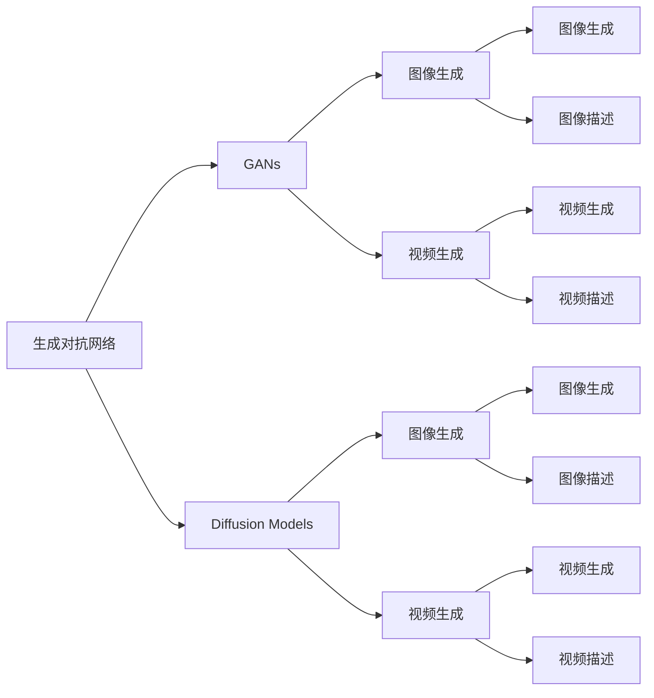
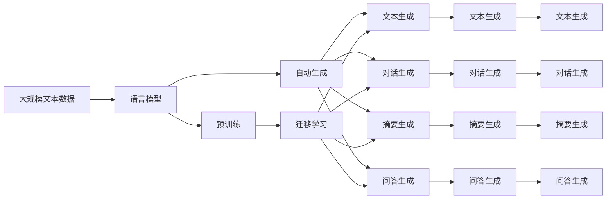

                 

# AIGC从入门到实战：落霞与孤鹜齐飞：AIGC 汹涌而来

> 关键词：生成对抗网络(GANs), 扩散模型(Diffusion Models), 语言模型(Generative Pre-trained Language Models, GPT), 自监督学习(Self-Supervised Learning), 神经网络(Neural Network)

## 1. 背景介绍

### 1.1 问题由来

随着深度学习技术的发展，人工智能（AI）领域进入了快速迭代和突破的新阶段。在过去的几十年里，我们见证了从基于规则的专家系统到神经网络再到深度学习的蜕变。今天，人工智能已经开始应用到各种领域，从医疗到金融，从教育到娱乐，无处不在。

在这个新阶段，生成对抗网络（GANs）、扩散模型（Diffusion Models）、语言模型（Generative Pre-trained Language Models, GPT）等生成模型（Generative Models）逐渐成为人工智能研究的热点。它们能够生成高质量的图像、视频、文本等，为机器学习、计算机视觉和自然语言处理等领域带来了革命性的变化。

**背景信息**

- **生成对抗网络（GANs）**：一种由生成器和判别器两个神经网络组成的框架，它们相互竞争，从而生成逼真的图像或视频。GANs包括各种变体，如Wasserstein GANs和条件GANs。
- **扩散模型（Diffusion Models）**：一种生成模型，它通过逐步添加噪声来生成高质量的图像和视频。扩散模型利用了数据分布的潜在信息，如图像扩散过程。
- **语言模型（GPT）**：利用大规模语料库预训练的神经网络模型，如GPT-1, GPT-2, GPT-3。这些模型能够生成连贯、流畅的文本，广泛应用于自动生成、问答、翻译等任务。
- **自监督学习（Self-Supervised Learning）**：一种无需人工标注数据的学习方法，通过自动设计的任务（如语言模型预测、图像分类等）来训练模型。自监督学习可以大大减少对标注数据的依赖，提高模型的泛化能力。
- **神经网络（Neural Network）**：一种基于人工神经元模型的计算模型，可以用于解决各种复杂的问题。神经网络包括卷积神经网络（CNN）、循环神经网络（RNN）和变分自编码器（VAE）等。

### 1.2 问题核心关键点

AIGC（人工智能生成内容）技术已经在图像、视频、音频、文本等多个领域取得了显著进展。在图像生成领域，GANs和Diffusion Models能够生成高质量、逼真的图像。在视频生成领域，基于GANs和自监督学习的方法可以生成流畅、逼真的视频。在音频生成领域，神经网络能够生成逼真的语音和音乐。在文本生成领域，GPT等语言模型可以生成连贯、流畅的文本，广泛应用于自动生成、问答、翻译等任务。

AIGC技术的应用范围非常广泛，包括：
- **自然语言处理**：自动生成对话、翻译、摘要、问答等文本内容。
- **计算机视觉**：自动生成图像、视频、图像描述等。
- **音频生成**：自动生成语音、音乐、音频描述等。
- **增强现实**：生成虚拟对象、场景，增强用户体验。
- **虚拟现实**：生成逼真的虚拟环境，为用户提供沉浸式体验。

### 1.3 问题研究意义

研究AIGC技术，对于拓展人工智能的应用范围，提升模型的性能，加速人工智能技术的产业化进程，具有重要意义：

1. **降低应用开发成本**：基于AIGC技术的自动生成内容，可以显著减少从头开发所需的数据、计算和人力等成本投入。
2. **提升模型效果**：AIGC技术能够生成高质量、逼真的内容，提升模型的表现力和可解释性。
3. **加速开发进度**：AIGC技术可以加速内容生成过程，缩短开发周期，提高开发效率。
4. **带来技术创新**：AIGC技术催生了如生成对抗网络、扩散模型、语言模型等新的研究方向，推动了人工智能技术的发展。
5. **赋能产业升级**：AIGC技术为各行各业数字化转型提供了新的技术路径，提高了生产力和市场竞争力。

## 2. 核心概念与联系

### 2.1 核心概念概述

为更好地理解AIGC技术的核心原理和应用，本节将介绍几个密切相关的核心概念：

- **生成对抗网络（GANs）**：由生成器和判别器两个神经网络组成的框架，通过对抗训练生成高质量的图像或视频。
- **扩散模型（Diffusion Models）**：通过逐步添加噪声来生成高质量的图像或视频，利用数据分布的潜在信息。
- **语言模型（GPT）**：利用大规模语料库预训练的神经网络模型，能够生成连贯、流畅的文本内容。
- **自监督学习（SSL）**：无需人工标注数据的学习方法，通过自动设计任务来训练模型，提高模型的泛化能力。
- **神经网络（Neural Network）**：一种基于人工神经元模型的计算模型，可以用于解决各种复杂问题。

- **生成模型（Generative Models）**：能够生成高质量、逼真内容的技术，包括GANs、Diffusion Models、GPT等。

### 2.2 概念间的关系

这些核心概念之间存在着紧密的联系，形成了AIGC技术的完整生态系统。下面我们通过几个Mermaid流程图来展示这些概念之间的关系：



这个流程图展示了大规模生成模型GANs和Diffusion Models的常见应用，包括图像生成和视频生成。GANs和Diffusion Models分别从对抗训练和噪声扩散的角度生成高质量的图像和视频。

### 2.3 核心概念的整体架构

最后，我们用一个综合的流程图来展示这些核心概念在大规模生成模型中的应用：



这个综合流程图展示了从预训练到生成任务适配的过程。大规模文本数据通过语言模型进行预训练，然后通过迁移学习适配不同的自动生成任务，包括文本生成、对话生成、摘要生成和问答生成。通过这些任务的适配，语言模型能够生成高质量的文本内容，广泛应用于各类场景。

## 3. 核心算法原理 & 具体操作步骤

### 3.1 算法原理概述

AIGC技术主要基于生成模型，利用深度神经网络生成高质量的内容。这些生成模型通常通过自监督学习或监督学习的方式进行预训练，然后在目标任务上进行微调或直接应用于生成任务。

**算法概述**

- **GANs**：通过生成器和判别器两个神经网络进行对抗训练，生成高质量的图像或视频。
- **Diffusion Models**：通过逐步添加噪声生成高质量的图像或视频，利用数据分布的潜在信息。
- **GPT**：利用大规模语料库预训练的神经网络模型，生成连贯、流畅的文本内容。

AIGC技术的核心思想是利用生成模型生成高质量的内容，而微调或直接应用于生成任务的过程则是让模型学习目标任务的特点，从而生成更加符合需求的内容。

### 3.2 算法步骤详解

**GANs生成图像的步骤**

1. **生成器（Generator）**：生成高分辨率的图像。
2. **判别器（Discriminator）**：判断图像是否真实。
3. **对抗训练（Adversarial Training）**：生成器生成假图像，判别器判断真伪，生成器优化其生成质量。

**Diffusion Models生成图像的步骤**

1. **扩散过程（Diffusion Process）**：逐步添加噪声生成低分辨率的图像。
2. **反扩散过程（Diffusion Process Inverse）**：逐步去除噪声生成高质量的图像。

**GPT生成文本的步骤**

1. **语言模型预训练（Pre-training）**：利用大规模语料库预训练神经网络模型。
2. **自动生成（Auto-generation）**：在目标任务上进行微调，生成高质量的文本内容。

### 3.3 算法优缺点

**GANs的优缺点**

- **优点**：
  - 可以生成高质量、逼真的图像和视频。
  - 适用于复杂、多样化的生成任务。
  - 对抗训练可以提升生成模型的鲁棒性。

- **缺点**：
  - 训练过程不稳定，容易产生模式崩溃。
  - 生成结果可能存在伪影和噪声。
  - 难以控制生成内容的多样性和风格。

**Diffusion Models的优缺点**

- **优点**：
  - 可以生成高质量、逼真的图像和视频。
  - 生成过程可控，可以通过调整噪声强度控制生成质量。
  - 利用数据分布的潜在信息，生成结果更加多样和自然。

- **缺点**：
  - 训练过程复杂，需要大量的计算资源。
  - 需要设计合理的噪声添加和去除策略。
  - 生成结果可能存在伪影和噪声。

**GPT的优缺点**

- **优点**：
  - 可以生成连贯、流畅的文本内容。
  - 适用于自动生成、问答、翻译等任务。
  - 模型预训练过程不需要大量标注数据。

- **缺点**：
  - 生成结果可能存在逻辑错误和事实错误。
  - 难以控制生成内容的多样性和风格。
  - 需要大量的计算资源进行预训练和微调。

### 3.4 算法应用领域

AIGC技术已经在多个领域得到广泛应用，包括但不限于：

- **娱乐与游戏**：生成逼真的图像、视频、音频和对话，提升用户体验。
- **广告与营销**：自动生成广告文案、视频广告、图像广告，提升营销效果。
- **医疗与健康**：生成医学图像、健康咨询、病历记录，提高医疗效率。
- **教育与培训**：生成教育视频、虚拟实验室、自动评估，提升教育质量。
- **交通与导航**：生成导航地图、路线规划、交通模拟，提升交通效率。
- **文化与艺术**：生成艺术品、文学作品、音乐作品，推动文化创意产业。

## 4. 数学模型和公式 & 详细讲解 & 举例说明

### 4.1 数学模型构建

AIGC技术的数学模型主要基于神经网络和生成模型，包括自监督学习、对抗训练、扩散模型等。下面我们以GANs为例，详细讲解其数学模型构建。

**GANs的数学模型**

1. **生成器（Generator）**：将随机噪声映射为图像。
2. **判别器（Discriminator）**：判断图像是否真实。
3. **对抗训练**：生成器和判别器进行对抗训练，优化生成器的生成质量。

**Diffusion Models的数学模型**

1. **扩散过程（Diffusion Process）**：逐步添加噪声生成低分辨率的图像。
2. **反扩散过程（Diffusion Process Inverse）**：逐步去除噪声生成高质量的图像。

**GPT的数学模型**

1. **语言模型预训练**：利用大规模语料库预训练神经网络模型。
2. **自动生成**：在目标任务上进行微调，生成高质量的文本内容。

### 4.2 公式推导过程

**GANs的公式推导**

1. **生成器（Generator）**：将随机噪声映射为图像。
   - $z \sim p(z)$
   - $x = G(z)$

2. **判别器（Discriminator）**：判断图像是否真实。
   - $x \sim p(x)$
   - $p(x|y=1)$ 表示真实图像的概率分布，$p(x|y=0)$ 表示假图像的概率分布。
   - $p(x) = p(x|y=1)p(y=1) + p(x|y=0)p(y=0)$

3. **对抗训练（Adversarial Training）**：生成器和判别器进行对抗训练，优化生成器的生成质量。
   - $J_G = E_{z \sim p(z)}[logD(G(z))]$ 表示生成器的损失函数。
   - $J_D = E_{x \sim p(x)}[logD(x)] + E_{z \sim p(z)}[log(1-D(G(z)))]$ 表示判别器的损失函数。

**Diffusion Models的公式推导**

1. **扩散过程（Diffusion Process）**：逐步添加噪声生成低分辨率的图像。
   - $x_t = x_0 + \sqrt{1-\beta_t} \cdot \epsilon_t$

2. **反扩散过程（Diffusion Process Inverse）**：逐步去除噪声生成高质量的图像。
   - $x_{t-1} = \frac{1}{\sqrt{1-\beta_t}} (x_t - \sqrt{\beta_t} \cdot \epsilon_t)$

**GPT的公式推导**

1. **语言模型预训练**：利用大规模语料库预训练神经网络模型。
   - $P(w_1, w_2, ..., w_n)$ 表示文本的概率分布。

2. **自动生成**：在目标任务上进行微调，生成高质量的文本内容。
   - $P(y|x, \theta)$ 表示在目标任务上的生成概率。
   - $p_{\theta}(y|x) = softmax(\text{MLP}(\text{CNN}(x); \theta))$ 表示生成模型的概率分布。

### 4.3 案例分析与讲解

**GANs生成图像的案例**

- **案例1**：MNIST数字图像生成。
  - 生成器：$x = G(z)$
  - 判别器：$p(x|y=1)$ 表示真实图像的概率分布，$p(x|y=0)$ 表示假图像的概率分布。
  - 对抗训练：$J_G = E_{z \sim p(z)}[logD(G(z))]$ 表示生成器的损失函数。

**Diffusion Models生成图像的案例**

- **案例1**：CIFAR-10图像生成。
  - 扩散过程：$x_t = x_0 + \sqrt{1-\beta_t} \cdot \epsilon_t$
  - 反扩散过程：$x_{t-1} = \frac{1}{\sqrt{1-\beta_t}} (x_t - \sqrt{\beta_t} \cdot \epsilon_t)$

**GPT生成文本的案例**

- **案例1**：文本生成。
  - 语言模型预训练：$P(w_1, w_2, ..., w_n)$ 表示文本的概率分布。
  - 自动生成：$P(y|x, \theta)$ 表示在目标任务上的生成概率。
  - 生成模型的概率分布：$p_{\theta}(y|x) = softmax(\text{MLP}(\text{CNN}(x); \theta))$

## 5. 项目实践：代码实例和详细解释说明

### 5.1 开发环境搭建

在进行AIGC项目实践前，我们需要准备好开发环境。以下是使用Python进行PyTorch和TensorFlow开发的Python环境配置流程：

1. 安装Anaconda：从官网下载并安装Anaconda，用于创建独立的Python环境。

2. 创建并激活虚拟环境：
```bash
conda create -n pytorch-env python=3.8 
conda activate pytorch-env
```

3. 安装PyTorch和TensorFlow：根据CUDA版本，从官网获取对应的安装命令。例如：
```bash
conda install pytorch torchvision torchaudio cudatoolkit=11.1 -c pytorch -c conda-forge
conda install tensorflow
```

4. 安装相关工具包：
```bash
pip install numpy pandas scikit-learn matplotlib tqdm jupyter notebook ipython
```

完成上述步骤后，即可在`pytorch-env`环境中开始AIGC实践。

### 5.2 源代码详细实现

下面我们以GANs生成图像为例，给出使用PyTorch和TensorFlow进行GANs训练的Python代码实现。

**PyTorch实现**

```python
import torch
import torch.nn as nn
import torch.optim as optim
from torchvision.datasets import MNIST
from torchvision.transforms import ToTensor
from torchvision.utils import save_image
from torch.utils.data import DataLoader

# 定义生成器和判别器
class Generator(nn.Module):
    def __init__(self):
        super(Generator, self).__init__()
        self.layers = nn.Sequential(
            nn.Linear(100, 256),
            nn.LeakyReLU(),
            nn.Linear(256, 512),
            nn.LeakyReLU(),
            nn.Linear(512, 784),
            nn.Tanh()
        )

    def forward(self, z):
        x = self.layers(z)
        return x

class Discriminator(nn.Module):
    def __init__(self):
        super(Discriminator, self).__init__()
        self.layers = nn.Sequential(
            nn.Linear(784, 256),
            nn.LeakyReLU(),
            nn.Linear(256, 128),
            nn.LeakyReLU(),
            nn.Linear(128, 1),
            nn.Sigmoid()
        )

    def forward(self, x):
        x = self.layers(x)
        return x

# 定义GAN模型
class GAN(nn.Module):
    def __init__(self):
        super(GAN, self).__init__()
        self.generator = Generator()
        self.discriminator = Discriminator()

    def forward(self, z):
        fake = self.generator(z)
        real = self.discriminator(fake)
        return real

# 定义损失函数和优化器
criterion = nn.BCELoss()
optimizer_G = optim.Adam(model.parameters(), lr=0.0002)
optimizer_D = optim.Adam(model.parameters(), lr=0.0002)

# 加载数据集
train_dataset = MNIST(root='./data', train=True, download=True, transform=ToTensor())
train_loader = DataLoader(train_dataset, batch_size=64, shuffle=True)

# 训练过程
for epoch in range(100):
    for i, (img, _) in enumerate(train_loader):
        # 生成器前向传播和后向传播
        optimizer_G.zero_grad()
        z = torch.randn(img.size(0), 100, device='cuda')
        gen_img = model(z)
        loss_G = criterion(discriminator(gen_img), torch.ones_like(discriminator(gen_img)))
        loss_G.backward()
        optimizer_G.step()

        # 判别器前向传播和后向传播
        optimizer_D.zero_grad()
        loss_D_real = criterion(discriminator(img.to(device)), torch.ones_like(discriminator(img.to(device))))
        loss_D_fake = criterion(discriminator(gen_img), torch.zeros_like(discriminator(gen_img)))
        loss_D = (loss_D_real + loss_D_fake) / 2
        loss_D.backward()
        optimizer_D.step()

        if (i+1) % 100 == 0:
            print('Epoch [{}/{}], Step [{}/{}], Loss_G: {:.4f}, Loss_D: {:.4f}'
                  .format(epoch+1, 100, i+1, len(train_loader), loss_G.item(), loss_D.item()))

        if (i+1) % 1000 == 0:
            fake_img = gen_img[:16]
            fake_img = fake_img.view(-1, 28, 28, 1).cpu()
            save_image(fake_img, 'fake_images_{}.png'.format(epoch+1))
```

**TensorFlow实现**

```python
import tensorflow as tf
from tensorflow.keras.layers import Input, Dense, LeakyReLU, Flatten, Reshape
from tensorflow.keras.models import Model
from tensorflow.keras.optimizers import Adam
from tensorflow.keras.datasets import mnist

# 定义生成器和判别器
def build_generator(z_dim):
    inputs = Input(shape=(z_dim,))
    x = Dense(256)(inputs)
    x = LeakyReLU()(x)
    x = Dense(512)(x)
    x = LeakyReLU()(x)
    x = Dense(784, activation='tanh')(x)
    return Model(inputs, x)

def build_discriminator(img_shape):
    inputs = Input(shape=img_shape)
    x = Flatten()(inputs)
    x = Dense(256)(x)
    x = LeakyReLU()(x)
    x = Dense(128)(x)
    x = LeakyReLU()(x)
    x = Dense(1, activation='sigmoid')(x)
    return Model(inputs, x)

# 加载数据集
(x_train, y_train), _ = mnist.load_data()
x_train = x_train / 255.0
x_train = x_train.reshape(-1, 28, 28, 1)

# 定义生成器和判别器
generator = build_generator(100)
discriminator = build_discriminator((28, 28, 1))

# 定义GAN模型
def build_gan(generator, discriminator):
    discriminator.trainable = False
    inputs = Input(shape=(100,))
    fake = generator(inputs)
    real = discriminator(x_train)
    validity = discriminator(fake)
    return Model(inputs, validity)

model = build_gan(generator, discriminator)

# 定义损失函数和优化器
cross_entropy = tf.keras.losses.BinaryCrossentropy(from_logits=True)
optimizer_G = Adam(learning_rate=0.0002)
optimizer_D = Adam(learning_rate=0.0002)

# 训练过程
for epoch in range(100):
    for i, (img, _) in enumerate(train_dataset):
        img = img.reshape(-1, 28, 28, 1)
        img = img / 255.0

        # 生成器前向传播和后向传播
        optimizer_G.zero_grad()
        z = tf.random.normal([img.shape[0], 100])
        fake_img = generator(z)
        loss_G = cross_entropy(discriminator(fake_img), tf.ones_like(discriminator(fake_img)))
        loss_G.backward()
        optimizer_G.apply_gradients(zip([loss_G], generator.trainable_variables))

        # 判别器前向传播和后向传播
        optimizer_D.zero_grad()
        loss_D_real = cross_entropy(discriminator(img), tf.ones_like(discriminator(img)))
        loss_D_fake = cross_entropy(discriminator(fake_img), tf.zeros_like(discriminator(fake_img)))
        loss_D = (loss_D_real + loss_D_fake) / 2
        loss_D.backward()
        optimizer_D.apply_gradients(zip([loss_D], discriminator.trainable_variables))

        if (i+1) % 100 == 0:
            print('Epoch [{}/{}], Step [{}/{}], Loss_G: {:.4f}, Loss_D: {:.4f}'
                  .format(epoch+1, 100, i+1, len(train_dataset), loss_G.numpy().mean(), loss_D.numpy().mean()))

        if (i+1) % 1000 == 0:
            fake_img = fake_img[:16]
            fake_img = fake_img.numpy().reshape(-1, 28, 28, 1)
            tf.keras.utils.save_img('fake_images_{}.png'.format(epoch+1), fake_img)
```

以上就是使用PyTorch和TensorFlow进行GANs生成图像的完整代码实现。可以看到，通过PyTorch和TensorFlow的封装，我们可以用相对简洁的代码完成GANs模型的训练。

### 5.3 代码解读与分析

让我们再详细解读一下关键代码的实现细节：

**PyTorch实现**

**1. 定义生成器和判别器**

```python
class Generator(nn.Module):
    def __init__(self):
        super(Generator, self).__init__()
        self.layers = nn.Sequential(
            nn.Linear(100, 256),
            nn.LeakyReLU(),
            nn.Linear(256, 512),
            nn.LeakyReLU(),
            nn.Linear(512, 784),
            nn.Tanh()
        )

    def forward(self, z):
        x = self.layers(z)
        return x

class Discriminator(nn.Module):
    def __init__(self):
        super(Discriminator, self).__init__()
        self.layers = nn.Sequential(
            nn.Linear(784, 256),
            nn.LeakyReLU(),
            nn.Linear(256, 128),
            nn.LeakyReLU(),
            nn.Linear(128, 1),
            nn.Sigmoid()
        )

    def forward(self, x):
        x = self.layers(x)
        return x
```

这个部分定义了生成器和判别器的神经网络结构。生成器将随机噪声映射为图像，判别器则判断图像是否真实。

**2. 定义GAN模型**

```python
class GAN(nn.Module):
    def __init__(self):
        super(GAN, self).__init__()
        self.generator = Generator()
        self.discriminator = Discriminator()

    def forward(self, z):
        fake = self.generator(z)
        real = self.discriminator(fake)
        return real
```

这个部分定义了GAN模型，将生成器和判别器进行组合，形成完整的GAN网络。

**3. 定义损失函数和优化器**

```python
criterion

