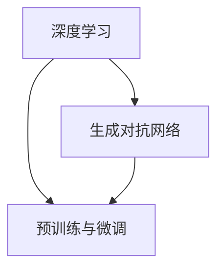

                 

# AIGC从入门到实战：递进：人工智能时代的变化

## 1. 背景介绍

在人工智能时代，人工智能生成内容(AI Generated Content, AIGC)正以惊人的速度发展，成为互联网、媒体、广告、教育等各行各业的重大变革力量。从文本生成、图像生成到视频生成，AIGC技术正在全面渗透到人们的生产生活各个角落，重塑传统行业的数字化转型路径。

AIGC技术的兴起，背后是深度学习、自然语言处理、计算机视觉、生成对抗网络等前沿技术的深度融合。其核心在于通过算法模型，利用大量无标注数据进行预训练，然后在任务上微调，生成出高质量的文本、图像、音频等内容。

### 1.1 问题由来

AIGC技术应用的广泛性和实用价值，吸引了全球研究者和企业投身其中。但随之而来的挑战也显而易见：

- **数据质量与标注成本**：高质量的标注数据对于AIGC模型至关重要，但数据标注需要大量人力物力，且难以覆盖所有场景。
- **计算资源消耗**：AIGC模型的参数量巨大，预训练和微调过程需要强大的计算资源。
- **鲁棒性和泛化能力**：生成的内容需要具备较高的鲁棒性和泛化能力，以应对多变的输入数据。
- **技术落地难度**：AIGC技术需要与业务紧密结合，实现大规模部署和应用，但不同行业的应用场景和技术要求各异，落地难度大。

这些挑战不仅制约了AIGC技术的发展，也对其应用前景带来了不确定性。本文将围绕这些核心问题，系统介绍AIGC技术的核心概念、算法原理与应用实践，并提出解决策略，旨在帮助开发者全面掌握AIGC技术的入门与实战技巧。

## 2. 核心概念与联系

### 2.1 核心概念概述

AIGC技术涉及多个核心概念，包括但不限于深度学习、生成对抗网络、预训练与微调等。这些概念之间相互关联，共同构成AIGC技术的核心架构。

- **深度学习**：一种基于神经网络的机器学习技术，通过大量数据进行训练，使模型能够从数据中学习到复杂特征和模式。
- **生成对抗网络**：一种由生成器和判别器两个网络组成的框架，通过对抗训练的方式，生成高质量的样本数据。
- **预训练与微调**：通过在大规模无标签数据上进行预训练，学习通用的语言、图像、声音等特征，然后通过下游任务的数据进行微调，提升模型在特定任务上的表现。

### 2.2 核心概念间的关系

AIGC技术的核心概念之间存在紧密的联系，可以用以下Mermaid流程图来展示：



- 深度学习提供了强大的特征提取和表示能力，生成对抗网络则提供了高质量的数据生成手段。
- 预训练与微调作为AIGC技术的核心范式，利用大规模无标签数据进行预训练，通过下游任务数据进行微调，实现了模型在特定任务上的高效适配。

## 3. 核心算法原理 & 具体操作步骤
### 3.1 算法原理概述

AIGC技术的主要算法原理包括深度学习、生成对抗网络和预训练与微调。其中，深度学习提供了基础的特征提取和表示能力，生成对抗网络则通过对抗训练的方式，生成高质量的样本数据，而预训练与微调则是AIGC技术的核心范式。

### 3.2 算法步骤详解

基于深度学习、生成对抗网络和预训练与微调技术，AIGC技术通常包括以下几个关键步骤：

1. **数据准备**：收集高质量的标注数据，准备用于模型训练和微调的数据集。
2. **模型选择与构建**：选择合适的深度学习模型，如Transformer、GAN等，并设计合适的模型架构。
3. **预训练**：在大规模无标签数据上进行预训练，学习通用的语言、图像、声音等特征。
4. **微调**：在下游任务的数据上微调模型，通过有监督学习优化模型在特定任务上的性能。
5. **评估与部署**：评估微调后模型的性能，并将其部署到实际应用中。

### 3.3 算法优缺点

AIGC技术具有以下优点：

- **高效生成**：利用预训练与微调技术，AIGC模型能够高效生成高质量的内容，适用于文本、图像、视频等多种媒体。
- **泛化能力强**：AIGC模型具备较强的泛化能力，能够应对多样化的输入数据。
- **灵活应用**：AIGC技术可应用于多种场景，如新闻生成、广告创作、视频编辑、智能客服等。

同时，AIGC技术也存在一些缺点：

- **数据依赖**：AIGC模型对标注数据质量要求高，缺乏标注数据时效果受限。
- **计算资源消耗大**：深度学习模型的参数量大，预训练和微调过程需要强大的计算资源。
- **内容真实性问题**：生成的内容可能存在不真实、偏见等问题，需要额外验证和优化。
- **可解释性不足**：深度学习模型通常被视为"黑盒"，难以解释其内部决策过程。

### 3.4 算法应用领域

AIGC技术已经被广泛应用于多个领域，包括但不限于：

- **文本生成**：用于新闻生成、小说创作、论文写作、自动摘要等。
- **图像生成**：用于图像修复、风格转换、人脸生成、虚拟场景等。
- **视频生成**：用于视频剪辑、特效制作、虚拟主播、虚拟现实等。
- **音乐生成**：用于音乐创作、歌曲生成、声音合成等。

## 4. 数学模型和公式 & 详细讲解  
### 4.1 数学模型构建

AIGC技术的核心模型构建主要基于深度学习，特别是基于神经网络的模型。以文本生成为例，常用的模型包括生成式对抗网络(GAN)、Transformer等。

假设我们要生成一篇新闻文章，可以将文本表示为一个序列 $X = (x_1, x_2, ..., x_n)$，其中 $x_i$ 表示文本中的第 $i$ 个单词或字符。我们可以使用以下模型来生成文本：

$$
P(X) = \prod_{i=1}^n P(x_i | X_{<i})
$$

其中 $P(x_i | X_{<i})$ 表示给定前 $i-1$ 个单词的情况下，第 $i$ 个单词的概率分布。

### 4.2 公式推导过程

以文本生成的生成式对抗网络为例，其推导过程如下：

- **生成器**：假设生成器模型为 $G(z)$，其中 $z$ 是噪声向量，$G(z)$ 表示从噪声向量 $z$ 生成文本的概率分布 $P(X|z)$。
- **判别器**：判别器模型为 $D(X)$，用于判断输入文本 $X$ 是否为真实文本，$D(X)$ 表示文本的真实性概率。

生成器和判别器的目标分别为：

- 生成器的目标：最小化生成文本与真实文本的差异，即最大化 $P(X|z)$。
- 判别器的目标：最大化判别真实文本与生成文本的差异，即最大化 $D(X)$。

通过对抗训练的方式，生成器和判别器互相博弈，最终生成器生成高质量的文本，判别器难以区分真实文本和生成文本。

### 4.3 案例分析与讲解

以自然语言处理中的机器翻译为例，常见的模型包括序列到序列(Seq2Seq)模型和Transformer模型。假设我们要将英文文本翻译为中文，可以使用如下模型：

- **编码器**：将英文文本 $x$ 编码为一个固定长度的向量 $h$，表示文本的语义信息。
- **解码器**：将向量 $h$ 解码为中文文本 $y$，表示翻译结果。

通过最小化损失函数 $\mathcal{L}(y, \hat{y})$，训练编码器和解码器，得到翻译模型 $P(y|x)$，即可实现机器翻译。

## 5. 项目实践：代码实例和详细解释说明
### 5.1 开发环境搭建

进行AIGC技术开发时，我们需要搭建一个完善的开发环境。以下是Python环境下常用的工具和库：

- **Python环境**：使用Anaconda创建虚拟环境，安装所需的Python版本。
- **深度学习框架**：选择TensorFlow或PyTorch作为深度学习框架，根据需求选择预训练模型。
- **生成对抗网络**：使用GAN或VAE等模型库进行生成对抗网络训练。
- **数据处理工具**：使用Pandas、Numpy等工具进行数据预处理和加载。
- **模型评估工具**：使用TensorBoard进行模型训练和评估，使用Scikit-learn进行性能指标计算。

### 5.2 源代码详细实现

以文本生成为例，使用Python和TensorFlow实现一个基于GAN的文本生成模型。

**代码实现**：

```python
import tensorflow as tf
from tensorflow.keras.layers import Input, Dense, Reshape
from tensorflow.keras.models import Model
from tensorflow.keras.optimizers import Adam

# 定义生成器模型
def generator(input_shape):
    model = tf.keras.Sequential()
    model.add(Dense(256, input_shape=input_shape, activation='relu'))
    model.add(Dense(512, activation='relu'))
    model.add(Dense(1024, activation='tanh'))
    model.add(Dense(784, activation='sigmoid'))
    return Model(inputs=Input(input_shape), outputs=model.output)

# 定义判别器模型
def discriminator(input_shape):
    model = tf.keras.Sequential()
    model.add(Dense(1024, input_shape=input_shape, activation='relu'))
    model.add(Dense(512, activation='relu'))
    model.add(Dense(256, activation='relu'))
    model.add(Dense(1, activation='sigmoid'))
    return Model(inputs=Input(input_shape), outputs=model.output)

# 定义GAN模型
def GAN(generator, discriminator):
    model = tf.keras.Sequential()
    model.add(generator)
    model.add(discriminator)
    return Model(inputs=generator.input, outputs=discriminator.output)

# 加载数据集
(x_train, y_train), (x_test, y_test) = tf.keras.datasets.mnist.load_data()
x_train = x_train.reshape((x_train.shape[0], 28 * 28))
x_train = x_train / 255.0
x_test = x_test.reshape((x_test.shape[0], 28 * 28))
x_test = x_test / 255.0

# 构建模型
generator = generator(input_shape=(784,))
discriminator = discriminator(input_shape=(784,))
gan = GAN(generator, discriminator)

# 编译模型
discriminator.compile(loss='binary_crossentropy', optimizer=Adam(lr=0.0002, beta_1=0.5))
gan.compile(loss='binary_crossentropy', optimizer=Adam(lr=0.0002, beta_1=0.5))

# 训练模型
generator.trainable = False
for epoch in range(100):
    for batch in x_train:
        noise = tf.random.normal([batch.shape[0], 100])
        generated_images = generator(noise)
        real_images = x_train
        labels = tf.random.uniform((batch.shape[0], 1), 0.0, 1.0)
        labels += tf.random.uniform((batch.shape[0], 1), 0.0, 1.0)
        discriminator.trainable = True
        d_loss_real = discriminator.train_on_batch(real_images, labels)
        d_loss_fake = discriminator.train_on_batch(generated_images, labels)
        d_loss = 0.5 * (d_loss_real + d_loss_fake)
        discriminator.trainable = False
        g_loss = gan.train_on_batch(noise, labels)
```

**代码解读**：

- 定义生成器和判别器模型，并构建GAN模型。
- 加载MNIST数据集，进行数据预处理。
- 编译模型，并设置损失函数和优化器。
- 训练模型，通过对抗训练的方式，使生成器生成高质量的文本。

### 5.3 代码解读与分析

以上代码实现了基于GAN的文本生成模型，可以生成高质量的文本内容。关键点在于：

- **生成器和判别器设计**：生成器和判别器模型的设计需满足对抗训练的目标，生成器生成高质量文本，判别器难以区分真实文本和生成文本。
- **数据预处理**：将文本数据转化为模型可接受的输入格式，并进行归一化处理。
- **模型编译与训练**：根据任务需求设置损失函数和优化器，并通过对抗训练的方式训练模型。

## 6. 实际应用场景

### 6.1 智能客服系统

基于AIGC技术的智能客服系统可以大大提升客服效率和用户体验。传统的客服系统依赖人工客服，效率低下且难以24小时不间断服务。通过AIGC技术，可以构建自动化的客服机器人，能够快速响应客户咨询，提高客服响应速度和质量。

例如，可以使用基于GAN的生成式模型，训练出与人类对话风格相似的客服机器人。在客户提出问题后，机器人能够通过自然语言理解技术解析问题，并生成相应的回答。

### 6.2 虚拟主播

虚拟主播是AIGC技术的重要应用场景之一。通过AIGC技术，可以生成高度逼真的虚拟主播，用于新闻播报、视频解说、广告配音等。虚拟主播能够24小时不间断工作，且具备灵活的情感调节能力，能够适应不同的应用场景。

以新闻播报为例，可以使用基于Transformer的文本生成模型，训练出能够准确理解新闻内容并生成流畅语音的虚拟主播。在新闻事件发生后，虚拟主播能够及时更新新闻内容，并生成相应的语音播报。

### 6.3 内容生成

内容生成是AIGC技术的重要应用方向，包括文本生成、图像生成、视频生成等。AIGC技术可以生成高质量的文本、图像、视频等内容，满足各种媒体内容的创作需求。

以文本生成为例，可以使用基于GAN的生成模型，训练出能够生成高质量小说、新闻、论文等内容的模型。这些模型能够快速生成大量内容，满足媒体平台的内容创作需求。

## 7. 工具和资源推荐

### 7.1 学习资源推荐

进行AIGC技术开发，需要系统掌握深度学习、自然语言处理、生成对抗网络等知识。以下是一些推荐的学习资源：

- **书籍**：《深度学习》(花书)、《生成对抗网络》等。
- **在线课程**：Coursera上的深度学习、自然语言处理等课程。
- **论文**：arXiv、IEEE Xplore等平台上的最新研究论文。
- **工具库**：TensorFlow、PyTorch、GAN库等。

### 7.2 开发工具推荐

进行AIGC技术开发，需要使用深度学习框架、生成对抗网络库等工具。以下是一些推荐的工具：

- **深度学习框架**：TensorFlow、PyTorch等。
- **生成对抗网络库**：TFLearn、Keras-GAN等。
- **数据处理工具**：Pandas、Numpy等。
- **模型评估工具**：TensorBoard、Scikit-learn等。

### 7.3 相关论文推荐

AIGC技术涉及多个前沿研究领域，以下是一些推荐的相关论文：

- **深度学习**：《ImageNet Classification with Deep Convolutional Neural Networks》等。
- **生成对抗网络**：《Generative Adversarial Nets》等。
- **自然语言处理**：《Attention is All You Need》等。

## 8. 总结：未来发展趋势与挑战

### 8.1 总结

AIGC技术正处于快速发展阶段，其核心原理包括深度学习、生成对抗网络和预训练与微调。通过构建深度学习模型，利用生成对抗网络生成高质量的样本数据，并通过预训练与微调技术提升模型性能。AIGC技术已经在多个领域展示了强大的应用潜力，包括智能客服、虚拟主播、内容生成等。

### 8.2 未来发展趋势

未来AIGC技术将呈现以下发展趋势：

- **模型规模增大**：随着计算资源和数据量的增加，AIGC模型的参数量将进一步增大，具备更强的生成能力和泛化能力。
- **多模态融合**：AIGC技术将更多地融合多模态数据，实现视觉、文本、语音等信息的协同生成。
- **实时生成**：通过优化模型结构和算法，实现AIGC模型的实时生成能力，满足动态应用场景的需求。
- **跨领域应用**：AIGC技术将更多地应用于不同领域，如医疗、金融、教育等，解决实际问题。

### 8.3 面临的挑战

尽管AIGC技术取得了显著进展，但仍面临一些挑战：

- **数据质量与标注成本**：高质量的标注数据是AIGC模型的基础，但数据标注需要大量人力物力，难以覆盖所有场景。
- **计算资源消耗大**：AIGC模型的参数量大，预训练和微调过程需要强大的计算资源。
- **内容真实性问题**：生成的内容可能存在不真实、偏见等问题，需要额外验证和优化。
- **可解释性不足**：深度学习模型通常被视为"黑盒"，难以解释其内部决策过程。

### 8.4 研究展望

未来的研究需要从以下几个方面进行：

- **数据质量提升**：探索无监督学习和半监督学习方法，最大化利用非结构化数据，减少标注成本。
- **模型优化**：开发更加高效、轻量级的生成模型，优化生成对抗网络的训练过程，提高生成质量。
- **应用场景拓展**：将AIGC技术应用于更多领域，如医疗、金融、教育等，解决实际问题。
- **伦理与安全**：研究AIGC技术的伦理与安全问题，确保生成的内容符合社会价值观，避免有害内容传播。

## 9. 附录：常见问题与解答

**Q1：AIGC技术是否适用于所有场景？**

A: AIGC技术适用于大部分需要生成内容的场景，如文本生成、图像生成、视频生成等。但对于一些需要高度精确性和专业性的场景，AIGC技术可能无法完全满足需求，需要结合人类专家知识进行辅助。

**Q2：AIGC技术是否存在偏见和歧视问题？**

A: AIGC技术在生成内容时，可能会受到训练数据的影响，存在偏见和歧视问题。因此，在进行AIGC模型训练时，需要注意数据的多样性和公平性，避免生成有害内容。

**Q3：AIGC技术在实际应用中需要注意哪些问题？**

A: AIGC技术在实际应用中，需要注意以下几点：
- 数据质量：确保训练数据的高质量，避免生成有害内容。
- 计算资源：AIGC模型的计算资源消耗大，需要选择合适的硬件平台进行训练和部署。
- 模型优化：优化模型结构和算法，提高生成质量和效率。
- 伦理与安全：确保生成的内容符合社会价值观，避免有害内容传播。

**Q4：AIGC技术的未来发展方向是什么？**

A: AIGC技术的未来发展方向包括：
- 模型规模增大：通过增加计算资源和数据量，提升模型的生成能力和泛化能力。
- 多模态融合：融合视觉、文本、语音等多模态数据，实现更全面的内容生成。
- 实时生成：通过优化模型结构和算法，实现实时生成能力，满足动态应用场景的需求。
- 跨领域应用：将AIGC技术应用于更多领域，解决实际问题，提升各行业的智能化水平。

通过不断探索和优化，AIGC技术必将在未来实现更广泛的应用和更深远的影响。

---

作者：禅与计算机程序设计艺术 / Zen and the Art of Computer Programming

