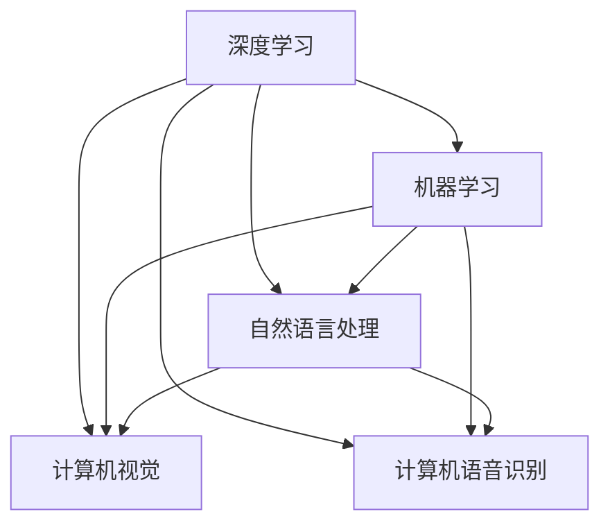
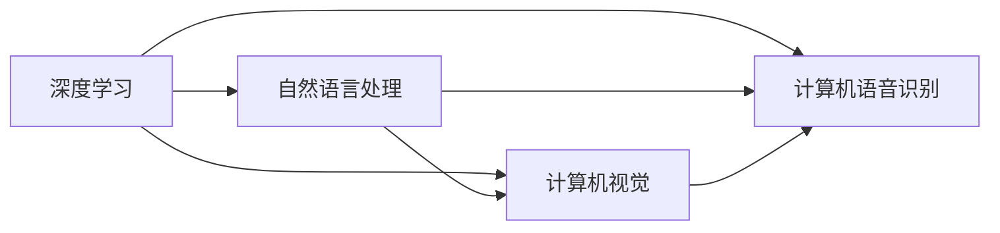
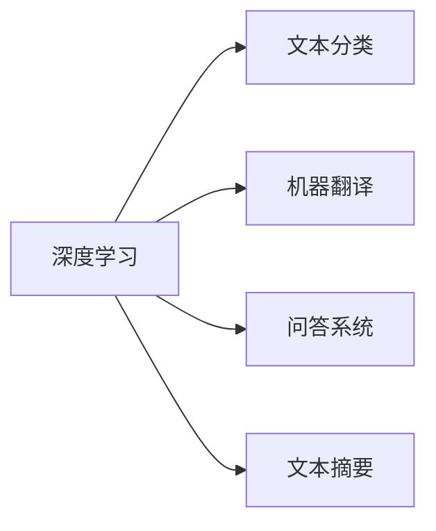
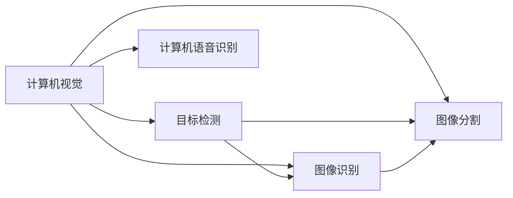

                 

# AI三驾马车的未来替代者

> 关键词：AI三驾马车,未来替代者,深度学习,机器学习,自然语言处理,计算机视觉,计算机语音识别

## 1. 背景介绍

在人工智能(AI)的发展历程中，深度学习、机器学习、自然语言处理(NLP)、计算机视觉(CV)、计算机语音识别(CSR)等技术成为其中的“三驾马车”，推动了AI技术在多个领域的广泛应用。然而，随着AI技术的不断进步，新的技术范式逐渐崛起，有望在未来取代现有的“三驾马车”。本文将探讨这些潜在的未来替代者，并分析它们对AI技术发展可能带来的影响。

## 2. 核心概念与联系

### 2.1 核心概念概述

为更好地理解这些未来替代者，本节将介绍几个密切相关的核心概念：

- 深度学习(Deep Learning, DL)：基于神经网络的机器学习技术，通过多层非线性变换学习输入数据的复杂表示，广泛应用于图像识别、语音识别、自然语言处理等领域。

- 机器学习(Machine Learning, ML)：通过数据驱动的方式，训练模型从输入数据中学习规律，进行预测、分类、回归等任务，是AI的基础技术之一。

- 自然语言处理(NLP)：使计算机能够理解、分析、生成人类自然语言的技术，包括文本分类、机器翻译、问答系统等。

- 计算机视觉(CV)：通过计算机算法使计算机“看”和“理解”图像、视频等视觉信息的技术，广泛应用于人脸识别、图像搜索、自动驾驶等领域。

- 计算机语音识别(CSR)：将人类的语音转换为计算机可处理的文本信息，广泛应用于智能助手、语音控制、声纹识别等场景。

这些核心概念之间的逻辑关系可以通过以下Mermaid流程图来展示：



这个流程图展示了几项核心技术之间的联系：深度学习是机器学习的重要分支，而自然语言处理、计算机视觉、计算机语音识别等则是深度学习在各自领域的应用。

### 2.2 概念间的关系

这些核心概念之间存在着紧密的联系，形成了AI技术的完整生态系统。下面我们通过几个Mermaid流程图来展示这些概念之间的关系。

#### 2.2.1 深度学习与其他技术的关系



这个流程图展示了深度学习与其他核心技术的关系。深度学习技术在自然语言处理、计算机视觉、计算机语音识别等领域都有广泛应用。

#### 2.2.2 深度学习在NLP中的应用



这个流程图展示了深度学习在自然语言处理中的几个典型应用：文本分类、机器翻译、问答系统和文本摘要等。

#### 2.2.3 计算机视觉与计算机语音识别的融合



这个流程图展示了计算机视觉与计算机语音识别在自动驾驶、智能家居等场景中的融合应用。

## 3. 核心算法原理 & 具体操作步骤
### 3.1 算法原理概述

深度学习、机器学习、自然语言处理、计算机视觉、计算机语音识别等技术，虽然在应用场景和算法原理上有所不同，但它们都基于共同的数学基础，如线性代数、概率论、统计学等。这些技术通过构建数学模型，利用数据进行训练和推断，从而实现各种复杂的任务。

### 3.2 算法步骤详解

这里以深度学习为例，详细介绍深度学习算法的基本步骤：

1. **数据准备**：收集和处理训练数据，包括数据清洗、特征提取、归一化等预处理步骤。

2. **模型选择**：选择适当的深度学习模型，如卷积神经网络(CNN)、循环神经网络(RNN)、长短时记忆网络(LSTM)、变换器(Transformer)等。

3. **模型训练**：使用训练数据对模型进行训练，通过反向传播算法更新模型参数，最小化损失函数。

4. **模型评估**：使用测试数据对训练好的模型进行评估，评估指标包括准确率、召回率、F1分数等。

5. **模型应用**：将训练好的模型应用于实际场景，进行图像识别、语音识别、自然语言处理等任务。

### 3.3 算法优缺点

深度学习、机器学习、自然语言处理、计算机视觉、计算机语音识别等技术各有优缺点：

#### 3.3.1 深度学习

**优点**：
- 能够处理非线性问题，提取高维特征表示。
- 在图像、语音、文本等复杂领域表现优异。
- 端到端的训练方式，便于模型集成和优化。

**缺点**：
- 训练数据需求量大，对标注质量要求高。
- 模型结构复杂，训练和推理速度较慢。
- 模型存在过拟合风险，需要大量数据和算法优化。

#### 3.3.2 机器学习

**优点**：
- 算法灵活，适合各种数据类型和应用场景。
- 可解释性强，便于模型诊断和调试。
- 计算复杂度较低，适合在嵌入式设备上运行。

**缺点**：
- 对特征工程要求高，需要大量领域知识和经验。
- 容易陷入局部最优解，需要多次调参优化。
- 缺乏对非线性问题的处理能力。

#### 3.3.3 自然语言处理

**优点**：
- 能够处理人类语言，具备很强的理解和生成能力。
- 在信息检索、机器翻译、问答系统等领域应用广泛。
- 开源资源丰富，易于实现和部署。

**缺点**：
- 处理长文本时效率较低，需要大量的计算资源。
- 对语料库的质量和规模要求高，需要持续更新。
- 语言的多样性和复杂性增加了处理的难度。

#### 3.3.4 计算机视觉

**优点**：
- 能够处理图像和视频数据，适用于各种视觉任务。
- 可视化效果好，易于理解和展示。
- 算法成熟，具备较强的泛化能力。

**缺点**：
- 对图像质量要求高，处理复杂场景时表现不稳定。
- 对计算资源和算法复杂度要求高，需要大量数据和计算资源。
- 处理图像中的背景和噪声对结果影响较大。

#### 3.3.5 计算机语音识别

**优点**：
- 能够处理人类语音，适用于各种语音交互场景。
- 语音识别技术成熟，应用广泛。
- 与自然语言处理技术结合，可以实现更自然的语音交互。

**缺点**：
- 对语音质量和环境噪音敏感，处理复杂语音场景时表现不佳。
- 需要大量标注数据和计算资源，成本较高。
- 处理时序信息时存在误差，可能影响识别结果。

### 3.4 算法应用领域

这些核心算法在各自的领域内得到了广泛应用：

- **深度学习**：在计算机视觉领域，广泛应用于图像分类、目标检测、图像分割等任务。在自然语言处理领域，用于机器翻译、问答系统、文本摘要等任务。
- **机器学习**：在推荐系统、金融风控、广告推荐等领域有广泛应用。
- **自然语言处理**：在信息检索、机器翻译、问答系统、情感分析等领域有广泛应用。
- **计算机视觉**：在自动驾驶、智能家居、安防监控等领域有广泛应用。
- **计算机语音识别**：在智能助手、语音控制、声纹识别等领域有广泛应用。

## 4. 数学模型和公式 & 详细讲解
### 4.1 数学模型构建

这里以深度学习中的卷积神经网络(CNN)为例，介绍其数学模型的构建过程。

### 4.2 公式推导过程

#### 4.2.1 卷积神经网络

卷积神经网络(CNN)是一种基于深度学习的神经网络结构，常用于图像识别、目标检测等任务。其核心思想是卷积操作和池化操作，能够有效地提取图像特征。

CNN的基本结构包括卷积层、池化层、全连接层等。下面以图像分类为例，展示CNN的数学模型构建过程。

假设输入图像大小为 $m\times n$，卷积核大小为 $k\times k$，步长为 $s$，输出特征图大小为 $H\times W$。卷积操作定义为：

$$
C(x_i,y_j) = \sum_{x'=x_i-s\cdot\frac{k-1}{2}+1}^{x_i+s\cdot\frac{k-1}{2}} \sum_{y'=y_j-s\cdot\frac{k-1}{2}+1}^{y_j+s\cdot\frac{k-1}{2}} W_{\text{conv}}(x',y',x_i,y_j)
$$

其中，$W_{\text{conv}}$ 为卷积核权重。

### 4.3 案例分析与讲解

以图像分类为例，展示卷积神经网络的工作原理。

假设有一个卷积神经网络，包含3个卷积层和2个池化层，输出特征图大小为 $H\times W$。具体实现步骤如下：

1. 输入图像 $x$ 经过第一个卷积层 $C_1$，输出特征图 $X_1$。

2. $X_1$ 经过第一个池化层 $P_1$，输出特征图 $X_2$。

3. $X_2$ 经过第二个卷积层 $C_2$，输出特征图 $X_3$。

4. $X_3$ 经过第二个池化层 $P_2$，输出特征图 $X_4$。

5. $X_4$ 经过全连接层 $F_1$，输出 $H$ 维特征向量。

6. $H$ 维特征向量经过激活函数，输出预测结果。

## 5. 项目实践：代码实例和详细解释说明
### 5.1 开发环境搭建

在进行项目实践前，需要先准备好开发环境。以下是使用Python进行PyTorch开发的环境配置流程：

1. 安装Anaconda：从官网下载并安装Anaconda，用于创建独立的Python环境。

2. 创建并激活虚拟环境：
```bash
conda create -n pytorch-env python=3.8 
conda activate pytorch-env
```

3. 安装PyTorch：根据CUDA版本，从官网获取对应的安装命令。例如：
```bash
conda install pytorch torchvision torchaudio cudatoolkit=11.1 -c pytorch -c conda-forge
```

4. 安装TensorFlow：
```bash
conda install tensorflow -c conda-forge
```

5. 安装各类工具包：
```bash
pip install numpy pandas scikit-learn matplotlib tqdm jupyter notebook ipython
```

完成上述步骤后，即可在`pytorch-env`环境中开始项目实践。

### 5.2 源代码详细实现

这里以使用PyTorch实现图像分类为例，展示卷积神经网络(CNN)的代码实现。

```python
import torch
import torch.nn as nn
import torchvision.transforms as transforms
from torchvision import datasets

class CNN(nn.Module):
    def __init__(self):
        super(CNN, self).__init__()
        self.conv1 = nn.Conv2d(3, 32, 3, 1, 1)
        self.pool = nn.MaxPool2d(2, 2)
        self.conv2 = nn.Conv2d(32, 64, 3, 1, 1)
        self.fc1 = nn.Linear(64 * 4 * 4, 128)
        self.fc2 = nn.Linear(128, 10)

    def forward(self, x):
        x = self.pool(F.relu(self.conv1(x)))
        x = self.pool(F.relu(self.conv2(x)))
        x = x.view(-1, 64 * 4 * 4)
        x = F.relu(self.fc1(x))
        x = self.fc2(x)
        return x

# 加载MNIST数据集
train_dataset = datasets.MNIST('data', train=True, transform=transforms.ToTensor(), download=True)
test_dataset = datasets.MNIST('data', train=False, transform=transforms.ToTensor(), download=True)

# 定义数据加载器
train_loader = torch.utils.data.DataLoader(train_dataset, batch_size=32, shuffle=True)
test_loader = torch.utils.data.DataLoader(test_dataset, batch_size=32, shuffle=False)

# 定义模型、优化器和损失函数
model = CNN()
criterion = nn.CrossEntropyLoss()
optimizer = torch.optim.Adam(model.parameters(), lr=0.001)

# 训练模型
for epoch in range(10):
    running_loss = 0.0
    for i, data in enumerate(train_loader, 0):
        inputs, labels = data
        optimizer.zero_grad()
        outputs = model(inputs)
        loss = criterion(outputs, labels)
        loss.backward()
        optimizer.step()

        running_loss += loss.item()
        if i % 100 == 99:
            print(f'Epoch {epoch+1}, loss: {running_loss/100:.3f}')
            running_loss = 0.0

# 测试模型
correct = 0
total = 0
with torch.no_grad():
    for data in test_loader:
        inputs, labels = data
        outputs = model(inputs)
        _, predicted = torch.max(outputs.data, 1)
        total += labels.size(0)
        correct += (predicted == labels).sum().item()

print(f'Accuracy of the network on the 10000 test images: {100 * correct / total:.2f}%')
```

这段代码展示了使用PyTorch实现卷积神经网络(CNN)进行图像分类的过程。

## 6. 实际应用场景
### 6.1 智能推荐系统

智能推荐系统是深度学习在推荐系统中的应用。通过构建深度神经网络，对用户行为和物品特征进行建模，推荐系统能够预测用户可能感兴趣的物品，提高用户体验。

在实际应用中，推荐系统可以应用于电商、社交媒体、音乐、视频等多个领域。通过收集用户的浏览、点击、评分等行为数据，训练推荐模型，预测用户对不同物品的评分，然后根据评分进行排序推荐。

### 6.2 智能医疗诊断

智能医疗诊断是深度学习在医疗领域的应用。通过构建深度神经网络，对医学影像和患者数据进行建模，智能医疗诊断能够辅助医生进行疾病诊断和治疗决策。

在实际应用中，智能医疗诊断可以应用于影像识别、疾病预测、治疗方案推荐等场景。通过收集大量的医学影像和患者数据，训练深度神经网络，预测患者是否患有某种疾病，并给出相应的治疗方案。

### 6.3 自动驾驶

自动驾驶是深度学习在计算机视觉和机器学习中的应用。通过构建深度神经网络，对车辆周围环境进行感知和决策，自动驾驶系统能够实现自主导航和驾驶。

在实际应用中，自动驾驶系统可以应用于无人驾驶汽车、智能交通系统等多个领域。通过收集大量的车辆数据和道路环境数据，训练深度神经网络，预测车辆周围环境的变化，实现自主驾驶。

## 7. 工具和资源推荐
### 7.1 学习资源推荐

为了帮助开发者系统掌握深度学习、机器学习、自然语言处理、计算机视觉、计算机语音识别等技术的理论基础和实践技巧，这里推荐一些优质的学习资源：

1. 《深度学习》系列书籍：由Yoshua Bengio、Ian Goodfellow、Aaron Courville等顶级学者撰写，深入浅出地介绍了深度学习的基础理论和方法。

2. 《机器学习实战》系列书籍：由Peter Harrington等学者撰写，通过实例展示了机器学习的应用过程和实现细节。

3. 《自然语言处理综论》系列书籍：由Daniel Jurafsky和James H. Martin撰写，全面介绍了自然语言处理的基础理论和应用方法。

4. 《计算机视觉：算法与应用》系列书籍：由Richard Szeliski等学者撰写，详细介绍了计算机视觉的算法和应用。

5. 《深度学习入门》系列书籍：由斋藤康毅、周志华等学者撰写，适合初学者快速入门深度学习。

通过对这些资源的学习实践，相信你一定能够快速掌握深度学习、机器学习、自然语言处理、计算机视觉、计算机语音识别等技术的精髓，并用于解决实际的AI问题。

### 7.2 开发工具推荐

高效的开发离不开优秀的工具支持。以下是几款用于AI开发常用的工具：

1. PyTorch：基于Python的开源深度学习框架，灵活动态的计算图，适合快速迭代研究。

2. TensorFlow：由Google主导开发的开源深度学习框架，生产部署方便，适合大规模工程应用。

3. Keras：基于TensorFlow和Theano的高层API，易于上手，适合快速构建和测试深度学习模型。

4. MXNet：由亚马逊开发的开源深度学习框架，支持多种编程语言和分布式计算。

5. OpenCV：计算机视觉领域的重要库，包含丰富的图像处理和计算机视觉算法。

6. Kaldi：开源的语音识别库，支持多种语音识别任务。

7. NLTK：自然语言处理领域的重要库，提供了丰富的NLP工具和数据集。

合理利用这些工具，可以显著提升AI项目开发效率，加快创新迭代的步伐。

### 7.3 相关论文推荐

AI三驾马车的发展源于学界的持续研究。以下是几篇奠基性的相关论文，推荐阅读：

1. AlexNet: ImageNet Classification with Deep Convolutional Neural Networks：提出卷积神经网络，开启深度学习时代。

2. Deep Speech 2: An End-to-End Fully Convolutional Neural Network for Speech Recognition：提出卷积神经网络在语音识别中的应用。

3. Attention is All You Need：提出Transformer结构，开启自注意力机制时代。

4. BERT: Pre-training of Deep Bidirectional Transformers for Language Understanding：提出BERT模型，引入预训练和微调方法。

5. AlphaGo Zero: Mastering the Game of Go without Human Knowledge：提出强化学习在棋类游戏中的应用。

这些论文代表了大数据、深度学习、自然语言处理、计算机视觉、计算机语音识别等技术的突破和发展，值得深度阅读和理解。

## 8. 总结：未来发展趋势与挑战
### 8.1 总结

本文对深度学习、机器学习、自然语言处理、计算机视觉、计算机语音识别等技术进行了全面系统的介绍。通过理解这些技术的核心原理和实际应用，可以看到，它们在各自的领域内已经取得了巨大的成功，并推动了AI技术的发展。

### 8.2 未来发展趋势

展望未来，AI技术将继续保持高速发展，以下几种趋势值得关注：

1. 自监督学习：通过利用大规模无标签数据进行预训练，构建强大的模型，减少对标注数据的依赖。

2. 强化学习：通过与环境互动，学习最优策略，实现智能决策和自主控制。

3. 多模态学习：将不同模态的数据进行融合，提升对复杂场景的建模能力。

4. 联邦学习：通过分布式数据和计算资源，实现隐私保护和模型协作。

5. 深度生成模型：通过生成模型，生成自然语言、图像、音频等数据，提升数据生成和增强能力。

这些趋势将进一步拓展AI技术的应用范围，推动AI技术向更加智能化、普适化方向发展。

### 8.3 面临的挑战

尽管AI技术取得了显著进展，但仍面临诸多挑战：

1. 数据隐私和安全：AI模型依赖大量数据，数据隐私和安全问题变得日益重要。

2. 模型可解释性：深度学习模型的“黑盒”特性，使其难以解释和调试。

3. 计算资源：AI技术需要大量计算资源，如何降低计算成本，提高计算效率，是未来的一大挑战。

4. 技术普及：AI技术在实际应用中的普及程度仍有待提高，需要更多的教育和培训。

5. 伦理道德：AI技术的应用可能带来伦理道德问题，如就业替代、隐私侵犯等，需要各方共同探讨解决之道。

这些挑战需要学术界、产业界、政府等各方的共同努力，才能推动AI技术的持续发展和应用。

### 8.4 研究展望

未来的AI研究需要在以下几个方面寻求新的突破：

1. 建立更加智能的AI系统：通过引入多模态学习、强化学习等技术，构建更加智能化的AI系统，实现更加自然和智能的交互。

2. 推动AI技术的普及应用：通过教育和培训，提高AI技术在各行业的普及度，推动AI技术在实际场景中的应用。

3. 探索AI技术的伦理道德：通过引入伦理道德和法律法规，确保AI技术的公正、透明和可控。

4. 研究更加高效的计算方法：通过分布式计算、量子计算等技术，探索更加高效的计算方法，降低计算成本，提高计算效率。

5. 推动AI技术的产业化：通过产业化应用，推动AI技术在实际场景中的应用，解决实际问题，提升社会效益。

总之，未来的AI研究需要在多个方面进行探索和创新，才能实现更加智能、普适、高效、可控的AI系统，推动AI技术在各行业的广泛应用，为人类社会带来更多的福祉。

## 9. 附录：常见问题与解答

**Q1: 深度学习、机器学习、自然语言处理、计算机视觉、计算机语音识别等技术有哪些区别？**

A: 深度学习、机器学习、自然语言处理、计算机视觉、计算机语音识别等技术虽然在应用场景和算法原理上有所不同，但它们都是人工智能的重要分支。深度学习是一种基于神经网络的机器学习技术，通过多层非线性变换学习输入数据的复杂表示，广泛应用于图像识别、语音识别、自然语言处理等领域。机器学习则是一种基于数据驱动的算法，通过训练模型从输入数据中学习规律，进行预测、分类、回归等任务。自然语言处理是使计算机能够理解、分析、生成人类自然语言的技术。计算机视觉是通过计算机算法使计算机“看”和“理解”图像、视频等视觉信息的技术。计算机语音识别是将人类的语音转换为计算机可处理的文本信息。

**Q2: 深度学习在图像识别中的优点和缺点是什么？**

A: 深度学习在图像识别中的优点是：
- 能够处理非线性问题，提取高维特征表示。
- 在图像识别、目标检测等任务中表现优异。
- 端到端的训练方式，便于模型集成和优化。

缺点是：
- 训练数据需求量大，对标注质量要求高。
- 模型结构复杂，训练和推理速度较慢。
- 模型存在过拟合风险，需要大量数据和算法优化。

**Q3: 计算机视觉在自动驾驶中的应用有哪些？**

A: 计算机视觉在自动驾驶中的应用包括：
- 目标检测：识别车辆、行人、道路标志等交通要素。
- 图像识别：识别交通信号、路面标记等。
- 图像分割：将图像分割成不同区域，识别路缘、车道线等。
- 深度感知：通过激光雷达、摄像头等传感器，构建环境三维模型。
- 行为预测：通过分析车辆、行人等行为，预测其运动轨迹。

通过计算机视觉技术，自动驾驶系统可以实现自主导航和驾驶，提高道路安全性和效率。

**Q4: 计算机语音识别的优点和缺点是什么？**

A: 计算机语音识别的优点是：
- 能够处理人类语音，适用于各种语音交互场景。
- 语音识别技术成熟，应用广泛。
- 与自然语言处理技术结合，可以实现更自然的语音交互。

缺点是：
- 对语音质量和环境噪音敏感，处理复杂语音场景时表现不佳。
- 需要大量标注数据和计算资源，成本较高。
- 处理时序信息时存在误差，可能影响识别结果。

**Q5: 如何提高深度学习模型的可解释性？**

A: 提高深度学习模型的可解释性可以通过以下几种方法：
- 使用可视化工具，展示模型的中间特征和决策过程。
- 引入可解释性模块，如LIME、SHAP等，解释模型的输出。
- 使用决策树、线性模型等简单模型作为基线，与深度模型进行比较。
- 使用对抗样本测试，评估模型的鲁棒性。

这些方法有助于提高深度学习模型的可解释性，使其能够更好地应用于需要解释和审计的场景。

---

作者：禅与计算机程序设计艺术 / Zen and the Art of Computer Programming

