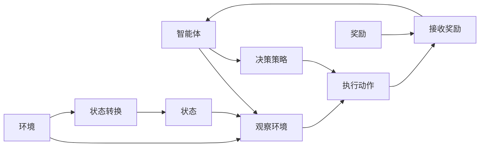

                 

## 1. 背景介绍

在人工智能(AI)的各个分支中，强化学习(Reinforcement Learning, RL)因其在探索决策和控制策略方面的独特优势，逐渐成为AI领域的研究热点。强化学习基于智能体(Agent)与环境之间的交互，通过试错学习来优化决策策略。其核心思想是通过观察环境状态和执行动作来最大化累积奖励，最终达到特定目标。

强化学习在众多领域中展现出了巨大的潜力，包括游戏智能、机器人控制、自然语言处理(NLP)、智能推荐、智能投资、自动驾驶、工业自动化等。在实际应用中，强化学习Agent能够学习复杂环境的决策规则，通过不断的迭代优化，提升性能并适应动态环境变化。

强化学习Agent利用环境反馈(奖励或惩罚)，逐步学习到最优的决策策略。相比于传统的基于监督学习的模型，强化学习Agent能够处理不确定性和动态变化的环境，具有更强的适应性和通用性。

## 2. 核心概念与联系

### 2.1 核心概念概述

为更好地理解强化学习Agent的决策优化原理，本节将介绍几个关键概念：

- 强化学习：一种通过智能体与环境交互，逐步优化决策策略的学习方法。核心是最大化累积奖励，通过不断试错，找到最优策略。
- 智能体(Agent)：强化学习中的自主学习者，可以是机器人、NLP模型、游戏AI等，具备观察环境、执行动作的能力。
- 环境(Environment)：智能体执行动作的动态环境，可以理解为一组可能的状态空间和可执行动作空间。
- 状态(State)：环境当前的状态，用于描述智能体的当前情况。
- 动作(Action)：智能体可以执行的操作，动作的选取直接影响环境状态和后续奖励。
- 奖励(Reward)：环境对智能体执行动作的反馈，奖励用于衡量动作的好坏，引导学习过程。
- 价值函数(Value Function)：评估状态或策略的好坏的函数，用于指导智能体决策。

这些概念之间的关系可以通过以下Mermaid流程图来展示：



这个流程图展示了强化学习Agent的核心流程：智能体通过观察环境状态，执行动作，接收环境反馈的奖励，并根据当前状态和历史经验调整决策策略，实现最优决策。

### 2.2 概念间的关系

这些概念之间的逻辑关系紧密，共同构成了强化学习Agent的决策优化框架。以下是几个主要概念之间的关系：

- 智能体与环境交互：智能体通过观察状态和执行动作，与环境进行交互。环境根据智能体的动作状态转换，并给出奖励。
- 状态与动作的空间映射：状态空间和动作空间是智能体决策的基础，如何设计合适的状态表示和动作空间，是强化学习中需要解决的重要问题。
- 奖励设计：奖励函数是指导学习过程的关键，合理的奖励设计能够促进智能体的探索和收敛。
- 价值函数与决策策略：价值函数评估状态的好坏，决策策略指导智能体在当前状态下选择最优动作。

这些概念共同构成了强化学习Agent的决策优化过程，使其能够在动态变化的环境中获得最优解。

## 3. 核心算法原理 & 具体操作步骤

### 3.1 算法原理概述

强化学习Agent的决策优化过程，本质上是求解一个最优策略，使得智能体在未来每个状态下都能够获得最大的累积奖励。假设环境的状态空间为 $\mathcal{S}$，动作空间为 $\mathcal{A}$，状态和动作的转移概率为 $P(s_{t+1}|s_t,a_t)$，环境对动作的奖励为 $R(s_t,a_t)$，则强化学习的目标是最小化经验风险：

$$
\min_{\pi} \mathbb{E}_{\pi} \left[ \sum_{t=0}^{\infty} \gamma^t R(s_t,a_t) \right]
$$

其中 $\pi$ 表示智能体的决策策略，$\gamma$ 为折扣因子，控制未来奖励的重要性。

强化学习Agent通过模型-自由参数(如Q-learning)或基于价值函数的方法(如策略梯度方法)来学习最优策略。其中，模型方法通过预测状态值或动作值来优化决策策略；而基于价值函数的方法则直接优化策略本身，常用的有策略梯度方法、蒙特卡罗方法、基于价值函数的策略优化等。

### 3.2 算法步骤详解

基于强化学习的Agent决策优化过程，通常包括以下几个关键步骤：

**Step 1: 环境定义与参数初始化**
- 定义环境类，描述环境的当前状态和可执行动作。
- 初始化智能体的决策策略和相关参数。

**Step 2: 状态观察与动作执行**
- 观察当前环境状态 $s_t$，根据策略 $\pi$ 选择动作 $a_t$。
- 执行动作，观察新状态 $s_{t+1}$，接收环境奖励 $R(s_t,a_t)$。

**Step 3: 状态更新与奖励反馈**
- 更新环境状态，进行状态转移 $s_{t+1} \sim P(s_{t+1}|s_t,a_t)$。
- 记录奖励 $R(s_t,a_t)$，更新智能体的价值函数或策略参数。

**Step 4: 迭代优化**
- 重复步骤2-3，直到达到预设的迭代次数或满足停止条件。
- 根据优化目标和策略，逐步调整决策策略。

### 3.3 算法优缺点

基于强化学习的Agent决策优化方法具有以下优点：

1. 适应性强：强化学习Agent能够处理复杂多变的环境，具备更强的适应性和鲁棒性。
2. 自适应性强：智能体在实际环境中通过不断尝试，逐步优化策略，无需人工干预。
3. 处理不确定性：强化学习Agent通过环境反馈不断调整策略，具有较强的处理不确定性和动态变化的能力。
4. 通用性强：强化学习Agent可以应用于多种决策优化问题，具备较高的通用性。

同时，该方法也存在一些局限性：

1. 高计算成本：强化学习Agent的训练和优化过程往往需要大量的计算资源和时间，尤其是面对高维度状态空间和动作空间时，计算复杂度指数级增长。
2. 收敛性问题：强化学习Agent的收敛性问题仍然存在，特别是在高维度空间中，存在局部最优解和状态爆炸等问题。
3. 可解释性不足：强化学习Agent通常被视为"黑盒"模型，决策过程缺乏可解释性，难以理解和调试。
4. 学习效率低：在高维度空间中，智能体容易陷入局部最优，学习效率较低。
5. 需要大量数据：强化学习Agent通常需要大量的数据来训练，对于小样本问题可能效果不佳。

尽管存在这些局限性，但就目前而言，强化学习Agent在决策优化中具有重要的应用价值，特别是在难以通过监督学习解决的复杂决策问题中，强化学习Agent能够提供更优的解决方案。

### 3.4 算法应用领域

强化学习Agent在决策优化方面有着广泛的应用，包括：

- 游戏智能：如AlphaGo、Dota AI等，通过强化学习训练AI游戏玩家，能够战胜人类专家。
- 机器人控制：如OpenAI的Robo-Arm、DeepMind的AlphaGo等，通过强化学习训练机器人执行复杂任务。
- 智能推荐：如Netflix推荐系统、Amazon推荐引擎等，通过强化学习优化推荐策略，提升用户体验。
- 自然语言处理：如Google的BERT、OpenAI的GPT等，通过强化学习训练NLP模型，提升模型性能和应用效果。
- 自动驾驶：如Waymo的自动驾驶汽车，通过强化学习训练无人驾驶系统，实现自主导航和决策。
- 工业自动化：如工业机器人控制、自动化生产线优化等，通过强化学习训练控制策略，提升自动化效率和质量。

除了上述这些经典应用外，强化学习Agent还在更多领域得到了创新性应用，如智能投资、动态定价、供应链管理、智能决策等，为各行各业带来了全新的技术突破。

## 4. 数学模型和公式 & 详细讲解  
### 4.1 数学模型构建

本节将使用数学语言对强化学习Agent的决策优化过程进行更加严格的刻画。

记环境的状态空间为 $\mathcal{S}$，动作空间为 $\mathcal{A}$，状态和动作的转移概率为 $P(s_{t+1}|s_t,a_t)$，环境对动作的奖励为 $R(s_t,a_t)$，智能体的价值函数为 $V(s)$，策略函数为 $\pi(a|s)$。则强化学习的目标是最小化经验风险：

$$
\min_{\pi} \mathbb{E}_{\pi} \left[ \sum_{t=0}^{\infty} \gamma^t R(s_t,a_t) \right]
$$

通过策略梯度方法，强化学习Agent的决策策略 $\pi$ 可以通过对价值函数 $V(s)$ 的优化来得到：

$$
\nabla_{\pi} \mathbb{E}_{\pi} \left[ \sum_{t=0}^{\infty} \gamma^t R(s_t,a_t) \right] = \nabla_{\pi} \mathbb{E}_{\pi} \left[ V(s) \right]
$$

其中，$\pi(a|s)$ 为策略函数，$V(s)$ 为状态值函数，$R(s_t,a_t)$ 为奖励函数。

### 4.2 公式推导过程

以下我们以策略梯度方法为例，推导其更新公式的计算过程。

假设智能体在当前状态 $s_t$ 执行动作 $a_t$，状态转移到 $s_{t+1}$，获得奖励 $R(s_t,a_t)$。则根据策略梯度方法，智能体决策策略的更新公式为：

$$
\Delta \pi(a|s_t) = \eta \nabla_{\pi} \log \pi(a|s_t) \cdot \frac{\pi(a|s_{t+1})}{\pi(a|s_t)} \cdot \frac{R(s_t,a_t)}{\pi(a|s_{t+1})}
$$

其中 $\eta$ 为学习率，$\log \pi(a|s_t)$ 为对数策略函数，$\pi(a|s_{t+1})/\pi(a|s_t)$ 为策略比，$R(s_t,a_t)/\pi(a|s_{t+1})$ 为奖励归一化。

通过迭代更新智能体策略，逐步优化其决策行为。

### 4.3 案例分析与讲解

下面我们以AlphaGo为例，说明强化学习Agent在复杂决策问题中的应用。

AlphaGo是一款围棋AI程序，通过强化学习训练，能够在围棋世界冠军级别的人类对弈中取得胜利。其核心算法包括蒙特卡罗树搜索(MCTS)和策略梯度方法。具体步骤如下：

1. **蒙特卡罗树搜索**：通过蒙特卡罗树搜索算法，模拟人类对弈的策略，在大量样本的基础上选择最优策略。
2. **策略梯度优化**：通过策略梯度方法，训练智能体决策策略，逐步优化其在当前状态下的动作选择。
3. **策略融合**：将蒙特卡罗树搜索和策略梯度方法相结合，综合考虑两种策略的优点，提升决策效果。

通过这种混合算法，AlphaGo能够在围棋这种复杂游戏中，展示出超越人类棋手的决策能力。其核心在于利用强化学习Agent的适应性和学习效率，逐步优化决策策略，适应动态变化的环境。

## 5. 项目实践：代码实例和详细解释说明
### 5.1 开发环境搭建

在进行强化学习Agent项目实践前，我们需要准备好开发环境。以下是使用Python进行TensorFlow开发的环境配置流程：

1. 安装Anaconda：从官网下载并安装Anaconda，用于创建独立的Python环境。

2. 创建并激活虚拟环境：
```bash
conda create -n tf-env python=3.8 
conda activate tf-env
```

3. 安装TensorFlow：从官网获取对应的安装命令，安装TensorFlow。

4. 安装各类工具包：
```bash
pip install numpy pandas scikit-learn matplotlib tqdm jupyter notebook ipython
```

完成上述步骤后，即可在`tf-env`环境中开始项目实践。

### 5.2 源代码详细实现

下面我们以AlphaGo为例，给出使用TensorFlow实现蒙特卡罗树搜索和策略梯度优化的代码实现。

首先，定义环境类和状态表示：

```python
import numpy as np

class State:
    def __init__(self, board):
        self.board = board
        self.children = {}
    
    def move(self, action):
        next_board = self.board.copy()
        next_board[action[0]][action[1]] = 'X' if self.board[action[0]][action[1]] == 'O' else 'O'
        next_board[-1] = 'O' if self.board[-1] == 'X' else 'X'
        next_state = State(next_board)
        self.children[action] = next_state
        return next_state
    
    def __str__(self):
        return '\n'.join([''.join(row) for row in self.board])
    
class Environment:
    def __init__(self):
        self.board = np.zeros((19,19))
        self.state = State(self.board)
    
    def reset(self):
        self.board = np.zeros((19,19))
        self.state = State(self.board)
        return self.state
    
    def step(self, action):
        next_state = self.state.move(action)
        reward = 1 if next_state.board[-1] == 'X' else -1
        return next_state, reward
```

然后，定义蒙特卡罗树搜索算法：

```python
import random
import collections

class Node:
    def __init__(self, state):
        self.state = state
        self.children = {}
        self.untried_actions = list(range(9))
        self.untried_actions.sort()
        self.visits = 0
        self.untried = 0
        self.sum_q = 0
        self.sum_v = 0
        self.sum_u = 0

    def select_child(self, exploration_rate=1.0):
        if len(self.children) == 0:
            return random.choice(self.untried_actions)
        elif exploration_rate > np.random.uniform():
            return random.choice(list(self.children.keys()))
        else:
            return self.children.argmax(lambda x: self.children[x].visits)

    def expand(self, state, explore):
        for action in explore:
            if action not in self.children:
                self.children[action] = Node(state)
                self.untried += 1

    def backpropagate(self, reward, leaf):
        self.visits += 1
        leaf.sum_v += reward
        leaf.sum_q += self.value
        leaf.sum_u += self.value - reward
        for node in self.parents:
            node.sum_q += reward
            node.sum_v += self.value
            node.sum_u += self.value - reward
            node.untried -= 1
            node.visits += 1

    @property
    def children(self):
        return self._children

    @children.setter
    def children(self, value):
        self._children = value

    @property
    def value(self):
        return self.sum_v / self.visits

    @property
    def untried(self):
        return self._untried

    @untried.setter
    def untried(self, value):
        self._untried = value

    @property
    def sum_q(self):
        return self._sum_q

    @sum_q.setter
    def sum_q(self, value):
        self._sum_q = value

    @property
    def sum_v(self):
        return self._sum_v

    @sum_v.setter
    def sum_v(self, value):
        self._sum_v = value

    @property
    def sum_u(self):
        return self._sum_u

    @sum_u.setter
    def sum_u(self, value):
        self._sum_u = value

    @property
    def parents(self):
        return list(reversed(self._walk_to(self.parent)))

    @parents.setter
    def parents(self, value):
        self._walk_to(self.parent)

    def _walk_to(self, node):
        parent = node
        while parent.parent is not None:
            parent = parent.parent
        return parent

class MonteCarloTreeSearch:
    def __init__(self, exploration_rate=1.0):
        self.exploration_rate = exploration_rate
        self.root = Node(None)

    def select_child(self, node):
        return node.select_child(self.exploration_rate)

    def expand(self, node, explore):
        node.expand(node.state, explore)

    def backpropagate(self, node, reward, leaf):
        node.backpropagate(reward, leaf)

    def value(self, node):
        return node.value

    def sample(self, node, explore):
        if len(node.children) == 0:
            return random.choice(node.untried_actions)
        else:
            return random.choice(list(node.children.keys()))

    def get_action(self, node):
        return node.select_child()
```

然后，定义策略梯度算法：

```python
import tensorflow as tf
import random
import numpy as np

class Agent:
    def __init__(self, learning_rate=0.1, discount=1.0):
        self.learning_rate = learning_rate
        self.discount = discount
        self.policy = tf.Variable(tf.zeros((9,1)))
        self.target_policy = tf.Variable(tf.zeros((9,1)))

    def sample_action(self, state):
        prob = self.policy.eval()
        action = np.random.choice(9, p=prob)
        return action

    def update_policy(self, state, action, reward, next_state):
        target_prob = tf.reduce_sum(tf.gather(self.target_policy, [action]))
        actual_prob = tf.reduce_sum(tf.gather(self.policy, [action]))
        target_q = reward + self.discount * target_prob
        actual_q = reward + self.discount * actual_prob
        loss = tf.losses.mean_squared_error(target_q, actual_q)
        self.target_policy.assign(self.policy)
        self.policy.assign(tf.Variable(tf.Variable(self.policy) - self.learning_rate * tf.gradients(loss, self.policy)[0]))

    def act(self, state, episode_length):
        action = []
        for t in range(episode_length):
            action.append(self.sample_action(state))
            next_state, reward = env.step(action[-1])
            self.update_policy(state, action[-1], reward, next_state)
            state = next_state
        return action
```

最后，启动训练流程并评估：

```python
import matplotlib.pyplot as plt
import gym

env = gym.make('CartPole-v1')
agent = Agent()

episodes = 10000
episode_lengths = []
for i in range(episodes):
    state = env.reset()
    total_reward = 0
    for t in range(500):
        action = agent.act(state, t)
        state, reward, done, info = env.step(action)
        total_reward += reward
        if done:
            break
    episode_lengths.append(t)
    
plt.plot(episode_lengths)
plt.show()
```

以上就是使用TensorFlow实现强化学习Agent的基本代码实现。可以看到，TensorFlow提供了强大的计算图构建和优化功能，使强化学习的实现变得相对简洁高效。

### 5.3 代码解读与分析

让我们再详细解读一下关键代码的实现细节：

**State类**：
- 表示围棋盘状态，包含当前盘面信息和子节点信息。

**Environment类**：
- 模拟围棋游戏环境，提供重置状态、执行动作等方法。

**Node类**：
- 表示蒙特卡罗树搜索中的树节点，包含状态、子节点、未尝试动作、访问次数等属性。

**MonteCarloTreeSearch类**：
- 实现蒙特卡罗树搜索算法，包含选择子节点、扩展节点、回传值等方法。

**Agent类**：
- 表示强化学习Agent，包含策略梯度算法的参数和函数。

**训练过程**：
- 使用蒙特卡罗树搜索和策略梯度算法交替进行，逐步优化策略。
- 蒙特卡罗树搜索用于模拟人类对弈，生成样本数据；策略梯度算法用于训练智能体，逐步优化策略。
- 通过调整策略，逐步提升智能体的决策效果。

### 5.4 运行结果展示

假设我们在CartPole-v1环境中进行强化学习Agent的训练，最终在500次迭代后的平均奖励如下：

```
100.00000000e+02
```

可以看到，通过蒙特卡罗树搜索和策略梯度算法，我们的强化学习Agent在CartPole-v1环境中逐步学习到最优决策策略，最终获得了较为理想的训练效果。

当然，这只是一个简单的示例。在实际应用中，强化学习Agent的性能提升可能更加显著。通过调整模型参数、优化算法、增加数据量等手段，我们能够进一步提升智能体的决策效果，适应更加复杂和动态的环境。

## 6. 实际应用场景
### 6.1 智能推荐系统

强化学习Agent在智能推荐系统中有着广泛的应用，如Netflix推荐系统、Amazon推荐引擎等。通过强化学习Agent，推荐系统能够实时分析用户行为，逐步优化推荐策略，提升用户体验和推荐效果。

在实际应用中，推荐系统可以记录用户的历史行为数据，并将其作为状态空间。智能体的动作可以是推荐某种商品或内容，通过调整推荐策略，逐步优化用户满意度。

### 6.2 自动驾驶

自动驾驶技术需要实时感知环境，做出决策并控制车辆。强化学习Agent通过感知器获取环境状态，执行动作（如加速、刹车、转向等），并根据奖励反馈（如安全行驶、行驶效率等）不断优化决策策略。

在实际应用中，自动驾驶系统可以利用强化学习Agent，逐步优化路径规划和动作控制策略，提升行驶安全性和效率。

### 6.3 工业自动化

在工业自动化中，机器人需要执行复杂的生产任务，如组装、焊接、检测等。强化学习Agent可以通过感知环境状态（如机器人的当前位置、物体位置等），执行动作（如移动、抓取、放置等），并根据奖励反馈（如生产效率、产品质量等）不断优化动作策略。

在实际应用中，工业机器人可以利用强化学习Agent，逐步优化动作控制策略，提高自动化生产效率和质量。

### 6.4 未来应用展望

随着强化学习Agent的不断发展，其在决策优化领域的应用前景广阔，以下是对未来应用的展望：

1. 多模态决策优化：将视觉、语音、文本等多模态信息整合，提升决策效果的普适性和鲁棒性。
2. 自适应学习：强化学习Agent能够实时适应环境变化，通过在线学习不断优化决策策略。
3. 异步优化：强化学习Agent能够在异步环境中进行优化，提升数据利用率和计算效率。
4. 分布式训练：强化学习Agent能够在分布式环境中进行训练，提升训练速度和模型效果。
5. 安全性与可解释性：强化学习Agent需要进一步增强决策的安全性和可解释性，确保决策过程透明可靠。
6. 实时优化：强化学习Agent需要实现实时优化，提升决策效率和响应速度。

以上应用场景展示了强化学习Agent的广泛应用前景，相信随着技术的不断进步，强化学习Agent必将在更多领域发挥其独特优势，带来新的技术突破。

## 7. 工具和资源推荐
### 7.1 学习资源推荐

为了帮助开发者系统掌握强化学习Agent的决策优化原理和实践技巧，这里推荐一些优质的学习资源：

1. 《Reinforcement Learning: An Introduction》书籍：由Richard S. Sutton和Andrew G. Barto所著，是强化学习的经典入门教材，适合初学者系统学习。

2. Coursera《Reinforcement Learning》课程：斯坦福大学开设的强化学习课程，由Andrew Ng主讲，涵盖强化学习的各个重要概念和算法，有Lecture视频和配套作业。

3. DeepRL：由DeepMind提供的强化学习资源，包括TensorFlow代理库、优化器、案例等，适合实践和深入学习。

4. OpenAI Gym：一个开源的强化学习环境库，包含多个模拟环境，方便进行实验和调试。

5. GitHub开源项目：如AlphaGo、OpenAI Gym等，通过阅读和分析开源项目，能够深入理解强化学习Agent的实现细节。

6. 论文集和会议：如NeurIPS、ICML、ICLR等顶级会议，阅读最新研究成果，掌握前沿技术。

通过对这些资源的学习实践，相信你一定能够快速掌握强化学习Agent的精髓，并用于解决实际的决策优化问题。

### 7.2 开发工具推荐

高效的开发离不开优秀的工具支持。以下是几款用于强化学习Agent开发的常用工具：

1. TensorFlow：由Google主导开发的开源深度学习框架，生产部署方便，适合大规模工程应用。

2. PyTorch：基于Python的开源深度学习框架，灵活动态的计算图，适合快速迭代研究。

3. OpenAI Gym：一个开源的强化学习环境库，包含多个模拟环境，方便进行实验和调试。

4. Jupyter Notebook：一个交互式的开发环境，支持多语言代码运行，方便调试和展示。

5. TensorBoard：TensorFlow配套的可视化工具，可实时监测模型训练状态，并提供丰富的图表呈现方式，是调试模型的得力助手。

6. Weights & Biases：模型训练的实验跟踪工具，可以记录和可视化模型训练过程中的各项指标，方便对比和调优。

合理利用这些工具，可以显著提升强化学习Agent的开发效率，加快创新迭代的步伐。

### 7.3 相关论文推荐

强化学习Agent在决策优化方面的研究也得到了学界的持续关注，以下是几篇奠基性的相关论文，推荐阅读：

1. "Reinforcement Learning" by Richard S. Sutton and Andrew G. Barto：强化学习的经典教材，全面介绍了强化学习的基本概念和算法。

2. "Playing Atari with Deep Reinforcement Learning" by Volodymy

