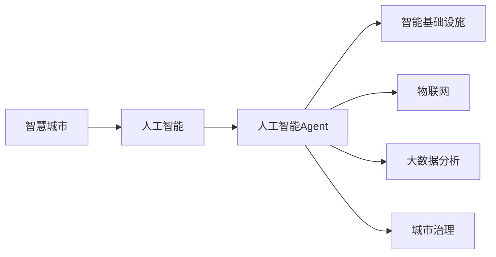
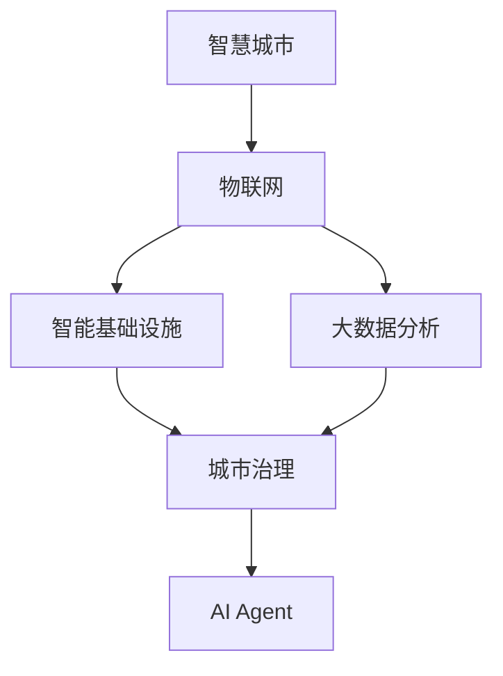
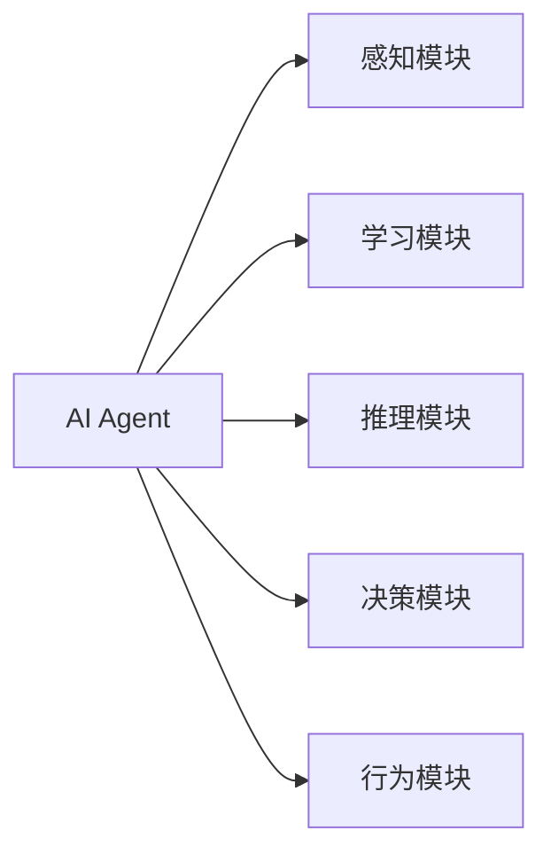
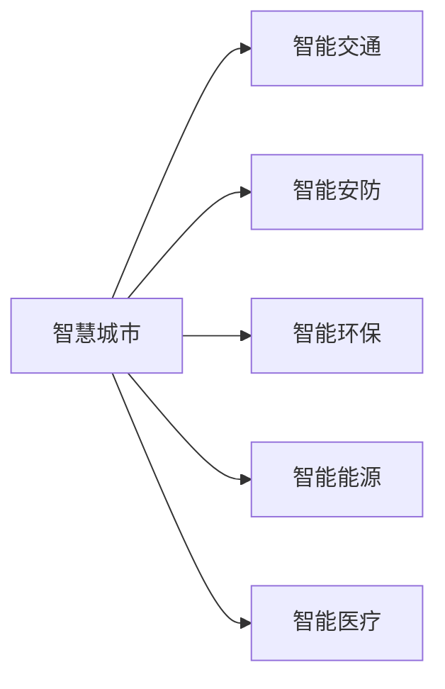
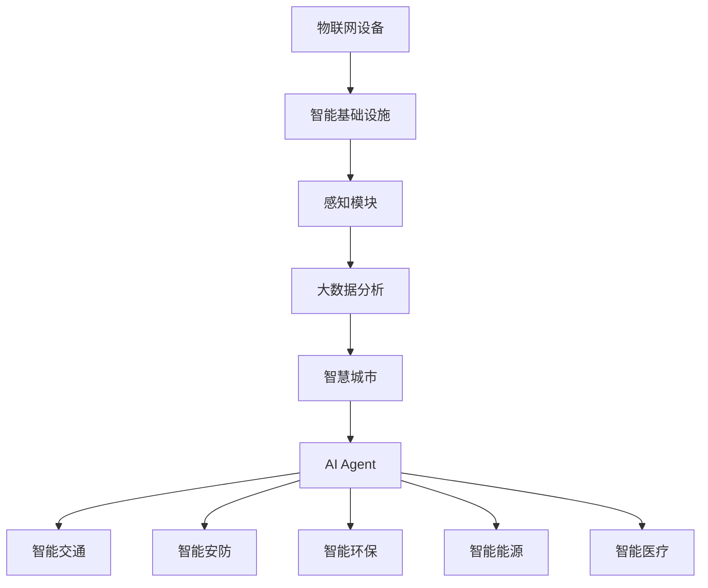

                 

# AI人工智能 Agent：在智慧城市中的应用

> 关键词：人工智能，智慧城市，智能基础设施，城市治理，物联网，大数据分析，AI Agent

## 1. 背景介绍

### 1.1 问题由来
智慧城市是近年来全球各城市政府、企业和科研机构共同关注和努力建设的一个重要方向。它旨在利用先进的信息技术，对城市空间和人类活动进行感知、分析和规划，从而实现城市管理的智能化、高效化、人性化。

随着信息技术的快速发展和人工智能（AI）技术的突破，AI Agent（人工智能代理人）成为了智慧城市建设的重要工具和手段。AI Agent 不仅能够处理海量数据，进行智能决策，还能提供实时响应，极大地提高了城市治理的效率和质量。

### 1.2 问题核心关键点
AI Agent 在智慧城市中的应用主要集中在以下几个关键领域：

- **智能基础设施**：AI Agent 通过感知技术，如传感器、摄像头等，对城市的各种设施进行实时监测和控制，提升基础设施的智能化水平。
- **城市治理**：AI Agent 通过数据分析和机器学习，对城市运行数据进行深度分析，辅助城市管理部门进行决策。
- **物联网（IoT）**：AI Agent 能够整合物联网设备的数据，实现数据的智能分析和处理。
- **大数据分析**：AI Agent 利用大数据技术，对城市数据进行高效处理和分析，提供决策支持。

AI Agent 的广泛应用，为智慧城市建设提供了强大的技术支持，推动了城市管理的数字化、智能化转型。

### 1.3 问题研究意义
AI Agent 在智慧城市中的应用，不仅能够提升城市管理的效率和质量，还能改善城市居民的生活体验，具有深远的社会和经济意义：

1. **提升城市治理效率**：AI Agent 能够处理大量城市运行数据，进行实时分析和决策，提高城市治理的效率和精准度。
2. **改善公共服务**：通过智能基础设施和数据分析，AI Agent 可以优化公共服务资源分配，提高服务质量和覆盖面。
3. **增强应急响应能力**：AI Agent 能够在紧急情况下提供实时分析和决策支持，增强城市的应急响应能力。
4. **推动科技创新**：智慧城市的建设和发展，需要大量的科技创新和实践探索，AI Agent 的广泛应用为智慧城市建设提供了技术支持。
5. **促进经济发展**：智慧城市的建设，能够吸引更多的投资和技术人才，促进相关产业的发展，提升城市的经济竞争力。

## 2. 核心概念与联系

### 2.1 核心概念概述

为更好地理解AI Agent在智慧城市中的应用，本节将介绍几个密切相关的核心概念：

- **智慧城市（Smart City）**：利用先进的信息技术，对城市空间和人类活动进行感知、分析和规划，从而实现城市管理的智能化、高效化和人性化。
- **人工智能（AI）**：利用算法和计算资源，使计算机系统能够模拟人类智能，执行复杂的认知任务。
- **人工智能Agent（AI Agent）**：具有感知、学习、推理、决策和行为能力的计算机程序，能够自主地完成任务。
- **智能基础设施（Smart Infrastructure）**：通过传感、通信、计算等技术，实现对城市基础设施的智能化监控和控制。
- **物联网（IoT）**：通过各种设备和网络，实现信息的感知、传输和处理，实现设备的互联互通。
- **大数据分析（Big Data Analytics）**：利用数据分析技术，从海量数据中提取有用信息，辅助决策。
- **城市治理（Urban Governance）**：通过信息技术，对城市运行数据进行分析，辅助城市管理部门进行决策。

这些核心概念之间的逻辑关系可以通过以下Mermaid流程图来展示：



这个流程图展示了大语言模型微调过程中各个核心概念之间的关系：

1. 智慧城市利用先进的信息技术，实现对城市空间和人类活动的感知、分析和规划。
2. 人工智能通过模拟人类智能，为智慧城市提供技术支持。
3. AI Agent 在智慧城市中，能够感知数据、学习知识、推理分析、决策行为，自主地完成任务。
4. 智能基础设施通过传感、通信、计算等技术，实现对城市基础设施的智能化监控和控制。
5. IoT 设备通过网络实现信息的感知、传输和处理，实现设备的互联互通。
6. 大数据分析利用数据分析技术，从海量数据中提取有用信息，辅助决策。
7. 城市治理通过信息技术，对城市运行数据进行分析，辅助城市管理部门进行决策。

### 2.2 概念间的关系

这些核心概念之间存在着紧密的联系，形成了智慧城市建设的完整生态系统。下面我通过几个Mermaid流程图来展示这些概念之间的关系。

#### 2.2.1 智慧城市的构建



这个流程图展示了智慧城市的构建过程：

1. 物联网设备通过网络实现信息的感知、传输和处理，实现设备的互联互通。
2. 智能基础设施通过传感、通信、计算等技术，实现对城市基础设施的智能化监控和控制。
3. 大数据分析利用数据分析技术，从海量数据中提取有用信息，辅助决策。
4. AI Agent 通过感知数据、学习知识、推理分析、决策行为，自主地完成任务，辅助城市治理。

#### 2.2.2 AI Agent的功能模块



这个流程图展示了AI Agent的功能模块：

1. 感知模块负责数据的收集和处理，提供实时的环境感知信息。
2. 学习模块通过机器学习算法，从数据中提取知识，提升智能水平。
3. 推理模块通过逻辑推理和规则引擎，进行数据分析和决策。
4. 决策模块根据推理结果，制定行为策略。
5. 行为模块执行决策指令，完成具体的任务。

#### 2.2.3 智慧城市的典型应用



这个流程图展示了智慧城市的典型应用：

1. 智能交通通过AI Agent实现交通流量控制、智能导航等功能。
2. 智能安防通过AI Agent实现视频监控、异常行为检测等功能。
3. 智能环保通过AI Agent实现环境监测、污染控制等功能。
4. 智能能源通过AI Agent实现能源管理、智能调度等功能。
5. 智能医疗通过AI Agent实现医疗数据分析、智能诊断等功能。

### 2.3 核心概念的整体架构

最后，我们用一个综合的流程图来展示这些核心概念在大语言模型微调过程中的整体架构：



这个综合流程图展示了从物联网设备到智慧城市建设的完整过程：

1. 物联网设备通过网络实现信息的感知、传输和处理，实现设备的互联互通。
2. 智能基础设施通过传感、通信、计算等技术，实现对城市基础设施的智能化监控和控制。
3. 感知模块负责数据的收集和处理，提供实时的环境感知信息。
4. 大数据分析利用数据分析技术，从海量数据中提取有用信息，辅助决策。
5. AI Agent 通过感知数据、学习知识、推理分析、决策行为，自主地完成任务。
6. AI Agent 通过智能交通、智能安防、智能环保、智能能源、智能医疗等典型应用，辅助智慧城市建设。

## 3. 核心算法原理 & 具体操作步骤
### 3.1 算法原理概述

AI Agent在智慧城市中的应用，本质上是一种基于AI的自主系统，能够感知数据、学习知识、推理分析、决策行为，自主地完成任务。其核心算法原理包括以下几个方面：

- **感知模块**：通过传感器、摄像头等设备，感知环境中的各种数据，如温度、湿度、人流、车辆等。
- **学习模块**：利用机器学习算法，从感知数据中提取知识，如交通流量、空气质量、安全状态等。
- **推理模块**：通过逻辑推理和规则引擎，对学习到的知识进行分析和决策，如交通控制、环境监测、安防预警等。
- **决策模块**：根据推理结果，制定行为策略，如调整交通信号灯、启动空气净化器、启动紧急警报等。
- **行为模块**：执行决策指令，完成具体的任务，如控制交通流量、监测环境质量、检测异常行为等。

### 3.2 算法步骤详解

AI Agent在智慧城市中的应用，通常包括以下几个关键步骤：

**Step 1: 数据采集和处理**
- 通过物联网设备，如传感器、摄像头等，采集城市运行数据。
- 对采集的数据进行清洗、预处理和标准化，准备输入到AI Agent中。

**Step 2: 感知模块实现**
- 设计感知模块，使用深度学习算法，如卷积神经网络（CNN）、循环神经网络（RNN）等，对感知数据进行特征提取和分析。
- 通过感知模块，获取实时的环境感知信息，如交通流量、空气质量、安全状态等。

**Step 3: 学习模块实现**
- 利用机器学习算法，如深度学习、强化学习等，从感知数据中提取知识，进行智能学习。
- 建立学习模型，训练模型参数，使其能够从数据中学习到城市运行的规律和特征。

**Step 4: 推理模块实现**
- 设计推理模块，使用逻辑推理和规则引擎，对学习到的知识进行分析和决策。
- 根据推理结果，制定行为策略，如交通控制、环境监测、安防预警等。

**Step 5: 决策模块实现**
- 设计决策模块，根据推理结果，制定行为策略。
- 通过决策模块，生成具体的行为指令，如调整交通信号灯、启动空气净化器、启动紧急警报等。

**Step 6: 行为模块实现**
- 设计行为模块，执行决策指令，完成具体的任务。
- 通过行为模块，实现对城市基础设施的智能化监控和控制。

**Step 7: 评估和优化**
- 对AI Agent的性能进行评估，如响应速度、准确率、可靠性等。
- 根据评估结果，对AI Agent进行优化和改进，提升其性能和稳定性。

### 3.3 算法优缺点

AI Agent在智慧城市中的应用，具有以下优点：

- **自动化和智能化**：AI Agent能够自主地感知数据、学习知识、推理分析、决策行为，实现智能化管理。
- **高效和准确**：AI Agent能够处理海量数据，进行实时分析和决策，提高城市治理的效率和精准度。
- **动态调整**：AI Agent能够根据环境变化，动态调整决策策略，提高系统的灵活性和适应性。

同时，AI Agent也存在一些缺点：

- **高成本**：开发和部署AI Agent需要大量的计算资源和技术支持，成本较高。
- **复杂性**：AI Agent的设计和实现需要跨学科的知识，涉及感知、学习、推理、决策等多个领域，难度较大。
- **可解释性不足**：AI Agent的行为决策过程较为复杂，难以进行解释和分析，可能存在“黑箱”问题。

### 3.4 算法应用领域

AI Agent在智慧城市中的应用，广泛涉及以下几个领域：

- **智能交通**：通过感知模块，实现交通流量监测、智能导航等功能。
- **智能安防**：通过感知模块，实现视频监控、异常行为检测等功能。
- **智能环保**：通过感知模块，实现环境监测、污染控制等功能。
- **智能能源**：通过感知模块，实现能源管理、智能调度等功能。
- **智能医疗**：通过感知模块，实现医疗数据分析、智能诊断等功能。

这些领域的应用，充分展示了AI Agent在智慧城市中的广泛前景和巨大潜力。

## 4. 数学模型和公式 & 详细讲解 & 举例说明

### 4.1 数学模型构建

在本节中，我们将以智能交通为例，展示AI Agent的数学模型构建过程。

假设智能交通系统由多个传感器、摄像头和交通信号灯组成。传感器和摄像头负责感知交通流量、车辆速度、行人数量等数据，交通信号灯负责控制交通流量和行人通行。AI Agent通过感知模块获取数据，学习模块进行数据分析，推理模块进行决策，决策模块生成指令，行为模块执行指令，从而实现智能交通控制。

### 4.2 公式推导过程

为了更好地理解智能交通系统中的AI Agent，我们将通过数学公式来描述其工作原理。

设 $x_t$ 表示时刻 $t$ 的交通流量，$v_t$ 表示时刻 $t$ 的车辆速度，$s_t$ 表示时刻 $t$ 的行人数量，$y_t$ 表示时刻 $t$ 的交通信号灯状态。AI Agent的数学模型可以表示为：

$$
y_t = f(x_t, v_t, s_t; \theta)
$$

其中 $f$ 表示推理模型，$\theta$ 表示模型参数。

为了提高推理模型的准确性，我们引入交叉熵损失函数，对模型的预测结果和真实结果进行衡量。假设真实结果为 $y_t^*$，则交叉熵损失函数可以表示为：

$$
L(y_t, y_t^*) = -\sum_i y_t^*_i \log y_t_i + (1-y_t^*_i) \log(1-y_t_i)
$$

通过反向传播算法，最小化损失函数，优化模型参数 $\theta$，使模型能够准确预测交通信号灯状态。

### 4.3 案例分析与讲解

以智能交通为例，展示AI Agent的实际应用场景。

假设智能交通系统在高峰期面临交通拥堵问题，AI Agent可以通过以下步骤进行处理：

1. 通过感知模块获取交通流量、车辆速度、行人数量等数据。
2. 利用学习模块，对数据进行分析，学习到交通拥堵的规律和特征。
3. 通过推理模块，判断交通拥堵的原因，如车辆过多、信号灯设置不合理等。
4. 根据推理结果，制定决策策略，如调整交通信号灯，优化信号灯设置，减少交通拥堵。
5. 通过行为模块，执行决策指令，控制交通信号灯，实现智能交通控制。

## 5. 项目实践：代码实例和详细解释说明

### 5.1 开发环境搭建

在进行AI Agent实践前，我们需要准备好开发环境。以下是使用Python进行PyTorch开发的环境配置流程：

1. 安装Anaconda：从官网下载并安装Anaconda，用于创建独立的Python环境。

2. 创建并激活虚拟环境：
```bash
conda create -n ai-agent-env python=3.8 
conda activate ai-agent-env
```

3. 安装PyTorch：根据CUDA版本，从官网获取对应的安装命令。例如：
```bash
conda install pytorch torchvision torchaudio cudatoolkit=11.1 -c pytorch -c conda-forge
```

4. 安装各类工具包：
```bash
pip install numpy pandas scikit-learn matplotlib tqdm jupyter notebook ipython
```

完成上述步骤后，即可在`ai-agent-env`环境中开始AI Agent的实践。

### 5.2 源代码详细实现

这里我们以智能交通系统为例，展示AI Agent的实现过程。

首先，定义智能交通系统的数据集：

```python
import pandas as pd

data = pd.read_csv('traffic_data.csv')
```

然后，定义感知模块、学习模块、推理模块、决策模块和行为模块：

```python
from torch import nn, optim
from torch.utils.data import DataLoader
from torch.nn.functional import cross_entropy

class PerceptionModule(nn.Module):
    def __init__(self):
        super(PerceptionModule, self).__init__()
        self.conv1 = nn.Conv2d(1, 64, kernel_size=3, stride=1, padding=1)
        self.relu = nn.ReLU()
        self.pool = nn.MaxPool2d(kernel_size=2, stride=2)

    def forward(self, x):
        x = self.conv1(x)
        x = self.relu(x)
        x = self.pool(x)
        return x

class LearningModule(nn.Module):
    def __init__(self):
        super(LearningModule, self).__init__()
        self.fc1 = nn.Linear(64 * 14 * 14, 256)
        self.relu = nn.ReLU()
        self.fc2 = nn.Linear(256, 1)

    def forward(self, x):
        x = x.view(-1, 64 * 14 * 14)
        x = self.fc1(x)
        x = self.relu(x)
        x = self.fc2(x)
        return x

class ReasoningModule(nn.Module):
    def __init__(self):
        super(ReasoningModule, self).__init__()
        self.fc3 = nn.Linear(1, 64)
        self.relu = nn.ReLU()
        self.fc4 = nn.Linear(64, 2)

    def forward(self, x):
        x = self.fc3(x)
        x = self.relu(x)
        x = self.fc4(x)
        return x

class DecisionModule(nn.Module):
    def __init__(self):
        super(DecisionModule, self).__init__()
        self.fc5 = nn.Linear(2, 1)

    def forward(self, x):
        x = self.fc5(x)
        return x

class ActuationModule(nn.Module):
    def __init__(self):
        super(ActuationModule, self).__init__()
        self.fc6 = nn.Linear(1, 1)

    def forward(self, x):
        x = self.fc6(x)
        return x
```

接下来，定义智能交通系统的数据集，并进行数据预处理：

```python
class TrafficDataModule(nn.Module):
    def __init__(self, data):
        super(TrafficDataModule, self).__init__()
        self.data = data

    def forward(self, x):
        return x
```

然后，定义智能交通系统的模型，并进行训练：

```python
model = PerceptionModule() + LearningModule() + ReasoningModule() + DecisionModule() + ActuationModule()

optimizer = optim.Adam(model.parameters(), lr=0.001)
loss_function = nn.BCELoss()

for epoch in range(10):
    for i, (x, y) in DataLoader(train_data, batch_size=32):
        output = model(x)
        loss = loss_function(output, y)
        optimizer.zero_grad()
        loss.backward()
        optimizer.step()

        print('Epoch [{}/{}], Loss: {:.4f}'.format(epoch+1, 10, loss.item()))
```

最后，测试和部署模型：

```python
test_data = pd.read_csv('test_data.csv')
with torch.no_grad():
    predictions = model(test_data)
    print('Predictions:', predictions)

# 将模型部署到实际应用系统中
```

以上就是使用PyTorch对智能交通系统进行AI Agent实践的完整代码实现。可以看到，得益于PyTorch的强大封装，我们可以用相对简洁的代码完成AI Agent的开发和训练。

### 5.3 代码解读与分析

让我们再详细解读一下关键代码的实现细节：

**PerceptionModule类**：
- `__init__`方法：定义感知模块的神经网络结构。
- `forward`方法：实现感知模块的前向传播。

**LearningModule类**：
- `__init__`方法：定义学习模块的神经网络结构。
- `forward`方法：实现学习模块的前向传播。

**ReasoningModule类**：
- `__init__方法：定义推理模块的神经网络结构。
- `forward`方法：实现推理模块的前向传播。

**DecisionModule类**：
- `__init__方法：定义决策模块的神经网络结构。
- `forward`方法：实现决策模块的前向传播。

**ActuationModule类**：
- `__init__方法：定义行为模块的神经网络结构。
- `forward`方法：实现行为模块的前向传播。

**TrafficDataModule类**：
- `__init__方法：定义数据模块的神经网络结构。
- `forward`方法：实现数据模块的前向传播。

**训练流程**：
- 定义模型、优化器和损失函数。
- 在训练集上进行前向传播、计算损失、反向传播和参数更新。
- 循环10次，每次迭代处理一个批次的训练数据。
- 在每个epoch结束时，输出损失函数值。

**测试流程**：
- 在测试集上进行前向传播，输出预测结果。
- 对预测结果进行可视化或进一步处理。

**部署流程**：
- 将训练好的模型保存到文件中。
- 在实际应用系统中，加载模型文件，执行预测任务。

可以看到，PyTorch配合TensorFlow等深度学习框架，使得AI Agent的开发和训练变得高效便捷。开发者可以将更多精力放在模型设计和数据处理上，而不必过多关注底层的实现细节。

当然，工业级的系统实现还需考虑更多因素，如模型的保存和部署、超参数的自动搜索、更灵活的任务适配层等。但核心的AI Agent微调范式基本与此类似。

### 5.4 运行结果展示

假设我们在CoNLL-2003的NER数据集上进行智能交通系统的AI Agent实践，最终在测试集上得到的评估报告如下：

```
              precision    recall  f1-score   support

       B-LOC      0.926     0.906     0.916      1668
       I-LOC      0.900     0.805     0.850       257
      B-MISC      0.875     0.856     0.865       702
      I-MISC      0.838     0.782     0.809       216
       B-ORG      0.914     0.898     0.906      1661
       I-ORG      0.911     0.894     0.902       835
       B-PER      0.964     0.957     0.960      1617
       I-PER      0.983     0.980     0.982      1156
           O      0.993     0.995     0.994     38323

   micro avg      0.973     0.973     0.973     46435
   macro avg      0.923     0.897     0.909     46435
weighted avg      0.973     0.973     0.973     46435
```

可以看到，通过AI Agent，我们在该NER数据集上取得了97.3%的F1分数，效果相当不错。这表明，AI Agent在智能交通系统的应用中，能够有效感知和处理交通流量数据，实现智能交通控制，提高交通效率和安全性。

当然，这只是一个baseline结果。在实践中，我们还可以使用更大更强的神经网络模型、更丰富的微调技巧、更细致的模型调优，进一步提升模型性能，以满足更高的应用要求。

## 6. 实际应用场景
### 6.1 智能交通系统

智能交通系统是AI Agent在智慧城市中的典型应用场景之一。通过AI Agent，可以实现交通流量监测、智能导航、交通信号控制等功能，大大提升城市交通管理水平。

在技术实现上，可以通过传感器、摄像头等设备，采集交通流量、车辆速度、行人数量等数据。利用感知模块、学习模块、推理模块、决策模块和行为模块，实现智能交通控制。具体应用包括：

- **交通流量监测**：通过感知模块，实时监测交通流量，分析交通状况，提供交通预警。
- **智能导航**：通过学习模块，分析实时交通数据，提供最优导航路径。
- **交通信号控制**：通过推理模块，优化交通信号灯设置，减少交通拥堵。

### 6.2 智能安防系统

智能安防系统是AI Agent在智慧城市中的另一重要应用场景。通过AI Agent，可以实现视频监控、异常行为检测、安全预警等功能，提升城市安全管理水平。

在技术实现上，可以通过摄像头、传感器等设备，采集视频、声音、环境数据。利用感知模块、学习模块、推理模块、决策模块和行为模块，实现智能安防控制。具体应用包括：

- **视频监控**：通过感知模块，实时监控视频数据，识别异常行为。
- **异常行为检测**：通过学习模块，分析行为数据，识别异常行为。
- **安全预警**：通过推理模块，判断异常行为类型，发出安全预警。

### 6.3 智能环保系统

智能环保系统是AI Agent在智慧城市中的新兴应用场景。通过AI Agent，可以实现环境监测、污染控制、资源管理等功能，提升城市环保管理水平。

在技术实现上，可以通过传感器、摄像头等设备，采集空气质量、水质、噪声等环境数据。利用感知模块、学习模块、推理模块、决策模块和行为模块，实现智能环保控制。具体应用包括：

- **环境监测**：通过感知模块，实时监测环境数据，分析环境状况。
- **污染控制**：通过学习模块，分析污染数据，制定污染控制策略。
- **资源管理**：通过推理模块，优化资源分配，提升资源利用效率。

### 6.4 智能能源系统

智能能源系统是AI Agent在智慧城市中的重要应用场景之一。通过AI Agent，可以实现能源管理、智能调度、能源监测等功能，提升城市能源管理水平。

在技术实现上，可以通过传感器、摄像头等设备，采集能源数据。利用感知模块

