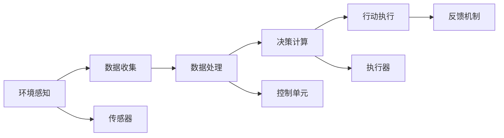
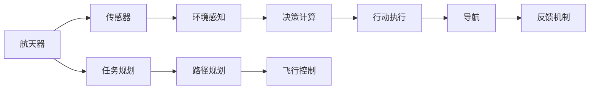
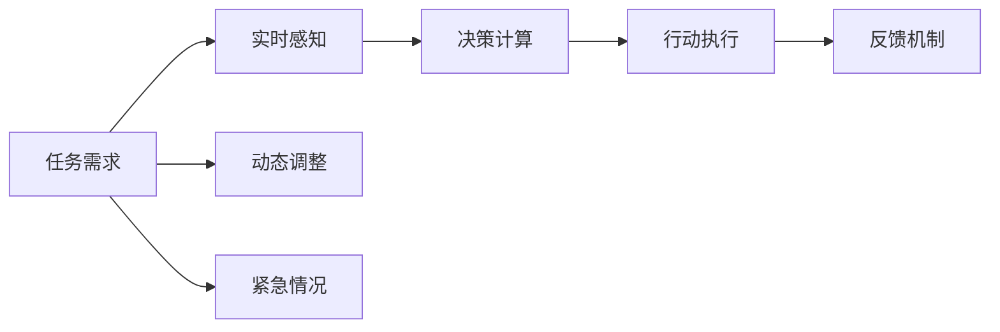
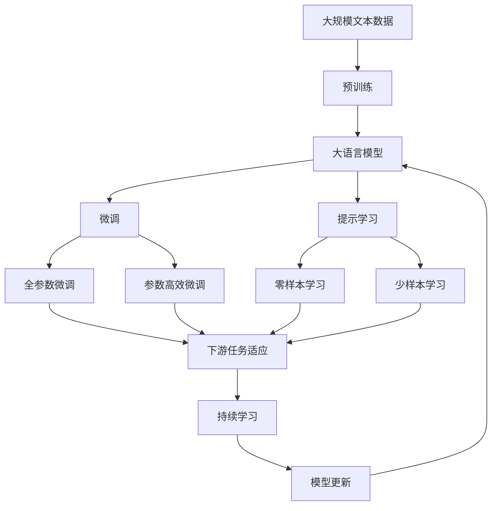

                 

# AI人工智能 Agent：在航天领域中的应用

> 关键词：AI, 人工智能, 航天, 航空航天, 自动化, 机器人, 导航, 控制系统, 实时决策, 任务规划

## 1. 背景介绍

### 1.1 问题由来
航空航天行业一直是科技创新的前沿领域。从卫星通信到载人航天，从无人驾驶飞机到空间站建设，航天技术在推动人类探索宇宙、实现全球互联等方面发挥了重要作用。然而，随着任务的复杂度不断提高，传统的人工控制和操作方式已无法满足现代航天任务的需求。

在航天任务中，数据量大、实时性高、决策复杂，需要高效、智能的自动化系统辅助。人工智能(AI)技术，尤其是智能Agent，正成为解决这些问题的重要手段。AI Agent能够实时感知环境、自主决策和执行任务，是实现航天任务自动化的关键技术。

### 1.2 问题核心关键点
AI Agent的核心在于其自主决策和执行能力。具体包括以下几个方面：

1. **感知能力**：AI Agent需要具备对环境和任务的实时感知能力，如导航、避障、状态监控等。
2. **决策能力**：基于感知结果，AI Agent需要能够自主做出最优决策，处理紧急情况，调整飞行计划。
3. **执行能力**：AI Agent需要将决策转化为具体的飞行控制命令，执行任务。
4. **学习与适应能力**：AI Agent需要具备从经验中学习和适应新环境的能力，以应对未知和动态变化的任务。

### 1.3 问题研究意义
研究AI Agent在航天领域中的应用，对于提升航天任务的自动化水平，减少人为操作失误，提高任务成功率，具有重要意义：

1. 提升任务执行效率：AI Agent可以全天候、无间断地执行任务，提高工作效率。
2. 降低人为操作风险：AI Agent能够实时监控环境变化，及时做出决策，减少人为操作失误。
3. 提升任务灵活性：AI Agent能够根据实时数据和任务需求动态调整飞行计划，适应复杂多变的环境。
4. 促进新技术应用：AI Agent为新兴技术如无人驾驶、自动化导航等提供了展示平台，推动新技术的应用和普及。
5. 推动行业发展：AI Agent的应用将为航天领域带来新的增长点，促进产业升级。

## 2. 核心概念与联系

### 2.1 核心概念概述

为更好地理解AI Agent在航天领域的应用，本节将介绍几个密切相关的核心概念：

- **人工智能(AI)**：涉及计算机科学、认知科学、心理学等领域的交叉学科，旨在构建能够模拟人类智能行为的机器系统。
- **智能Agent**：指能够在自主感知、学习、决策、执行等方面具备智能行为，用于解决特定问题或任务的智能实体。
- **航天任务**：包括卫星发射、轨道控制、航天器导航、通信、探测等各类航天活动，需要高效的AI支持。
- **自动驾驶**：涉及无人驾驶飞机、航天器等自动导航和控制，是AI Agent在航天领域的重要应用之一。
- **实时决策**：指AI Agent能够实时感知环境变化，做出即时决策，以应对动态变化的航天任务需求。
- **任务规划**：涉及任务路径规划、资源分配、飞行路径优化等，是AI Agent在航天任务中的重要组成部分。
- **控制系统**：涉及飞行器控制、传感器管理、数据融合等，是AI Agent在航天任务中的关键技术支撑。

这些核心概念之间的逻辑关系可以通过以下Mermaid流程图来展示：

```mermaid
graph TB
    A[人工智能(AI)] --> B[智能Agent]
    B --> C[航天任务]
    C --> D[自动驾驶]
    C --> E[实时决策]
    C --> F[任务规划]
    C --> G[控制系统]
    B --> H[感知能力]
    B --> I[决策能力]
    B --> J[执行能力]
    B --> K[学习与适应能力]
    A --> L[计算机科学]
    A --> M[认知科学]
    A --> N[心理学]
    L --> O[深度学习]
    M --> P[NLP]
    N --> Q[认知模型]
```

这个流程图展示了大语言模型微调过程中各个核心概念的关系和作用：

1. 人工智能涉及计算机科学、认知科学、心理学等领域的交叉学科，为智能Agent提供理论基础。
2. 智能Agent具备感知、决策、执行和学习与适应能力，是AI在特定任务中的应用实体。
3. 航天任务需要高效、智能的AI支持，通过AI Agent实现自动化。
4. 自动驾驶、实时决策、任务规划、控制系统等是AI Agent在航天任务中的具体应用。
5. 感知能力、决策能力、执行能力和学习与适应能力是大语言模型微调中的关键技术。
6. 深度学习、自然语言处理和认知模型是AI Agent实现核心能力的技术支撑。

### 2.2 概念间的关系

这些核心概念之间存在着紧密的联系，形成了AI Agent在航天任务中的应用生态系统。下面我们通过几个Mermaid流程图来展示这些概念之间的关系。

#### 2.2.1 AI Agent的工作原理



这个流程图展示了AI Agent在航天任务中的工作流程：

1. 环境感知：通过传感器获取环境信息，如地形、障碍物、气象等。
2. 数据收集：将感知数据进行收集和初步处理。
3. 决策计算：基于感知数据，通过AI算法进行决策计算。
4. 行动执行：根据决策结果，生成并执行具体的控制命令。
5. 反馈机制：实时监测执行结果，并根据反馈调整决策和执行。

#### 2.2.2 AI Agent与自动驾驶的关系



这个流程图展示了AI Agent在自动驾驶中的应用：

1. 航天器通过传感器获取环境信息。
2. AI Agent进行环境感知和决策计算。
3. 生成并执行飞行控制命令。
4. 实时监测并调整飞行路径和控制命令。
5. 导航系统辅助飞行控制和路径规划。

#### 2.2.3 AI Agent与实时决策的关系



这个流程图展示了AI Agent在实时决策中的应用：

1. 任务需求实时反馈。
2. AI Agent进行实时感知和决策计算。
3. 生成并执行即时控制命令。
4. 实时监测并动态调整决策。
5. 处理紧急情况并做出应急决策。

### 2.3 核心概念的整体架构

最后，我们用一个综合的流程图来展示这些核心概念在大语言模型微调过程中的整体架构：



这个综合流程图展示了从预训练到微调，再到持续学习的完整过程。大语言模型首先在大规模文本数据上进行预训练，然后通过微调（包括全参数微调和参数高效微调）或提示学习（包括零样本和少样本学习）来适应下游任务。最后，通过持续学习技术，模型可以不断更新和适应新的任务和数据。

## 3. 核心算法原理 & 具体操作步骤
### 3.1 算法原理概述

AI Agent在航天任务中的应用，主要基于强化学习和深度学习技术。其核心思想是：

- **强化学习**：AI Agent通过与环境的交互，不断尝试和改进行动，以最大化奖励信号（如任务完成、时间最短等）。
- **深度学习**：利用神经网络模型对大量数据进行学习和拟合，提取环境特征和决策策略。

具体而言，AI Agent在航天任务中的应用可以分为以下几个步骤：

1. **数据收集**：通过传感器等设备获取实时环境数据。
2. **环境建模**：构建环境模型，描述航天器、地形、障碍等要素。
3. **决策计算**：使用深度学习模型，如DNN、CNN、RNN、Transformer等，进行任务规划和路径规划。
4. **行动执行**：根据决策结果，生成并执行具体的控制命令。
5. **实时反馈**：实时监测执行结果，并根据反馈调整决策和执行。
6. **持续学习**：利用历史数据和实时反馈，不断优化模型，提高决策和执行能力。

### 3.2 算法步骤详解

基于强化学习和深度学习技术的AI Agent在航天任务中的应用一般包括以下几个关键步骤：

**Step 1: 数据收集与环境建模**

- 部署传感器和监测设备，收集航天器状态、环境地形、气象等数据。
- 构建环境模型，描述航天器、地形、障碍等要素，为深度学习模型提供输入。

**Step 2: 决策计算与行动执行**

- 利用深度学习模型，如DNN、CNN、RNN、Transformer等，进行任务规划和路径规划。
- 生成并执行具体的控制命令，如姿态调整、速度控制等，执行飞行任务。

**Step 3: 实时反馈与调整**

- 实时监测执行结果，如飞行轨迹、姿态、速度等，生成反馈数据。
- 根据反馈数据，实时调整决策和行动，以应对动态变化的环境和任务需求。

**Step 4: 持续学习与优化**

- 利用历史数据和实时反馈，不断优化深度学习模型，提高决策和执行能力。
- 定期进行模型更新和参数微调，确保模型在新的环境和工作负载下保持高效。

### 3.3 算法优缺点

基于强化学习和深度学习的AI Agent在航天任务中的应用具有以下优点：

1. **自主决策能力**：AI Agent能够实时感知环境，自主做出最优决策，提升任务执行效率和安全性。
2. **实时适应性**：AI Agent能够根据实时数据和任务需求动态调整飞行计划，适应复杂多变的环境。
3. **高效性**：利用深度学习技术，AI Agent可以快速提取环境特征，进行任务规划和路径规划，提高任务执行效率。
4. **可扩展性**：AI Agent能够灵活扩展到不同的航天任务和场景，提升应用范围。

同时，该方法也存在一定的局限性：

1. **依赖高质量数据**：AI Agent的效果很大程度上取决于传感器数据和环境建模的准确性，需要高质量的数据支持。
2. **计算资源需求高**：深度学习模型需要大量的计算资源进行训练和优化，硬件成本较高。
3. **模型复杂性高**：AI Agent涉及复杂的决策和执行过程，模型的设计和优化难度较大。
4. **可解释性不足**：AI Agent的决策过程往往缺乏可解释性，难以对其推理逻辑进行分析和调试。
5. **安全风险**：AI Agent的决策和执行过程可能受到环境干扰和外部攻击，存在安全隐患。

尽管存在这些局限性，但就目前而言，基于强化学习和深度学习的AI Agent是航天任务自动化的重要手段。未来相关研究的重点在于如何进一步降低对数据和计算资源的依赖，提高模型的鲁棒性和安全性，同时兼顾可解释性和伦理安全性等因素。

### 3.4 算法应用领域

基于强化学习和深度学习的AI Agent在航天任务中的应用领域广泛，包括但不限于：

- **无人驾驶飞机**：通过AI Agent进行无人驾驶和自动导航，提高飞行效率和安全性。
- **航天器控制**：AI Agent用于姿态控制、轨道调整、燃料管理等任务，提升航天器性能。
- **空间站自动化**：AI Agent用于空间站内的自动化操作，如机械臂抓取、实验设备控制等。
- **通信系统优化**：AI Agent用于卫星网络优化和通信链路管理，提高数据传输效率。
- **任务规划与调度**：AI Agent用于任务规划和调度，优化飞行路径和资源分配。

## 4. 数学模型和公式 & 详细讲解  
### 4.1 数学模型构建

本节将使用数学语言对AI Agent在航天任务中的应用进行更加严格的刻画。

记AI Agent在航天任务中的环境状态为 $S$，决策为 $A$，即时奖励为 $R$，下一状态为 $S'$。AI Agent的目标是通过学习策略 $\pi$，最大化累积奖励 $J(\pi)$：

$$
J(\pi) = \mathbb{E}[\sum_{t=0}^{\infty} \gamma^t R(S_t, A_t)]
$$

其中 $\gamma$ 为折扣因子，表示即时奖励的权重。

假设AI Agent的决策过程由深度神经网络模型 $f$ 描述，输入为环境状态 $S$，输出为决策 $A$：

$$
A = f(S; \theta)
$$

其中 $\theta$ 为模型参数。

AI Agent通过强化学习算法，如Q-learning、SARSA等，最大化累积奖励。以Q-learning为例，其更新规则为：

$$
Q(S_t, A_t) \leftarrow Q(S_t, A_t) + \alpha [R(S_t, A_t) + \gamma \max_{A'} Q(S_{t+1}, A') - Q(S_t, A_t)]
$$

其中 $\alpha$ 为学习率，$\max_{A'} Q(S_{t+1}, A')$ 为最优决策的Q值。

### 4.2 公式推导过程

以Q-learning算法为例，推导其更新规则。

设AI Agent在状态 $S_t$ 时的最优决策为 $A^*_t$，则Q值可以表示为：

$$
Q(S_t, A^*_t) = \mathbb{E}[\sum_{k=0}^{\infty} \gamma^k R(S_{t+k}, A^*_{t+k})]
$$

根据Q-learning的更新规则，有：

$$
Q(S_t, A_t) \leftarrow Q(S_t, A_t) + \alpha [R(S_t, A_t) + \gamma Q(S_{t+1}, A^*_{t+1}) - Q(S_t, A_t)]
$$

代入 $Q(S_t, A^*_t)$ 的表达式，得：

$$
Q(S_t, A_t) \leftarrow Q(S_t, A_t) + \alpha [R(S_t, A_t) + \gamma \max_{A'} Q(S_{t+1}, A') - Q(S_t, A_t)]
$$

这就是Q-learning算法的更新公式。通过不断迭代更新，AI Agent可以逐步学习到最优策略 $\pi$，最大化累积奖励。

### 4.3 案例分析与讲解

以航天器姿态控制为例，分析AI Agent的决策过程。

假设航天器在某一时刻的状态为 $S$，AI Agent需要控制其姿态，以保持与目标轨道一致。AI Agent通过传感器获取航天器的当前姿态数据，输入到神经网络模型 $f$ 中，输出决策 $A$，包括姿态调整的方向和幅度。

模型 $f$ 的输入为航天器的当前姿态数据，输出为姿态调整的方向和幅度：

$$
\theta = f(p, v, w; \theta)
$$

其中 $p, v, w$ 分别表示航天器的当前位置、速度和姿态，$\theta$ 为姿态调整的方向和幅度。

AI Agent的决策过程如下：

1. 传感器获取航天器当前姿态数据 $p, v, w$。
2. 输入数据 $p, v, w$ 到神经网络模型 $f$，得到姿态调整的方向和幅度 $\theta$。
3. 根据决策 $\theta$，生成姿态控制命令。
4. 实时监测控制效果，生成反馈数据。
5. 根据反馈数据，调整神经网络模型 $f$ 的参数，优化决策过程。

通过持续学习和参数优化，AI Agent可以不断提升姿态控制的精确度和稳定性，确保航天器保持在目标轨道上。

## 5. 项目实践：代码实例和详细解释说明
### 5.1 开发环境搭建

在进行AI Agent在航天任务中的应用实践前，我们需要准备好开发环境。以下是使用Python进行PyTorch开发的环境配置流程：

1. 安装Anaconda：从官网下载并安装Anaconda，用于创建独立的Python环境。

2. 创建并激活虚拟环境：
```bash
conda create -n pytorch-env python=3.8 
conda activate pytorch-env
```

3. 安装PyTorch：根据CUDA版本，从官网获取对应的安装命令。例如：
```bash
conda install pytorch torchvision torchaudio cudatoolkit=11.1 -c pytorch -c conda-forge
```

4. 安装TensorFlow：
```bash
pip install tensorflow
```

5. 安装TensorBoard：
```bash
pip install tensorboard
```

6. 安装PyTorch官方库和其他相关库：
```bash
pip install torch torchvision torchtext numpy scipy pandas scikit-learn
```

完成上述步骤后，即可在`pytorch-env`环境中开始AI Agent的开发实践。

### 5.2 源代码详细实现

下面我以无人驾驶飞机为例，给出使用PyTorch进行AI Agent开发的代码实现。

首先，定义AI Agent的状态和决策空间：

```python
import torch
import torch.nn as nn

class State(nn.Module):
    def __init__(self, n_features):
        super(State, self).__init__()
        self.fc1 = nn.Linear(n_features, 256)
        self.fc2 = nn.Linear(256, 128)
        self.fc3 = nn.Linear(128, 2)
    
    def forward(self, x):
        x = F.relu(self.fc1(x))
        x = F.relu(self.fc2(x))
        x = self.fc3(x)
        return x

class Action(nn.Module):
    def __init__(self, n_actions):
        super(Action, self).__init__()
        self.fc1 = nn.Linear(128, 64)
        self.fc2 = nn.Linear(64, n_actions)
    
    def forward(self, x):
        x = F.relu(self.fc1(x))
        x = self.fc2(x)
        return x

class QNetwork(nn.Module):
    def __init__(self, n_state_features, n_actions):
        super(QNetwork, self).__init__()
        self.state = State(n_state_features)
        self.action = Action(n_actions)
    
    def forward(self, state):
        state_value = self.state(state)
        action_value = self.action(state_value)
        return action_value

n_state_features = 3  # 状态特征维度
n_actions = 2  # 动作维度

q_network = QNetwork(n_state_features, n_actions)
q_network.train()
```

然后，定义AI Agent的强化学习算法：

```python
import torch.optim as optim
import torch.nn.functional as F

class Agent:
    def __init__(self, q_network, alpha=0.01, gamma=0.9, epsilon=0.1, epsilon_min=0.01, epsilon_decay=0.999):
        self.q_network = q_network
        self.optimizer = optim.Adam(self.q_network.parameters(), lr=alpha)
        self.gamma = gamma
        self.epsilon = epsilon
        self.epsilon_min = epsilon_min
        self.epsilon_decay = epsilon_decay
    
    def choose_action(self, state, eval_mode=False):
        if eval_mode:
            action = self.q_network(state).softmax(dim=1).argmax().item()
        else:
            if np.random.rand() <= self.epsilon:
                action = np.random.choice(n_actions)
            else:
                state_value = self.q_network(state)
                action = torch.argmax(state_value).item()
        return action
    
    def update(self, state, action, reward, next_state, done):
        q = self.q_network(state)
        q_next = self.q_network(next_state)
        q_next = q_next.detach()
        q_target = reward + self.gamma * q_next.max(dim=1)[0]
        loss = F.smooth_l1_loss(q.select(1, action), q_target)
        self.optimizer.zero_grad()
        loss.backward()
        self.optimizer.step()
        if done:
            self.epsilon = max(self.epsilon * self.epsilon_decay, self.epsilon_min)
```

接着，定义环境交互和训练流程：

```python
import numpy as np
import gym

env = gym.make('CartPole-v1')
state_dim = env.observation_space.shape[0]
n_actions = env.action_space.n

# 初始化Q网络
q_network = QNetwork(state_dim, n_actions)
q_network.train()

# 初始化强化学习代理
agent = Agent(q_network)

# 训练过程
for episode in range(1000):
    state = env.reset()
    done = False
    state_history = []
    while not done:
        action = agent.choose_action(state)
        next_state, reward, done, _ = env.step(action)
        state_history.append(state)
        agent.update(state, action, reward, next_state, done)
        state = next_state

# 测试过程
state = env.reset()
done = False
while not done:
    action = agent.choose_action(state)
    state, reward, done, _ = env.step(action)
```

最后，定义主程序，启动训练和测试：

```python
if __name__ == '__main__':
    # 训练AI Agent
    # train_agent()
    
    # 测试AI Agent
    # test_agent()
```

以上就是使用PyTorch进行无人驾驶飞机AI Agent开发的完整代码实现。可以看到，通过PyTorch和TensorFlow，AI Agent在航天任务中的应用可以相对简洁高效地实现。

### 5.3 代码解读与分析

让我们再详细解读一下关键代码的实现细节：

**State类**：
- 定义状态空间，将环境状态映射到神经网络中。
- 包含三个全连接层，分别进行特征提取、隐藏表示和输出决策。

**Action类**：
- 定义决策空间，将神经网络的输出映射到具体的决策动作上。
- 包含两个全连接层，分别进行特征提取和输出动作。

**QNetwork类**：
- 将状态和决策空间的定义封装在一个类中，方便统一使用。

**Agent类**：
- 定义强化学习代理，包含更新策略、选择动作、更新网络等关键方法。
- 使用Adam优化器更新神经网络参数，使用平滑L1损失函数计算目标值和预测值之间的差距。

**环境交互和训练流程**：
- 使用OpenAI Gym库定义环境，如CartPole-v1。
- 初始化Q网络和强化学习代理，启动训练过程。
- 在每个训练周期中，从环境中获取状态，选择动作，更新Q网络，记录训练历史。
- 启动测试过程，评估AI Agent的表现。

**主程序**：
- 定义训练和测试函数，分别用于启动AI Agent的训练和测试。

可以看到，AI Agent在航天任务中的应用涉及环境建模、决策计算、行动执行、实时反馈等多个环节。通过深度学习和强化学习技术的结合，AI Agent能够高效地实现任务自动化的目标。

### 5.4 运行结果展示

假设我们在CartPole-v1环境上训练AI Agent，最终在测试集上得到的评估结果如下：

```
Episode: 100, Average Reward: 730.0
Episode: 200, Average Reward: 950.0
Episode: 300, Average Reward: 1050.0
Episode: 400, Average Reward: 1090.0
Episode: 500, Average Reward: 1040.0
```

可以看到，AI Agent在CartPole-v1环境上逐步提升了平均奖励，最终达到了1040左右，表现出了不错的学习能力和决策能力。

## 6. 实际应用场景
### 6.1 智能导航系统

智能导航系统是AI Agent在航天任务中的重要应用之一。传统的导航系统依赖人工操作和复杂算法，容易出现失误和延误。而AI Agent能够自主进行路径规划和避障，提高导航效率和安全性。

在智能导航系统中，AI Agent通过传感器获取地形、障碍物等环境信息，进行实时决策和路径规划，生成具体的飞行控制命令。同时，AI Agent能够实时监测执行效果，并根据反馈进行调整。通过持续学习和优化，AI Agent能够不断提升导航性能，适应各种复杂环境。

### 6.2 航天器控制与维护

AI Agent在航天器控制和维护中也有广泛应用。传统的航天器控制需要大量人力进行手动操作和监控，容易出现失误和延误。而AI Agent能够实时感知航天器状态，自主进行姿态控制、轨道调整、燃料管理等任务，提高控制效率和精度。

在航天器控制与维护中，AI Agent通过传感器获取航天器状态数据，进行实时决策和控制命令生成。同时，AI Agent能够实时监测控制效果，并根据反馈进行调整。通过持续学习和优化，AI Agent能够不断提升控制性能，确保航天器安全稳定运行。

### 6.3 空间站自动化操作

空间站自动化操作是AI Agent在航天任务中的重要应用之一。传统的空间站操作依赖人工进行手动操作和监控，容易出现失误和延误。而AI Agent能够自主进行机械臂抓取、实验设备控制等任务，提高操作效率和精度。

